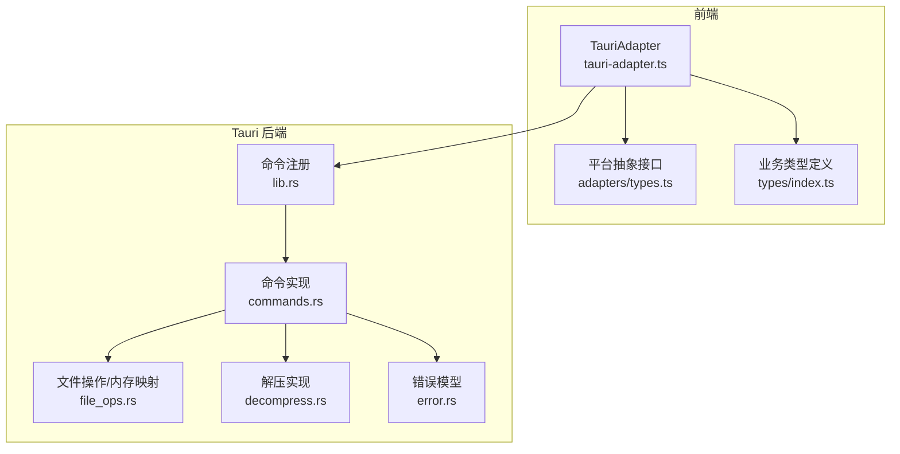
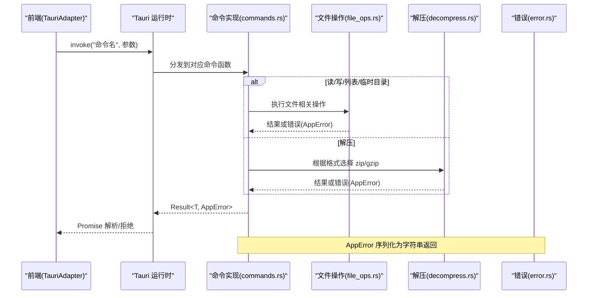
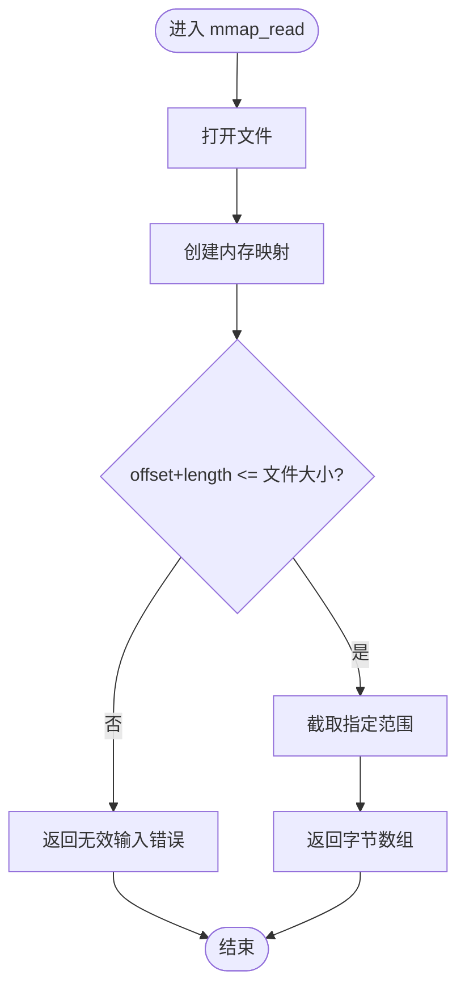
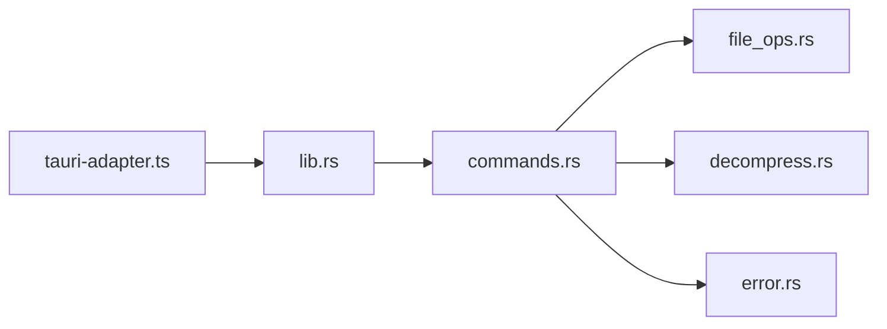

# IPC 命令接口

<cite>
**本文引用的文件**   
- [src-tauri/src/commands.rs](file://src-tauri/src/commands.rs)
- [src-tauri/src/file_ops.rs](file://src-tauri/src/file_ops.rs)
- [src-tauri/src/decompress.rs](file://src-tauri/src/decompress.rs)
- [src-tauri/src/error.rs](file://src-tauri/src/error.rs)
- [src-tauri/src/lib.rs](file://src-tauri/src/lib.rs)
- [src/adapters/tauri-adapter.ts](file://src/adapters/tauri-adapter.ts)
- [src/types/index.ts](file://src/types/index.ts)
- [src/adapters/types.ts](file://src/adapters/types.ts)
</cite>

## 目录
1. [简介](#简介)
2. [项目结构](#项目结构)
3. [核心组件](#核心组件)
4. [架构总览](#架构总览)
5. [详细组件分析](#详细组件分析)
6. [依赖关系分析](#依赖关系分析)
7. [性能考量](#性能考量)
8. [故障排查指南](#故障排查指南)
9. [结论](#结论)
10. [附录](#附录)

## 简介
本文件为 Hello-Tauri 的 IPC 命令接口提供完整 API 文档，覆盖以下 Tauri 命令：read_file、write_file、get_temp_dir、mmap_read、list_files、decompress。文档包含每个命令的参数说明、返回值格式、错误处理与传播机制、前端调用示例以及 TypeScript 类型定义，并给出版本兼容性与迁移建议。

## 项目结构
后端通过 Tauri 暴露命令，前端通过适配器统一调用。关键路径如下：
- 命令注册与入口：lib.rs
- 命令实现：commands.rs
- 文件操作与内存映射：file_ops.rs
- 解压逻辑：decompress.rs
- 错误模型：error.rs
- 前端适配层：adapters/tauri-adapter.ts
- 前端类型定义：types/index.ts、adapters/types.ts

图表来源
- [src-tauri/src/lib.rs:6-18](file://src-tauri/src/lib.rs#L6-L18)
- [src-tauri/src/commands.rs:5-52](file://src-tauri/src/commands.rs#L5-L52)
- [src-tauri/src/file_ops.rs:6-53](file://src-tauri/src/file_ops.rs#L6-L53)
- [src-tauri/src/decompress.rs:23-82](file://src-tauri/src/decompress.rs#L23-L82)
- [src-tauri/src/error.rs:3-18](file://src-tauri/src/error.rs#L3-L18)
- [src/adapters/tauri-adapter.ts:14-58](file://src/adapters/tauri-adapter.ts#L14-L58)
- [src/adapters/types.ts:3-11](file://src/adapters/types.ts#L3-L11)
- [src/types/index.ts:1-13](file://src/types/index.ts#L1-L13)

章节来源
- [src-tauri/src/lib.rs:6-18](file://src-tauri/src/lib.rs#L6-L18)
- [src-tauri/src/commands.rs:5-52](file://src-tauri/src/commands.rs#L5-L52)
- [src-tauri/src/file_ops.rs:6-53](file://src-tauri/src/file_ops.rs#L6-L53)
- [src-tauri/src/decompress.rs:23-82](file://src-tauri/src/decompress.rs#L23-L82)
- [src-tauri/src/error.rs:3-18](file://src-tauri/src/error.rs#L3-L18)
- [src/adapters/tauri-adapter.ts:14-58](file://src/adapters/tauri-adapter.ts#L14-L58)
- [src/adapters/types.ts:3-11](file://src/adapters/types.ts#L3-L11)
- [src/types/index.ts:1-13](file://src/types/index.ts#L1-L13)

## 核心组件
- 命令注册中心：在应用启动时集中注册所有 IPC 命令，确保前端可通过 invoke 调用。
- 命令实现层：封装文件系统读取/写入、临时目录获取、内存映射读取、目录遍历、解压等能力。
- 错误模型：统一的错误枚举，序列化后以字符串形式返回给前端。
- 前端适配器：将平台差异隐藏，统一使用 Tauri invoke 调用后端命令，并提供流式读取包装。

章节来源
- [src-tauri/src/lib.rs:6-18](file://src-tauri/src/lib.rs#L6-L18)
- [src-tauri/src/commands.rs:5-52](file://src-tauri/src/commands.rs#L5-L52)
- [src-tauri/src/error.rs:3-18](file://src-tauri/src/error.rs#L3-L18)
- [src/adapters/tauri-adapter.ts:14-58](file://src/adapters/tauri-adapter.ts#L14-L58)

## 架构总览
下图展示了从前端到后端的完整调用链路，包括异步处理与错误传播。

图表来源
- [src-tauri/src/lib.rs:6-18](file://src-tauri/src/lib.rs#L6-L18)
- [src-tauri/src/commands.rs:5-52](file://src-tauri/src/commands.rs#L5-L52)
- [src-tauri/src/file_ops.rs:6-53](file://src-tauri/src/file_ops.rs#L6-L53)
- [src-tauri/src/decompress.rs:23-82](file://src-tauri/src/decompress.rs#L23-L82)
- [src-tauri/src/error.rs:3-18](file://src-tauri/src/error.rs#L3-L18)
- [src/adapters/tauri-adapter.ts:14-58](file://src/adapters/tauri-adapter.ts#L14-L58)

## 详细组件分析

### read_file
- 功能：按路径读取文件内容，返回字节数组。
- 参数
  - path: string，目标文件路径。禁止包含“..”以防止路径穿越。
- 返回值
  - 成功：Uint8Array（前端适配器会将后端 number[] 转换为 Uint8Array）。
  - 失败：Promise 拒绝，错误信息为字符串（AppError 序列化后的描述）。
- 错误处理
  - 路径穿越：直接返回权限拒绝错误。
  - IO 异常：由底层 IO 错误转为 AppError::Io，再序列化为字符串。
- 异步机制
  - 命令为 async，内部使用 tokio 异步读取。
- 前端调用示例
  - 参考路径：[src/adapters/tauri-adapter.ts:15-19](file://src/adapters/tauri-adapter.ts#L15-L19)
- 类型定义
  - 无额外类型，返回值为 Uint8Array。

章节来源
- [src-tauri/src/commands.rs:5-14](file://src-tauri/src/commands.rs#L5-L14)
- [src-tauri/src/error.rs:3-18](file://src-tauri/src/error.rs#L3-L18)
- [src/adapters/tauri-adapter.ts:15-19](file://src/adapters/tauri-adapter.ts#L15-L19)

### write_file
- 功能：将字节数据写入指定路径。
- 参数
  - path: string，目标文件路径。
  - data: Uint8Array（前端），实际传输为 number[]。
- 返回值
  - 成功：void。
  - 失败：Promise 拒绝，错误信息为字符串。
- 错误处理
  - IO 异常：转为 AppError::Io。
- 异步机制
  - 命令为 async，使用 tokio 异步写入。
- 前端调用示例
  - 参考路径：[src/adapters/tauri-adapter.ts:21-24](file://src/adapters/tauri-adapter.ts#L21-L24)

章节来源
- [src-tauri/src/commands.rs:16-19](file://src-tauri/src/commands.rs#L16-L19)
- [src-tauri/src/error.rs:3-18](file://src-tauri/src/error.rs#L3-L18)
- [src/adapters/tauri-adapter.ts:21-24](file://src/adapters/tauri-adapter.ts#L21-L24)

### get_temp_dir
- 功能：返回系统临时目录路径。
- 参数：无。
- 返回值
  - 成功：string，临时目录路径。
  - 失败：Promise 拒绝，错误信息为字符串（当前实现不会抛出错误）。
- 异步机制
  - 命令为 async，但内部为同步获取系统临时目录。
- 前端调用示例
  - 参考路径：[src/adapters/tauri-adapter.ts:31-34](file://src/adapters/tauri-adapter.ts#L31-L34)

章节来源
- [src-tauri/src/commands.rs:21-25](file://src-tauri/src/commands.rs#L21-L25)
- [src/adapters/tauri-adapter.ts:31-34](file://src/adapters/tauri-adapter.ts#L31-L34)

### mmap_read
- 功能：基于内存映射读取文件的指定范围。
- 参数
  - path: string，目标文件路径。
  - offset: u64，起始偏移。
  - length: u64，读取长度。
- 返回值
  - 成功：Uint8Array，包含指定范围的字节。
  - 失败：Promise 拒绝，错误信息为字符串。
- 错误处理
  - 越界读取：返回无效输入错误（超出文件大小）。
  - IO 异常：转为 AppError::Io。
- 异步机制
  - 命令为同步（非 async），内部使用 memmap2 进行高效读取。
- 前端调用示例
  - 参考路径：[src/adapters/tauri-adapter.ts:41-45](file://src/adapters/tauri-adapter.ts#L41-L45)
- 算法流程

图表来源
- [src-tauri/src/commands.rs:27-30](file://src-tauri/src/commands.rs#L27-L30)
- [src-tauri/src/file_ops.rs:6-18](file://src-tauri/src/file_ops.rs#L6-L18)

章节来源
- [src-tauri/src/commands.rs:27-30](file://src-tauri/src/commands.rs#L27-L30)
- [src-tauri/src/file_ops.rs:6-18](file://src-tauri/src/file_ops.rs#L6-L18)
- [src/adapters/tauri-adapter.ts:41-45](file://src/adapters/tauri-adapter.ts#L41-L45)

### list_files
- 功能：递归列出目录下的所有文件和子目录元信息。
- 参数
  - dir: string，根目录路径。
- 返回值
  - 成功：FileEntry[]，每个元素包含 name、path、size、isDirectory。
  - 失败：Promise 拒绝，错误信息为字符串。
- 数据结构
  - FileEntry 字段：name、path、size、isDirectory、lastModified（可选）。
- 错误处理
  - IO 异常：转为 AppError::Io。
- 前端调用示例
  - 参考路径：[src/adapters/tauri-adapter.ts:26-29](file://src/adapters/tauri-adapter.ts#L26-L29)
- 类型定义
  - 参考路径：[src/types/index.ts:1-7](file://src/types/index.ts#L1-L7)

章节来源
- [src-tauri/src/commands.rs:32-35](file://src-tauri/src/commands.rs#L32-L35)
- [src-tauri/src/file_ops.rs:20-53](file://src-tauri/src/file_ops.rs#L20-L53)
- [src/types/index.ts:1-7](file://src/types/index.ts#L1-L7)
- [src/adapters/tauri-adapter.ts:26-29](file://src/adapters/tauri-adapter.ts#L26-L29)

### decompress
- 功能：对传入的压缩数据进行解压，支持 zip 与 gzip。
- 参数
  - data: Uint8Array（前端），实际传输为 number[]。
  - format: string，取值 "zip" 或 "gzip"。
  - outputDir: string，输出目录路径。
- 返回值
  - 成功：DecompressResult，包含 success、files、error。
  - 失败：Promise 拒绝，错误信息为字符串。
- 行为细节
  - 不支持的格式：返回 DecompressResult{success:false, files:[], error:"Unsupported format: ..."}。
  - zip：逐个条目解压，记录目录与文件元信息。
  - gzip：解压后生成名为 "decompressed" 的文件。
- 错误处理
  - 解压失败：AppError::Decompress，序列化为字符串。
  - IO 异常：AppError::Io。
- 前端调用示例
  - 参考路径：[src/adapters/tauri-adapter.ts:36-39](file://src/adapters/tauri-adapter.ts#L36-L39)
- 类型定义
  - 参考路径：[src/types/index.ts:9-13](file://src/types/index.ts#L9-L13)

章节来源
- [src-tauri/src/commands.rs:37-52](file://src-tauri/src/commands.rs#L37-L52)
- [src-tauri/src/decompress.rs:23-82](file://src-tauri/src/decompress.rs#L23-L82)
- [src/types/index.ts:9-13](file://src/types/index.ts#L9-L13)
- [src/adapters/tauri-adapter.ts:36-39](file://src/adapters/tauri-adapter.ts#L36-L39)

## 依赖关系分析
- 命令注册：lib.rs 中集中注册所有命令，确保前端可调用。
- 命令实现：commands.rs 作为门面，委托 file_ops.rs 与 decompress.rs 完成具体逻辑。
- 错误模型：error.rs 提供统一错误枚举，并在命令层被捕获和转换。
- 前端适配：tauri-adapter.ts 统一封装 invoke 调用，屏蔽平台差异。

图表来源
- [src-tauri/src/lib.rs:6-18](file://src-tauri/src/lib.rs#L6-L18)
- [src-tauri/src/commands.rs:5-52](file://src-tauri/src/commands.rs#L5-L52)
- [src-tauri/src/file_ops.rs:6-53](file://src-tauri/src/file_ops.rs#L6-L53)
- [src-tauri/src/decompress.rs:23-82](file://src-tauri/src/decompress.rs#L23-L82)
- [src-tauri/src/error.rs:3-18](file://src-tauri/src/error.rs#L3-L18)
- [src/adapters/tauri-adapter.ts:14-58](file://src/adapters/tauri-adapter.ts#L14-L58)

章节来源
- [src-tauri/src/lib.rs:6-18](file://src-tauri/src/lib.rs#L6-L18)
- [src-tauri/src/commands.rs:5-52](file://src-tauri/src/commands.rs#L5-L52)
- [src-tauri/src/file_ops.rs:6-53](file://src-tauri/src/file_ops.rs#L6-L53)
- [src-tauri/src/decompress.rs:23-82](file://src-tauri/src/decompress.rs#L23-L82)
- [src-tauri/src/error.rs:3-18](file://src-tauri/src/error.rs#L3-L18)
- [src/adapters/tauri-adapter.ts:14-58](file://src/adapters/tauri-adapter.ts#L14-L58)

## 性能考量
- mmap_read 使用内存映射，适合大文件随机片段读取，避免全量加载。
- read_file/write_file 使用 tokio 异步 I/O，提高并发吞吐。
- decompress 对 zip 逐条处理，注意大压缩包可能占用较多内存；gzip 一次性解码，需评估输入大小。
- 前端 streamRead 目前是全量读取后包装为 ReadableStream，后续可通过事件或插件实现分块流式传输。

## 故障排查指南
- 常见错误类型
  - IO 错误：文件不存在、权限不足、路径非法等。
  - 解压错误：格式不支持、压缩包损坏、写入失败等。
  - 越界读取：mmap_read 的 offset+length 超过文件大小。
- 错误传播方式
  - 后端 AppError 统一序列化为字符串，前端 Promise 拒绝时可获得该字符串。
- 定位步骤
  - 检查路径是否合法且存在。
  - 确认格式参数是否正确（zip/gzip）。
  - 校验 mmap_read 的偏移与长度是否合理。
  - 查看前端适配器日志与后端错误字符串。

章节来源
- [src-tauri/src/error.rs:3-18](file://src-tauri/src/error.rs#L3-L18)
- [src-tauri/src/commands.rs:5-52](file://src-tauri/src/commands.rs#L5-L52)
- [src-tauri/src/file_ops.rs:6-18](file://src-tauri/src/file_ops.rs#L6-L18)
- [src-tauri/src/decompress.rs:23-82](file://src-tauri/src/decompress.rs#L23-L82)
- [src/adapters/tauri-adapter.ts:14-58](file://src/adapters/tauri-adapter.ts#L14-L58)

## 结论
Hello-Tauri 的 IPC 命令提供了稳定的文件与解压能力，并通过统一错误模型简化了前后端交互。对于大文件或高并发场景，建议优先使用 mmap_read 与异步 I/O，并结合前端流式处理优化用户体验。

## 附录

### 命令清单与签名
- read_file(path: string): Promise<Uint8Array>
- write_file(path: string, data: Uint8Array): Promise<void>
- get_temp_dir(): Promise<string>
- mmap_read(path: string, offset: number, length: number): Promise<Uint8Array>
- list_files(dir: string): Promise<FileEntry[]>
- decompress(data: Uint8Array, format: string, outputDir: string): Promise<DecompressResult>

章节来源
- [src-tauri/src/commands.rs:5-52](file://src-tauri/src/commands.rs#L5-L52)
- [src/adapters/tauri-adapter.ts:14-58](file://src/adapters/tauri-adapter.ts#L14-L58)
- [src/types/index.ts:1-13](file://src/types/index.ts#L1-L13)

### 前端调用示例（路径引用）
- readFile：[src/adapters/tauri-adapter.ts:15-19](file://src/adapters/tauri-adapter.ts#L15-L19)
- writeFile：[src/adapters/tauri-adapter.ts:21-24](file://src/adapters/tauri-adapter.ts#L21-L24)
- getTempDir：[src/adapters/tauri-adapter.ts:31-34](file://src/adapters/tauri-adapter.ts#L31-L34)
- mmapRead：[src/adapters/tauri-adapter.ts:41-45](file://src/adapters/tauri-adapter.ts#L41-L45)
- listFiles：[src/adapters/tauri-adapter.ts:26-29](file://src/adapters/tauri-adapter.ts#L26-L29)
- decompress：[src/adapters/tauri-adapter.ts:36-39](file://src/adapters/tauri-adapter.ts#L36-L39)

### TypeScript 类型定义（路径引用）
- FileEntry：[src/types/index.ts:1-7](file://src/types/index.ts#L1-L7)
- DecompressResult：[src/types/index.ts:9-13](file://src/types/index.ts#L9-L13)
- 平台抽象接口：[src/adapters/types.ts:3-11](file://src/adapters/types.ts#L3-L11)

### 版本兼容性与迁移指南
- 当前后端使用 Tauri v2，命令注册与 invoke 行为遵循 v2 规范。
- 若升级 Tauri 版本，请检查：
  - 命令注册方式与 generate_handler 的使用是否变更。
  - invoke 的调用签名与参数传递方式是否变化。
  - 错误序列化策略是否保持一致。
- 迁移建议：
  - 保持命令名称不变，确保前端适配器无需修改。
  - 如需新增命令，建议在 commands.rs 中新增并在 lib.rs 中注册。
  - 更新前端类型定义以匹配新的返回结构。

章节来源
- [src-tauri/src/lib.rs:6-18](file://src-tauri/src/lib.rs#L6-L18)
- [src-tauri/src/commands.rs:5-52](file://src-tauri/src/commands.rs#L5-L52)
- [src/adapters/tauri-adapter.ts:14-58](file://src/adapters/tauri-adapter.ts#L14-L58)