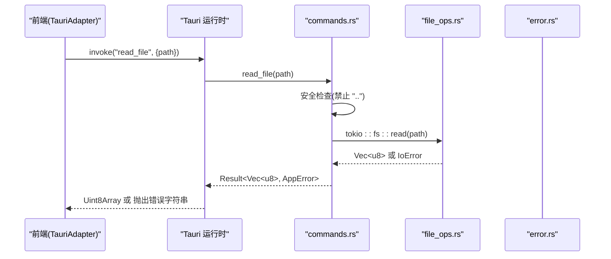
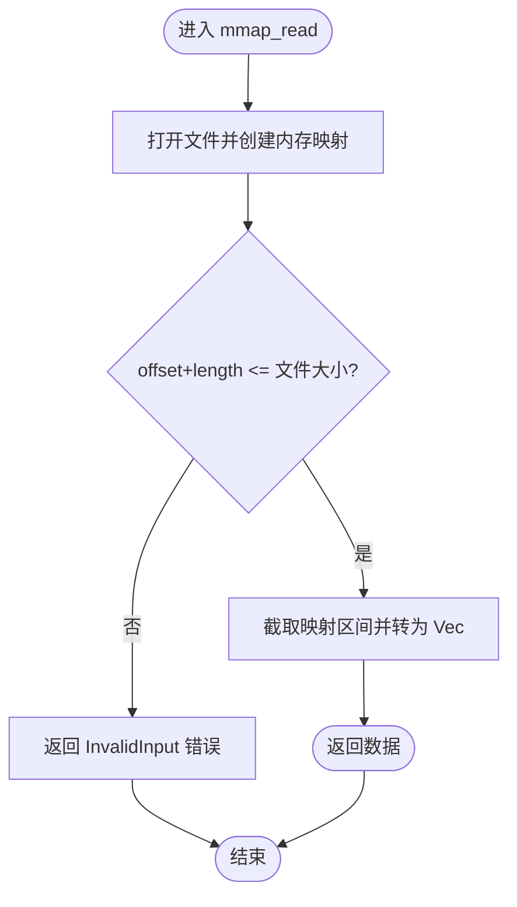
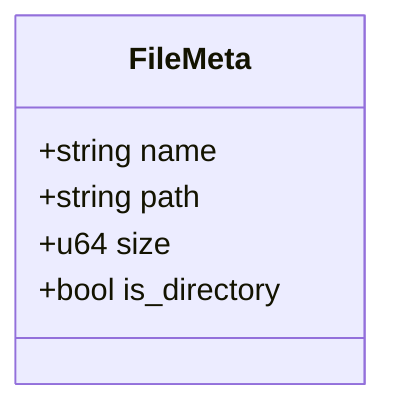
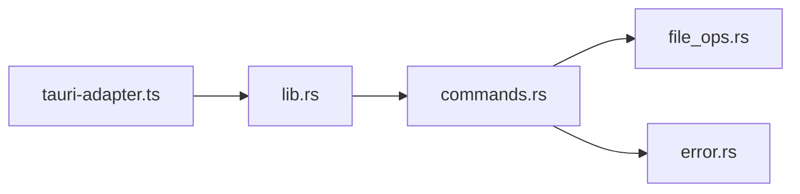

# 文件操作命令

<cite>
**本文引用的文件**
- [src-tauri/src/commands.rs](file://src-tauri/src/commands.rs)
- [src-tauri/src/file_ops.rs](file://src-tauri/src/file_ops.rs)
- [src-tauri/src/error.rs](file://src-tauri/src/error.rs)
- [src-tauri/src/lib.rs](file://src-tauri/src/lib.rs)
- [src/adapters/tauri-adapter.ts](file://src/adapters/tauri-adapter.ts)
</cite>

## 目录
1. [简介](#简介)
2. [项目结构](#项目结构)
3. [核心组件](#核心组件)
4. [架构总览](#架构总览)
5. [详细组件分析](#详细组件分析)
6. [依赖关系分析](#依赖关系分析)
7. [性能考虑](#性能考虑)
8. [故障排查指南](#故障排查指南)
9. [结论](#结论)
10. [附录：错误码与调试清单](#附录错误码与调试清单)

## 简介
本文件为 Hello-Tauri 应用中的“文件操作 IPC 命令”提供完整 API 文档，覆盖以下命令：read_file、write_file、get_temp_dir、mmap_read、list_files。内容包含实现原理、参数格式、返回值类型、错误处理机制、TypeScript 调用示例、性能与安全注意事项，以及内存映射读取的优势与路径遍历防护说明。

## 项目结构
后端通过 Tauri 的 invoke_handler 注册命令，前端通过 @tauri-apps/api/core.invoke 调用 Rust 侧命令。关键文件职责如下：
- src-tauri/src/lib.rs：Tauri 模块入口，集中注册所有 IPC 命令。
- src-tauri/src/commands.rs：定义并实现各 IPC 命令（read_file、write_file、get_temp_dir、mmap_read、list_files）。
- src-tauri/src/file_ops.rs：封装 mmap 读取与目录遍历等底层文件操作。
- src-tauri/src/error.rs：统一错误类型 AppError，序列化后返回给前端。
- src/adapters/tauri-adapter.ts：前端平台适配层，将 TypeScript 调用转换为 IPC 命令。

```mermaid
graph TB
subgraph "前端"
TA["TauriAdapter<br/>src/adapters/tauri-adapter.ts"]
end
subgraph "Tauri 运行时"
LIB["lib.rs<br/>注册命令"]
CMD["commands.rs<br/>IPC 命令实现"]
FOPS["file_ops.rs<br/>mmap/目录遍历"]
ERR["error.rs<br/>AppError"]
end
TA --> |invoke('read_file'|'write_file'|...) --> LIB
LIB --> CMD
CMD --> FOPS
CMD --> ERR
```

图表来源
- [src-tauri/src/lib.rs:6-18](file://src-tauri/src/lib.rs#L6-L18)
- [src-tauri/src/commands.rs:5-35](file://src-tauri/src/commands.rs#L5-L35)
- [src-tauri/src/file_ops.rs:6-53](file://src-tauri/src/file_ops.rs#L6-L53)
- [src-tauri/src/error.rs:3-12](file://src-tauri/src/error.rs#L3-L12)
- [src/adapters/tauri-adapter.ts:14-45](file://src/adapters/tauri-adapter.ts#L14-L45)

章节来源
- [src-tauri/src/lib.rs:1-19](file://src-tauri/src/lib.rs#L1-L19)
- [src-tauri/src/commands.rs:1-35](file://src-tauri/src/commands.rs#L1-L35)
- [src-tauri/src/file_ops.rs:1-53](file://src-tauri/src/file_ops.rs#L1-L53)
- [src-tauri/src/error.rs:1-19](file://src-tauri/src/error.rs#L1-L19)
- [src/adapters/tauri-adapter.ts:1-45](file://src/adapters/tauri-adapter.ts#L1-L45)

## 核心组件
- 命令注册中心：在 lib.rs 中通过 generate_handler! 将 commands.rs 中的函数暴露为 IPC 命令。
- 命令实现层：commands.rs 负责参数校验、安全策略（如路径遍历检查）、调用 file_ops.rs 或系统 API。
- 文件操作库：file_ops.rs 提供 mmap 读取与目录遍历能力。
- 错误模型：error.rs 定义 AppError，统一 IO、解压、未找到等错误，并以字符串形式序列化回前端。
- 前端适配器：tauri-adapter.ts 封装了各命令的 TypeScript 接口，负责二进制数据转换与调用。

章节来源
- [src-tauri/src/lib.rs:6-18](file://src-tauri/src/lib.rs#L6-L18)
- [src-tauri/src/commands.rs:5-35](file://src-tauri/src/commands.rs#L5-L35)
- [src-tauri/src/file_ops.rs:6-53](file://src-tauri/src/file_ops.rs#L6-L53)
- [src-tauri/src/error.rs:3-19](file://src-tauri/src/error.rs#L3-L19)
- [src/adapters/tauri-adapter.ts:14-45](file://src/adapters/tauri-adapter.ts#L14-L45)

## 架构总览
下图展示了从前端到后端的调用链路及关键交互点。



图表来源
- [src/adapters/tauri-adapter.ts:15-19](file://src/adapters/tauri-adapter.ts#L15-L19)
- [src-tauri/src/lib.rs:8-15](file://src-tauri/src/lib.rs#L8-L15)
- [src-tauri/src/commands.rs:5-14](file://src-tauri/src/commands.rs#L5-L14)
- [src-tauri/src/error.rs:3-12](file://src-tauri/src/error.rs#L3-L12)

## 详细组件分析

### 命令：read_file
- 功能：以字节数组形式读取指定路径的文件内容。
- 参数
  - path: string，目标文件的绝对或相对路径。
- 返回值
  - 成功：Uint8Array（前端）/ Vec<u8>（后端）。
  - 失败：抛出 AppError 序列化的错误字符串。
- 安全限制
  - 路径遍历防护：若 path 包含 ".."，直接拒绝并返回权限错误。
- 错误处理
  - 使用 AppError::Io 包装 std::io::Error，最终序列化为字符串返回前端。
- TypeScript 调用示例
  - 参考：[src/adapters/tauri-adapter.ts:15-19](file://src/adapters/tauri-adapter.ts#L15-L19)
- 性能考虑
  - 全量加载至内存，适合中小文件；超大文件建议使用 mmap_read 分块读取。
- 典型错误场景
  - 路径包含 ".."：被拦截并返回权限错误。
  - 文件不存在或无权限：IO 错误。

章节来源
- [src-tauri/src/commands.rs:5-14](file://src-tauri/src/commands.rs#L5-L14)
- [src-tauri/src/error.rs:3-12](file://src-tauri/src/error.rs#L3-L12)
- [src/adapters/tauri-adapter.ts:15-19](file://src/adapters/tauri-adapter.ts#L15-L19)

### 命令：write_file
- 功能：将字节数组写入指定路径的文件。
- 参数
  - path: string，目标文件路径。
  - data: number[]（前端）/ Vec<u8>（后端），待写入的二进制数据。
- 返回值
  - 成功：void。
  - 失败：抛出 AppError 序列化的错误字符串。
- 安全限制
  - 当前未对 path 做额外校验，建议上层传入受控路径。
- 错误处理
  - 使用 AppError::Io 包装 IO 异常。
- TypeScript 调用示例
  - 参考：[src/adapters/tauri-adapter.ts:21-24](file://src/adapters/tauri-adapter.ts#L21-L24)
- 性能考虑
  - 一次性写入，适合中小文件；大文件可考虑流式写入（需扩展）。
- 典型错误场景
  - 磁盘空间不足、权限不足、路径无效等。

章节来源
- [src-tauri/src/commands.rs:16-19](file://src-tauri/src/commands.rs#L16-L19)
- [src-tauri/src/error.rs:3-12](file://src-tauri/src/error.rs#L3-L12)
- [src/adapters/tauri-adapter.ts:21-24](file://src/adapters/tauri-adapter.ts#L21-L24)

### 命令：get_temp_dir
- 功能：获取系统临时目录路径。
- 参数：无。
- 返回值
  - 成功：string（临时目录路径）。
  - 失败：抛出 AppError 序列化的错误字符串（理论上极少发生）。
- TypeScript 调用示例
  - 参考：[src/adapters/tauri-adapter.ts:31-34](file://src/adapters/tauri-adapter.ts#L31-L34)
- 使用建议
  - 用于存放临时文件或中间结果，避免污染用户目录。

章节来源
- [src-tauri/src/commands.rs:21-25](file://src-tauri/src/commands.rs#L21-L25)
- [src/adapters/tauri-adapter.ts:31-34](file://src/adapters/tauri-adapter.ts#L31-L34)

### 命令：mmap_read
- 功能：基于内存映射的分段读取，支持按偏移和长度读取文件片段。
- 参数
  - path: string，目标文件路径。
  - offset: u64，起始偏移（字节）。
  - length: u64，读取长度（字节）。
- 返回值
  - 成功：Uint8Array（前端）/ Vec<u8>（后端）。
  - 失败：抛出 AppError 序列化的错误字符串。
- 实现要点
  - 打开文件并使用 memmap2 进行内存映射。
  - 校验读取范围是否超出文件大小，越界则返回输入错误。
- TypeScript 调用示例
  - 参考：[src/adapters/tauri-adapter.ts:41-45](file://src/adapters/tauri-adapter.ts#L41-L45)
- 优势与适用场景
  - 零拷贝/低拷贝读取，减少内核态与用户态之间的数据复制开销。
  - 适合大文件随机访问、按需加载、预览等场景。
- 错误处理
  - 越界读取：InvalidInput 错误。
  - 其他 IO 错误：由 AppError::Io 包装。
- 性能考虑
  - 避免一次性映射整个大文件；合理设置 offset/length。
  - 注意操作系统页大小对齐与内存占用。



图表来源
- [src-tauri/src/file_ops.rs:6-18](file://src-tauri/src/file_ops.rs#L6-L18)
- [src-tauri/src/commands.rs:27-30](file://src-tauri/src/commands.rs#L27-L30)

章节来源
- [src-tauri/src/file_ops.rs:6-18](file://src-tauri/src/file_ops.rs#L6-L18)
- [src-tauri/src/commands.rs:27-30](file://src-tauri/src/commands.rs#L27-L30)
- [src/adapters/tauri-adapter.ts:41-45](file://src/adapters/tauri-adapter.ts#L41-L45)

### 命令：list_files
- 功能：递归列出指定目录下的所有条目（含子目录），返回元信息列表。
- 参数
  - dir: string，根目录路径。
- 返回值
  - 成功：FileMeta[]（前端）/ Vec<FileMeta>（后端）。
  - 失败：抛出 AppError 序列化的错误字符串。
- 数据结构 FileMeta
  - name: string，文件名。
  - path: string，绝对或相对路径。
  - size: u64，文件大小（字节）。
  - is_directory: bool，是否为目录。
- TypeScript 调用示例
  - 参考：[src/adapters/tauri-adapter.ts:26-29](file://src/adapters/tauri-adapter.ts#L26-L29)
- 行为说明
  - 递归遍历目录树，收集每个条目的名称、路径、大小与类型。
- 错误处理
  - 目录不可读或权限不足：IO 错误。
- 性能考虑
  - 大目录可能产生大量元数据，建议分页或增量加载。



图表来源
- [src-tauri/src/file_ops.rs:26-33](file://src-tauri/src/file_ops.rs#L26-L33)

章节来源
- [src-tauri/src/commands.rs:32-35](file://src-tauri/src/commands.rs#L32-L35)
- [src-tauri/src/file_ops.rs:20-53](file://src-tauri/src/file_ops.rs#L20-L53)
- [src/adapters/tauri-adapter.ts:26-29](file://src/adapters/tauri-adapter.ts#L26-L29)

## 依赖关系分析
- 命令注册：lib.rs 将 commands.rs 中的函数注册为 IPC 命令。
- 命令实现：commands.rs 依赖 error.rs 的错误类型，并在部分命令中委托 file_ops.rs 完成具体操作。
- 前端适配：tauri-adapter.ts 通过 @tauri-apps/api/core.invoke 调用后端命令，并进行数据类型转换。



图表来源
- [src-tauri/src/lib.rs:6-18](file://src-tauri/src/lib.rs#L6-L18)
- [src-tauri/src/commands.rs:1-35](file://src-tauri/src/commands.rs#L1-L35)
- [src-tauri/src/file_ops.rs:1-53](file://src-tauri/src/file_ops.rs#L1-L53)
- [src-tauri/src/error.rs:1-19](file://src-tauri/src/error.rs#L1-L19)
- [src/adapters/tauri-adapter.ts:1-45](file://src/adapters/tauri-adapter.ts#L1-L45)

章节来源
- [src-tauri/src/lib.rs:1-19](file://src-tauri/src/lib.rs#L1-L19)
- [src-tauri/src/commands.rs:1-35](file://src-tauri/src/commands.rs#L1-L35)
- [src-tauri/src/file_ops.rs:1-53](file://src-tauri/src/file_ops.rs#L1-L53)
- [src-tauri/src/error.rs:1-19](file://src-tauri/src/error.rs#L1-L19)
- [src/adapters/tauri-adapter.ts:1-45](file://src/adapters/tauri-adapter.ts#L1-L45)

## 性能考虑
- read_file
  - 全量读取，内存占用与文件大小成正比。适用于小中型文件。
- write_file
  - 一次性写入，I/O 吞吐受磁盘与文件系统影响。
- get_temp_dir
  - 仅返回路径，性能开销可忽略。
- mmap_read
  - 零拷贝/低拷贝读取，适合大文件随机访问与预览。
  - 建议根据业务需求选择合理的 offset/length，避免过大单次映射导致内存压力。
- list_files
  - 递归遍历会产生大量元数据，建议在 UI 层做分页或懒加载。

## 故障排查指南
- 常见错误来源
  - 路径包含 ".."：read_file 会直接拒绝并返回权限错误。
  - 越界读取：mmap_read 的 offset+length 超过文件大小会返回输入错误。
  - 权限不足或文件不存在：IO 错误。
- 定位步骤
  - 确认传入路径是否合法且存在。
  - 对于 mmap_read，校验 offset 与 length 是否合理。
  - 查看前端控制台抛出的错误字符串（AppError 已序列化为字符串）。
- 日志与调试
  - 在后端命令中添加必要日志（如需），或在测试用例中验证边界条件。
  - 使用 get_temp_dir 辅助定位临时目录问题。

章节来源
- [src-tauri/src/commands.rs:5-14](file://src-tauri/src/commands.rs#L5-L14)
- [src-tauri/src/file_ops.rs:6-18](file://src-tauri/src/file_ops.rs#L6-L18)
- [src-tauri/src/error.rs:3-12](file://src-tauri/src/error.rs#L3-L12)

## 结论
上述五个文件操作命令覆盖了常见的读写、临时目录获取、大文件分段读取与目录遍历需求。通过统一的 AppError 错误模型与前端适配层，前后端交互清晰稳定。针对大文件场景推荐使用 mmap_read，结合合理的 offset/length 控制内存与 I/O 开销。路径遍历防护已在 read_file 中实现，确保基本安全性。

## 附录：错误码与调试清单
- 错误模型
  - AppError::Io：IO 相关错误（如权限不足、文件不存在、磁盘错误等）。
  - AppError::Decompress：解压相关错误（非本次重点）。
  - AppError::NotFound：未找到错误（当前未直接使用）。
- 错误序列化
  - AppError 实现了 Serialize，返回前端的错误为字符串描述。
- 调试清单
  - 检查路径合法性与权限。
  - 校验 mmap_read 的 offset/length 范围。
  - 对比前端传递的 data 与后端接收到的 data 长度一致性。
  - 使用 get_temp_dir 验证临时目录可用性与写入权限。

章节来源
- [src-tauri/src/error.rs:3-19](file://src-tauri/src/error.rs#L3-L19)