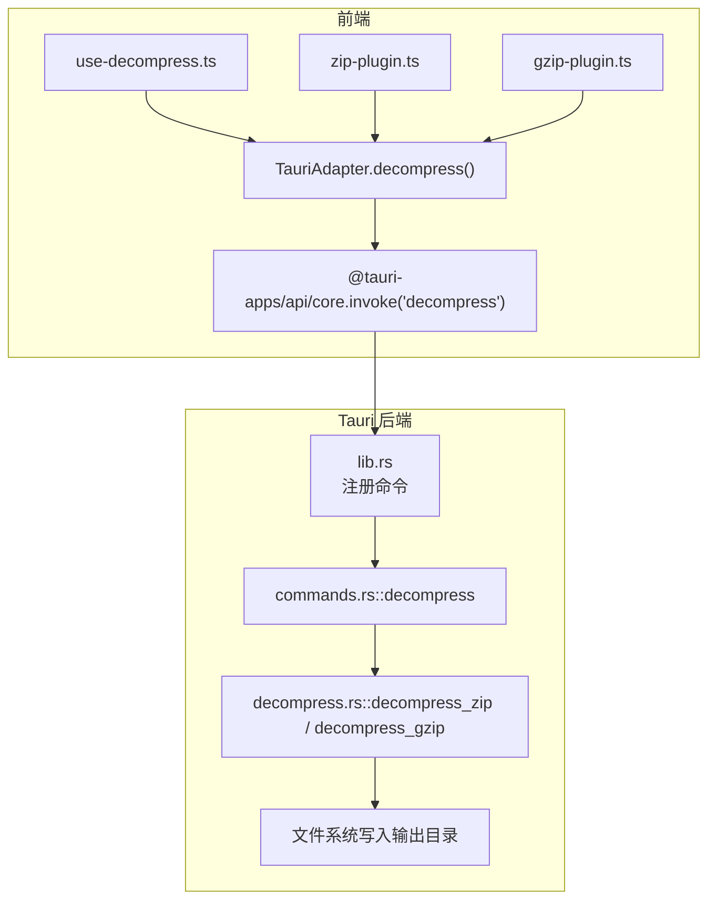
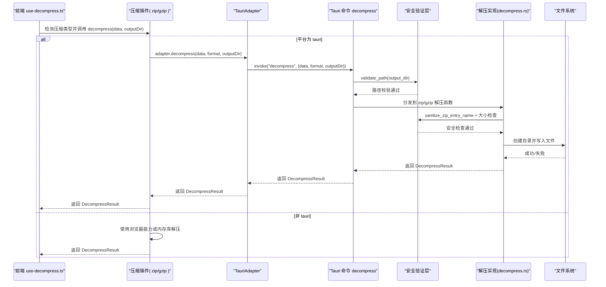
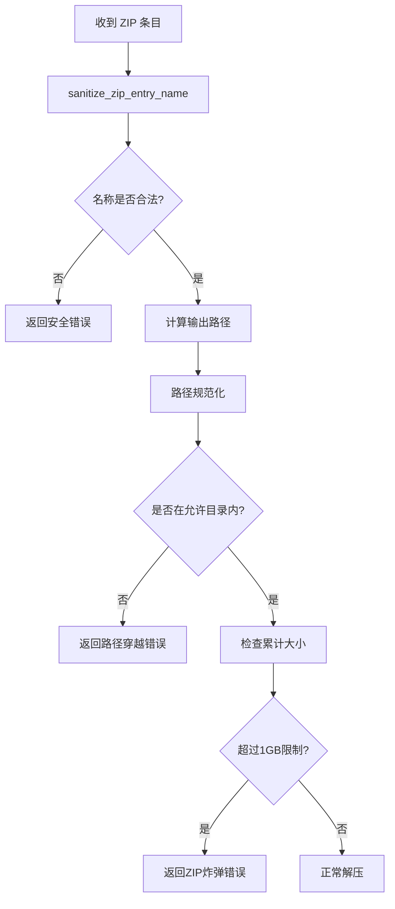
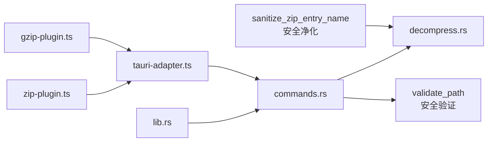

# 解压处理命令

<cite>
**本文引用的文件**   
- [commands.rs](file://src-tauri/src/commands.rs)
- [decompress.rs](file://src-tauri/src/decompress.rs)
- [error.rs](file://src-tauri/src/error.rs)
- [lib.rs](file://src-tauri/src/lib.rs)
- [tauri-adapter.ts](file://src/adapters/tauri-adapter.ts)
- [zip-plugin.ts](file://src/plugins/compression/zip-plugin.ts)
- [gzip-plugin.ts](file://src/plugins/compression/gzip-plugin.ts)
- [use-decompress.ts](file://src/composables/use-decompress.ts)
- [index.ts](file://src/types/index.ts)
</cite>

## 更新摘要
**变更内容**   
- 新增 ZIP 炸弹防护机制，实现1GB累计大小限制
- 增强路径遍历攻击防护，新增 sanitize_zip_entry_name 函数
- GZIP 解压优化为流式写入，显著减少内存占用
- 强化 Zip Slip 保护，完善路径规范化检查
- 新增详细的安全错误处理和日志记录

## 目录
1. [简介](#简介)
2. [项目结构](#项目结构)
3. [核心组件](#核心组件)
4. [架构总览](#架构总览)
5. [详细组件分析](#详细组件分析)
6. [安全增强特性](#安全增强特性)
7. [依赖关系分析](#依赖关系分析)
8. [性能与内存考量](#性能与内存考量)
9. [故障排查指南](#故障排查指南)
10. [结论](#结论)
11. [附录：API 参考与类型定义](#附录api-参考与类型定义)

## 简介
本章节面向 Hello-Tauri 的"解压处理"IPC 命令，提供完整的前后端 API 文档。重点覆盖以下方面：
- 支持的压缩格式：ZIP、GZIP
- 命令参数与返回结果结构
- 输出目录结构与命名约定
- **安全增强特性**：Zip Slip 防护、ZIP 炸弹防御、路径遍历攻击防护
- 错误处理策略
- 前端调用示例与 TypeScript 类型定义（含 DecompressResult 字段说明）
- 大文件处理现状与优化建议

## 项目结构
与解压处理相关的代码分布在 Tauri 后端（Rust）与前端（TypeScript/Vue）两侧：
- 后端通过 Tauri 暴露 IPC 命令 decompress，内部调用 Rust 解压逻辑
- 前端通过平台适配器（TauriAdapter）调用后端命令，并在插件层进行格式识别与桥接

图表来源
- [lib.rs:17-29](file://src-tauri/src/lib.rs#L17-L29)
- [commands.rs:172-190](file://src-tauri/src/commands.rs#L172-L190)
- [decompress.rs:38-140](file://src-tauri/src/decompress.rs#L38-L140)
- [tauri-adapter.ts:46-50](file://src/adapters/tauri-adapter.ts#L46-L50)
- [zip-plugin.ts:12-17](file://src/plugins/compression/zip-plugin.ts#L12-L17)
- [gzip-plugin.ts:12-21](file://src/plugins/compression/gzip-plugin.ts#L12-L21)

章节来源
- [lib.rs:17-29](file://src-tauri/src/lib.rs#L17-L29)
- [commands.rs:172-190](file://src-tauri/src/commands.rs#L172-L190)
- [decompress.rs:38-140](file://src-tauri/src/decompress.rs#L38-L140)
- [tauri-adapter.ts:46-50](file://src/adapters/tauri-adapter.ts#L46-L50)
- [zip-plugin.ts:12-17](file://src/plugins/compression/zip-plugin.ts#L12-L17)
- [gzip-plugin.ts:12-21](file://src/plugins/compression/gzip-plugin.ts#L12-L21)

## 核心组件
- Tauri 命令层：负责接收前端请求、路由到具体解压实现、封装统一返回结构
- 解压实现层：分别实现 ZIP 与 GZIP 解压逻辑，并写入目标目录
- **安全验证层**：新增路径净化、大小限制和 Zip Slip 防护
- 前端适配器：将前端调用转换为 Tauri IPC 调用
- 插件层：根据文件名后缀选择对应插件，在 Tauri 模式下委托给后端命令

章节来源
- [commands.rs:172-190](file://src-tauri/src/commands.rs#L172-L190)
- [decompress.rs:26-36](file://src-tauri/src/decompress.rs#L26-36)
- [decompress.rs:38-140](file://src-tauri/src/decompress.rs#L38-L140)
- [tauri-adapter.ts:46-50](file://src/adapters/tauri-adapter.ts#L46-L50)
- [zip-plugin.ts:12-17](file://src/plugins/compression/zip-plugin.ts#L12-L17)
- [gzip-plugin.ts:12-21](file://src/plugins/compression/gzip-plugin.ts#L12-L21)

## 架构总览
下图展示了从前端发起解压到后端落盘的全链路流程，包含安全验证环节。

图表来源
- [use-decompress.ts:23-84](file://src/composables/use-decompress.ts#L23-L84)
- [zip-plugin.ts:12-17](file://src/plugins/compression/zip-plugin.ts#L12-L17)
- [gzip-plugin.ts:12-21](file://src/plugins/compression/gzip-plugin.ts#L12-L21)
- [tauri-adapter.ts:46-50](file://src/adapters/tauri-adapter.ts#L46-L50)
- [commands.rs:172-190](file://src-tauri/src/commands.rs#L172-L190)
- [commands.rs:11-59](file://src-tauri/src/commands.rs#L11-L59)
- [decompress.rs:26-36](file://src-tauri/src/decompress.rs#L26-36)
- [decompress.rs:38-140](file://src-tauri/src/decompress.rs#L38-L140)

## 详细组件分析

### 命令：decompress
- 功能：接收二进制数据、压缩格式标识与输出目录，执行解压并将结果写入目标目录，返回统一的解压结果对象
- 支持格式：
  - "zip"：调用 ZIP 解压实现
  - "gzip"：调用 GZIP 解压实现
  - 其他值：返回 success=false 的错误结果
- 参数：
  - data：Uint8Array（前端以数字数组形式传递）
  - format：字符串，取值 "zip" 或 "gzip"
  - output_dir：字符串，目标输出目录路径
  - file_name：可选字符串，用于 GZIP 解压时指定输出文件名
- 返回：DecompressResult（见附录类型定义）
- 错误处理：
  - 不支持的格式：直接返回 success=false 的结果
  - 解压异常：捕获后包装为 success=false 并携带错误信息
  - IO 异常：由 AppError 统一序列化后返回
  - **安全异常**：路径穿越、ZIP 炸弹等安全威胁被明确拒绝

章节来源
- [commands.rs:172-190](file://src-tauri/src/commands.rs#L172-L190)
- [error.rs:3-19](file://src-tauri/src/error.rs#L3-L19)

### 解压实现：ZIP
- 行为：
  - 遍历 ZIP 条目，按原路径在输出目录重建目录树
  - 对目录项：创建目录，记录 is_directory=true，size=0
  - 对文件项：确保父目录存在，逐字节拷贝至磁盘，记录 size 与真实路径
- 输出目录结构：保持压缩包内相对路径不变
- **安全增强**：
  - 条目名称净化：拒绝包含反斜杠、.. 或控制字符的文件名
  - Zip Slip 防护：规范化路径后检查前缀，防止路径穿越
  - ZIP 炸弹防护：累计解压大小超过1GB时拒绝处理
- 错误处理：
  - 打开归档失败：返回 DecompressResult.success=false
  - 读取条目失败：返回 DecompressResult.success=false
  - 创建目录/写入文件失败：返回 DecompressResult.success=false
  - **安全违规**：返回具体的安全错误信息

章节来源
- [decompress.rs:38-117](file://src-tauri/src/decompress.rs#L38-L117)

### 解压实现：GZIP
- 行为：
  - **流式解码**：边解码边写盘，避免全量加载到内存
  - 将结果写入输出目录下的指定文件名（默认 "decompressed"）
  - 返回单条文件记录，is_directory=false，size 为解码后长度
- 输出目录结构：仅包含一个指定名称的文件
- **性能优化**：
  - 使用 io::copy 进行流式传输，内存占用恒定
  - 避免将整个解压结果加载到内存中
- 错误处理：
  - 解码失败：返回 DecompressResult.success=false
  - 写入失败：返回 DecompressResult.success=false

章节来源
- [decompress.rs:119-140](file://src-tauri/src/decompress.rs#L119-L140)

### 前端适配与插件桥接
- TauriAdapter.decompress：
  - 通过 @tauri-apps/api/core.invoke 调用后端命令 "decompress"
  - 将 Uint8Array 转为数字数组传递，避免跨语言边界问题
  - 支持可选的 fileName 参数用于 GZIP 解压
- 压缩插件：
  - zip-plugin：当运行于 Tauri 环境时，委托给 TauriAdapter.decompress(format="zip")
  - gzip-plugin：当运行于 Tauri 环境时，委托给 TauriAdapter.decompress(format="gzip", fileName=outputName)
  - 在非 Tauri 环境，各自使用浏览器能力或内存库进行解压（不落地磁盘）

章节来源
- [tauri-adapter.ts:46-50](file://src/adapters/tauri-adapter.ts#L46-L50)
- [zip-plugin.ts:12-17](file://src/plugins/compression/zip-plugin.ts#L12-L17)
- [gzip-plugin.ts:12-21](file://src/plugins/compression/gzip-plugin.ts#L12-L21)

### 前端编排与进度反馈
- use-decompress.startDecompress：
  - 更新任务状态为 running，设置初始进度
  - 读取 File 为 ArrayBuffer，构造 FileEntry 供插件识别
  - 通过插件注册表选择压缩插件并执行 safeDecompress
  - 成功后构建文件树，计算原始大小，更新完成进度
  - 失败时记录错误信息
- 注意：当前实现未向用户推送细粒度进度事件，仅在关键阶段更新整体进度百分比

章节来源
- [use-decompress.ts:23-84](file://src/composables/use-decompress.ts#L23-L84)

## 安全增强特性

### ZIP 炸弹防护
- **累计大小限制**：实现 MAX_TOTAL_SIZE = 1GB 的累计解压大小上限
- **实时检查**：在处理每个文件条目时累加文件大小，超过阈值立即拒绝
- **溢出保护**：使用 saturating_add 防止整数溢出导致的绕过

### 路径遍历攻击防护
- **sanitize_zip_entry_name 函数**：
  - 拒绝包含反斜杠的路径分隔符
  - 拒绝包含 ".." 的路径穿越尝试
  - 拒绝包含控制字符的恶意文件名
- **双重路径验证**：
  - 第一层：条目名称净化
  - 第二层：Zip Slip 防护，规范化路径后检查前缀

### Zip Slip 保护增强
- **路径规范化**：对输出路径进行 canonicalize 处理
- **前缀检查**：确保最终路径始终在允许的 output_dir 范围内
- **不存在文件处理**：对尚不存在的文件，先规范化父目录再拼接文件名

### 安全错误处理
- **明确的错误分类**：使用 AppError::Zip 专门处理安全相关错误
- **详细的错误信息**：包含具体的违规原因和被拒绝的文件名
- **日志记录**：所有安全违规都会被记录到日志系统

图表来源
- [decompress.rs:26-36](file://src-tauri/src/decompress.rs#L26-36)
- [decompress.rs:55-90](file://src-tauri/src/decompress.rs#L55-L90)
- [decompress.rs:73-78](file://src-tauri/src/decompress.rs#L73-L78)

章节来源
- [decompress.rs:6-7](file://src-tauri/src/decompress.rs#L6-L7)
- [decompress.rs:26-36](file://src-tauri/src/decompress.rs#L26-36)
- [decompress.rs:55-90](file://src-tauri/src/decompress.rs#L55-L90)
- [decompress.rs:73-78](file://src-tauri/src/decompress.rs#L73-L78)
- [error.rs:9-10](file://src-tauri/src/error.rs#L9-L10)

## 依赖关系分析
- 命令注册：lib.rs 中集中注册所有 Tauri 命令，包括 decompress
- 命令路由：commands.rs 根据 format 分派到具体解压函数
- 解压实现：decompress.rs 依赖 zip 与 flate2 库进行解压
- **安全模块**：commands.rs 中的 validate_path 函数提供通用路径验证
- 前端桥接：tauri-adapter.ts 作为 IPC 客户端；zip/gzip 插件在 Tauri 模式下复用该适配器

图表来源
- [lib.rs:17-29](file://src-tauri/src/lib.rs#L17-L29)
- [commands.rs:172-190](file://src-tauri/src/commands.rs#L172-L190)
- [commands.rs:11-59](file://src-tauri/src/commands.rs#L11-L59)
- [decompress.rs:26-36](file://src-tauri/src/decompress.rs#L26-36)
- [decompress.rs:38-140](file://src-tauri/src/decompress.rs#L38-L140)
- [tauri-adapter.ts:46-50](file://src/adapters/tauri-adapter.ts#L46-L50)
- [zip-plugin.ts:12-17](file://src/plugins/compression/zip-plugin.ts#L12-L17)
- [gzip-plugin.ts:12-21](file://src/plugins/compression/gzip-plugin.ts#L12-L21)

章节来源
- [lib.rs:17-29](file://src-tauri/src/lib.rs#L17-L29)
- [commands.rs:172-190](file://src-tauri/src/commands.rs#L172-L190)
- [commands.rs:11-59](file://src-tauri/src/commands.rs#L11-L59)
- [decompress.rs:26-36](file://src-tauri/src/decompress.rs#L26-36)
- [decompress.rs:38-140](file://src-tauri/src/decompress.rs#L38-L140)
- [tauri-adapter.ts:46-50](file://src/adapters/tauri-adapter.ts#L46-L50)
- [zip-plugin.ts:12-17](file://src/plugins/compression/zip-plugin.ts#L12-L17)
- [gzip-plugin.ts:12-21](file://src/plugins/compression/gzip-plugin.ts#L12-L21)

## 性能与内存考量
- **GZIP 流式优化**：
  - 使用 io::copy 进行流式传输，内存占用恒定
  - 避免将整个解压结果加载到内存中
  - 适合处理大体积 GZIP 文件
- **ZIP 内存管理**：
  - 仍然需要读取整个 ZIP 文件到内存
  - 但通过流式写入减少中间缓冲
- **安全开销**：
  - 路径验证和大小检查的额外开销极小
  - 对用户体验影响可忽略不计
- **建议优化方向**：
  - 针对超大 ZIP 文件考虑增量解压
  - 在前端增加文件大小限制与用户提示
  - 考虑异步进度反馈机制

章节来源
- [decompress.rs:126-130](file://src-tauri/src/decompress.rs#L126-L130)
- [decompress.rs:82-90](file://src-tauri/src/decompress.rs#L82-L90)
- [use-decompress.ts:31-42](file://src/composables/use-decompress.ts#L31-L42)
- [tauri-adapter.ts:47-49](file://src/adapters/tauri-adapter.ts#L47-L49)

## 故障排查指南
- 常见错误与定位
  - 不支持的格式：检查传入的 format 是否为 "zip" 或 "gzip"
  - 解压失败：查看返回结果中的 error 字段，通常为底层库抛出的错误信息
  - 权限/路径错误：确认 output_dir 是否存在且具备写入权限
  - **安全错误**：检查是否触发路径穿越或 ZIP 炸弹防护
- 日志与调试
  - 前端：在 startDecompress 的 catch 分支打印错误堆栈
  - 后端：AppError 已序列化为字符串，可在前端统一展示
  - **安全日志**：所有安全违规都会被记录到日志系统
- 典型场景
  - ZIP 目录嵌套较深：确保父目录创建成功
  - GZIP 输出文件命名：始终为指定名称，若需自定义名称，应扩展后端实现
  - **安全违规**：检查文件名是否包含非法字符或路径穿越尝试

章节来源
- [commands.rs:172-190](file://src-tauri/src/commands.rs#L172-L190)
- [error.rs:3-19](file://src-tauri/src/error.rs#L3-L19)
- [use-decompress.ts:75-83](file://src/composables/use-decompress.ts#L75-L83)
- [decompress.rs:84-90](file://src-tauri/src/decompress.rs#L84-L90)
- [decompress.rs:73-78](file://src-tauri/src/decompress.rs#L73-L78)

## 结论
- 命令 decompress 提供了稳定的前后端解压接口，支持 ZIP 与 GZIP 两种格式
- **重大安全增强**：实现了全面的 ZIP 炸弹防护、路径遍历攻击防护和 Zip Slip 保护
- **性能优化**：GZIP 解压采用流式处理，显著降低内存占用
- 输出目录结构遵循压缩包内路径（ZIP）或固定文件名（GZIP）
- 当前实现为全量内存处理，适合中小体积文件；大文件场景建议后续引入流式方案
- 前端通过插件体系与平台适配器解耦，便于在不同环境下切换实现

## 附录：API 参考与类型定义

### IPC 命令：decompress
- 调用方式（前端）：
  - 通过 TauriAdapter.decompress(data, format, outputDir, fileName?) 间接调用
  - 或直接通过 @tauri-apps/api/core.invoke("decompress", { data, format, outputDir, fileName })
- 参数
  - data：Uint8Array（实际传输为 number[]）
  - format："zip" | "gzip"
  - output_dir：string（目标输出目录）
  - file_name：string?（可选，用于 GZIP 解压时指定输出文件名）
- 返回
  - DecompressResult（见下节类型定义）

章节来源
- [tauri-adapter.ts:46-50](file://src/adapters/tauri-adapter.ts#L46-L50)
- [commands.rs:172-190](file://src-tauri/src/commands.rs#L172-L190)

### 返回结构：DecompressResult
- 字段
  - success：boolean，是否成功
  - files：FileEntry[]，解压后的文件或目录清单
  - error：string?，失败时的错误描述
- 子类型：FileEntry
  - name：string，文件名或目录名
  - path：string，绝对路径（相对于 output_dir 拼接后的完整路径）
  - size：number，文件大小（目录为 0）
  - isDirectory：boolean，是否为目录
  - lastModified：number?，可选，最后修改时间戳

章节来源
- [decompress.rs:9-24](file://src-tauri/src/decompress.rs#L9-L24)
- [index.ts:1-23](file://src/types/index.ts#L1-L23)

### 输出目录结构
- ZIP：
  - 保持压缩包内的目录层级，逐项创建目录与文件
  - 每个目录项 with is_directory=true，size=0
  - 每个文件项 with is_directory=false，size=文件字节数
  - **安全限制**：所有文件必须位于指定的 output_dir 内
- GZIP：
  - 在 output_dir 下生成单个指定名称的文件
  - is_directory=false，size=解压后字节数
  - **流式处理**：内存占用恒定，适合大文件

章节来源
- [decompress.rs:92-117](file://src-tauri/src/decompress.rs#L92-L117)
- [decompress.rs:119-140](file://src-tauri/src/decompress.rs#L119-L140)

### 前端调用示例（步骤说明）
- 步骤
  - 选择文件并读取为 ArrayBuffer
  - 构造 FileEntry 用于插件识别
  - 通过插件注册表选择压缩插件
  - 在 Tauri 模式下调用 TauriAdapter.decompress
  - 解析返回的 DecompressResult，构建文件树并更新 UI
- 参考位置
  - 编排逻辑：use-decompress.ts
  - 插件桥接：zip-plugin.ts、gzip-plugin.ts
  - 平台适配：tauri-adapter.ts

章节来源
- [use-decompress.ts:23-84](file://src/composables/use-decompress.ts#L23-L84)
- [zip-plugin.ts:12-17](file://src/plugins/compression/zip-plugin.ts#L12-L17)
- [gzip-plugin.ts:12-21](file://src/plugins/compression/gzip-plugin.ts#L12-L21)
- [tauri-adapter.ts:46-50](file://src/adapters/tauri-adapter.ts#L46-L50)

### 类型定义汇总（TypeScript）
- DecompressResult
  - success：boolean
  - files：FileEntry[]
  - error：string?
- FileEntry
  - name：string
  - path：string
  - size：number
  - isDirectory：boolean
  - lastModified：number?

章节来源
- [index.ts:1-23](file://src/types/index.ts#L1-L23)