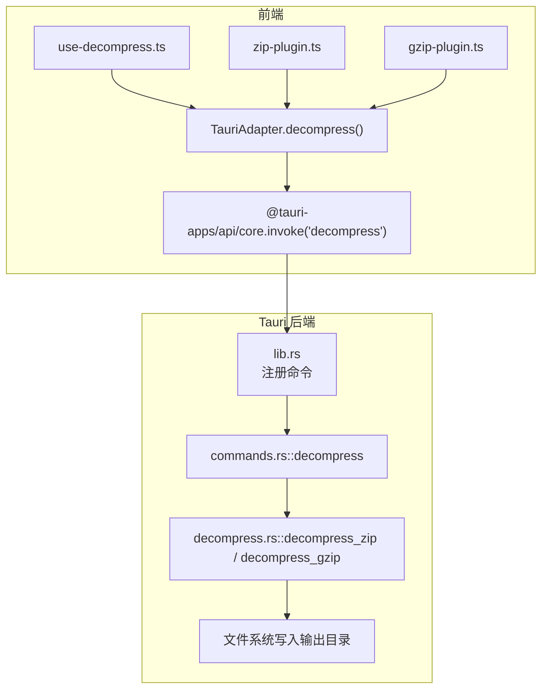
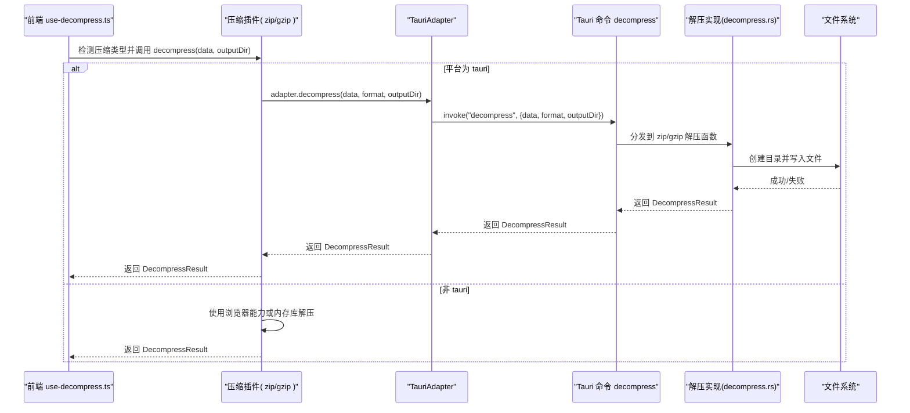
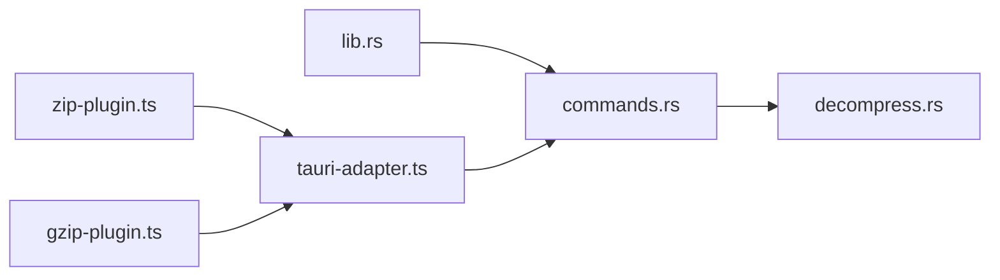

# 解压处理命令

<cite>
**本文引用的文件**   
- [commands.rs](file://src-tauri/src/commands.rs)
- [decompress.rs](file://src-tauri/src/decompress.rs)
- [error.rs](file://src-tauri/src/error.rs)
- [lib.rs](file://src-tauri/src/lib.rs)
- [tauri-adapter.ts](file://src/adapters/tauri-adapter.ts)
- [zip-plugin.ts](file://src/plugins/compression/zip-plugin.ts)
- [gzip-plugin.ts](file://src/plugins/compression/gzip-plugin.ts)
- [use-decompress.ts](file://src/composables/use-decompress.ts)
- [index.ts](file://src/types/index.ts)
</cite>

## 目录
1. [简介](#简介)
2. [项目结构](#项目结构)
3. [核心组件](#核心组件)
4. [架构总览](#架构总览)
5. [详细组件分析](#详细组件分析)
6. [依赖关系分析](#依赖关系分析)
7. [性能与内存考量](#性能与内存考量)
8. [故障排查指南](#故障排查指南)
9. [结论](#结论)
10. [附录：API 参考与类型定义](#附录api-参考与类型定义)

## 简介
本章节面向 Hello-Tauri 的“解压处理”IPC 命令，提供完整的前后端 API 文档。重点覆盖以下方面：
- 支持的压缩格式：ZIP、GZIP
- 命令参数与返回结果结构
- 输出目录结构与命名约定
- 错误处理策略
- 前端调用示例与 TypeScript 类型定义（含 DecompressResult 字段说明）
- 大文件处理现状与优化建议

## 项目结构
与解压处理相关的代码分布在 Tauri 后端（Rust）与前端（TypeScript/Vue）两侧：
- 后端通过 Tauri 暴露 IPC 命令 decompress，内部调用 Rust 解压逻辑
- 前端通过平台适配器（TauriAdapter）调用后端命令，并在插件层进行格式识别与桥接

图表来源
- [lib.rs:6-18](file://src-tauri/src/lib.rs#L6-L18)
- [commands.rs:37-52](file://src-tauri/src/commands.rs#L37-L52)
- [decompress.rs:23-82](file://src-tauri/src/decompress.rs#L23-L82)
- [tauri-adapter.ts:36-39](file://src/adapters/tauri-adapter.ts#L36-L39)
- [zip-plugin.ts:10-16](file://src/plugins/compression/zip-plugin.ts#L10-L16)
- [gzip-plugin.ts:10-16](file://src/plugins/compression/gzip-plugin.ts#L10-L16)

章节来源
- [lib.rs:6-18](file://src-tauri/src/lib.rs#L6-L18)
- [commands.rs:37-52](file://src-tauri/src/commands.rs#L37-L52)
- [decompress.rs:23-82](file://src-tauri/src/decompress.rs#L23-L82)
- [tauri-adapter.ts:36-39](file://src/adapters/tauri-adapter.ts#L36-L39)
- [zip-plugin.ts:10-16](file://src/plugins/compression/zip-plugin.ts#L10-L16)
- [gzip-plugin.ts:10-16](file://src/plugins/compression/gzip-plugin.ts#L10-L16)

## 核心组件
- Tauri 命令层：负责接收前端请求、路由到具体解压实现、封装统一返回结构
- 解压实现层：分别实现 ZIP 与 GZIP 解压逻辑，并写入目标目录
- 前端适配器：将前端调用转换为 Tauri IPC 调用
- 插件层：根据文件名后缀选择对应插件，在 Tauri 模式下委托给后端命令

章节来源
- [commands.rs:37-52](file://src-tauri/src/commands.rs#L37-L52)
- [decompress.rs:6-21](file://src-tauri/src/decompress.rs#L6-L21)
- [tauri-adapter.ts:36-39](file://src/adapters/tauri-adapter.ts#L36-L39)
- [zip-plugin.ts:4-16](file://src/plugins/compression/zip-plugin.ts#L4-L16)
- [gzip-plugin.ts:4-16](file://src/plugins/compression/gzip-plugin.ts#L4-L16)

## 架构总览
下图展示了从前端发起解压到后端落盘的全链路流程。

图表来源
- [use-decompress.ts:14-56](file://src/composables/use-decompress.ts#L14-L56)
- [zip-plugin.ts:10-16](file://src/plugins/compression/zip-plugin.ts#L10-L16)
- [gzip-plugin.ts:10-16](file://src/plugins/compression/gzip-plugin.ts#L10-L16)
- [tauri-adapter.ts:36-39](file://src/adapters/tauri-adapter.ts#L36-L39)
- [commands.rs:37-52](file://src-tauri/src/commands.rs#L37-L52)
- [decompress.rs:23-82](file://src-tauri/src/decompress.rs#L23-L82)

## 详细组件分析

### 命令：decompress
- 功能：接收二进制数据、压缩格式标识与输出目录，执行解压并将结果写入目标目录，返回统一的解压结果对象
- 支持格式：
  - "zip"：调用 ZIP 解压实现
  - "gzip"：调用 GZIP 解压实现
  - 其他值：返回 success=false 的错误结果
- 参数：
  - data：Uint8Array（前端以数字数组形式传递）
  - format：字符串，取值 "zip" 或 "gzip"
  - output_dir：字符串，目标输出目录路径
- 返回：DecompressResult（见附录类型定义）
- 错误处理：
  - 不支持的格式：直接返回 success=false 的结果
  - 解压异常：捕获后包装为 success=false 并携带错误信息
  - IO 异常：由 AppError 统一序列化后返回

章节来源
- [commands.rs:37-52](file://src-tauri/src/commands.rs#L37-L52)
- [error.rs:3-12](file://src-tauri/src/error.rs#L3-L12)

### 解压实现：ZIP
- 行为：
  - 遍历 ZIP 条目，按原路径在输出目录重建目录树
  - 对目录项：创建目录，记录 is_directory=true，size=0
  - 对文件项：确保父目录存在，逐字节拷贝至磁盘，记录 size 与真实路径
- 输出目录结构：保持压缩包内相对路径不变
- 错误处理：
  - 打开归档失败：返回 DecompressResult.success=false
  - 读取条目失败：返回 DecompressResult.success=false
  - 创建目录/写入文件失败：返回 DecompressResult.success=false

章节来源
- [decompress.rs:23-62](file://src-tauri/src/decompress.rs#L23-L62)

### 解压实现：GZIP
- 行为：
  - 一次性解码整个流到内存缓冲区
  - 将结果写入输出目录下的固定文件名 "decompressed"
  - 返回单条文件记录，is_directory=false，size 为解码后长度
- 输出目录结构：仅包含一个名为 "decompressed" 的文件
- 错误处理：
  - 解码失败：返回 DecompressResult.success=false
  - 写入失败：返回 DecompressResult.success=false

章节来源
- [decompress.rs:64-82](file://src-tauri/src/decompress.rs#L64-L82)

### 前端适配与插件桥接
- TauriAdapter.decompress：
  - 通过 @tauri-apps/api/core.invoke 调用后端命令 "decompress"
  - 将 Uint8Array 转为数字数组传递，避免跨语言边界问题
- 压缩插件：
  - zip-plugin：当运行于 Tauri 环境时，委托给 TauriAdapter.decompress(format="zip")
  - gzip-plugin：当运行于 Tauri 环境时，委托给 TauriAdapter.decompress(format="gzip")
  - 在非 Tauri 环境，各自使用浏览器能力或内存库进行解压（不落地磁盘）

章节来源
- [tauri-adapter.ts:36-39](file://src/adapters/tauri-adapter.ts#L36-L39)
- [zip-plugin.ts:10-16](file://src/plugins/compression/zip-plugin.ts#L10-L16)
- [gzip-plugin.ts:10-16](file://src/plugins/compression/gzip-plugin.ts#L10-L16)

### 前端编排与进度反馈
- use-decompress.startDecompress：
  - 更新任务状态为 running，设置初始进度
  - 读取 File 为 ArrayBuffer，构造 FileEntry 供插件识别
  - 通过插件注册表选择压缩插件并执行 safeDecompress
  - 成功后构建文件树，计算原始大小，更新完成进度
  - 失败时记录错误信息
- 注意：当前实现未向用户推送细粒度进度事件，仅在关键阶段更新整体进度百分比

章节来源
- [use-decompress.ts:14-56](file://src/composables/use-decompress.ts#L14-L56)

## 依赖关系分析
- 命令注册：lib.rs 中集中注册所有 Tauri 命令，包括 decompress
- 命令路由：commands.rs 根据 format 分派到具体解压函数
- 解压实现：decompress.rs 依赖 zip 与 flate2 库进行解压
- 前端桥接：tauri-adapter.ts 作为 IPC 客户端；zip/gzip 插件在 Tauri 模式下复用该适配器

图表来源
- [lib.rs:6-18](file://src-tauri/src/lib.rs#L6-L18)
- [commands.rs:37-52](file://src-tauri/src/commands.rs#L37-L52)
- [decompress.rs:23-82](file://src-tauri/src/decompress.rs#L23-L82)
- [tauri-adapter.ts:36-39](file://src/adapters/tauri-adapter.ts#L36-L39)
- [zip-plugin.ts:10-16](file://src/plugins/compression/zip-plugin.ts#L10-L16)
- [gzip-plugin.ts:10-16](file://src/plugins/compression/gzip-plugin.ts#L10-L16)

章节来源
- [lib.rs:6-18](file://src-tauri/src/lib.rs#L6-L18)
- [commands.rs:37-52](file://src-tauri/src/commands.rs#L37-L52)
- [decompress.rs:23-82](file://src-tauri/src/decompress.rs#L23-L82)
- [tauri-adapter.ts:36-39](file://src/adapters/tauri-adapter.ts#L36-L39)
- [zip-plugin.ts:10-16](file://src/plugins/compression/zip-plugin.ts#L10-L16)
- [gzip-plugin.ts:10-16](file://src/plugins/compression/gzip-plugin.ts#L10-L16)

## 性能与内存考量
- 全量加载：
  - 前端将 File 读入内存（ArrayBuffer），再转为 Uint8Array 传给后端
  - 后端 GZIP 解压一次性解码到内存缓冲，随后写入磁盘
- 大文件风险：
  - 超大压缩包可能导致前端内存峰值升高
  - GZIP 解压过程同样会占用与解压后等量的内存空间
- 建议优化方向：
  - 引入分块读取与流式解压（例如基于 Tauri Events 或专用插件）
  - 针对 ZIP 可考虑边读边写，减少中间缓冲
  - 在前端增加文件大小限制与用户提示

章节来源
- [use-decompress.ts:17-20](file://src/composables/use-decompress.ts#L17-L20)
- [decompress.rs:68-74](file://src-tauri/src/decompress.rs#L68-L74)
- [tauri-adapter.ts:47-58](file://src/adapters/tauri-adapter.ts#L47-L58)

## 故障排查指南
- 常见错误与定位
  - 不支持的格式：检查传入的 format 是否为 "zip" 或 "gzip"
  - 解压失败：查看返回结果中的 error 字段，通常为底层库抛出的错误信息
  - 权限/路径错误：确认 output_dir 是否存在且具备写入权限
- 日志与调试
  - 前端：在 startDecompress 的 catch 分支打印错误堆栈
  - 后端：AppError 已序列化为字符串，可在前端统一展示
- 典型场景
  - ZIP 目录嵌套较深：确保父目录创建成功
  - GZIP 输出文件命名：始终为 "decompressed"，若需自定义名称，应扩展后端实现

章节来源
- [commands.rs:37-52](file://src-tauri/src/commands.rs#L37-L52)
- [error.rs:3-12](file://src-tauri/src/error.rs#L3-L12)
- [use-decompress.ts:52-55](file://src/composables/use-decompress.ts#L52-L55)

## 结论
- 命令 decompress 提供了稳定的前后端解压接口，支持 ZIP 与 GZIP 两种格式
- 输出目录结构遵循压缩包内路径（ZIP）或固定文件名（GZIP）
- 当前实现为全量内存处理，适合中小体积文件；大文件场景建议后续引入流式方案
- 前端通过插件体系与平台适配器解耦，便于在不同环境下切换实现

## 附录：API 参考与类型定义

### IPC 命令：decompress
- 调用方式（前端）：
  - 通过 TauriAdapter.decompress(data, format, outputDir) 间接调用
  - 或直接通过 @tauri-apps/api/core.invoke("decompress", { data, format, outputDir })
- 参数
  - data：Uint8Array（实际传输为 number[]）
  - format："zip" | "gzip"
  - output_dir：string（目标输出目录）
- 返回
  - DecompressResult（见下节类型定义）

章节来源
- [tauri-adapter.ts:36-39](file://src/adapters/tauri-adapter.ts#L36-L39)
- [commands.rs:37-52](file://src-tauri/src/commands.rs#L37-L52)

### 返回结构：DecompressResult
- 字段
  - success：boolean，是否成功
  - files：FileEntry[]，解压后的文件或目录清单
  - error：string?，失败时的错误描述
- 子类型：FileEntry
  - name：string，文件名或目录名
  - path：string，绝对路径（相对于 output_dir 拼接后的完整路径）
  - size：number，文件大小（目录为 0）
  - isDirectory：boolean，是否为目录
  - lastModified：number?，可选，最后修改时间戳

章节来源
- [decompress.rs:6-21](file://src-tauri/src/decompress.rs#L6-L21)
- [index.ts:1-13](file://src/types/index.ts#L1-L13)

### 输出目录结构
- ZIP：
  - 保持压缩包内的目录层级，逐项创建目录与文件
  - 每个目录项 with is_directory=true，size=0
  - 每个文件项 with is_directory=false，size=文件字节数
- GZIP：
  - 在 output_dir 下生成单个文件 "decompressed"
  - is_directory=false，size=解压后字节数

章节来源
- [decompress.rs:23-62](file://src-tauri/src/decompress.rs#L23-L62)
- [decompress.rs:64-82](file://src-tauri/src/decompress.rs#L64-L82)

### 前端调用示例（步骤说明）
- 步骤
  - 选择文件并读取为 ArrayBuffer
  - 构造 FileEntry 用于插件识别
  - 通过插件注册表选择压缩插件
  - 在 Tauri 模式下调用 TauriAdapter.decompress
  - 解析返回的 DecompressResult，构建文件树并更新 UI
- 参考位置
  - 编排逻辑：use-decompress.ts
  - 插件桥接：zip-plugin.ts、gzip-plugin.ts
  - 平台适配：tauri-adapter.ts

章节来源
- [use-decompress.ts:14-56](file://src/composables/use-decompress.ts#L14-L56)
- [zip-plugin.ts:10-16](file://src/plugins/compression/zip-plugin.ts#L10-L16)
- [gzip-plugin.ts:10-16](file://src/plugins/compression/gzip-plugin.ts#L10-L16)
- [tauri-adapter.ts:36-39](file://src/adapters/tauri-adapter.ts#L36-L39)

### 类型定义汇总（TypeScript）
- DecompressResult
  - success：boolean
  - files：FileEntry[]
  - error：string?
- FileEntry
  - name：string
  - path：string
  - size：number
  - isDirectory：boolean
  - lastModified：number?

章节来源
- [index.ts:1-13](file://src/types/index.ts#L1-L13)