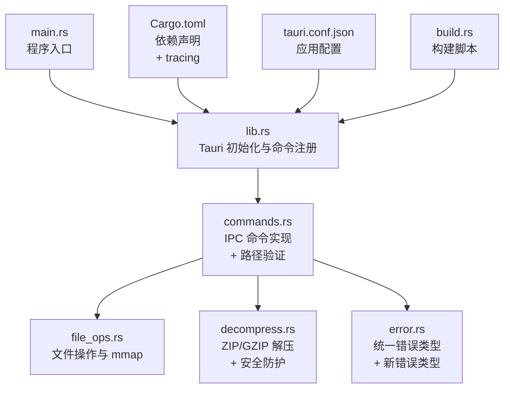
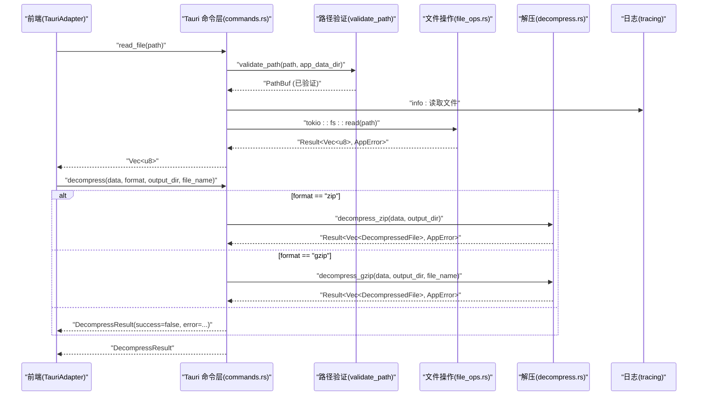
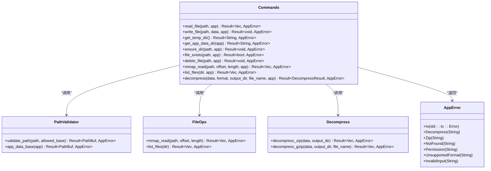
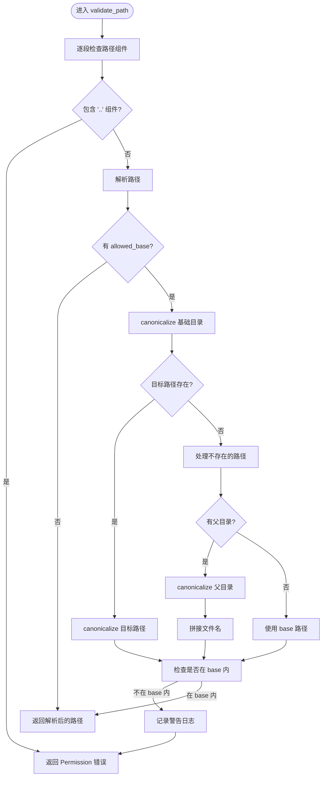
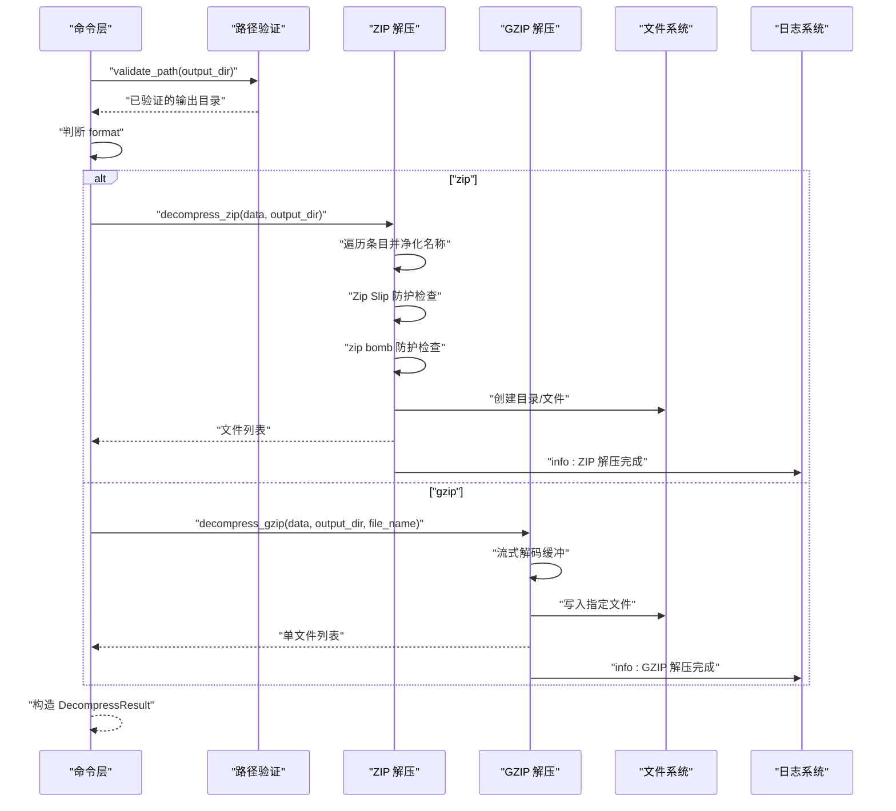

# Tauri 后端

<cite>
**本文引用的文件**   
- [lib.rs](file://src-tauri/src/lib.rs)
- [main.rs](file://src-tauri/src/main.rs)
- [commands.rs](file://src-tauri/src/commands.rs)
- [file_ops.rs](file://src-tauri/src/file_ops.rs)
- [decompress.rs](file://src-tauri/src/decompress.rs)
- [error.rs](file://src-tauri/src/error.rs)
- [Cargo.toml](file://src-tauri/Cargo.toml)
- [tauri.conf.json](file://src-tauri/tauri.conf.json)
- [build.rs](file://src-tauri/build.rs)
- [tauri-adapter.ts](file://src/adapters/tauri-adapter.ts)
</cite>

## 更新摘要
**所做更改**   
- 完全重写路径验证函数，实现组件级路径遍历防护
- 新增 NotFound、UnsupportedFormat、InvalidInput 错误类型
- 集成 tracing 日志记录系统
- 优化异步 I/O 操作，使用 spawn_blocking 避免阻塞
- GZIP 解压支持可选文件名参数
- 增强 ZIP 解压安全性，包含 zip bomb 防护和路径穿越防护

## 目录
1. [简介](#简介)
2. [项目结构](#项目结构)
3. [核心组件](#核心组件)
4. [架构总览](#架构总览)
5. [详细组件分析](#详细组件分析)
6. [依赖与构建配置](#依赖与构建配置)
7. [性能考量](#性能考量)
8. [故障排查指南](#故障排查指南)
9. [结论](#结论)
10. [附录：IPC 命令 API 参考](#附录ipc-命令-api-参考)

## 简介
本技术文档聚焦于 Hello-Tauri 的 Tauri 后端（Rust），系统阐述其架构设计、模块组织、命令注册机制、错误处理策略与异步编程模式。重点解析文件系统操作模块（mmap 零拷贝读取、递归目录遍历与大文件优化）、解压服务（ZIP/GZIP 解析、内存管理与错误恢复），并提供 IPC 命令的完整 API 参考、依赖管理、构建与跨平台编译说明，以及调试、性能分析与内存泄漏检测的实践建议。

**最新更新**：后端已进行重大安全增强，包括完全重写的路径验证函数、增强的错误处理系统和集成的日志记录功能。

## 项目结构
后端代码位于 src-tauri 目录，采用按职责划分的模块化组织方式：
- 入口与初始化：main.rs 调用库函数 run()；lib.rs 负责 Tauri Builder 初始化与命令注册
- 命令层：commands.rs 暴露给前端的 IPC 命令，包含增强的路径验证逻辑
- 领域模块：file_ops.rs（文件与 mmap）、decompress.rs（解压）
- 错误模型：error.rs 统一错误类型与序列化，现已扩展支持更多错误类型
- 配置与构建：Cargo.toml、tauri.conf.json、build.rs



**图表来源**
- [main.rs:1-4](file://src-tauri/src/main.rs#L1-L4)
- [lib.rs:1-36](file://src-tauri/src/lib.rs#L1-L36)
- [commands.rs:1-191](file://src-tauri/src/commands.rs#L1-L191)
- [file_ops.rs:1-122](file://src-tauri/src/file_ops.rs#L1-L122)
- [decompress.rs:1-141](file://src-tauri/src/decompress.rs#L1-L141)
- [error.rs:1-26](file://src-tauri/src/error.rs#L1-L26)
- [Cargo.toml:1-20](file://src-tauri/Cargo.toml#L1-L20)
- [tauri.conf.json:1-31](file://src-tauri/tauri.conf.json#L1-L31)
- [build.rs:1-4](file://src-tauri/build.rs#L1-L4)

章节来源
- [main.rs:1-4](file://src-tauri/src/main.rs#L1-L4)
- [lib.rs:1-36](file://src-tauri/src/lib.rs#L1-L36)

## 核心组件
- 命令注册与运行时
  - 通过 tauri::Builder 集中注册所有 IPC 命令，包括读/写文件、临时目录获取、mmap 读取、目录列表、解压等
  - 使用 generate_handler! 宏将 Rust 函数映射为前端可调用命令
  - **新增**：集成 tracing_subscriber 日志系统，支持环境变量过滤
- 错误处理
  - 定义 AppError 枚举，封装 IO、解压、未找到、权限拒绝、不支持格式、无效输入等错误，并实现 Serialize 以便跨语言传输
  - **新增**：NotFound、Permission、UnsupportedFormat、InvalidInput 错误类型
- 文件系统操作
  - 提供基于 memmap2 的 mmap_read 零拷贝读取，支持偏移与长度范围校验
  - 提供 list_files 递归遍历目录，返回结构化元数据
  - **增强**：所有文件操作都经过严格的路径验证
- 解压服务
  - ZIP：使用 zip crate 逐条目写入输出目录，记录目录与文件元信息，包含 zip bomb 防护
  - GZIP：使用 flate2 解码后写入指定文件名，支持可选文件名参数，返回单文件结果
  - **增强**：包含路径穿越防护和累计大小限制
- 异步与同步混合
  - 部分命令使用 tokio::fs 异步 IO（如 read_file/write_file）
  - **优化**：同步操作（mmap_read/list_files/decompress）现在使用 spawn_blocking 包装，避免阻塞异步运行时

章节来源
- [lib.rs:6-35](file://src-tauri/src/lib.rs#L6-L35)
- [commands.rs:1-191](file://src-tauri/src/commands.rs#L1-L191)
- [error.rs:1-26](file://src-tauri/src/error.rs#L1-L26)
- [file_ops.rs:1-122](file://src-tauri/src/file_ops.rs#L1-L122)
- [decompress.rs:1-141](file://src-tauri/src/decompress.rs#L1-L141)

## 架构总览
后端以命令为中心，将业务逻辑下沉到 file_ops 与 decompress 模块。命令层负责参数校验、错误包装与返回值格式化；领域模块专注具体实现。前后端通过 Tauri IPC 通信，前端适配器将二进制数据转换为 Uint8Array 进行传递。

**更新**：所有命令现在都集成了路径验证和安全检查，确保只有允许的应用数据目录内的文件可以被访问。



**图表来源**
- [commands.rs:68-190](file://src-tauri/src/commands.rs#L68-L190)
- [commands.rs:11-59](file://src-tauri/src/commands.rs#L11-L59)
- [file_ops.rs:6-33](file://src-tauri/src/file_ops.rs#L6-L33)
- [decompress.rs:38-140](file://src-tauri/src/decompress.rs#L38-L140)
- [error.rs:3-19](file://src-tauri/src/error.rs#L3-L19)

## 详细组件分析

### 命令层与增强的路径验证机制
- 注册位置：在 lib.rs 中通过 tauri::generate_handler! 集中注册命令
- **新增**：get_app_data_dir、ensure_dir、file_exists、delete_file 命令
- 命令清单：
  - read_file(path): 异步读取文件字节，带路径验证
  - write_file(path, data): 异步写入文件字节，带路径验证
  - get_temp_dir(): 获取系统临时目录路径
  - get_app_data_dir(): 获取应用数据目录路径
  - ensure_dir(path): 递归创建目录，带路径验证
  - file_exists(path): 检查文件或目录是否存在，带路径验证
  - delete_file(path): 删除单个文件，带路径验证和类型检查
  - mmap_read(path, offset, length): 同步 mmap 读取指定范围，使用 spawn_blocking
  - list_files(dir): 同步递归列出目录项，使用 spawn_blocking
  - decompress(data, format, output_dir, file_name): 根据格式执行解压，支持可选文件名
- **全新路径验证函数 validate_path**：
  - 逐段检查路径组件，拒绝包含 `..` 的路径
  - 若提供 allowed_base，则校验解析后的绝对路径必须在允许目录内
  - 对不存在的文件，先 canonicalize 父目录再拼接文件名
  - 防止路径穿越攻击
- 参数校验与安全：
  - 所有文件操作都通过 validate_path 进行安全验证
  - delete_file 额外检查目标是否为普通文件
- 错误包装：
  - 所有底层错误均包装为 AppError，确保跨语言一致的错误字符串
  - **新增**：NotFound、Permission、UnsupportedFormat、InvalidInput 错误类型



**图表来源**
- [lib.rs:17-29](file://src-tauri/src/lib.rs#L17-L29)
- [commands.rs:68-190](file://src-tauri/src/commands.rs#L68-L190)
- [commands.rs:11-66](file://src-tauri/src/commands.rs#L11-L66)
- [file_ops.rs:6-74](file://src-tauri/src/file_ops.rs#L6-L74)
- [decompress.rs:38-140](file://src-tauri/src/decompress.rs#L38-L140)
- [error.rs:3-19](file://src-tauri/src/error.rs#L3-L19)

章节来源
- [lib.rs:6-35](file://src-tauri/src/lib.rs#L6-L35)
- [commands.rs:1-191](file://src-tauri/src/commands.rs#L1-L191)

### 增强的路径验证系统
**全新实现**：validate_path 函数提供了组件级的路径遍历防护

- **组件级安全检查**：
  - 逐段检查路径组件，拒绝包含 `..` 的路径
  - 防止路径穿越攻击的第一道防线
- **基础目录验证**：
  - 若提供 allowed_base，则校验解析后的绝对路径必须在允许目录内
  - 对 base 路径做 canonicalize 处理
  - 对目标路径：若存在则 canonicalize，否则 canonicalize 父目录后拼接文件名
- **不存在文件处理**：
  - 对于 write_file / ensure_dir 等操作，对父目录做 canonicalize
  - 处理相对路径无父目录的情况
- **权限控制**：
  - 不在允许目录内的路径返回 Permission 错误
  - 记录详细的警告日志



**图表来源**
- [commands.rs:11-59](file://src-tauri/src/commands.rs#L11-L59)

章节来源
- [commands.rs:11-66](file://src-tauri/src/commands.rs#L11-L66)

### 文件系统操作模块
- mmap 零拷贝读取
  - 使用 memmap2 将文件映射到内存，直接切片读取指定范围，避免额外拷贝
  - 边界检查：若 end > mmap.len()，返回 InvalidInput 错误
  - **增强**：空文件保护，防止 mmap 在零长度文件上返回错误
  - **增强**：安全的加法运算，防止 offset + length 溢出
- 递归目录遍历
  - walk_dir 深度优先遍历，收集每个条目的 name/path/size/is_directory
  - 使用 serde 的 camelCase 重命名，便于前端消费
  - **增强**：深度限制防止栈溢出，超过最大深度时记录警告日志
- 大文件处理优化
  - 对于超大文件，优先使用 mmap_read 按需读取片段，降低内存占用
  - **优化**：同步操作现在使用 spawn_blocking 包装，避免阻塞异步运行时
  - 后续可通过流式或分块读取进一步减少峰值内存

```mermaid
flowchart TD
Start(["进入 mmap_read"]) --> GetMetadata["获取文件元数据"]
GetMetadata --> CheckEmpty{"文件大小为 0?"}
CheckEmpty -- "是" --> ReturnEmpty["返回空数组"]
CheckEmpty -- "否" --> OpenFile["打开文件"]
OpenFile --> MapMmap["创建内存映射 Mmap"]
MapMmap --> SafeAdd["安全计算 offset + length"]
SafeAdd --> Bounds{"offset+length <= 文件大小?"}
Bounds -- "否" --> ErrRange["返回 InvalidInput 错误"]
Bounds -- "是" --> Slice["切片读取 [start..end]"]
Slice --> Copy["复制到 Vec<u8>"]
Copy --> End(["返回字节数组])
```

**图表来源**
- [file_ops.rs:11-33](file://src-tauri/src/file_ops.rs#L11-L33)

章节来源
- [file_ops.rs:1-122](file://src-tauri/src/file_ops.rs#L1-L122)

### 增强的解压服务模块
- ZIP 解压
  - 使用 zip crate 迭代条目，区分目录与文件
  - 目录：创建目录并记录 is_directory=true
  - 文件：确保父目录存在，写入磁盘，记录 size
  - **增强**：sanitize_zip_entry_name 净化条目名称，拒绝路径穿越和非法字符
  - **增强**：Zip Slip 防护，规范化路径后检查前缀
  - **增强**：zip bomb 防护，累计解压大小上限 1GB
- GZIP 解压
  - 使用 flate2 解码整个缓冲区，写入指定文件名
  - **新增**：支持可选文件名参数，默认为 "decompressed"
  - **优化**：流式写入，边解码边写盘，避免全量加载到内存
  - 返回单文件结果
- 内存管理与错误恢复
  - ZIP：逐条目处理，避免一次性加载全部内容
  - GZIP：流式处理，适合大文件场景
  - 错误统一包装为 AppError，上层命令将其转为 DecompressResult.success=false 并携带错误消息
  - **增强**：详细的日志记录解压过程



**图表来源**
- [commands.rs:172-190](file://src-tauri/src/commands.rs#L172-L190)
- [decompress.rs:38-140](file://src-tauri/src/decompress.rs#L38-L140)

章节来源
- [commands.rs:172-190](file://src-tauri/src/commands.rs#L172-L190)
- [decompress.rs:1-141](file://src-tauri/src/decompress.rs#L1-L141)

### 增强的错误处理策略
- 统一错误类型 AppError
  - Io：封装 std::io::Error
  - Decompress：解压相关错误，携带描述字符串
  - Zip：ZIP 特定错误，携带描述字符串
  - NotFound：资源不存在，携带路径信息
  - Permission：权限拒绝，包含详细错误信息
  - UnsupportedFormat：不支持的格式，携带格式名称
  - InvalidInput：无效输入，包含错误原因
- 序列化
  - 实现 Serialize，将错误序列化为字符串，便于前端展示
- 命令层转换
  - decompress 命令将底层错误转换为 DecompressResult.success=false 并附带 error 字段，保证前端稳定消费
  - **增强**：详细的错误日志记录

章节来源
- [error.rs:1-26](file://src-tauri/src/error.rs#L1-L26)
- [commands.rs:172-190](file://src-tauri/src/commands.rs#L172-L190)

### 优化的异步编程模式
- 异步命令
  - read_file、write_file、ensure_dir、file_exists、delete_file 使用 tokio::fs 异步 IO，避免阻塞事件循环
- **优化**的同步命令
  - mmap_read、list_files、decompress 现在使用 spawn_blocking 包装，避免阻塞异步运行时
  - 保持同步 IO 的性能优势，同时避免阻塞事件循环
- 前端适配
  - TauriAdapter 将二进制数据转换为 Uint8Array，并通过 invoke 调用命令
  - **增强**：decompress 方法现在支持可选的 fileName 参数

章节来源
- [commands.rs:68-190](file://src-tauri/src/commands.rs#L68-L190)
- [tauri-adapter.ts:46-50](file://src/adapters/tauri-adapter.ts#L46-L50)

### 集成的日志记录系统
- **全新集成**：tracing_subscriber 日志系统
- 启动时初始化，支持环境变量过滤
- 关键操作日志：
  - 文件读写操作记录详细信息
  - 解压操作记录成功状态和文件大小
  - 路径验证失败记录警告日志
  - 解压失败记录错误详情
- 日志级别：
  - info：正常操作流程
  - warn：潜在问题但不影响功能
  - error：严重错误需要关注

章节来源
- [lib.rs:6-15](file://src-tauri/src/lib.rs#L6-L15)
- [commands.rs:72-86](file://src-tauri/src/commands.rs#L72-L86)
- [decompress.rs:115-132](file://src-tauri/src/decompress.rs#L115-L132)

## 依赖与构建配置
- 关键依赖
  - tauri 2：框架核心
  - tokio 1（full）：异步运行时
  - memmap2 0.9：内存映射
  - zip 2：ZIP 归档处理
  - flate2 1：GZIP 压缩/解压
  - serde/serde_json：序列化/反序列化
  - thiserror：错误类型推导
  - **新增**：tracing 0.1：结构化日志记录
  - **新增**：tracing-subscriber 0.3：日志订阅者，支持环境变量过滤
- 构建脚本
  - build.rs 调用 tauri_build::build() 生成绑定与上下文
- 应用配置
  - tauri.conf.json 定义产品名称、窗口尺寸、前端构建产物路径等

章节来源
- [Cargo.toml:1-20](file://src-tauri/Cargo.toml#L1-L20)
- [build.rs:1-4](file://src-tauri/build.rs#L1-L4)
- [tauri.conf.json:1-31](file://src-tauri/tauri.conf.json#L1-L31)

## 性能考量
- 零拷贝读取
  - mmap_read 利用操作系统页缓存，避免用户态与内核态之间的多次拷贝，适合随机访问大文件片段
  - **增强**：空文件保护和溢出保护
- 内存峰值控制
  - ZIP 解压逐条目写入，避免一次性加载整个归档
  - **增强**：zip bomb 防护，限制累计解压大小为 1GB
  - GZIP 解压现在使用流式写入，大幅降低内存峰值
- **优化**的并发与并行
  - 同步操作使用 spawn_blocking 包装，避免阻塞异步运行时
  - 当前命令多为异步 IO，提升整体吞吐量
- 前端传输
  - 二进制数据通过 IPC 全量传输，注意限制单次大小或使用分块策略
- **新增**的安全开销
  - 路径验证增加少量 CPU 开销，但大幅提升安全性
  - 日志记录开销可控，可通过环境变量调整日志级别

[本节为通用指导，不直接分析具体文件]

## 故障排查指南
- 常见错误定位
  - **路径穿越**：validate_path 拒绝包含 ".." 的路径，检查前端传入的 path 是否经过安全验证
  - **越界读取**：mmap_read 当 offset+length 超出文件大小时返回 InvalidInput 错误，确认参数合法性
  - **解压失败**：DecompressResult.success=false 且 error 字段包含原因，检查格式与数据完整性
  - **权限错误**：Permission 错误表示路径不在允许的应用数据目录内
  - **不支持的格式**：UnsupportedFormat 错误表示解压格式不被支持
- **新增**的日志调试
  - 查看 tracing 日志输出，了解详细的操作过程
  - 使用环境变量控制日志级别：RUST_LOG=debug 启用详细日志
  - 路径验证失败会记录详细的警告日志
- 内存泄漏检测
  - 使用 Valgrind（Linux/macOS）或 Visual Studio 诊断工具（Windows）检测未释放资源
  - 关注长时间运行的解压任务，避免持有大对象引用
- 性能分析
  - 使用 perf（Linux）或 Instruments（macOS）分析热点函数
  - 针对大文件场景，优先验证 mmap_read 的命中率与页面缺失率
  - 监控 spawn_blocking 的使用情况，避免过度使用

章节来源
- [commands.rs:11-59](file://src-tauri/src/commands.rs#L11-L59)
- [commands.rs:68-190](file://src-tauri/src/commands.rs#L68-L190)
- [file_ops.rs:11-33](file://src-tauri/src/file_ops.rs#L11-L33)
- [decompress.rs:38-140](file://src-tauri/src/decompress.rs#L38-L140)

## 结论
该 Tauri 后端经过重大安全增强后，以命令为中心，清晰划分了命令层、文件操作与解压模块，采用统一的错误模型与序列化策略，兼顾了性能与可维护性。**全新的路径验证系统**提供了组件级的路径遍历防护，**增强的错误处理**支持更多错误类型，**集成的日志系统**提供了详细的操作追踪，**优化的异步模式**提升了整体性能。mmap 零拷贝读取与逐条目解压有效降低了内存压力。建议在 GZIP 场景继续使用流式写入，并在需要时引入并行处理以提升吞吐。

[本节为总结，不直接分析具体文件]

## 附录：IPC 命令 API 参考

- 通用约定
  - 调用方式：前端通过 @tauri-apps/api/core 的 invoke 调用命令名与参数
  - 返回值：成功返回 JSON 可序列化对象；失败返回 AppError 字符串
  - 数据类型：二进制数据以 number[] 形式传输，前端需转换为 Uint8Array
  - **新增**：所有文件操作都限制在应用数据目录内

- **新增**的命令
  - get_app_data_dir() -> Promise<string>
    - 功能：获取应用数据目录路径（持久化，重启不丢失）
    - 返回：路径字符串
  - ensure_dir(path: string) -> Promise<void>
    - 功能：递归创建目录（若已存在则忽略）
    - 参数：path 字符串，自动限制在应用数据目录内
    - 返回：无
    - 错误：AppError::Permission（路径不在允许目录内）
  - file_exists(path: string) -> Promise<bool>
    - 功能：检查文件或目录是否存在
    - 参数：path 字符串，自动限制在应用数据目录内
    - 返回：布尔值
    - 错误：AppError::Permission（路径不在允许目录内）
  - delete_file(path: string) -> Promise<void>
    - 功能：删除单个文件（仅限普通文件，不删除目录）
    - 参数：path 字符串，自动限制在应用数据目录内
    - 返回：无
    - 错误：AppError::Permission（路径不在允许目录内）、AppError::InvalidInput（不是普通文件）

- 现有命令（已增强）
  - read_file(path: string) -> Promise<number[]>
    - 功能：异步读取文件字节
    - 参数：path 字符串，自动限制在应用数据目录内
    - 返回：字节数组
    - 错误：AppError::NotFound（文件不存在）、AppError::Permission（路径不在允许目录内）
  - write_file(path: string, data: number[]) -> Promise<void>
    - 功能：异步写入文件字节
    - 参数：path 字符串，data 字节数组，自动限制在应用数据目录内
    - 返回：无
    - 错误：AppError::Permission（路径不在允许目录内）
  - mmap_read(path: string, offset: number, length: number) -> Promise<number[]>
    - 功能：零拷贝读取文件指定范围
    - 参数：path、offset、length，自动限制在应用数据目录内
    - 返回：字节数组
    - 错误：AppError::InvalidInput（越界或溢出）、AppError::Permission（路径不在允许目录内）
  - list_files(dir: string) -> Promise<Array<{name:string,path:string,size:number,isDirectory:boolean}>>
    - 功能：递归列出目录项
    - 参数：dir 字符串，自动限制在应用数据目录内
    - 返回：文件元数据数组（camelCase 字段）
    - 错误：AppError::Permission（路径不在允许目录内）
  - decompress(data: number[], format: string, output_dir: string, file_name?: string) -> Promise<{success:boolean,files:Array<{name:string,path:string,size:number,isDirectory:boolean}>,error?:string}>
    - 功能：根据格式解压
    - 参数：data 字节数组，format 为 "zip" 或 "gzip"，output_dir 输出目录（自动限制在应用数据目录内），file_name 可选文件名
    - 返回：DecompressResult
    - 错误：AppError::UnsupportedFormat（不支持的格式）、AppError::Zip（ZIP 错误）、AppError::Decompress（解压错误）

- **新增**的错误码与语义
  - AppError::NotFound：资源不存在，包含路径信息
  - AppError::Permission：权限拒绝，包含详细错误信息
  - AppError::UnsupportedFormat：不支持的格式，包含格式名称
  - AppError::InvalidInput：无效输入，包含错误原因

- 前端适配要点
  - TauriAdapter 将 number[] 转换为 Uint8Array 供上层使用
  - **新增**：decompress 方法现在支持可选的 fileName 参数
  - 当前 streamRead 为全量读取后包装 ReadableStream，后续可考虑事件或插件实现分块

章节来源
- [commands.rs:68-190](file://src-tauri/src/commands.rs#L68-L190)
- [tauri-adapter.ts:46-50](file://src/adapters/tauri-adapter.ts#L46-L50)
- [error.rs:3-19](file://src-tauri/src/error.rs#L3-L19)