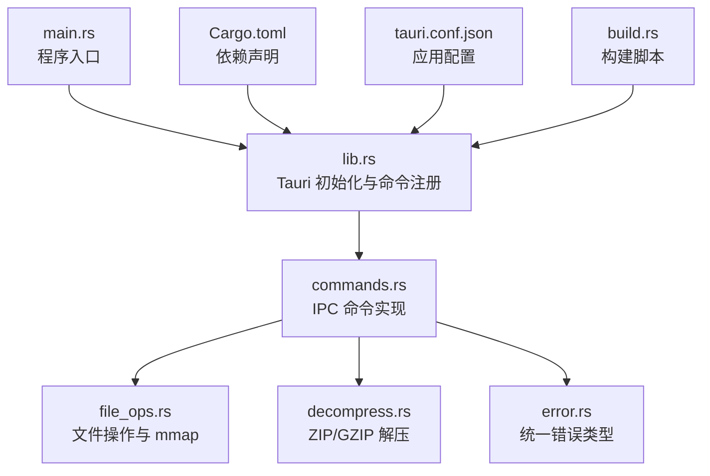
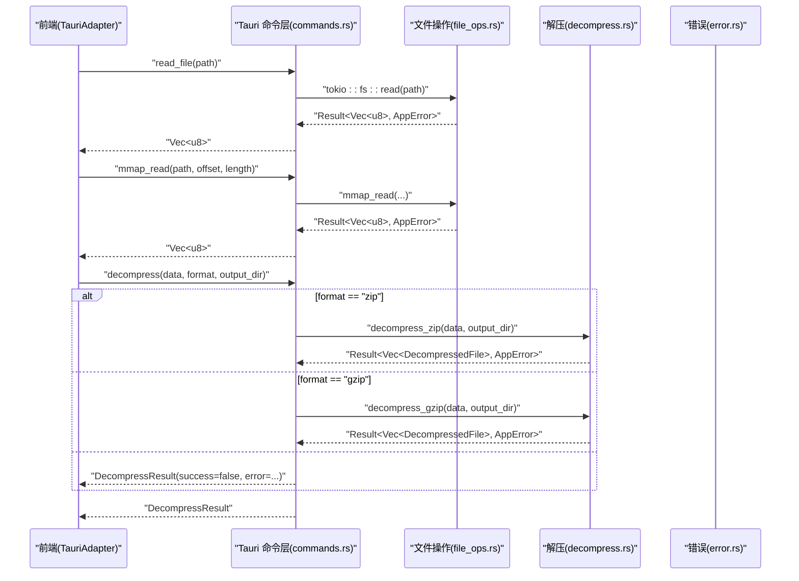
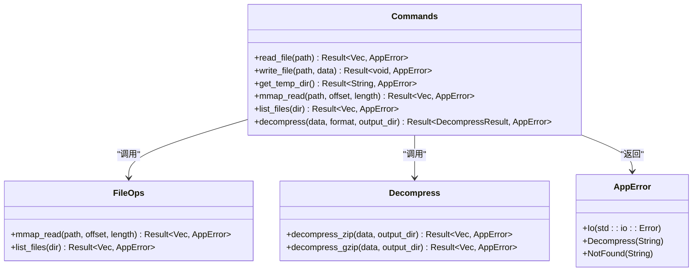
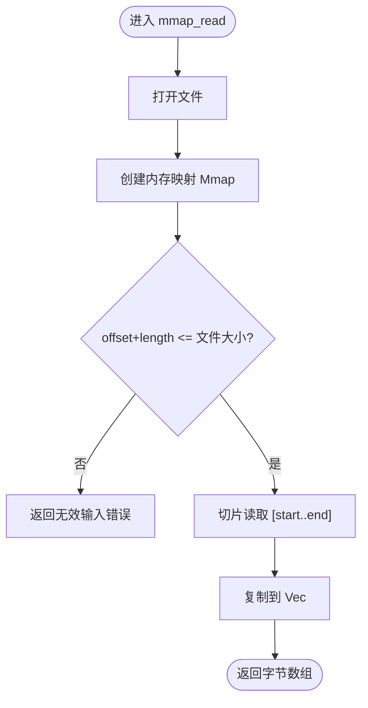
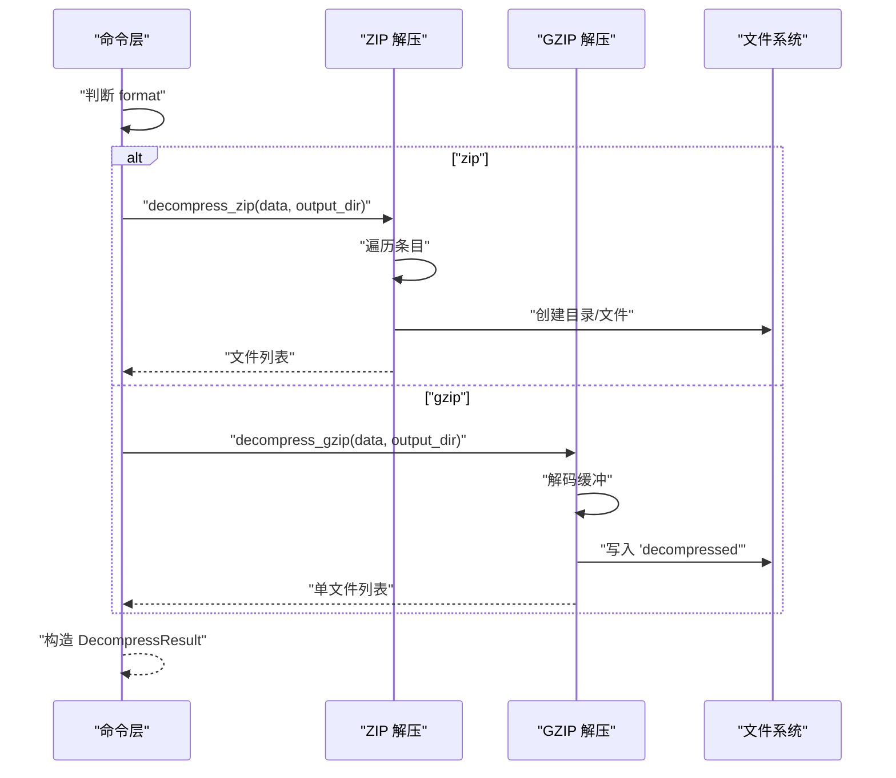

# Tauri 后端

<cite>
**本文引用的文件**   
- [lib.rs](file://src-tauri/src/lib.rs)
- [main.rs](file://src-tauri/src/main.rs)
- [commands.rs](file://src-tauri/src/commands.rs)
- [file_ops.rs](file://src-tauri/src/file_ops.rs)
- [decompress.rs](file://src-tauri/src/decompress.rs)
- [error.rs](file://src-tauri/src/error.rs)
- [Cargo.toml](file://src-tauri/Cargo.toml)
- [tauri.conf.json](file://src-tauri/tauri.conf.json)
- [build.rs](file://src-tauri/build.rs)
- [tauri-adapter.ts](file://src/adapters/tauri-adapter.ts)
</cite>

## 目录
1. [简介](#简介)
2. [项目结构](#项目结构)
3. [核心组件](#核心组件)
4. [架构总览](#架构总览)
5. [详细组件分析](#详细组件分析)
6. [依赖与构建配置](#依赖与构建配置)
7. [性能考量](#性能考量)
8. [故障排查指南](#故障排查指南)
9. [结论](#结论)
10. [附录：IPC 命令 API 参考](#附录ipc-命令-api-参考)

## 简介
本技术文档聚焦于 Hello-Tauri 的 Tauri 后端（Rust），系统阐述其架构设计、模块组织、命令注册机制、错误处理策略与异步编程模式。重点解析文件系统操作模块（mmap 零拷贝读取、递归目录遍历与大文件优化）、解压服务（ZIP/GZIP 解析、内存管理与错误恢复），并提供 IPC 命令的完整 API 参考、依赖管理、构建与跨平台编译说明，以及调试、性能分析与内存泄漏检测的实践建议。

## 项目结构
后端代码位于 src-tauri 目录，采用按职责划分的模块化组织方式：
- 入口与初始化：main.rs 调用库函数 run()；lib.rs 负责 Tauri Builder 初始化与命令注册
- 命令层：commands.rs 暴露给前端的 IPC 命令
- 领域模块：file_ops.rs（文件与 mmap）、decompress.rs（解压）
- 错误模型：error.rs 统一错误类型与序列化
- 配置与构建：Cargo.toml、tauri.conf.json、build.rs

图表来源
- [main.rs:1-4](file://src-tauri/src/main.rs#L1-L4)
- [lib.rs:1-19](file://src-tauri/src/lib.rs#L1-L19)
- [commands.rs:1-53](file://src-tauri/src/commands.rs#L1-L53)
- [file_ops.rs:1-88](file://src-tauri/src/file_ops.rs#L1-L88)
- [decompress.rs:1-83](file://src-tauri/src/decompress.rs#L1-L83)
- [error.rs:1-19](file://src-tauri/src/error.rs#L1-L19)
- [Cargo.toml:1-19](file://src-tauri/Cargo.toml#L1-L19)
- [tauri.conf.json:1-31](file://src-tauri/tauri.conf.json#L1-L31)
- [build.rs:1-4](file://src-tauri/build.rs#L1-L4)

章节来源
- [main.rs:1-4](file://src-tauri/src/main.rs#L1-L4)
- [lib.rs:1-19](file://src-tauri/src/lib.rs#L1-L19)

## 核心组件
- 命令注册与运行时
  - 通过 tauri::Builder 集中注册所有 IPC 命令，包括读/写文件、临时目录获取、mmap 读取、目录列表、解压等
  - 使用 generate_handler! 宏将 Rust 函数映射为前端可调用命令
- 错误处理
  - 定义 AppError 枚举，封装 IO、解压、未找到等错误，并实现 Serialize 以便跨语言传输
- 文件系统操作
  - 提供基于 memmap2 的 mmap_read 零拷贝读取，支持偏移与长度范围校验
  - 提供 list_files 递归遍历目录，返回结构化元数据
- 解压服务
  - ZIP：使用 zip crate 逐条目写入输出目录，记录目录与文件元信息
  - GZIP：使用 flate2 解码后写入固定文件名，返回单文件结果
- 异步与同步混合
  - 部分命令使用 tokio::fs 异步 IO（如 read_file/write_file）
  - 部分命令使用同步 IO（如 mmap_read/list_files/decompress），避免不必要的异步开销

章节来源
- [lib.rs:6-18](file://src-tauri/src/lib.rs#L6-L18)
- [commands.rs:1-53](file://src-tauri/src/commands.rs#L1-L53)
- [error.rs:1-19](file://src-tauri/src/error.rs#L1-L19)
- [file_ops.rs:1-88](file://src-tauri/src/file_ops.rs#L1-L88)
- [decompress.rs:1-83](file://src-tauri/src/decompress.rs#L1-L83)

## 架构总览
后端以命令为中心，将业务逻辑下沉到 file_ops 与 decompress 模块。命令层负责参数校验、错误包装与返回值格式化；领域模块专注具体实现。前后端通过 Tauri IPC 通信，前端适配器将二进制数据转换为 Uint8Array 进行传递。

图表来源
- [commands.rs:5-52](file://src-tauri/src/commands.rs#L5-L52)
- [file_ops.rs:6-18](file://src-tauri/src/file_ops.rs#L6-L18)
- [decompress.rs:23-82](file://src-tauri/src/decompress.rs#L23-L82)
- [error.rs:3-12](file://src-tauri/src/error.rs#L3-L12)

## 详细组件分析

### 命令层与命令注册机制
- 注册位置：在 lib.rs 中通过 tauri::generate_handler! 集中注册命令
- 命令清单：
  - read_file(path): 异步读取文件字节
  - write_file(path, data): 异步写入文件字节
  - get_temp_dir(): 获取系统临时目录路径
  - mmap_read(path, offset, length): 同步 mmap 读取指定范围
  - list_files(dir): 同步递归列出目录项
  - decompress(data, format, output_dir): 根据格式执行解压
- 参数校验与安全：
  - read_file 对 path 包含 ".." 进行拒绝，防止路径穿越
- 错误包装：
  - 所有底层错误均包装为 AppError，确保跨语言一致的错误字符串

图表来源
- [lib.rs:8-15](file://src-tauri/src/lib.rs#L8-L15)
- [commands.rs:5-52](file://src-tauri/src/commands.rs#L5-L52)
- [file_ops.rs:6-53](file://src-tauri/src/file_ops.rs#L6-L53)
- [decompress.rs:23-82](file://src-tauri/src/decompress.rs#L23-L82)
- [error.rs:3-12](file://src-tauri/src/error.rs#L3-L12)

章节来源
- [lib.rs:6-18](file://src-tauri/src/lib.rs#L6-L18)
- [commands.rs:1-53](file://src-tauri/src/commands.rs#L1-L53)

### 文件系统操作模块
- mmap 零拷贝读取
  - 使用 memmap2 将文件映射到内存，直接切片读取指定范围，避免额外拷贝
  - 边界检查：若 end > mmap.len()，返回无效输入错误
- 递归目录遍历
  - walk_dir 深度优先遍历，收集每个条目的 name/path/size/is_directory
  - 使用 serde 的 camelCase 重命名，便于前端消费
- 大文件处理优化
  - 对于超大文件，优先使用 mmap_read 按需读取片段，降低内存占用
  - 后续可通过流式或分块读取进一步减少峰值内存

图表来源
- [file_ops.rs:6-18](file://src-tauri/src/file_ops.rs#L6-L18)

章节来源
- [file_ops.rs:1-88](file://src-tauri/src/file_ops.rs#L1-L88)

### 解压服务模块
- ZIP 解压
  - 使用 zip crate 迭代条目，区分目录与文件
  - 目录：创建目录并记录 is_directory=true
  - 文件：确保父目录存在，写入磁盘，记录 size
- GZIP 解压
  - 使用 flate2 解码整个缓冲区，写入固定文件名 "decompressed"
  - 返回单文件结果
- 内存管理与错误恢复
  - ZIP：逐条目处理，避免一次性加载全部内容
  - GZIP：整体解码到内存，适合中小文件；超大文件建议改为流式写入以降低内存峰值
  - 错误统一包装为 AppError::Decompress，上层命令将其转为 DecompressResult.success=false 并携带错误消息

图表来源
- [commands.rs:38-52](file://src-tauri/src/commands.rs#L38-L52)
- [decompress.rs:23-82](file://src-tauri/src/decompress.rs#L23-L82)

章节来源
- [commands.rs:37-52](file://src-tauri/src/commands.rs#L37-L52)
- [decompress.rs:1-83](file://src-tauri/src/decompress.rs#L1-L83)

### 错误处理策略
- 统一错误类型 AppError
  - Io：封装 std::io::Error
  - Decompress：解压相关错误，携带描述字符串
  - NotFound：资源不存在（预留）
- 序列化
  - 实现 Serialize，将错误序列化为字符串，便于前端展示
- 命令层转换
  - decompress 命令将底层错误转换为 DecompressResult.success=false 并附带 error 字段，保证前端稳定消费

章节来源
- [error.rs:1-19](file://src-tauri/src/error.rs#L1-L19)
- [commands.rs:38-52](file://src-tauri/src/commands.rs#L38-L52)

### 异步编程模式
- 异步命令
  - read_file、write_file 使用 tokio::fs 异步 IO，避免阻塞事件循环
- 同步命令
  - mmap_read、list_files、decompress 使用同步 IO，减少上下文切换开销
- 前端适配
  - TauriAdapter 将二进制数据转换为 Uint8Array，并通过 invoke 调用命令

章节来源
- [commands.rs:5-25](file://src-tauri/src/commands.rs#L5-L25)
- [tauri-adapter.ts:14-45](file://src/adapters/tauri-adapter.ts#L14-L45)

## 依赖与构建配置
- 关键依赖
  - tauri 2：框架核心
  - tokio 1（full）：异步运行时
  - memmap2 0.9：内存映射
  - zip 2：ZIP 归档处理
  - flate2 1：GZIP 压缩/解压
  - rayon 1：并行计算（当前未直接使用，可用于未来扩展）
  - serde/serde_json：序列化/反序列化
  - thiserror：错误类型推导
- 构建脚本
  - build.rs 调用 tauri_build::build() 生成绑定与上下文
- 应用配置
  - tauri.conf.json 定义产品名称、窗口尺寸、前端构建产物路径等

章节来源
- [Cargo.toml:1-19](file://src-tauri/Cargo.toml#L1-L19)
- [build.rs:1-4](file://src-tauri/build.rs#L1-L4)
- [tauri.conf.json:1-31](file://src-tauri/tauri.conf.json#L1-L31)

## 性能考量
- 零拷贝读取
  - mmap_read 利用操作系统页缓存，避免用户态与内核态之间的多次拷贝，适合随机访问大文件片段
- 内存峰值控制
  - ZIP 解压逐条目写入，避免一次性加载整个归档
  - GZIP 解压目前整体解码到内存，建议对超大文件改为流式写入以降低峰值
- 并发与并行
  - 当前命令多为同步 IO，避免过多线程竞争；如需提升吞吐，可在解压或目录遍历中使用 rayon 并行化
- 前端传输
  - 二进制数据通过 IPC 全量传输，注意限制单次大小或使用分块策略

[本节为通用指导，不直接分析具体文件]

## 故障排查指南
- 常见错误定位
  - 路径穿越：read_file 拒绝包含 ".." 的路径，检查前端传入的 path
  - 越界读取：mmap_read 当 offset+length 超出文件大小时返回无效输入错误，确认参数合法性
  - 解压失败：DecompressResult.success=false 且 error 字段包含原因，检查格式与数据完整性
- 日志与调试
  - 在命令层添加日志输出，结合前端控制台查看 invoke 调用链
  - 使用 Tauri 开发模式（devUrl）快速迭代
- 内存泄漏检测
  - 使用 Valgrind（Linux/macOS）或 Visual Studio 诊断工具（Windows）检测未释放资源
  - 关注长时间运行的解压任务，避免持有大对象引用
- 性能分析
  - 使用 perf（Linux）或 Instruments（macOS）分析热点函数
  - 针对大文件场景，优先验证 mmap_read 的命中率与页面缺失率

章节来源
- [commands.rs:5-14](file://src-tauri/src/commands.rs#L5-L14)
- [file_ops.rs:6-18](file://src-tauri/src/file_ops.rs#L6-L18)
- [decompress.rs:23-82](file://src-tauri/src/decompress.rs#L23-L82)

## 结论
该 Tauri 后端以命令为中心，清晰划分了命令层、文件操作与解压模块，采用统一的错误模型与序列化策略，兼顾了性能与可维护性。mmap 零拷贝读取与逐条目解压有效降低了内存压力。建议在 GZIP 场景引入流式写入，并在需要时引入并行处理以提升吞吐。

[本节为总结，不直接分析具体文件]

## 附录：IPC 命令 API 参考

- 通用约定
  - 调用方式：前端通过 @tauri-apps/api/core 的 invoke 调用命令名与参数
  - 返回值：成功返回 JSON 可序列化对象；失败返回 AppError 字符串
  - 数据类型：二进制数据以 number[] 形式传输，前端需转换为 Uint8Array

- 命令清单与签名
  - read_file(path: string) -> Promise<number[]>
    - 功能：异步读取文件字节
    - 参数：path 字符串，禁止包含 ".."
    - 返回：字节数组
    - 错误：AppError::Io
  - write_file(path: string, data: number[]) -> Promise<void>
    - 功能：异步写入文件字节
    - 参数：path 字符串，data 字节数组
    - 返回：无
    - 错误：AppError::Io
  - get_temp_dir() -> Promise<string>
    - 功能：获取系统临时目录路径
    - 返回：路径字符串
  - mmap_read(path: string, offset: number, length: number) -> Promise<number[]>
    - 功能：零拷贝读取文件指定范围
    - 参数：path、offset、length
    - 返回：字节数组
    - 错误：AppError::Io（含越界无效输入）
  - list_files(dir: string) -> Promise<Array<{name:string,path:string,size:number,isDirectory:boolean}>>
    - 功能：递归列出目录项
    - 返回：文件元数据数组（camelCase 字段）
    - 错误：AppError::Io
  - decompress(data: number[], format: string, output_dir: string) -> Promise<{success:boolean,files:Array<{name:string,path:string,size:number,isDirectory:boolean}>,error?:string}>
    - 功能：根据格式解压
    - 参数：data 字节数组，format 为 "zip" 或 "gzip"，output_dir 输出目录
    - 返回：DecompressResult
    - 错误：AppError::Decompress（内部错误转 success=false 并带 error 文本）

- 错误码与语义
  - AppError::Io：IO 异常，包含具体错误信息
  - AppError::Decompress：解压失败，携带描述字符串
  - AppError::NotFound：资源不存在（预留）

- 前端适配要点
  - TauriAdapter 将 number[] 转换为 Uint8Array 供上层使用
  - 当前 streamRead 为全量读取后包装 ReadableStream，后续可考虑事件或插件实现分块

章节来源
- [commands.rs:5-52](file://src-tauri/src/commands.rs#L5-L52)
- [tauri-adapter.ts:14-45](file://src/adapters/tauri-adapter.ts#L14-L45)
- [error.rs:3-12](file://src-tauri/src/error.rs#L3-L12)