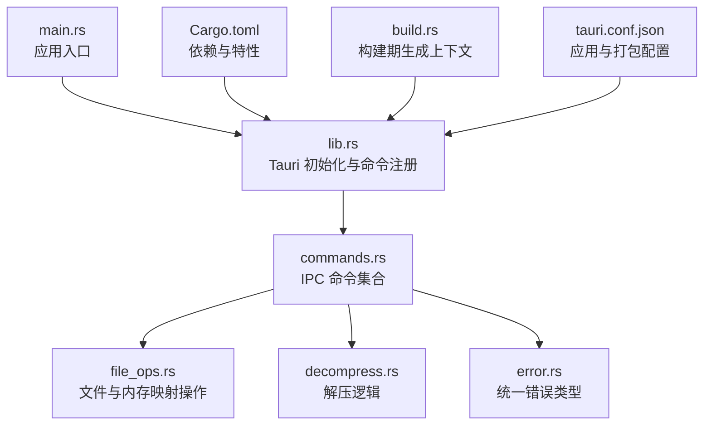
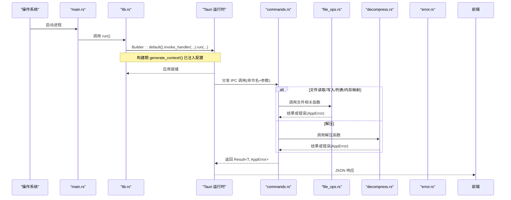
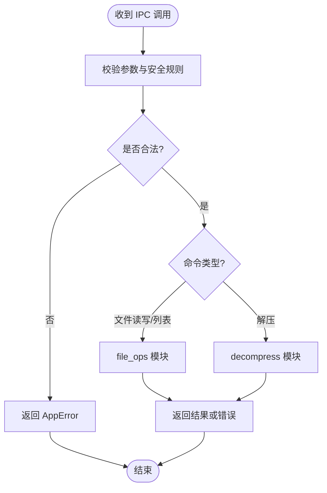
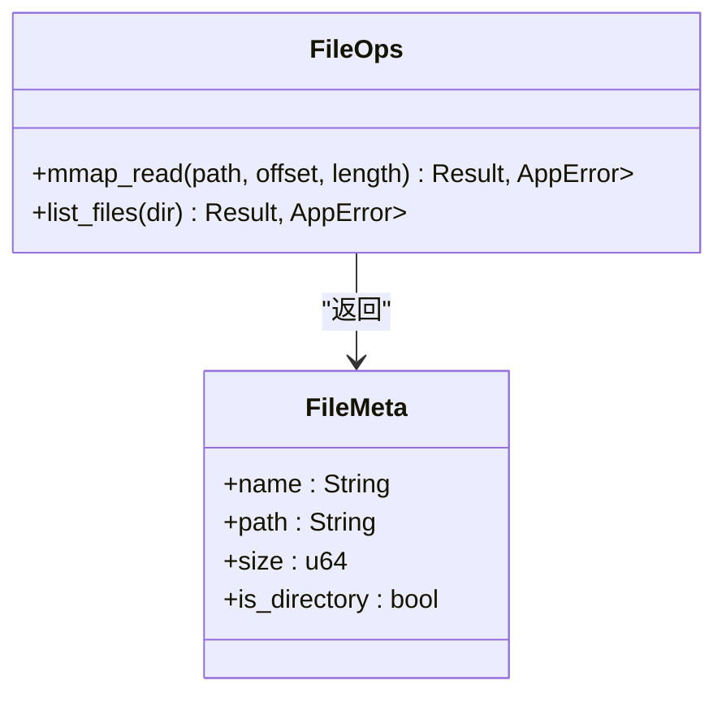
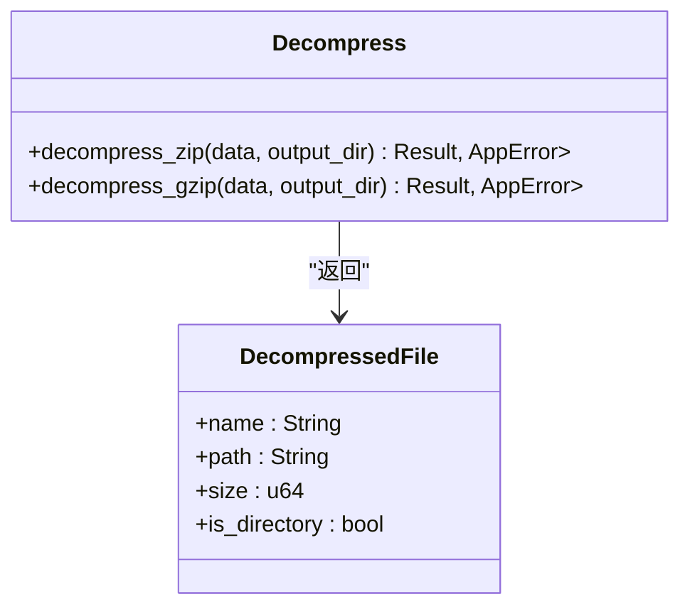
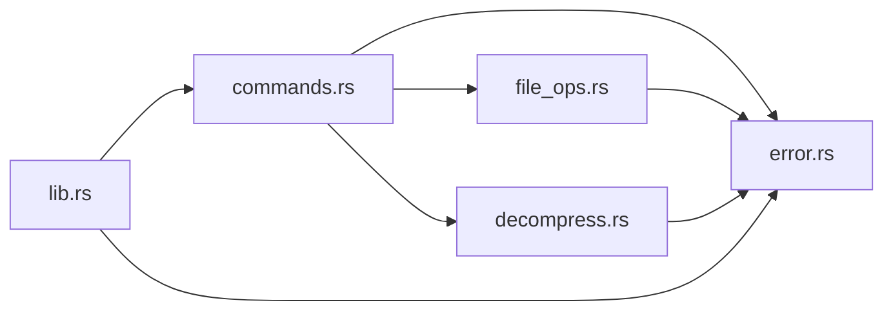

# 后端架构设计

<cite>
**本文引用的文件**
- [src-tauri/src/main.rs](file://src-tauri/src/main.rs)
- [src-tauri/src/lib.rs](file://src-tauri/src/lib.rs)
- [src-tauri/src/commands.rs](file://src-tauri/src/commands.rs)
- [src-tauri/src/file_ops.rs](file://src-tauri/src/file_ops.rs)
- [src-tauri/src/decompress.rs](file://src-tauri/src/decompress.rs)
- [src-tauri/src/error.rs](file://src-tauri/src/error.rs)
- [src-tauri/Cargo.toml](file://src-tauri/Cargo.toml)
- [src-tauri/build.rs](file://src-tauri/build.rs)
- [src-tauri/tauri.conf.json](file://src-tauri/tauri.conf.json)
</cite>

## 目录
1. [简介](#简介)
2. [项目结构](#项目结构)
3. [核心组件](#核心组件)
4. [架构总览](#架构总览)
5. [详细组件分析](#详细组件分析)
6. [依赖关系分析](#依赖关系分析)
7. [性能与内存管理](#性能与内存管理)
8. [跨平台与构建配置](#跨平台与构建配置)
9. [故障排查指南](#故障排查指南)
10. [结论](#结论)

## 简介
本文件面向 Hello-Tauri 的 Rust 后端，系统性阐述 Tauri 应用的初始化流程、Builder 模式的使用、模块组织与生命周期管理；深入解析命令注册机制（invoke_handler）与 IPC 通信建立过程；梳理 Rust 模块依赖关系与代码组织结构，解释当前模块化设计的动机；并提供跨平台兼容性考虑、构建系统配置说明、性能优化策略与内存管理最佳实践。

## 项目结构
Rust 后端位于 src-tauri 目录，采用“入口最小化 + 功能按职责拆分”的组织方式：
- main.rs：应用入口，仅调用库函数启动 Tauri。
- lib.rs：Tauri 应用初始化与命令注册中心，使用 Builder 模式装配运行时。
- commands.rs：对外暴露的命令集合，作为前端 IPC 调用的桥接层。
- file_ops.rs：文件操作与内存映射读取等底层能力。
- decompress.rs：压缩/解压逻辑封装。
- error.rs：统一错误类型定义与序列化实现。
- Cargo.toml：依赖与特性声明。
- build.rs：构建期脚本，生成 Tauri 上下文。
- tauri.conf.json：应用元数据、窗口与打包配置。

图表来源
- [src-tauri/src/main.rs:1-4](file://src-tauri/src/main.rs#L1-L4)
- [src-tauri/src/lib.rs:1-19](file://src-tauri/src/lib.rs#L1-L19)
- [src-tauri/src/commands.rs:1-53](file://src-tauri/src/commands.rs#L1-L53)
- [src-tauri/src/file_ops.rs:1-88](file://src-tauri/src/file_ops.rs#L1-L88)
- [src-tauri/src/decompress.rs:1-83](file://src-tauri/src/decompress.rs#L1-L83)
- [src-tauri/src/error.rs:1-19](file://src-tauri/src/error.rs#L1-L19)
- [src-tauri/Cargo.toml:1-19](file://src-tauri/Cargo.toml#L1-L19)
- [src-tauri/build.rs:1-4](file://src-tauri/build.rs#L1-L4)
- [src-tauri/tauri.conf.json:1-31](file://src-tauri/tauri.conf.json#L1-L31)

章节来源
- [src-tauri/src/main.rs:1-4](file://src-tauri/src/main.rs#L1-L4)
- [src-tauri/src/lib.rs:1-19](file://src-tauri/src/lib.rs#L1-L19)
- [src-tauri/Cargo.toml:1-19](file://src-tauri/Cargo.toml#L1-L19)
- [src-tauri/build.rs:1-4](file://src-tauri/build.rs#L1-L4)
- [src-tauri/tauri.conf.json:1-31](file://src-tauri/tauri.conf.json#L1-L31)

## 核心组件
- 应用初始化与生命周期
  - 入口 main.rs 仅负责调用库导出函数 run()，将控制权交给 Tauri 运行时。
  - lib.rs 中通过 tauri::Builder::default() 创建并装配应用，注册 invoke_handler 以绑定命令，最后调用 .run(generate_context!()) 启动。
  - generate_context!() 在构建期由 build.rs 驱动生成，确保运行时能正确加载前端资源与窗口配置。
- 命令注册与 IPC
  - 所有对前端暴露的异步或同步命令集中在 commands.rs，并通过 generate_handler! 宏批量注册到 invoke_handler。
  - 命令内部可调用 file_ops 与 decompress 等模块提供的能力，完成文件系统访问、内存映射读取与解压等操作。
- 错误处理
  - error.rs 定义 AppError 枚举，统一 IO、解压等错误，并实现 Serialize，以便跨 IPC 序列化为字符串返回给前端。

章节来源
- [src-tauri/src/main.rs:1-4](file://src-tauri/src/main.rs#L1-L4)
- [src-tauri/src/lib.rs:6-18](file://src-tauri/src/lib.rs#L6-L18)
- [src-tauri/src/commands.rs:1-53](file://src-tauri/src/commands.rs#L1-L53)
- [src-tauri/src/error.rs:1-19](file://src-tauri/src/error.rs#L1-L19)

## 架构总览
下图展示了从进程启动到命令执行的端到端流程，以及各模块间的交互关系。

图表来源
- [src-tauri/src/main.rs:1-4](file://src-tauri/src/main.rs#L1-L4)
- [src-tauri/src/lib.rs:6-18](file://src-tauri/src/lib.rs#L6-L18)
- [src-tauri/src/commands.rs:1-53](file://src-tauri/src/commands.rs#L1-L53)
- [src-tauri/src/file_ops.rs:1-88](file://src-tauri/src/file_ops.rs#L1-L88)
- [src-tauri/src/decompress.rs:1-83](file://src-tauri/src/decompress.rs#L1-L83)
- [src-tauri/src/error.rs:1-19](file://src-tauri/src/error.rs#L1-L19)

## 详细组件分析

### 应用初始化与 Builder 模式
- 初始化流程
  - main.rs 直接委托给 hello_tauri::run()，保持二进制目标极简。
  - lib.rs 中通过 tauri::Builder::default() 创建默认构建器，随后：
    - 使用 invoke_handler(tauri::generate_handler![...]) 注册命令。
    - 调用 .run(tauri::generate_context!()) 启动应用。
- 生命周期要点
  - 构建期：build.rs 调用 tauri_build::build()，生成上下文供 generate_context!() 使用。
  - 运行期：Tauri 负责创建窗口、加载前端资源、建立 IPC 通道，并将命令路由到对应处理器。
- 为什么使用 Builder 模式
  - 清晰分离“构建阶段”和“运行阶段”，便于扩展中间件、插件与全局状态。
  - 集中式装配点，利于测试与替换实现。

章节来源
- [src-tauri/src/main.rs:1-4](file://src-tauri/src/main.rs#L1-L4)
- [src-tauri/src/lib.rs:6-18](file://src-tauri/src/lib.rs#L6-L18)
- [src-tauri/build.rs:1-4](file://src-tauri/build.rs#L1-L4)

### 命令注册机制与 IPC 通信
- 命令注册
  - 通过 generate_handler! 宏将 commands.rs 中的函数注册为 IPC 命令。
  - 支持异步命令（如 read_file、write_file、get_temp_dir）与同步命令（如 mmap_read、list_files、decompress）。
- IPC 通信建立
  - Tauri 在应用启动时建立命令路由表，前端通过命令名调用后端函数，参数与返回值自动序列化/反序列化。
- 安全与校验
  - 命令入口处进行路径遍历防护（禁止包含 “..”），避免越权访问。
  - 错误通过 AppError 统一包装，保证跨语言边界的一致性。

图表来源
- [src-tauri/src/commands.rs:1-53](file://src-tauri/src/commands.rs#L1-L53)
- [src-tauri/src/file_ops.rs:1-88](file://src-tauri/src/file_ops.rs#L1-L88)
- [src-tauri/src/decompress.rs:1-83](file://src-tauri/src/decompress.rs#L1-L83)
- [src-tauri/src/error.rs:1-19](file://src-tauri/src/error.rs#L1-L19)

章节来源
- [src-tauri/src/commands.rs:1-53](file://src-tauri/src/commands.rs#L1-L53)

### 文件与内存映射操作
- 内存映射读取
  - 打开文件后使用 memmap2 创建内存映射，按偏移与长度切片拷贝到 Vec<u8>。
  - 越界检查防止读取超出文件大小，错误以 AppError::Io 返回。
- 递归列出文件
  - 深度优先遍历目录，收集文件名、绝对路径、大小与是否为目录信息，返回 FileMeta 列表。
- 复杂度与性能
  - 内存映射避免了整文件加载到用户态缓冲，适合大文件随机读。
  - 列表操作为 O(N)（N 为目录下条目数），递归深度受文件系统层级限制。

图表来源
- [src-tauri/src/file_ops.rs:1-88](file://src-tauri/src/file_ops.rs#L1-L88)

章节来源
- [src-tauri/src/file_ops.rs:1-88](file://src-tauri/src/file_ops.rs#L1-L88)

### 解压模块
- ZIP 解压
  - 使用 zip crate 迭代归档项，逐条创建目录或写出文件，记录每个文件的元信息。
- GZIP 解压
  - 使用 flate2 解码为字节流，写回输出目录下的固定文件名。
- 错误处理
  - 解压失败统一转换为 AppError::Decompress，并在上层命令中包装为成功/失败的结构体返回。

图表来源
- [src-tauri/src/decompress.rs:1-83](file://src-tauri/src/decompress.rs#L1-L83)

章节来源
- [src-tauri/src/decompress.rs:1-83](file://src-tauri/src/decompress.rs#L1-L83)

### 错误模型
- AppError 枚举
  - Io：封装 std::io::Error。
  - Decompress：携带解压错误消息。
  - NotFound：预留未找到错误。
- 序列化
  - 实现 serde::Serialize，将错误转为字符串，便于前端消费。

章节来源
- [src-tauri/src/error.rs:1-19](file://src-tauri/src/error.rs#L1-L19)

## 依赖关系分析
- 外部依赖
  - tauri v2：提供应用框架、Builder 与 IPC。
  - tokio v1（full）：用于异步文件系统操作。
  - memmap2：内存映射读取。
  - zip、flate2：压缩/解压。
  - rayon：并行计算（当前未直接使用，可作为后续扩展点）。
  - serde、serde_json：序列化/反序列化。
  - thiserror：错误类型派生与 Display 实现。
- 模块内依赖
  - commands.rs 依赖 file_ops.rs、decompress.rs、error.rs。
  - file_ops.rs 依赖 error.rs。
  - decompress.rs 依赖 error.rs。
  - lib.rs 聚合以上模块并注册命令。

图表来源
- [src-tauri/src/commands.rs:1-53](file://src-tauri/src/commands.rs#L1-L53)
- [src-tauri/src/file_ops.rs:1-88](file://src-tauri/src/file_ops.rs#L1-L88)
- [src-tauri/src/decompress.rs:1-83](file://src-tauri/src/decompress.rs#L1-L83)
- [src-tauri/src/error.rs:1-19](file://src-tauri/src/error.rs#L1-L19)
- [src-tauri/src/lib.rs:1-19](file://src-tauri/src/lib.rs#L1-L19)

章节来源
- [src-tauri/Cargo.toml:1-19](file://src-tauri/Cargo.toml#L1-L19)
- [src-tauri/src/commands.rs:1-53](file://src-tauri/src/commands.rs#L1-L53)
- [src-tauri/src/file_ops.rs:1-88](file://src-tauri/src/file_ops.rs#L1-L88)
- [src-tauri/src/decompress.rs:1-83](file://src-tauri/src/decompress.rs#L1-L83)
- [src-tauri/src/error.rs:1-19](file://src-tauri/src/error.rs#L1-L19)
- [src-tauri/src/lib.rs:1-19](file://src-tauri/src/lib.rs#L1-L19)

## 性能与内存管理
- 大文件读取
  - 使用内存映射减少用户态拷贝，降低内存峰值与 I/O 开销。
  - 建议按需读取（offset/length），避免一次性加载超大文件。
- 并发与并行
  - 命令可使用 tokio 异步执行阻塞型任务，避免阻塞事件循环。
  - 对于大批量文件处理，可引入 rayon 进行并行遍历与解压（当前依赖已引入，可按需启用）。
- 序列化成本
  - 返回大量数据前，评估 JSON 序列化开销；必要时采用分块传输或流式 API。
- 资源释放
  - 显式关闭文件句柄、及时 drop 大对象，避免长时间持有内存映射。
- 错误快速失败
  - 在命令入口尽早校验参数与权限，减少无效 I/O 与 CPU 消耗。

[本节为通用指导，不直接分析具体文件]

## 跨平台与构建配置
- 构建系统
  - build.rs 调用 tauri_build::build()，在编译期生成 Tauri 上下文，使 generate_context!() 可用。
- 应用配置
  - tauri.conf.json 指定产品名称、版本、标识符、前端资源目录、开发服务器地址、窗口尺寸与打包图标等。
- 依赖与特性
  - Cargo.toml 声明 tauri v2、tokio full、memmap2、zip、flate2、rayon、serde、thiserror 等依赖。
- 跨平台注意事项
  - 路径分隔符与大小写敏感性差异：建议使用标准库 Path 与 to_string_lossy 转换。
  - 临时目录获取：使用 std::env::temp_dir() 在不同平台下获得一致行为。
  - 权限与沙箱：不同平台的文件系统权限模型存在差异，应在命令层做必要校验。

章节来源
- [src-tauri/build.rs:1-4](file://src-tauri/build.rs#L1-L4)
- [src-tauri/tauri.conf.json:1-31](file://src-tauri/tauri.conf.json#L1-L31)
- [src-tauri/Cargo.toml:1-19](file://src-tauri/Cargo.toml#L1-L19)

## 故障排查指南
- 常见错误定位
  - 路径遍历被拒绝：检查传入路径是否包含 “..”。
  - 读取范围越界：确认 offset 与 length 不超过文件大小。
  - 解压失败：查看 AppError::Decompress 的消息，确认输入数据格式与完整性。
- 日志与调试
  - 在命令入口处打印关键参数与耗时，结合前端控制台观察 IPC 往返时间。
  - 使用单元测试验证文件操作与解压逻辑（file_ops.rs 中包含示例测试）。
- 恢复策略
  - 对不可恢复错误返回结构化错误，前端提示重试或更换输入。
  - 对部分失败场景（如解压多个条目）采用增量记录与断点续传思路。

章节来源
- [src-tauri/src/commands.rs:1-53](file://src-tauri/src/commands.rs#L1-L53)
- [src-tauri/src/file_ops.rs:55-87](file://src-tauri/src/file_ops.rs#L55-L87)
- [src-tauri/src/error.rs:1-19](file://src-tauri/src/error.rs#L1-L19)

## 结论
该后端采用清晰的模块化设计与 Builder 模式，将 Tauri 初始化、命令注册与业务逻辑解耦，具备良好的可扩展性与可维护性。通过统一的错误模型与安全的命令校验，保障了 IPC 调用的健壮性。借助内存映射与异步 I/O，系统在大数据场景下具备良好性能基础。后续可在并行处理、流式传输与更细粒度的权限控制方面持续优化。