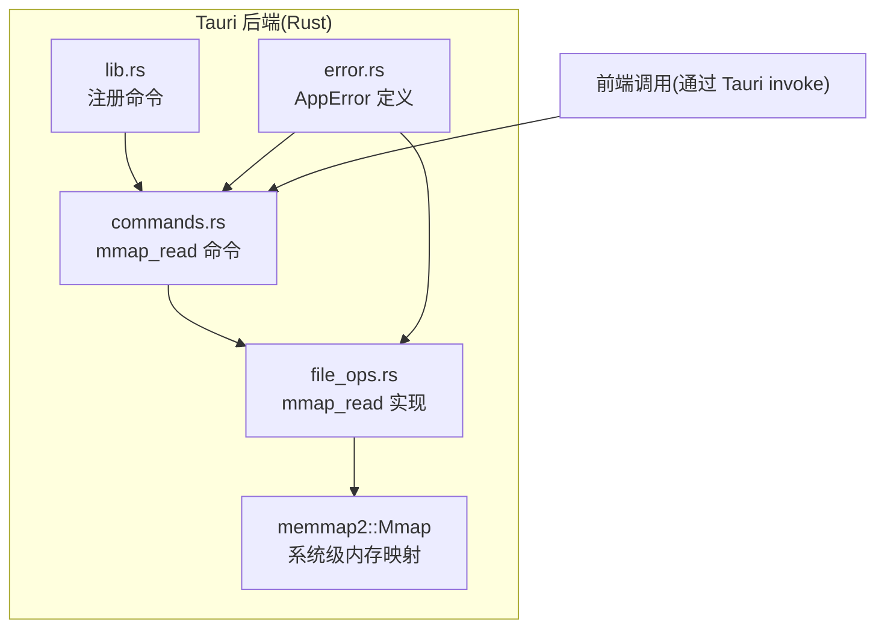
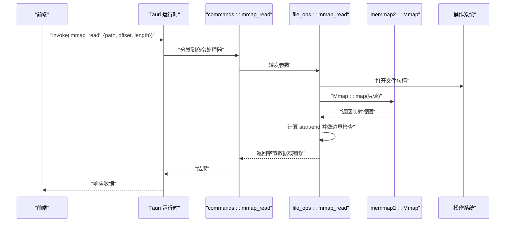
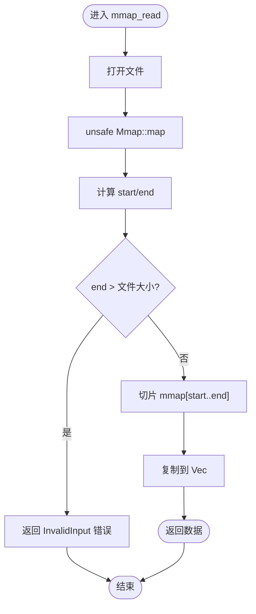

# 内存映射零拷贝读取

<cite>
**本文引用的文件**
- [src-tauri/src/file_ops.rs](file://src-tauri/src/file_ops.rs)
- [src-tauri/src/commands.rs](file://src-tauri/src/commands.rs)
- [src-tauri/src/lib.rs](file://src-tauri/src/lib.rs)
- [src-tauri/Cargo.toml](file://src-tauri/Cargo.toml)
- [src-tauri/Cargo.lock](file://src-tauri/Cargo.lock)
- [src-tauri/src/error.rs](file://src-tauri/src/error.rs)
</cite>

## 目录
1. [简介](#简介)
2. [项目结构](#项目结构)
3. [核心组件](#核心组件)
4. [架构总览](#架构总览)
5. [详细组件分析](#详细组件分析)
6. [依赖关系分析](#依赖关系分析)
7. [性能考量](#性能考量)
8. [故障排查指南](#故障排查指南)
9. [结论](#结论)
10. [附录](#附录)

## 简介
本技术文档聚焦于 Hello-Tauri 中的“内存映射零拷贝读取”能力，围绕 memmap2 crate 的使用、Mmap::map 的安全与性能特性、mmap_read 函数的实现机制（偏移量计算、边界检查、错误处理）、大文件处理的内存管理策略、跨平台兼容性以及常见问题解决方案展开。文档旨在帮助开发者理解并正确使用该功能，同时提供可操作的实践建议与排障指引。

## 项目结构
与内存映射读取相关的代码位于 src-tauri 子项目中，关键文件包括：
- file_ops.rs：实现基于 memmap2 的 mmap_read 函数及文件遍历等辅助逻辑
- commands.rs：将 mmap_read 暴露为 Tauri 命令
- lib.rs：注册 Tauri 命令入口
- Cargo.toml / Cargo.lock：声明 memmap2 依赖及其版本锁定
- error.rs：统一错误类型 AppError

图表来源
- [src-tauri/src/lib.rs:6-18](file://src-tauri/src/lib.rs#L6-L18)
- [src-tauri/src/commands.rs:27-30](file://src-tauri/src/commands.rs#L27-L30)
- [src-tauri/src/file_ops.rs:6-18](file://src-tauri/src/file_ops.rs#L6-L18)
- [src-tauri/src/error.rs:1-19](file://src-tauri/src/error.rs#L1-L19)

章节来源
- [src-tauri/src/lib.rs:6-18](file://src-tauri/src/lib.rs#L6-L18)
- [src-tauri/src/commands.rs:27-30](file://src-tauri/src/commands.rs#L27-L30)
- [src-tauri/src/file_ops.rs:6-18](file://src-tauri/src/file_ops.rs#L6-L18)
- [src-tauri/src/error.rs:1-19](file://src-tauri/src/error.rs#L1-L19)

## 核心组件
- memmap2 依赖：在 Cargo.toml 中引入 memmap2 0.9 系列，用于创建只读内存映射视图
- Mmap::map：对已打开的文件句柄建立内存映射，返回一个可切片访问的内存区域
- mmap_read：对外暴露的核心函数，负责参数校验、边界检查、范围读取并返回字节数据
- Tauri 命令封装：commands.rs 中将 mmap_read 暴露为 Tauri 命令，供前端调用
- 错误模型：AppError 统一包装 IO 错误，便于序列化回传

章节来源
- [src-tauri/Cargo.toml:6-16](file://src-tauri/Cargo.toml#L6-L16)
- [src-tauri/src/file_ops.rs:6-18](file://src-tauri/src/file_ops.rs#L6-L18)
- [src-tauri/src/commands.rs:27-30](file://src-tauri/src/commands.rs#L27-L30)
- [src-tauri/src/error.rs:1-19](file://src-tauri/src/error.rs#L1-L19)

## 架构总览
从前端到内核的调用链路如下：
- 前端通过 Tauri invoke 调用命令
- Tauri 路由到 commands::mmap_read
- commands::mmap_read 委托给 file_ops::mmap_read
- file_ops::mmap_read 使用 memmap2::Mmap::map 建立映射并进行范围读取
- 错误通过 AppError 统一返回

图表来源
- [src-tauri/src/lib.rs:6-18](file://src-tauri/src/lib.rs#L6-L18)
- [src-tauri/src/commands.rs:27-30](file://src-tauri/src/commands.rs#L27-L30)
- [src-tauri/src/file_ops.rs:6-18](file://src-tauri/src/file_ops.rs#L6-L18)

## 详细组件分析

### mmap_read 实现机制
- 输入参数
  - path：目标文件路径
  - offset：起始偏移（字节）
  - length：读取长度（字节）
- 处理流程
  - 打开文件句柄
  - 使用 unsafe 块调用 Mmap::map 建立只读映射
  - 计算 start = offset，end = offset + length
  - 边界检查：若 end > 文件大小，返回无效输入错误
  - 切片读取 mmap[start..end] 并复制到 Vec<u8> 返回
- 安全考虑
  - Mmap::map 是 unsafe 操作，需确保文件句柄有效且映射成功
  - 当前实现未显式关闭映射对象；Rust 生命周期结束后会释放映射资源
  - 仅进行 end 越界检查，未校验 offset < length 或负数溢出场景
- 错误处理
  - 文件打开失败：由 AppError::Io 包装
  - 映射失败：由 AppError::Io 包装
  - 越界读取：构造 InvalidInput 错误并返回

图表来源
- [src-tauri/src/file_ops.rs:6-18](file://src-tauri/src/file_ops.rs#L6-L18)

章节来源
- [src-tauri/src/file_ops.rs:6-18](file://src-tauri/src/file_ops.rs#L6-L18)

### Tauri 命令封装与注册
- commands.rs 中定义 #[tauri::command] 的 mmap_read，直接转发至 file_ops::mmap_read
- lib.rs 中通过 generate_handler! 注册命令，使前端可通过 invoke 调用

章节来源
- [src-tauri/src/commands.rs:27-30](file://src-tauri/src/commands.rs#L27-L30)
- [src-tauri/src/lib.rs:6-18](file://src-tauri/src/lib.rs#L6-L18)

### 错误模型 AppError
- 统一包装 IO 错误、解压错误、未找到错误等
- 实现 Serialize，以便序列化为字符串返回前端

章节来源
- [src-tauri/src/error.rs:1-19](file://src-tauri/src/error.rs#L1-L19)

## 依赖关系分析
- memmap2 版本锁定在 0.9.x，底层依赖 libc，跨平台通过系统 API 实现映射
- 其他依赖如 tokio、serde、thiserror 等与本功能间接相关

图表来源
- [src-tauri/Cargo.toml:6-16](file://src-tauri/Cargo.toml#L6-L16)
- [src-tauri/Cargo.lock:1881-1887](file://src-tauri/Cargo.lock#L1881-L1887)

章节来源
- [src-tauri/Cargo.toml:6-16](file://src-tauri/Cargo.toml#L6-L16)
- [src-tauri/Cargo.lock:1881-1887](file://src-tauri/Cargo.lock#L1881-L1887)

## 性能考量
- 零拷贝优势
  - 通过内存映射避免整文件加载到用户态缓冲区，减少一次完整复制
  - 适合随机访问与大文件的按需读取
- 实际行为
  - 当前实现仍会将切片内容复制到 Vec<u8> 再返回，存在一次额外拷贝
  - 若追求极致零拷贝，可在上层消费时直接持有映射视图（需注意生命周期与并发安全）
- 内存占用
  - 映射区域由操作系统分页管理，不会常驻物理内存，按需缺页加载
  - 进程退出或映射对象销毁后，映射资源释放
- 并发与线程安全
  - 只读映射在多线程下通常安全，但应避免在映射期间修改源文件
- 优化建议
  - 对于超大文件，优先按小块分段读取，降低峰值内存
  - 复用 File 句柄与映射对象可减少系统调用开销（注意作用域与生命周期）
  - 结合流式处理与异步 I/O 提升吞吐

[本节为通用性能讨论，不直接分析具体文件]

## 故障排查指南
- 常见错误与定位
  - 路径不存在或权限不足：检查 AppError::Io 的来源，确认路径与权限
  - 越界读取：当 end > 文件大小时报 InvalidInput，需校验 offset 与 length
  - 映射失败：可能由于文件系统不支持或句柄无效，查看底层 IO 错误信息
- 调试建议
  - 打印文件大小与请求范围，验证边界条件
  - 在单元测试中覆盖正常、越界、空范围等用例
- 已知测试用例
  - 包含基本读取与目录遍历测试，可用于回归验证

章节来源
- [src-tauri/src/file_ops.rs:55-87](file://src-tauri/src/file_ops.rs#L55-L87)
- [src-tauri/src/error.rs:1-19](file://src-tauri/src/error.rs#L1-L19)

## 结论
Hello-Tauri 的内存映射零拷贝读取通过 memmap2 提供了高效的大文件访问能力。当前实现简洁可靠，具备明确的边界检查与错误处理。为进一步优化，可在上层避免不必要的拷贝、合理划分读取粒度，并结合流式处理与异步 I/O 提升整体性能。

[本节为总结性内容，不直接分析具体文件]

## 附录

### 使用示例（概念性步骤）
- 前端调用
  - 通过 Tauri invoke 调用 'mmap_read'，传入 path、offset、length
- 后端处理
  - 命令层转发到 file_ops::mmap_read
  - 执行映射与范围读取，返回字节数据
- 注意事项
  - 确保 offset 与 length 合法
  - 避免在映射期间修改源文件

[本节为概念性说明，不直接分析具体文件]

### 跨平台兼容性说明
- memmap2 依赖 libc，支持主流桌面平台（Windows、macOS、Linux）
- 不同平台的文件系统与页面大小差异可能导致性能波动
- 建议在目标平台上进行基准测试以评估实际表现

[本节为通用说明，不直接分析具体文件]

### 性能基准测试建议（方法学）
- 测试场景
  - 小文件顺序读取 vs 随机片段读取
  - 大文件分段读取（例如 1MB 块）
- 指标
  - 平均延迟、P95/P99 延迟
  - 吞吐量（MB/s）
  - 内存峰值与 RSS 变化
- 工具
  - Rust 内置基准框架或外部压测工具
  - 系统监控工具观察缺页与磁盘 I/O

[本节为方法论指导，不直接分析具体文件]