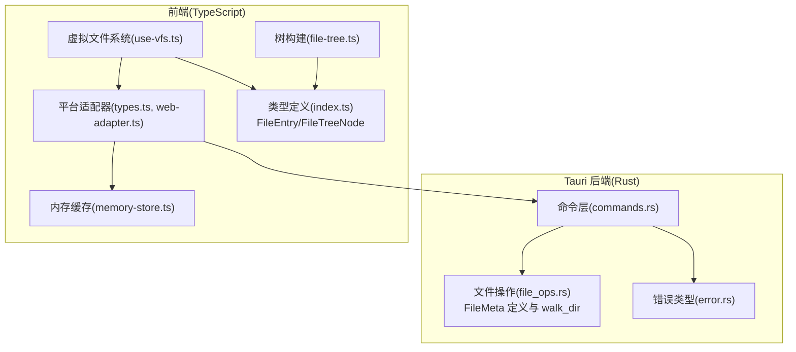
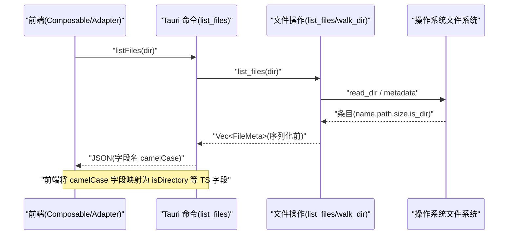
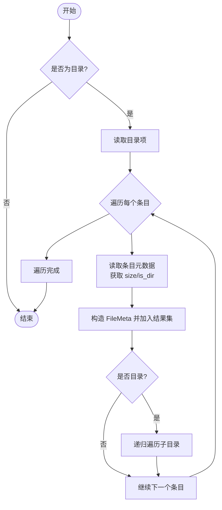
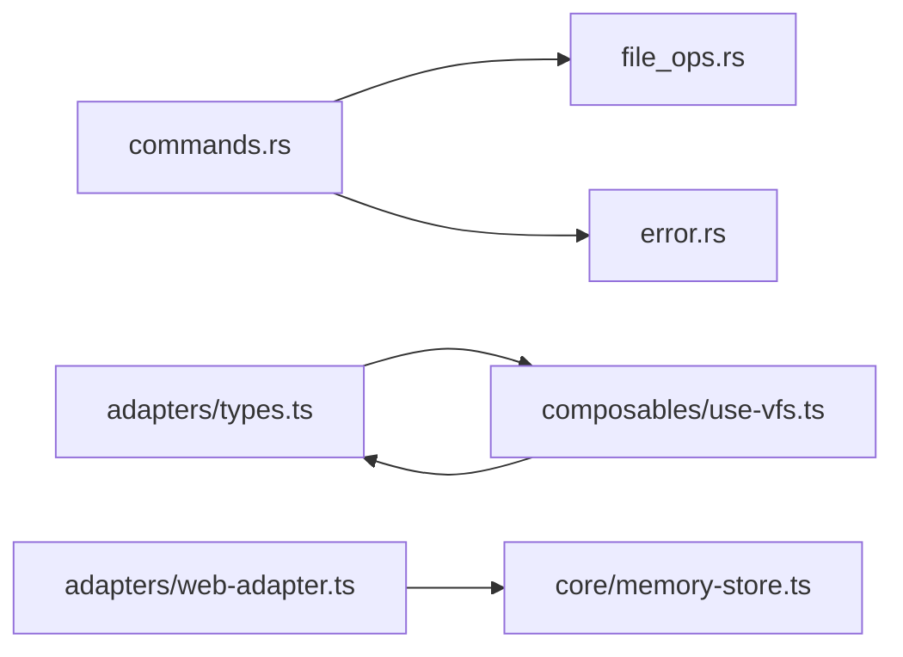

# 文件元数据管理

<cite>
**本文引用的文件**
- [file_ops.rs](file://src-tauri/src/file_ops.rs)
- [commands.rs](file://src-tauri/src/commands.rs)
- [error.rs](file://src-tauri/src/error.rs)
- [index.ts](file://src/types/index.ts)
- [types.ts](file://src/adapters/types.ts)
- [web-adapter.ts](file://src/adapters/web-adapter.ts)
- [use-vfs.ts](file://src/composables/use-vfs.ts)
- [file-tree.ts](file://src/core/file-tree.ts)
- [memory-store.ts](file://src/core/memory-store.ts)
</cite>

## 目录
1. [简介](#简介)
2. [项目结构](#项目结构)
3. [核心组件](#核心组件)
4. [架构总览](#架构总览)
5. [详细组件分析](#详细组件分析)
6. [依赖关系分析](#依赖关系分析)
7. [性能考量](#性能考量)
8. [故障排查指南](#故障排查指南)
9. [结论](#结论)
10. [附录](#附录)

## 简介
本文件聚焦 Hello-Tauri 中的“文件元数据管理”能力，围绕 Rust 侧的 FileMeta 结构体、元数据获取流程、序列化命名约定（camelCase）、前端类型与适配层映射、以及查询与过滤的最佳实践展开。文档同时给出大文件场景下的优化建议与错误处理模式，帮助读者在跨语言（Rust ↔ TypeScript）环境下稳定、高效地获取和使用文件元数据。

## 项目结构
与文件元数据相关的代码横跨 Tauri 后端（Rust）与前端（TypeScript），并通过 IPC 命令进行通信：
- Rust 侧负责文件系统遍历与元数据收集，定义并序列化 FileMeta。
- 前端通过适配器抽象调用 Tauri 命令，将返回的 camelCase 字段映射为 TS 侧的 isDirectory 等字段。
- 树构建器将扁平的文件列表转换为可交互的树形结构。

图表来源
- [commands.rs:27-35](file://src-tauri/src/commands.rs#L27-L35)
- [file_ops.rs:20-53](file://src-tauri/src/file_ops.rs#L20-L53)
- [error.rs:1-19](file://src-tauri/src/error.rs#L1-L19)
- [types.ts:1-11](file://src/adapters/types.ts#L1-L11)
- [web-adapter.ts:1-29](file://src/adapters/web-adapter.ts#L1-L29)
- [use-vfs.ts:1-17](file://src/composables/use-vfs.ts#L1-L17)
- [index.ts:1-7](file://src/types/index.ts#L1-L7)
- [file-tree.ts:1-44](file://src/core/file-tree.ts#L1-L44)
- [memory-store.ts:1-25](file://src/core/memory-store.ts#L1-L25)

章节来源
- [commands.rs:27-35](file://src-tauri/src/commands.rs#L27-L35)
- [file_ops.rs:20-53](file://src-tauri/src/file_ops.rs#L20-L53)
- [index.ts:1-7](file://src/types/index.ts#L1-L7)
- [types.ts:1-11](file://src/adapters/types.ts#L1-L11)
- [use-vfs.ts:1-17](file://src/composables/use-vfs.ts#L1-L17)
- [file-tree.ts:1-44](file://src/core/file-tree.ts#L1-L44)
- [memory-store.ts:1-25](file://src/core/memory-store.ts#L1-L25)

## 核心组件
- FileMeta（Rust）：用于承载单个文件或目录的元数据，包含 name、path、size、is_directory 四个字段，并在序列化时统一使用 camelCase 命名。
- list_files（Rust）：递归遍历目录，收集每个条目的元数据，返回 FileMeta 列表。
- 前端 FileEntry（TS）：与 FileMeta 对应的 TS 类型，字段名采用 isDirectory 等驼峰风格，便于前端消费。
- 适配器与命令层：前端通过 IPlatformAdapter.listFiles 调用 Tauri 命令 list_files，得到 FileMeta 列表后映射为 FileEntry[]。
- 树构建器：将扁平的 FileEntry[] 构造成 FileTreeNode[] 树，供 UI 展示与交互。

章节来源
- [file_ops.rs:26-33](file://src-tauri/src/file_ops.rs#L26-L33)
- [file_ops.rs:20-53](file://src-tauri/src/file_ops.rs#L20-L53)
- [index.ts:1-7](file://src/types/index.ts#L1-L7)
- [types.ts:1-11](file://src/adapters/types.ts#L1-L11)
- [file-tree.ts:1-44](file://src/core/file-tree.ts#L1-L44)

## 架构总览
下图展示了从前端发起目录列表请求到后端返回元数据的完整链路，包括命名转换与类型映射。

图表来源
- [commands.rs:32-35](file://src-tauri/src/commands.rs#L32-L35)
- [file_ops.rs:20-53](file://src-tauri/src/file_ops.rs#L20-L53)
- [file_ops.rs:26-33](file://src-tauri/src/file_ops.rs#L26-L33)
- [types.ts:1-11](file://src/adapters/types.ts#L1-L11)

## 详细组件分析

### FileMeta 结构体设计与字段语义
- name：条目名称（文件或目录名）。
- path：绝对或相对路径字符串，用于唯一标识与后续定位。
- size：文件大小（字节数），对目录通常为 0。
- is_directory：是否为目录。该字段在序列化时会被转换为 camelCase 的 isDirectory，以匹配前端 FileEntry 的字段名。

设计要点
- 仅保留必要字段，避免冗余信息，降低序列化体积与传输开销。
- 使用 serde 的 rename_all = "camelCase" 保证前后端字段一致，减少手动映射成本。

章节来源
- [file_ops.rs:26-33](file://src-tauri/src/file_ops.rs#L26-L33)
- [AGENTS.md:116-118](file://AGENTS.md#L116-L118)

### 元数据获取机制与性能影响
- 入口函数 list_files 会调用 walk_dir 递归遍历目录。
- 对于每个条目，读取其 metadata() 以获取 size 与 is_dir 等信息，并构造 FileMeta。
- 性能关注点：
  - 递归遍历在大目录上会产生大量系统调用与对象分配。
  - metadata() 是必要的系统调用，无法完全避免；但可通过限制深度、分页/懒加载、增量更新等方式缓解。
  - 当前实现未内置元数据缓存，重复遍历同一目录会导致重复 IO。

章节来源
- [file_ops.rs:20-53](file://src-tauri/src/file_ops.rs#L20-L53)

### 序列化和反序列化配置（camelCase 命名约定）
- Rust 侧使用 #[serde(rename_all = "camelCase")]，使所有字段在 JSON 中输出为驼峰形式（如 is_directory → isDirectory）。
- 前端类型 FileEntry 使用 isDirectory 等驼峰字段，天然兼容后端输出，无需额外转换。
- 若未来需要双向通信（前端→后端），建议在对应结构体上添加 Deserialize 并使用相同命名策略。

章节来源
- [file_ops.rs:26-33](file://src-tauri/src/file_ops.rs#L26-L33)
- [index.ts:1-7](file://src/types/index.ts#L1-L7)
- [AGENTS.md:116-118](file://AGENTS.md#L116-L118)

### 前端类型与适配器映射
- IPlatformAdapter.listFiles 返回 Promise<FileEntry[]>，由具体适配器实现。
- WebAdapter 在当前实现中未提供 listFiles（抛出错误），实际生产环境通常由 TauriAdapter 调用 Tauri 命令完成。
- useVirtualFileSystem.listDir 作为组合式封装，屏蔽底层差异，向上暴露统一的 listDir 接口。

章节来源
- [types.ts:1-11](file://src/adapters/types.ts#L1-L11)
- [web-adapter.ts:19-21](file://src/adapters/web-adapter.ts#L19-L21)
- [use-vfs.ts:11-14](file://src/composables/use-vfs.ts#L11-L14)

### 树构建与扁平化
- FileTreeBuilder.build 接收 FileEntry[] 与根路径，生成 FileTreeNode[] 树结构。
- 支持查找节点与扁平化遍历，便于搜索与统计。

章节来源
- [file-tree.ts:1-44](file://src/core/file-tree.ts#L1-L44)

### 关键流程图：walk_dir 元数据收集

图表来源
- [file_ops.rs:35-53](file://src-tauri/src/file_ops.rs#L35-L53)

## 依赖关系分析
- commands.rs 暴露 list_files 命令，内部委托给 file_ops::list_files。
- file_ops.rs 依赖 std::fs 与 memmap2（后者主要用于 mmap_read，非元数据必需）。
- error.rs 定义了 AppError，统一包装 IO 等错误，便于跨边界传递。
- 前端通过 adapters/types.ts 定义的 IPlatformAdapter 抽象，解耦平台差异。
- memory-store.ts 提供内存缓存，主要服务于 WebAdapter 的读缓存与流式读取，不直接参与元数据缓存。

图表来源
- [commands.rs:27-35](file://src-tauri/src/commands.rs#L27-L35)
- [file_ops.rs:20-53](file://src-tauri/src/file_ops.rs#L20-L53)
- [error.rs:1-19](file://src-tauri/src/error.rs#L1-L19)
- [types.ts:1-11](file://src/adapters/types.ts#L1-L11)
- [use-vfs.ts:1-17](file://src/composables/use-vfs.ts#L1-L17)
- [web-adapter.ts:1-29](file://src/adapters/web-adapter.ts#L1-L29)
- [memory-store.ts:1-25](file://src/core/memory-store.ts#L1-L25)

章节来源
- [commands.rs:27-35](file://src-tauri/src/commands.rs#L27-L35)
- [file_ops.rs:20-53](file://src-tauri/src/file_ops.rs#L20-L53)
- [error.rs:1-19](file://src-tauri/src/error.rs#L1-L19)
- [types.ts:1-11](file://src/adapters/types.ts#L1-L11)
- [use-vfs.ts:1-17](file://src/composables/use-vfs.ts#L1-L17)
- [web-adapter.ts:1-29](file://src/adapters/web-adapter.ts#L1-L29)
- [memory-store.ts:1-25](file://src/core/memory-store.ts#L1-L25)

## 性能考量
- 元数据获取
  - 递归遍历在大目录上开销显著，建议结合 UI 懒加载（按需展开目录）与分页/分批返回。
  - 可在后端增加可选参数（如 max_depth、limit）控制遍历范围。
- 缓存策略
  - 当前未实现元数据缓存。可引入基于路径的缓存（例如 Map<path, {meta, timestamp}>），配合失效策略（目录变更事件或 TTL）。
  - 前端可对已展示的目录节点做本地缓存，避免重复请求。
- 大文件元数据处理
  - 元数据本身只含 size，不涉及内容读取，因此不受文件大小直接影响。
  - 若后续扩展元数据（如哈希、内容预览），应使用分块/流式读取与异步任务调度，避免阻塞主线程。
- 序列化体积
  - 保持 FileMeta 字段精简，必要时可按需扩展，避免一次性返回过多无关字段。

[本节为通用指导，不直接分析具体文件]

## 故障排查指南
- 常见错误类型
  - IO 错误：文件不存在、权限不足、路径非法等，统一包装为 AppError::Io。
  - 不支持格式：解压等场景返回结构化错误信息。
- 调试建议
  - 检查传入路径是否合法，避免路径穿越（命令层已有安全检查示例）。
  - 确认 Tauri 命令注册与权限配置正确。
  - 在前端捕获适配器抛出的异常，并提示用户重试或切换目录。

章节来源
- [error.rs:1-19](file://src-tauri/src/error.rs#L1-L19)
- [commands.rs:6-14](file://src-tauri/src/commands.rs#L6-L14)

## 结论
Hello-Tauri 的文件元数据管理以轻量、清晰的 FileMeta 为核心，通过 serde 的 camelCase 命名约定无缝对接前端类型，借助适配器与命令层实现跨语言通信。当前实现简洁可靠，适合中小规模目录浏览；面对大规模目录与大文件场景，建议引入缓存、分页与懒加载等策略以提升性能与用户体验。

[本节为总结性内容，不直接分析具体文件]

## 附录

### API 参考（命令与类型）
- Tauri 命令
  - list_files(dir: string): Result<Vec<FileMeta>, AppError>
    - 作用：列出指定目录及其子目录的所有条目元数据。
    - 返回：FileMeta 数组，字段名为 camelCase。
- 前端类型
  - FileEntry{name:string; path:string; size:number; isDirectory:boolean; lastModified?:number}
  - FileTreeNode{key:string; label:string; isLeaf:boolean; path:string; size?:number; children?:FileTreeNode[]}
  - IPlatformAdapter.listFiles(dir: string): Promise<FileEntry[]>

章节来源
- [commands.rs:32-35](file://src-tauri/src/commands.rs#L32-L35)
- [index.ts:1-24](file://src/types/index.ts#L1-L24)
- [types.ts:1-11](file://src/adapters/types.ts#L1-L11)

### 最佳实践清单
- 元数据查询
  - 优先使用 list_files 获取扁平列表，再在前端构建所需视图（树/表/筛选）。
  - 对深层目录采用懒加载，仅在用户展开时触发请求。
- 过滤与排序
  - 在前端按 isDirectory、name、size 进行过滤与排序，减少网络往返。
  - 对 size 进行单位换算与格式化显示，提升可读性。
- 错误处理
  - 统一捕获 AppError，向用户反馈友好提示。
  - 对路径穿越等安全风险进行校验与拒绝。
- 大文件优化
  - 元数据层面无需特殊处理；若扩展至内容读取，请采用流式/分块读取与进度反馈。
  - 结合内存缓存（memory-store）减少重复 IO。

[本节为通用指导，不直接分析具体文件]