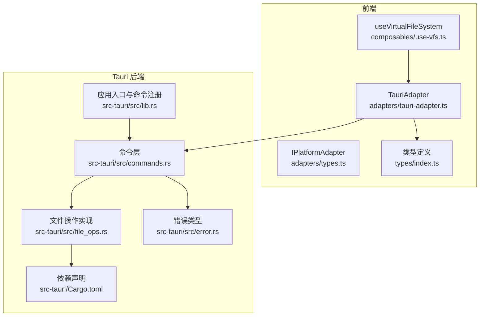
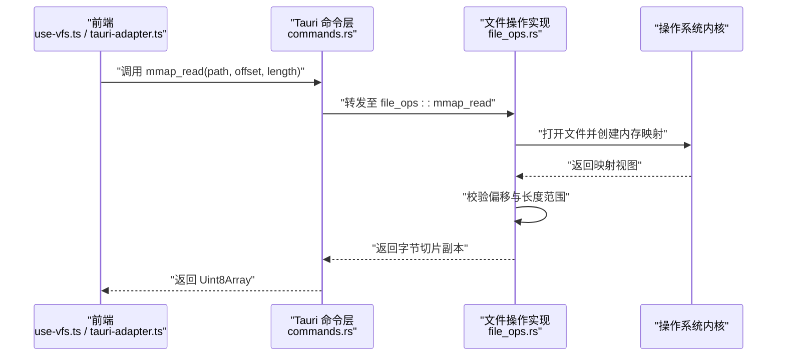
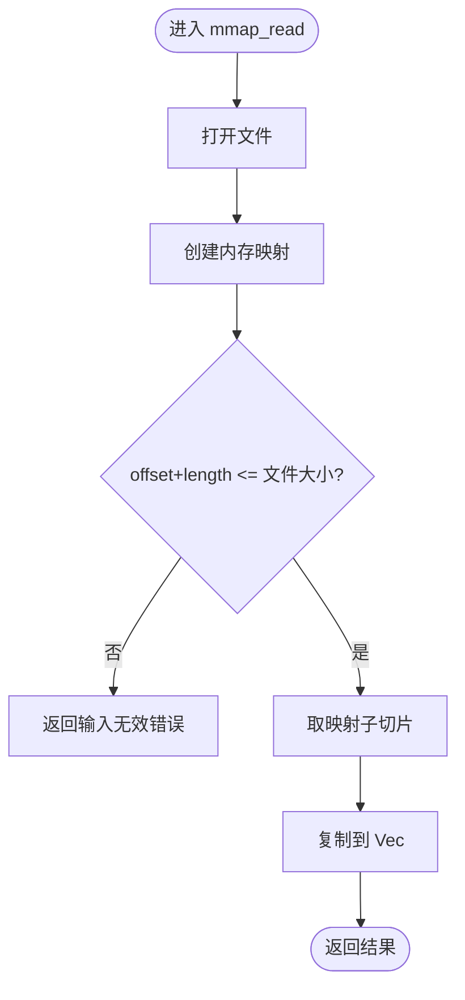
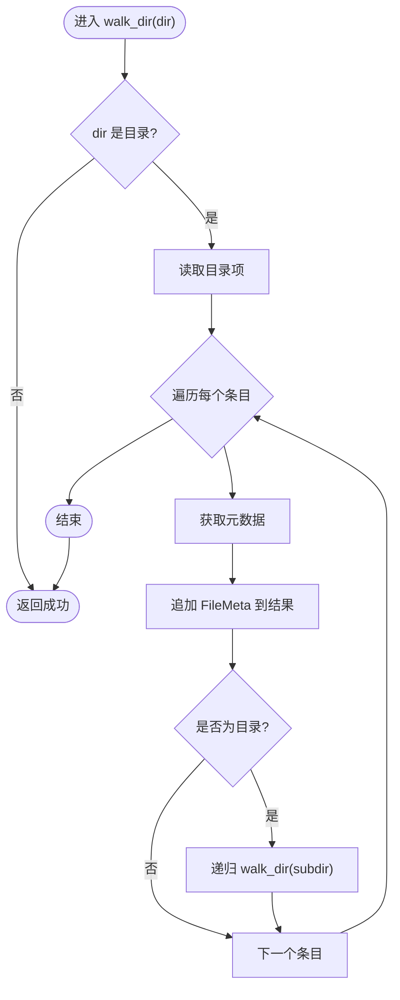
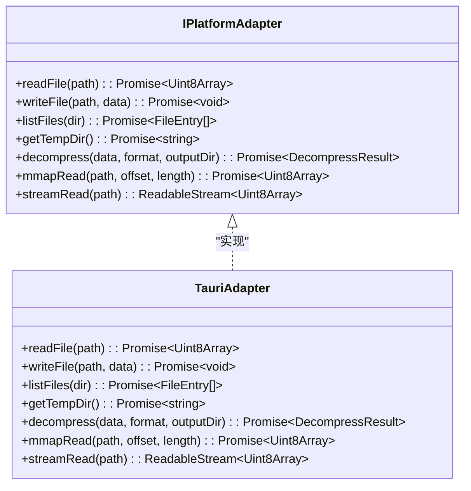
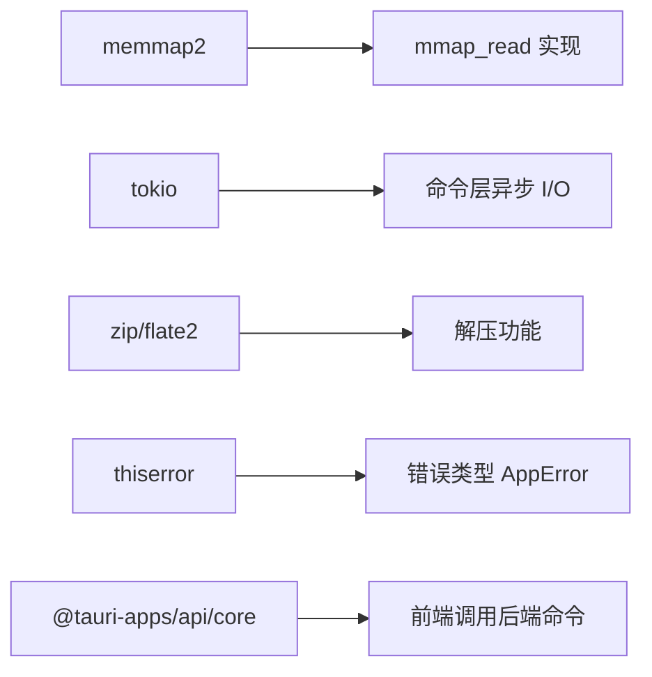

# 文件系统操作

<cite>
**本文引用的文件**   
- [file_ops.rs](file://src-tauri/src/file_ops.rs)
- [commands.rs](file://src-tauri/src/commands.rs)
- [lib.rs](file://src-tauri/src/lib.rs)
- [error.rs](file://src-tauri/src/error.rs)
- [Cargo.toml](file://src-tauri/Cargo.toml)
- [tauri-adapter.ts](file://src/adapters/tauri-adapter.ts)
- [types.ts](file://src/adapters/types.ts)
- [index.ts](file://src/types/index.ts)
- [use-vfs.ts](file://src/composables/use-vfs.ts)
</cite>

## 目录
1. [简介](#简介)
2. [项目结构](#项目结构)
3. [核心组件](#核心组件)
4. [架构总览](#架构总览)
5. [详细组件分析](#详细组件分析)
6. [依赖分析](#依赖分析)
7. [性能考虑](#性能考虑)
8. [故障排查指南](#故障排查指南)
9. [结论](#结论)
10. [附录](#附录)

## 简介
本技术文档聚焦 Hello-Tauri 的文件系统操作模块，围绕以下目标展开：
- 深入解释内存映射（mmap）零拷贝读取的实现原理与性能优势，包括配置与大文件处理策略。
- 深入分析递归目录遍历算法，涵盖路径处理、权限检查与错误恢复机制。
- 说明临时目录管理的实现，包括命名约定、清理策略与跨平台兼容性。
- 提供文件操作的并发安全保证与锁机制的评估与建议。
- 给出性能基准测试方法与优化建议。

## 项目结构
文件系统操作在 Tauri 后端（Rust）与前端（TypeScript）之间通过 IPC 命令进行交互。后端负责实际的磁盘 I/O、内存映射与解压；前端通过适配器调用后端命令并封装为统一的 API。

图表来源
- [lib.rs:6-18](file://src-tauri/src/lib.rs#L6-L18)
- [commands.rs:1-53](file://src-tauri/src/commands.rs#L1-L53)
- [file_ops.rs:1-88](file://src-tauri/src/file_ops.rs#L1-L88)
- [error.rs:1-19](file://src-tauri/src/error.rs#L1-L19)
- [Cargo.toml:1-19](file://src-tauri/Cargo.toml#L1-L19)
- [tauri-adapter.ts:1-62](file://src/adapters/tauri-adapter.ts#L1-L62)
- [types.ts:1-12](file://src/adapters/types.ts#L1-L12)
- [index.ts:1-71](file://src/types/index.ts#L1-L71)

章节来源
- [lib.rs:6-18](file://src-tauri/src/lib.rs#L6-L18)
- [commands.rs:1-53](file://src-tauri/src/commands.rs#L1-L53)
- [file_ops.rs:1-88](file://src-tauri/src/file_ops.rs#L1-L88)
- [tauri-adapter.ts:1-62](file://src/adapters/tauri-adapter.ts#L1-L62)
- [types.ts:1-12](file://src/adapters/types.ts#L1-L12)
- [index.ts:1-71](file://src/types/index.ts#L1-L71)

## 核心组件
- 内存映射读取（mmap_read）：基于 memmap2 将文件映射到进程地址空间，避免用户态与内核态之间的多次拷贝，适合大文件的随机或顺序片段读取。
- 目录遍历（list_files + walk_dir）：递归遍历目录树，收集文件元信息（名称、路径、大小、是否目录）。
- 临时目录管理（get_temp_dir）：返回系统临时目录路径，供前端或后续功能使用。
- 命令层（commands）：暴露给前端的 Tauri 命令，如 read_file、write_file、mmap_read、list_files、decompress、get_temp_dir。
- 前端适配器（TauriAdapter）：封装对后端命令的调用，统一接口并提供流式读取占位实现。

章节来源
- [file_ops.rs:6-18](file://src-tauri/src/file_ops.rs#L6-L18)
- [file_ops.rs:20-53](file://src-tauri/src/file_ops.rs#L20-L53)
- [commands.rs:5-35](file://src-tauri/src/commands.rs#L5-L35)
- [tauri-adapter.ts:14-45](file://src/adapters/tauri-adapter.ts#L14-L45)

## 架构总览
下图展示了从前端发起 mmap 读取请求到后端完成零拷贝读取的完整流程。

图表来源
- [commands.rs:27-30](file://src-tauri/src/commands.rs#L27-L30)
- [file_ops.rs:6-18](file://src-tauri/src/file_ops.rs#L6-L18)
- [tauri-adapter.ts:41-45](file://src/adapters/tauri-adapter.ts#L41-L45)

## 详细组件分析

### 内存映射（mmap）零拷贝读取
- 实现要点
  - 使用 memmap2 将文件映射到进程地址空间，直接访问映射区域，减少数据拷贝次数。
  - 对读取区间进行边界检查，防止越界访问。
  - 最终返回 Vec<u8>，由上层转换为前端 Uint8Array。
- 性能优势
  - 零拷贝：避免传统 read() 的系统调用与用户态缓冲区的多次复制。
  - 延迟加载：按需从页表加载所需页面，降低大文件初始加载开销。
  - 随机访问友好：可直接定位到任意偏移位置，适合日志、二进制格式解析。
- 配置与大文件策略
  - 当前实现未显式设置映射粒度或保护标志，采用默认策略。
  - 对于超大文件，建议结合分块读取与缓存策略，避免一次性映射过大导致虚拟地址空间压力。
  - 可考虑按固定窗口（如 64MB）滑动映射，配合 LRU 缓存提升命中率。
- 并发与安全性
  - 当前实现每次调用独立打开文件并创建映射，无共享状态，天然线程安全。
  - 若引入共享映射或全局缓存，需增加读写锁或引用计数以保障并发安全。

图表来源
- [file_ops.rs:6-18](file://src-tauri/src/file_ops.rs#L6-L18)

章节来源
- [file_ops.rs:6-18](file://src-tauri/src/file_ops.rs#L6-L18)
- [Cargo.toml:9](file://src-tauri/Cargo.toml#L9)

### 递归目录遍历算法
- 算法概述
  - 使用深度优先遍历（DFS），对每个目录项获取元数据，记录名称、路径、大小与是否目录。
  - 遇到子目录则递归遍历。
- 路径处理
  - 使用标准库 Path 与 entry.path() 构造绝对路径，确保跨平台兼容。
  - 文件名通过 file_name().to_string_lossy() 转为字符串，处理非 UTF-8 场景。
- 权限检查与错误恢复
  - 当前实现未显式跳过无权限目录，read_dir 与 metadata 失败会向上抛出错误。
  - 建议在遍历中捕获单个条目错误，记录警告并继续遍历其他条目，提高鲁棒性。
- 复杂度
  - 时间复杂度 O(N)，N 为目录树中的条目总数。
  - 空间复杂度 O(D)，D 为最大递归深度。

图表来源
- [file_ops.rs:20-53](file://src-tauri/src/file_ops.rs#L20-L53)

章节来源
- [file_ops.rs:20-53](file://src-tauri/src/file_ops.rs#L20-L53)

### 临时目录管理
- 实现方式
  - get_temp_dir 返回系统临时目录路径，便于前端或后续功能存放中间文件。
- 命名约定
  - 当前未强制命名规范，建议在调用方约定前缀（如 hello-tauri-temp-）与唯一后缀（时间戳或 UUID），避免冲突。
- 清理策略
  - 建议在任务完成后主动删除临时文件；可引入定时清理或基于文件修改时间的过期策略。
- 跨平台兼容性
  - 使用 std::env::temp_dir() 获取各平台临时目录，具备良好兼容性。
  - 注意不同平台的权限与配额限制，避免写入受限目录。

章节来源
- [commands.rs:21-25](file://src-tauri/src/commands.rs#L21-L25)

### 文件操作的并发安全与锁机制
- 当前状态
  - 命令层与文件操作实现均为无状态函数，每次调用独立执行，不存在共享可变状态。
  - 因此无需额外加锁即可保证基本并发安全。
- 潜在风险与建议
  - 若未来引入全局缓存（如映射视图缓存、目录索引缓存），需引入读写锁（RwLock）或细粒度锁保护。
  - 对同一文件的并发写应串行化，避免数据竞争。
  - 建议为写操作提供互斥锁，读操作可使用共享锁以提升吞吐。

章节来源
- [commands.rs:5-35](file://src-tauri/src/commands.rs#L5-L35)
- [file_ops.rs:6-18](file://src-tauri/src/file_ops.rs#L6-L18)

### 前端适配与类型契约
- 适配器职责
  - TauriAdapter 封装对后端命令的调用，统一接口并提供流式读取占位实现。
  - 当前 streamRead 为全量读取后包装为 ReadableStream，后续可通过事件或插件实现真正的分块流式传输。
- 类型契约
  - IPlatformAdapter 定义了 readFile、writeFile、listFiles、getTempDir、decompress、mmapRead、streamRead 等接口。
  - 前端类型定义包含 FileEntry、DecompressResult、FileTreeNode 等，用于前后端数据结构对齐。

图表来源
- [types.ts:3-11](file://src/adapters/types.ts#L3-L11)
- [tauri-adapter.ts:14-58](file://src/adapters/tauri-adapter.ts#L14-L58)

章节来源
- [tauri-adapter.ts:14-58](file://src/adapters/tauri-adapter.ts#L14-L58)
- [types.ts:1-12](file://src/adapters/types.ts#L1-L12)
- [index.ts:1-71](file://src/types/index.ts#L1-L71)

## 依赖分析
- Rust 依赖
  - memmap2：提供内存映射能力，支撑零拷贝读取。
  - tokio：异步运行时，用于命令层的异步 I/O。
  - zip、flate2：压缩与解压支持。
  - rayon：并行计算（当前未直接使用于文件操作模块，但可用于后续目录遍历或搜索优化）。
  - serde、serde_json：序列化/反序列化。
  - thiserror：错误类型定义与转换。
- 前端依赖
  - @tauri-apps/api/core：用于调用后端命令。

图表来源
- [Cargo.toml:6-16](file://src-tauri/Cargo.toml#L6-L16)
- [tauri-adapter.ts:6-12](file://src/adapters/tauri-adapter.ts#L6-L12)

章节来源
- [Cargo.toml:6-16](file://src-tauri/Cargo.toml#L6-L16)
- [tauri-adapter.ts:6-12](file://src/adapters/tauri-adapter.ts#L6-L12)

## 性能考虑
- mmap 读取
  - 优点：减少拷贝、按需加载、随机访问高效。
  - 注意：返回 Vec<u8> 仍有一次拷贝，若追求极致零拷贝，可在后端直接传递映射视图（需考虑生命周期与安全）。
- 目录遍历
  - 当前 DFS 简单有效，但在极深目录或大量条目时可能占用较多栈空间。
  - 可考虑迭代式遍历或使用 rayon 并行处理兄弟目录，提升吞吐。
- 临时目录
  - 避免频繁创建/删除小文件，合并写入与批量清理。
  - 监控临时目录大小，设置上限与自动清理策略。
- 并发与锁
  - 读多写少场景下，引入 RwLock 可显著提升并发性能。
  - 对热点文件建立只读缓存，减少重复 I/O。

[本节为通用性能讨论，不直接分析具体文件]

## 故障排查指南
- 常见错误
  - 路径穿越防护：当路径包含 ".." 时拒绝访问，防止越权读取。
  - 输入范围越界：mmap 读取时若 offset+length 超出文件大小，返回输入无效错误。
  - 权限不足：读取目录或文件时若无权限，read_dir/metadata 会抛出 IO 错误。
- 错误类型
  - AppError 统一封装 IO、解压、未找到等错误，并实现 Serialize 以便跨语言传输。
- 调试建议
  - 在前端打印错误消息与堆栈，定位问题来源。
  - 在后端增加详细日志（如路径、大小、错误码），辅助定位。

章节来源
- [commands.rs:5-14](file://src-tauri/src/commands.rs#L5-L14)
- [file_ops.rs:6-18](file://src-tauri/src/file_ops.rs#L6-L18)
- [error.rs:1-19](file://src-tauri/src/error.rs#L1-L19)

## 结论
Hello-Tauri 的文件系统操作模块通过 Tauri 命令层与前端适配器实现了清晰的职责分离。mmap 零拷贝读取为大文件场景提供了高性能基础；递归目录遍历简洁可靠，但可进一步增强容错与并行性；临时目录管理具备跨平台兼容性，建议完善命名与清理策略。整体设计具备良好的扩展性与可维护性，后续可在并发控制、流式传输与缓存方面进一步优化。

[本节为总结性内容，不直接分析具体文件]

## 附录
- 关键 API 路径参考
  - mmap 读取：[file_ops.rs:6-18](file://src-tauri/src/file_ops.rs#L6-L18)
  - 目录遍历：[file_ops.rs:20-53](file://src-tauri/src/file_ops.rs#L20-L53)
  - 临时目录：[commands.rs:21-25](file://src-tauri/src/commands.rs#L21-L25)
  - 前端适配器：[tauri-adapter.ts:14-58](file://src/adapters/tauri-adapter.ts#L14-L58)
  - 类型契约：[types.ts:3-11](file://src/adapters/types.ts#L3-L11)、[index.ts:1-71](file://src/types/index.ts#L1-L71)