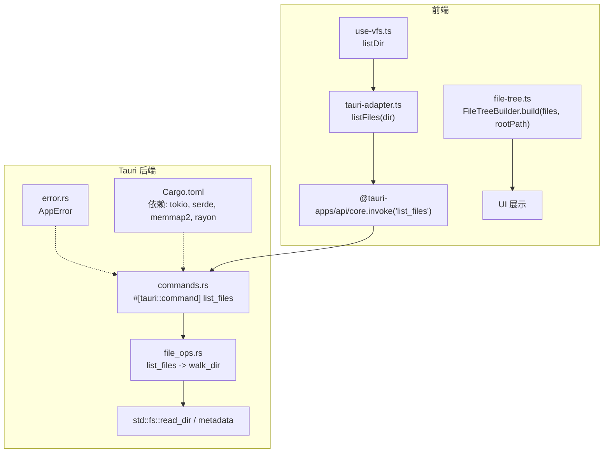
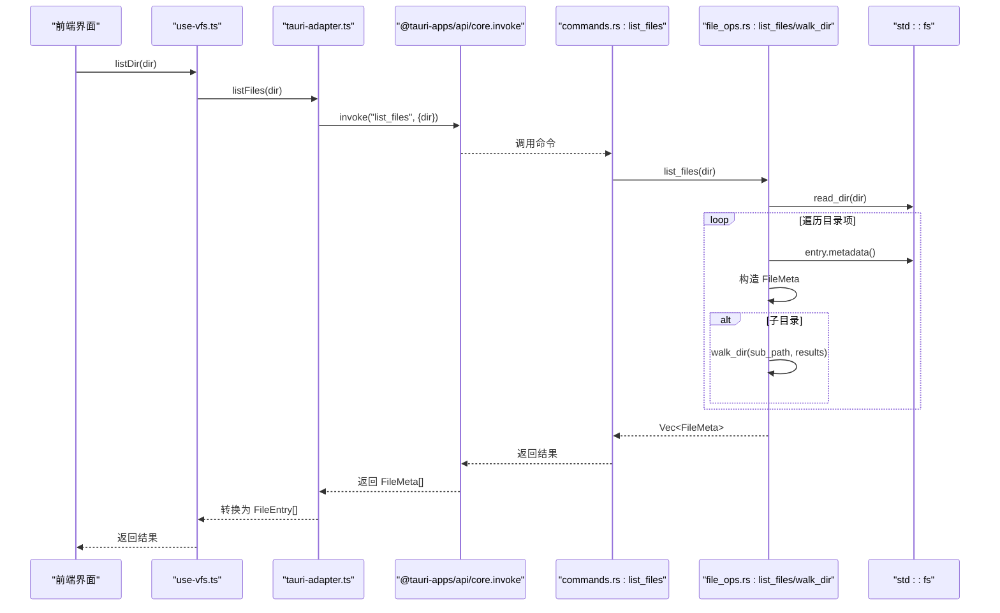
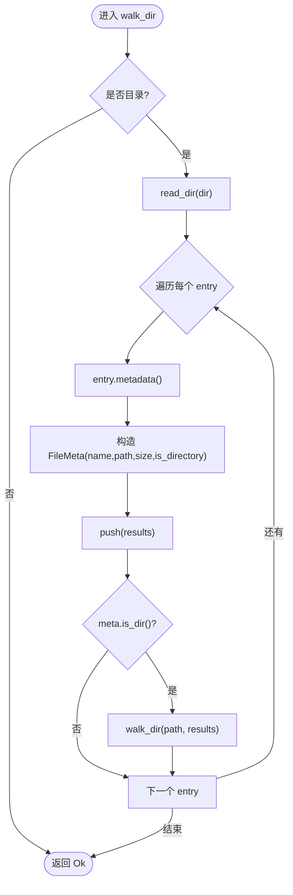
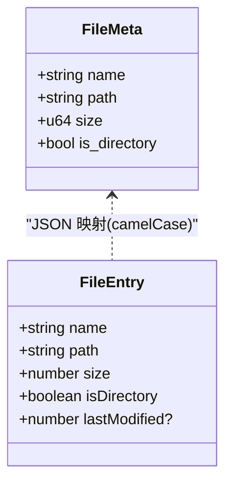
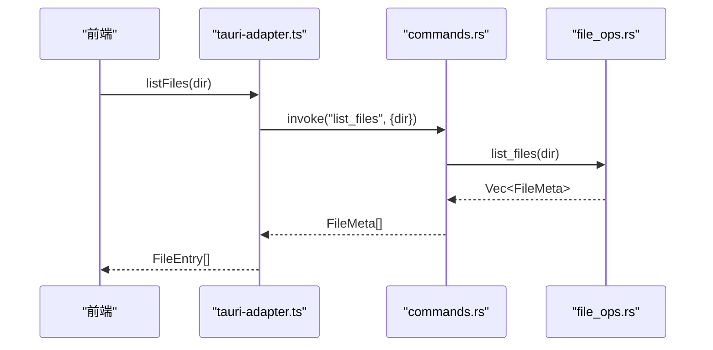
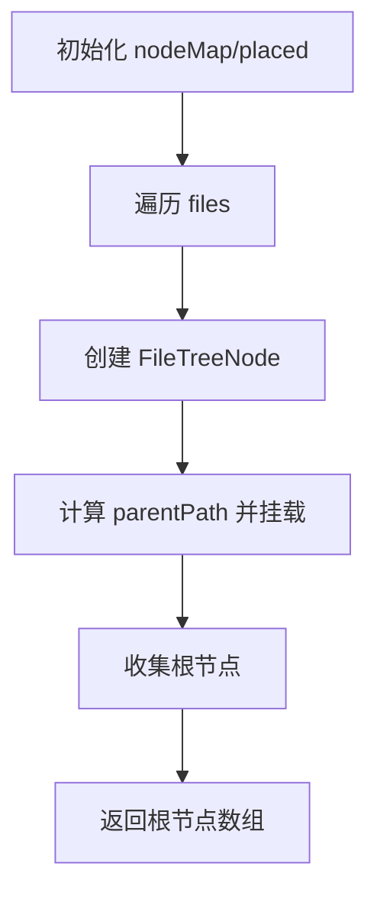
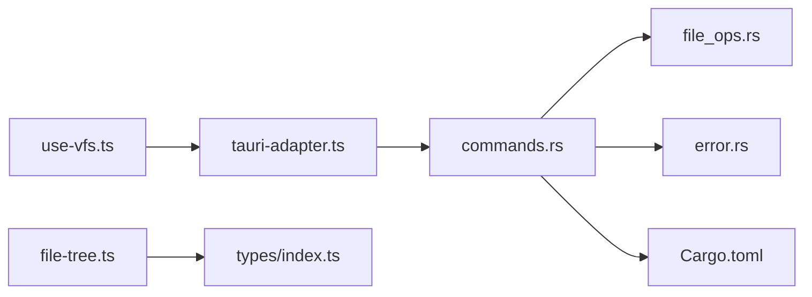

# 递归目录遍历

<cite>
**本文引用的文件**
- [file_ops.rs](file://src-tauri/src/file_ops.rs)
- [commands.rs](file://src-tauri/src/commands.rs)
- [error.rs](file://src-tauri/src/error.rs)
- [tauri-adapter.ts](file://src/adapters/tauri-adapter.ts)
- [use-vfs.ts](file://src/composables/use-vfs.ts)
- [file-tree.ts](file://src/core/file-tree.ts)
- [index.ts](file://src/types/index.ts)
- [Cargo.toml](file://src-tauri/Cargo.toml)
</cite>

## 目录
1. [简介](#简介)
2. [项目结构](#项目结构)
3. [核心组件](#核心组件)
4. [架构总览](#架构总览)
5. [详细组件分析](#详细组件分析)
6. [依赖关系分析](#依赖关系分析)
7. [性能考量](#性能考量)
8. [故障排查指南](#故障排查指南)
9. [结论](#结论)
10. [附录](#附录)

## 简介
本技术文档聚焦于 Hello-Tauri 的“递归目录遍历”能力，围绕后端 Rust 侧的 walk_dir 递归算法、FileMeta 数据结构设计、跨平台路径处理、错误恢复机制，以及前端适配与树构建流程进行系统性解析。同时提供性能优化建议（批量处理、内存管理）、深度限制与循环引用检测方案、权限检查策略等工程化实践。

## 项目结构
与递归目录遍历直接相关的代码分布在 Tauri 后端与前端适配器之间：
- 后端（Rust）
  - file_ops.rs：实现 list_files 与 walk_dir 递归遍历，定义 FileMeta 结构体
  - commands.rs：暴露 Tauri 命令 list_files，转发到 file_ops
  - error.rs：统一错误类型 AppError
  - Cargo.toml：列出相关依赖（tokio、serde、memmap2、rayon 等）
- 前端（TypeScript）
  - tauri-adapter.ts：Tauri 平台适配器，调用 list_files 并返回 FileEntry[]
  - use-vfs.ts：虚拟文件系统组合式函数，封装 listDir
  - file-tree.ts：将扁平文件列表构造成树形结构
  - types/index.ts：定义 FileEntry 等前端类型

图表来源
- [commands.rs:27-35](file://src-tauri/src/commands.rs#L27-L35)
- [file_ops.rs:20-53](file://src-tauri/src/file_ops.rs#L20-L33)
- [tauri-adapter.ts:26-29](file://src/adapters/tauri-adapter.ts#L26-L29)
- [file-tree.ts:7-44](file://src/core/file-tree.ts#L7-L44)
- [index.ts:1-7](file://src/types/index.ts#L1-L7)
- [Cargo.toml:6-15](file://src-tauri/Cargo.toml#L6-L15)

章节来源
- [file_ops.rs:20-53](file://src-tauri/src/file_ops.rs#L20-L53)
- [commands.rs:27-35](file://src-tauri/src/commands.rs#L27-L35)
- [tauri-adapter.ts:26-29](file://src/adapters/tauri-adapter.ts#L26-L29)
- [use-vfs.ts:11-14](file://src/composables/use-vfs.ts#L11-L14)
- [file-tree.ts:7-44](file://src/core/file-tree.ts#L7-L44)
- [index.ts:1-7](file://src/types/index.ts#L1-L7)
- [Cargo.toml:6-15](file://src-tauri/Cargo.toml#L6-L15)

## 核心组件
- walk_dir 递归遍历
  - 职责：从给定目录开始，递归读取子项，收集每个条目为 FileMeta，并追加到结果集合中
  - 输入：&Path 起始目录；&mut Vec<FileMeta> 结果容器
  - 输出：Result<(), AppError>
  - 行为：若当前路径是目录，则枚举其内容；对每个 entry 获取元数据并构造 FileMeta；若是目录则递归
- list_files 接口
  - 职责：对外暴露的便捷方法，内部调用 walk_dir 并将结果返回给上层
- FileMeta 数据结构
  - 字段：name、path、size、is_directory
  - 序列化：使用 serde 导出，字段名按 camelCase 重命名，便于前端 JSON 消费
- Tauri 命令层
  - list_files：接收 dir 字符串，调用 file_ops::list_files，返回 Vec<FileMeta>
- 前端适配器
  - listFiles：通过 @tauri-apps/api/core.invoke 调用后端 list_files，返回 FileEntry[]
- 前端树构建
  - FileTreeBuilder.build：将扁平 FileEntry[] 构造成以 rootPath 为根的树结构

章节来源
- [file_ops.rs:20-53](file://src-tauri/src/file_ops.rs#L20-L53)
- [commands.rs:32-35](file://src-tauri/src/commands.rs#L32-L35)
- [tauri-adapter.ts:26-29](file://src/adapters/tauri-adapter.ts#L26-L29)
- [file-tree.ts:7-44](file://src/core/file-tree.ts#L7-L44)
- [index.ts:1-7](file://src/types/index.ts#L1-L7)

## 架构总览
下图展示了从前端发起目录遍历请求到后端递归遍历并返回结果的完整调用链。

图表来源
- [tauri-adapter.ts:26-29](file://src/adapters/tauri-adapter.ts#L26-L29)
- [commands.rs:32-35](file://src-tauri/src/commands.rs#L32-L35)
- [file_ops.rs:20-53](file://src-tauri/src/file_ops.rs#L20-L53)
- [use-vfs.ts:11-14](file://src/composables/use-vfs.ts#L11-L14)

## 详细组件分析

### walk_dir 递归算法与路径处理
- 递归入口：walk_dir(dir, results)
  - 判断是否为目录；若是，则使用 std::fs::read_dir 枚举条目
  - 对每个条目：
    - 获取 path、metadata
    - 构造 FileMeta{name, path, size, is_directory}
    - 若为目录，递归调用 walk_dir(path, results)
- 路径处理
  - 直接使用 Path 对象与 entry.path()，由标准库负责平台差异
  - 字符串转换使用 to_string_lossy()，保证非 UTF-8 名称可安全表示
- 错误传播
  - 所有 IO 操作错误通过 ? 向上抛出，最终被 AppError::Io 包装
- 复杂度
  - 时间：O(N)，N 为目录及子目录下条目总数
  - 空间：递归栈深度等于最大目录深度；结果向量大小 O(N)

图表来源
- [file_ops.rs:35-53](file://src-tauri/src/file_ops.rs#L35-L53)

章节来源
- [file_ops.rs:35-53](file://src-tauri/src/file_ops.rs#L35-L53)

### FileMeta 数据结构设计与类型安全
- 字段定义
  - name: 文件名
  - path: 绝对或相对路径（取决于传入 dir）
  - size: 文件大小（字节）
  - is_directory: 是否为目录
- 序列化配置
  - 使用 #[derive(serde::Serialize)] 与 #[serde(rename_all = "camelCase")]，确保字段在 JSON 中以驼峰命名呈现，便于前端消费
- 类型安全保证
  - Rust 强类型约束：u64 表示 size，bool 表示 is_directory，避免歧义
  - 通过 thiserror 与 AppError 统一错误类型，避免裸 io::Error 泄露
- 前后端映射
  - 前端 FileEntry 对应 FileMeta，字段语义一致（isDirectory 对应 is_directory）

图表来源
- [file_ops.rs:26-33](file://src-tauri/src/file_ops.rs#L26-L33)
- [index.ts:1-7](file://src/types/index.ts#L1-L7)

章节来源
- [file_ops.rs:26-33](file://src-tauri/src/file_ops.rs#L26-L33)
- [index.ts:1-7](file://src/types/index.ts#L1-L7)

### Tauri 命令层与前端适配器
- 命令层
  - list_files(dir: String) -> Result<Vec<FileMeta>, AppError>
  - 直接委托 file_ops::list_files，保持命令薄且清晰
- 前端适配器
  - listFiles(dir: string): Promise<FileEntry[]>
  - 通过 @tauri-apps/api/core.invoke 调用后端命令，返回前端的 FileEntry[]
- 组合式函数
  - use-vfs.ts 中的 listDir 封装了适配器调用，供业务逻辑复用

图表来源
- [commands.rs:32-35](file://src-tauri/src/commands.rs#L32-L35)
- [tauri-adapter.ts:26-29](file://src/adapters/tauri-adapter.ts#L26-L29)
- [file_ops.rs:20-24](file://src-tauri/src/file_ops.rs#L20-L24)

章节来源
- [commands.rs:32-35](file://src-tauri/src/commands.rs#L32-L35)
- [tauri-adapter.ts:26-29](file://src/adapters/tauri-adapter.ts#L26-L29)
- [use-vfs.ts:11-14](file://src/composables/use-vfs.ts#L11-L14)

### 前端树构建与展示
- FileTreeBuilder.build(files, rootPath)
  - 将扁平 FileEntry[] 构造成以 rootPath 为根的文件树
  - 使用 Map 缓存节点，Set 记录已放置节点，避免重复挂载
  - 根据 parentPath 将节点挂入父节点 children 或直接加入根节点数组
- 辅助方法
  - findNode：按 key 查找节点
  - flattenTree：将树展平为数组（用于搜索、统计等场景）

图表来源
- [file-tree.ts:7-44](file://src/core/file-tree.ts#L7-L44)

章节来源
- [file-tree.ts:7-44](file://src/core/file-tree.ts#L7-L44)

## 依赖关系分析
- 后端依赖
  - tokio：异步运行时（当前命令同步，但整体生态兼容）
  - serde/serde_json：序列化/反序列化
  - memmap2：大文件内存映射读取（与目录遍历无直接耦合）
  - rayon：并行计算（可用于后续优化）
  - thiserror：错误类型推导与 Display 实现
- 前端依赖
  - @tauri-apps/api/core：invoke 调用后端命令
  - TypeScript 类型系统：FileEntry、FileTreeNode 等

图表来源
- [commands.rs:1-4](file://src-tauri/src/commands.rs#L1-L4)
- [file_ops.rs:1-5](file://src-tauri/src/file_ops.rs#L1-L5)
- [error.rs:1-12](file://src-tauri/src/error.rs#L1-L12)
- [Cargo.toml:6-15](file://src-tauri/Cargo.toml#L6-L15)
- [tauri-adapter.ts:1-3](file://src/adapters/tauri-adapter.ts#L1-L3)
- [use-vfs.ts:1-2](file://src/composables/use-vfs.ts#L1-L2)
- [file-tree.ts:1-2](file://src/core/file-tree.ts#L1-L2)
- [index.ts:1-7](file://src/types/index.ts#L1-L7)

章节来源
- [Cargo.toml:6-15](file://src-tauri/Cargo.toml#L6-L15)
- [commands.rs:1-4](file://src-tauri/src/commands.rs#L1-L4)
- [file_ops.rs:1-5](file://src-tauri/src/file_ops.rs#L1-L5)
- [error.rs:1-12](file://src-tauri/src/error.rs#L1-L12)
- [tauri-adapter.ts:1-3](file://src/adapters/tauri-adapter.ts#L1-L3)
- [use-vfs.ts:1-2](file://src/composables/use-vfs.ts#L1-L2)
- [file-tree.ts:1-2](file://src/core/file-tree.ts#L1-L2)
- [index.ts:1-7](file://src/types/index.ts#L1-L7)

## 性能考量
- 当前实现
  - 单线程递归遍历，顺序访问文件系统
  - 将所有条目一次性加载到 Vec<FileMeta>，再返回前端
- 潜在瓶颈
  - 超大目录树导致内存峰值高（Vec 增长）
  - 递归深度过大可能引发栈溢出风险
  - 大量小文件的元数据获取开销
- 优化方向
  - 分批返回：将 walk_dir 改造为流式或分页返回，减少单次响应体积
  - 并行遍历：利用 rayon 对同级目录并行枚举（注意并发 IO 与排序稳定性）
  - 预分配容量：预估条目数量后预分配 Vec 容量，降低扩容开销
  - 惰性加载：仅按需展开子目录，前端按需请求
  - 去重与缓存：对频繁访问的路径做缓存，避免重复 stat/metadata
  - 内存映射：结合 memmap2 对大文件读取优化（与目录遍历解耦）

[本节为通用性能讨论，不直接分析具体文件]

## 故障排查指南
- 常见错误
  - 权限不足：读取目录或元数据时返回 PermissionDenied
  - 路径不存在：read_dir 失败
  - 路径穿越：读文件命令中存在安全检查（针对 read_file），目录遍历未显式校验
- 错误处理现状
  - 后端统一使用 AppError::Io 包装 IO 错误
  - 前端通过适配器返回的错误信息需在上层捕获与提示
- 排查步骤
  - 确认传入 dir 是否存在且可读
  - 检查是否有符号链接导致的循环引用（当前实现未检测）
  - 观察返回结果长度与预期是否一致，必要时缩小范围测试
  - 对于大目录，考虑分批或懒加载策略

章节来源
- [error.rs:1-12](file://src-tauri/src/error.rs#L1-L12)
- [commands.rs:6-14](file://src-tauri/src/commands.rs#L6-L14)

## 结论
Hello-Tauri 的递归目录遍历功能在后端采用简洁清晰的递归实现，配合 serde 序列化与 Tauri 命令层，形成端到端的目录枚举能力。当前实现满足基础需求，但在大规模目录场景下存在内存与性能压力。建议引入分批返回、并行遍历、深度限制与循环引用检测等增强特性，以提升健壮性与用户体验。

[本节为总结性内容，不直接分析具体文件]

## 附录

### 路径规范化与跨平台兼容性
- 当前实现
  - 使用 std::path::Path 与 entry.path()，由标准库处理平台差异
  - 字符串转换使用 to_string_lossy()，避免非法 UTF-8 字符导致崩溃
- 建议改进
  - 在命令层增加路径规范化（如去除多余分隔符、解析 .. 等）
  - 对 Windows 与 POSIX 路径分隔符进行归一化处理
  - 可选：基于 canonicalize 获取绝对路径，提升一致性

[本节为概念性说明，不直接分析具体文件]

### 深度限制与循环引用检测
- 深度限制
  - 可在 walk_dir 中维护 depth 参数，超过阈值时跳过或报错
- 循环引用检测
  - 使用 visited Set 记录已访问路径（canonicalized），遇到重复路径时跳过
- 权限检查
  - 在读取目录前尝试获取元数据，若权限不足则记录并继续其他条目（容错）

[本节为概念性说明，不直接分析具体文件]

### 批量处理与内存管理
- 批量返回
  - 将 walk_dir 改为生成器或分块返回，前端分页渲染
- 内存管理
  - 预分配 Vec 容量，减少扩容
  - 对超大目录采用惰性加载，避免一次性加载全部结果

[本节为概念性说明，不直接分析具体文件]