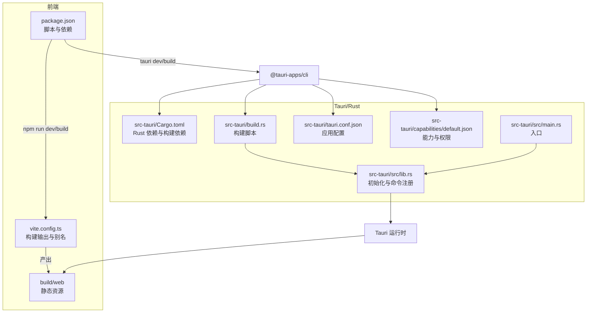
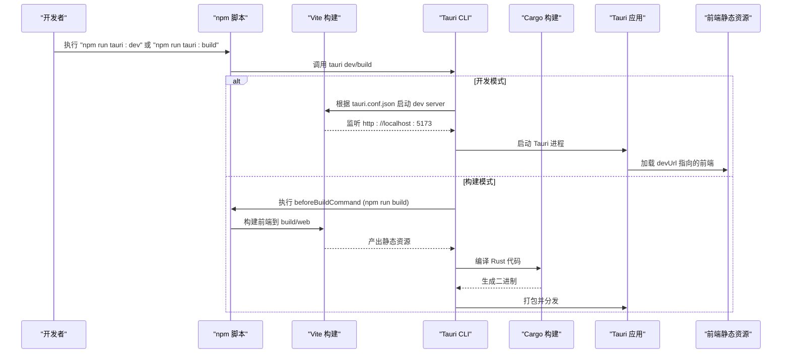
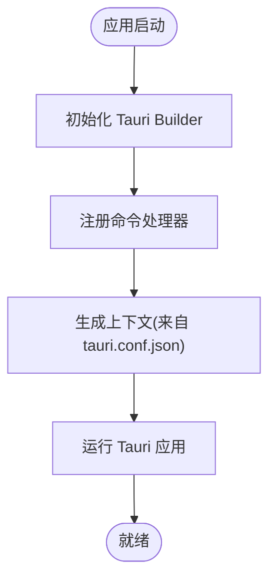
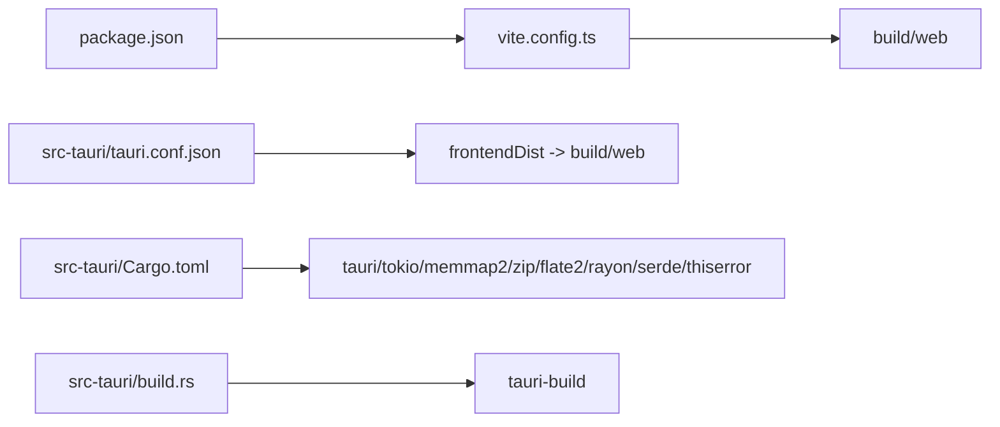

# 构建与部署

<cite>
**本文引用的文件**   
- [src-tauri/Cargo.toml](file://src-tauri/Cargo.toml)
- [src-tauri/tauri.conf.json](file://src-tauri/tauri.conf.json)
- [src-tauri/build.rs](file://src-tauri/build.rs)
- [package.json](file://package.json)
- [vite.config.ts](file://vite.config.ts)
- [src-tauri/src/main.rs](file://src-tauri/src/main.rs)
- [src-tauri/src/lib.rs](file://src-tauri/src/lib.rs)
- [src-tauri/capabilities/default.json](file://src-tauri/capabilities/default.json)
</cite>

## 目录
1. [简介](#简介)
2. [项目结构](#项目结构)
3. [核心组件](#核心组件)
4. [架构总览](#架构总览)
5. [详细组件分析](#详细组件分析)
6. [依赖分析](#依赖分析)
7. [性能考虑](#性能考虑)
8. [故障排查指南](#故障排查指南)
9. [结论](#结论)
10. [附录](#附录)

## 简介
本文件面向 Hello-Tauri 项目的构建与部署，覆盖以下关键主题：
- Cargo.toml 中的 Rust 依赖配置、版本锁定与安全更新策略
- tauri.conf.json 应用配置项（窗口设置、权限、平台相关）
- build.rs 构建脚本的作用与自定义构建流程
- 跨平台编译步骤（Windows、macOS、Linux）
- CI/CD 集成示例与自动化发布流程

## 项目结构
本项目采用 Tauri v2 + Vue 3 + Vite 的混合架构。前端资源由 Vite 构建到指定目录，Rust 侧通过 Tauri 暴露命令供前端调用，最终打包为桌面应用。

图示来源
- [package.json:1-42](file://package.json#L1-L42)
- [vite.config.ts:1-28](file://vite.config.ts#L1-L28)
- [src-tauri/Cargo.toml:1-19](file://src-tauri/Cargo.toml#L1-L19)
- [src-tauri/build.rs:1-4](file://src-tauri/build.rs#L1-L4)
- [src-tauri/tauri.conf.json:1-31](file://src-tauri/tauri.conf.json#L1-L31)
- [src-tauri/capabilities/default.json:1-9](file://src-tauri/capabilities/default.json#L1-L9)
- [src-tauri/src/main.rs:1-4](file://src-tauri/src/main.rs#L1-L4)
- [src-tauri/src/lib.rs:1-19](file://src-tauri/src/lib.rs#L1-L19)

章节来源
- [package.json:1-42](file://package.json#L1-L42)
- [vite.config.ts:1-28](file://vite.config.ts#L1-L28)
- [src-tauri/Cargo.toml:1-19](file://src-tauri/Cargo.toml#L1-L19)
- [src-tauri/tauri.conf.json:1-31](file://src-tauri/tauri.conf.json#L1-L31)
- [src-tauri/build.rs:1-4](file://src-tauri/build.rs#L1-L4)
- [src-tauri/src/main.rs:1-4](file://src-tauri/src/main.rs#L1-L4)
- [src-tauri/src/lib.rs:1-19](file://src-tauri/src/lib.rs#L1-L19)
- [src-tauri/capabilities/default.json:1-9](file://src-tauri/capabilities/default.json#L1-L9)

## 核心组件
- 前端构建与运行
  - package.json 提供开发、构建、预览与 Tauri CLI 脚本；Node 引擎要求 >= 20。
  - vite.config.ts 将构建产物输出至 build/web，并通过别名在 web 与 tauri 适配器间切换。
- Tauri 应用
  - src-tauri/Cargo.toml 声明运行时与构建期依赖。
  - src-tauri/tauri.conf.json 定义产品名称、版本、标识符、前端资源路径、开发/构建前置命令、窗口尺寸、打包目标与图标等。
  - src-tauri/build.rs 调用 tauri-build 完成上下文生成。
  - src-tauri/src/main.rs 启动应用；src-tauri/src/lib.rs 初始化 Tauri Builder、注册命令并运行。
  - capabilities/default.json 为主窗口授予默认能力与权限。

章节来源
- [package.json:1-42](file://package.json#L1-L42)
- [vite.config.ts:1-28](file://vite.config.ts#L1-L28)
- [src-tauri/Cargo.toml:1-19](file://src-tauri/Cargo.toml#L1-L19)
- [src-tauri/tauri.conf.json:1-31](file://src-tauri/tauri.conf.json#L1-L31)
- [src-tauri/build.rs:1-4](file://src-tauri/build.rs#L1-L4)
- [src-tauri/src/main.rs:1-4](file://src-tauri/src/main.rs#L1-L4)
- [src-tauri/src/lib.rs:1-19](file://src-tauri/src/lib.rs#L1-L19)
- [src-tauri/capabilities/default.json:1-9](file://src-tauri/capabilities/default.json#L1-L9)

## 架构总览
下图展示了从 npm 脚本到 Tauri 构建与运行的整体流程，以及前后端交互的关键节点。

图示来源
- [package.json:1-42](file://package.json#L1-L42)
- [src-tauri/tauri.conf.json:1-31](file://src-tauri/tauri.conf.json#L1-L31)
- [vite.config.ts:1-28](file://vite.config.ts#L1-L28)
- [src-tauri/Cargo.toml:1-19](file://src-tauri/Cargo.toml#L1-L19)

## 详细组件分析

### Cargo.toml 依赖与版本策略
- 运行时依赖
  - tauri v2：作为桌面运行时框架。
  - tokio v1：异步运行时，启用 full 特性以支持文件系统与网络等异步操作。
  - memmap2 v0.9：内存映射读取大文件，提升 I/O 性能。
  - zip v2、flate2 v1：压缩/解压处理。
  - rayon v1：并行计算。
  - serde v1（derive）、serde_json v1：序列化/反序列化。
  - thiserror v1：错误类型定义。
- 构建期依赖
  - tauri-build v2：用于在构建时生成上下文与绑定。
- 版本锁定与安全更新
  - 使用 Cargo.lock 锁定具体版本，确保可重复构建。
  - 安全更新策略建议：定期扫描依赖漏洞，优先升级受影响的 crate；对主版本号变更进行兼容性评估后再升级。

章节来源
- [src-tauri/Cargo.toml:1-19](file://src-tauri/Cargo.toml#L1-L19)

### tauri.conf.json 应用配置
- 基本信息
  - productName、version、identifier 定义应用名称、版本与应用标识。
- 构建选项
  - frontendDist：前端构建产物目录（build/web）。
  - devUrl：开发模式下前端地址。
  - beforeDevCommand/beforeBuildCommand：开发与构建前执行的 npm 脚本。
- 窗口设置
  - windows 数组定义初始窗口标题、宽高与最小尺寸。
- 打包选项
  - bundle.active 启用打包。
  - targets 为空表示使用默认目标（通常包含当前平台的安装包格式）。
  - icon 指定图标路径。

章节来源
- [src-tauri/tauri.conf.json:1-31](file://src-tauri/tauri.conf.json#L1-L31)

### build.rs 构建脚本
- 作用
  - 调用 tauri_build::build()，在构建阶段生成 Tauri 所需的上下文与绑定，使 tauri::generate_context!() 可用。
- 自定义扩展点
  - 可在 main 中插入额外逻辑，如复制资源、生成配置文件、预处理前端资源等，再调用 tauri_build::build()。

章节来源
- [src-tauri/build.rs:1-4](file://src-tauri/build.rs#L1-L4)

### 应用入口与命令注册
- main.rs
  - 调用 hello_tauri::run() 启动应用。
- lib.rs
  - 初始化 Tauri Builder，注册命令处理器，调用 generate_context!() 注入配置，最后 run() 启动运行时。

图示来源
- [src-tauri/src/main.rs:1-4](file://src-tauri/src/main.rs#L1-L4)
- [src-tauri/src/lib.rs:1-19](file://src-tauri/src/lib.rs#L1-L19)
- [src-tauri/tauri.conf.json:1-31](file://src-tauri/tauri.conf.json#L1-L31)

章节来源
- [src-tauri/src/main.rs:1-4](file://src-tauri/src/main.rs#L1-L4)
- [src-tauri/src/lib.rs:1-19](file://src-tauri/src/lib.rs#L1-L19)

### 能力与权限（capabilities）
- default.json 为主窗口授予默认能力 core:default，适用于大多数基础功能场景。
- 如需更细粒度控制，可新增能力集并在窗口上引用。

章节来源
- [src-tauri/capabilities/default.json:1-9](file://src-tauri/capabilities/default.json#L1-L9)

### 前端构建与适配
- package.json
  - scripts 提供 tauri、tauri:dev、tauri:build 等脚本，便于统一入口。
  - engines.node 要求 Node >= 20。
- vite.config.ts
  - define 注入 __PLATFORM__ 常量。
  - resolve.alias 根据环境变量 VITE_PLATFORM 选择 @adapter 指向 tauri 或 web 适配器。
  - build.outDir 固定为 build/web，与 tauri.conf.json 的 frontendDist 保持一致。
  - rolldownOptions.external 在 web 模式下排除 @tauri-apps/api，避免浏览器环境引入。

章节来源
- [package.json:1-42](file://package.json#L1-L42)
- [vite.config.ts:1-28](file://vite.config.ts#L1-L28)

## 依赖分析
- 前端与后端耦合点
  - tauri.conf.json 的 frontendDist 与 vite.config.ts 的 outDir 必须一致，否则构建后无法找到前端资源。
  - beforeBuildCommand 触发前端构建，确保每次打包都使用最新产物。
- Rust 依赖关系
  - tauri 作为核心运行时，tokio 提供异步 IO，memmap2/zip/flate2/rayon 增强文件与数据处理能力，serde/thiserror 完善数据与错误模型。

图示来源
- [package.json:1-42](file://package.json#L1-L42)
- [vite.config.ts:1-28](file://vite.config.ts#L1-L28)
- [src-tauri/tauri.conf.json:1-31](file://src-tauri/tauri.conf.json#L1-L31)
- [src-tauri/Cargo.toml:1-19](file://src-tauri/Cargo.toml#L1-L19)
- [src-tauri/build.rs:1-4](file://src-tauri/build.rs#L1-L4)

章节来源
- [package.json:1-42](file://package.json#L1-L42)
- [vite.config.ts:1-28](file://vite.config.ts#L1-L28)
- [src-tauri/tauri.conf.json:1-31](file://src-tauri/tauri.conf.json#L1-L31)
- [src-tauri/Cargo.toml:1-19](file://src-tauri/Cargo.toml#L1-L19)
- [src-tauri/build.rs:1-4](file://src-tauri/build.rs#L1-L4)

## 性能考虑
- 大文件读取
  - 使用 memmap2 进行内存映射读取，减少拷贝开销，适合超大文件的随机访问。
- 并发与并行
  - tokio 异步 IO 提高吞吐；rayon 可用于 CPU 密集型任务的并行化。
- 构建优化
  - 保持前端与后端构建产物目录一致，避免冗余拷贝；按需启用打包目标以减少构建时间。

[本节为通用指导，不直接分析具体文件]

## 故障排查指南
- 找不到前端资源
  - 检查 tauri.conf.json 的 frontendDist 与 vite.config.ts 的 outDir 是否一致。
  - 确认 beforeBuildCommand 成功执行并产出 build/web。
- 开发模式无法连接前端
  - 确认 devUrl 指向的地址与 Vite 实际端口一致。
- 权限不足
  - 检查 capabilities/default.json 是否授予所需权限；必要时添加更具体的能力集。
- 构建失败
  - 清理缓存后重试：删除 node_modules/.cache、target 目录，重新安装依赖并构建。
  - 检查 Node 版本是否符合 engines 要求。

章节来源
- [src-tauri/tauri.conf.json:1-31](file://src-tauri/tauri.conf.json#L1-L31)
- [vite.config.ts:1-28](file://vite.config.ts#L1-L28)
- [src-tauri/capabilities/default.json:1-9](file://src-tauri/capabilities/default.json#L1-L9)
- [package.json:1-42](file://package.json#L1-L42)

## 结论
通过合理配置 Cargo.toml、tauri.conf.json 与构建脚本，结合 Vite 的前端构建流程，Hello-Tauri 实现了前后端协同的高效开发与打包。遵循版本锁定与安全更新策略，配合 CI/CD 自动化，可实现稳定可靠的跨平台发布。

[本节为总结性内容，不直接分析具体文件]

## 附录

### 本地开发
- 安装依赖
  - 在项目根目录执行包管理器安装命令（参考 package.json 的依赖与脚本）。
- 启动开发模式
  - 使用 npm 脚本启动 Tauri 开发服务器，自动构建前端并运行应用。
- 构建前端
  - 单独执行前端构建脚本，产物位于 build/web。

章节来源
- [package.json:1-42](file://package.json#L1-L42)
- [vite.config.ts:1-28](file://vite.config.ts#L1-L28)
- [src-tauri/tauri.conf.json:1-31](file://src-tauri/tauri.conf.json#L1-L31)

### 跨平台编译步骤
- Windows
  - 安装 Rust 工具链与 MSVC 构建工具。
  - 安装 Node.js（>= 20），确保 npm 可用。
  - 在项目根目录执行构建脚本，Tauri 将调用 Cargo 与 Vite 完成构建与打包。
- macOS
  - 安装 Rust 工具链与 Xcode Command Line Tools。
  - 安装 Node.js（>= 20）。
  - 执行构建脚本，Tauri 将生成对应平台的安装包。
- Linux
  - 安装 Rust 工具链与系统依赖（如 GTK/WebKit 相关库，视目标而定）。
  - 安装 Node.js（>= 20）。
  - 执行构建脚本，Tauri 将生成对应平台的安装包。

[本节为通用指导，不直接分析具体文件]

### CI/CD 集成示例与自动化发布
- 通用流水线要点
  - 设置 Node.js 版本（>= 20）。
  - 安装 Rust 工具链与平台特定依赖。
  - 缓存依赖（node_modules、Cargo registry/target）以加速构建。
  - 执行前端构建与 Tauri 构建，产出安装包。
  - 上传制品到对象存储或仓库。
  - 可选：签名与校验（Windows/macOS/Linux 各有不同要求）。
- 示例（GitHub Actions）
  - 在 .github/workflows 下创建 workflow 文件，定义多矩阵任务（Windows、macOS、Ubuntu）。
  - 在每个 job 中安装依赖、构建并归档产物。
  - 使用 actions/upload-artifact 保存构建产物，后续步骤可下载并发布。

[本节为通用指导，不直接分析具体文件]