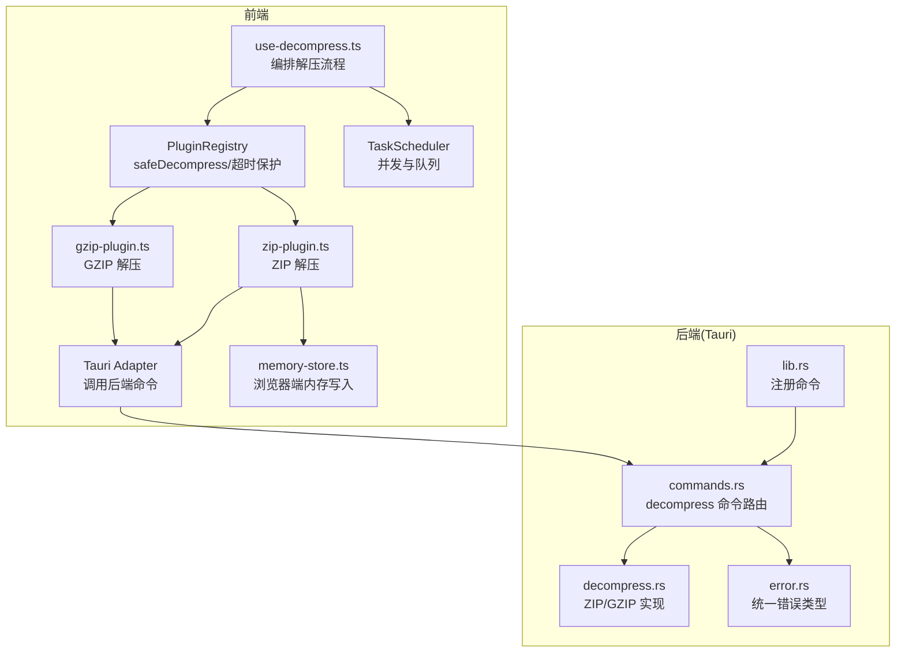
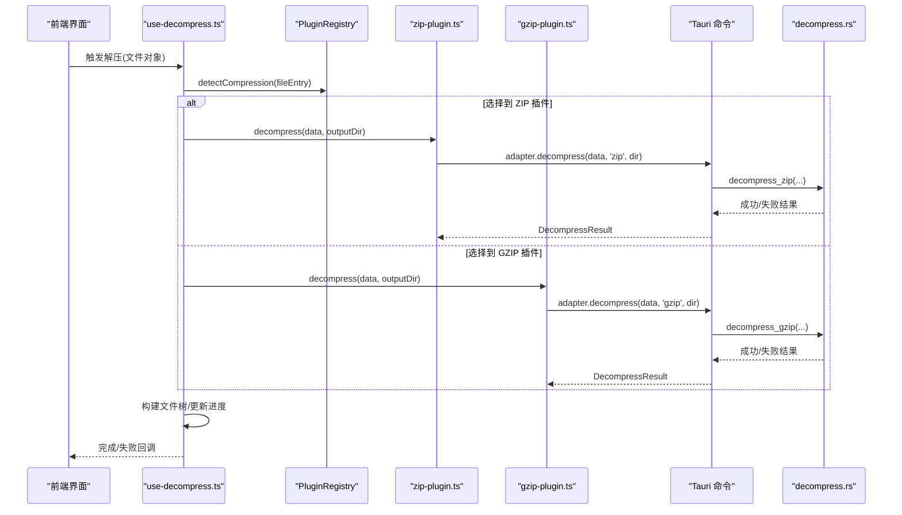
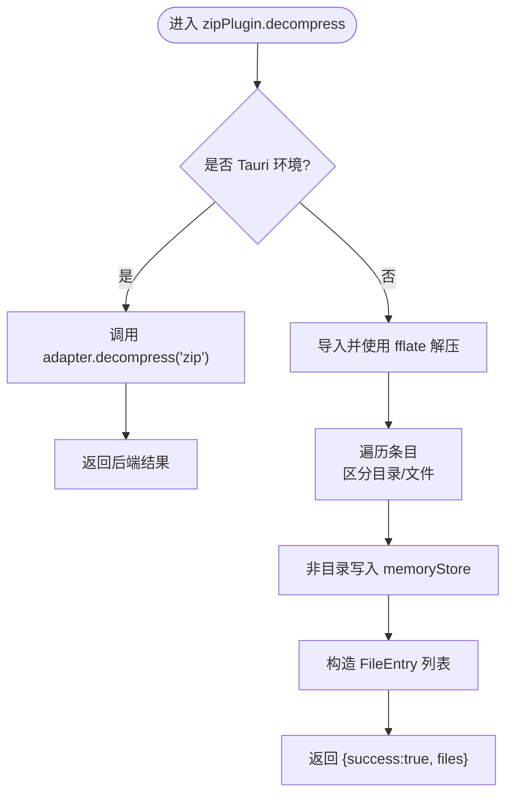
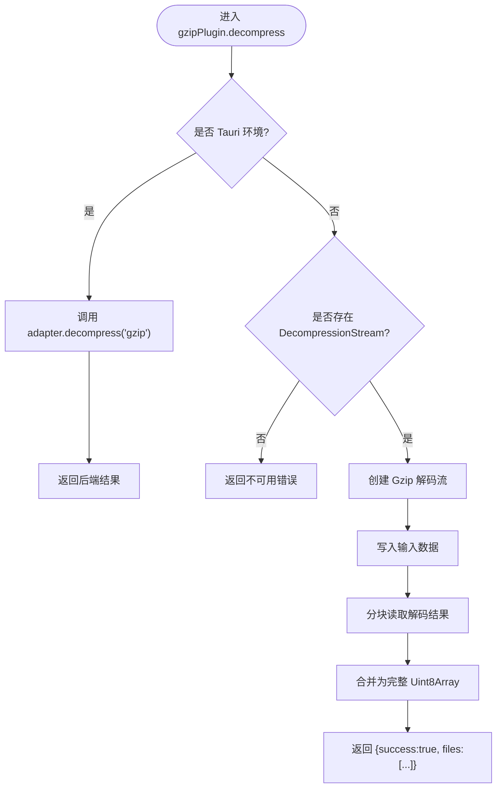
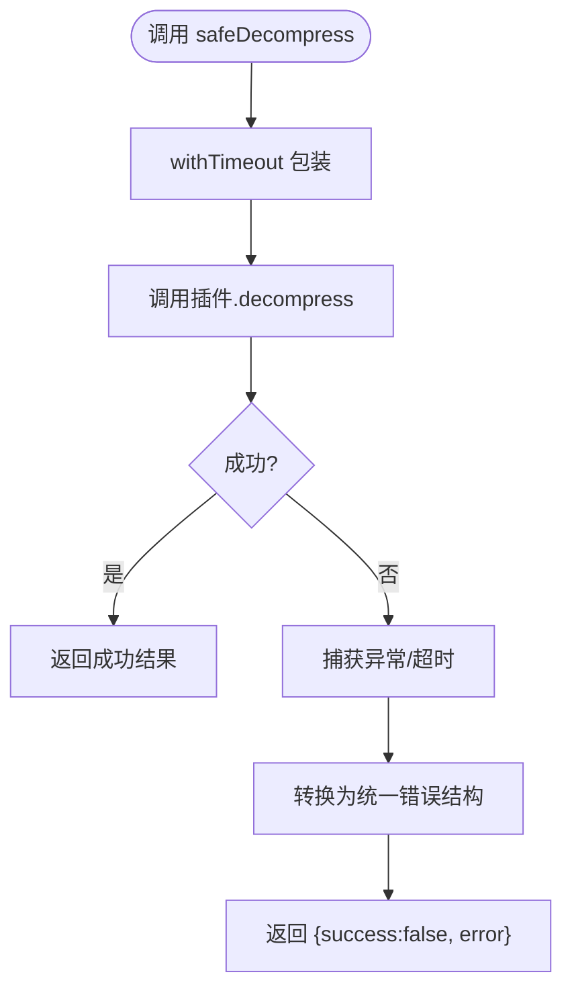
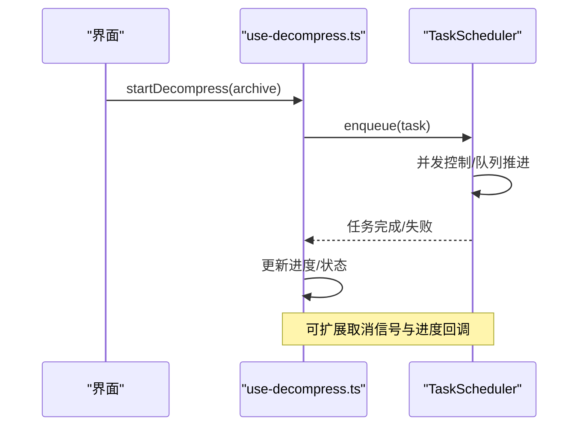
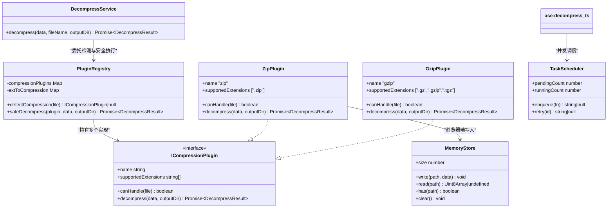
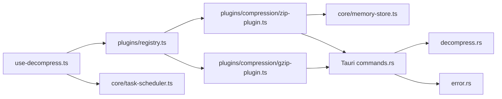

# 解压服务

<cite>
**本文引用的文件**   
- [src/core/decompress.ts](file://src/core/decompress.ts)
- [src/composables/use-decompress.ts](file://src/composables/use-decompress.ts)
- [src/plugins/compression/zip-plugin.ts](file://src/plugins/compression/zip-plugin.ts)
- [src/plugins/compression/gzip-plugin.ts](file://src/plugins/compression/gzip-plugin.ts)
- [src/plugins/types.ts](file://src/plugins/types.ts)
- [src/plugins/registry.ts](file://src/plugins/registry.ts)
- [src/core/memory-store.ts](file://src/core/memory-store.ts)
- [src/core/task-scheduler.ts](file://src/core/task-scheduler.ts)
- [src-tauri/src/lib.rs](file://src-tauri/src/lib.rs)
- [src-tauri/src/commands.rs](file://src-tauri/src/commands.rs)
- [src-tauri/src/decompress.rs](file://src-tauri/src/decompress.rs)
- [src-tauri/src/error.rs](file://src-tauri/src/error.rs)
- [src/types/index.ts](file://src/types/index.ts)
</cite>

## 目录
1. [简介](#简介)
2. [项目结构](#项目结构)
3. [核心组件](#核心组件)
4. [架构总览](#架构总览)
5. [详细组件分析](#详细组件分析)
6. [依赖关系分析](#依赖关系分析)
7. [性能与内存优化](#性能与内存优化)
8. [故障排查指南](#故障排查指南)
9. [结论](#结论)
10. [附录](#附录)

## 简介
本技术文档围绕 Hello-Tauri 的解压服务，系统性梳理 ZIP 与 GZIP 格式的解析实现、流式解压与内存管理策略、递归解压与安全机制、错误处理与恢复、进度监控与取消方案，以及性能优化与内存控制。文档同时覆盖前端（TypeScript）与后端（Rust/Tauri）两条路径的实现差异与协作方式，帮助读者快速理解并扩展解压能力。

## 项目结构
解压相关代码主要分布在以下位置：
- 前端 TypeScript 层：插件接口定义、压缩插件实现、注册表、任务调度器、内存存储、组合式 API 等
- Tauri Rust 层：命令暴露、解压实现、错误类型定义

图示来源
- [src/composables/use-decompress.ts:1-74](file://src/composables/use-decompress.ts#L1-L74)
- [src/plugins/registry.ts:1-118](file://src/plugins/registry.ts#L1-L118)
- [src/plugins/compression/zip-plugin.ts:1-40](file://src/plugins/compression/zip-plugin.ts#L1-L40)
- [src/plugins/compression/gzip-plugin.ts:1-44](file://src/plugins/compression/gzip-plugin.ts#L1-L44)
- [src/core/memory-store.ts:1-26](file://src/core/memory-store.ts#L1-L26)
- [src/core/task-scheduler.ts:1-79](file://src/core/task-scheduler.ts#L1-L79)
- [src-tauri/src/lib.rs:1-19](file://src-tauri/src/lib.rs#L1-L19)
- [src-tauri/src/commands.rs:1-53](file://src-tauri/src/commands.rs#L1-L53)
- [src-tauri/src/decompress.rs:1-83](file://src-tauri/src/decompress.rs#L1-L83)
- [src-tauri/src/error.rs:1-19](file://src-tauri/src/error.rs#L1-L19)

章节来源
- [src/composables/use-decompress.ts:1-74](file://src/composables/use-decompress.ts#L1-L74)
- [src/plugins/registry.ts:1-118](file://src/plugins/registry.ts#L1-L118)
- [src/plugins/compression/zip-plugin.ts:1-40](file://src/plugins/compression/zip-plugin.ts#L1-L40)
- [src/plugins/compression/gzip-plugin.ts:1-44](file://src/plugins/compression/gzip-plugin.ts#L1-L44)
- [src/core/memory-store.ts:1-26](file://src/core/memory-store.ts#L1-L26)
- [src/core/task-scheduler.ts:1-79](file://src/core/task-scheduler.ts#L1-L79)
- [src-tauri/src/lib.rs:1-19](file://src-tauri/src/lib.rs#L1-L19)
- [src-tauri/src/commands.rs:1-53](file://src-tauri/src/commands.rs#L1-L53)
- [src-tauri/src/decompress.rs:1-83](file://src-tauri/src/decompress.rs#L1-L83)
- [src-tauri/src/error.rs:1-19](file://src-tauri/src/error.rs#L1-L19)

## 核心组件
- 解压服务门面：提供统一的入口，负责构造文件元信息、选择插件并委托安全执行
- 压缩插件接口与实现：ZIP 与 GZIP 插件分别封装平台适配与具体解压逻辑
- 插件注册表：提供按扩展名检测、启用/禁用、安全执行（含超时保护）
- 任务调度器：限制并发、维护队列、支持重试与状态统计
- 内存存储：浏览器环境下用于暂存解压产物
- Tauri 命令与后端实现：在桌面端通过 Rust 库进行高效解压

章节来源
- [src/core/decompress.ts:1-27](file://src/core/decompress.ts#L1-L27)
- [src/plugins/types.ts:1-37](file://src/plugins/types.ts#L1-L37)
- [src/plugins/registry.ts:1-118](file://src/plugins/registry.ts#L1-L118)
- [src/core/task-scheduler.ts:1-79](file://src/core/task-scheduler.ts#L1-L79)
- [src/core/memory-store.ts:1-26](file://src/core/memory-store.ts#L1-L26)
- [src-tauri/src/commands.rs:1-53](file://src-tauri/src/commands.rs#L1-L53)
- [src-tauri/src/decompress.rs:1-83](file://src-tauri/src/decompress.rs#L1-L83)

## 架构总览
解压流程在前端发起，根据文件名或扩展名选择对应压缩插件；在浏览器环境优先使用 Web API 或第三方库，在 Tauri 环境则通过命令调用 Rust 后端完成解压。注册表为所有插件调用提供超时保护与异常兜底。

图示来源
- [src/composables/use-decompress.ts:1-74](file://src/composables/use-decompress.ts#L1-L74)
- [src/plugins/registry.ts:1-118](file://src/plugins/registry.ts#L1-L118)
- [src/plugins/compression/zip-plugin.ts:1-40](file://src/plugins/compression/zip-plugin.ts#L1-L40)
- [src/plugins/compression/gzip-plugin.ts:1-44](file://src/plugins/compression/gzip-plugin.ts#L1-L44)
- [src-tauri/src/commands.rs:1-53](file://src-tauri/src/commands.rs#L1-L53)
- [src-tauri/src/decompress.rs:1-83](file://src-tauri/src/decompress.rs#L1-L83)

## 详细组件分析

### ZIP 插件实现与流式策略
- 平台分支：当运行于 Tauri 时，直接调用后端命令进行解压；否则在浏览器环境中尝试使用 fflate 同步解压并将非目录条目写入内存存储
- 输出结构：返回统一的结果对象，包含成功标志、文件列表与可选错误信息
- 流式与内存：当前实现以一次性读取为主，浏览器端将内容写入内存存储；如需大文件场景，可考虑基于流式 API 的分块写入与增量构建文件树

图示来源
- [src/plugins/compression/zip-plugin.ts:1-40](file://src/plugins/compression/zip-plugin.ts#L1-L40)
- [src/core/memory-store.ts:1-26](file://src/core/memory-store.ts#L1-L26)

章节来源
- [src/plugins/compression/zip-plugin.ts:1-40](file://src/plugins/compression/zip-plugin.ts#L1-L40)
- [src/core/memory-store.ts:1-26](file://src/core/memory-store.ts#L1-L26)

### GZIP 插件实现与流式策略
- 平台分支：Tauri 环境同样走后端命令；浏览器环境优先使用原生 DecompressionStream 进行流式解压
- 流式实现：通过 WritableStream 写入输入数据，ReadableStream 分块读取，最终合并为完整 Uint8Array
- 输出结构：返回单条“decompressed”文件的元信息，便于上层统一处理

图示来源
- [src/plugins/compression/gzip-plugin.ts:1-44](file://src/plugins/compression/gzip-plugin.ts#L1-L44)

章节来源
- [src/plugins/compression/gzip-plugin.ts:1-44](file://src/plugins/compression/gzip-plugin.ts#L1-L44)

### 递归解压与安全机制
- 现状：当前 ZIP/GZIP 插件未实现递归解压逻辑，即不会自动识别并解压嵌套压缩包
- 建议方案：
  - 在构建文件树后扫描文件列表，对疑似压缩包（如 .zip/.gz/.tgz）进行二次检测
  - 引入访问计数与深度上限（例如最大深度 5），防止无限循环
  - 记录已处理路径集合，避免重复解压同一文件
  - 对每个子任务设置独立超时与隔离上下文，避免相互影响
- 注意：若采用递归解压，需确保路径规范化与权限校验，防止路径穿越

章节来源
- [src/plugins/compression/zip-plugin.ts:1-40](file://src/plugins/compression/zip-plugin.ts#L1-L40)
- [src/plugins/compression/gzip-plugin.ts:1-44](file://src/plugins/compression/gzip-plugin.ts#L1-L44)

### 错误处理与恢复策略
- 超时保护：注册表对所有插件调用包裹超时，避免长时间阻塞
- 异常兜底：捕获异常并返回结构化失败结果，包含错误消息
- 平台错误映射：Tauri 侧统一错误类型，向上层传递可读字符串
- 恢复建议：
  - 对损坏文件：跳过该条目继续处理其余文件（ZIP 场景尤为适用）
  - 重试机制：结合任务调度器的重试能力，对瞬时失败进行有限次重试
  - 降级策略：在浏览器不支持某特性时回退到其他实现或提示用户

图示来源
- [src/plugins/registry.ts:1-118](file://src/plugins/registry.ts#L1-L118)
- [src-tauri/src/error.rs:1-19](file://src-tauri/src/error.rs#L1-L19)

章节来源
- [src/plugins/registry.ts:1-118](file://src/plugins/registry.ts#L1-L118)
- [src-tauri/src/error.rs:1-19](file://src-tauri/src/error.rs#L1-L19)

### 进度监控与取消操作
- 进度监控：
  - 前端组合式函数在关键阶段更新状态与进度百分比
  - 可在插件内部增加回调或事件通道，上报字节级进度（当前未实现）
- 取消操作：
  - 当前未提供显式取消能力
  - 建议方案：为每个任务分配 AbortController，向底层流式读写传递信号；或在任务调度器中增加中断标记与检查点

图示来源
- [src/composables/use-decompress.ts:1-74](file://src/composables/use-decompress.ts#L1-L74)
- [src/core/task-scheduler.ts:1-79](file://src/core/task-scheduler.ts#L1-L79)

章节来源
- [src/composables/use-decompress.ts:1-74](file://src/composables/use-decompress.ts#L1-L74)
- [src/core/task-scheduler.ts:1-79](file://src/core/task-scheduler.ts#L1-L79)

### 类与接口关系图

图示来源
- [src/core/decompress.ts:1-27](file://src/core/decompress.ts#L1-L27)
- [src/plugins/types.ts:1-37](file://src/plugins/types.ts#L1-L37)
- [src/plugins/registry.ts:1-118](file://src/plugins/registry.ts#L1-L118)
- [src/plugins/compression/zip-plugin.ts:1-40](file://src/plugins/compression/zip-plugin.ts#L1-L40)
- [src/plugins/compression/gzip-plugin.ts:1-44](file://src/plugins/compression/gzip-plugin.ts#L1-L44)
- [src/core/task-scheduler.ts:1-79](file://src/core/task-scheduler.ts#L1-L79)
- [src/core/memory-store.ts:1-26](file://src/core/memory-store.ts#L1-L26)

章节来源
- [src/core/decompress.ts:1-27](file://src/core/decompress.ts#L1-L27)
- [src/plugins/types.ts:1-37](file://src/plugins/types.ts#L1-L37)
- [src/plugins/registry.ts:1-118](file://src/plugins/registry.ts#L1-L118)
- [src/plugins/compression/zip-plugin.ts:1-40](file://src/plugins/compression/zip-plugin.ts#L1-L40)
- [src/plugins/compression/gzip-plugin.ts:1-44](file://src/plugins/compression/gzip-plugin.ts#L1-L44)
- [src/core/task-scheduler.ts:1-79](file://src/core/task-scheduler.ts#L1-L79)
- [src/core/memory-store.ts:1-26](file://src/core/memory-store.ts#L1-L26)

## 依赖关系分析
- 前端模块耦合：
  - use-decompress 依赖注册表、任务调度器与文件树构建器
  - 压缩插件依赖平台适配器与运行时库（fflate/DecompressionStream）
  - 注册表集中管理插件生命周期与执行保护
- 前后端交互：
  - 通过 Tauri 命令暴露解压能力，Rust 侧使用 zip 与 flate2 库实现
  - 错误类型在后端统一序列化，前端接收结构化结果

图示来源
- [src/composables/use-decompress.ts:1-74](file://src/composables/use-decompress.ts#L1-L74)
- [src/plugins/registry.ts:1-118](file://src/plugins/registry.ts#L1-L118)
- [src/plugins/compression/zip-plugin.ts:1-40](file://src/plugins/compression/zip-plugin.ts#L1-L40)
- [src/plugins/compression/gzip-plugin.ts:1-44](file://src/plugins/compression/gzip-plugin.ts#L1-L44)
- [src/core/memory-store.ts:1-26](file://src/core/memory-store.ts#L1-L26)
- [src-tauri/src/commands.rs:1-53](file://src-tauri/src/commands.rs#L1-L53)
- [src-tauri/src/decompress.rs:1-83](file://src-tauri/src/decompress.rs#L1-L83)
- [src-tauri/src/error.rs:1-19](file://src-tauri/src/error.rs#L1-L19)

章节来源
- [src/composables/use-decompress.ts:1-74](file://src/composables/use-decompress.ts#L1-L74)
- [src/plugins/registry.ts:1-118](file://src/plugins/registry.ts#L1-L118)
- [src/plugins/compression/zip-plugin.ts:1-40](file://src/plugins/compression/zip-plugin.ts#L1-L40)
- [src/plugins/compression/gzip-plugin.ts:1-44](file://src/plugins/compression/gzip-plugin.ts#L1-L44)
- [src/core/memory-store.ts:1-26](file://src/core/memory-store.ts#L1-L26)
- [src-tauri/src/commands.rs:1-53](file://src-tauri/src/commands.rs#L1-L53)
- [src-tauri/src/decompress.rs:1-83](file://src-tauri/src/decompress.rs#L1-L83)
- [src-tauri/src/error.rs:1-19](file://src-tauri/src/error.rs#L1-L19)

## 性能与内存优化
- 流式解压
  - GZIP：浏览器端已使用 DecompressionStream 进行流式解码，减少峰值内存占用
  - ZIP：建议改为流式迭代条目，按需写入磁盘或分块缓存，避免一次性加载全部数据
- 内存管理
  - 浏览器端使用内存存储仅适合小文件或演示用途；生产环境应落盘或采用 Blob URL 流式预览
  - 定期清理不再使用的内存条目，释放引用
- 并发与队列
  - 任务调度器限制并发数与队列长度，避免资源争用
  - 为大任务拆分批次，降低单次内存峰值
- I/O 优化
  - Tauri 侧使用标准库与专用库进行高效读写；对于超大文件可考虑内存映射（已有 mmap_read 命令）
- 超时与熔断
  - 注册表超时保护避免长时间阻塞；必要时可增加熔断与降级策略

[本节为通用指导，不直接分析具体文件]

## 故障排查指南
- 常见错误
  - 无可用插件：文件名或扩展名不被识别，需检查扩展名匹配逻辑
  - 格式不支持：传入的 format 不在支持列表中
  - 解压失败：后端抛出 IO 或解压错误，需查看错误消息
- 定位步骤
  - 确认前端是否正确选择插件（检测扩展名）
  - 检查 Tauri 命令是否注册且参数正确
  - 查看后端错误类型与消息，定位具体原因
- 恢复建议
  - 对单个条目失败进行跳过并继续处理
  - 对瞬时错误进行有限次重试
  - 在浏览器端回退到兼容实现或提示用户升级环境

章节来源
- [src/plugins/registry.ts:1-118](file://src/plugins/registry.ts#L1-L118)
- [src-tauri/src/commands.rs:1-53](file://src-tauri/src/commands.rs#L1-L53)
- [src-tauri/src/error.rs:1-19](file://src-tauri/src/error.rs#L1-L19)

## 结论
Hello-Tauri 的解压服务通过前端插件化设计与后端高性能实现的结合，提供了良好的可扩展性与稳定性。当前实现已在 GZIP 上具备流式能力，ZIP 在浏览器端以内存为主。建议在后续版本中完善 ZIP 的流式处理、递归解压的安全机制、进度与取消能力，并强化错误恢复与内存控制策略，以提升整体性能与用户体验。

[本节为总结性内容，不直接分析具体文件]

## 附录
- 数据类型参考
  - 文件条目与解压结果定义位于类型文件中，供前后端统一契约

章节来源
- [src/types/index.ts:1-71](file://src/types/index.ts#L1-L71)