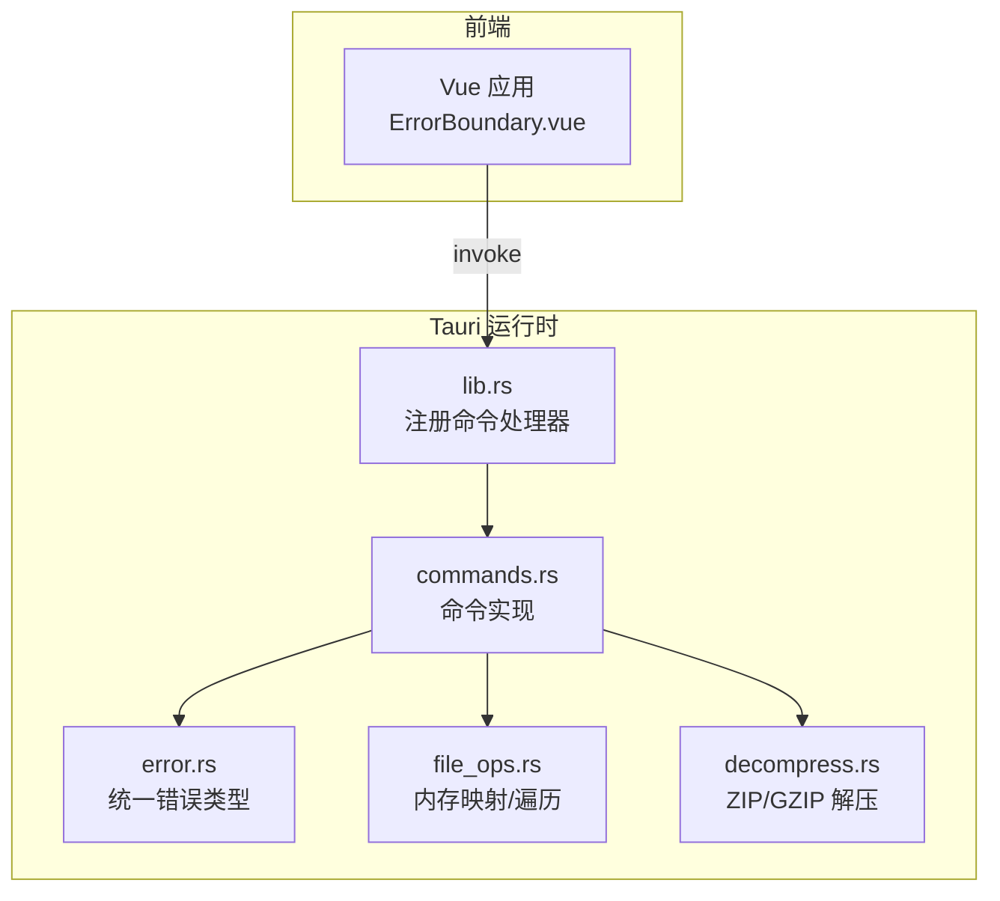
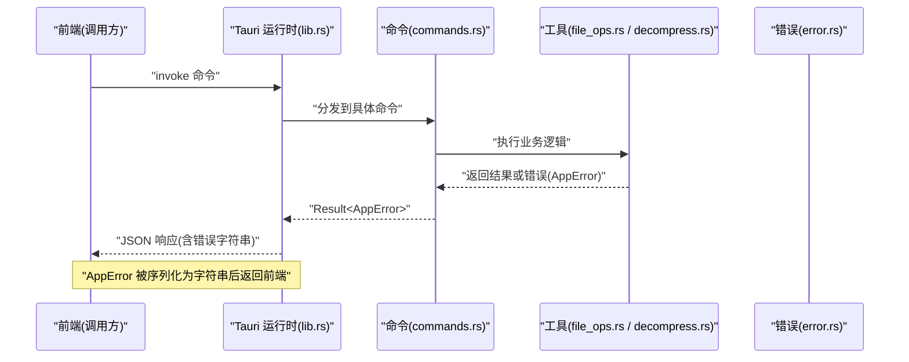
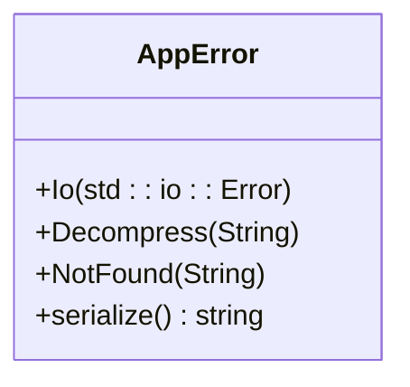
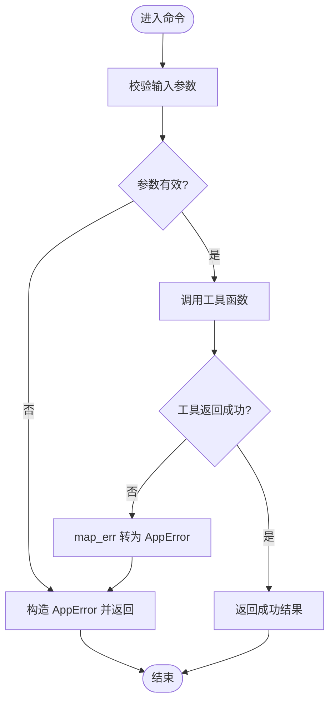
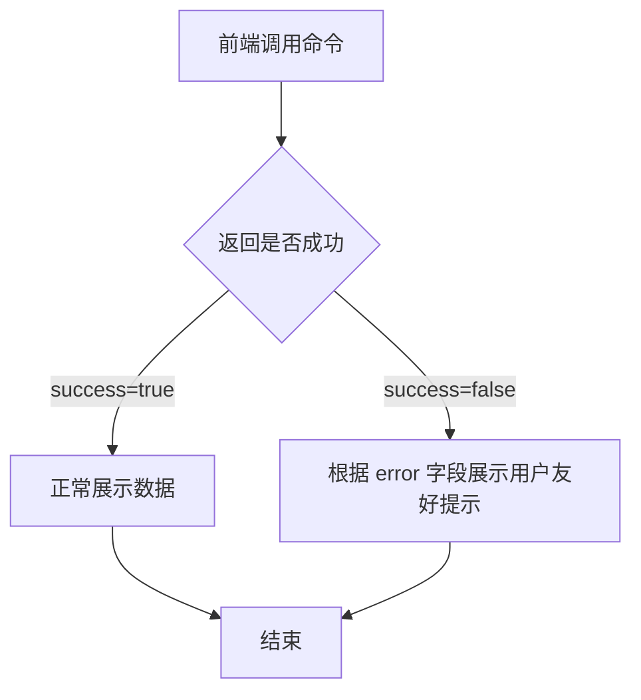
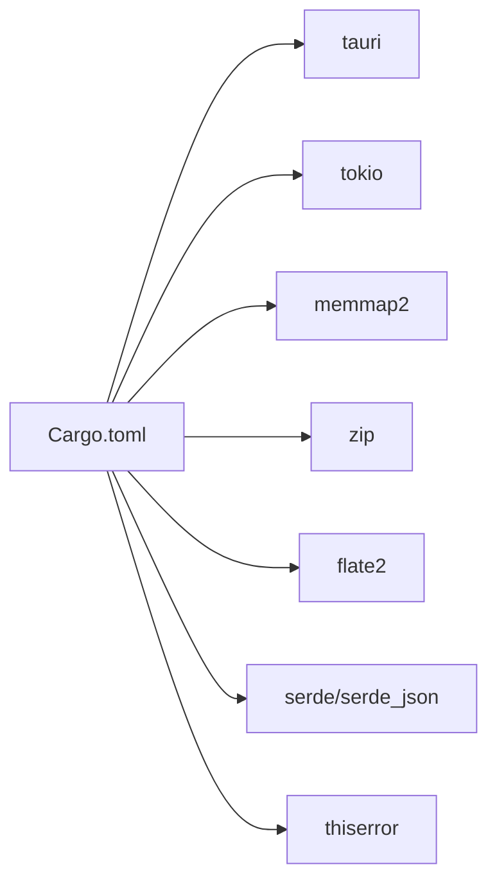

# 错误处理机制

<cite>
**本文引用的文件列表**
- [src-tauri/src/error.rs](file://src-tauri/src/error.rs)
- [src-tauri/src/commands.rs](file://src-tauri/src/commands.rs)
- [src-tauri/src/file_ops.rs](file://src-tauri/src/file_ops.rs)
- [src-tauri/src/decompress.rs](file://src-tauri/src/decompress.rs)
- [src-tauri/src/lib.rs](file://src-tauri/src/lib.rs)
- [src/components/shared/ErrorBoundary.vue](file://src/components/shared/ErrorBoundary.vue)
- [src-tauri/Cargo.toml](file://src-tauri/Cargo.toml)
</cite>

## 目录
1. [简介](#简介)
2. [项目结构](#项目结构)
3. [核心组件](#核心组件)
4. [架构总览](#架构总览)
5. [详细组件分析](#详细组件分析)
6. [依赖关系分析](#依赖关系分析)
7. [性能考量](#性能考量)
8. [故障排除指南](#故障排除指南)
9. [结论](#结论)

## 简介
本文件聚焦 Hello-Tauri 的错误处理机制，系统性阐述后端（Rust/Tauri）自定义错误类型的设计与分类、错误转换与传播策略、前端错误捕获与用户友好展示，以及日志记录与调试信息收集方案。文档同时提供常见错误的诊断方法与排障步骤，帮助读者快速定位并解决问题。

## 项目结构
本项目采用前后端分离的 Tauri 应用结构：
- 后端（Rust）位于 src-tauri/src，负责文件系统操作、解压等系统级能力，并通过 Tauri 命令暴露给前端。
- 前端（Vue + TypeScript）位于 src，负责 UI 渲染与交互，包含全局错误边界组件用于捕获渲染异常。

图表来源
- [src-tauri/src/lib.rs:1-19](file://src-tauri/src/lib.rs#L1-L19)
- [src-tauri/src/commands.rs:1-53](file://src-tauri/src/commands.rs#L1-L53)
- [src-tauri/src/error.rs:1-19](file://src-tauri/src/error.rs#L1-L19)
- [src-tauri/src/file_ops.rs:1-88](file://src-tauri/src/file_ops.rs#L1-L88)
- [src-tauri/src/decompress.rs:1-83](file://src-tauri/src/decompress.rs#L1-L83)
- [src/components/shared/ErrorBoundary.vue:1-30](file://src/components/shared/ErrorBoundary.vue#L1-L30)

章节来源
- [src-tauri/src/lib.rs:1-19](file://src-tauri/src/lib.rs#L1-L19)
- [src-tauri/src/commands.rs:1-53](file://src-tauri/src/commands.rs#L1-L53)
- [src-tauri/src/error.rs:1-19](file://src-tauri/src/error.rs#L1-L19)
- [src-tauri/src/file_ops.rs:1-88](file://src-tauri/src/file_ops.rs#L1-L88)
- [src-tauri/src/decompress.rs:1-83](file://src-tauri/src/decompress.rs#L1-L83)
- [src/components/shared/ErrorBoundary.vue:1-30](file://src/components/shared/ErrorBoundary.vue#L1-L30)

## 核心组件
本节从错误模型、错误转换与传播、前端错误边界三个维度展开。

- 统一错误类型与序列化
  - 使用 thiserror 定义枚举型 AppError，覆盖 IO 错误、解压错误、未找到资源等场景。
  - 通过 serde::Serialize 将错误序列化为字符串，便于跨进程传输到前端。
  - 参考路径：[src-tauri/src/error.rs:1-19](file://src-tauri/src/error.rs#L1-L19)

- Result 类型与错误转换
  - 命令函数普遍返回 Result<T, AppError>，利用 map_err 将底层错误转换为 AppError。
  - 在命令层对输入进行校验（如路径穿越检查），失败时直接构造 AppError 返回。
  - 参考路径：
    - [src-tauri/src/commands.rs:1-53](file://src-tauri/src/commands.rs#L1-L53)
    - [src-tauri/src/file_ops.rs:1-88](file://src-tauri/src/file_ops.rs#L1-L88)
    - [src-tauri/src/decompress.rs:1-83](file://src-tauri/src/decompress.rs#L1-L83)

- 前端错误边界
  - Vue 组件 ErrorBoundary 使用 onErrorCaptured 捕获子树异常，并以 Naive UI 的 NResult 展示错误信息与重试按钮。
  - 该组件仅捕获渲染期异常，不直接消费 Tauri 命令错误；业务层应自行处理命令返回值并在 UI 中提示。
  - 参考路径：[src/components/shared/ErrorBoundary.vue:1-30](file://src/components/shared/ErrorBoundary.vue#L1-L30)

章节来源
- [src-tauri/src/error.rs:1-19](file://src-tauri/src/error.rs#L1-L19)
- [src-tauri/src/commands.rs:1-53](file://src-tauri/src/commands.rs#L1-L53)
- [src-tauri/src/file_ops.rs:1-88](file://src-tauri/src/file_ops.rs#L1-L88)
- [src-tauri/src/decompress.rs:1-83](file://src-tauri/src/decompress.rs#L1-L83)
- [src/components/shared/ErrorBoundary.vue:1-30](file://src/components/shared/ErrorBoundary.vue#L1-L30)

## 架构总览
下图展示了从前端调用到后端命令执行、错误生成与返回的整体流程。

图表来源
- [src-tauri/src/lib.rs:1-19](file://src-tauri/src/lib.rs#L1-L19)
- [src-tauri/src/commands.rs:1-53](file://src-tauri/src/commands.rs#L1-L53)
- [src-tauri/src/file_ops.rs:1-88](file://src-tauri/src/file_ops.rs#L1-L88)
- [src-tauri/src/decompress.rs:1-83](file://src-tauri/src/decompress.rs#L1-L83)
- [src-tauri/src/error.rs:1-19](file://src-tauri/src/error.rs#L1-L19)

## 详细组件分析

### 统一错误类型设计（AppError）
- 设计原则
  - 单一错误入口：所有命令共享 AppError，避免上层分散处理多种底层错误。
  - 可序列化：实现 Serialize，使错误能安全地跨进程传递到前端。
  - 可扩展：新增错误分支只需扩展枚举，不影响现有调用链。
- 错误分类
  - IO 错误：封装 std::io::Error，涵盖读写、权限、路径等问题。
  - 解压错误：封装解压过程中的格式解析、数据损坏等错误。
  - 未找到：封装资源不存在等语义化错误。
- 复杂度与影响
  - 时间/空间复杂度：O(1) 构造与序列化，开销极低。
  - 耦合性：命令层与工具层均依赖 AppError，提升内聚性。

图表来源
- [src-tauri/src/error.rs:1-19](file://src-tauri/src/error.rs#L1-L19)

章节来源
- [src-tauri/src/error.rs:1-19](file://src-tauri/src/error.rs#L1-L19)

### 错误转换与传播（命令层）
- Result 模式
  - 命令函数返回 Result<T, AppError>，结合 map_err 将底层错误转换为 AppError。
  - 示例：读取文件时将 tokio::fs::read 的错误转换为 AppError::Io。
- 输入校验与安全
  - 命令层对 path 参数进行安全检查（如禁止 .. 路径穿越），失败时直接返回 AppError。
- 解压命令的特殊处理
  - 对于不支持的格式，返回成功标志为 false 的结果对象，并将错误信息写入 error 字段，以便前端区分“业务失败”和“系统错误”。

图表来源
- [src-tauri/src/commands.rs:1-53](file://src-tauri/src/commands.rs#L1-L53)
- [src-tauri/src/file_ops.rs:1-88](file://src-tauri/src/file_ops.rs#L1-L88)
- [src-tauri/src/decompress.rs:1-83](file://src-tauri/src/decompress.rs#L1-L83)

章节来源
- [src-tauri/src/commands.rs:1-53](file://src-tauri/src/commands.rs#L1-L53)
- [src-tauri/src/file_ops.rs:1-88](file://src-tauri/src/file_ops.rs#L1-L88)
- [src-tauri/src/decompress.rs:1-83](file://src-tauri/src/decompress.rs#L1-L83)

### 前端错误显示与用户友好消息
- 渲染期错误边界
  - ErrorBoundary 组件捕获子树异常，以 NResult 展示错误标题与描述，并提供重试按钮。
  - 该组件适用于组件内部渲染异常，不直接处理 Tauri 命令错误。
- 业务层错误提示建议
  - 在调用 Tauri 命令处，根据返回的 Result 判断 success 与 error 字段，向用户展示友好的中文提示。
  - 对 IO 类错误，提示“文件访问失败，请检查权限或路径”；对解压错误，提示“文件格式不正确或已损坏”。

图表来源
- [src/components/shared/ErrorBoundary.vue:1-30](file://src/components/shared/ErrorBoundary.vue#L1-L30)
- [src-tauri/src/commands.rs:37-52](file://src-tauri/src/commands.rs#L37-L52)

章节来源
- [src/components/shared/ErrorBoundary.vue:1-30](file://src/components/shared/ErrorBoundary.vue#L1-L30)
- [src-tauri/src/commands.rs:37-52](file://src-tauri/src/commands.rs#L37-L52)

### 错误日志记录与调试信息收集
- 现状说明
  - 当前代码未集成专用日志库（如 tracing 或 log）。错误主要通过 AppError 的字符串化形式返回前端。
- 推荐方案
  - 引入日志框架（例如 tracing），在关键路径（IO、解压、参数校验）记录结构化日志。
  - 在命令入口处记录请求参数与耗时，在错误分支记录错误上下文（如路径、偏移、长度、格式）。
  - 将关键错误信息附加到返回结果中，便于前端展示与问题复现。
- 实施要点
  - 保持日志级别合理（debug 用于开发，warn/error 用于生产）。
  - 避免记录敏感信息（如绝对路径中的用户名）。

[本节为通用指导，不涉及具体文件分析]

## 依赖关系分析
- 后端依赖
  - tauri：提供命令注册与运行时。
  - tokio：异步文件系统操作。
  - memmap2：内存映射读取大文件。
  - zip、flate2：压缩/解压支持。
  - serde、serde_json：序列化/反序列化。
  - thiserror：错误类型宏与 Display 实现。
- 错误相关依赖
  - thiserror 用于简化错误枚举与 Display 实现。
  - serde 用于将 AppError 序列化为字符串，供前端接收。

图表来源
- [src-tauri/Cargo.toml:1-19](file://src-tauri/Cargo.toml#L1-L19)

章节来源
- [src-tauri/Cargo.toml:1-19](file://src-tauri/Cargo.toml#L1-L19)

## 性能考量
- 内存映射读取
  - 使用 memmap2 减少拷贝，适合大文件随机读取。注意 offset 与 length 的边界检查，避免越界。
- 解压性能
  - ZIP 解压逐条目处理，GZIP 一次性解码。对超大压缩包建议分块处理与进度反馈。
- 错误处理的性能
  - AppError 构造与序列化开销低，不会成为瓶颈。
- I/O 并发
  - 使用 tokio 异步 I/O，提高吞吐。注意限制并发度以避免系统资源耗尽。

[本节为通用指导，不涉及具体文件分析]

## 故障排除指南
- 常见问题与定位
  - 路径穿越拦截：当 path 包含 “..” 时，命令会拒绝访问并返回权限相关错误。检查前端传入的路径是否经过规范化。
    - 参考路径：[src-tauri/src/commands.rs:6-14](file://src-tauri/src/commands.rs#L6-L14)
  - 读取范围越界：mmap_read 若 offset+length 超出文件大小，将返回无效输入错误。确认调用方计算的区间合法。
    - 参考路径：[src-tauri/src/file_ops.rs:6-18](file://src-tauri/src/file_ops.rs#L6-L18)
  - 解压失败：zip/gzip 解析错误或数据损坏会触发 Decompress 错误。检查输入数据完整性与格式。
    - 参考路径：[src-tauri/src/decompress.rs:23-62](file://src-tauri/src/decompress.rs#L23-L62), [src-tauri/src/decompress.rs:64-82](file://src-tauri/src/decompress.rs#L64-L82)
  - 未找到资源：当路径不存在或无权限时，可能返回 IO 错误。检查目标路径是否存在及权限设置。
    - 参考路径：[src-tauri/src/file_ops.rs:20-53](file://src-tauri/src/file_ops.rs#L20-L53)
- 前端错误展示
  - 若出现渲染异常，ErrorBoundary 会显示错误信息并提供重试。确保业务层对命令错误也做了友好提示。
    - 参考路径：[src/components/shared/ErrorBoundary.vue:1-30](file://src/components/shared/ErrorBoundary.vue#L1-L30)
- 调试建议
  - 在命令层增加结构化日志（建议引入 tracing），记录关键参数与错误上下文。
  - 对解压命令，记录 format 与 output_dir，便于复现问题。
  - 对 mmap 读取，记录 offset、length 与文件大小，辅助定位越界问题。

章节来源
- [src-tauri/src/commands.rs:6-14](file://src-tauri/src/commands.rs#L6-L14)
- [src-tauri/src/file_ops.rs:6-18](file://src-tauri/src/file_ops.rs#L6-L18)
- [src-tauri/src/decompress.rs:23-62](file://src-tauri/src/decompress.rs#L23-L62)
- [src-tauri/src/decompress.rs:64-82](file://src-tauri/src/decompress.rs#L64-L82)
- [src-tauri/src/file_ops.rs:20-53](file://src-tauri/src/file_ops.rs#L20-L53)
- [src/components/shared/ErrorBoundary.vue:1-30](file://src/components/shared/ErrorBoundary.vue#L1-L30)

## 结论
Hello-Tauri 的错误处理机制围绕统一的 AppError 类型构建，通过 Result 模式与 map_err 完成错误转换与传播，并利用 serde 将错误序列化为字符串传递给前端。前端通过 ErrorBoundary 捕获渲染异常，而业务层需对命令返回的错误进行友好提示。当前未集成专用日志库，建议引入 tracing 完善日志与调试能力。整体设计简洁清晰、可扩展性强，能满足常见的 IO 与解压场景的错误处理需求。