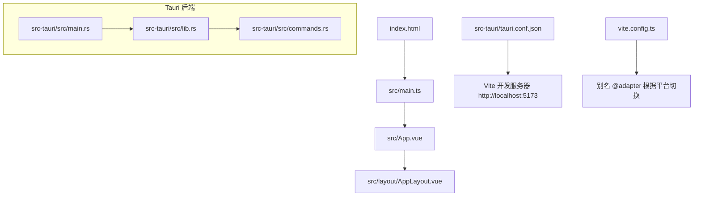
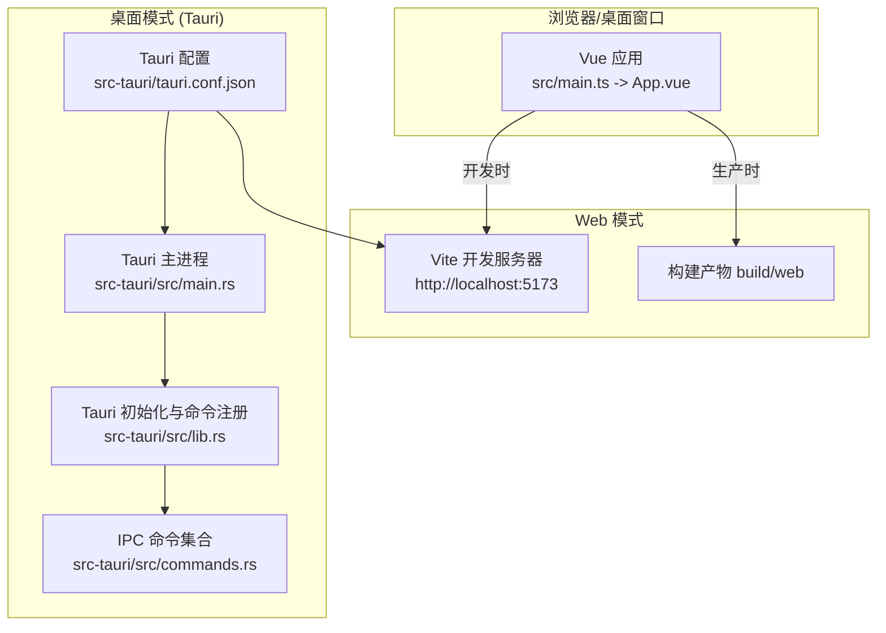
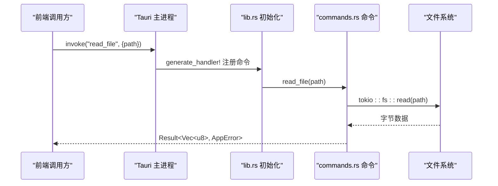
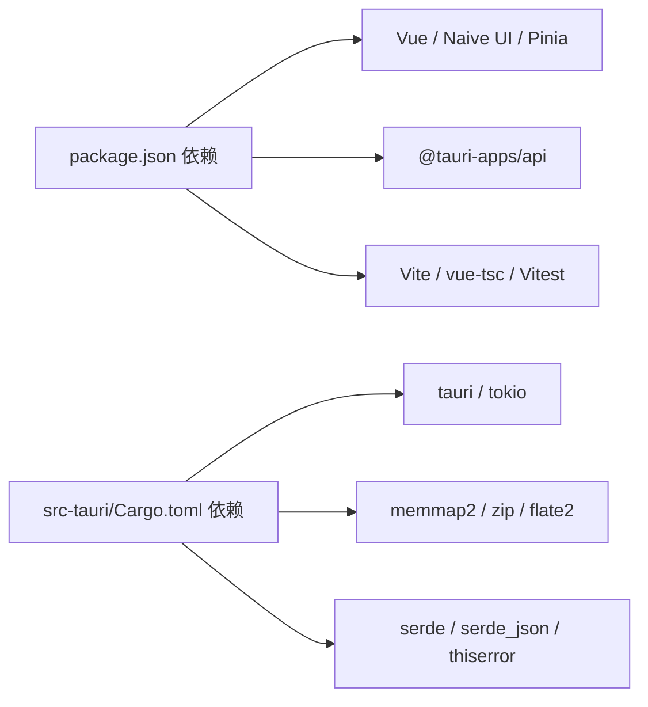

# 快速开始

<cite>
**本文引用的文件**
- [README.md](file://README.md)
- [package.json](file://package.json)
- [vite.config.ts](file://vite.config.ts)
- [tsconfig.json](file://tsconfig.json)
- [vitest.config.ts](file://vitest.config.ts)
- [index.html](file://index.html)
- [src/main.ts](file://src/main.ts)
- [src/App.vue](file://src/App.vue)
- [src-tauri/Cargo.toml](file://src-tauri/Cargo.toml)
- [src-tauri/tauri.conf.json](file://src-tauri/tauri.conf.json)
- [src-tauri/src/lib.rs](file://src-tauri/src/lib.rs)
- [src-tauri/src/main.rs](file://src-tauri/src/main.rs)
- [src-tauri/src/commands.rs](file://src-tauri/src/commands.rs)
</cite>

## 目录
1. [简介](#简介)
2. [项目结构](#项目结构)
3. [核心组件](#核心组件)
4. [架构总览](#架构总览)
5. [详细组件分析](#详细组件分析)
6. [依赖分析](#依赖分析)
7. [性能考虑](#性能考虑)
8. [故障排查指南](#故障排查指南)
9. [结论](#结论)
10. [附录](#附录)

## 简介
Hello-Tauri 是一个基于 Vue 3 + Tauri 的跨平台日志解析工具，支持 Web 与桌面双端构建。前端使用 Vite 作为开发服务器与构建工具，后端通过 Tauri（Rust）提供文件系统、内存映射读取与解压等能力。项目同时提供类型检查与测试脚本，便于日常开发与质量保障。

## 项目结构
- 前端工程位于根目录与 src 目录，入口为 index.html 与 src/main.ts，应用根组件为 src/App.vue。
- 桌面后端位于 src-tauri，包含 Rust 源码与 Tauri 配置。
- 构建与运行脚本集中在 package.json；Vite 与 Vitest 分别由 vite.config.ts 与 vitest.config.ts 管理。
- TypeScript 编译选项在 tsconfig.json 中定义。

图表来源
- [index.html:1-13](file://index.html#L1-L13)
- [src/main.ts:1-8](file://src/main.ts#L1-L8)
- [src/App.vue:1-24](file://src/App.vue#L1-L24)
- [src-tauri/src/main.rs:1-4](file://src-tauri/src/main.rs#L1-L4)
- [src-tauri/src/lib.rs:1-19](file://src-tauri/src/lib.rs#L1-L19)
- [src-tauri/src/commands.rs:1-53](file://src-tauri/src/commands.rs#L1-L53)
- [src-tauri/tauri.conf.json:1-31](file://src-tauri/tauri.conf.json#L1-L31)
- [vite.config.ts:1-28](file://vite.config.ts#L1-L28)

章节来源
- [README.md:1-140](file://README.md#L1-L140)
- [package.json:1-42](file://package.json#L1-L42)
- [vite.config.ts:1-28](file://vite.config.ts#L1-L28)
- [tsconfig.json:1-23](file://tsconfig.json#L1-L23)
- [vitest.config.ts:1-18](file://vitest.config.ts#L1-L18)
- [index.html:1-13](file://index.html#L1-L13)
- [src/main.ts:1-8](file://src/main.ts#L1-L8)
- [src/App.vue:1-24](file://src/App.vue#L1-L24)
- [src-tauri/Cargo.toml:1-19](file://src-tauri/Cargo.toml#L1-L19)
- [src-tauri/tauri.conf.json:1-31](file://src-tauri/tauri.conf.json#L1-L31)
- [src-tauri/src/lib.rs:1-19](file://src-tauri/src/lib.rs#L1-L19)
- [src-tauri/src/main.rs:1-4](file://src-tauri/src/main.rs#L1-L4)
- [src-tauri/src/commands.rs:1-53](file://src-tauri/src/commands.rs#L1-L53)

## 核心组件
- 前端入口与根组件：index.html 引入模块入口 main.ts，main.ts 创建 Vue 应用并挂载到 #app，App.vue 提供主题与布局容器。
- 构建与开发：Vite 负责开发服务器与打包，Vue 插件启用 SFC 与热更新；TypeScript 通过 vue-tsc 进行类型检查。
- 测试：Vitest 使用 jsdom 环境，全局 API 可用，路径别名与 Vite 一致。
- 桌面后端：Tauri 主进程启动 lib::run，注册 IPC 命令（读/写文件、mmap 读取、列出文件、解压等）。

章节来源
- [index.html:1-13](file://index.html#L1-L13)
- [src/main.ts:1-8](file://src/main.ts#L1-L8)
- [src/App.vue:1-24](file://src/App.vue#L1-L24)
- [vite.config.ts:1-28](file://vite.config.ts#L1-L28)
- [tsconfig.json:1-23](file://tsconfig.json#L1-L23)
- [vitest.config.ts:1-18](file://vitest.config.ts#L1-L18)
- [src-tauri/src/lib.rs:1-19](file://src-tauri/src/lib.rs#L1-L19)
- [src-tauri/src/commands.rs:1-53](file://src-tauri/src/commands.rs#L1-L53)

## 架构总览
下图展示了 Web 模式与桌面模式的差异：Web 模式下直接由 Vite 提供静态资源；桌面模式下由 Tauri 加载本地构建产物或开发时代理到 Vite 开发服务器。

图表来源
- [src/main.ts:1-8](file://src/main.ts#L1-L8)
- [src/App.vue:1-24](file://src/App.vue#L1-L24)
- [vite.config.ts:1-28](file://vite.config.ts#L1-L28)
- [src-tauri/src/main.rs:1-4](file://src-tauri/src/main.rs#L1-L4)
- [src-tauri/src/lib.rs:1-19](file://src-tauri/src/lib.rs#L1-L19)
- [src-tauri/src/commands.rs:1-53](file://src-tauri/src/commands.rs#L1-L53)
- [src-tauri/tauri.conf.json:1-31](file://src-tauri/tauri.conf.json#L1-L31)

## 详细组件分析

### 环境与依赖安装
- Node.js 要求：>=20（见 engines 字段）。
- 安装依赖：在项目根目录执行 npm install。
- 可选：若需要桌面模式，请确保已安装 Rust 工具链与 Tauri CLI（@tauri-apps/cli 已在 devDependencies 中）。

章节来源
- [package.json:1-42](file://package.json#L1-L42)
- [README.md:51-69](file://README.md#L51-L69)

### 开发环境配置
- 前端开发服务器：npm run dev，默认监听 http://localhost:5173。
- 桌面开发模式：npm run tauri:dev，Tauri 会先执行 beforeDevCommand（即 npm run dev），再启动桌面窗口并加载 devUrl。
- 别名与平台切换：vite.config.ts 根据环境变量 VITE_PLATFORM 决定 @adapter 指向 web-adapter 或 tauri-adapter。

章节来源
- [package.json:9-18](file://package.json#L9-L18)
- [src-tauri/tauri.conf.json:6-11](file://src-tauri/tauri.conf.json#L6-L11)
- [vite.config.ts:5-18](file://vite.config.ts#L5-L18)

### 常用命令速查
- 启动 Web 开发：npm run dev
- 启动桌面开发：npm run tauri:dev
- 预览构建产物：npm run preview
- 类型检查：npm run typecheck
- 运行测试：npm test
- 构建 Web：npm run build
- 构建桌面：npm run tauri:build

章节来源
- [package.json:9-18](file://package.json#L9-L18)
- [README.md:51-69](file://README.md#L51-L69)

### 第一个文件的加载与预览示例
- 打开浏览器访问 http://localhost:5173，即可看到由 index.html 引入的 Vue 应用。
- 在 src/main.ts 中创建应用实例并挂载到 #app，App.vue 提供主题与布局容器。
- 在桌面模式下，Tauri 会在开发时代理到 Vite 开发服务器，无需手动启动。

章节来源
- [index.html:1-13](file://index.html#L1-L13)
- [src/main.ts:1-8](file://src/main.ts#L1-L8)
- [src/App.vue:1-24](file://src/App.vue#L1-L24)
- [src-tauri/tauri.conf.json:6-11](file://src-tauri/tauri.conf.json#L6-L11)

### 类型检查与测试
- 类型检查：vue-tsc --noEmit 仅做类型校验，不生成输出。
- 单元测试：Vitest 使用 jsdom 环境，全局 API 开启，路径别名与 Vite 保持一致，便于复用代码。

章节来源
- [package.json:15-15](file://package.json#L15-L15)
- [tsconfig.json:1-23](file://tsconfig.json#L1-L23)
- [vitest.config.ts:1-18](file://vitest.config.ts#L1-L18)

### 构建与打包
- Web 构建：npm run build，产物输出至 build/web。
- 桌面构建：npm run tauri:build，Tauri 会先执行 beforeBuildCommand（即 npm run build），然后打包桌面应用。
- 构建产物目录与开发端口在 tauri.conf.json 中配置。

章节来源
- [package.json:11-18](file://package.json#L11-L18)
- [vite.config.ts:20-26](file://vite.config.ts#L20-L26)
- [src-tauri/tauri.conf.json:6-11](file://src-tauri/tauri.conf.json#L6-L11)

### 后端 IPC 命令概览
- 文件读写：read_file、write_file
- 临时目录获取：get_temp_dir
- 大文件高效读取：mmap_read（内存映射）
- 目录遍历：list_files
- 解压：decompress（zip/gzip）

图表来源
- [src-tauri/src/lib.rs:6-18](file://src-tauri/src/lib.rs#L6-L18)
- [src-tauri/src/commands.rs:5-14](file://src-tauri/src/commands.rs#L5-L14)

章节来源
- [src-tauri/src/lib.rs:1-19](file://src-tauri/src/lib.rs#L1-L19)
- [src-tauri/src/commands.rs:1-53](file://src-tauri/src/commands.rs#L1-L53)

## 依赖分析
- 运行时依赖：Vue、Naive UI、Pinia、@vueuse/core、@tauri-apps/api、fflate、splitpanes、vue-draggable-plus。
- 开发依赖：TypeScript、Vite、@vitejs/plugin-vue、vue-tsc、Vitest、@vue/test-utils、jsdom、@tauri-apps/cli、@types/node。
- Rust 依赖：tauri、tokio、memmap2、zip、flate2、rayon、serde、serde_json、thiserror、tauri-build。

图表来源
- [package.json:20-40](file://package.json#L20-L40)
- [src-tauri/Cargo.toml:6-18](file://src-tauri/Cargo.toml#L6-L18)

章节来源
- [package.json:1-42](file://package.json#L1-L42)
- [src-tauri/Cargo.toml:1-19](file://src-tauri/Cargo.toml#L1-L19)

## 性能考虑
- 大文件读取：后端提供 mmap_read，避免整文件载入内存，适合超大日志文件。
- 并发控制：任务调度器可限制解压并发数，避免阻塞 UI 线程。
- 构建优化：Vite 使用 Rolldown 引擎，生产构建时可按需外部化依赖（如 @tauri-apps/api）。

章节来源
- [src-tauri/src/commands.rs:27-30](file://src-tauri/src/commands.rs#L27-L30)
- [vite.config.ts:20-26](file://vite.config.ts#L20-L26)

## 故障排查指南
- Node.js 版本过低：engines 要求 >=20，请使用 nvm 或其他版本管理器升级。
- 端口占用：Vite 默认 5173，若被占用请修改系统端口或释放占用。
- Tauri 未安装：桌面模式需要 Rust 工具链与 Tauri CLI，请先安装后再运行 tauri:dev/tauri:build。
- 构建失败：确认 npm run build 能独立成功；检查 tauri.conf.json 中的 frontendDist 与 devUrl 是否匹配。
- 类型检查报错：运行 npm run typecheck 定位问题，必要时调整 tsconfig.json 的严格模式或忽略第三方库。
- 测试环境问题：Vitest 使用 jsdom，某些浏览器 API 不可用，可在测试中 mock 或使用兼容实现。

章节来源
- [package.json:6-8](file://package.json#L6-L8)
- [src-tauri/tauri.conf.json:6-11](file://src-tauri/tauri.conf.json#L6-L11)
- [tsconfig.json:1-23](file://tsconfig.json#L1-L23)
- [vitest.config.ts:1-18](file://vitest.config.ts#L1-L18)

## 结论
本指南覆盖了 Hello-Tauri 的环境搭建、开发流程、常用命令、构建打包与常见问题排查。按照步骤操作后，你可以在浏览器中体验 Web 模式，或在桌面端获得原生应用体验。如需扩展功能，可参考 README 的项目结构与文档链接，逐步完善插件与解析器。

## 附录
- 产品与架构文档：参见 docs/superpowers/specs 与 plans 下的设计规格与实现计划。
- 许可证：MIT