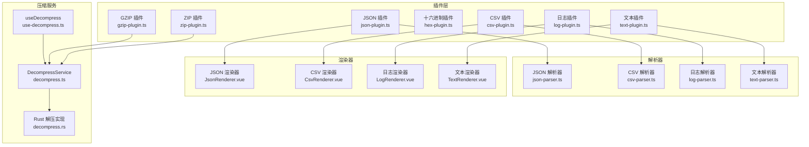
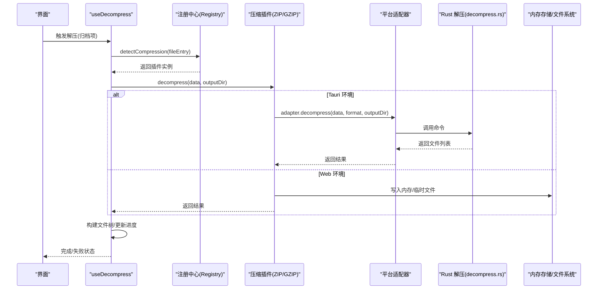
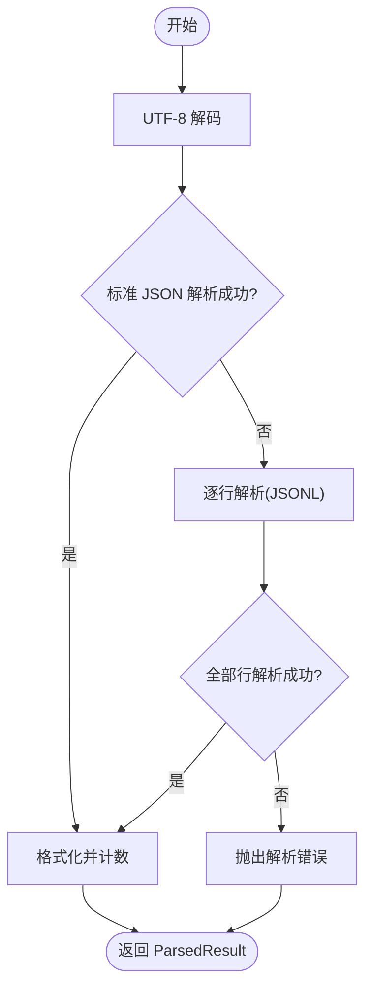
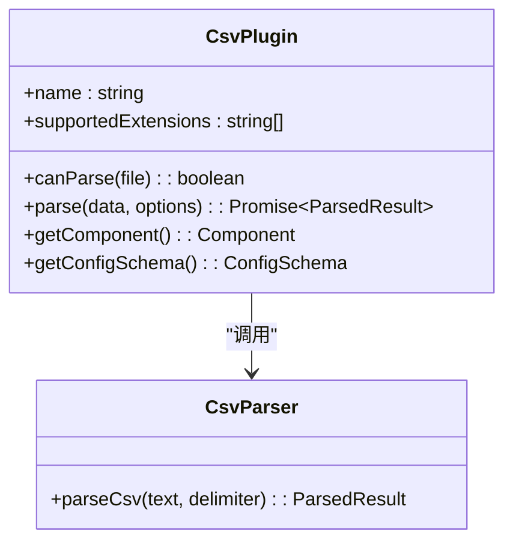
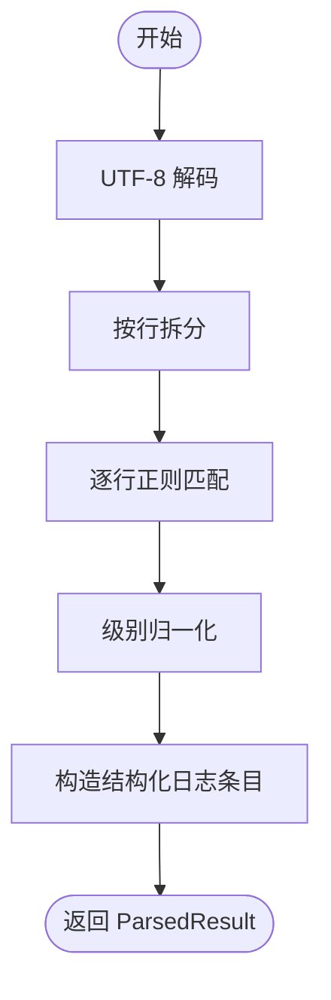
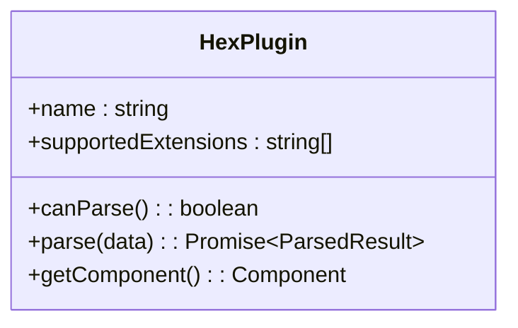
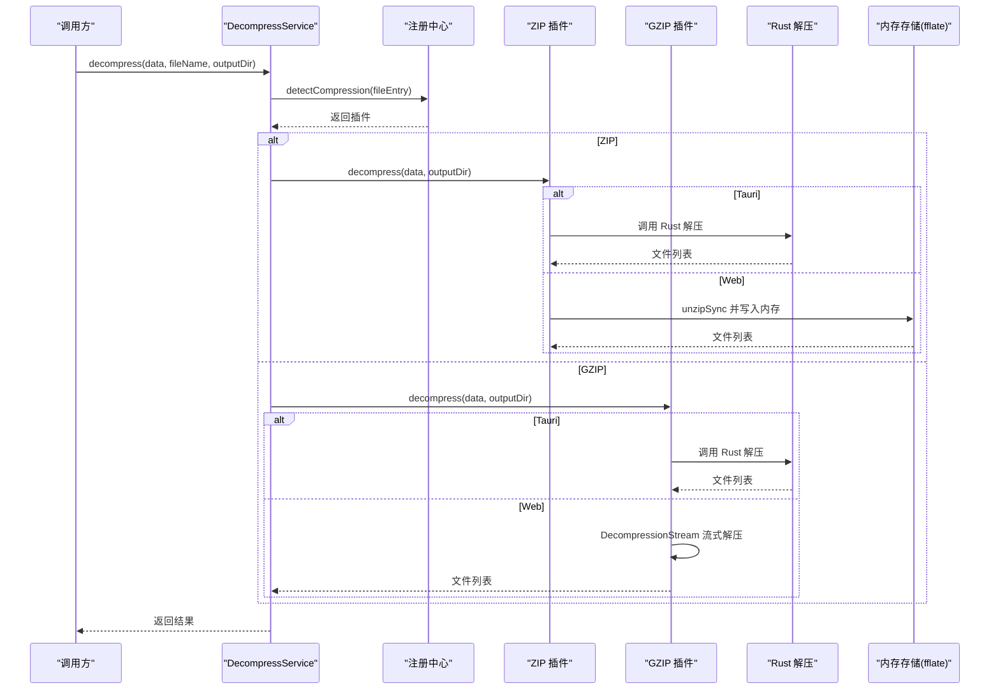
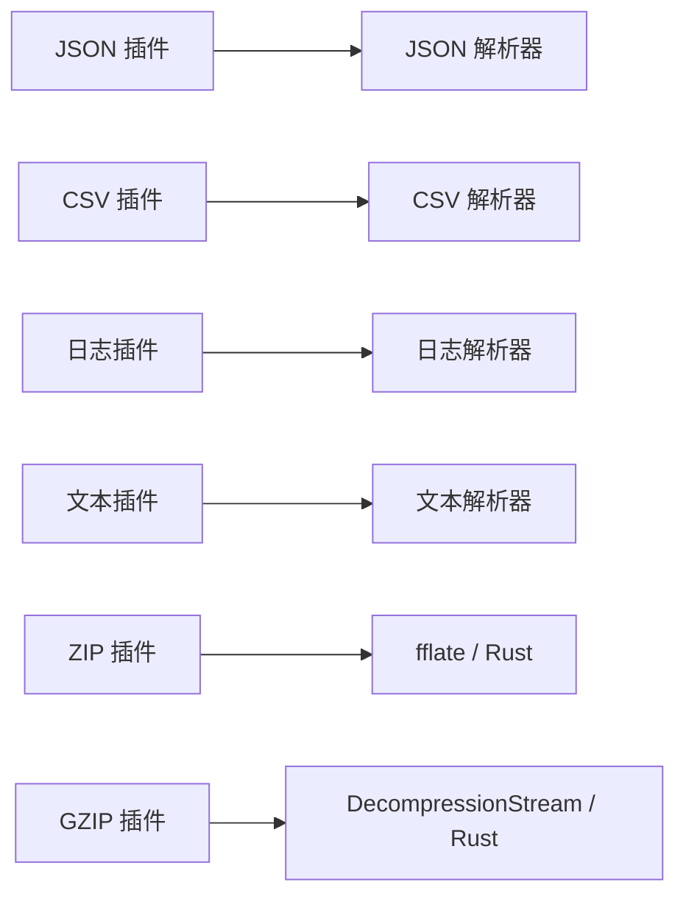

# 内置插件实现

<cite>
**本文引用的文件**   
- [src/plugins/parser/json-plugin.ts](file://src/plugins/parser/json-plugin.ts)
- [src/plugins/parsers/json-parser.ts](file://src/plugins/parsers/json-parser.ts)
- [src/views/renderers/JsonRenderer.vue](file://src/views/renderers/JsonRenderer.vue)
- [src/plugins/parser/csv-plugin.ts](file://src/plugins/parser/csv-plugin.ts)
- [src/plugins/parsers/csv-parser.ts](file://src/plugins/parsers/csv-parser.ts)
- [src/views/renderers/CsvRenderer.vue](file://src/views/renderers/CsvRenderer.vue)
- [src/plugins/parser/log-plugin.ts](file://src/plugins/parser/log-plugin.ts)
- [src/plugins/parsers/log-parser.ts](file://src/plugins/parsers/log-parser.ts)
- [src/plugins/parsers/types.ts](file://src/plugins/parsers/types.ts)
- [src/views/renderers/LogRenderer.vue](file://src/views/renderers/LogRenderer.vue)
- [src/plugins/parser/hex-plugin.ts](file://src/plugins/parser/hex-plugin.ts)
- [src/plugins/parser/text-plugin.ts](file://src/plugins/parser/text-plugin.ts)
- [src/plugins/parsers/text-parser.ts](file://src/plugins/parsers/text-parser.ts)
- [src/views/renderers/TextRenderer.vue](file://src/views/renderers/TextRenderer.vue)
- [src/plugins/compression/zip-plugin.ts](file://src/plugins/compression/zip-plugin.ts)
- [src/plugins/compression/gzip-plugin.ts](file://src/plugins/compression/gzip-plugin.ts)
- [src/core/decompress.ts](file://src/core/decompress.ts)
- [src/composables/use-decompress.ts](file://src/composables/use-decompress.ts)
- [src-tauri/src/decompress.rs](file://src-tauri/src/decompress.rs)
- [src/adapters/types.ts](file://src/adapters/types.ts)
- [src/plugins/types.ts](file://src/plugins/types.ts)
</cite>

## 目录
1. [简介](#简介)
2. [项目结构](#项目结构)
3. [核心组件](#核心组件)
4. [架构总览](#架构总览)
5. [详细组件分析](#详细组件分析)
6. [依赖分析](#依赖分析)
7. [性能考虑](#性能考虑)
8. [故障排查指南](#故障排查指南)
9. [结论](#结论)
10. [附录](#附录)

## 简介
本文件对 Hello-Tauri 的内置插件进行系统化技术分析，覆盖以下能力：
- JSON 解析器：结构化数据与 JSONL 兼容、格式化输出。
- CSV 解析器：分隔符可配置、行级处理与表头推断。
- 日志解析器：多格式支持（正则匹配）、级别归一化与结构化字段提取。
- 十六进制查看器：二进制数据处理与渲染。
- 文本解析器：UTF-8 解码与行数统计。
- 压缩处理器：ZIP/GZIP 解压流程、平台适配（Tauri 命令 vs Web API）、任务调度与进度跟踪、内存管理策略。

文档同时给出插件间协作模式、数据流转机制、配置选项说明、性能特征与使用建议。

## 项目结构
- 插件层位于 src/plugins，分为 parser（解析类）与 compression（压缩类）。
- 具体解析逻辑集中在 src/plugins/parsers，提供统一的 ParsedResult 数据结构。
- 视图渲染器位于 src/views/renderers，由插件返回对应 Vue 组件以展示结果。
- 压缩相关包含前端插件与 Tauri 后端实现，通过适配器桥接。

图示来源
- [src/plugins/parser/json-plugin.ts:1-19](file://src/plugins/parser/json-plugin.ts#L1-L19)
- [src/plugins/parsers/json-parser.ts:1-17](file://src/plugins/parsers/json-parser.ts#L1-L17)
- [src/views/renderers/JsonRenderer.vue](file://src/views/renderers/JsonRenderer.vue)
- [src/plugins/parser/csv-plugin.ts:1-28](file://src/plugins/parser/csv-plugin.ts#L1-L28)
- [src/plugins/parsers/csv-parser.ts:1-17](file://src/plugins/parsers/csv-parser.ts#L1-L17)
- [src/views/renderers/CsvRenderer.vue](file://src/views/renderers/CsvRenderer.vue)
- [src/plugins/parser/log-plugin.ts:1-18](file://src/plugins/parser/log-plugin.ts#L1-L18)
- [src/plugins/parsers/log-parser.ts:1-37](file://src/plugins/parsers/log-parser.ts#L1-L37)
- [src/views/renderers/LogRenderer.vue](file://src/views/renderers/LogRenderer.vue)
- [src/plugins/parser/hex-plugin.ts:1-53](file://src/plugins/parser/hex-plugin.ts#L1-L53)
- [src/plugins/parser/text-plugin.ts:1-18](file://src/plugins/parser/text-plugin.ts#L1-L18)
- [src/plugins/parsers/text-parser.ts:1-8](file://src/plugins/parsers/text-parser.ts#L1-L8)
- [src/views/renderers/TextRenderer.vue](file://src/views/renderers/TextRenderer.vue)
- [src/plugins/compression/zip-plugin.ts:1-40](file://src/plugins/compression/zip-plugin.ts#L1-L40)
- [src/plugins/compression/gzip-plugin.ts:1-44](file://src/plugins/compression/gzip-plugin.ts#L1-L44)
- [src/core/decompress.ts:1-27](file://src/core/decompress.ts#L1-L27)
- [src/composables/use-decompress.ts:1-74](file://src/composables/use-decompress.ts#L1-L74)
- [src-tauri/src/decompress.rs:1-83](file://src-tauri/src/decompress.rs#L1-L83)

章节来源
- [src/plugins/parser/json-plugin.ts:1-19](file://src/plugins/parser/json-plugin.ts#L1-L19)
- [src/plugins/parser/csv-plugin.ts:1-28](file://src/plugins/parser/csv-plugin.ts#L1-L28)
- [src/plugins/parser/log-plugin.ts:1-18](file://src/plugins/parser/log-plugin.ts#L1-L18)
- [src/plugins/parser/hex-plugin.ts:1-53](file://src/plugins/parser/hex-plugin.ts#L1-L53)
- [src/plugins/parser/text-plugin.ts:1-18](file://src/plugins/parser/text-plugin.ts#L1-L18)
- [src/plugins/parsers/json-parser.ts:1-17](file://src/plugins/parsers/json-parser.ts#L1-L17)
- [src/plugins/parsers/csv-parser.ts:1-17](file://src/plugins/parsers/csv-parser.ts#L1-L17)
- [src/plugins/parsers/log-parser.ts:1-37](file://src/plugins/parsers/log-parser.ts#L1-L37)
- [src/plugins/parsers/text-parser.ts:1-8](file://src/plugins/parsers/text-parser.ts#L1-L8)
- [src/plugins/compression/zip-plugin.ts:1-40](file://src/plugins/compression/zip-plugin.ts#L1-L40)
- [src/plugins/compression/gzip-plugin.ts:1-44](file://src/plugins/compression/gzip-plugin.ts#L1-L44)
- [src/core/decompress.ts:1-27](file://src/core/decompress.ts#L1-L27)
- [src/composables/use-decompress.ts:1-74](file://src/composables/use-decompress.ts#L1-L74)
- [src-tauri/src/decompress.rs:1-83](file://src-tauri/src/decompress.rs#L1-L83)

## 核心组件
- 解析插件接口统一：所有解析插件遵循 IFileParserPlugin 约定，提供 name、supportedExtensions、canParse、parse、getComponent 等能力；部分插件提供 getConfigSchema 用于动态配置。
- 压缩插件接口统一：ICompressionPlugin 提供 canHandle、decompress 等能力，并支持平台适配（Tauri 命令或浏览器 API）。
- 解析结果统一：ParsedResult 包含 type、data、lineCount，便于上层渲染与统计。
- 压缩服务：DecompressService 负责根据文件名选择合适插件并执行解压；useDecompress 组合任务调度、进度更新与树构建。

章节来源
- [src/plugins/types.ts](file://src/plugins/types.ts)
- [src/plugins/parser/json-plugin.ts:1-19](file://src/plugins/parser/json-plugin.ts#L1-L19)
- [src/plugins/parser/csv-plugin.ts:1-28](file://src/plugins/parser/csv-plugin.ts#L1-L28)
- [src/plugins/parser/log-plugin.ts:1-18](file://src/plugins/parser/log-plugin.ts#L1-L18)
- [src/plugins/parser/hex-plugin.ts:1-53](file://src/plugins/parser/hex-plugin.ts#L1-L53)
- [src/plugins/parser/text-plugin.ts:1-18](file://src/plugins/parser/text-plugin.ts#L1-L18)
- [src/plugins/compression/zip-plugin.ts:1-40](file://src/plugins/compression/zip-plugin.ts#L1-L40)
- [src/plugins/compression/gzip-plugin.ts:1-44](file://src/plugins/compression/gzip-plugin.ts#L1-L44)
- [src/core/decompress.ts:1-27](file://src/core/decompress.ts#L1-L27)
- [src/composables/use-decompress.ts:1-74](file://src/composables/use-decompress.ts#L1-L74)

## 架构总览
整体采用“插件 + 解析器 + 渲染器”的分层设计：
- 插件负责识别文件类型、调用解析器、返回渲染组件。
- 解析器专注数据转换，产出统一的结构化结果。
- 渲染器负责 UI 呈现。
- 压缩模块通过 DecompressService 和 useDecompress 协调任务调度、进度上报与结果树构建，并在 Tauri 环境下走 Rust 实现以提升性能与稳定性。

图示来源
- [src/composables/use-decompress.ts:1-74](file://src/composables/use-decompress.ts#L1-L74)
- [src/plugins/compression/zip-plugin.ts:1-40](file://src/plugins/compression/zip-plugin.ts#L1-L40)
- [src/plugins/compression/gzip-plugin.ts:1-44](file://src/plugins/compression/gzip-plugin.ts#L1-L44)
- [src-tauri/src/decompress.rs:1-83](file://src-tauri/src/decompress.rs#L1-L83)
- [src/adapters/types.ts](file://src/adapters/types.ts)

## 详细组件分析

### JSON 插件与解析器
- 插件职责：声明支持的扩展名（.json/.jsonl），将 Uint8Array 解码为 UTF-8 文本后交由解析器处理，返回 JsonRenderer 组件。
- 解析器行为：优先按标准 JSON 解析；若失败则尝试逐行解析为 JSONL；最终格式化输出并计算行数。
- 数据结构：返回 ParsedResult，type=json，data=对象或数组，lineCount=格式化后的行数。
- 错误处理：解析失败抛出错误，上层需捕获并提示用户。

图示来源
- [src/plugins/parser/json-plugin.ts:1-19](file://src/plugins/parser/json-plugin.ts#L1-L19)
- [src/plugins/parsers/json-parser.ts:1-17](file://src/plugins/parsers/json-parser.ts#L1-L17)

章节来源
- [src/plugins/parser/json-plugin.ts:1-19](file://src/plugins/parser/json-plugin.ts#L1-L19)
- [src/plugins/parsers/json-parser.ts:1-17](file://src/plugins/parsers/json-parser.ts#L1-L17)
- [src/views/renderers/JsonRenderer.vue](file://src/views/renderers/JsonRenderer.vue)

### CSV 插件与解析器
- 插件职责：支持 .csv/.tsv，允许通过 options.delimiter 指定分隔符，默认逗号；返回 CsvRenderer。
- 解析器行为：按换行分割非空行，首行作为表头，后续每行按分隔符切分并 trim；返回 headers 与 rows。
- 配置选项：delimiter（输入框，默认逗号）、fixedHeader（开关，默认开启）。
- 复杂度：时间 O(N)，空间 O(N)（N 为有效行数）。

图示来源
- [src/plugins/parser/csv-plugin.ts:1-28](file://src/plugins/parser/csv-plugin.ts#L1-L28)
- [src/plugins/parsers/csv-parser.ts:1-17](file://src/plugins/parsers/csv-parser.ts#L1-L17)

章节来源
- [src/plugins/parser/csv-plugin.ts:1-28](file://src/plugins/parser/csv-plugin.ts#L1-L28)
- [src/plugins/parsers/csv-parser.ts:1-17](file://src/plugins/parsers/csv-parser.ts#L1-L17)
- [src/views/renderers/CsvRenderer.vue](file://src/views/renderers/CsvRenderer.vue)

### 日志插件与解析器
- 插件职责：支持 .log，直接传入原始字节给解析器，返回 LogRenderer。
- 解析器行为：UTF-8 解码后按行遍历，使用正则匹配时间戳、级别、模块与消息；未匹配的行标记为 OTHER；级别归一化为 INFO/DEBUG/WARN/ERROR/OTHER。
- 数据结构：每条日志包含行号、时间戳、级别、模块、消息与原始行。

图示来源
- [src/plugins/parser/log-plugin.ts:1-18](file://src/plugins/parser/log-plugin.ts#L1-L18)
- [src/plugins/parsers/log-parser.ts:1-37](file://src/plugins/parsers/log-parser.ts#L1-L37)
- [src/plugins/parsers/types.ts:1-11](file://src/plugins/parsers/types.ts#L1-L11)

章节来源
- [src/plugins/parser/log-plugin.ts:1-18](file://src/plugins/parser/log-plugin.ts#L1-L18)
- [src/plugins/parsers/log-parser.ts:1-37](file://src/plugins/parsers/log-parser.ts#L1-L37)
- [src/plugins/parsers/types.ts:1-11](file://src/plugins/parsers/types.ts#L1-L11)
- [src/views/renderers/LogRenderer.vue](file://src/views/renderers/LogRenderer.vue)

### 十六进制查看器插件
- 插件特性：无固定扩展名限制，canParse 恒真，适合兜底显示二进制内容。
- 数据处理：将 Uint8Array 按 16 字节分组，生成十六进制与 ASCII 对照视图；返回 type=hex 的结果供 HexRenderer 渲染。
- 性能注意：大文件渲染可能产生大量 DOM 文本节点，建议在渲染层做虚拟滚动或分页（当前实现为全量拼接）。

图示来源
- [src/plugins/parser/hex-plugin.ts:1-53](file://src/plugins/parser/hex-plugin.ts#L1-L53)

章节来源
- [src/plugins/parser/hex-plugin.ts:1-53](file://src/plugins/parser/hex-plugin.ts#L1-L53)

### 文本插件与解析器
- 插件职责：支持常见文本扩展名（.txt/.md/.cfg/.ini/.env/.yaml/.yml/.toml），UTF-8 解码并统计行数。
- 编码检测：当前仅使用 UTF-8 解码；如需多编码支持，可在插件层增加 BOM 检测与回退策略。
- 性能优化：避免重复解码；在渲染层按需加载与懒渲染。

章节来源
- [src/plugins/parser/text-plugin.ts:1-18](file://src/plugins/parser/text-plugin.ts#L1-L18)
- [src/plugins/parsers/text-parser.ts:1-8](file://src/plugins/parsers/text-parser.ts#L1-L8)
- [src/views/renderers/TextRenderer.vue](file://src/views/renderers/TextRenderer.vue)

### 压缩处理器（ZIP/GZIP）
- ZIP 插件：
  - Tauri 环境：通过平台适配器调用 Rust 实现，按索引遍历 zip 条目，创建目录与文件，记录 size 与 isDirectory。
  - Web 环境：使用 fflate 的 unzipSync 一次性解压到内存，写入 memoryStore，并构建 FileEntry 列表。
- GZIP 插件：
  - Tauri 环境：通过平台适配器调用 Rust 实现。
  - Web 环境：优先使用原生 DecompressionStream('gzip') 流式解压，聚合为 Uint8Array；不可用时返回错误。
- 解压服务与编排：
  - DecompressService 根据文件名选择插件并安全执行。
  - useDecompress 负责读取文件 ArrayBuffer、任务排队、进度更新、错误处理与文件树构建。

图示来源
- [src/core/decompress.ts:1-27](file://src/core/decompress.ts#L1-L27)
- [src/plugins/compression/zip-plugin.ts:1-40](file://src/plugins/compression/zip-plugin.ts#L1-L40)
- [src/plugins/compression/gzip-plugin.ts:1-44](file://src/plugins/compression/gzip-plugin.ts#L1-L44)
- [src-tauri/src/decompress.rs:1-83](file://src-tauri/src/decompress.rs#L1-L83)

章节来源
- [src/plugins/compression/zip-plugin.ts:1-40](file://src/plugins/compression/zip-plugin.ts#L1-L40)
- [src/plugins/compression/gzip-plugin.ts:1-44](file://src/plugins/compression/gzip-plugin.ts#L1-L44)
- [src/core/decompress.ts:1-27](file://src/core/decompress.ts#L1-L27)
- [src/composables/use-decompress.ts:1-74](file://src/composables/use-decompress.ts#L1-L74)
- [src-tauri/src/decompress.rs:1-83](file://src-tauri/src/decompress.rs#L1-L83)

## 依赖分析
- 插件与解析器解耦：插件只负责 IO 与路由，解析器专注算法，利于测试与替换。
- 渲染器与插件绑定：每个插件返回对应的 Vue 组件，形成“解析结果 -> 渲染器”的单向数据流。
- 压缩路径分支：Tauri 与 Web 两条路径，通过 __PLATFORM__ 判断与适配器抽象，降低耦合。
- 外部库依赖：Web 端 ZIP 使用 fflate，GZIP 优先使用浏览器原生 DecompressionStream；Tauri 端使用 zip 与 flate2。

图示来源
- [src/plugins/parser/json-plugin.ts:1-19](file://src/plugins/parser/json-plugin.ts#L1-L19)
- [src/plugins/parsers/json-parser.ts:1-17](file://src/plugins/parsers/json-parser.ts#L1-L17)
- [src/plugins/parser/csv-plugin.ts:1-28](file://src/plugins/parser/csv-plugin.ts#L1-L28)
- [src/plugins/parsers/csv-parser.ts:1-17](file://src/plugins/parsers/csv-parser.ts#L1-L17)
- [src/plugins/parser/log-plugin.ts:1-18](file://src/plugins/parser/log-plugin.ts#L1-L18)
- [src/plugins/parsers/log-parser.ts:1-37](file://src/plugins/parsers/log-parser.ts#L1-L37)
- [src/plugins/parser/text-plugin.ts:1-18](file://src/plugins/parser/text-plugin.ts#L1-L18)
- [src/plugins/parsers/text-parser.ts:1-8](file://src/plugins/parsers/text-parser.ts#L1-L8)
- [src/plugins/compression/zip-plugin.ts:1-40](file://src/plugins/compression/zip-plugin.ts#L1-L40)
- [src/plugins/compression/gzip-plugin.ts:1-44](file://src/plugins/compression/gzip-plugin.ts#L1-L44)
- [src-tauri/src/decompress.rs:1-83](file://src-tauri/src/decompress.rs#L1-L83)

章节来源
- [src/plugins/parser/json-plugin.ts:1-19](file://src/plugins/parser/json-plugin.ts#L1-L19)
- [src/plugins/parser/csv-plugin.ts:1-28](file://src/plugins/parser/csv-plugin.ts#L1-L28)
- [src/plugins/parser/log-plugin.ts:1-18](file://src/plugins/parser/log-plugin.ts#L1-L18)
- [src/plugins/parser/text-plugin.ts:1-18](file://src/plugins/parser/text-plugin.ts#L1-L18)
- [src/plugins/parsers/json-parser.ts:1-17](file://src/plugins/parsers/json-parser.ts#L1-L17)
- [src/plugins/parsers/csv-parser.ts:1-17](file://src/plugins/parsers/csv-parser.ts#L1-L17)
- [src/plugins/parsers/log-parser.ts:1-37](file://src/plugins/parsers/log-parser.ts#L1-L37)
- [src/plugins/parsers/text-parser.ts:1-8](file://src/plugins/parsers/text-parser.ts#L1-L8)
- [src/plugins/compression/zip-plugin.ts:1-40](file://src/plugins/compression/zip-plugin.ts#L1-L40)
- [src/plugins/compression/gzip-plugin.ts:1-44](file://src/plugins/compression/gzip-plugin.ts#L1-L44)
- [src-tauri/src/decompress.rs:1-83](file://src-tauri/src/decompress.rs#L1-L83)

## 性能考虑
- JSON 解析：
  - 先尝试标准 JSON，再回退 JSONL，避免不必要的二次解析。
  - 格式化字符串会复制一次文本，超大 JSON 建议在上层控制预览大小或分页。
- CSV 解析：
  - 单遍扫描，split 与 map 操作线性复杂度；对于极大 CSV 建议流式解析与增量渲染。
- 日志解析：
  - 正则逐行匹配，O(N)；可通过预编译正则与批量处理提升吞吐。
- 十六进制查看器：
  - 全量拼接字符串可能导致大文件卡顿；建议引入虚拟滚动或分块渲染。
- 文本解析：
  - 纯 UTF-8 解码开销低；如需要多编码检测，应缓存检测结果避免重复工作。
- 压缩解压：
  - ZIP（Web）：一次性解压到内存，适合中小包；大包建议使用 Tauri 路径落盘。
  - GZIP（Web）：优先使用 DecompressionStream 流式解压，减少峰值内存占用。
  - 任务调度：useDecompress 使用 TaskScheduler 控制并发度，避免 UI 阻塞。

[本节为通用性能讨论，不直接分析具体文件]

## 故障排查指南
- JSON 解析失败：
  - 检查是否为合法 JSON 或 JSONL；确认异常信息来自解析器抛出的错误。
- CSV 分隔符不匹配：
  - 通过插件配置调整 delimiter；确保首行确认为表头。
- 日志无法匹配：
  - 确认日志格式是否符合正则预期；不符合的行将被归类为 OTHER。
- 十六进制显示异常：
  - 确认输入为 Uint8Array；检查渲染层是否对超大文件做了节流或分页。
- 文本乱码：
  - 当前仅支持 UTF-8；若出现乱码，需在插件层增加编码检测与回退。
- ZIP 解压失败：
  - Tauri 环境：检查 Rust 侧错误；Web 环境：确认 fflate 可用且数据完整。
- GZIP 解压失败：
  - Web 环境：确认浏览器支持 DecompressionStream；否则回退到 Tauri 路径。
- 任务队列满：
  - useDecompress 中当队列满时会标记失败；可适当提高并发或串行化处理。

章节来源
- [src/plugins/parsers/json-parser.ts:1-17](file://src/plugins/parsers/json-parser.ts#L1-L17)
- [src/plugins/parser/csv-plugin.ts:1-28](file://src/plugins/parser/csv-plugin.ts#L1-L28)
- [src/plugins/parsers/log-parser.ts:1-37](file://src/plugins/parsers/log-parser.ts#L1-L37)
- [src/plugins/parser/hex-plugin.ts:1-53](file://src/plugins/parser/hex-plugin.ts#L1-L53)
- [src/plugins/parser/text-plugin.ts:1-18](file://src/plugins/parser/text-plugin.ts#L1-L18)
- [src/plugins/compression/zip-plugin.ts:1-40](file://src/plugins/compression/zip-plugin.ts#L1-L40)
- [src/plugins/compression/gzip-plugin.ts:1-44](file://src/plugins/compression/gzip-plugin.ts#L1-L44)
- [src/composables/use-decompress.ts:1-74](file://src/composables/use-decompress.ts#L1-L74)

## 结论
Hello-Tauri 的内置插件体系以清晰的职责划分与统一的数据契约实现了高内聚、低耦合的可扩展架构。解析器专注于数据转换，插件负责 IO 与路由，渲染器负责展示；压缩模块通过平台适配兼顾了跨环境一致性与性能。结合任务调度与进度反馈，系统在大文件与复杂场景下仍具备良好的用户体验。未来可在流式解析、虚拟滚动与编码检测等方面进一步优化。

[本节为总结性内容，不直接分析具体文件]

## 附录

### 插件配置选项速查
- CSV 插件
  - delimiter：分隔符，输入框，默认逗号。
  - fixedHeader：固定表头，开关，默认开启。
- JSON 插件：无额外配置。
- 日志插件：无额外配置。
- 十六进制插件：无额外配置。
- 文本插件：无额外配置。

章节来源
- [src/plugins/parser/csv-plugin.ts:19-26](file://src/plugins/parser/csv-plugin.ts#L19-L26)

### 使用场景建议
- JSON：配置文件、API 响应、结构化数据预览；JSONL 适合日志型流式数据。
- CSV：表格数据导入导出、数据分析前处理。
- 日志：应用运行日志、调试输出，配合过滤与搜索。
- 十六进制：二进制文件、固件镜像、网络抓包转储。
- 文本：源码、脚本、配置文件、Markdown 文档。
- ZIP/GZIP：打包分发、日志归档、资源包解压。

[本节为概念性建议，不直接分析具体文件]