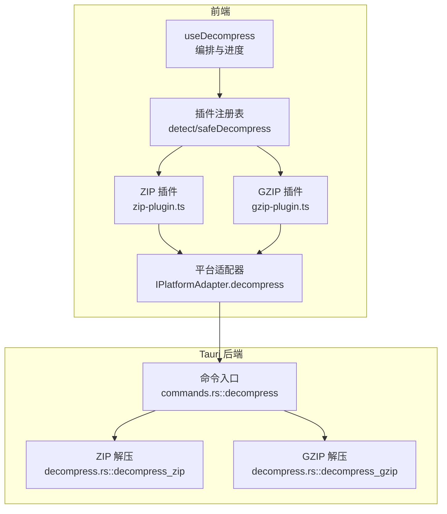
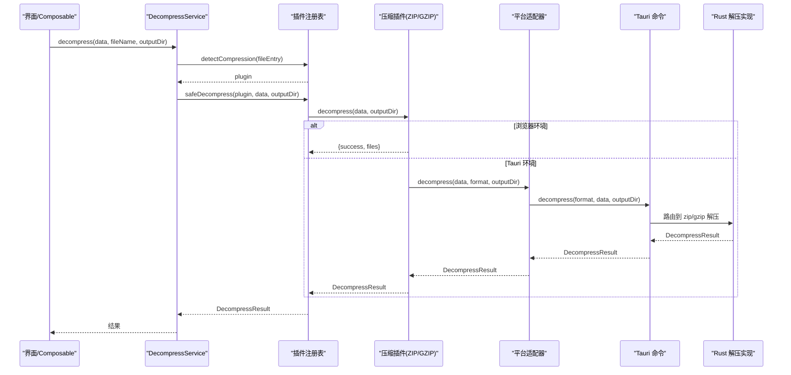
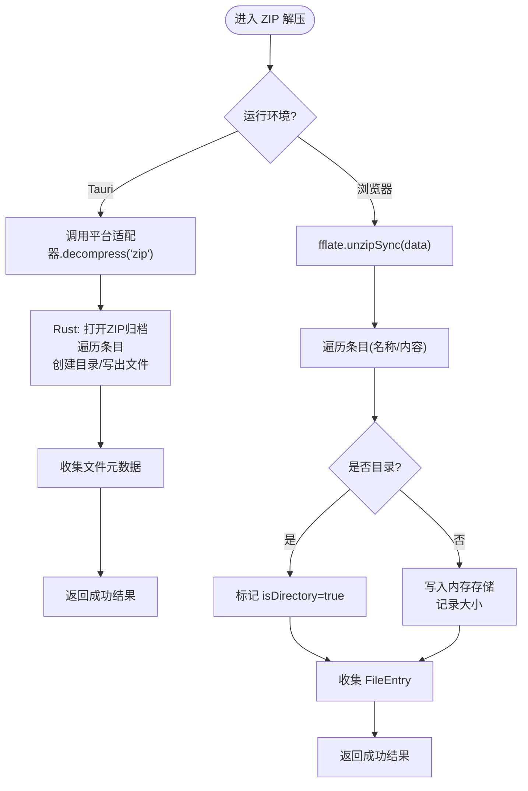
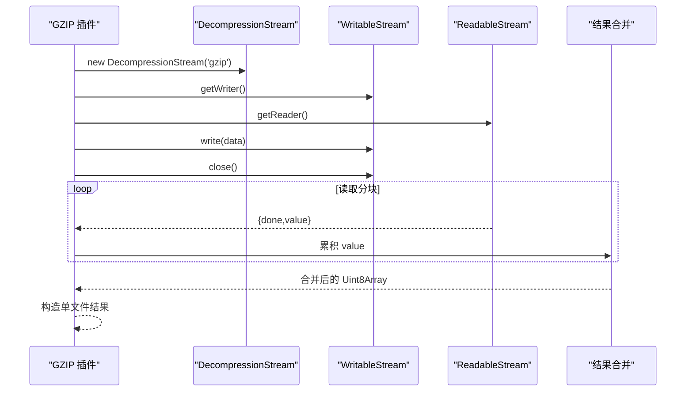
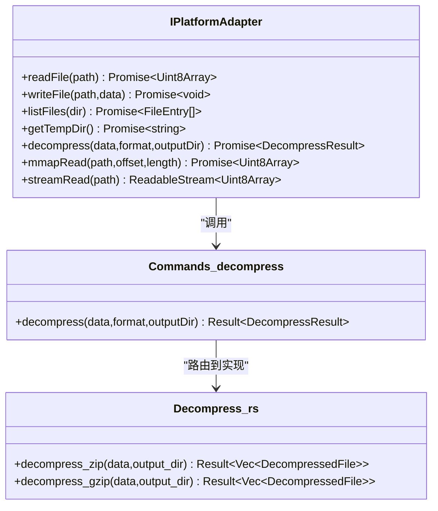
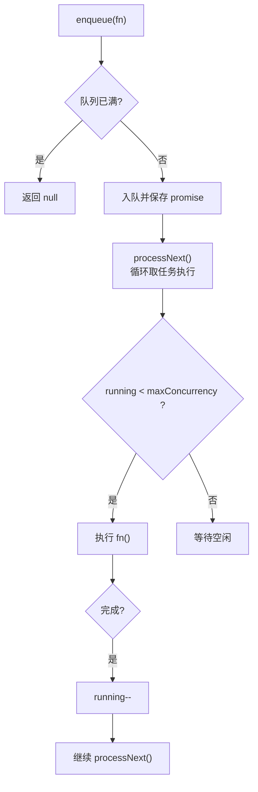
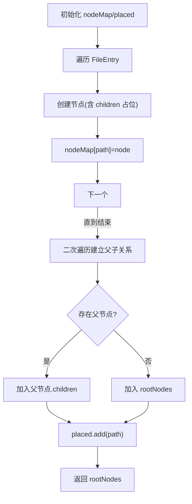
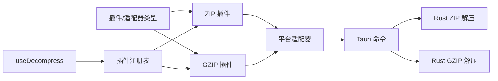

# 压缩处理器

<cite>
**本文引用的文件**   
- [zip-plugin.ts](file://src/plugins/compression/zip-plugin.ts)
- [gzip-plugin.ts](file://src/plugins/compression/gzip-plugin.ts)
- [decompress.rs](file://src-tauri/src/decompress.rs)
- [commands.rs](file://src-tauri/src/commands.rs)
- [types.ts（插件类型）](file://src/plugins/types.ts)
- [types.ts（平台适配器接口）](file://src/adapters/types.ts)
- [use-decompress.ts](file://src/composables/use-decompress.ts)
- [decompress.ts（前端服务）](file://src/core/decompress.ts)
- [task-scheduler.ts](file://src/core/task-scheduler.ts)
- [file-tree.ts](file://src/core/file-tree.ts)
</cite>

## 目录
1. [简介](#简介)
2. [项目结构](#项目结构)
3. [核心组件](#核心组件)
4. [架构总览](#架构总览)
5. [详细组件分析](#详细组件分析)
6. [依赖关系分析](#依赖关系分析)
7. [性能与内存优化](#性能与内存优化)
8. [故障排除指南](#故障排除指南)
9. [结论](#结论)
10. [附录：配置与扩展](#附录配置与扩展)

## 简介
本技术文档聚焦于 Hello-Tauri 的“压缩处理器”子系统，覆盖 ZIP 与 GZIP 两种格式的解压流程、跨平台适配策略、异步任务调度与并发控制、进度跟踪机制、错误恢复策略以及可扩展的插件体系。文档同时提供面向大文件的处理建议、内存使用监控思路、配置项说明与自定义压缩算法的实现指南，并附带实际使用示例与常见问题排查方法。

## 项目结构
压缩处理器由前端插件层、平台适配层与 Tauri 后端实现组成：
- 前端插件层：按格式提供解压能力（ZIP、GZIP），通过统一接口 ICompressionPlugin 暴露。
- 平台适配层：在浏览器环境使用 Web API 或第三方库；在 Tauri 环境调用 Rust 命令执行高性能解压。
- Tauri 后端：基于 zip 与 flate2 库实现 ZIP/GZIP 解压，返回结构化结果。

图表来源
- [use-decompress.ts:1-74](file://src/composables/use-decompress.ts#L1-L74)
- [zip-plugin.ts:1-40](file://src/plugins/compression/zip-plugin.ts#L1-L40)
- [gzip-plugin.ts:1-44](file://src/plugins/compression/gzip-plugin.ts#L1-L44)
- [types.ts（平台适配器接口）:1-12](file://src/adapters/types.ts#L1-L12)
- [commands.rs:37-53](file://src-tauri/src/commands.rs#L37-L53)
- [decompress.rs:23-82](file://src-tauri/src/decompress.rs#L23-L82)

章节来源
- [use-decompress.ts:1-74](file://src/composables/use-decompress.ts#L1-L74)
- [zip-plugin.ts:1-40](file://src/plugins/compression/zip-plugin.ts#L1-L40)
- [gzip-plugin.ts:1-44](file://src/plugins/compression/gzip-plugin.ts#L1-L44)
- [types.ts（插件类型）:16-21](file://src/plugins/types.ts#L16-L21)
- [types.ts（平台适配器接口）:1-12](file://src/adapters/types.ts#L1-L12)
- [commands.rs:37-53](file://src-tauri/src/commands.rs#L37-L53)
- [decompress.rs:23-82](file://src-tauri/src/decompress.rs#L23-L82)

## 核心组件
- 压缩插件接口 ICompressionPlugin：定义 name、supportedExtensions、canHandle、decompress 四个契约，用于统一识别与解压不同格式。
- ZIP 插件：在 Tauri 环境下委托平台适配器；在浏览器环境使用 fflate 进行同步解压，并将结果写入内存存储。
- GZIP 插件：在 Tauri 环境下委托平台适配器；在浏览器环境优先使用原生 DecompressionStream 流式解压，否则降级为失败。
- 平台适配器 IPlatformAdapter：抽象 readFile/writeFile/listFiles/getTempDir/decompress/mmapRead/streamRead 等能力，屏蔽平台差异。
- 命令入口 commands.rs::decompress：根据 format 路由到具体解压函数，统一封装成功/失败结果。
- 解压服务 DecompressService：前端侧的服务类，负责选择插件并委派给注册表的 safeDecompress。
- 任务调度器 TaskScheduler：限制最大并发与队列长度，支持重试与状态查询。
- 文件树构建 FileTreeBuilder：将扁平的文件列表组装为树形结构，便于 UI 展示。

章节来源
- [types.ts（插件类型）:16-21](file://src/plugins/types.ts#L16-L21)
- [zip-plugin.ts:1-40](file://src/plugins/compression/zip-plugin.ts#L1-L40)
- [gzip-plugin.ts:1-44](file://src/plugins/compression/gzip-plugin.ts#L1-L44)
- [types.ts（平台适配器接口）:1-12](file://src/adapters/types.ts#L1-L12)
- [commands.rs:37-53](file://src-tauri/src/commands.rs#L37-L53)
- [decompress.ts（前端服务）:5-26](file://src/core/decompress.ts#L5-L26)
- [task-scheduler.ts:11-79](file://src/core/task-scheduler.ts#L11-L79)
- [file-tree.ts:3-44](file://src/core/file-tree.ts#L3-L44)

## 架构总览
下图展示了从用户触发解压到最终生成文件树的完整链路，包括进度更新、错误处理与平台切换。

图表来源
- [decompress.ts（前端服务）:11-25](file://src/core/decompress.ts#L11-L25)
- [zip-plugin.ts:10-16](file://src/plugins/compression/zip-plugin.ts#L10-L16)
- [gzip-plugin.ts:10-16](file://src/plugins/compression/gzip-plugin.ts#L10-L16)
- [types.ts（平台适配器接口）:8](file://src/adapters/types.ts#L8)
- [commands.rs:37-53](file://src-tauri/src/commands.rs#L37-L53)
- [decompress.rs:23-82](file://src-tauri/src/decompress.rs#L23-L82)

## 详细组件分析

### ZIP 插件：遍历算法、嵌套目录与进度
- 平台分支：当运行在 Tauri 时，直接调用平台适配器的 decompress，由 Rust 端完成解压；在浏览器端则使用 fflate 的 unzipSync 进行同步解压。
- 文件遍历与目录处理：
  - Tauri 路径：Rust 端使用 zip crate 迭代条目，区分目录与文件，递归创建父目录，逐条写出文件，并收集元数据。
  - 浏览器路径：遍历 unzipSync 返回的键值对，以是否以斜杠结尾判断目录，非目录内容写入内存存储，同时构造 FileEntry 列表。
- 进度跟踪：当前 ZIP 插件本身不主动上报进度，进度由上层 useDecompress 在关键阶段更新（如开始、检测插件、完成）。
- 错误处理：浏览器端捕获异常并返回 success=false 及错误信息；Tauri 端由命令入口统一包装为 DecompressResult。

图表来源
- [zip-plugin.ts:10-38](file://src/plugins/compression/zip-plugin.ts#L10-L38)
- [decompress.rs:23-62](file://src-tauri/src/decompress.rs#L23-L62)

章节来源
- [zip-plugin.ts:1-40](file://src/plugins/compression/zip-plugin.ts#L1-L40)
- [decompress.rs:23-62](file://src-tauri/src/decompress.rs#L23-L62)

### GZIP 插件：流式解压、内存管理与错误恢复
- 平台分支：Tauri 环境同样委托平台适配器；浏览器环境优先使用原生 DecompressionStream('gzip') 进行流式解压。
- 流式解压与内存管理：
  - 使用 WritableStream 写入输入数据，ReadableStream 读取分块，逐步累积到 chunks 数组，最后合并为 Uint8Array。
  - 该方式避免一次性加载超大缓冲，但当前实现仍会将所有分块拼接成单一结果，适合中等体积文件。
- 错误恢复：若浏览器不支持 DecompressionStream，则返回失败；Tauri 端由命令入口统一包装错误。
- 输出产物：浏览器端返回一个名为 “decompressed” 的虚拟文件条目；Tauri 端会写到一个固定文件名。

图表来源
- [gzip-plugin.ts:17-42](file://src/plugins/compression/gzip-plugin.ts#L17-L42)

章节来源
- [gzip-plugin.ts:1-44](file://src/plugins/compression/gzip-plugin.ts#L1-L44)

### 平台适配与 Tauri 命令集成
- 平台适配器接口定义了统一的 decompress 方法，接收 data、format、outputDir，返回 DecompressResult。
- Tauri 命令入口 decompress 根据 format 路由到 Rust 的具体实现，统一封装成功/失败结果，确保前后端一致的数据结构。
- 错误传播：Rust 侧 AppError 被转换为字符串消息，包含在 DecompressResult.error 字段中。

图表来源
- [types.ts（平台适配器接口）:1-12](file://src/adapters/types.ts#L1-L12)
- [commands.rs:37-53](file://src-tauri/src/commands.rs#L37-L53)
- [decompress.rs:23-82](file://src-tauri/src/decompress.rs#L23-L82)

章节来源
- [types.ts（平台适配器接口）:1-12](file://src/adapters/types.ts#L1-L12)
- [commands.rs:37-53](file://src-tauri/src/commands.rs#L37-L53)
- [decompress.rs:23-82](file://src-tauri/src/decompress.rs#L23-L82)

### 异步任务调度与并发控制
- 任务调度器 TaskScheduler 维护队列与运行计数，限制最大并发数与队列长度，保证系统稳定。
- useDecompress 使用调度器启动解压任务，并在关键节点更新进度（如 30%、80%、100%）。
- 失败路径：当无匹配插件或任务队列满时，立即标记失败并设置错误信息。

图表来源
- [task-scheduler.ts:23-77](file://src/core/task-scheduler.ts#L23-L77)
- [use-decompress.ts:14-62](file://src/composables/use-decompress.ts#L14-L62)

章节来源
- [task-scheduler.ts:11-79](file://src/core/task-scheduler.ts#L11-L79)
- [use-decompress.ts:1-74](file://src/composables/use-decompress.ts#L1-L74)

### 文件树构建与嵌套目录处理
- FileTreeBuilder 将扁平的 FileEntry 列表构造成树形结构，依据路径分隔符推断父子关系，根节点作为顶层集合。
- 查找与展平：提供静态方法 findNode 与 flattenTree，便于 UI 按需定位与渲染。

图表来源
- [file-tree.ts:7-44](file://src/core/file-tree.ts#L7-L44)

章节来源
- [file-tree.ts:1-69](file://src/core/file-tree.ts#L1-L69)

## 依赖关系分析
- 前端依赖：
  - 插件类型与平台适配器接口定义，确保解耦与可替换性。
  - useDecompress 组合式函数协调任务调度、进度与文件树构建。
  - ZIP/GZIP 插件分别依赖 fflate 与浏览器原生流 API。
- 后端依赖：
  - Tauri 命令集中暴露文件系统与解压能力。
  - Rust 实现依赖 zip 与 flate2 库完成高效解压。

图表来源
- [types.ts（插件类型）:16-21](file://src/plugins/types.ts#L16-L21)
- [types.ts（平台适配器接口）:1-12](file://src/adapters/types.ts#L1-L12)
- [zip-plugin.ts:10-16](file://src/plugins/compression/zip-plugin.ts#L10-L16)
- [gzip-plugin.ts:10-16](file://src/plugins/compression/gzip-plugin.ts#L10-L16)
- [commands.rs:37-53](file://src-tauri/src/commands.rs#L37-L53)
- [decompress.rs:23-82](file://src-tauri/src/decompress.rs#L23-L82)

章节来源
- [types.ts（插件类型）:16-21](file://src/plugins/types.ts#L16-L21)
- [types.ts（平台适配器接口）:1-12](file://src/adapters/types.ts#L1-L12)
- [zip-plugin.ts:1-40](file://src/plugins/compression/zip-plugin.ts#L1-L40)
- [gzip-plugin.ts:1-44](file://src/plugins/compression/gzip-plugin.ts#L1-L44)
- [commands.rs:37-53](file://src-tauri/src/commands.rs#L37-L53)
- [decompress.rs:23-82](file://src-tauri/src/decompress.rs#L23-L82)

## 性能与内存优化
- 大文件处理策略
  - 优先使用 Tauri 后端进行解压，避免在前端内存中复制大量数据。
  - 浏览器端 GZIP 已采用流式解压，但仍需将分块合并为单一结果；对于超大数据，建议在后端拆分输出为多个文件或流式下载。
- 内存使用监控
  - 可在 useDecompress 中累计 result.files 的 size 总和，结合浏览器 Performance API 或 Node/Tauri 进程内存指标进行监控。
  - 针对 ZIP 浏览器路径，注意 fflate 同步解压可能占用较多堆内存，应限制文件大小阈值。
- 并发与吞吐
  - 合理调整 TaskScheduler 的最大并发数与队列长度，平衡 CPU 与 I/O 压力。
  - 对多包批量解压场景，建议分批提交任务，避免瞬时峰值。
- I/O 优化
  - 利用 Tauri 的 mmap_read 与 list_files 进行快速扫描与随机访问，减少重复 IO。
  - 输出目录预创建与父目录批量创建可减少系统调用次数。

[本节为通用指导，无需特定文件引用]

## 故障排除指南
- 常见错误与定位
  - 未找到匹配的压缩插件：检查文件名后缀是否在 supportedExtensions 中，确认 canHandle 逻辑正确。
  - 任务队列已满：增大 TaskScheduler 的 maxQueueSize 或降低并发任务数量。
  - 浏览器不支持 GZIP 解压：确认浏览器版本是否支持 DecompressionStream，必要时回退到 Tauri 后端。
  - 路径遍历防护：Tauri 命令对包含 ".." 的路径拒绝访问，确保传入路径合法。
- 调试建议
  - 在 useDecompress 的关键阶段打印进度与错误信息，快速定位失败点。
  - 在 Rust 侧查看 AppError 的详细信息，辅助定位底层 IO 或解码错误。

章节来源
- [use-decompress.ts:28-62](file://src/composables/use-decompress.ts#L28-L62)
- [task-scheduler.ts:23-37](file://src/core/task-scheduler.ts#L23-L37)
- [gzip-plugin.ts:40-42](file://src/plugins/compression/gzip-plugin.ts#L40-L42)
- [commands.rs:6-14](file://src-tauri/src/commands.rs#L6-L14)

## 结论
压缩处理器通过清晰的插件化设计与跨平台适配，实现了 ZIP 与 GZIP 的高效解压。Tauri 后端承担重计算与 I/O 密集任务，前端负责编排、进度与可视化。配合任务调度与文件树构建，整体具备良好的可扩展性与用户体验。未来可进一步引入流式输出、增量解压与更细粒度的进度回调，以提升大文件处理能力。

[本节为总结，无需特定文件引用]

## 附录：配置与扩展

### 支持的压缩格式
- ZIP：.zip
- GZIP：.gz、.gzip、.tgz

章节来源
- [zip-plugin.ts:5-6](file://src/plugins/compression/zip-plugin.ts#L5-L6)
- [gzip-plugin.ts:5-6](file://src/plugins/compression/gzip-plugin.ts#L5-L6)

### 配置选项
- 任务调度器
  - maxConcurrency：最大并发任务数，默认 3。
  - maxQueueSize：最大排队任务数，默认 100。
- 输出目录：由上层传入，Tauri 端会在该目录下创建子目录与文件。

章节来源
- [task-scheduler.ts:18-21](file://src/core/task-scheduler.ts#L18-L21)
- [use-decompress.ts:14-20](file://src/composables/use-decompress.ts#L14-L20)

### 扩展接口与自定义压缩算法
- 新增压缩格式步骤
  - 实现 ICompressionPlugin 接口，声明 supportedExtensions 与 canHandle 逻辑。
  - 在浏览器端可选择使用 fflate 或原生流 API；在 Tauri 端委托平台适配器，并在 Rust 侧添加对应解压实现与命令路由。
  - 在注册表中注册新插件，使 useDecompress 能自动发现与调用。
- 参考实现位置
  - 插件接口定义：参见 [types.ts（插件类型）:16-21](file://src/plugins/types.ts#L16-L21)。
  - ZIP 插件实现：参见 [zip-plugin.ts:1-40](file://src/plugins/compression/zip-plugin.ts#L1-L40)。
  - GZIP 插件实现：参见 [gzip-plugin.ts:1-44](file://src/plugins/compression/gzip-plugin.ts#L1-L44)。
  - Tauri 命令路由：参见 [commands.rs:37-53](file://src-tauri/src/commands.rs#L37-L53)。
  - Rust 解压实现：参见 [decompress.rs:23-82](file://src-tauri/src/decompress.rs#L23-L82)。

### 实际使用示例
- 单个压缩包解压
  - 调用 useDecompress.startDecompress(archiveItem)，内部会读取 ArrayBuffer、检测插件、执行解压、构建文件树并更新进度。
- 批量解压
  - 调用 useDecompress.decompressAll，遍历待处理的归档并逐个入队。
- 参考路径
  - [use-decompress.ts:14-70](file://src/composables/use-decompress.ts#L14-L70)

章节来源
- [use-decompress.ts:14-70](file://src/composables/use-decompress.ts#L14-L70)