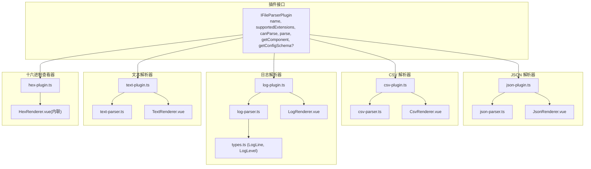
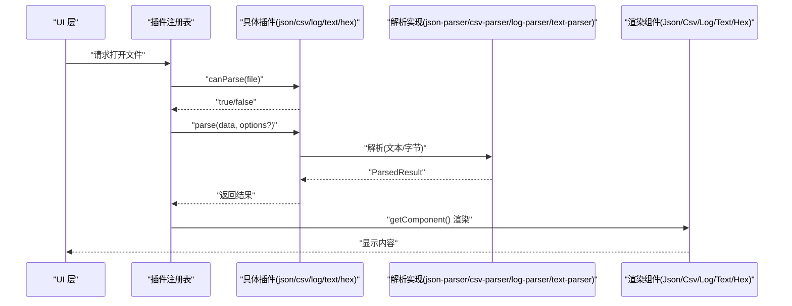
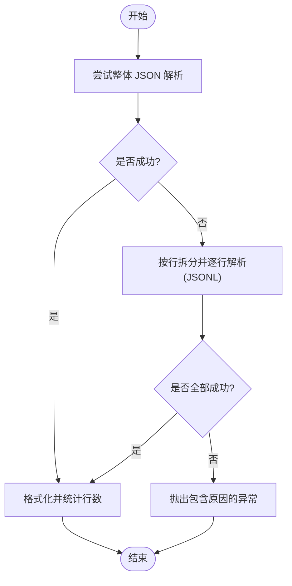
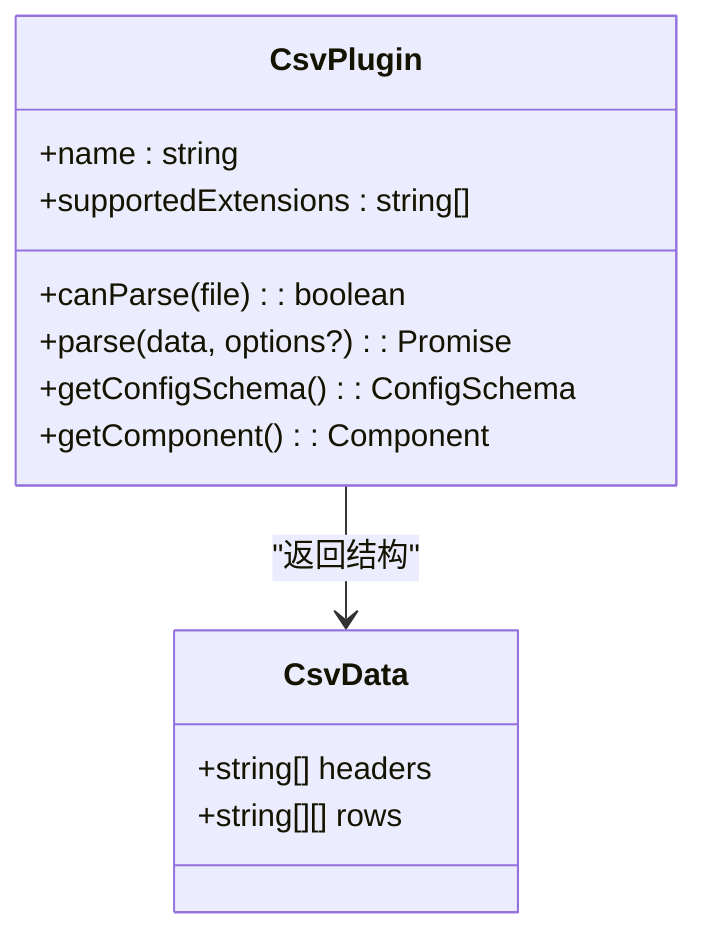
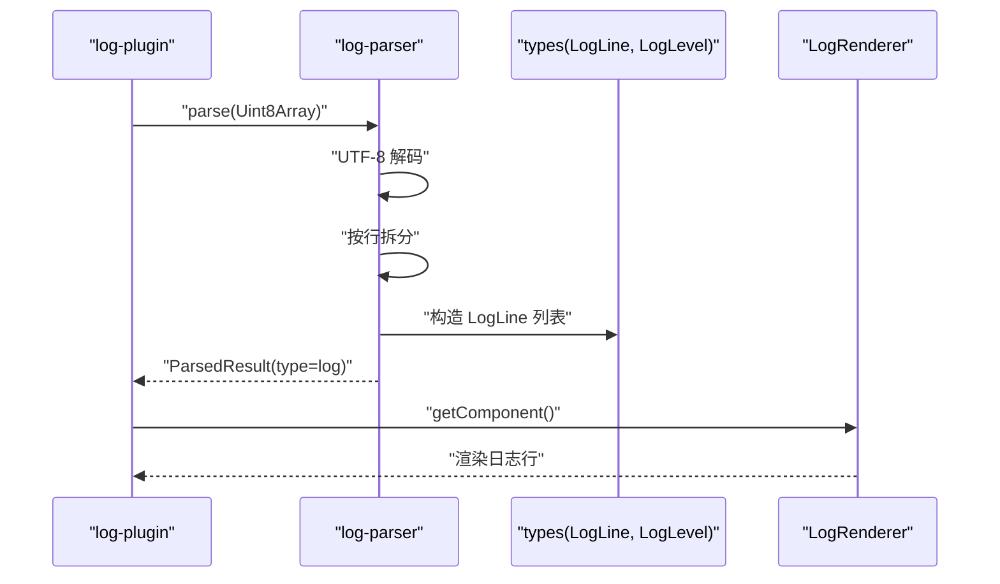
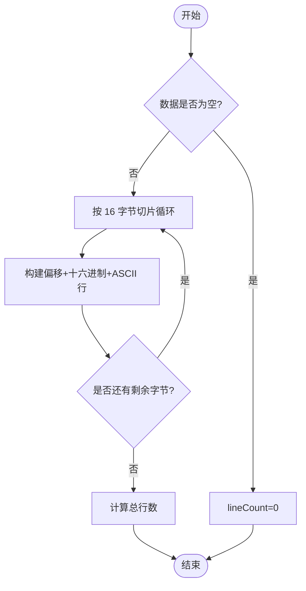
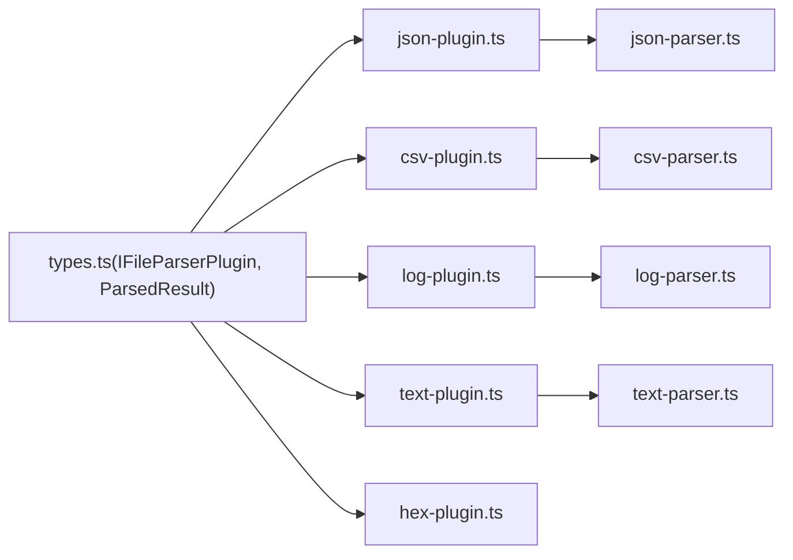

# 解析器插件

<cite>
**本文引用的文件**   
- [src/plugins/parsers/json-parser.ts](file://src/plugins/parsers/json-parser.ts)
- [src/plugins/parsers/csv-parser.ts](file://src/plugins/parsers/csv-parser.ts)
- [src/plugins/parsers/log-parser.ts](file://src/plugins/parsers/log-parser.ts)
- [src/plugins/parsers/text-parser.ts](file://src/plugins/parsers/text-parser.ts)
- [src/plugins/parsers/types.ts](file://src/plugins/parsers/types.ts)
- [src/plugins/parser/json-plugin.ts](file://src/plugins/parser/json-plugin.ts)
- [src/plugins/parser/csv-plugin.ts](file://src/plugins/parser/csv-plugin.ts)
- [src/plugins/parser/log-plugin.ts](file://src/plugins/parser/log-plugin.ts)
- [src/plugins/parser/text-plugin.ts](file://src/plugins/parser/text-plugin.ts)
- [src/plugins/parser/hex-plugin.ts](file://src/plugins/parser/hex-plugin.ts)
- [src/plugins/types.ts](file://src/plugins/types.ts)
- [src/__tests__/plugins/parsers/json-parser.test.ts](file://src/__tests__/plugins/parsers/json-parser.test.ts)
- [src/__tests__/plugins/parsers/csv-parser.test.ts](file://src/__tests__/plugins/parsers/csv-parser.test.ts)
- [src/__tests__/plugins/parsers/log-parser.test.ts](file://src/__tests__/plugins/parsers/log-parser.test.ts)
- [src/__tests__/plugins/hex-plugin.test.ts](file://src/__tests__/plugins/hex-plugin.test.ts)
</cite>

## 目录
1. [简介](#简介)
2. [项目结构](#项目结构)
3. [核心组件](#核心组件)
4. [架构总览](#架构总览)
5. [详细组件分析](#详细组件分析)
6. [依赖关系分析](#依赖关系分析)
7. [性能考量](#性能考量)
8. [故障排查指南](#故障排查指南)
9. [结论](#结论)
10. [附录](#附录)

## 简介
本技术文档聚焦 Hello-Tauri 的“解析器插件”体系，覆盖 JSON、CSV、日志、文本与十六进制查看器等五大解析器。文档从结构化数据处理、错误恢复、流式读取、类型推断、多格式识别、时间戳提取与过滤、二进制数据格式化、内存映射与实时搜索等维度进行深入剖析，并提供配置选项、性能特征、错误处理模式与最佳实践建议，辅以具体代码示例路径和使用场景说明，帮助读者快速理解并高效使用各解析器。

## 项目结构
解析器插件采用“插件接口 + 解析实现 + 渲染组件”的分层组织方式：
- 插件接口定义统一能力契约（名称、扩展名匹配、解析入口、渲染组件、可选配置模式）。
- 解析实现负责将原始字节或文本转换为结构化数据，输出统一的 ParsedResult。
- 渲染组件负责在 UI 中展示解析结果（如表格、树形结构、日志行视图、十六进制转储等）。

图表来源
- [src/plugins/types.ts:23-30](file://src/plugins/types.ts#L23-L30)
- [src/plugins/parser/json-plugin.ts:1-19](file://src/plugins/parser/json-plugin.ts#L1-L19)
- [src/plugins/parsers/json-parser.ts:1-17](file://src/plugins/parsers/json-parser.ts#L1-L17)
- [src/plugins/parser/csv-plugin.ts:1-28](file://src/plugins/parser/csv-plugin.ts#L1-L28)
- [src/plugins/parsers/csv-parser.ts:1-17](file://src/plugins/parsers/csv-parser.ts#L1-L17)
- [src/plugins/parser/log-plugin.ts:1-18](file://src/plugins/parser/log-plugin.ts#L1-L18)
- [src/plugins/parsers/log-parser.ts:1-37](file://src/plugins/parsers/log-parser.ts#L1-L37)
- [src/plugins/parsers/types.ts:1-11](file://src/plugins/parsers/types.ts#L1-L11)
- [src/plugins/parser/text-plugin.ts:1-18](file://src/plugins/parser/text-plugin.ts#L1-L18)
- [src/plugins/parsers/text-parser.ts:1-8](file://src/plugins/parsers/text-parser.ts#L1-L8)
- [src/plugins/parser/hex-plugin.ts:1-53](file://src/plugins/parser/hex-plugin.ts#L1-L53)

章节来源
- [src/plugins/types.ts:23-30](file://src/plugins/types.ts#L23-L30)
- [src/plugins/parser/json-plugin.ts:1-19](file://src/plugins/parser/json-plugin.ts#L1-L19)
- [src/plugins/parser/csv-plugin.ts:1-28](file://src/plugins/parser/csv-plugin.ts#L1-L28)
- [src/plugins/parser/log-plugin.ts:1-18](file://src/plugins/parser/log-plugin.ts#L1-L18)
- [src/plugins/parser/text-plugin.ts:1-18](file://src/plugins/parser/text-plugin.ts#L1-L18)
- [src/plugins/parser/hex-plugin.ts:1-53](file://src/plugins/parser/hex-plugin.ts#L1-L53)

## 核心组件
- 插件接口 IFileParserPlugin：统一描述解析器的能力边界与生命周期方法，包括扩展名匹配、解析入口、渲染组件提供以及可选的配置模式。
- 解析结果 ParsedResult：所有解析器输出的统一数据结构，包含 type、data 与可选 lineCount，便于上层统一消费。
- 日志类型 LogLine/LogLevel：为日志解析器提供强类型字段，确保时间戳、级别、模块、消息与原始行的完整性。

章节来源
- [src/plugins/types.ts:23-30](file://src/plugins/types.ts#L23-L30)
- [src/plugins/types.ts:32-36](file://src/plugins/types.ts#L32-L36)
- [src/plugins/parsers/types.ts:1-11](file://src/plugins/parsers/types.ts#L1-L11)

## 架构总览
下图展示了从文件到解析再到渲染的关键调用链，体现插件如何根据扩展名选择对应解析器，并将原始字节解码后交由解析实现生成结构化数据，最终由渲染组件呈现。

图表来源
- [src/plugins/parser/json-plugin.ts:1-19](file://src/plugins/parser/json-plugin.ts#L1-L19)
- [src/plugins/parser/csv-plugin.ts:1-28](file://src/plugins/parser/csv-plugin.ts#L1-L28)
- [src/plugins/parser/log-plugin.ts:1-18](file://src/plugins/parser/log-plugin.ts#L1-L18)
- [src/plugins/parser/text-plugin.ts:1-18](file://src/plugins/parser/text-plugin.ts#L1-L18)
- [src/plugins/parser/hex-plugin.ts:1-53](file://src/plugins/parser/hex-plugin.ts#L1-L53)

## 详细组件分析

### JSON 解析器
- 功能要点
  - 支持标准 JSON 对象与数组。
  - 具备 JSONL（换行分隔对象）回退解析能力：当整体 JSON 解析失败时，尝试按行拆分并逐行解析。
  - 输出包含美化后的行数统计，便于 UI 展示。
- 错误恢复机制
  - 先尝试整体 JSON.parse；若失败则进入 JSONL 模式；若仍失败则抛出包含原因的异常，便于上层捕获与提示。
- 配置选项
  - 无显式配置项；通过插件扩展名 .json/.jsonl 自动匹配。
- 性能特征
  - 对大 JSON 对象进行字符串化以计算行数，可能带来额外开销；对于超大对象可考虑延迟计算行数或在 UI 侧分页。
- 错误处理模式
  - 抛出带上下文的错误信息，便于定位非法 JSON 的具体原因。
- 最佳实践
  - 优先使用标准 JSON；当需要流式追加写入时使用 JSONL 格式以获得更好的容错性。
- 使用场景
  - 配置文件、API 响应、结构化数据的预览与编辑。
- 代码示例路径
  - [解析函数实现:1-17](file://src/plugins/parsers/json-parser.ts#L1-L17)
  - [插件封装与渲染绑定:1-19](file://src/plugins/parser/json-plugin.ts#L1-L19)
  - [单元测试用例:1-41](file://src/__tests__/plugins/parsers/json-parser.test.ts#L1-L41)

图表来源
- [src/plugins/parsers/json-parser.ts:1-17](file://src/plugins/parsers/json-parser.ts#L1-L17)

章节来源
- [src/plugins/parsers/json-parser.ts:1-17](file://src/plugins/parsers/json-parser.ts#L1-L17)
- [src/plugins/parser/json-plugin.ts:1-19](file://src/plugins/parser/json-plugin.ts#L1-L19)
- [src/__tests__/plugins/parsers/json-parser.test.ts:1-41](file://src/__tests__/plugins/parsers/json-parser.test.ts#L1-L41)

### CSV 解析器
- 功能要点
  - 基于分隔符（默认逗号）解析首行为表头，后续行为数据行。
  - 支持自定义分隔符（例如制表符），适配 TSV 等多格式。
  - 自动过滤空行，提升鲁棒性。
- 类型推断
  - 当前实现保留字符串类型；如需数值/布尔推断可在上层或渲染阶段进行。
- 流式读取
  - 当前实现一次性加载文本并按行分割；对于超大文件建议在插件层引入分块读取与增量解析策略。
- 配置选项
  - 分隔符 delimiter（输入框）、固定表头 fixedHeader（开关），由插件提供配置模式。
- 性能特征
  - 简单字符串分割，时间复杂度 O(n)，空间复杂度取决于行数与列数；适合中小规模数据集。
- 错误处理模式
  - 空文本返回空结构，避免上层出现未定义访问。
- 最佳实践
  - 对含引号与转义字符的复杂 CSV，建议使用更健壮的解析库；当前实现适用于规范化的 CSV/TSV。
- 使用场景
  - 数据报表、导出表格、批量导入前的预览与校验。
- 代码示例路径
  - [解析函数实现:1-17](file://src/plugins/parsers/csv-parser.ts#L1-L17)
  - [插件封装与配置模式:1-28](file://src/plugins/parser/csv-plugin.ts#L1-L28)
  - [单元测试用例:1-35](file://src/__tests__/plugins/parsers/csv-parser.test.ts#L1-L35)

图表来源
- [src/plugins/parsers/csv-parser.ts:1-17](file://src/plugins/parsers/csv-parser.ts#L1-L17)
- [src/plugins/parser/csv-plugin.ts:1-28](file://src/plugins/parser/csv-plugin.ts#L1-L28)

章节来源
- [src/plugins/parsers/csv-parser.ts:1-17](file://src/plugins/parsers/csv-parser.ts#L1-L17)
- [src/plugins/parser/csv-plugin.ts:1-28](file://src/plugins/parser/csv-plugin.ts#L1-L28)
- [src/__tests__/plugins/parsers/csv-parser.test.ts:1-35](file://src/__tests__/plugins/parsers/csv-parser.test.ts#L1-L35)

### 日志解析器
- 功能要点
  - 多格式识别：通过正则表达式匹配时间戳、日志级别、模块与消息。
  - 时间戳提取：严格匹配“YYYY-MM-DD HH:mm:ss”格式。
  - 级别归一化：仅 INFO/DEBUG/WARN/ERROR 为标准级别，其他归为 OTHER。
  - 非匹配行保留 raw 字段，便于调试与回溯。
- 过滤功能
  - 上层可通过 level、module、timestamp 等字段进行筛选与高亮。
- 编码检测
  - 当前实现使用 UTF-8 解码；如需多编码检测可在插件层增加 BOM 与编码探测逻辑。
- 性能特征
  - 单遍扫描，正则匹配每行；对大日志文件建议结合分页与虚拟滚动。
- 错误处理模式
  - 不抛错，非匹配行以 OTHER 级别记录，保证解析连续性。
- 最佳实践
  - 约定一致的日志格式以提升识别率；对混合格式日志可在上层做二次分类。
- 使用场景
  - 应用运行日志、服务错误追踪、审计日志分析。
- 代码示例路径
  - [解析函数实现:1-37](file://src/plugins/parsers/log-parser.ts#L1-L37)
  - [日志类型定义:1-11](file://src/plugins/parsers/types.ts#L1-L11)
  - [插件封装与渲染绑定:1-18](file://src/plugins/parser/log-plugin.ts#L1-L18)
  - [单元测试用例:1-58](file://src/__tests__/plugins/parsers/log-parser.test.ts#L1-L58)

图表来源
- [src/plugins/parser/log-plugin.ts:1-18](file://src/plugins/parser/log-plugin.ts#L1-L18)
- [src/plugins/parsers/log-parser.ts:1-37](file://src/plugins/parsers/log-parser.ts#L1-L37)
- [src/plugins/parsers/types.ts:1-11](file://src/plugins/parsers/types.ts#L1-L11)

章节来源
- [src/plugins/parsers/log-parser.ts:1-37](file://src/plugins/parsers/log-parser.ts#L1-L37)
- [src/plugins/parsers/types.ts:1-11](file://src/plugins/parsers/types.ts#L1-L11)
- [src/plugins/parser/log-plugin.ts:1-18](file://src/plugins/parser/log-plugin.ts#L1-L18)
- [src/__tests__/plugins/parsers/log-parser.test.ts:1-58](file://src/__tests__/plugins/parsers/log-parser.test.ts#L1-L58)

### 文本解析器
- 功能要点
  - 通用文本预览，UTF-8 解码，统计行数。
- 编码检测
  - 当前实现仅支持 UTF-8；如需多编码检测可在插件层增加 BOM 判断与编码探测。
- 性能特征
  - 轻量级解码与计数，适合大多数文本文件；超大文件建议分页或懒加载。
- 错误处理模式
  - 空文本返回零行数，避免上层异常。
- 最佳实践
  - 对非 UTF-8 文本，建议在插件层增加编码探测与用户提示。
- 使用场景
  - 源码、配置文件、Markdown 文档等纯文本预览。
- 代码示例路径
  - [解析函数实现:1-8](file://src/plugins/parsers/text-parser.ts#L1-L8)
  - [插件封装与渲染绑定:1-18](file://src/plugins/parser/text-plugin.ts#L1-L18)

章节来源
- [src/plugins/parsers/text-parser.ts:1-8](file://src/plugins/parsers/text-parser.ts#L1-L8)
- [src/plugins/parser/text-plugin.ts:1-18](file://src/plugins/parser/text-plugin.ts#L1-L18)

### 十六进制查看器
- 功能要点
  - 二进制数据格式化：每行 16 字节，左侧偏移量（十六进制），中间为十六进制表示，右侧为 ASCII 可读字符。
  - 作为兜底解析器：canParse 始终返回 true，用于无法识别的二进制文件。
- 内存映射技术
  - 当前实现直接操作 Uint8Array；对于超大文件可考虑在插件层引入分块读取与虚拟滚动，以降低内存占用。
- 实时搜索实现
  - 可在渲染层实现基于偏移量与内容的实时搜索与高亮，提升交互体验。
- 性能特征
  - 线性遍历与字符串拼接，适合中等大小二进制文件；超大文件需分页渲染。
- 错误处理模式
  - 空数据返回零行数，避免渲染异常。
- 最佳实践
  - 对超大二进制文件启用分页与按需渲染；搜索时限制范围与频率，避免阻塞主线程。
- 使用场景
  - 二进制文件查看、协议报文分析、资源文件调试。
- 代码示例路径
  - [插件实现与渲染组件:1-53](file://src/plugins/parser/hex-plugin.ts#L1-L53)
  - [单元测试用例:1-29](file://src/__tests__/plugins/hex-plugin.test.ts#L1-L29)

图表来源
- [src/plugins/parser/hex-plugin.ts:1-53](file://src/plugins/parser/hex-plugin.ts#L1-L53)

章节来源
- [src/plugins/parser/hex-plugin.ts:1-53](file://src/plugins/parser/hex-plugin.ts#L1-L53)
- [src/__tests__/plugins/hex-plugin.test.ts:1-29](file://src/__tests__/plugins/hex-plugin.test.ts#L1-L29)

## 依赖关系分析
- 插件与解析实现的耦合
  - 每个插件仅依赖对应的解析实现与渲染组件，职责清晰，耦合度低。
- 类型契约
  - IFileParserPlugin 与 ParsedResult 构成稳定契约，便于扩展新解析器。
- 外部依赖
  - Vue 组件用于渲染；浏览器 API（TextDecoder/TextEncoder）用于编解码。

图表来源
- [src/plugins/types.ts:23-36](file://src/plugins/types.ts#L23-L36)
- [src/plugins/parser/json-plugin.ts:1-19](file://src/plugins/parser/json-plugin.ts#L1-L19)
- [src/plugins/parser/csv-plugin.ts:1-28](file://src/plugins/parser/csv-plugin.ts#L1-L28)
- [src/plugins/parser/log-plugin.ts:1-18](file://src/plugins/parser/log-plugin.ts#L1-L18)
- [src/plugins/parser/text-plugin.ts:1-18](file://src/plugins/parser/text-plugin.ts#L1-L18)
- [src/plugins/parser/hex-plugin.ts:1-53](file://src/plugins/parser/hex-plugin.ts#L1-L53)
- [src/plugins/parsers/json-parser.ts:1-17](file://src/plugins/parsers/json-parser.ts#L1-L17)
- [src/plugins/parsers/csv-parser.ts:1-17](file://src/plugins/parsers/csv-parser.ts#L1-L17)
- [src/plugins/parsers/log-parser.ts:1-37](file://src/plugins/parsers/log-parser.ts#L1-L37)
- [src/plugins/parsers/text-parser.ts:1-8](file://src/plugins/parsers/text-parser.ts#L1-L8)

章节来源
- [src/plugins/types.ts:23-36](file://src/plugins/types.ts#L23-L36)
- [src/plugins/parser/json-plugin.ts:1-19](file://src/plugins/parser/json-plugin.ts#L1-L19)
- [src/plugins/parser/csv-plugin.ts:1-28](file://src/plugins/parser/csv-plugin.ts#L1-L28)
- [src/plugins/parser/log-plugin.ts:1-18](file://src/plugins/parser/log-plugin.ts#L1-L18)
- [src/plugins/parser/text-plugin.ts:1-18](file://src/plugins/parser/text-plugin.ts#L1-L18)
- [src/plugins/parser/hex-plugin.ts:1-53](file://src/plugins/parser/hex-plugin.ts#L1-L53)

## 性能考量
- JSON 解析器
  - 大对象美化与行数统计可能带来额外 CPU 与内存开销；建议对超大对象延迟计算行数或采用流式解析。
- CSV 解析器
  - 当前为全量加载与分割；对大数据集建议引入分块读取与增量解析，并在 UI 侧使用虚拟滚动。
- 日志解析器
  - 正则匹配每行，时间复杂度 O(n)；对超大日志文件建议分页加载与按需渲染。
- 文本解析器
  - 轻量解码与计数；对超大文本建议分页与懒加载。
- 十六进制查看器
  - 线性遍历与字符串拼接；对超大二进制文件建议分块渲染与搜索节流。

[本节为通用性能指导，无需特定文件引用]

## 故障排查指南
- JSON 解析失败
  - 现象：抛出包含“Invalid JSON”的错误信息。
  - 排查：检查 JSON 语法或使用 JSONL 回退；参考测试用例验证边界情况。
  - 参考路径：[错误抛出与回退逻辑:1-17](file://src/plugins/parsers/json-parser.ts#L1-L17)、[相关测试:1-41](file://src/__tests__/plugins/parsers/json-parser.test.ts#L1-L41)
- CSV 解析异常
  - 现象：表头或数据行缺失、分隔符不匹配。
  - 排查：确认分隔符配置；检查空行与转义字符；参考测试用例。
  - 参考路径：[解析实现:1-17](file://src/plugins/parsers/csv-parser.ts#L1-L17)、[相关测试:1-35](file://src/__tests__/plugins/parsers/csv-parser.test.ts#L1-L35)
- 日志解析不匹配
  - 现象：行级别为 OTHER、时间戳为空。
  - 排查：确认日志格式是否符合正则；必要时调整正则或在上层做二次分类。
  - 参考路径：[解析实现:1-37](file://src/plugins/parsers/log-parser.ts#L1-L37)、[相关测试:1-58](file://src/__tests__/plugins/parsers/log-parser.test.ts#L1-L58)
- 十六进制查看器空白
  - 现象：lineCount 为 0。
  - 排查：确认输入数据是否为空；参考测试用例。
  - 参考路径：[插件实现:1-53](file://src/plugins/parser/hex-plugin.ts#L1-L53)、[相关测试:1-29](file://src/__tests__/plugins/hex-plugin.test.ts#L1-L29)

章节来源
- [src/plugins/parsers/json-parser.ts:1-17](file://src/plugins/parsers/json-parser.ts#L1-L17)
- [src/__tests__/plugins/parsers/json-parser.test.ts:1-41](file://src/__tests__/plugins/parsers/json-parser.test.ts#L1-L41)
- [src/plugins/parsers/csv-parser.ts:1-17](file://src/plugins/parsers/csv-parser.ts#L1-L17)
- [src/__tests__/plugins/parsers/csv-parser.test.ts:1-35](file://src/__tests__/plugins/parsers/csv-parser.test.ts#L1-L35)
- [src/plugins/parsers/log-parser.ts:1-37](file://src/plugins/parsers/log-parser.ts#L1-L37)
- [src/__tests__/plugins/parsers/log-parser.test.ts:1-58](file://src/__tests__/plugins/parsers/log-parser.test.ts#L1-L58)
- [src/plugins/parser/hex-plugin.ts:1-53](file://src/plugins/parser/hex-plugin.ts#L1-L53)
- [src/__tests__/plugins/hex-plugin.test.ts:1-29](file://src/__tests__/plugins/hex-plugin.test.ts#L1-L29)

## 结论
Hello-Tauri 的解析器插件体系以清晰的接口契约与模块化实现，提供了 JSON、CSV、日志、文本与十六进制查看器的完整能力。各解析器在错误恢复、类型安全与渲染集成方面表现稳健。针对大文件与复杂格式，建议在插件层引入分块读取、虚拟滚动与搜索节流等优化策略，进一步提升用户体验与系统性能。

[本节为总结性内容，无需特定文件引用]

## 附录
- 配置选项汇总
  - CSV 插件
    - delimiter：分隔符（输入框，默认逗号）
    - fixedHeader：固定表头（开关，默认开启）
  - 其他插件
    - 当前未暴露显式配置项，可通过扩展名匹配与默认行为控制。
- 使用场景建议
  - JSON：结构化数据预览与编辑；JSONL 适合追加写入与容错。
  - CSV：报表与导出数据预览；注意分隔符与转义字符。
  - 日志：统一格式日志的分析与过滤；非匹配行保留原始内容。
  - 文本：源码与配置文件预览；必要时增加编码检测。
  - 十六进制：二进制文件调试与报文分析；对大文件启用分页与搜索节流。

[本节为补充信息，无需特定文件引用]