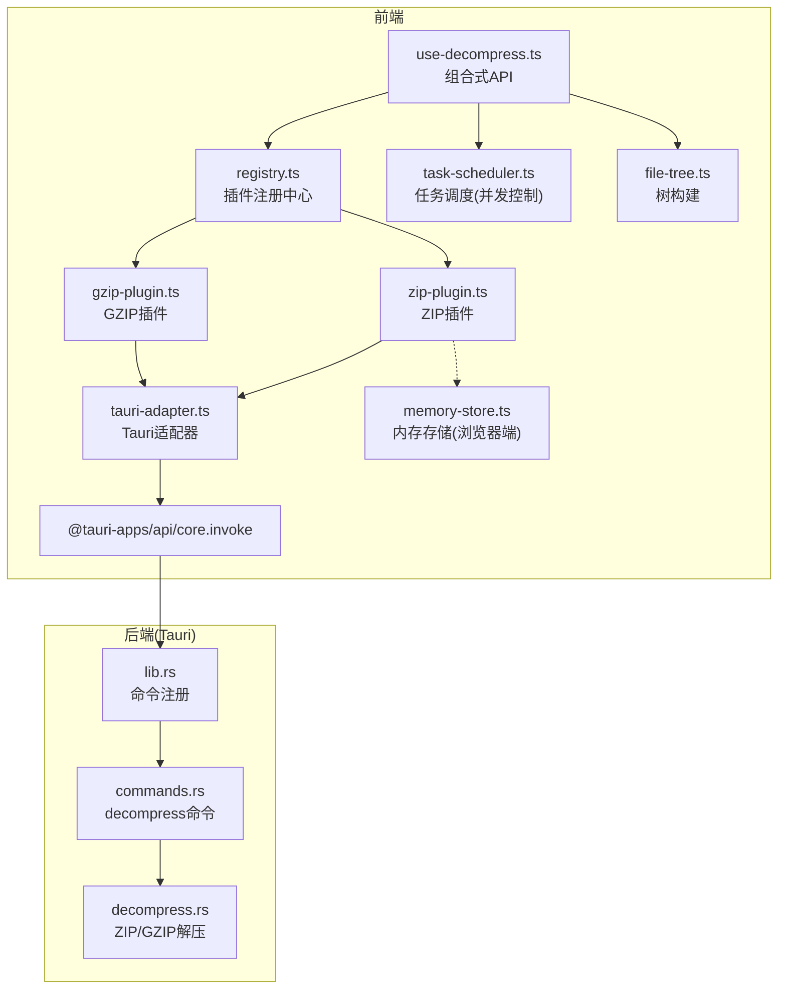
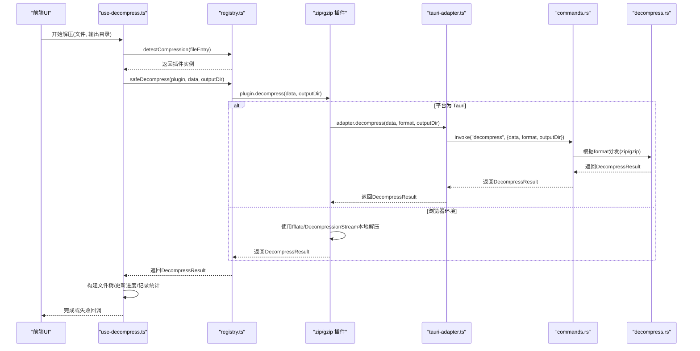
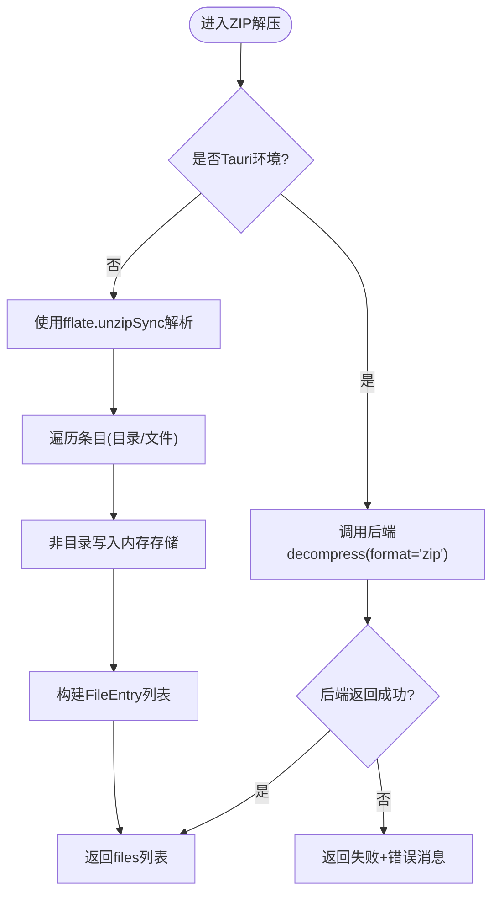
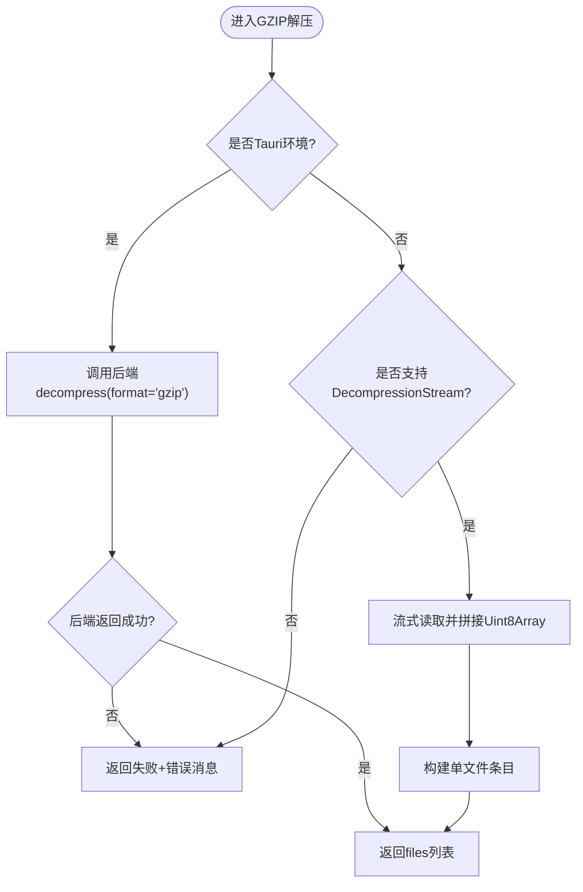
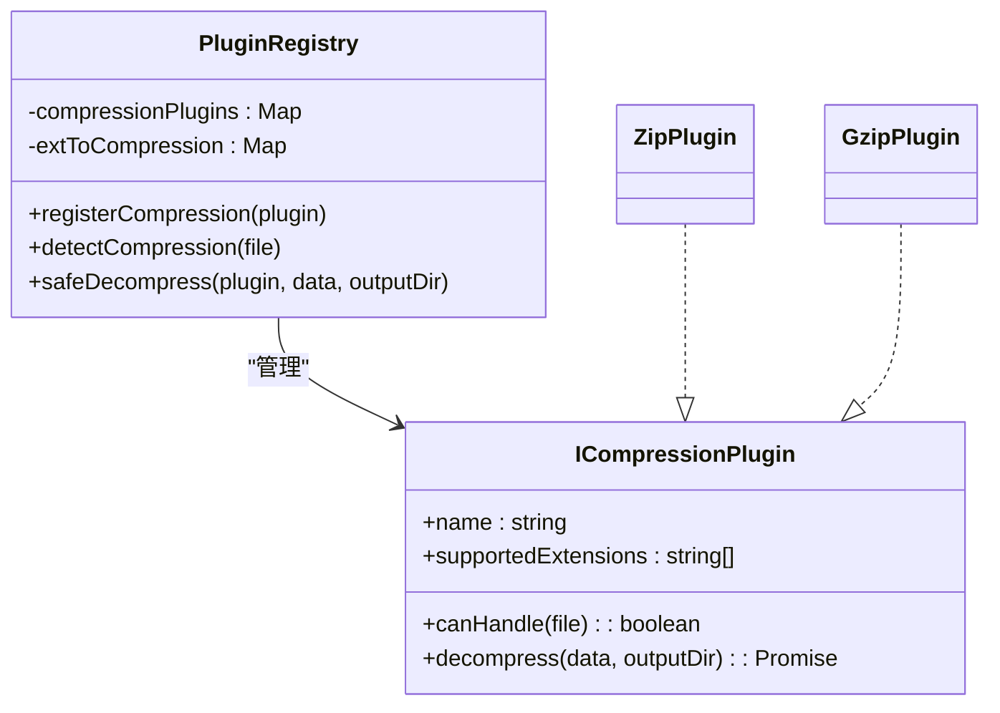
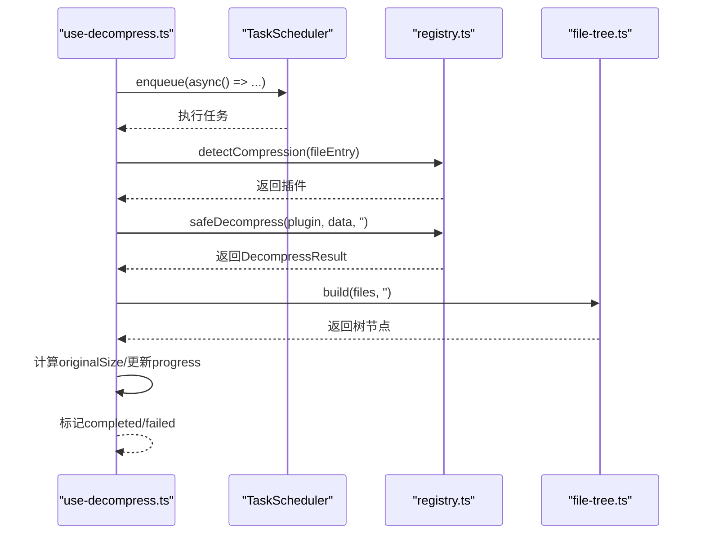
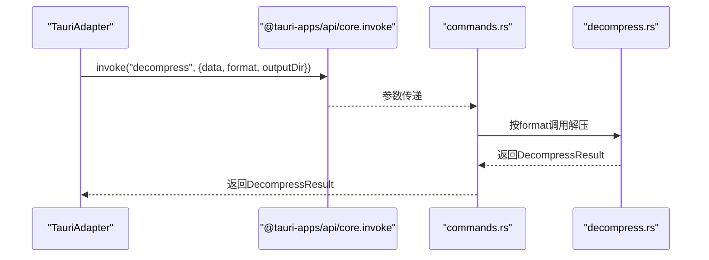
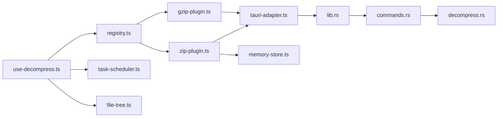

# 压缩处理器开发

<cite>
**本文引用的文件**   
- [zip-plugin.ts](file://src/plugins/compression/zip-plugin.ts)
- [gzip-plugin.ts](file://src/plugins/compression/gzip-plugin.ts)
- [types.ts](file://src/plugins/types.ts)
- [registry.ts](file://src/plugins/registry.ts)
- [decompress.ts](file://src/core/decompress.ts)
- [use-decompress.ts](file://src/composables/use-decompress.ts)
- [tauri-adapter.ts](file://src/adapters/tauri-adapter.ts)
- [lib.rs](file://src-tauri/src/lib.rs)
- [commands.rs](file://src-tauri/src/commands.rs)
- [decompress.rs](file://src-tauri/src/decompress.rs)
- [memory-store.ts](file://src/core/memory-store.ts)
- [index.ts](file://src/types/index.ts)
- [use-plugins.ts](file://src/composables/use-plugins.ts)
- [use-archives.test.ts](file://src/__tests__/composables/use-archives.test.ts)
</cite>

## 目录
1. [简介](#简介)
2. [项目结构](#项目结构)
3. [核心组件](#核心组件)
4. [架构总览](#架构总览)
5. [详细组件分析](#详细组件分析)
6. [依赖关系分析](#依赖关系分析)
7. [性能与内存优化](#性能与内存优化)
8. [故障排查指南](#故障排查指南)
9. [结论](#结论)
10. [附录：兼容性测试与边界处理](#附录：兼容性测试与边界处理)

## 简介
本指南面向希望为应用扩展“压缩处理器插件”的开发者，重点说明 ICompressionPlugin 接口的实现要求、支持的压缩格式、文件遍历算法与解压策略；演示 ZIP 与 GZIP 处理器的完整实现路径（含递归解压、进度反馈与错误恢复）；展示大文件的内存管理与性能优化方案；并给出与 Tauri 后端的通信模式（异步操作与状态同步），以及压缩格式兼容性与边界情况的处理方法。

## 项目结构
本项目采用前端 TypeScript + Vue 与后端 Rust（Tauri）混合架构。压缩相关代码主要分布在以下位置：
- 前端插件接口与注册中心：src/plugins/types.ts、src/plugins/registry.ts
- 压缩插件实现：src/plugins/compression/zip-plugin.ts、src/plugins/compression/gzip-plugin.ts
- 解压编排服务：src/core/decompress.ts
- 组合式 API 与任务调度：src/composables/use-decompress.ts、src/composables/use-plugins.ts
- 平台适配层（浏览器 vs Tauri）：src/adapters/tauri-adapter.ts
- Tauri 命令与解压实现：src-tauri/src/commands.rs、src-tauri/src/decompress.rs、src-tauri/src/lib.rs
- 类型定义与内存存储：src/types/index.ts、src/core/memory-store.ts

图表来源
- [use-decompress.ts:1-74](file://src/composables/use-decompress.ts#L1-L74)
- [registry.ts:1-118](file://src/plugins/registry.ts#L1-L118)
- [zip-plugin.ts:1-40](file://src/plugins/compression/zip-plugin.ts#L1-L40)
- [gzip-plugin.ts:1-44](file://src/plugins/compression/gzip-plugin.ts#L1-L44)
- [tauri-adapter.ts:1-62](file://src/adapters/tauri-adapter.ts#L1-L62)
- [lib.rs:1-19](file://src-tauri/src/lib.rs#L1-L19)
- [commands.rs:1-53](file://src-tauri/src/commands.rs#L1-L53)
- [decompress.rs:1-83](file://src-tauri/src/decompress.rs#L1-L83)
- [memory-store.ts:1-26](file://src/core/memory-store.ts#L1-L26)

章节来源
- [use-decompress.ts:1-74](file://src/composables/use-decompress.ts#L1-L74)
- [registry.ts:1-118](file://src/plugins/registry.ts#L1-L118)
- [zip-plugin.ts:1-40](file://src/plugins/compression/zip-plugin.ts#L1-L40)
- [gzip-plugin.ts:1-44](file://src/plugins/compression/gzip-plugin.ts#L1-L44)
- [tauri-adapter.ts:1-62](file://src/adapters/tauri-adapter.ts#L1-L62)
- [lib.rs:1-19](file://src-tauri/src/lib.rs#L1-L19)
- [commands.rs:1-53](file://src-tauri/src/commands.rs#L1-L53)
- [decompress.rs:1-83](file://src-tauri/src/decompress.rs#L1-L83)
- [memory-store.ts:1-26](file://src/core/memory-store.ts#L1-L26)

## 核心组件
- ICompressionPlugin 接口：定义压缩插件的统一契约，包括名称、支持的文件扩展名、匹配判断与解压方法。
- 插件注册中心 PluginRegistry：负责插件发现、超时保护与安全调用封装。
- 解压服务 DecompressService：将文件元信息转换为 FileEntry，交由注册中心选择对应插件执行。
- 组合式 useDecompress：编排解压流程、进度更新、错误处理与树构建。
- 平台适配 TauriAdapter：在 Tauri 环境下通过 IPC 调用后端命令进行解压；在浏览器环境使用内置库或 Web API。

章节来源
- [types.ts:16-21](file://src/plugins/types.ts#L16-L21)
- [registry.ts:14-118](file://src/plugins/registry.ts#L14-L118)
- [decompress.ts:5-27](file://src/core/decompress.ts#L5-L27)
- [use-decompress.ts:10-74](file://src/composables/use-decompress.ts#L10-L74)
- [tauri-adapter.ts:14-62](file://src/adapters/tauri-adapter.ts#L14-L62)

## 架构总览
下图展示了从前端触发到后端完成解压的端到端流程，包含插件检测、平台适配、IPC 调用与结果回传。

图表来源
- [use-decompress.ts:14-56](file://src/composables/use-decompress.ts#L14-L56)
- [registry.ts:106-116](file://src/plugins/registry.ts#L106-L116)
- [zip-plugin.ts:10-38](file://src/plugins/compression/zip-plugin.ts#L10-L38)
- [gzip-plugin.ts:10-42](file://src/plugins/compression/gzip-plugin.ts#L10-L42)
- [tauri-adapter.ts:36-39](file://src/adapters/tauri-adapter.ts#L36-L39)
- [commands.rs:38-52](file://src-tauri/src/commands.rs#L38-L52)
- [decompress.rs:23-82](file://src-tauri/src/decompress.rs#L23-L82)

## 详细组件分析

### ICompressionPlugin 接口与实现要求
- 必须提供字段与方法：
  - name：插件标识
  - supportedExtensions：支持的扩展名列表
  - canHandle(file)：基于文件名后缀判断是否可处理
  - decompress(data, outputDir)：执行解压，返回统一结果对象
- 返回值结构：
  - success：布尔值表示成功与否
  - files：FileEntry[] 列表，包含每个条目名称、路径、大小、是否目录等
  - error：可选的错误消息
- 平台分支：
  - 当运行于 Tauri 时，应委托给平台适配层的 decompress 方法，由后端执行解压
  - 浏览器环境可使用 fflate 或原生 DecompressionStream 进行本地解压

章节来源
- [types.ts:16-21](file://src/plugins/types.ts#L16-L21)
- [index.ts:1-13](file://src/types/index.ts#L1-L13)
- [zip-plugin.ts:4-38](file://src/plugins/compression/zip-plugin.ts#L4-L38)
- [gzip-plugin.ts:4-42](file://src/plugins/compression/gzip-plugin.ts#L4-L42)

#### ZIP 插件实现要点
- 支持扩展名：.zip
- 匹配逻辑：canHandle 检查文件名是否以 .zip 结尾
- 解压策略：
  - Tauri 环境：通过适配器调用后端 zip 解压，写入目标目录，返回文件清单
  - 浏览器环境：使用 fflate 的 unzipSync 解析，将非目录项写入内存存储，构造 FileEntry 列表
- 错误处理：捕获异常并返回失败结果，附带错误消息

图表来源
- [zip-plugin.ts:10-38](file://src/plugins/compression/zip-plugin.ts#L10-L38)
- [memory-store.ts:1-26](file://src/core/memory-store.ts#L1-L26)
- [commands.rs:38-52](file://src-tauri/src/commands.rs#L38-L52)
- [decompress.rs:23-62](file://src-tauri/src/decompress.rs#L23-L62)

章节来源
- [zip-plugin.ts:1-40](file://src/plugins/compression/zip-plugin.ts#L1-L40)
- [memory-store.ts:1-26](file://src/core/memory-store.ts#L1-L26)
- [commands.rs:38-52](file://src-tauri/src/commands.rs#L38-L52)
- [decompress.rs:23-62](file://src-tauri/src/decompress.rs#L23-L62)

#### GZIP 插件实现要点
- 支持扩展名：.gz、.gzip、.tgz
- 匹配逻辑：canHandle 检查文件名是否以任一受支持扩展结尾
- 解压策略：
  - Tauri 环境：通过适配器调用后端 gzip 解压，写入目标目录，返回文件清单
  - 浏览器环境：优先使用原生 DecompressionStream('gzip') 流式解码，聚合为 Uint8Array，构造单文件条目
- 错误处理：若不支持则返回失败结果

图表来源
- [gzip-plugin.ts:10-42](file://src/plugins/compression/gzip-plugin.ts#L10-L42)
- [commands.rs:38-52](file://src-tauri/src/commands.rs#L38-L52)
- [decompress.rs:64-82](file://src-tauri/src/decompress.rs#L64-L82)

章节来源
- [gzip-plugin.ts:1-44](file://src/plugins/compression/gzip-plugin.ts#L1-L44)
- [commands.rs:38-52](file://src-tauri/src/commands.rs#L38-L52)
- [decompress.rs:64-82](file://src-tauri/src/decompress.rs#L64-L82)

### 插件注册与发现机制
- 注册方式：
  - registerCompression：将插件加入 Map，并建立扩展名到插件名的映射
- 检测方式：
  - detectCompression：根据文件名后缀查找匹配的插件
- 安全调用：
  - safeDecompress：对插件解压方法进行超时保护与异常捕获，统一返回标准结果

图表来源
- [registry.ts:14-118](file://src/plugins/registry.ts#L14-L118)
- [types.ts:16-21](file://src/plugins/types.ts#L16-L21)
- [zip-plugin.ts:4-38](file://src/plugins/compression/zip-plugin.ts#L4-L38)
- [gzip-plugin.ts:4-42](file://src/plugins/compression/gzip-plugin.ts#L4-L42)

章节来源
- [registry.ts:14-118](file://src/plugins/registry.ts#L14-L118)
- [types.ts:16-21](file://src/plugins/types.ts#L16-L21)

### 解压编排与进度反馈
- 任务调度：使用 TaskScheduler 限制并发数量，避免阻塞
- 进度更新：在关键阶段调用 updateStatus 设置 running 与 progress
- 错误恢复：捕获异常并标记 failed，同时记录错误消息
- 文件树构建：使用 FileTreeBuilder 将扁平文件列表转为树形结构

图表来源
- [use-decompress.ts:14-56](file://src/composables/use-decompress.ts#L14-L56)
- [registry.ts:106-116](file://src/plugins/registry.ts#L106-L116)

章节来源
- [use-decompress.ts:10-74](file://src/composables/use-decompress.ts#L10-L74)

### 与 Tauri 后端的通信模式
- 前端适配器：
  - TauriAdapter.decompress：通过 @tauri-apps/api/core.invoke 调用后端命令
  - 数据传递：将 Uint8Array 转换为 number[] 传输
- 后端命令：
  - commands.rs 中的 decompress：根据 format 分发到 zip 或 gzip 解压函数
  - 返回统一的 DecompressResult，包含 success、files、error
- 状态同步：
  - 前端在调用前后更新 ArchiveItem 的状态与进度，供 UI 渲染

图表来源
- [tauri-adapter.ts:36-39](file://src/adapters/tauri-adapter.ts#L36-L39)
- [commands.rs:38-52](file://src-tauri/src/commands.rs#L38-L52)
- [decompress.rs:23-82](file://src-tauri/src/decompress.rs#L23-L82)

章节来源
- [tauri-adapter.ts:1-62](file://src/adapters/tauri-adapter.ts#L1-L62)
- [commands.rs:1-53](file://src-tauri/src/commands.rs#L1-L53)
- [decompress.rs:1-83](file://src-tauri/src/decompress.rs#L1-L83)

## 依赖关系分析
- 前端模块耦合：
  - use-decompress 依赖 registry、task-scheduler、file-tree
  - 压缩插件依赖 types 与 platform adapter
  - 浏览器端 ZIP 插件依赖 memory-store
- 后端模块耦合：
  - lib.rs 注册命令
  - commands.rs 路由到具体解压实现
  - decompress.rs 实现 zip 与 gzip 的具体解压逻辑

图表来源
- [use-decompress.ts:1-74](file://src/composables/use-decompress.ts#L1-L74)
- [registry.ts:1-118](file://src/plugins/registry.ts#L1-L118)
- [zip-plugin.ts:1-40](file://src/plugins/compression/zip-plugin.ts#L1-L40)
- [gzip-plugin.ts:1-44](file://src/plugins/compression/gzip-plugin.ts#L1-L44)
- [tauri-adapter.ts:1-62](file://src/adapters/tauri-adapter.ts#L1-L62)
- [lib.rs:1-19](file://src-tauri/src/lib.rs#L1-L19)
- [commands.rs:1-53](file://src-tauri/src/commands.rs#L1-L53)
- [decompress.rs:1-83](file://src-tauri/src/decompress.rs#L1-L83)
- [memory-store.ts:1-26](file://src/core/memory-store.ts#L1-L26)

章节来源
- [use-decompress.ts:1-74](file://src/composables/use-decompress.ts#L1-L74)
- [registry.ts:1-118](file://src/plugins/registry.ts#L1-L118)
- [zip-plugin.ts:1-40](file://src/plugins/compression/zip-plugin.ts#L1-L40)
- [gzip-plugin.ts:1-44](file://src/plugins/compression/gzip-plugin.ts#L1-L44)
- [tauri-adapter.ts:1-62](file://src/adapters/tauri-adapter.ts#L1-L62)
- [lib.rs:1-19](file://src-tauri/src/lib.rs#L1-L19)
- [commands.rs:1-53](file://src-tauri/src/commands.rs#L1-L53)
- [decompress.rs:1-83](file://src-tauri/src/decompress.rs#L1-L83)
- [memory-store.ts:1-26](file://src/core/memory-store.ts#L1-L26)

## 性能与内存优化
- 大文件处理建议：
  - 优先使用 Tauri 后端进行解压，避免在前端一次性加载超大二进制数据
  - 浏览器端 GZIP 使用 DecompressionStream 流式解码，减少峰值内存占用
  - ZIP 在浏览器端使用 fflate 的同步解压，适合中小体积；对于大文件建议走后端
- 内存管理：
  - 浏览器端 ZIP 插件将文件写入内存存储，注意及时清理不再使用的条目
  - 聚合流式解码结果时使用偏移拷贝，避免多次分配
- 并发控制：
  - 使用 TaskScheduler 限制并行任务数，防止 UI 卡顿与资源争用
- 超时保护：
  - 插件调用增加超时，避免长时间挂起导致用户体验下降

[本节为通用指导，不直接分析具体文件]

## 故障排查指南
- 常见错误与定位：
  - 无匹配插件：检查文件名后缀与 supportedExtensions 配置
  - 解压失败：查看 DecompressResult.error 字段，确认后端日志与输入数据完整性
  - 超时错误：检查插件耗时与 PLUGIN_TIMEOUT_MS 设置
- 调试步骤：
  - 在前端打印 ArchiveItem.error 与 progress
  - 在后端命令中记录 format 与 outputDir 参数
  - 验证 TauriAdapter 的 invoke 调用是否成功返回

章节来源
- [registry.ts:106-116](file://src/plugins/registry.ts#L106-L116)
- [use-decompress.ts:39-55](file://src/composables/use-decompress.ts#L39-L55)
- [commands.rs:38-52](file://src-tauri/src/commands.rs#L38-L52)

## 结论
通过统一的 ICompressionPlugin 接口与注册中心，项目实现了可扩展的压缩处理器体系。ZIP 与 GZIP 插件分别覆盖了归档与单文件压缩场景，并在 Tauri 与浏览器环境中提供了合理的降级策略。结合任务调度、进度反馈与错误恢复，整体具备较好的可用性与健壮性。针对大文件与高并发场景，建议优先使用后端解压与流式处理，以获得更优的性能与内存表现。

[本节为总结性内容，不直接分析具体文件]

## 附录：兼容性测试与边界处理
- 单元测试覆盖：
  - 使用 Vitest 对归档管理器进行基础行为验证，如添加文件、移除、统计、状态更新与进度设置
- 边界情况建议：
  - 空文件或损坏压缩包：确保返回 success=false 并提供明确错误消息
  - 嵌套目录与同名文件：后端需正确处理路径创建与覆盖策略
  - 不支持的格式：返回未支持提示，便于前端引导用户选择正确工具
- 测试用例参考：
  - 归档状态与进度更新的行为验证

章节来源
- [use-archives.test.ts:1-65](file://src/__tests__/composables/use-archives.test.ts#L1-L65)