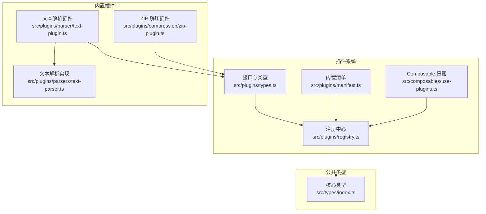
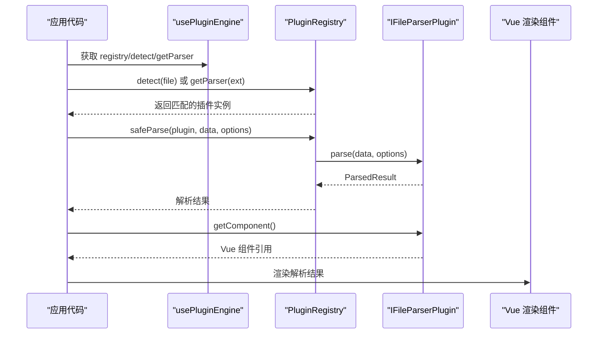
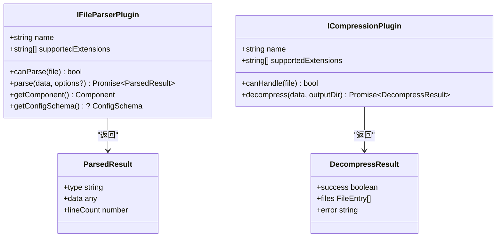
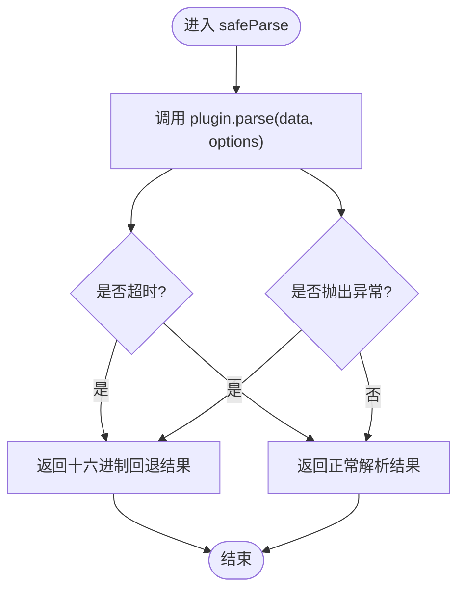
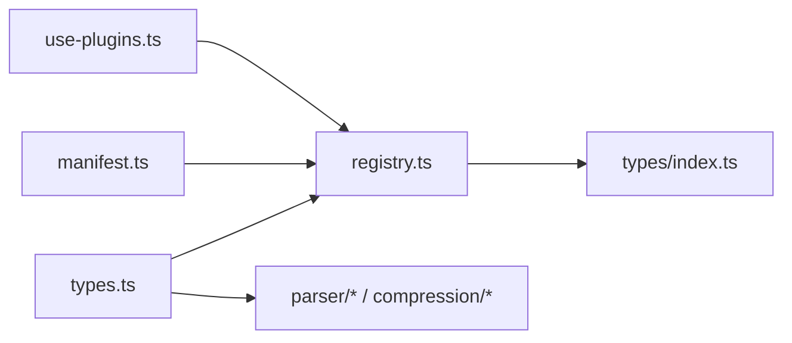

# 插件基础概念

<cite>
**本文引用的文件列表**
- [src/plugins/types.ts](file://src/plugins/types.ts)
- [src/plugins/registry.ts](file://src/plugins/registry.ts)
- [src/plugins/manifest.ts](file://src/plugins/manifest.ts)
- [src/composables/use-plugins.ts](file://src/composables/use-plugins.ts)
- [src/plugins/parser/text-plugin.ts](file://src/plugins/parser/text-plugin.ts)
- [src/plugins/compression/zip-plugin.ts](file://src/plugins/compression/zip-plugin.ts)
- [src/plugins/parsers/text-parser.ts](file://src/plugins/parsers/text-parser.ts)
- [src/types/index.ts](file://src/types/index.ts)
- [package.json](file://package.json)
- [src/__tests__/plugins/registry.test.ts](file://src/__tests__/plugins/registry.test.ts)
</cite>

## 目录
1. [简介](#简介)
2. [项目结构](#项目结构)
3. [核心组件](#核心组件)
4. [架构总览](#架构总览)
5. [详细组件分析](#详细组件分析)
6. [依赖分析](#依赖分析)
7. [性能考虑](#性能考虑)
8. [故障排查指南](#故障排查指南)
9. [结论](#结论)
10. [附录：开发环境与第一个插件示例](#附录开发环境与第一个插件示例)

## 简介
本章节为 Hello-Tauri 插件系统的基础概念文档，聚焦以下目标：
- 解释插件架构的核心设计原理与职责边界
- 定义并说明 IFileParserPlugin 与 ICompressionPlugin 接口规范
- 描述插件生命周期、注册机制与发现流程
- 文档化插件清单文件格式、元数据定义与版本兼容性要求（基于现有实现）
- 提供插件开发环境搭建指南（依赖安装、工具配置、调试设置）
- 给出一个从“文件识别到内容解析”的完整简单插件示例路径指引

## 项目结构
Hello-Tauri 的插件系统位于前端 TypeScript/Vue 工程内，采用“接口 + 注册表 + 内置清单 + Composable 暴露”的分层组织方式。关键目录与文件如下：
- 接口与类型定义：src/plugins/types.ts、src/types/index.ts
- 注册中心与运行时：src/plugins/registry.ts
- 内置插件清单：src/plugins/manifest.ts
- 插件使用入口：src/composables/use-plugins.ts
- 内置解析器与压缩器示例：src/plugins/parser/*.ts、src/plugins/compression/*.ts
- 测试用例：src/__tests__/plugins/registry.test.ts

图表来源
- [src/plugins/types.ts:1-37](file://src/plugins/types.ts#L1-L37)
- [src/plugins/registry.ts:1-118](file://src/plugins/registry.ts#L1-L118)
- [src/plugins/manifest.ts:1-20](file://src/plugins/manifest.ts#L1-L20)
- [src/composables/use-plugins.ts:1-17](file://src/composables/use-plugins.ts#L1-L17)
- [src/plugins/parser/text-plugin.ts:1-18](file://src/plugins/parser/text-plugin.ts#L1-L18)
- [src/plugins/compression/zip-plugin.ts:1-40](file://src/plugins/compression/zip-plugin.ts#L1-L40)
- [src/plugins/parsers/text-parser.ts:1-8](file://src/plugins/parsers/text-parser.ts#L1-L8)
- [src/types/index.ts:1-71](file://src/types/index.ts#L1-L71)

章节来源
- [src/plugins/types.ts:1-37](file://src/plugins/types.ts#L1-L37)
- [src/plugins/registry.ts:1-118](file://src/plugins/registry.ts#L1-L118)
- [src/plugins/manifest.ts:1-20](file://src/plugins/manifest.ts#L1-L20)
- [src/composables/use-plugins.ts:1-17](file://src/composables/use-plugins.ts#L1-L17)
- [src/plugins/parser/text-plugin.ts:1-18](file://src/plugins/parser/text-plugin.ts#L1-L18)
- [src/plugins/compression/zip-plugin.ts:1-40](file://src/plugins/compression/zip-plugin.ts#L1-L40)
- [src/plugins/parsers/text-parser.ts:1-8](file://src/plugins/parsers/text-parser.ts#L1-L8)
- [src/types/index.ts:1-71](file://src/types/index.ts#L1-L71)

## 核心组件
本节概述插件系统的核心组件及其职责：
- 接口与类型定义：IFileParserPlugin、ICompressionPlugin、ParsedResult、ConfigSchema 等
- 注册中心 PluginRegistry：负责插件注册、扩展名映射、检测、启用/禁用、安全执行包装
- 内置清单 registerBuiltinPlugins：集中注册所有内置插件
- Composable usePluginEngine：对外暴露统一 API，供业务模块使用

章节来源
- [src/plugins/types.ts:1-37](file://src/plugins/types.ts#L1-L37)
- [src/plugins/registry.ts:1-118](file://src/plugins/registry.ts#L1-L118)
- [src/plugins/manifest.ts:1-20](file://src/plugins/manifest.ts#L1-L20)
- [src/composables/use-plugins.ts:1-17](file://src/composables/use-plugins.ts#L1-L17)

## 架构总览
下图展示了插件在运行时的交互关系：应用通过 Composable 获取注册中心，注册中心根据扩展名或文件名检测对应插件，调用其解析或解压方法，并在超时或异常时进行回退处理。

图表来源
- [src/composables/use-plugins.ts:1-17](file://src/composables/use-plugins.ts#L1-L17)
- [src/plugins/registry.ts:98-104](file://src/plugins/registry.ts#L98-L104)
- [src/plugins/types.ts:23-30](file://src/plugins/types.ts#L23-L30)

## 详细组件分析

### 接口规范：IFileParserPlugin 与 ICompressionPlugin
- IFileParserPlugin
  - name: 插件唯一标识
  - supportedExtensions: 支持的扩展名数组
  - canParse(file): 判断是否可解析该文件
  - parse(data, options?): 将二进制数据解析为结构化结果
  - getComponent(): 返回用于渲染结果的 Vue 组件
  - getConfigSchema?(): 可选，返回配置项 Schema，用于动态生成配置表单
- ICompressionPlugin
  - name: 插件唯一标识
  - supportedExtensions: 支持的压缩格式扩展名
  - canHandle(file): 判断是否可处理该压缩文件
  - decompress(data, outputDir): 解压缩并返回结果

图表来源
- [src/plugins/types.ts:16-36](file://src/plugins/types.ts#L16-L36)
- [src/types/index.ts:9-13](file://src/types/index.ts#L9-L13)

章节来源
- [src/plugins/types.ts:16-36](file://src/plugins/types.ts#L16-L36)
- [src/types/index.ts:9-13](file://src/types/index.ts#L9-L13)

### 注册中心：PluginRegistry
职责与特性：
- 维护解析器与压缩器的名称到实例映射，以及扩展名到插件名的索引
- 支持按扩展名或文件名检测匹配插件
- 支持启用/禁用特定插件
- 提供 safeParse/safeDecompress 安全执行包装，包含超时控制与错误回退

图表来源
- [src/plugins/registry.ts:98-104](file://src/plugins/registry.ts#L98-L104)
- [src/plugins/registry.ts:6-12](file://src/plugins/registry.ts#L6-L12)

章节来源
- [src/plugins/registry.ts:14-118](file://src/plugins/registry.ts#L14-L118)

### 内置清单：registerBuiltinPlugins
作用：集中注册所有内置解析器与压缩器，避免分散注册导致遗漏。当前内置包括：
- 压缩：zip、gzip
- 解析：text、csv、json、log、hex

章节来源
- [src/plugins/manifest.ts:10-19](file://src/plugins/manifest.ts#L10-L19)

### Composable 暴露：usePluginEngine
对外暴露统一的 API，简化上层调用：
- registry：直接访问注册中心
- detect/getParser/getCompression：快捷查询
- enable/disable：启用/禁用插件

章节来源
- [src/composables/use-plugins.ts:1-17](file://src/composables/use-plugins.ts#L1-L17)

### 示例插件：文本解析插件 text-plugin
- 声明支持的扩展名集合
- canParse 基于扩展名快速判定
- parse 委托给具体解析实现
- getComponent 返回对应的 Vue 渲染组件

章节来源
- [src/plugins/parser/text-plugin.ts:1-18](file://src/plugins/parser/text-plugin.ts#L1-L18)
- [src/plugins/parsers/text-parser.ts:1-8](file://src/plugins/parsers/text-parser.ts#L1-L8)

### 示例插件：ZIP 解压插件 zip-plugin
- 支持 .zip 扩展名
- 在 Tauri 平台下走平台适配器解压；在非 Tauri 环境下使用内存库解压并写入虚拟存储
- 返回标准化的解压结果

章节来源
- [src/plugins/compression/zip-plugin.ts:1-40](file://src/plugins/compression/zip-plugin.ts#L1-L40)

## 依赖分析
- 插件接口与类型集中在 types.ts，被注册中心与具体插件共同依赖
- 注册中心依赖公共类型（如 FileEntry、DecompressResult）
- 内置清单依赖各具体插件实现
- Composable 仅依赖注册中心与清单，保持对上层透明

图表来源
- [src/plugins/types.ts:1-37](file://src/plugins/types.ts#L1-L37)
- [src/plugins/registry.ts:1-118](file://src/plugins/registry.ts#L1-L118)
- [src/plugins/manifest.ts:1-20](file://src/plugins/manifest.ts#L1-L20)
- [src/composables/use-plugins.ts:1-17](file://src/composables/use-plugins.ts#L1-L17)
- [src/types/index.ts:1-71](file://src/types/index.ts#L1-L71)

章节来源
- [src/plugins/types.ts:1-37](file://src/plugins/types.ts#L1-L37)
- [src/plugins/registry.ts:1-118](file://src/plugins/registry.ts#L1-L118)
- [src/plugins/manifest.ts:1-20](file://src/plugins/manifest.ts#L1-L20)
- [src/composables/use-plugins.ts:1-17](file://src/composables/use-plugins.ts#L1-L17)
- [src/types/index.ts:1-71](file://src/types/index.ts#L1-L71)

## 性能考虑
- 插件解析与解压均受超时保护，默认超时时间由注册中心内部常量决定，防止阻塞主线程
- 解析失败自动回退至十六进制查看器，保证用户体验稳定
- 建议：
  - 在 canParse/canHandle 中做轻量级快速判断，避免昂贵计算
  - 大文件解析应分块或流式处理（未来可扩展）
  - 合理声明 supportedExtensions，减少不必要的遍历匹配

[本节为通用指导，不直接分析具体文件]

## 故障排查指南
常见问题与定位思路：
- 插件未生效
  - 检查是否在清单中注册
  - 确认扩展名是否正确且未被禁用
- 解析失败或超时
  - 观察 safeParse 是否触发回退逻辑
  - 检查插件 parse 实现是否抛出异常或耗时过长
- 解压失败
  - 检查 safeDecompress 的错误信息
  - 确认平台适配路径（Tauri vs Web）是否可用

章节来源
- [src/plugins/registry.ts:98-116](file://src/plugins/registry.ts#L98-L116)
- [src/__tests__/plugins/registry.test.ts:71-96](file://src/__tests__/plugins/registry.test.ts#L71-L96)

## 结论
Hello-Tauri 的插件系统以清晰的接口契约为核心，通过注册中心统一管理插件的发现、调度与安全执行。内置清单简化了初始化流程，Composable 提供了简洁的调用入口。整体设计具备高内聚、低耦合、易扩展的特点，适合持续增加新的解析器与压缩器。

[本节为总结性内容，不直接分析具体文件]

## 附录：开发环境与第一个插件示例

### 开发环境搭建
- Node.js 版本要求：>= 20（见 engines 字段）
- 依赖安装：npm install
- 常用脚本：
  - 开发模式：npm run dev
  - 构建：npm run build
  - 预览：npm run preview
  - 测试：npm test / npm run test:watch
  - 类型检查：npm run typecheck
  - Tauri 相关：npm run tauri / tauri:dev / tauri:build

章节来源
- [package.json:1-42](file://package.json#L1-L42)

### 插件清单文件格式与元数据
- 当前仓库未引入外部清单文件（如 JSON/YAML），而是通过 TypeScript 源码中的 registerBuiltinPlugins 函数集中注册内置插件
- 插件元数据来源于接口字段：
  - name：插件唯一标识
  - supportedExtensions：支持的扩展名数组
  - 其他行为由接口方法定义（如 canParse、parse、getComponent、getConfigSchema 等）
- 版本兼容性：
  - 当前实现未显式声明插件版本字段或兼容策略
  - 若需引入版本管理，可在后续扩展接口与清单格式

章节来源
- [src/plugins/manifest.ts:10-19](file://src/plugins/manifest.ts#L10-L19)
- [src/plugins/types.ts:16-30](file://src/plugins/types.ts#L16-L30)

### 插件生命周期与发现流程
- 启动阶段
  - 创建 PluginRegistry 实例
  - 调用 registerBuiltinPlugins 完成内置插件注册
- 运行阶段
  - 通过 usePluginEngine 暴露的 detect/getParser 等方法进行插件发现
  - 根据文件扩展名或文件名匹配插件
  - 调用 safeParse/safeDecompress 执行插件逻辑，带超时与错误回退
- 生命周期钩子
  - 当前实现未提供显式的 init/destroy 钩子
  - 可通过插件自身状态管理实现按需初始化与清理

章节来源
- [src/composables/use-plugins.ts:1-17](file://src/composables/use-plugins.ts#L1-L17)
- [src/plugins/registry.ts:14-96](file://src/plugins/registry.ts#L14-L96)

### 第一个简单插件示例：文本解析插件
目标：实现一个能识别常见文本扩展名并解析为文本内容的插件。

步骤概览（以路径指引代替代码片段）：
- 新建插件文件：src/plugins/parser/my-text-plugin.ts
  - 参考：src/plugins/parser/text-plugin.ts
- 实现 IFileParserPlugin 接口
  - 定义 name、supportedExtensions、canParse、parse、getComponent
  - parse 可复用现有解析实现：src/plugins/parsers/text-parser.ts
  - getComponent 返回一个 Vue 组件（可使用现有 TextRenderer 或自定义）
- 注册插件
  - 在 src/plugins/manifest.ts 的 registerBuiltinPlugins 中新增 registry.registerParser(...)
- 验证
  - 运行测试：npm test
  - 手动验证：打开一个 .txt/.md 文件，确认能被正确解析并渲染

章节来源
- [src/plugins/parser/text-plugin.ts:1-18](file://src/plugins/parser/text-plugin.ts#L1-L18)
- [src/plugins/parsers/text-parser.ts:1-8](file://src/plugins/parsers/text-parser.ts#L1-L8)
- [src/plugins/manifest.ts:10-19](file://src/plugins/manifest.ts#L10-L19)