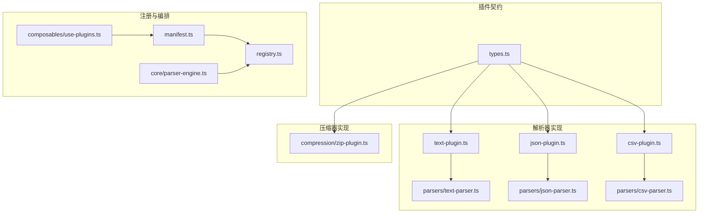
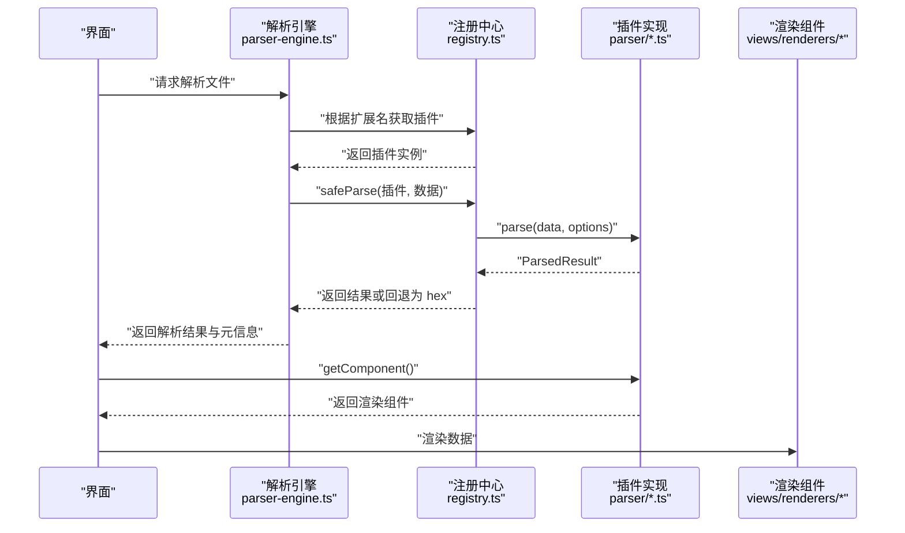
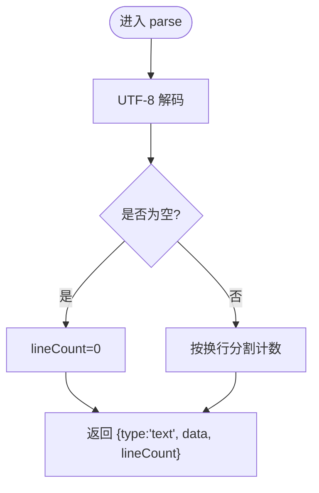
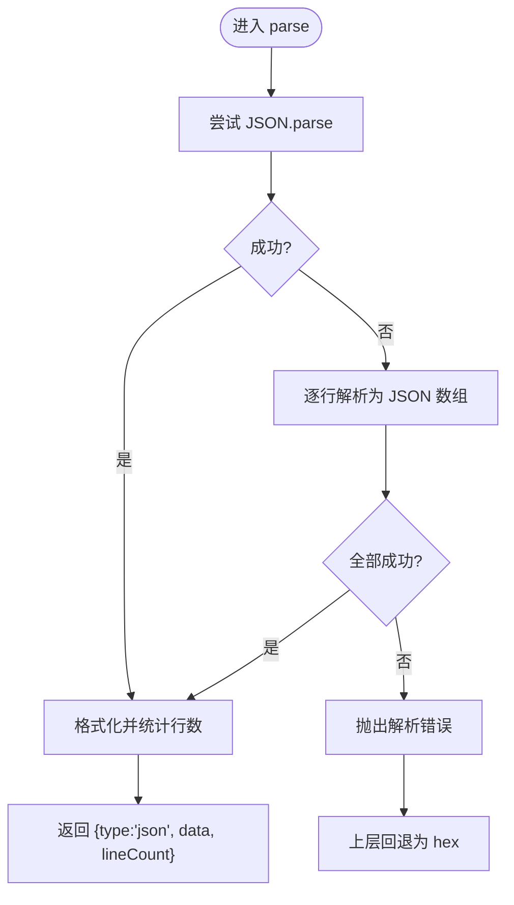
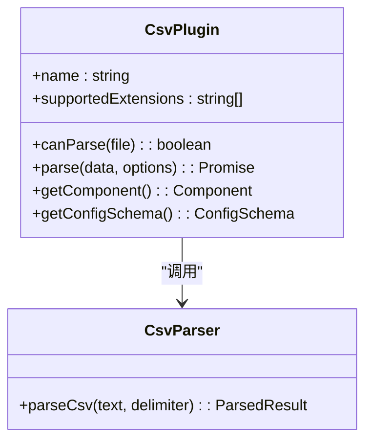
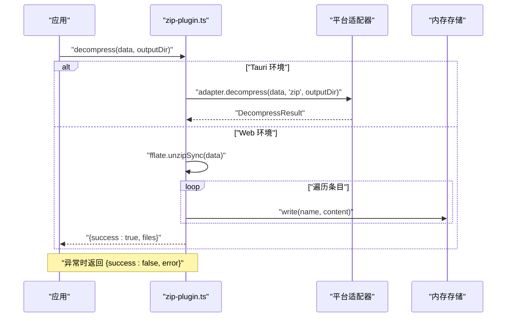
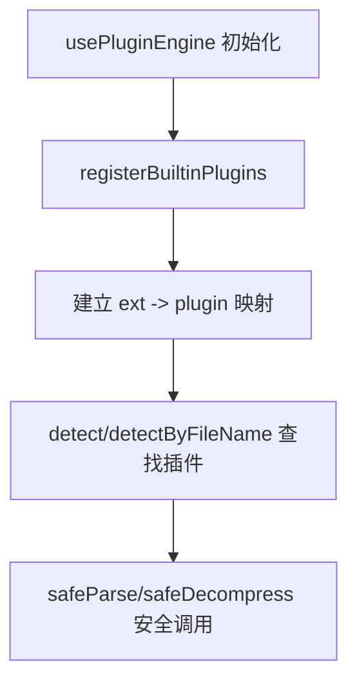
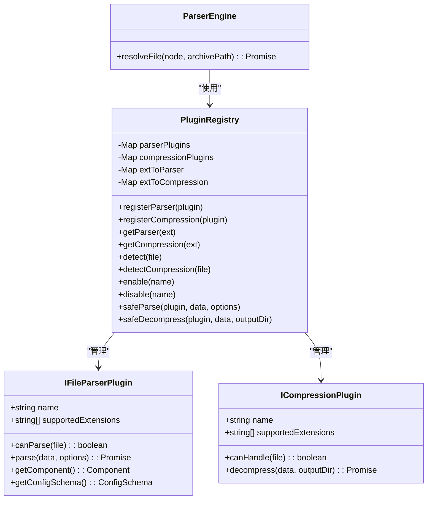
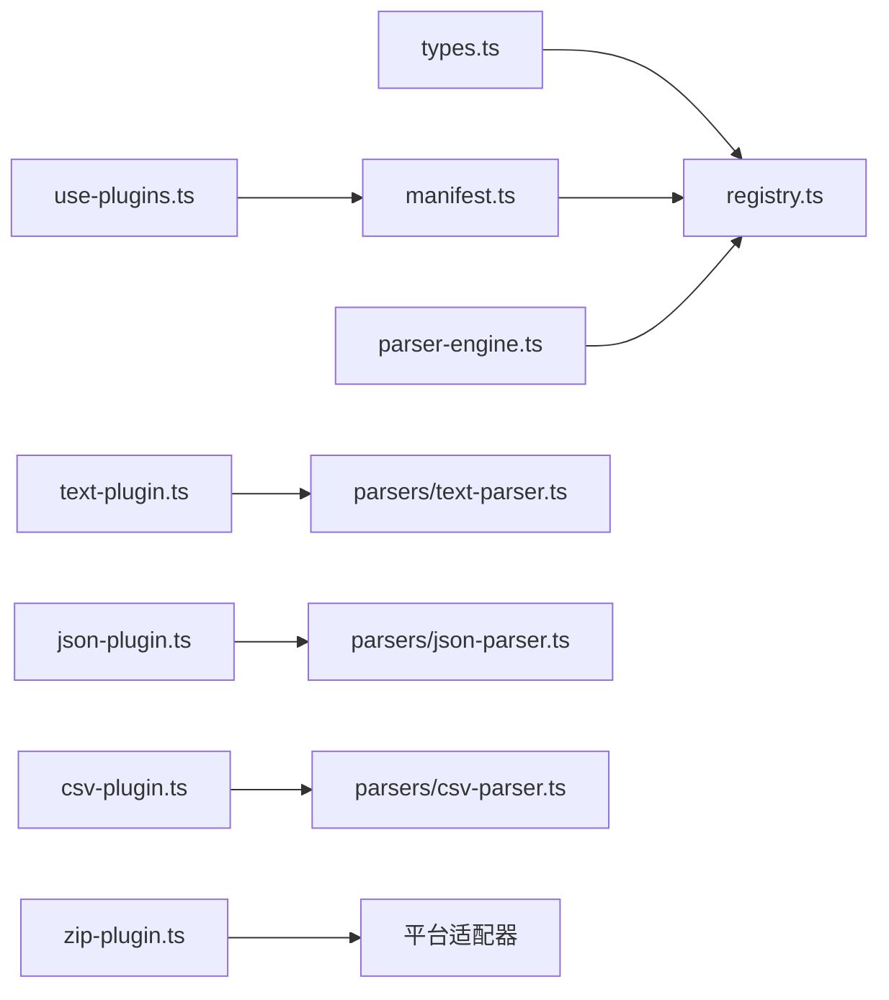

# 插件开发教程

<cite>
**本文引用的文件**   
- [src/plugins/types.ts](file://src/plugins/types.ts)
- [src/plugins/registry.ts](file://src/plugins/registry.ts)
- [src/core/parser-engine.ts](file://src/core/parser-engine.ts)
- [src/composables/use-plugins.ts](file://src/composables/use-plugins.ts)
- [src/plugins/parsers/text-parser.ts](file://src/plugins/parsers/text-parser.ts)
- [src/plugins/parsers/json-parser.ts](file://src/plugins/parsers/json-parser.ts)
- [src/plugins/parsers/csv-parser.ts](file://src/plugins/parsers/csv-parser.ts)
- [src/plugins/parsers/types.ts](file://src/plugins/parsers/types.ts)
- [src/plugins/parser/text-plugin.ts](file://src/plugins/parser/text-plugin.ts)
- [src/plugins/parser/json-plugin.ts](file://src/plugins/parser/json-plugin.ts)
- [src/plugins/parser/csv-plugin.ts](file://src/plugins/parser/csv-plugin.ts)
- [src/plugins/compression/zip-plugin.ts](file://src/plugins/compression/zip-plugin.ts)
- [src/plugins/manifest.ts](file://src/plugins/manifest.ts)
- [src/__tests__/plugins/parsers/text-parser.test.ts](file://src/__tests__/plugins/parsers/text-parser.test.ts)
- [src/__tests__/plugins/registry.test.ts](file://src/__tests__/plugins/registry.test.ts)
</cite>

## 目录
1. [简介](#简介)
2. [项目结构](#项目结构)
3. [核心组件](#核心组件)
4. [架构总览](#架构总览)
5. [详细组件分析](#详细组件分析)
6. [依赖关系分析](#依赖关系分析)
7. [性能考虑](#性能考虑)
8. [故障排除指南](#故障排除指南)
9. [结论](#结论)
10. [附录](#附录)

## 简介
本教程面向 Hello-Tauri 项目的插件开发者，从最简单的文本解析器开始，逐步构建复杂的 JSON 解析器和 CSV 处理器，并完整演示 ZIP 压缩处理器的实现。你将学会：
- 如何实现 canParse、parse 方法以及 getComponent、getConfigSchema 等扩展点
- 如何将解析结果与渲染组件集成
- 如何生成配置表单以支持用户自定义参数
- 如何实现 ZIP 解压流程（含错误恢复）
- 如何进行插件调试、编写单元测试与性能测试
- 如何进行打包、签名与分发（概念性说明）

## 项目结构
本项目采用“插件接口 + 注册中心 + 引擎调度”的清晰分层：
- 插件类型与契约定义位于 types 层
- 具体解析器与压缩器实现位于 plugins 子目录
- 注册中心负责插件发现、启用/禁用、安全调用
- 引擎层负责读取文件、选择插件、执行解析并返回统一结果
- Composable 提供便捷入口，自动注册内置插件

图表来源
- [src/plugins/types.ts:1-37](file://src/plugins/types.ts#L1-L37)
- [src/plugins/parser/text-plugin.ts:1-18](file://src/plugins/parser/text-plugin.ts#L1-L18)
- [src/plugins/parser/json-plugin.ts:1-19](file://src/plugins/parser/json-plugin.ts#L1-L19)
- [src/plugins/parser/csv-plugin.ts:1-28](file://src/plugins/parser/csv-plugin.ts#L1-L28)
- [src/plugins/parsers/text-parser.ts:1-8](file://src/plugins/parsers/text-parser.ts#L1-L8)
- [src/plugins/parsers/json-parser.ts:1-17](file://src/plugins/parsers/json-parser.ts#L1-L17)
- [src/plugins/parsers/csv-parser.ts:1-17](file://src/plugins/parsers/csv-parser.ts#L1-L17)
- [src/plugins/compression/zip-plugin.ts:1-40](file://src/plugins/compression/zip-plugin.ts#L1-L40)
- [src/plugins/manifest.ts:1-20](file://src/plugins/manifest.ts#L1-L20)
- [src/composables/use-plugins.ts:1-17](file://src/composables/use-plugins.ts#L1-L17)
- [src/core/parser-engine.ts:1-35](file://src/core/parser-engine.ts#L1-L35)

章节来源
- [src/plugins/types.ts:1-37](file://src/plugins/types.ts#L1-L37)
- [src/plugins/registry.ts:1-118](file://src/plugins/registry.ts#L1-L118)
- [src/core/parser-engine.ts:1-35](file://src/core/parser-engine.ts#L1-L35)
- [src/composables/use-plugins.ts:1-17](file://src/composables/use-plugins.ts#L1-L17)
- [src/plugins/manifest.ts:1-20](file://src/plugins/manifest.ts#L1-L20)

## 核心组件
- 插件契约
  - IFileParserPlugin：定义名称、支持扩展名、canParse、parse、getComponent、可选 getConfigSchema
  - ICompressionPlugin：定义名称、支持扩展名、canHandle、decompress
  - ParsedResult：统一解析结果结构，包含 type、data、lineCount
- 注册中心 PluginRegistry
  - 维护解析器与压缩器映射，支持按扩展名查找、文件名检测、启用/禁用
  - safeParse/safeDecompress 提供超时保护与错误兜底
- 解析引擎 ParserEngine
  - 读取文件内容，根据扩展名选择插件，调用 safeParse，返回带元数据的解析结果
- Composable usePluginEngine
  - 创建全局 registry 并自动注册内置插件，暴露 detect/getParser/getCompression/enable/disable 等方法

章节来源
- [src/plugins/types.ts:1-37](file://src/plugins/types.ts#L1-L37)
- [src/plugins/registry.ts:1-118](file://src/plugins/registry.ts#L1-L118)
- [src/core/parser-engine.ts:1-35](file://src/core/parser-engine.ts#L1-L35)
- [src/composables/use-plugins.ts:1-17](file://src/composables/use-plugins.ts#L1-L17)

## 架构总览
下图展示了从文件到渲染的端到端流程：引擎读取文件，注册中心选择插件，插件执行解析并返回结构化数据，UI 通过 getComponent 获取对应渲染器展示。

图表来源
- [src/core/parser-engine.ts:1-35](file://src/core/parser-engine.ts#L1-L35)
- [src/plugins/registry.ts:1-118](file://src/plugins/registry.ts#L1-L118)
- [src/plugins/parser/text-plugin.ts:1-18](file://src/plugins/parser/text-plugin.ts#L1-L18)
- [src/plugins/parser/json-plugin.ts:1-19](file://src/plugins/parser/json-plugin.ts#L1-L19)
- [src/plugins/parser/csv-plugin.ts:1-28](file://src/plugins/parser/csv-plugin.ts#L1-L28)

## 详细组件分析

### 文本解析器（入门案例）
- 目标：将二进制数据解码为 UTF-8 文本，统计行数，返回 text 类型结果
- 关键实现要点
  - 使用 TextDecoder 解码 Uint8Array
  - 空文件时 lineCount 为 0
  - 插件包装：text-plugin 声明 supportedExtensions、canParse、parse、getComponent
- 集成方式
  - 在 manifest 中注册后，可通过扩展名 .txt/.md 等自动匹配
  - 渲染组件由 getComponent 返回，用于前端展示

图表来源
- [src/plugins/parsers/text-parser.ts:1-8](file://src/plugins/parsers/text-parser.ts#L1-L8)
- [src/plugins/parser/text-plugin.ts:1-18](file://src/plugins/parser/text-plugin.ts#L1-L18)

章节来源
- [src/plugins/parsers/text-parser.ts:1-8](file://src/plugins/parsers/text-parser.ts#L1-L8)
- [src/plugins/parser/text-plugin.ts:1-18](file://src/plugins/parser/text-plugin.ts#L1-L18)
- [src/__tests__/plugins/parsers/text-parser.test.ts:1-27](file://src/__tests__/plugins/parsers/text-parser.test.ts#L1-L27)

### JSON 解析器（进阶案例）
- 目标：支持标准 JSON 与 JSON Lines（每行一个 JSON），失败时抛出明确错误以便上层回退
- 关键实现要点
  - 先尝试 JSON.parse；若失败，再尝试逐行解析为数组
  - 返回格式化后的数据与行数统计
  - 插件包装：json-plugin 负责解码与调用解析函数，并提供 JsonRenderer 组件
- 错误处理
  - 解析失败抛出异常，注册中心的 safeParse 会捕获并回退为 hex 视图

图表来源
- [src/plugins/parsers/json-parser.ts:1-17](file://src/plugins/parsers/json-parser.ts#L1-L17)
- [src/plugins/parser/json-plugin.ts:1-19](file://src/plugins/parser/json-plugin.ts#L1-L19)
- [src/plugins/registry.ts:98-104](file://src/plugins/registry.ts#L98-L104)

章节来源
- [src/plugins/parsers/json-parser.ts:1-17](file://src/plugins/parsers/json-parser.ts#L1-L17)
- [src/plugins/parser/json-plugin.ts:1-19](file://src/plugins/parser/json-plugin.ts#L1-L19)
- [src/plugins/registry.ts:98-104](file://src/plugins/registry.ts#L98-L104)

### CSV 处理器（可配置案例）
- 目标：解析 CSV/TSV，支持分隔符配置，返回 headers 与 rows 结构
- 关键实现要点
  - 默认分隔符为逗号，可通过 options.delimiter 覆盖
  - 空文件返回空表头与空行集合
  - 插件提供 getConfigSchema，用于动态生成配置表单（如分隔符输入框、固定表头开关）
- 渲染集成
  - getComponent 返回 CsvRenderer，结合配置项进行表格展示

图表来源
- [src/plugins/parser/csv-plugin.ts:1-28](file://src/plugins/parser/csv-plugin.ts#L1-L28)
- [src/plugins/parsers/csv-parser.ts:1-17](file://src/plugins/parsers/csv-parser.ts#L1-L17)
- [src/plugins/types.ts:12-14](file://src/plugins/types.ts#L12-L14)

章节来源
- [src/plugins/parser/csv-plugin.ts:1-28](file://src/plugins/parser/csv-plugin.ts#L1-L28)
- [src/plugins/parsers/csv-parser.ts:1-17](file://src/plugins/parsers/csv-parser.ts#L1-L17)
- [src/plugins/types.ts:12-14](file://src/plugins/types.ts#L12-L14)

### ZIP 压缩处理器（完整实现案例）
- 目标：对 .zip 文件进行解压，跨平台适配（Tauri 后端或浏览器 fflate）
- 关键实现要点
  - canHandle 基于扩展名判断
  - decompress 内部根据运行环境选择后端：
    - Tauri：通过平台适配器调用后端解压
    - Web：使用 fflate 的 unzipSync 解压，写入内存存储，收集文件清单
  - 错误恢复：捕获异常并返回 success=false 的错误对象
- 进度反馈（建议方案）
  - 当前实现为同步解压，适合中小文件；如需大文件进度反馈，可在上层封装异步分块解压并通过事件回调上报进度

图表来源
- [src/plugins/compression/zip-plugin.ts:1-40](file://src/plugins/compression/zip-plugin.ts#L1-L40)

章节来源
- [src/plugins/compression/zip-plugin.ts:1-40](file://src/plugins/compression/zip-plugin.ts#L1-L40)
- [src/plugins/registry.ts:106-116](file://src/plugins/registry.ts#L106-L116)

### 插件注册与发现机制
- 注册流程
  - manifest 集中注册所有内置解析器与压缩器
  - usePluginEngine 初始化 registry 并调用 registerBuiltinPlugins
- 发现流程
  - 根据文件扩展名或文件名后缀匹配插件
  - 支持启用/禁用特定插件
  - safeParse/safeDecompress 提供超时与错误兜底

图表来源
- [src/composables/use-plugins.ts:1-17](file://src/composables/use-plugins.ts#L1-L17)
- [src/plugins/manifest.ts:1-20](file://src/plugins/manifest.ts#L1-L20)
- [src/plugins/registry.ts:14-96](file://src/plugins/registry.ts#L14-L96)

章节来源
- [src/composables/use-plugins.ts:1-17](file://src/composables/use-plugins.ts#L1-L17)
- [src/plugins/manifest.ts:1-20](file://src/plugins/manifest.ts#L1-L20)
- [src/plugins/registry.ts:14-96](file://src/plugins/registry.ts#L14-L96)

### 类图：插件体系

图表来源
- [src/plugins/types.ts:16-30](file://src/plugins/types.ts#L16-L30)
- [src/plugins/registry.ts:14-118](file://src/plugins/registry.ts#L14-L118)
- [src/core/parser-engine.ts:5-35](file://src/core/parser-engine.ts#L5-L35)

## 依赖关系分析
- 低耦合高内聚
  - 插件仅依赖契约类型与渲染组件，不感知注册中心细节
  - 注册中心统一管理映射与生命周期，提供安全调用
  - 引擎只关心读取与调度，不关心具体解析逻辑
- 外部依赖
  - Tauri 环境通过平台适配器调用后端能力
  - Web 环境使用 fflate 进行解压

图表来源
- [src/plugins/types.ts:1-37](file://src/plugins/types.ts#L1-L37)
- [src/plugins/registry.ts:1-118](file://src/plugins/registry.ts#L1-L118)
- [src/plugins/manifest.ts:1-20](file://src/plugins/manifest.ts#L1-L20)
- [src/composables/use-plugins.ts:1-17](file://src/composables/use-plugins.ts#L1-L17)
- [src/core/parser-engine.ts:1-35](file://src/core/parser-engine.ts#L1-L35)
- [src/plugins/parser/text-plugin.ts:1-18](file://src/plugins/parser/text-plugin.ts#L1-L18)
- [src/plugins/parsers/text-parser.ts:1-8](file://src/plugins/parsers/text-parser.ts#L1-L8)
- [src/plugins/parser/json-plugin.ts:1-19](file://src/plugins/parser/json-plugin.ts#L1-L19)
- [src/plugins/parsers/json-parser.ts:1-17](file://src/plugins/parsers/json-parser.ts#L1-L17)
- [src/plugins/parser/csv-plugin.ts:1-28](file://src/plugins/parser/csv-plugin.ts#L1-L28)
- [src/plugins/parsers/csv-parser.ts:1-17](file://src/plugins/parsers/csv-parser.ts#L1-L17)
- [src/plugins/compression/zip-plugin.ts:1-40](file://src/plugins/compression/zip-plugin.ts#L1-L40)

章节来源
- [src/plugins/types.ts:1-37](file://src/plugins/types.ts#L1-L37)
- [src/plugins/registry.ts:1-118](file://src/plugins/registry.ts#L1-L118)
- [src/plugins/manifest.ts:1-20](file://src/plugins/manifest.ts#L1-L20)
- [src/composables/use-plugins.ts:1-17](file://src/composables/use-plugins.ts#L1-L17)
- [src/core/parser-engine.ts:1-35](file://src/core/parser-engine.ts#L1-L35)
- [src/plugins/compression/zip-plugin.ts:1-40](file://src/plugins/compression/zip-plugin.ts#L1-L40)

## 性能考虑
- 超时保护
  - 注册中心对插件调用设置超时，避免长时间阻塞
- 回退策略
  - 解析失败自动回退为十六进制视图，保证可用性
- 大文件处理
  - ZIP 解压在 Web 环境下为同步解压，建议对超大文件采用流式/分块解压并在上层提供进度回调
- 渲染优化
  - 对大数据集（CSV/JSON）建议使用虚拟滚动与分页加载
- 缓存与复用
  - 可引入解析结果缓存，避免重复解析相同文件

[本节为通用指导，无需代码来源]

## 故障排除指南
- 插件未生效
  - 检查是否在 manifest 中注册，扩展名是否正确
  - 确认未被 disable
- 解析失败
  - 查看 safeParse 是否触发回退为 hex
  - 针对 JSON，确认格式是否符合标准或 JSON Lines
- 解压失败
  - 检查 ZIP 文件完整性
  - 在 Tauri 环境确认平台适配器可用
- 性能问题
  - 关注超时阈值与文件大小
  - 评估是否需要异步分块解压与增量渲染

章节来源
- [src/plugins/registry.ts:98-116](file://src/plugins/registry.ts#L98-L116)
- [src/plugins/compression/zip-plugin.ts:10-38](file://src/plugins/compression/zip-plugin.ts#L10-L38)

## 结论
通过统一的插件契约与注册中心，Hello-Tauri 实现了可扩展的文件解析与压缩能力。从简单的文本解析到复杂的 JSON/CSV 处理，再到 ZIP 解压，均遵循一致的接口与错误处理模式。配合单元测试与性能优化策略，可快速构建稳定高效的插件生态。

[本节为总结，无需代码来源]

## 附录

### 单元测试编写要点
- 文本解析器
  - 验证 UTF-8 解码、空文件、中文等多字节字符
- 注册中心
  - 验证按扩展名注册与检索、文件检测、启用/禁用、安全调用回退行为

章节来源
- [src/__tests__/plugins/parsers/text-parser.test.ts:1-27](file://src/__tests__/plugins/parsers/text-parser.test.ts#L1-L27)
- [src/__tests__/plugins/registry.test.ts:1-98](file://src/__tests__/plugins/registry.test.ts#L1-L98)

### 配置表单生成
- 通过 getConfigSchema 返回字段定义，包括键名、标签、类型、默认值与选项
- 示例：CSV 插件提供分隔符输入与固定表头开关

章节来源
- [src/plugins/parser/csv-plugin.ts:19-26](file://src/plugins/parser/csv-plugin.ts#L19-L26)
- [src/plugins/types.ts:4-14](file://src/plugins/types.ts#L4-L14)

### 插件打包、签名与分发（概念性说明）
- 打包
  - 前端资源构建产物与后端二进制合并为安装包
- 签名
  - 使用平台提供的签名工具对安装包进行数字签名，确保来源可信
- 分发
  - 发布至应用商店或自托管渠道，提供版本更新与校验机制

[本节为概念性说明，无需代码来源]