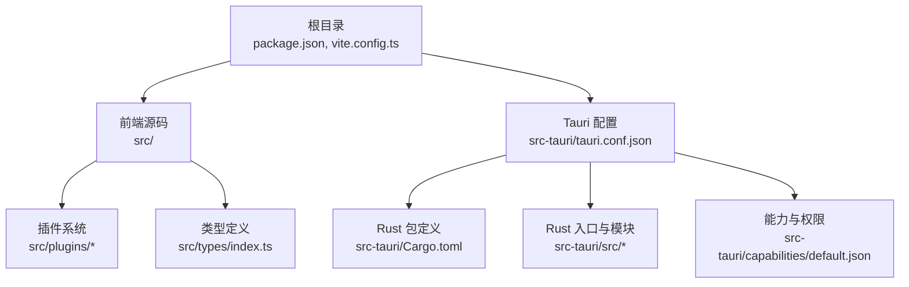
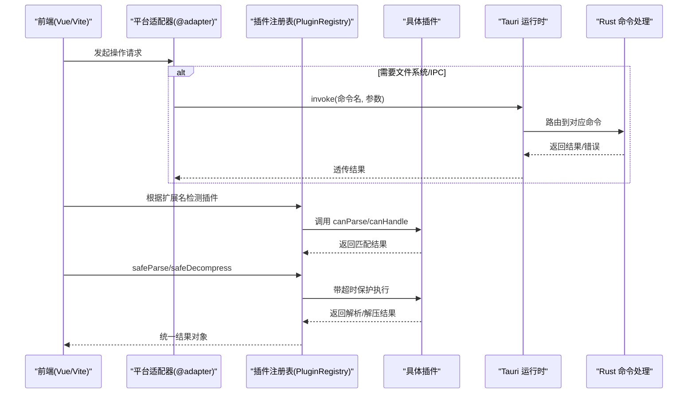
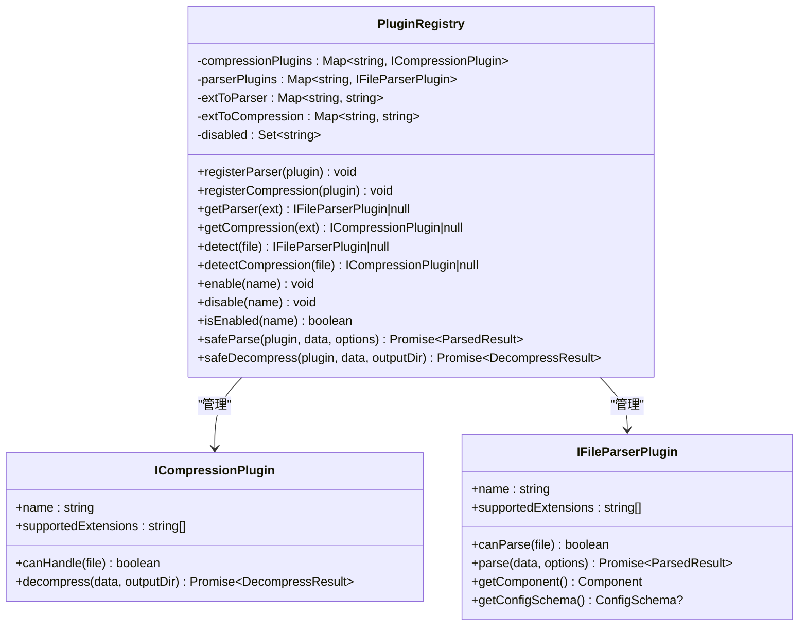
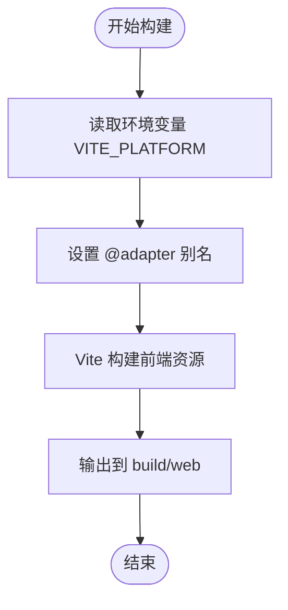
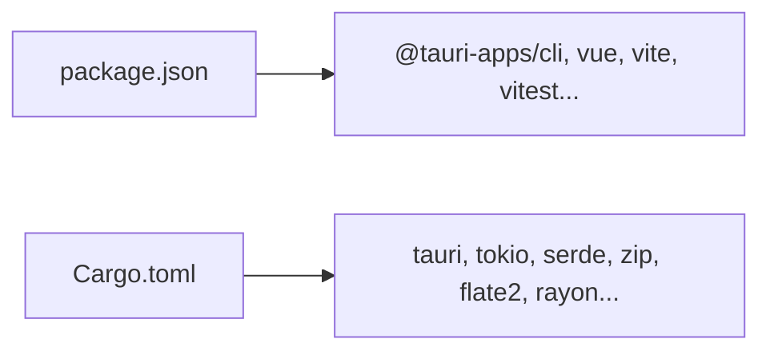

# 插件打包与分发

<cite>
**本文引用的文件**   
- [package.json](file://package.json)
- [vite.config.ts](file://vite.config.ts)
- [src-tauri/Cargo.toml](file://src-tauri/Cargo.toml)
- [src-tauri/tauri.conf.json](file://src-tauri/tauri.conf.json)
- [src-tauri/build.rs](file://src-tauri/build.rs)
- [src-tauri/src/lib.rs](file://src-tauri/src/lib.rs)
- [src-tauri/src/main.rs](file://src-tauri/src/main.rs)
- [src-tauri/capabilities/default.json](file://src-tauri/capabilities/default.json)
- [src/plugins/manifest.ts](file://src/plugins/manifest.ts)
- [src/plugins/registry.ts](file://src/plugins/registry.ts)
- [src/plugins/types.ts](file://src/plugins/types.ts)
- [src/types/index.ts](file://src/types/index.ts)
</cite>

## 目录
1. [简介](#简介)
2. [项目结构](#项目结构)
3. [核心组件](#核心组件)
4. [架构总览](#架构总览)
5. [详细组件分析](#详细组件分析)
6. [依赖分析](#依赖分析)
7. [性能考虑](#性能考虑)
8. [故障排查指南](#故障排查指南)
9. [结论](#结论)
10. [附录](#附录)

## 简介
本指南面向希望在本仓库基础上实现“插件打包与分发”的开发者，覆盖以下目标：
- 插件项目的目录结构与配置文件要求
- 依赖管理策略（前端与 Rust）
- 构建脚本编写：前端资源打包、Rust 后端编译、产物整合
- 插件签名与安全验证配置（Tauri 能力与权限）
- 发布到市场的流程（版本管理、更新机制、兼容性声明）
- 插件安装与使用手册模板
- 用户反馈与问题收集最佳实践

## 项目结构
本项目采用 Tauri 2 工程组织方式：
- 前端基于 Vue + Vite，输出静态资源至 build/web
- Rust 后端位于 src-tauri，通过 tauri.conf.json 指定前端产物路径与构建命令
- 插件系统位于 src/plugins，提供解析器与压缩器的注册与发现机制

图表来源
- [package.json:1-42](file://package.json#L1-L42)
- [vite.config.ts:1-28](file://vite.config.ts#L1-L28)
- [src-tauri/tauri.conf.json:1-31](file://src-tauri/tauri.conf.json#L1-L31)
- [src-tauri/Cargo.toml:1-19](file://src-tauri/Cargo.toml#L1-L19)
- [src-tauri/src/lib.rs:1-19](file://src-tauri/src/lib.rs#L1-L19)
- [src-tauri/capabilities/default.json:1-9](file://src-tauri/capabilities/default.json#L1-L9)
- [src/plugins/manifest.ts:1-20](file://src/plugins/manifest.ts#L1-L20)
- [src/types/index.ts:1-71](file://src/types/index.ts#L1-L71)

章节来源
- [package.json:1-42](file://package.json#L1-L42)
- [vite.config.ts:1-28](file://vite.config.ts#L1-L28)
- [src-tauri/tauri.conf.json:1-31](file://src-tauri/tauri.conf.json#L1-L31)
- [src-tauri/Cargo.toml:1-19](file://src-tauri/Cargo.toml#L1-L19)
- [src-tauri/src/lib.rs:1-19](file://src-tauri/src/lib.rs#L1-L19)
- [src-tauri/capabilities/default.json:1-9](file://src-tauri/capabilities/default.json#L1-L9)
- [src/plugins/manifest.ts:1-20](file://src/plugins/manifest.ts#L1-L20)
- [src/types/index.ts:1-71](file://src/types/index.ts#L1-L71)

## 核心组件
- 前端构建与平台适配
  - Vite 通过别名将 @adapter 指向 tauri-adapter 或 web-adapter，便于在 Tauri 与 Web 环境间切换。
  - 构建输出目录为 build/web，供 Tauri 打包时内嵌。
- Tauri 应用配置
  - tauri.conf.json 指定产品名称、标识符、窗口尺寸、前端产物路径、开发/构建前置命令以及打包图标等。
  - capabilities/default.json 定义默认能力与权限，用于限制 IPC 调用范围。
- Rust 后端
  - Cargo.toml 声明 Tauri 2 及所需依赖；build.rs 调用 tauri_build::build() 生成上下文。
  - lib.rs 注册 IPC 命令并启动 Tauri 应用。
- 插件系统
  - types.ts 定义压缩与解析插件接口、配置字段与结果类型。
  - registry.ts 提供插件注册、扩展名映射、启用/禁用、安全执行（超时与异常回退）。
  - manifest.ts 集中注册内置插件。

章节来源
- [vite.config.ts:1-28](file://vite.config.ts#L1-L28)
- [src-tauri/tauri.conf.json:1-31](file://src-tauri/tauri.conf.json#L1-L31)
- [src-tauri/capabilities/default.json:1-9](file://src-tauri/capabilities/default.json#L1-L9)
- [src-tauri/Cargo.toml:1-19](file://src-tauri/Cargo.toml#L1-L19)
- [src-tauri/build.rs:1-4](file://src-tauri/build.rs#L1-L4)
- [src-tauri/src/lib.rs:1-19](file://src-tauri/src/lib.rs#L1-L19)
- [src/plugins/types.ts:1-37](file://src/plugins/types.ts#L1-L37)
- [src/plugins/registry.ts:1-118](file://src/plugins/registry.ts#L1-L118)
- [src/plugins/manifest.ts:1-20](file://src/plugins/manifest.ts#L1-L20)

## 架构总览
下图展示从前端到 Rust 后端的调用链，以及插件注册与发现流程。

图表来源
- [vite.config.ts:12-18](file://vite.config.ts#L12-L18)
- [src-tauri/src/lib.rs:6-18](file://src-tauri/src/lib.rs#L6-L18)
- [src/plugins/registry.ts:14-118](file://src/plugins/registry.ts#L14-L118)
- [src/plugins/types.ts:16-30](file://src/plugins/types.ts#L16-L30)

## 详细组件分析

### 插件接口与注册中心
- 插件接口
  - ICompressionPlugin：描述压缩插件的能力（名称、支持扩展名、canHandle、decompress）。
  - IFileParserPlugin：描述解析插件的能力（名称、支持扩展名、canParse、parse、getComponent、可选 getConfigSchema）。
- 注册中心
  - 维护扩展名到插件名的映射，支持按扩展名检索、按文件名检测、启用/禁用、安全执行（超时与异常回退）。
  - safeParse 失败时回退为十六进制查看，提升鲁棒性。

图表来源
- [src/plugins/registry.ts:14-118](file://src/plugins/registry.ts#L14-L118)
- [src/plugins/types.ts:16-30](file://src/plugins/types.ts#L16-L30)

章节来源
- [src/plugins/types.ts:1-37](file://src/plugins/types.ts#L1-L37)
- [src/plugins/registry.ts:1-118](file://src/plugins/registry.ts#L1-L118)

### 内置插件清单
- manifest.ts 负责集中注册内置的压缩与解析插件，便于在主入口一次性加载。

章节来源
- [src/plugins/manifest.ts:1-20](file://src/plugins/manifest.ts#L1-L20)

### 前端构建与平台适配
- Vite 通过 define 注入 __PLATFORM__，并通过 alias 将 @adapter 动态指向 tauri-adapter 或 web-adapter。
- 构建输出目录为 build/web，空目录清理确保产物整洁。

图表来源
- [vite.config.ts:5-26](file://vite.config.ts#L5-L26)

章节来源
- [vite.config.ts:1-28](file://vite.config.ts#L1-L28)

### Tauri 应用与能力权限
- tauri.conf.json 指定产品元信息、窗口、前端产物路径、开发/构建前置命令、打包图标等。
- capabilities/default.json 定义默认能力与权限，控制主窗口的 IPC 访问范围。

章节来源
- [src-tauri/tauri.conf.json:1-31](file://src-tauri/tauri.conf.json#L1-L31)
- [src-tauri/capabilities/default.json:1-9](file://src-tauri/capabilities/default.json#L1-L9)

### Rust 后端与命令注册
- Cargo.toml 声明 Tauri 2 及相关依赖。
- build.rs 调用 tauri_build::build() 生成上下文。
- lib.rs 注册 IPC 命令并启动应用。

章节来源
- [src-tauri/Cargo.toml:1-19](file://src-tauri/Cargo.toml#L1-L19)
- [src-tauri/build.rs:1-4](file://src-tauri/build.rs#L1-L4)
- [src-tauri/src/lib.rs:1-19](file://src-tauri/src/lib.rs#L1-L19)
- [src-tauri/src/main.rs:1-4](file://src-tauri/src/main.rs#L1-L4)

## 依赖分析
- 前端依赖
  - package.json 定义了运行与开发依赖，包括 Tauri CLI、Vue 生态、测试工具等。
- Rust 依赖
  - Cargo.toml 引入 Tauri 2、Tokio、序列化、压缩库等。

图表来源
- [package.json:1-42](file://package.json#L1-L42)
- [src-tauri/Cargo.toml:1-19](file://src-tauri/Cargo.toml#L1-L19)

章节来源
- [package.json:1-42](file://package.json#L1-L42)
- [src-tauri/Cargo.toml:1-19](file://src-tauri/Cargo.toml#L1-L19)

## 性能考虑
- 插件执行沙箱化
  - 使用 withTimeout 对插件 parse/decompress 进行超时保护，避免阻塞主线程。
- 回退策略
  - 解析失败自动回退为十六进制视图，保证用户体验稳定。
- 构建优化
  - 使用 Vite 的 outDir 与 emptyOutDir 确保增量构建与产物整洁。
  - 按需外部化 @tauri-apps/api（Web 模式），减小包体。

章节来源
- [src/plugins/registry.ts:4-12](file://src/plugins/registry.ts#L4-L12)
- [src/plugins/registry.ts:98-116](file://src/plugins/registry.ts#L98-L116)
- [vite.config.ts:20-26](file://vite.config.ts#L20-L26)

## 故障排查指南
- 常见问题定位
  - 插件未生效：检查 manifest.ts 是否已注册，registry 中扩展名映射是否正确。
  - 解析失败：确认插件 canParse 逻辑与 supportedExtensions 一致；观察 safeParse 回退行为。
  - 解压失败：关注 safeDecompress 的错误消息与超时时间。
  - 构建失败：核对 tauri.conf.json 的 beforeBuildCommand 与前端 outDir 是否一致。
  - 权限不足：检查 capabilities/default.json 的 permissions 是否包含所需能力。
- 建议日志与调试
  - 在插件入口打印关键步骤（如扩展名匹配、输入大小、耗时）。
  - 使用 Tauri 的 invoke 错误回调捕获后端异常。

章节来源
- [src/plugins/manifest.ts:10-19](file://src/plugins/manifest.ts#L10-L19)
- [src/plugins/registry.ts:21-63](file://src/plugins/registry.ts#L21-L63)
- [src/plugins/registry.ts:98-116](file://src/plugins/registry.ts#L98-L116)
- [src-tauri/tauri.conf.json:6-11](file://src-tauri/tauri.conf.json#L6-L11)
- [src-tauri/capabilities/default.json:1-9](file://src-tauri/capabilities/default.json#L1-L9)

## 结论
通过本仓库的现有结构，可以高效地实现插件的打包与分发：
- 以 Vite 构建前端资源，Tauri 打包 Rust 后端与前端产物
- 通过插件接口与注册中心实现可扩展的解析与压缩能力
- 利用 Tauri 能力与权限模型保障安全边界
- 结合版本管理与发布流程，完成市场分发与更新

## 附录

### 构建与打包工作流（端到端）
- 本地开发
  - 运行 npm run dev 启动 Vite 开发服务器
  - 运行 npm run tauri:dev 启动 Tauri 应用，自动调用 beforeDevCommand
- 生产构建
  - 运行 npm run build 产出前端静态资源到 build/web
  - 运行 npm run tauri:build 触发 Rust 编译与打包，读取 tauri.conf.json 中的配置
- 产物位置
  - 前端：build/web
  - 桌面安装包：由 Tauri 根据 targets 与 bundle 配置生成

章节来源
- [package.json:9-18](file://package.json#L9-L18)
- [src-tauri/tauri.conf.json:6-11](file://src-tauri/tauri.conf.json#L6-L11)
- [src-tauri/tauri.conf.json:23-29](file://src-tauri/tauri.conf.json#L23-L29)

### 插件目录结构与配置文件要求
- 目录结构建议
  - src/plugins/<category>/<plugin>.ts：按功能分类存放插件实现
  - src/plugins/manifest.ts：集中注册所有内置插件
  - src/plugins/types.ts：统一的插件接口与类型定义
- 配置文件要点
  - 插件需暴露 name、supportedExtensions、canParse/canHandle、parse/decompress、getComponent（解析器）
  - 可选 getConfigSchema 用于动态生成配置表单

章节来源
- [src/plugins/types.ts:1-37](file://src/plugins/types.ts#L1-L37)
- [src/plugins/manifest.ts:10-19](file://src/plugins/manifest.ts#L10-L19)

### 依赖管理策略
- 前端
  - 使用 package.json 锁定版本，区分 dependencies 与 devDependencies
  - 通过 Vite alias 隔离平台差异，减少运行时耦合
- Rust
  - 使用 Cargo.toml 声明依赖，必要时在 build.rs 中集成代码生成
  - 针对大文件处理选择合适库（如内存映射、并行计算）

章节来源
- [package.json:20-40](file://package.json#L20-L40)
- [vite.config.ts:12-18](file://vite.config.ts#L12-L18)
- [src-tauri/Cargo.toml:6-18](file://src-tauri/Cargo.toml#L6-L18)
- [src-tauri/build.rs:1-4](file://src-tauri/build.rs#L1-L4)

### 插件签名与安全验证（Tauri 能力与权限）
- 能力与权限
  - 在 capabilities/default.json 中声明 windows 与 permissions，最小权限原则
- 签名与完整性
  - 使用 Tauri 的签名与校验机制对应用包进行签名，防止篡改
  - 在 CI 中自动化签名与校验，确保发布产物可信

章节来源
- [src-tauri/capabilities/default.json:1-9](file://src-tauri/capabilities/default.json#L1-L9)

### 发布到市场流程（版本管理、更新机制、兼容性声明）
- 版本管理
  - 同步更新 package.json 与 tauri.conf.json 的版本号，保持前后端一致
- 更新机制
  - 使用 Tauri 的更新通道与远程更新服务，配合版本号与签名校验
- 兼容性声明
  - 在发布说明中声明支持的操作系统、Tauri 版本、Node/Rust 工具链版本

章节来源
- [package.json:1-8](file://package.json#L1-L8)
- [src-tauri/tauri.conf.json:3-5](file://src-tauri/tauri.conf.json#L3-L5)

### 插件安装与使用手册模板
- 安装
  - 下载官方安装包并运行安装程序
  - 首次启动后，进入“插件管理”页面确认内置插件已启用
- 使用
  - 打开文件，系统根据扩展名自动匹配插件
  - 若解析失败，自动回退为十六进制视图
- 卸载与禁用
  - 在“插件管理”中禁用不需要的插件，或卸载自定义插件

[本节为通用模板，无需源码引用]

### 用户反馈与问题收集最佳实践
- 在应用内提供“反馈”入口，收集错误堆栈、操作步骤、系统信息
- 建立 Issue 模板，引导用户提供必要信息（版本、复现步骤、附件）
- 定期汇总高频问题，形成 FAQ 与已知问题列表

[本节为通用模板，无需源码引用]