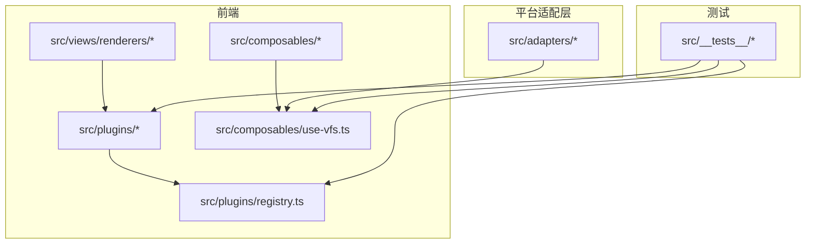
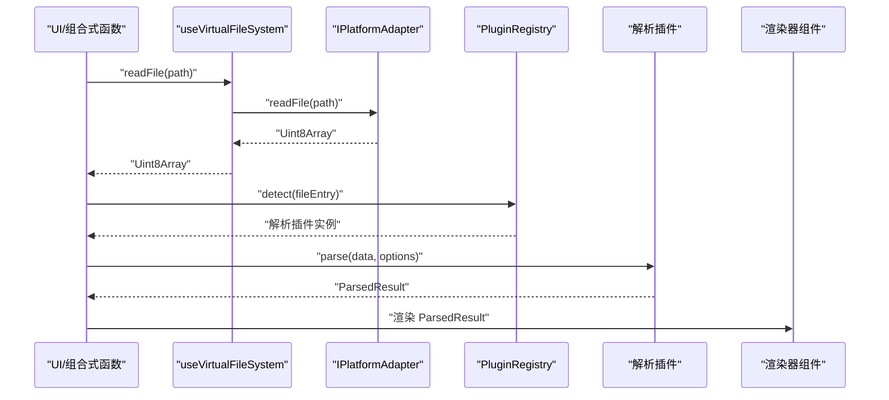
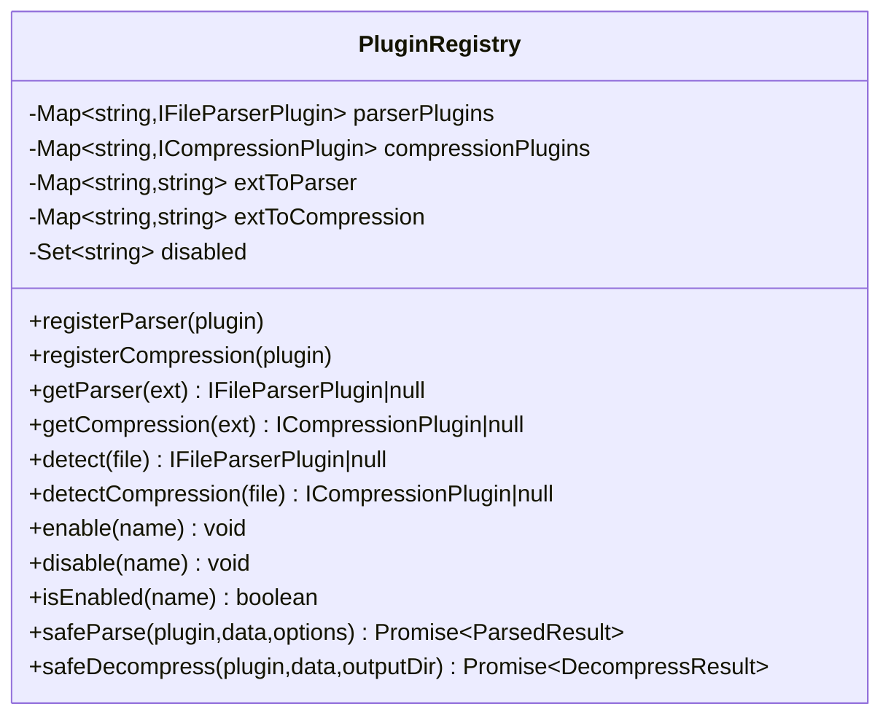
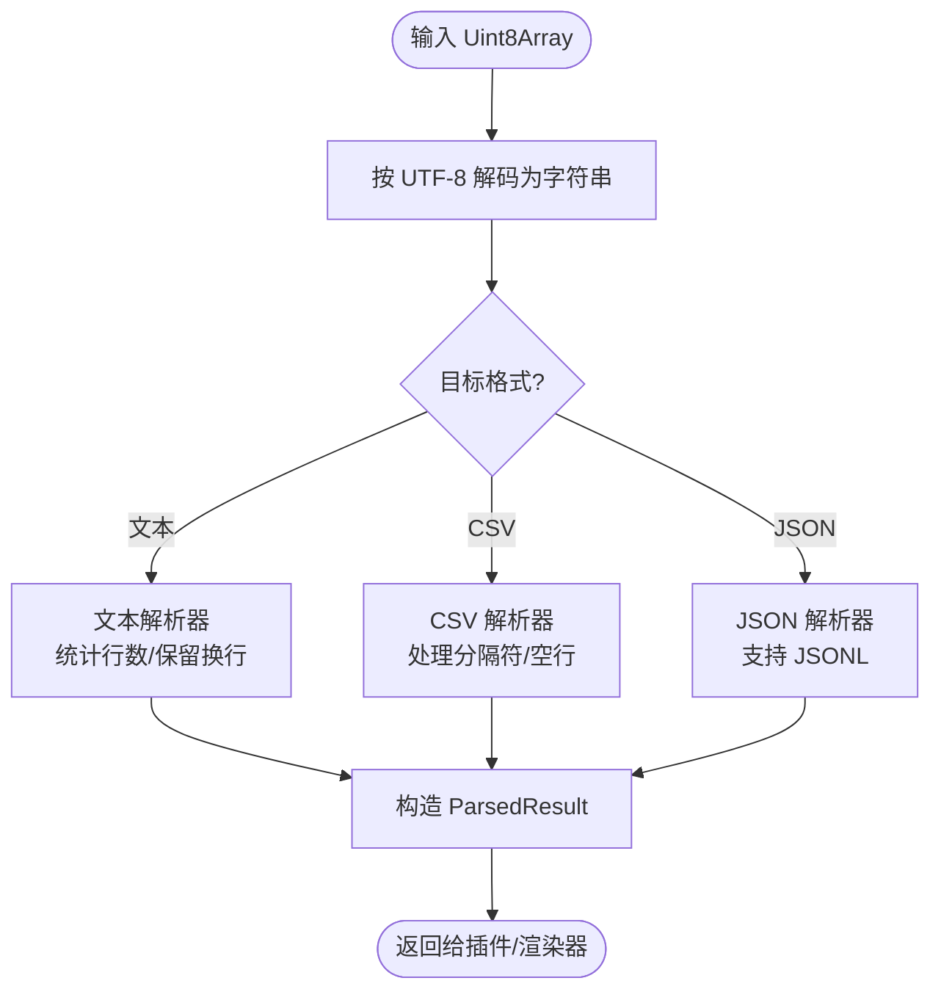
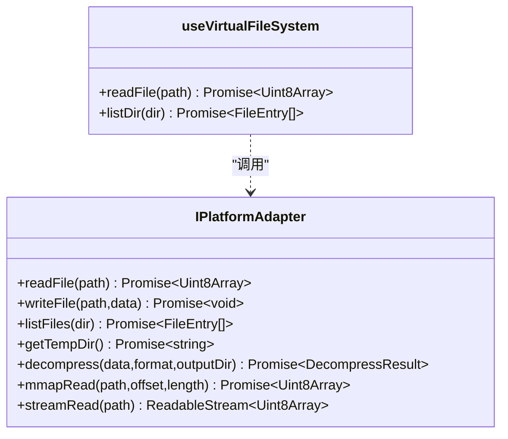
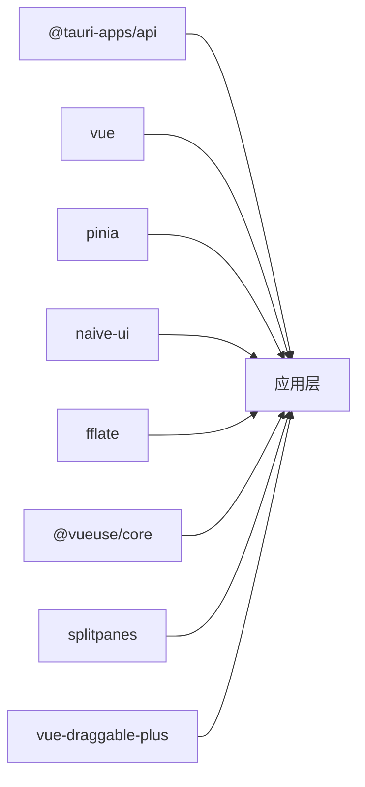
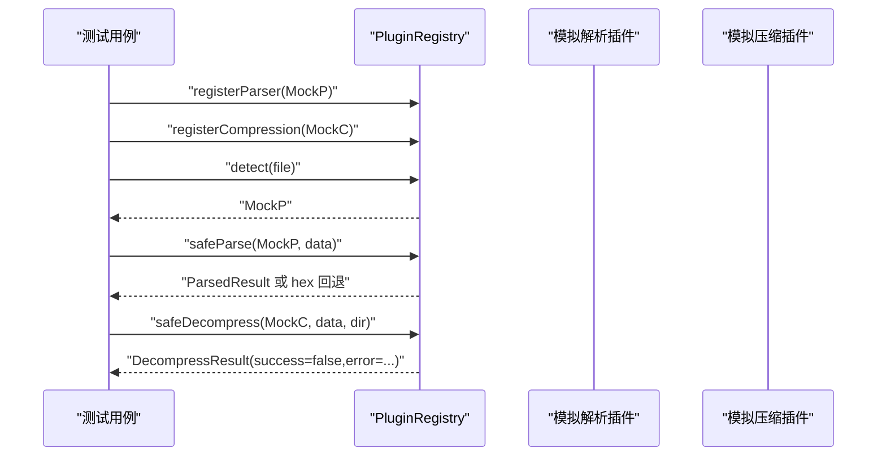

# 插件测试与调试

<cite>
**本文引用的文件**
- [README.md](file://README.md)
- [package.json](file://package.json)
- [vitest.config.ts](file://vitest.config.ts)
- [src/plugins/types.ts](file://src/plugins/types.ts)
- [src/adapters/types.ts](file://src/adapters/types.ts)
- [src/plugins/registry.ts](file://src/plugins/registry.ts)
- [src/plugins/parser/text-plugin.ts](file://src/plugins/parser/text-plugin.ts)
- [src/plugins/parser/csv-plugin.ts](file://src/plugins/parser/csv-plugin.ts)
- [src/plugins/parser/json-plugin.ts](file://src/plugins/parser/json-plugin.ts)
- [src/plugins/parsers/csv-parser.ts](file://src/plugins/parsers/csv-parser.ts)
- [src/plugins/parsers/json-parser.ts](file://src/plugins/parsers/json-parser.ts)
- [src/plugins/parsers/text-parser.ts](file://src/plugins/parsers/text-parser.ts)
- [src/views/renderers/TextRenderer.vue](file://src/views/renderers/TextRenderer.vue)
- [src/views/renderers/CsvRenderer.vue](file://src/views/renderers/CsvRenderer.vue)
- [src/views/renderers/JsonRenderer.vue](file://src/views/renderers/JsonRenderer.vue)
- [src/composables/use-vfs.ts](file://src/composables/use-vfs.ts)
- [src/core/memory-store.ts](file://src/core/memory-store.ts)
- [src/__tests__/setup.test.ts](file://src/__tests__/setup.test.ts)
- [src/__tests__/plugins/registry.test.ts](file://src/__tests__/plugins/registry.test.ts)
- [src/__tests__//plugins/parsers/csv-parser.test.ts](file://src/__tests__/plugins/parsers/csv-parser.test.ts)
- [src/__tests__/plugins/parsers/json-parser.test.ts](file://src/__tests__/plugins/parsers/json-parser.test.ts)
- [src/__tests__/plugins/text-plugin.test.ts](file://src/__tests__/plugins/text-plugin.test.ts)
- [src/__tests__/plugins/csv-plugin.test.ts](file://src/__tests__/plugins/csv-plugin.test.ts)
- [src/__tests__/plugins/json-plugin.test.ts](file://src/__tests__/plugins/json-plugin.test.ts)
</cite>

## 目录
1. [简介](#简介)
2. [项目结构](#项目结构)
3. [核心组件](#核心组件)
4. [架构总览](#架构总览)
5. [详细组件分析](#详细组件分析)
6. [依赖分析](#依赖分析)
7. [性能考虑](#性能考虑)
8. [故障排查指南](#故障排查指南)
9. [结论](#结论)
10. [附录](#附录)

## 简介
本指南面向插件开发者与调试者，围绕“单元测试、集成测试、端到端场景、调试技巧、常见问题诊断、代码质量与最佳实践”展开。项目采用 Vue 3 + Tauri 微内核架构，内置文本/CSV/JSON/Hex 解析插件与 ZIP/GZIP 压缩插件，通过注册表统一管理插件生命周期与安全执行。文档将结合现有源码与测试用例，提供可操作的步骤与图示，帮助读者快速上手并高质量地扩展插件能力。

## 项目结构
- 前端（Vue 3 + Vite）：组件、组合式函数、状态管理、渲染器与插件实现位于 src 下。
- 后端（Tauri/Rust）：IPC 命令、文件操作、解压逻辑位于 src-tauri/src。
- 测试（Vitest + jsdom）：单测与组件测试位于 src/__tests__。
- 配置：Vitest 与 Vite 相关配置在根目录 vitest.config.ts、vite.config.ts 与 package.json scripts。

图表来源
- [src/plugins/registry.ts:1-118](file://src/plugins/registry.ts#L1-L118)
- [src/composables/use-vfs.ts:1-17](file://src/composables/use-vfs.ts#L1-L17)
- [src/adapters/types.ts:1-12](file://src/adapters/types.ts#L1-L12)
- [src/plugins/parser/text-plugin.ts:1-18](file://src/plugins/parser/text-plugin.ts#L1-L18)
- [src/plugins/parser/csv-plugin.ts:1-28](file://src/plugins/parser/csv-plugin.ts#L1-L28)
- [src/plugins/parser/json-plugin.ts:1-19](file://src/plugins/parser/json-plugin.ts#L1-L19)

章节来源
- [README.md:1-140](file://README.md#L1-L140)
- [package.json:1-42](file://package.json#L1-L42)
- [vitest.config.ts:1-18](file://vitest.config.ts#L1-L18)

## 核心组件
- 插件类型定义：统一描述解析器与压缩器的接口、配置模式与解析结果结构。
- 插件注册表：负责插件注册、扩展名映射、启用/禁用、安全执行（超时保护与异常兜底）。
- 内置解析插件：text/csv/json 等，分别对接对应解析器与渲染器。
- 平台适配器：抽象文件读写、流式读取、mmap 读取与解压能力，屏蔽 Web/Tauri 差异。
- 虚拟文件系统组合式函数：封装对适配器的调用，供上层业务使用。
- 内存存储：用于测试或临时缓存的轻量 Map 存储。

章节来源
- [src/plugins/types.ts:1-37](file://src/plugins/types.ts#L1-L37)
- [src/plugins/registry.ts:1-118](file://src/plugins/registry.ts#L1-L118)
- [src/plugins/parser/text-plugin.ts:1-18](file://src/plugins/parser/text-plugin.ts#L1-L18)
- [src/plugins/parser/csv-plugin.ts:1-28](file://src/plugins/parser/csv-plugin.ts#L1-L28)
- [src/plugins/parser/json-plugin.ts:1-19](file://src/plugins/parser/json-plugin.ts#L1-L19)
- [src/adapters/types.ts:1-12](file://src/adapters/types.ts#L1-L12)
- [src/composables/use-vfs.ts:1-17](file://src/composables/use-vfs.ts#L1-L17)
- [src/core/memory-store.ts:1-25](file://src/core/memory-store.ts#L1-L25)

## 架构总览
下图展示了从文件到解析结果的端到端流程：VFS 通过平台适配器读取数据，注册表根据扩展名选择解析插件，解析器返回结构化结果，渲染器负责展示。

图表来源
- [src/composables/use-vfs.ts:1-17](file://src/composables/use-vfs.ts#L1-L17)
- [src/adapters/types.ts:1-12](file://src/adapters/types.ts#L1-L12)
- [src/plugins/registry.ts:1-118](file://src/plugins/registry.ts#L1-L118)
- [src/plugins/parser/text-plugin.ts:1-18](file://src/plugins/parser/text-plugin.ts#L1-L18)
- [src/plugins/parser/csv-plugin.ts:1-28](file://src/plugins/parser/csv-plugin.ts#L1-L28)
- [src/plugins/parser/json-plugin.ts:1-19](file://src/plugins/parser/json-plugin.ts#L1-L19)

## 详细组件分析

### 插件注册表（PluginRegistry）
- 职责：维护解析器与压缩器集合；按扩展名建立索引；支持启用/禁用；提供安全执行包装（超时与异常兜底）。
- 关键方法：registerParser/registerCompression、getParser/getCompression、detect/detectCompression、enable/disable/isEnabled、safeParse/safeDecompress。
- 超时保护：内部 withTimeout 确保插件执行不会阻塞主线程过久。
- 异常兜底：safeParse 失败时回退为 hex 视图；safeDecompress 失败返回结构化错误信息。

图表来源
- [src/plugins/registry.ts:1-118](file://src/plugins/registry.ts#L1-L118)
- [src/plugins/types.ts:1-37](file://src/plugins/types.ts#L1-L37)

章节来源
- [src/plugins/registry.ts:1-118](file://src/plugins/registry.ts#L1-L118)
- [src/plugins/types.ts:1-37](file://src/plugins/types.ts#L1-L37)

### 解析插件与解析器
- text 插件：匹配常见文本扩展名，解码后交由文本解析器，返回文本内容与行数，并绑定 TextRenderer。
- csv 插件：支持自定义分隔符，解析表头与行数据，返回 CSV 结构，并绑定 CsvRenderer。
- json 插件：支持标准 JSON 与 JSONL，解析对象/数组，返回结构化数据，并绑定 JsonRenderer。
- 解析器实现：csv-parser、json-parser、text-parser 提供纯函数式解析逻辑，便于单测覆盖。

图表来源
- [src/plugins/parser/text-plugin.ts:1-18](file://src/plugins/parser/text-plugin.ts#L1-L18)
- [src/plugins/parser/csv-plugin.ts:1-28](file://src/plugins/parser/csv-plugin.ts#L1-L28)
- [src/plugins/parser/json-plugin.ts:1-19](file://src/plugins/parser/json-plugin.ts#L1-L19)
- [src/plugins/parsers/text-parser.ts](file://src/plugins/parsers/text-parser.ts)
- [src/plugins/parsers/csv-parser.ts](file://src/plugins/parsers/csv-parser.ts)
- [src/plugins/parsers/json-parser.ts](file://src/plugins/parsers/json-parser.ts)

章节来源
- [src/plugins/parser/text-plugin.ts:1-18](file://src/plugins/parser/text-plugin.ts#L1-L18)
- [src/plugins/parser/csv-plugin.ts:1-28](file://src/plugins/parser/csv-plugin.ts#L1-L28)
- [src/plugins/parser/json-plugin.ts:1-19](file://src/plugins/parser/json-plugin.ts#L1-L19)
- [src/plugins/parsers/csv-parser.ts](file://src/plugins/parsers/csv-parser.ts)
- [src/plugins/parsers/json-parser.ts](file://src/plugins/parsers/json-parser.ts)
- [src/plugins/parsers/text-parser.ts](file://src/plugins/parsers/text-parser.ts)

### 平台适配器与虚拟文件系统
- 平台适配器接口：统一 readFile/writeFile/listFiles/decompress/mmapRead/streamRead 等能力。
- 虚拟文件系统：组合式函数 useVirtualFileSystem 获取当前平台适配器并转发调用，使上层无需关心底层差异。

图表来源
- [src/adapters/types.ts:1-12](file://src/adapters/types.ts#L1-L12)
- [src/composables/use-vfs.ts:1-17](file://src/composables/use-vfs.ts#L1-L17)

章节来源
- [src/adapters/types.ts:1-12](file://src/adapters/types.ts#L1-L12)
- [src/composables/use-vfs.ts:1-17](file://src/composables/use-vfs.ts#L1-L17)

### 渲染器组件
- 文本渲染器：展示原始文本内容，支持滚动与高亮等。
- CSV 渲染器：以表格形式展示表头与数据行，支持列宽调整与筛选。
- JSON 渲染器：树形结构展示对象/数组，支持折叠与搜索。

章节来源
- [src/views/renderers/TextRenderer.vue](file://src/views/renderers/TextRenderer.vue)
- [src/views/renderers/CsvRenderer.vue](file://src/views/renderers/CsvRenderer.vue)
- [src/views/renderers/JsonRenderer.vue](file://src/views/renderers/JsonRenderer.vue)

## 依赖分析
- 运行时依赖：Vue、Naive UI、Pinia、@vueuse/core、@tauri-apps/api、fflate、splitpanes、vue-draggable-plus。
- 开发依赖：TypeScript、Vite、@vitejs/plugin-vue、vue-tsc、Vitest、@vue/test-utils、jsdom、@tauri-apps/cli、@types/node。
- 脚本命令：dev/build/preview/test/test:watch/typecheck/tauri:*。

图表来源
- [package.json:1-42](file://package.json#L1-L42)

章节来源
- [package.json:1-42](file://package.json#L1-L42)

## 性能考虑
- 大文件友好：优先使用 mmap 零拷贝读取与流式读取，避免一次性加载整个文件到内存。
- 并发控制：任务调度器限制解压/解析并发数，防止 UI 卡顿与内存峰值过高。
- 渲染优化：虚拟滚动与分页加载减少 DOM 节点数量。
- 插件超时：注册表 safeParse/safeDecompress 提供超时保护，避免长时间阻塞。

[本节为通用指导，不直接分析具体文件]

## 故障排查指南

### 单元测试编写要点
- 模拟文件对象：构造 FileEntry 最小可用字段（name/path/size/isDirectory），用于 canParse/detect 判断。
- 模拟二进制数据：使用 TextEncoder.encode 生成 Uint8Array，或用 new Uint8Array(0) 覆盖空文件场景。
- 测试解析逻辑：针对 CSV/JSON/文本解析器进行边界用例覆盖（空行、仅表头、非法 JSON、自定义分隔符）。
- 验证输出结果：断言 type/data/lineCount 等关键字段，确保与预期一致。

章节来源
- [src/__tests__/plugins/text-plugin.test.ts:1-30](file://src/__tests__/plugins/text-plugin.test.ts#L1-L30)
- [src/__tests__/plugins/csv-plugin.test.ts:1-33](file://src/__tests__/plugins/csv-plugin.test.ts#L1-L33)
- [src/__tests__/plugins/json-plugin.test.ts:1-30](file://src/__tests__/plugins/json-plugin.test.ts#L1-L30)
- [src/__tests__/plugins/parsers/csv-parser.test.ts:1-35](file://src/__tests__/plugins/parsers/csv-parser.test.ts#L1-L35)
- [src/__tests__/plugins/parsers/json-parser.test.ts:1-41](file://src/__tests__/plugins/parsers/json-parser.test.ts#L1-L41)

### 集成测试与端到端场景
- 插件注册与检测：通过 createMockParser/createMockCompression 构造最小插件，验证 registerParser/registerCompression、getParser/getCompression、detect/detectCompression 行为。
- 安全执行路径：注入会抛错的插件，验证 safeParse 回退为 hex、safeDecompress 返回失败结构与错误消息。
- 启用/禁用：验证 enable/disable/isEnabled 对 getParser 返回值的影响。
- 端到端流程：从 useVirtualFileSystem 读取数据 → 注册表选择插件 → 解析 → 渲染器展示，可在组件测试中挂载渲染器并断言 DOM。

图表来源
- [src/__tests__/plugins/registry.test.ts:1-98](file://src/__tests__/plugins/registry.test.ts#L1-L98)
- [src/plugins/registry.ts:1-118](file://src/plugins/registry.ts#L1-L118)

章节来源
- [src/__tests__/plugins/registry.test.ts:1-98](file://src/__tests__/plugins/registry.test.ts#L1-L98)

### 调试技巧与工具
- 浏览器开发者工具：
  - Sources 面板设置断点，观察解析过程与渲染数据。
  - Performance 面板录制关键交互，定位耗时热点。
  - Memory 面板检查堆快照，识别潜在泄漏。
- Tauri 日志查看：
  - 使用 tauri dev 启动桌面端，控制台输出 Rust 侧日志与 IPC 调用栈。
  - 在命令层打印关键参数与耗时，辅助定位跨进程问题。
- 性能分析：
  - 使用 Performance 面板的 Flame Chart 对比不同插件与渲染策略。
  - 关注大文件读取路径，优先使用 mmap/streamRead。

[本节为通用指导，不直接分析具体文件]

### 常见问题诊断
- 内存泄漏：
  - 现象：长时间运行后内存持续增长。
  - 排查：Memory 面板比较前后快照，查找未释放的大对象引用；确认事件监听器与定时器清理。
- 性能瓶颈：
  - 现象：解析/渲染卡顿。
  - 排查：Performance 面板定位长任务；拆分大任务为分片；引入虚拟滚动与分页。
- 兼容性问题：
  - 现象：Web 与桌面行为不一致。
  - 排查：核对 IPlatformAdapter 实现差异；在 useVirtualFileSystem 层增加日志；补充环境分支测试。

[本节为通用指导，不直接分析具体文件]

## 结论
通过统一的插件接口与注册表机制，本项目实现了可扩展的解析与压缩能力。借助 Vitest + jsdom 的单测体系与端到端集成测试，能够保障插件质量与稳定性。配合浏览器与 Tauri 调试工具，可有效定位性能与兼容性问题。建议持续完善静态分析与代码规范，提升整体工程化水平。

[本节为总结性内容，不直接分析具体文件]

## 附录

### 测试环境与脚本
- 测试框架：Vitest，环境 jsdom，全局 API 开启。
- 别名配置：'@' 指向 src，'@adapter' 指向 web 适配器。
- 常用脚本：test/test:watch/typecheck/tauri:dev/tauri:build。

章节来源
- [vitest.config.ts:1-18](file://vitest.config.ts#L1-L18)
- [package.json:1-42](file://package.json#L1-L42)
- [src/__tests__/setup.test.ts:1-8](file://src/__tests__/setup.test.ts#L1-L8)

### 插件开发清单
- 新增解析插件：
  - 实现 IFileParserPlugin（name/supportedExtensions/canParse/parse/getComponent）。
  - 可选实现 getConfigSchema 暴露配置项。
  - 编写 canParse/parse 单测与边界用例。
  - 在注册表中注册插件并验证 detect 行为。
- 新增压缩插件：
  - 实现 ICompressionPlugin（name/supportedExtensions/canHandle/decompress）。
  - 编写 safeDecompress 异常回退用例。
- 渲染器：
  - 为每种解析结果创建对应渲染器组件，并在插件中返回。

章节来源
- [src/plugins/types.ts:1-37](file://src/plugins/types.ts#L1-L37)
- [src/plugins/parser/text-plugin.ts:1-18](file://src/plugins/parser/text-plugin.ts#L1-L18)
- [src/plugins/parser/csv-plugin.ts:1-28](file://src/plugins/parser/csv-plugin.ts#L1-L28)
- [src/plugins/parser/json-plugin.ts:1-19](file://src/plugins/parser/json-plugin.ts#L1-L19)
- [src/__tests__/plugins/text-plugin.test.ts:1-30](file://src/__tests__/plugins/text-plugin.test.ts#L1-L30)
- [src/__tests__/plugins/csv-plugin.test.ts:1-33](file://src/__tests__/plugins/csv-plugin.test.ts#L1-L33)
- [src/__tests__/plugins/json-plugin.test.ts:1-30](file://src/__tests__/plugins/json-plugin.test.ts#L1-L30)