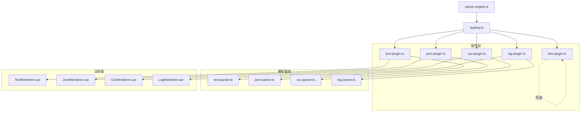
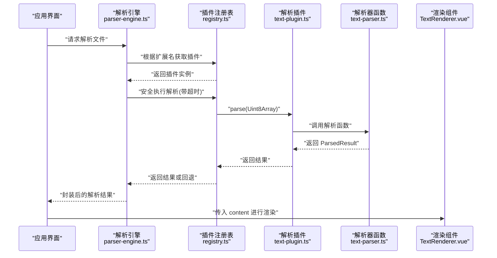
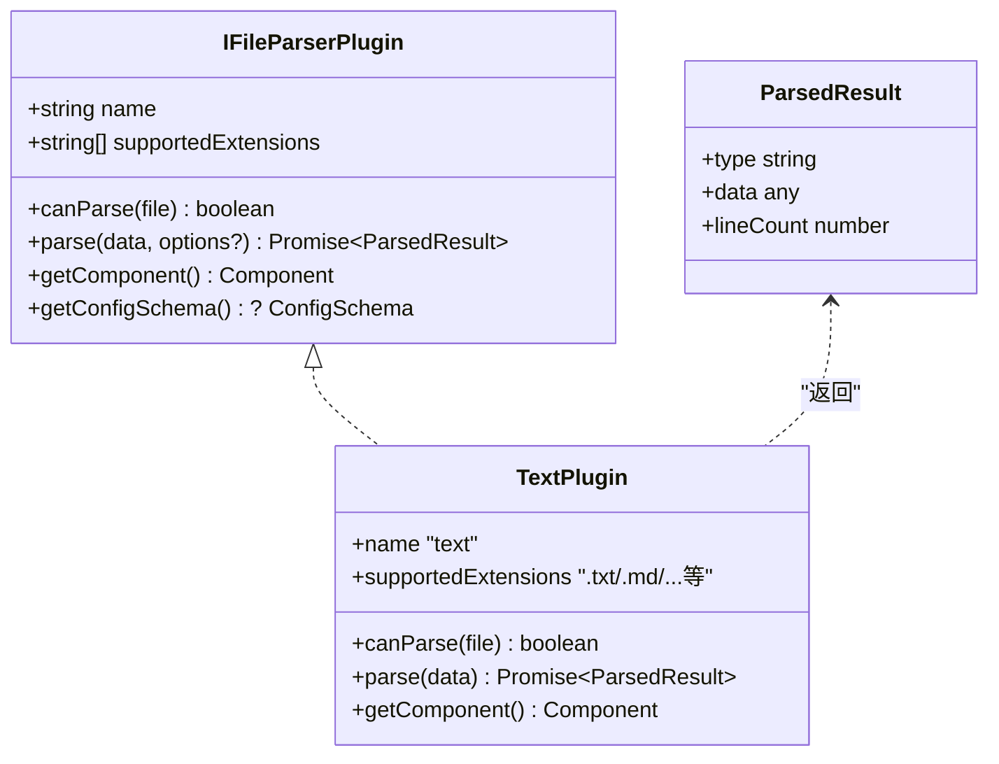
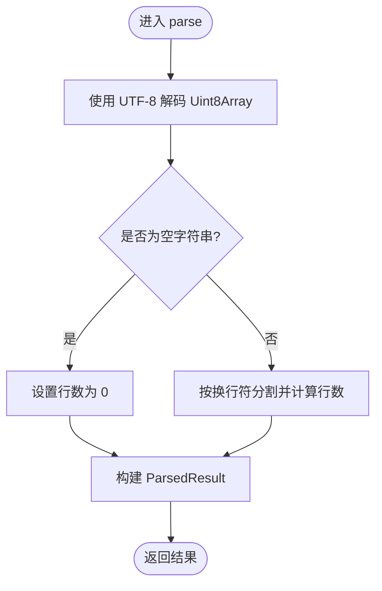
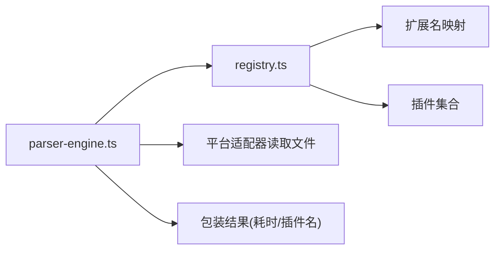

# 基础解析器实现

<cite>
**本文引用的文件**   
- [src/plugins/types.ts](file://src/plugins/types.ts)
- [src/plugins/registry.ts](file://src/plugins/registry.ts)
- [src/core/parser-engine.ts](file://src/core/parser-engine.ts)
- [src/plugins/parsers/text-parser.ts](file://src/plugins/parsers/text-parser.ts)
- [src/plugins/parser/text-plugin.ts](file://src/plugins/parser/text-plugin.ts)
- [src/views/renderers/TextRenderer.vue](file://src/views/renderers/TextRenderer.vue)
- [src/plugins/parsers/json-parser.ts](file://src/plugins/parsers/json-parser.ts)
- [src/plugins/parser/json-plugin.ts](file://src/plugins/parser/json-plugin.ts)
- [src/views/renderers/JsonRenderer.vue](file://src/views/renderers/JsonRenderer.vue)
- [src/plugins/parsers/csv-parser.ts](file://src/plugins/parsers/csv-parser.ts)
- [src/plugins/parser/csv-plugin.ts](file://src/plugins/parser/csv-plugin.ts)
- [src/views/renderers/CsvRenderer.vue](file://src/views/renderers/CsvRenderer.vue)
- [src/plugins/parsers/log-parser.ts](file://src/plugins/parsers/log-parser.ts)
- [src/plugins/parser/log-plugin.ts](file://src/plugins/parser/log-plugin.ts)
- [src/views/renderers/LogRenderer.vue](file://src/views/renderers/LogRenderer.vue)
- [src/plugins/parser/hex-plugin.ts](file://src/plugins/parser/hex-plugin.ts)
</cite>

## 目录
1. [简介](#简介)
2. [项目结构](#项目结构)
3. [核心组件](#核心组件)
4. [架构总览](#架构总览)
5. [详细组件分析](#详细组件分析)
6. [依赖关系分析](#依赖关系分析)
7. [性能考虑](#性能考虑)
8. [故障排查指南](#故障排查指南)
9. [结论](#结论)
10. [附录](#附录)

## 简介
本教程面向希望快速上手“基础解析器插件”的开发者，围绕 IFileParserPlugin 接口展开，从最简单的文本解析器入手，系统讲解：
- canParse 的文件扩展名匹配策略与内容检测思路
- supportedExtensions 的配置规范与最佳实践
- parse 方法的数据处理流程（Uint8Array 解码、字符编码、错误边界）
- getComponent 如何集成自定义渲染组件
- 结合注册表与引擎的安全解析与超时保护机制

通过循序渐进的图示与路径化代码片段指引，帮助读者建立完整的插件开发认知。

## 项目结构
本项目采用“插件 + 解析器 + 渲染器”的分层组织方式：
- 插件定义位于 src/plugins/parser/*，实现 IFileParserPlugin 接口
- 具体解析逻辑位于 src/plugins/parsers/*，提供纯函数式解析能力
- 渲染组件位于 src/views/renderers/*，负责将解析结果可视化
- 插件注册与调度由 src/plugins/registry.ts 管理
- 解析引擎在 src/core/parser-engine.ts 中编排读取、选择插件、安全执行与结果封装

图表来源
- [src/plugins/parser/text-plugin.ts:1-18](file://src/plugins/parser/text-plugin.ts#L1-L18)
- [src/plugins/parser/json-plugin.ts:1-19](file://src/plugins/parser/json-plugin.ts#L1-L19)
- [src/plugins/parser/csv-plugin.ts:1-28](file://src/plugins/parser/csv-plugin.ts#L1-L28)
- [src/plugins/parser/log-plugin.ts:1-18](file://src/plugins/parser/log-plugin.ts#L1-L18)
- [src/plugins/parser/hex-plugin.ts:1-53](file://src/plugins/parser/hex-plugin.ts#L1-L53)
- [src/plugins/parsers/text-parser.ts:1-8](file://src/plugins/parsers/text-parser.ts#L1-L8)
- [src/plugins/parsers/json-parser.ts:1-17](file://src/plugins/parsers/json-parser.ts#L1-L17)
- [src/plugins/parsers/csv-parser.ts:1-17](file://src/plugins/parsers/csv-parser.ts#L1-L17)
- [src/plugins/parsers/log-parser.ts:1-37](file://src/plugins/parsers/log-parser.ts#L1-L37)
- [src/plugins/registry.ts:1-96](file://src/plugins/registry.ts#L1-L96)
- [src/core/parser-engine.ts:1-34](file://src/core/parser-engine.ts#L1-L34)

章节来源
- [src/plugins/types.ts:23-30](file://src/plugins/types.ts#L23-L30)
- [src/plugins/registry.ts:14-96](file://src/plugins/registry.ts#L14-L96)
- [src/core/parser-engine.ts:5-34](file://src/core/parser-engine.ts#L5-L34)

## 核心组件
本节聚焦 IFileParserPlugin 接口的关键方法与约定，并结合文本插件给出最小可运行示例的路径指引。

- 接口要点
  - name: 插件唯一标识
  - supportedExtensions: 支持的扩展名数组，用于快速匹配
  - canParse(file): 基于文件名或可选内容检测决定是否能解析
  - parse(data, options?): 接收 Uint8Array 二进制数据，返回 ParsedResult
  - getComponent(): 返回 Vue 组件以渲染解析结果
  - getConfigSchema?(): 可选配置模式，用于动态生成配置表单

- 文本插件示例（最小实现）
  - 插件入口：[src/plugins/parser/text-plugin.ts:1-18](file://src/plugins/parser/text-plugin.ts#L1-L18)
  - 解析器函数：[src/plugins/parsers/text-parser.ts:1-8](file://src/plugins/parsers/text-parser.ts#L1-L8)
  - 渲染组件：[src/views/renderers/TextRenderer.vue:1-38](file://src/views/renderers/TextRenderer.vue#L1-L38)

章节来源
- [src/plugins/types.ts:23-30](file://src/plugins/types.ts#L23-L30)
- [src/plugins/parser/text-plugin.ts:1-18](file://src/plugins/parser/text-plugin.ts#L1-L18)
- [src/plugins/parsers/text-parser.ts:1-8](file://src/plugins/parsers/text-parser.ts#L1-L8)
- [src/views/renderers/TextRenderer.vue:1-38](file://src/views/renderers/TextRenderer.vue#L1-L38)

## 架构总览
下图展示了从文件读取到渲染的完整调用链，以及插件注册与安全解析的关键环节。

图表来源
- [src/core/parser-engine.ts:11-33](file://src/core/parser-engine.ts#L11-L33)
- [src/plugins/registry.ts:21-54](file://src/plugins/registry.ts#L21-L54)
- [src/plugins/parser/text-plugin.ts:11-16](file://src/plugins/parser/text-plugin.ts#L11-L16)
- [src/plugins/parsers/text-parser.ts:3-7](file://src/plugins/parsers/text-parser.ts#L3-L7)
- [src/views/renderers/TextRenderer.vue:1-38](file://src/views/renderers/TextRenderer.vue#L1-L38)

## 详细组件分析

### IFileParserPlugin 接口与类型契约
- 接口定义包含名称、扩展名列表、匹配判定、解析主流程、渲染组件注入与可选配置模式
- 解析结果统一为 ParsedResult，包含 type、data 与可选 lineCount

图表来源
- [src/plugins/types.ts:23-36](file://src/plugins/types.ts#L23-L36)
- [src/plugins/parser/text-plugin.ts:5-16](file://src/plugins/parser/text-plugin.ts#L5-L16)

章节来源
- [src/plugins/types.ts:23-36](file://src/plugins/types.ts#L23-L36)

### 文本解析器（最简入门）
- 扩展名匹配策略
  - 使用 supportedExtensions 数组声明支持的后缀
  - canParse 通过 endsWith 判断文件名是否以任一后缀结尾
  - 参考路径：[src/plugins/parser/text-plugin.ts:7-10](file://src/plugins/parser/text-plugin.ts#L7-L10)
- 二进制解码与字符编码
  - parse 接收 Uint8Array，使用 TextDecoder('utf-8') 解码为字符串
  - 参考路径：[src/plugins/parsers/text-parser.ts:4-5](file://src/plugins/parsers/text-parser.ts#L4-L5)
- 行计数与空文件边界
  - 空字符串时行数为 0；否则按换行符分割统计行数
  - 参考路径：[src/plugins/parsers/text-parser.ts:5-6](file://src/plugins/parsers/text-parser.ts#L5-L6)
- 渲染组件集成
  - getComponent 返回 TextRenderer 组件，用于逐行展示
  - 参考路径：[src/plugins/parser/text-plugin.ts:14-16](file://src/plugins/parser/text-plugin.ts#L14-L16)、[src/views/renderers/TextRenderer.vue:1-38](file://src/views/renderers/TextRenderer.vue#L1-L38)

图表来源
- [src/plugins/parsers/text-parser.ts:3-7](file://src/plugins/parsers/text-parser.ts#L3-L7)

章节来源
- [src/plugins/parser/text-plugin.ts:7-16](file://src/plugins/parser/text-plugin.ts#L7-L16)
- [src/plugins/parsers/text-parser.ts:3-7](file://src/plugins/parsers/text-parser.ts#L3-L7)
- [src/views/renderers/TextRenderer.vue:1-38](file://src/views/renderers/TextRenderer.vue#L1-L38)

### JSON 解析器（含容错与格式化）
- 扩展名匹配：支持 .json 与 .jsonl
  - 参考路径：[src/plugins/parser/json-plugin.ts:7-9](file://src/plugins/parser/json-plugin.ts#L7-L9)
- 解码与解析流程
  - 先尝试标准 JSON.parse；失败则按行解析为 JSON Lines
  - 若均失败抛出错误，供上层安全解析捕获
  - 参考路径：[src/plugins/parsers/json-parser.ts:3-16](file://src/plugins/parsers/json-parser.ts#L3-L16)
- 渲染组件
  - 返回 JsonRenderer，递归展示节点树
  - 参考路径：[src/plugins/parser/json-plugin.ts:15-17](file://src/plugins/parser/json-plugin.ts#L15-L17)、[src/views/renderers/JsonRenderer.vue:1-30](file://src/views/renderers/JsonRenderer.vue#L1-L30)

章节来源
- [src/plugins/parser/json-plugin.ts:7-17](file://src/plugins/parser/json-plugin.ts#L7-L17)
- [src/plugins/parsers/json-parser.ts:3-16](file://src/plugins/parsers/json-parser.ts#L3-L16)
- [src/views/renderers/JsonRenderer.vue:1-30](file://src/views/renderers/JsonRenderer.vue#L1-L30)

### CSV 解析器（可配置分隔符）
- 扩展名匹配：支持 .csv 与 .tsv
  - 参考路径：[src/plugins/parser/csv-plugin.ts:7-9](file://src/plugins/parser/csv-plugin.ts#L7-L9)
- 解析流程
  - 过滤空行后取首行为表头，后续行为数据行
  - 支持通过 options.delimiter 指定分隔符
  - 参考路径：[src/plugins/parser/csv-plugin.ts:11-14](file://src/plugins/parser/csv-plugin.ts#L11-L14)、[src/plugins/parsers/csv-parser.ts:8-16](file://src/plugins/parsers/csv-parser.ts#L8-L16)
- 渲染组件
  - 返回 CsvRenderer，展示表格视图
  - 参考路径：[src/plugins/parser/csv-plugin.ts:16-18](file://src/plugins/parser/csv-plugin.ts#L16-L18)、[src/views/renderers/CsvRenderer.vue:1-52](file://src/views/renderers/CsvRenderer.vue#L1-L52)
- 配置模式
  - 提供 getConfigSchema 动态生成配置项（如分隔符、固定表头等）
  - 参考路径：[src/plugins/parser/csv-plugin.ts:19-26](file://src/plugins/parser/csv-plugin.ts#L19-L26)

章节来源
- [src/plugins/parser/csv-plugin.ts:7-26](file://src/plugins/parser/csv-plugin.ts#L7-L26)
- [src/plugins/parsers/csv-parser.ts:8-16](file://src/plugins/parsers/csv-parser.ts#L8-L16)
- [src/views/renderers/CsvRenderer.vue:1-52](file://src/views/renderers/CsvRenderer.vue#L1-L52)

### 日志解析器（结构化日志）
- 扩展名匹配：支持 .log
  - 参考路径：[src/plugins/parser/log-plugin.ts:7-9](file://src/plugins/parser/log-plugin.ts#L7-L9)
- 解析流程
  - 使用正则提取时间戳、级别、模块与消息
  - 非匹配行标记为 OTHER 并保留原始行
  - 参考路径：[src/plugins/parsers/log-parser.ts:11-35](file://src/plugins/parsers/log-parser.ts#L11-L35)
- 渲染组件
  - 返回 LogRenderer，按列展示并高亮级别
  - 参考路径：[src/plugins/parser/log-plugin.ts:14-16](file://src/plugins/parser/log-plugin.ts#L14-L16)、[src/views/renderers/LogRenderer.vue:1-57](file://src/views/renderers/LogRenderer.vue#L1-L57)

章节来源
- [src/plugins/parser/log-plugin.ts:7-16](file://src/plugins/parser/log-plugin.ts#L7-L16)
- [src/plugins/parsers/log-parser.ts:11-35](file://src/plugins/parsers/log-parser.ts#L11-L35)
- [src/views/renderers/LogRenderer.vue:1-57](file://src/views/renderers/LogRenderer.vue#L1-L57)

### 十六进制回退解析器（通用兜底）
- 设计目标
  - 当其他解析器失败时，作为回退显示原始字节
- 特性
  - canParse 始终返回 true，确保兜底命中
  - 直接返回原始 Uint8Array 数据，渲染为十六进制视图
  - 参考路径：[src/plugins/parser/hex-plugin.ts:36-52](file://src/plugins/parser/hex-plugin.ts#L36-L52)

章节来源
- [src/plugins/parser/hex-plugin.ts:36-52](file://src/plugins/parser/hex-plugin.ts#L36-L52)

## 依赖关系分析
- 插件与解析器解耦：插件仅负责扩展名匹配、参数传递与组件绑定，具体解析逻辑下沉至 parsers 目录
- 注册表集中管理：按扩展名索引插件，提供 detect/getParser 等方法
- 引擎编排：读取文件、选择插件、安全执行、封装结果并附带耗时信息

图表来源
- [src/plugins/registry.ts:14-54](file://src/plugins/registry.ts#L14-L54)
- [src/core/parser-engine.ts:11-33](file://src/core/parser-engine.ts#L11-L33)

章节来源
- [src/plugins/registry.ts:14-96](file://src/plugins/registry.ts#L14-L96)
- [src/core/parser-engine.ts:5-34](file://src/core/parser-engine.ts#L5-L34)

## 性能考虑
- 大文件处理
  - 避免一次性全量加载到内存；对超大文本建议流式或分块处理
- 解码与正则
  - 优先使用原生 TextDecoder；正则表达式尽量复用编译结果
- 渲染优化
  - 大数据集使用虚拟滚动或分页渲染
- 超时保护
  - 注册表提供超时控制，防止阻塞主线程

## 故障排查指南
- 常见问题
  - 无法匹配扩展名：检查 supportedExtensions 是否包含目标后缀，且 canParse 使用 endsWith 正确匹配
  - 乱码问题：确认使用正确的字符编码（默认 UTF-8），必要时提供编码选项
  - 解析异常：利用安全解析的回退机制（如十六进制回退），并在日志中记录错误上下文
  - 渲染空白：确认 getComponent 返回的组件 props 与解析结果 data 结构一致
- 定位步骤
  - 查看解析器抛出的错误信息
  - 验证 registry.detect/getParser 是否正确返回插件
  - 检查渲染组件 props 类型是否与 ParsedResult.data 对齐

章节来源
- [src/plugins/parser/text-plugin.ts:7-10](file://src/plugins/parser/text-plugin.ts#L7-L10)
- [src/plugins/parser/json-plugin.ts:11-13](file://src/plugins/parser/json-plugin.ts#L11-L13)
- [src/plugins/parser/csv-plugin.ts:11-14](file://src/plugins/parser/csv-plugin.ts#L11-L14)
- [src/plugins/parser/log-plugin.ts:11-12](file://src/plugins/parser/log-plugin.ts#L11-L12)
- [src/plugins/parser/hex-plugin.ts:39-47](file://src/plugins/parser/hex-plugin.ts#L39-L47)

## 结论
通过 IFileParserPlugin 的统一契约，项目实现了可扩展、可回退、可配置的解析体系。从文本插件的最小实现出发，读者可以逐步扩展到 JSON、CSV、日志等复杂格式，并通过注册表与引擎获得统一的调度与安全保障。遵循本文的最佳实践，能够快速构建稳定可靠的解析器插件。

## 附录
- 最佳实践清单
  - 明确 supportedExtensions，避免冲突
  - canParse 仅做轻量判断，重逻辑放在 parse
  - 统一使用 UTF-8 解码，必要时暴露编码选项
  - 为每个插件提供专用渲染组件，保证类型安全
  - 使用安全解析与超时保护，提升健壮性
  - 为大文件准备流式或分页渲染方案
- 相关路径速查
  - 接口定义：[src/plugins/types.ts:23-36](file://src/plugins/types.ts#L23-L36)
  - 文本插件：[src/plugins/parser/text-plugin.ts:1-18](file://src/plugins/parser/text-plugin.ts#L1-L18)
  - 文本解析器：[src/plugins/parsers/text-parser.ts:1-8](file://src/plugins/parsers/text-parser.ts#L1-L8)
  - 文本渲染器：[src/views/renderers/TextRenderer.vue:1-38](file://src/views/renderers/TextRenderer.vue#L1-L38)
  - JSON 插件与解析器：[src/plugins/parser/json-plugin.ts:1-19](file://src/plugins/parser/json-plugin.ts#L1-L19)、[src/plugins/parsers/json-parser.ts:1-17](file://src/plugins/parsers/json-parser.ts#L1-L17)
  - CSV 插件与解析器：[src/plugins/parser/csv-plugin.ts:1-28](file://src/plugins/parser/csv-plugin.ts#L1-L28)、[src/plugins/parsers/csv-parser.ts:1-17](file://src/plugins/parsers/csv-parser.ts#L1-L17)
  - 日志插件与解析器：[src/plugins/parser/log-plugin.ts:1-18](file://src/plugins/parser/log-plugin.ts#L1-L18)、[src/plugins/parsers/log-parser.ts:1-37](file://src/plugins/parsers/log-parser.ts#L1-L37)
  - 十六进制回退：[src/plugins/parser/hex-plugin.ts:1-53](file://src/plugins/parser/hex-plugin.ts#L1-L53)
  - 注册表与引擎：[src/plugins/registry.ts:1-96](file://src/plugins/registry.ts#L1-L96)、[src/core/parser-engine.ts:1-34](file://src/core/parser-engine.ts#L1-L34)