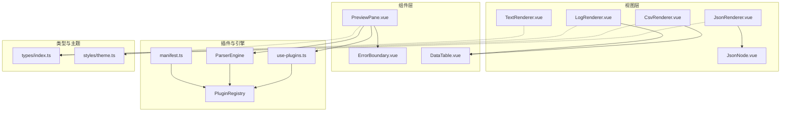
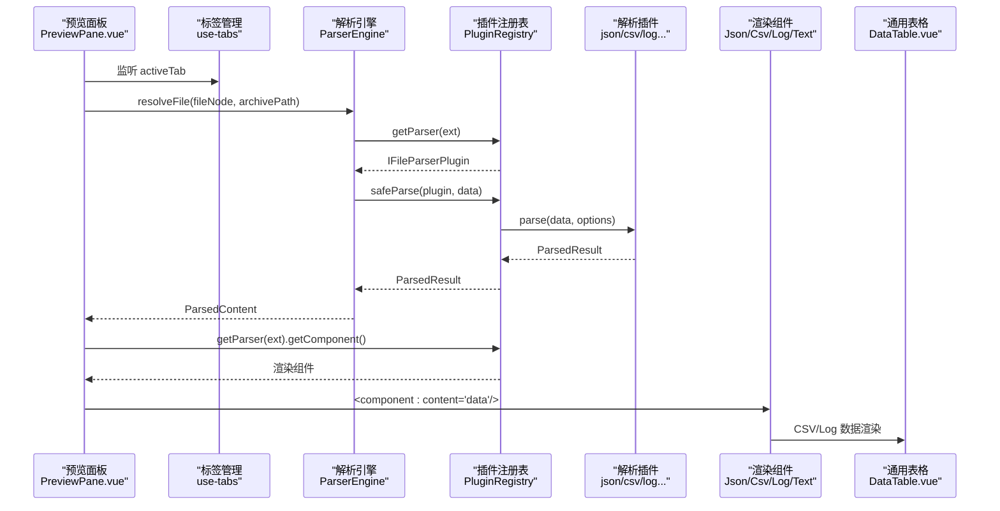
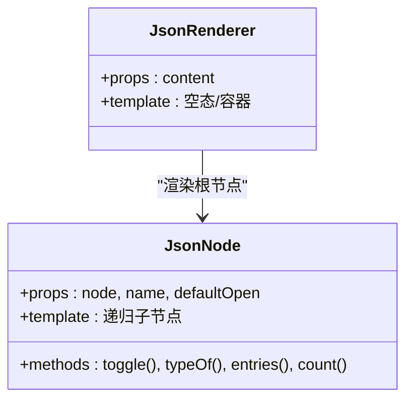
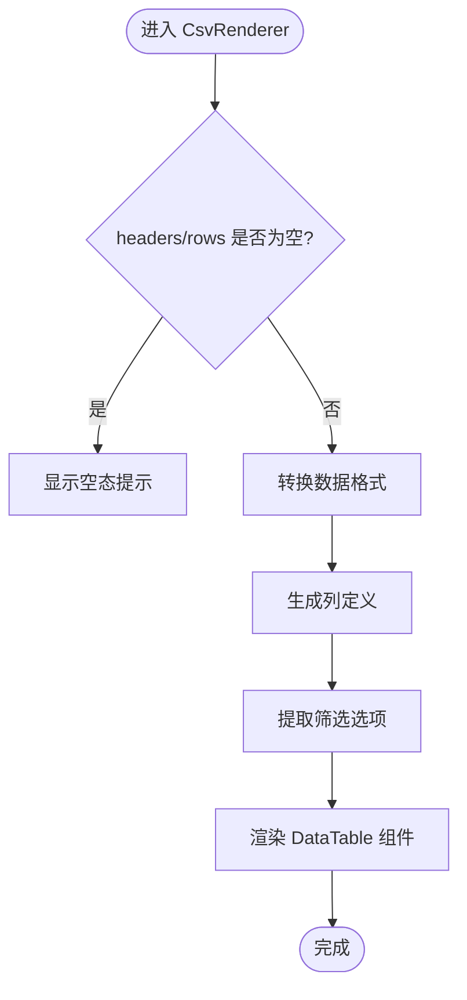
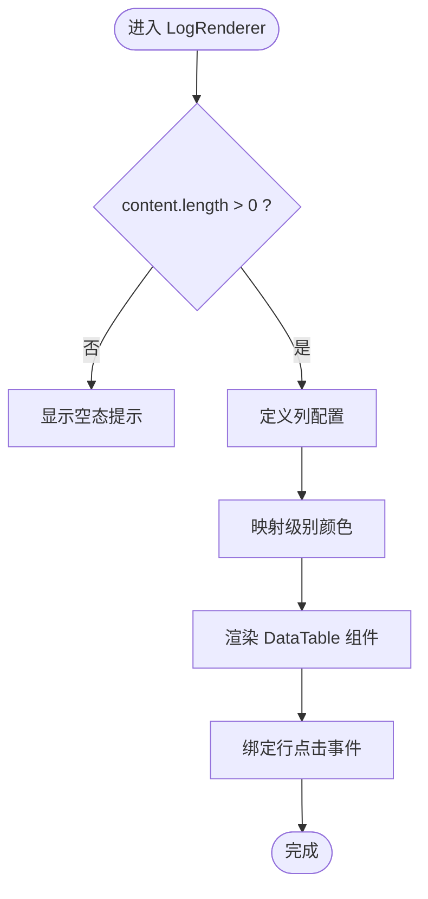
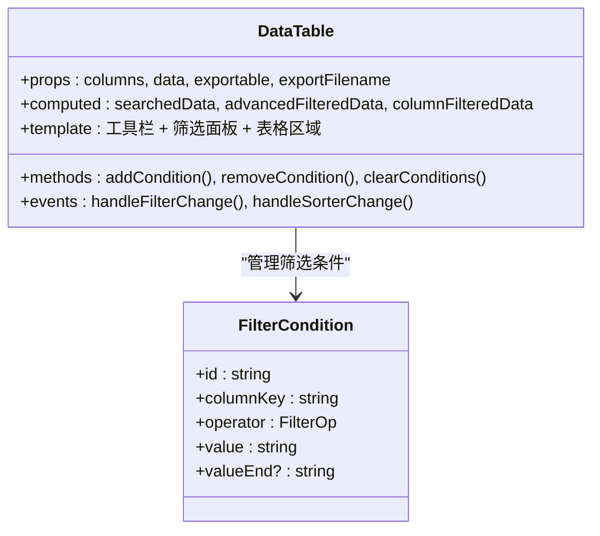
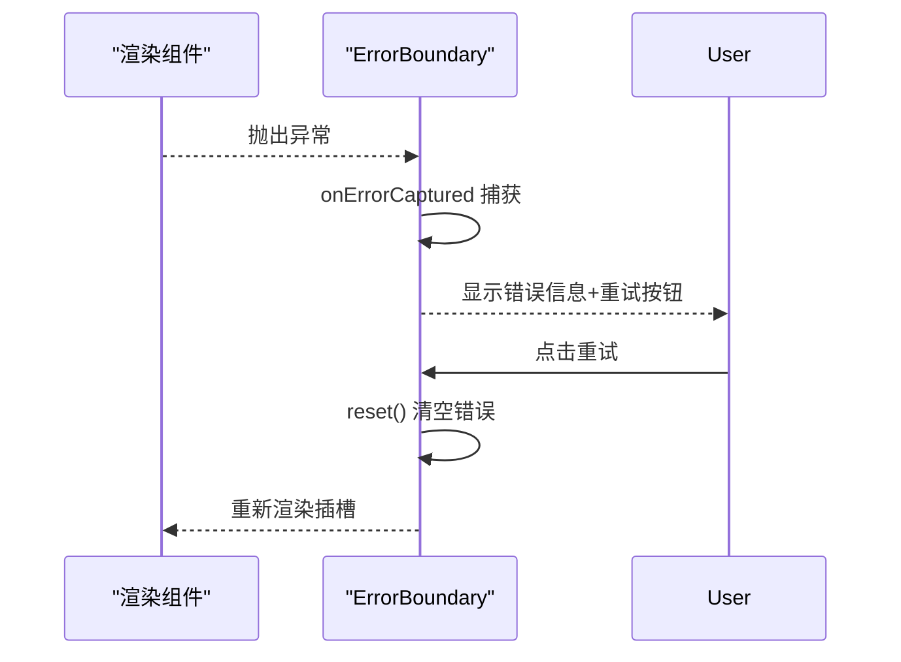
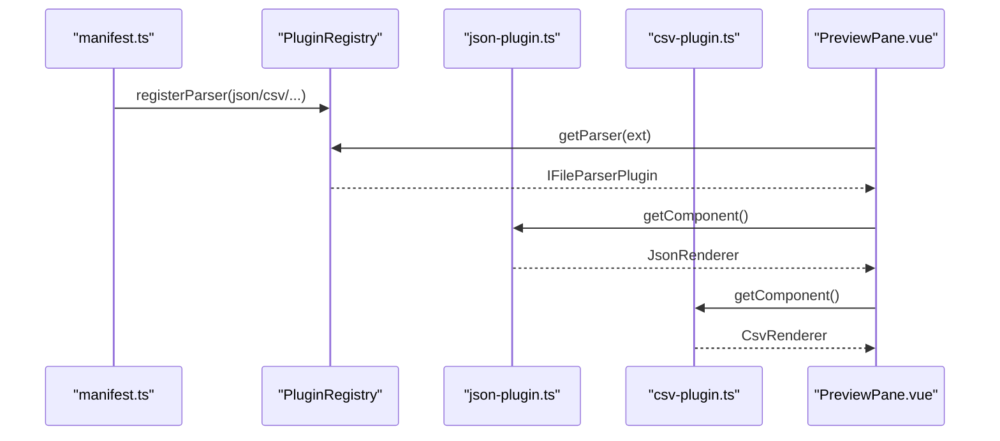
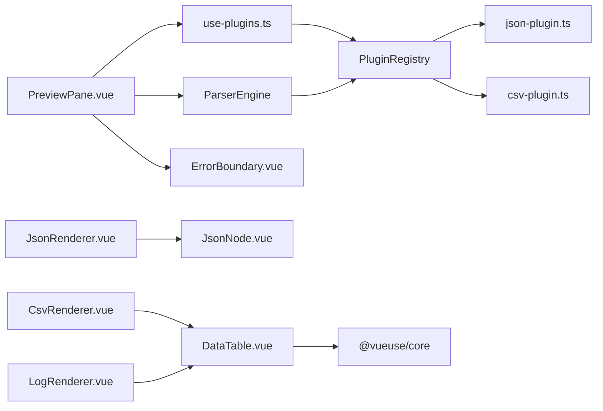

# 渲染器集成

<cite>
**本文引用的文件**   
- [src/views/renderers/index.ts](file://src/views/renderers/index.ts)
- [src/views/renderers/JsonRenderer.vue](file://src/views/renderers/JsonRenderer.vue)
- [src/views/renderers/JsonNode.vue](file://src/views/renderers/JsonNode.vue)
- [src/views/renderers/CsvRenderer.vue](file://src/views/renderers/CsvRenderer.vue)
- [src/views/renderers/LogRenderer.vue](file://src/views/renderers/LogRenderer.vue)
- [src/views/renderers/TextRenderer.vue](file://src/views/renderers/TextRenderer.vue)
- [src/components/shared/ErrorBoundary.vue](file://src/components/shared/ErrorBoundary.vue)
- [src/components/shared/DataTable.vue](file://src/components/shared/DataTable.vue)
- [src/components/workspace/PreviewPane.vue](file://src/components/workspace/PreviewPane.vue)
- [src/composables/use-plugins.ts](file://src/composables/use-plugins.ts)
- [src/plugins/registry.ts](file://src/plugins/registry.ts)
- [src/core/parser-engine.ts](file://src/core/parser-engine.ts)
- [src/types/index.ts](file://src/types/index.ts)
- [src/styles/theme.ts](file://src/styles/theme.ts)
- [src/plugins/parsers/types.ts](file://src/plugins/parsers/types.ts)
- [src/plugins/parser/json-plugin.ts](file://src/plugins/parser/json-plugin.ts)
- [src/plugins/parser/csv-plugin.ts](file://src/plugins/parser/csv-plugin.ts)
- [src/plugins/manifest.ts](file://src/plugins/manifest.ts)
</cite>

## 更新摘要
**变更内容**   
- CsvRenderer 和 LogRenderer 已重构为使用新的 DataTable 组件
- 新增通用 DataTable 组件，提供增强的数据可视化功能
- 支持智能列配置、日志级别颜色编码和专用渲染特性
- 增强了表格的搜索、筛选、排序和导出功能

## 目录
1. [简介](#简介)
2. [项目结构](#项目结构)
3. [核心组件](#核心组件)
4. [架构总览](#架构总览)
5. [详细组件分析](#详细组件分析)
6. [依赖关系分析](#依赖关系分析)
7. [性能考虑](#性能考虑)
8. [故障排查指南](#故障排查指南)
9. [结论](#结论)
10. [附录](#附录)

## 简介
本教程面向为解析器创建配套 Vue 3 渲染组件的开发者，系统讲解如何完成"解析器—渲染器"的集成。内容涵盖：
- 组件接口定义与数据绑定模式
- 事件处理机制（可扩展）
- 响应式数据展示：树形结构、表格、日志高亮
- **新增**：通用 DataTable 组件的强大功能
- 错误边界集成与重试机制
- 主题适配与样式定制（含明暗主题切换思路）
- 可访问性（a11y）最佳实践与键盘导航支持

## 项目结构
本项目采用"插件注册 + 引擎调度 + 动态渲染"的分层设计：
- 视图层：各格式对应的渲染组件位于 views/renderers
- 组件层：通用能力如错误边界和**通用表格组件**位于 components/shared
- 编排层：预览面板负责根据当前标签页选择并挂载对应渲染器
- 插件层：解析器插件通过 registry 注册，提供解析逻辑与渲染组件
- 类型与主题：统一类型定义与全局主题覆盖

**图示来源**
- [src/views/renderers/JsonRenderer.vue:1-30](file://src/views/renderers/JsonRenderer.vue#L1-L30)
- [src/views/renderers/JsonNode.vue:1-89](file://src/views/renderers/JsonNode.vue#L1-L89)
- [src/views/renderers/CsvRenderer.vue:1-69](file://src/views/renderers/CsvRenderer.vue#L1-L69)
- [src/views/renderers/LogRenderer.vue:1-78](file://src/views/renderers/LogRenderer.vue#L1-L78)
- [src/views/renderers/TextRenderer.vue:1-38](file://src/views/renderers/TextRenderer.vue#L1-L38)
- [src/components/shared/ErrorBoundary.vue:1-30](file://src/components/shared/ErrorBoundary.vue#L1-L30)
- [src/components/shared/DataTable.vue:1-607](file://src/components/shared/DataTable.vue#L1-L607)
- [src/components/workspace/PreviewPane.vue:1-58](file://src/components/workspace/PreviewPane.vue#L1-L58)
- [src/composables/use-plugins.ts:1-17](file://src/composables/use-plugins.ts#L1-L17)
- [src/plugins/registry.ts:1-118](file://src/plugins/registry.ts#L1-L118)
- [src/core/parser-engine.ts:1-35](file://src/core/parser-engine.ts#L1-L35)
- [src/types/index.ts:1-148](file://src/types/index.ts#L1-148)
- [src/styles/theme.ts:1-13](file://src/styles/theme.ts#L1-L13)

**章节来源**
- [src/views/renderers/index.ts:1-5](file://src/views/renderers/index.ts#L1-L5)
- [src/components/workspace/PreviewPane.vue:1-58](file://src/components/workspace/PreviewPane.vue#L1-L58)
- [src/composables/use-plugins.ts:1-17](file://src/composables/use-plugins.ts#L1-L17)
- [src/plugins/registry.ts:1-118](file://src/plugins/registry.ts#L1-L118)
- [src/core/parser-engine.ts:1-35](file://src/core/parser-engine.ts#L1-L35)
- [src/types/index.ts:1-148](file://src/types/index.ts#L1-148)
- [src/styles/theme.ts:1-13](file://src/styles/theme.ts#L1-L13)

## 核心组件
本节聚焦渲染器的统一接口约定与数据绑定模式，帮助快速扩展新格式的渲染器。

- 统一 props 约定
  - content: any
    - text 渲染器接收字符串
    - csv 渲染器接收 { headers: string[], rows: string[][] }
    - json 渲染器接收任意对象或数组
    - log 渲染器接收 LogLine[]
- 空状态提示
  - 使用统一的空态组件进行友好提示
- 错误边界包裹
  - 在预览面板中统一用错误边界包裹动态组件，捕获异常并提供重试入口
- 动态组件挂载
  - 通过插件注册的 getComponent() 返回具体渲染组件，由 PreviewPane 动态挂载

**章节来源**
- [src/views/renderers/TextRenderer.vue:1-38](file://src/views/renderers/TextRenderer.vue#L1-L38)
- [src/views/renderers/CsvRenderer.vue:1-69](file://src/views/renderers/CsvRenderer.vue#L1-L69)
- [src/views/renderers/JsonRenderer.vue:1-30](file://src/views/renderers/JsonRenderer.vue#L1-L30)
- [src/views/renderers/LogRenderer.vue:1-78](file://src/views/renderers/LogRenderer.vue#L1-L78)
- [src/components/shared/ErrorBoundary.vue:1-30](file://src/components/shared/ErrorBoundary.vue#L1-L30)
- [src/components/workspace/PreviewPane.vue:1-58](file://src/components/workspace/PreviewPane.vue#L1-L58)

## 架构总览
下图展示了从"用户选择文件"到"渲染器输出"的完整调用链，包括插件检测、解析、结果回写与动态渲染。

**图示来源**
- [src/components/workspace/PreviewPane.vue:1-58](file://src/components/workspace/PreviewPane.vue#L1-L58)
- [src/core/parser-engine.ts:1-35](file://src/core/parser-engine.ts#L1-L35)
- [src/plugins/registry.ts:1-118](file://src/plugins/registry.ts#L1-L118)
- [src/plugins/parser/json-plugin.ts:1-19](file://src/plugins/parser/json-plugin.ts#L1-L19)
- [src/plugins/parser/csv-plugin.ts:1-28](file://src/plugins/parser/csv-plugin.ts#L1-L28)
- [src/components/shared/DataTable.vue:1-607](file://src/components/shared/DataTable.vue#L1-L607)

## 详细组件分析

### JSON 渲染器（树形结构与语法高亮）
- 组件职责
  - JsonRenderer：作为容器，处理空值与根节点渲染
  - JsonNode：递归渲染对象/数组，实现折叠/展开与计数显示
- 数据结构
  - 任意 JSON 对象/数组，按类型分支渲染键值对、字面量、集合
- 交互与性能
  - 默认展开可通过 props 控制；大对象建议默认关闭以提升性能
- 样式与主题
  - 使用等宽字体与深色背景；可通过全局主题覆盖字体与颜色变量

**图示来源**
- [src/views/renderers/JsonRenderer.vue:1-30](file://src/views/renderers/JsonRenderer.vue#L1-L30)
- [src/views/renderers/JsonNode.vue:1-89](file://src/views/renderers/JsonNode.vue#L1-L89)

**章节来源**
- [src/views/renderers/JsonRenderer.vue:1-30](file://src/views/renderers/JsonRenderer.vue#L1-L30)
- [src/views/renderers/JsonNode.vue:1-89](file://src/views/renderers/JsonNode.vue#L1-L89)

### CSV 渲染器（基于 DataTable 的增强表格展示）
**更新** CsvRenderer 现已重构为使用通用的 DataTable 组件，提供更强大的数据可视化功能。

- 组件职责
  - CsvRenderer：将 { headers, rows } 转换为 DataTable 所需的列定义和数据格式
  - 智能提取每列的唯一值作为筛选选项（限制最多 50 个选项）
  - 自动转换行数据为对象数组格式
- 数据结构
  - headers: string[]
  - rows: string[][]
- 增强功能
  - 全局搜索：跨所有列进行文本包含匹配
  - 高级筛选：多条件 AND 关系的复杂筛选
  - 列头筛选：基于唯一值的下拉筛选
  - 排序：支持自定义排序函数
  - 导出：CSV 导出功能（带 BOM 前缀确保 Excel UTF-8 兼容）
  - 虚拟滚动：大数据集自动启用虚拟滚动
  - 自适应分页：≤100 条隐藏分页器

**图示来源**
- [src/views/renderers/CsvRenderer.vue:1-69](file://src/views/renderers/CsvRenderer.vue#L1-L69)
- [src/components/shared/DataTable.vue:1-607](file://src/components/shared/DataTable.vue#L1-L607)

**章节来源**
- [src/views/renderers/CsvRenderer.vue:1-69](file://src/views/renderers/CsvRenderer.vue#L1-L69)
- [src/components/shared/DataTable.vue:1-607](file://src/components/shared/DataTable.vue#L1-L607)

### 日志渲染器（基于 DataTable 的级别高亮与列对齐）
**更新** LogRenderer 现已重构为使用通用的 DataTable 组件，提供增强的日志查看体验。

- 组件职责
  - LogRenderer：定义日志表格的列配置和渲染规则
  - 按级别着色：INFO(蓝色)、WARN(橙色)、ERROR(红色)、DEBUG(灰色)、OTHER(浅灰)
  - 特殊消息处理：OTHER 级别显示原始行文本
- 数据结构
  - LogLine[]，字段包括 lineNumber、timestamp、level、module、message、raw
- 增强功能
  - 级别过滤：支持按日志级别进行筛选
  - 行点击：点击日志行跳转到对应行号
  - 列宽优化：固定宽度列提升可读性
  - 消息截断：长消息支持 tooltip 显示

**图示来源**
- [src/views/renderers/LogRenderer.vue:1-78](file://src/views/renderers/LogRenderer.vue#L1-L78)
- [src/components/shared/DataTable.vue:1-607](file://src/components/shared/DataTable.vue#L1-L607)
- [src/plugins/parsers/types.ts:1-19](file://src/plugins/parsers/types.ts#L1-19)

**章节来源**
- [src/views/renderers/LogRenderer.vue:1-78](file://src/views/renderers/LogRenderer.vue#L1-L78)
- [src/plugins/parsers/types.ts:1-19](file://src/plugins/parsers/types.ts#L1-19)

### 通用 DataTable 组件（新增）
**新增** 这是本次更新的核心组件，提供了强大的表格数据可视化功能。

- 组件职责
  - 基于 Naive UI NDataTable 封装的通用表格组件
  - 提供完整的工具栏：搜索、高级筛选、导出按钮
  - 实现数据处理流水线：全局搜索 → 高级筛选 → 列头筛选 → 排序 → 分页/虚拟滚动
- 核心功能
  - **全局搜索**：300ms 防抖的跨列文本搜索
  - **高级筛选面板**：支持多条件 AND 关系，包含 7 种操作符（包含、等于、开头、结尾、范围、空值、非空）
  - **列头筛选**：基于 filterOptions 的下拉筛选
  - **智能分页**：≤100 条数据自动隐藏分页器
  - **虚拟滚动**：>500 条数据自动启用虚拟滚动
  - **CSV 导出**：带 BOM 前缀的 UTF-8 编码导出
  - **统计信息**：实时显示总数和筛选后数量
- Props 接口
  - columns: DataTableColumns<any> - 列定义
  - data: any[] - 表格数据
  - exportable?: boolean - 是否启用导出功能
  - exportFilename?: string - 导出文件名
  - onRowClick?: (row: any, index: number) => void - 行点击回调
  - fontSize?: number - 字体大小
  - searchable?: boolean - 是否显示搜索框
  - advancedFilter?: boolean - 是否显示高级筛选

**图示来源**
- [src/components/shared/DataTable.vue:1-607](file://src/components/shared/DataTable.vue#L1-607)

**章节来源**
- [src/components/shared/DataTable.vue:1-607](file://src/components/shared/DataTable.vue#L1-L607)

### 文本渲染器（基础文本展示）
- 组件职责
  - TextRenderer：逐行展示文本，带行号与等宽字体
- 数据结构
  - content: string
- 适用场景
  - 纯文本、代码片段、未识别格式的降级展示

**章节来源**
- [src/views/renderers/TextRenderer.vue:1-38](file://src/views/renderers/TextRenderer.vue#L1-L38)

### 错误边界（优雅错误提示与重试）
- 组件职责
  - ErrorBoundary：捕获子树异常，展示错误信息与重试按钮
- 行为说明
  - 捕获后阻止错误冒泡，提供 reset 重置以恢复渲染
- 集成方式
  - 在预览面板中以插槽形式包裹动态渲染组件

**图示来源**
- [src/components/shared/ErrorBoundary.vue:1-30](file://src/components/shared/ErrorBoundary.vue#L1-L30)
- [src/components/workspace/PreviewPane.vue:1-58](file://src/components/workspace/PreviewPane.vue#L1-L58)

**章节来源**
- [src/components/shared/ErrorBoundary.vue:1-30](file://src/components/shared/ErrorBoundary.vue#L1-L30)
- [src/components/workspace/PreviewPane.vue:1-58](file://src/components/workspace/PreviewPane.vue#L1-L58)

### 插件与渲染器对接（以 JSON/CSV 为例）
- 插件职责
  - 声明支持的扩展名、解析函数、返回渲染组件
- 注册流程
  - manifest 集中注册，registry 维护扩展名到插件的映射
- 动态挂载
  - PreviewPane 根据当前文件的扩展名获取插件并调用 getComponent() 返回渲染组件

**图示来源**
- [src/plugins/manifest.ts:1-20](file://src/plugins/manifest.ts#L1-L20)
- [src/plugins/registry.ts:1-118](file://src/plugins/registry.ts#L1-L118)
- [src/plugins/parser/json-plugin.ts:1-19](file://src/plugins/parser/json-plugin.ts#L1-L19)
- [src/plugins/parser/csv-plugin.ts:1-28](file://src/plugins/parser/csv-plugin.ts#L1-L28)
- [src/components/workspace/PreviewPane.vue:1-58](file://src/components/workspace/PreviewPane.vue#L1-L58)

**章节来源**
- [src/plugins/manifest.ts:1-20](file://src/plugins/manifest.ts#L1-L20)
- [src/plugins/registry.ts:1-118](file://src/plugins/registry.ts#L1-L118)
- [src/plugins/parser/json-plugin.ts:1-19](file://src/plugins/parser/json-plugin.ts#L1-L19)
- [src/plugins/parser/csv-plugin.ts:1-28](file://src/plugins/parser/csv-plugin.ts#L1-L28)
- [src/components/workspace/PreviewPane.vue:1-58](file://src/components/workspace/PreviewPane.vue#L1-L58)

## 依赖关系分析
- 组件耦合
  - JsonRenderer 仅依赖 JsonNode，职责单一
  - **CsvRenderer 和 LogRenderer 现在都依赖 DataTable 组件**
  - TextRenderer 无内部组件依赖
- 运行时依赖
  - PreviewPane 依赖 use-plugins、ParserEngine、PluginRegistry
  - ParserEngine 依赖 PlatformAdapter 与 PluginRegistry
  - **DataTable 依赖 @vueuse/core 的 useDebounceFn**
- 外部依赖
  - Naive UI 用于空态、结果、按钮等通用 UI
  - 主题覆盖通过 GlobalThemeOverrides 注入

**图示来源**
- [src/components/workspace/PreviewPane.vue:1-58](file://src/components/workspace/PreviewPane.vue#L1-L58)
- [src/composables/use-plugins.ts:1-17](file://src/composables/use-plugins.ts#L1-L17)
- [src/core/parser-engine.ts:1-35](file://src/core/parser-engine.ts#L1-L35)
- [src/plugins/registry.ts:1-118](file://src/plugins/registry.ts#L1-L118)
- [src/plugins/parser/json-plugin.ts:1-19](file://src/plugins/parser/json-plugin.ts#L1-L19)
- [src/plugins/parser/csv-plugin.ts:1-28](file://src/plugins/parser/csv-plugin.ts#L1-L28)
- [src/views/renderers/JsonRenderer.vue:1-30](file://src/views/renderers/JsonRenderer.vue#L1-L30)
- [src/views/renderers/JsonNode.vue:1-89](file://src/views/renderers/JsonNode.vue#L1-L89)
- [src/views/renderers/CsvRenderer.vue:1-69](file://src/views/renderers/CsvRenderer.vue#L1-L69)
- [src/views/renderers/LogRenderer.vue:1-78](file://src/views/renderers/LogRenderer.vue#L1-L78)
- [src/components/shared/DataTable.vue:1-607](file://src/components/shared/DataTable.vue#L1-L607)

**章节来源**
- [src/components/workspace/PreviewPane.vue:1-58](file://src/components/workspace/PreviewPane.vue#L1-L58)
- [src/composables/use-plugins.ts:1-17](file://src/composables/use-plugins.ts#L1-L17)
- [src/core/parser-engine.ts:1-35](file://src/core/parser-engine.ts#L1-L35)
- [src/plugins/registry.ts:1-118](file://src/plugins/registry.ts#L1-L118)

## 性能考虑
- 大数据表格
  - **DataTable 组件内置虚拟滚动，>500 条数据自动启用**
  - 对 CSV 大表建议利用 DataTable 的智能分页功能
- 大对象 JSON
  - 默认关闭展开，按需展开；必要时限制最大深度
- 日志渲染
  - **LogRenderer 现在受益于 DataTable 的性能优化**
- 解析超时保护
  - 插件解析使用超时保护，防止阻塞主线程
- **新增性能特性**
  - **全局搜索 300ms 防抖，避免频繁计算**
  - **智能筛选选项限制，单列最多 50 个唯一值**
  - **自适应分页策略，小数据集不显示分页器**

## 故障排查指南
- 常见现象
  - 渲染空白或报错：检查 content 是否符合预期结构
  - 无法渲染：确认扩展名是否被插件支持且未被禁用
  - 解析失败：查看安全解析兜底逻辑是否回退为 hex 类型
  - **表格功能异常：检查 DataTable 的 columns 和 data 格式是否正确**
- 定位步骤
  - 打开浏览器控制台，观察 ErrorBoundary 的错误信息
  - 检查 PreviewPane 是否正确获取到渲染组件
  - 核对 registry 中扩展名映射与插件 enabled 状态
  - **验证 DataTable 的列定义是否包含必要的 key 属性**
- 修复建议
  - 确保插件 canParse 与 supportedExtensions 一致
  - 对大型数据增加分页/虚拟滚动
  - 调整主题变量以改善可读性
  - **确保 DataTable 的 filterOptions 格式正确**

**章节来源**
- [src/components/shared/ErrorBoundary.vue:1-30](file://src/components/shared/ErrorBoundary.vue#L1-L30)
- [src/components/workspace/PreviewPane.vue:1-58](file://src/components/workspace/PreviewPane.vue#L1-L58)
- [src/plugins/registry.ts:1-118](file://src/plugins/registry.ts#L1-L118)
- [src/components/shared/DataTable.vue:1-607](file://src/components/shared/DataTable.vue#L1-L607)

## 结论
通过"插件注册 + 引擎调度 + 动态渲染"的架构，本项目实现了高度可扩展的渲染器体系。**新增的 DataTable 组件为 CSV 和日志渲染器提供了强大的数据可视化能力**。新增一种文件格式只需：
- 编写解析器插件（定义扩展名、解析逻辑、返回渲染组件）
- 在 manifest 中注册
- 在 views/renderers 中实现对应 Vue 组件
即可无缝接入预览面板，获得一致的交互与主题体验。对于表格类数据，推荐使用 DataTable 组件以获得最佳的用户体验。

## 附录

### 组件接口与数据绑定模式
- 统一 props
  - content: any（由各渲染器自行约束其结构）
- 空态与错误
  - 空态：使用统一空态组件
  - 错误：由 ErrorBoundary 统一捕获与重试
- 事件处理（可扩展）
  - 若需对外暴露事件，可在组件内通过 defineEmits 定义，并在父级监听
- **DataTable 组件接口**
  - columns: DataTableColumns<any> - 列定义数组
  - data: any[] - 表格数据
  - exportable?: boolean - 是否启用导出
  - exportFilename?: string - 导出文件名
  - onRowClick?: (row: any, index: number) => void - 行点击回调
  - fontSize?: number - 字体大小
  - searchable?: boolean - 是否显示搜索框
  - advancedFilter?: boolean - 是否显示高级筛选

**章节来源**
- [src/views/renderers/JsonRenderer.vue:1-30](file://src/views/renderers/JsonRenderer.vue#L1-L30)
- [src/views/renderers/CsvRenderer.vue:1-69](file://src/views/renderers/CsvRenderer.vue#L1-L69)
- [src/views/renderers/LogRenderer.vue:1-78](file://src/views/renderers/LogRenderer.vue#L1-L78)
- [src/views/renderers/TextRenderer.vue:1-38](file://src/views/renderers/TextRenderer.vue#L1-L38)
- [src/components/shared/ErrorBoundary.vue:1-30](file://src/components/shared/ErrorBoundary.vue#L1-L30)
- [src/components/shared/DataTable.vue:1-607](file://src/components/shared/DataTable.vue#L1-L607)

### 主题适配与样式定制（含明暗主题切换）
- 全局主题覆盖
  - 通过 GlobalThemeOverrides 设置主色、错误色、警告色、成功色与字体族
- 渲染器样式
  - 各渲染器使用 scoped 样式，保持视觉一致性（等宽字体、深色背景）
  - **DataTable 组件支持 CSS 变量主题化**
- 明暗主题切换思路
  - 在应用层维护主题开关，动态切换 CSS 变量或主题覆盖对象
  - 为渲染器提供 CSS 变量（如 --bg、--fg），在明暗模式下分别赋值

**章节来源**
- [src/styles/theme.ts:1-13](file://src/styles/theme.ts#L1-L13)
- [src/views/renderers/JsonRenderer.vue:1-30](file://src/views/renderers/JsonRenderer.vue#L1-L30)
- [src/views/renderers/CsvRenderer.vue:1-69](file://src/views/renderers/CsvRenderer.vue#L1-L69)
- [src/views/renderers/LogRenderer.vue:1-78](file://src/views/renderers/LogRenderer.vue#L1-L78)
- [src/views/renderers/TextRenderer.vue:1-38](file://src/views/renderers/TextRenderer.vue#L1-L38)
- [src/components/shared/DataTable.vue:1-607](file://src/components/shared/DataTable.vue#L1-L607)

### 可访问性（a11y）与键盘导航
- 语义化标签
  - 表格使用 table/thead/tbody/th/td，利于屏幕阅读器理解
  - **DataTable 组件基于 Naive UI，具备良好的 a11y 支持**
- 焦点与键盘操作
  - 为可交互元素（如 JSON 节点的展开/收起）提供 tabindex 与键盘事件（Enter/Space）
  - **DataTable 支持键盘导航和快捷键操作**
- 对比度与可读性
  - 保证文字与背景对比度符合 WCAG 标准
  - **日志级别颜色编码提供足够的视觉区分**
- 描述与提示
  - 为空态与错误态提供有意义的文案，便于辅助技术朗读
  - **DataTable 的筛选面板提供清晰的操作反馈**

**章节来源**
- [src/views/renderers/CsvRenderer.vue:1-69](file://src/views/renderers/CsvRenderer.vue#L1-L69)
- [src/views/renderers/LogRenderer.vue:1-78](file://src/views/renderers/LogRenderer.vue#L1-L78)
- [src/views/renderers/JsonNode.vue:1-89](file://src/views/renderers/JsonNode.vue#L1-L89)
- [src/components/shared/ErrorBoundary.vue:1-30](file://src/components/shared/ErrorBoundary.vue#L1-L30)
- [src/components/shared/DataTable.vue:1-607](file://src/components/shared/DataTable.vue#L1-L607)