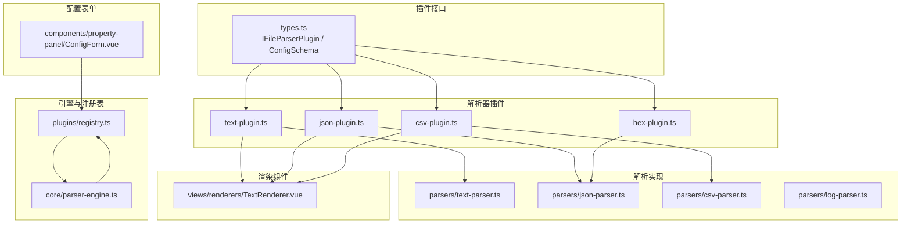
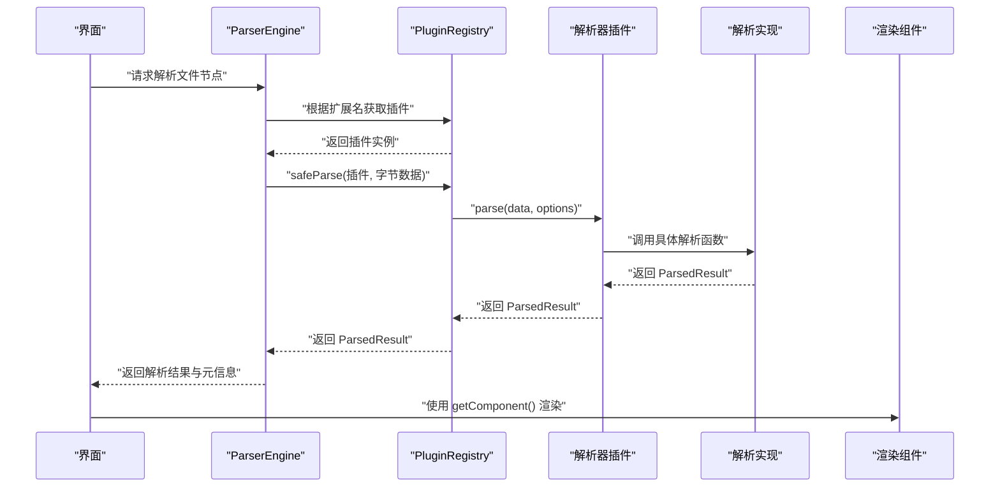
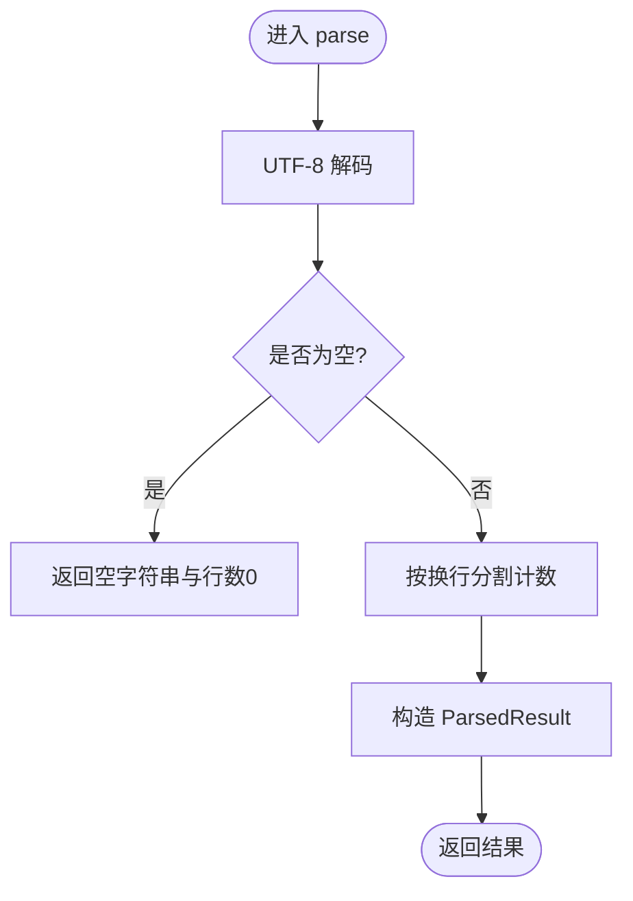
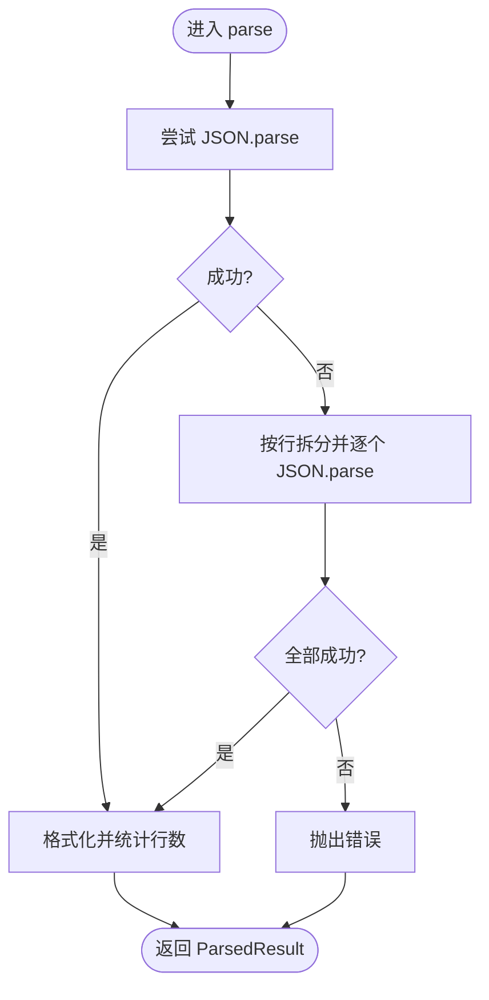
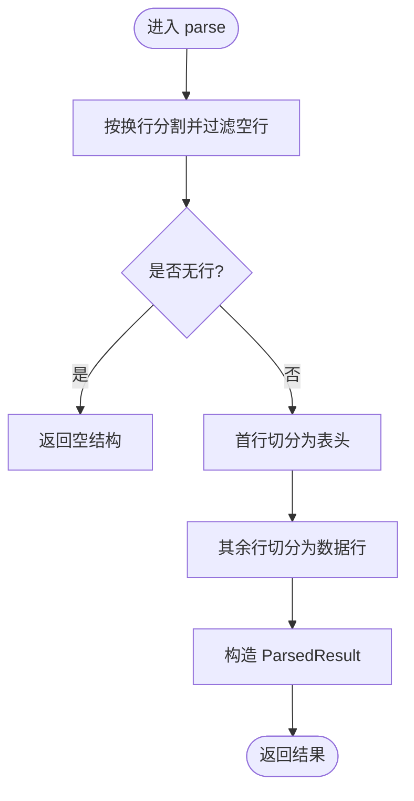
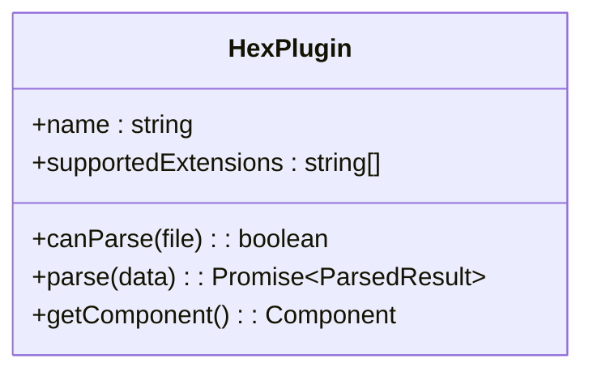
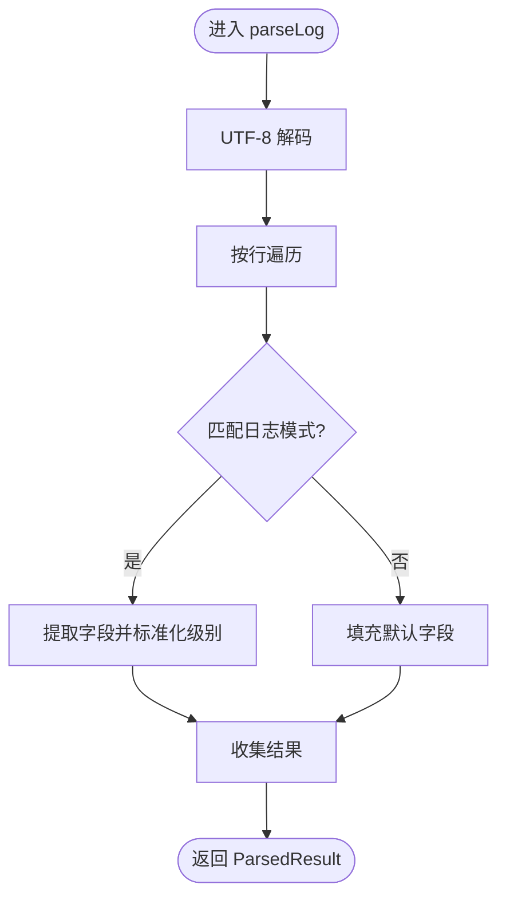
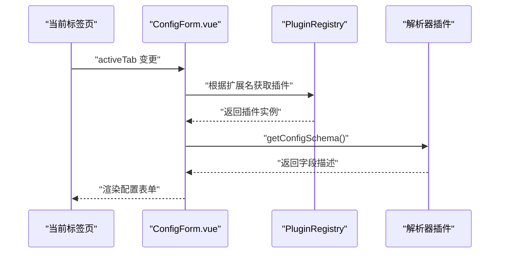
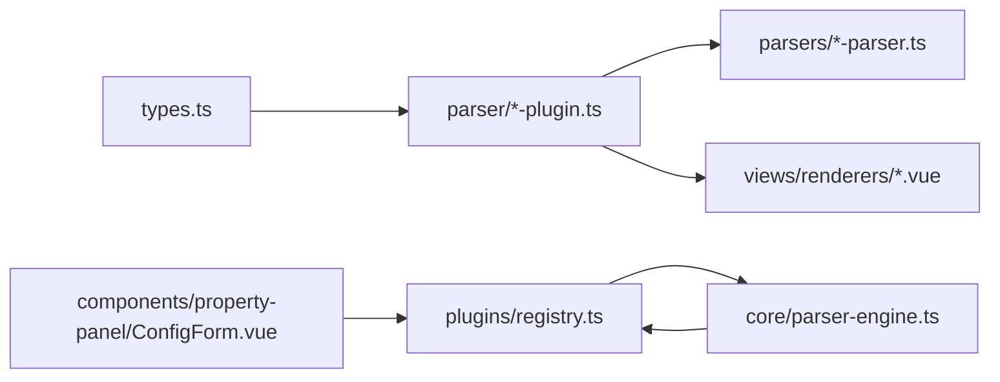

# 解析器插件开发

<cite>
**本文引用的文件**   
- [src/plugins/types.ts](file://src/plugins/types.ts)
- [src/plugins/registry.ts](file://src/plugins/registry.ts)
- [src/core/parser-engine.ts](file://src/core/parser-engine.ts)
- [src/plugins/parser/text-plugin.ts](file://src/plugins/parser/text-plugin.ts)
- [src/plugins/parser/json-plugin.ts](file://src/plugins/parser/json-plugin.ts)
- [src/plugins/parser/csv-plugin.ts](file://src/plugins/parser/csv-plugin.ts)
- [src/plugins/parser/hex-plugin.ts](file://src/plugins/parser/hex-plugin.ts)
- [src/plugins/parsers/text-parser.ts](file://src/plugins/parsers/text-parser.ts)
- [src/plugins/parsers/json-parser.ts](file://src/plugins/parsers/json-parser.ts)
- [src/plugins/parsers/csv-parser.ts](file://src/plugins/parsers/csv-parser.ts)
- [src/plugins/parsers/log-parser.ts](file://src/plugins/parsers/log-parser.ts)
- [src/plugins/parsers/types.ts](file://src/plugins/parsers/types.ts)
- [src/views/renderers/TextRenderer.vue](file://src/views/renderers/TextRenderer.vue)
- [src/components/property-panel/ConfigForm.vue](file://src/components/property-panel/ConfigForm.vue)
- [src/__tests__/plugins/parsers/text-parser.test.ts](file://src/__tests__/plugins/parsers/text-parser.test.ts)
- [src/__tests__/plugins/parsers/json-parser.test.ts](file://src/__tests__/plugins/parsers/json-parser.test.ts)
- [src/__tests__/plugins/parsers/csv-parser.test.ts](file://src/__tests__/plugins/parsers/csv-parser.test.ts)
</cite>

## 目录
1. [简介](#简介)
2. [项目结构](#项目结构)
3. [核心组件](#核心组件)
4. [架构总览](#架构总览)
5. [详细组件分析](#详细组件分析)
6. [依赖关系分析](#依赖关系分析)
7. [性能考虑](#性能考虑)
8. [故障排查指南](#故障排查指南)
9. [结论](#结论)
10. [附录](#附录)

## 简介
本教程面向希望为系统扩展“解析器插件”的开发者，从最简单的文本解析器开始，逐步构建 JSON 与 CSV 解析器。内容覆盖：
- canParse 方法的实现逻辑、文件扩展名匹配策略与内容检测算法
- parse 方法的数据处理流程（二进制解码、格式验证、错误处理）
- 自定义渲染组件集成与数据可视化展示
- 配置表单生成器的使用方法与用户自定义参数
- 性能优化技巧（流式处理、内存管理、超时保护等）

## 项目结构
本项目采用“插件注册 + 引擎调度 + 渲染组件”的分层设计：
- 插件类型定义位于 types 模块
- 解析器插件与压缩插件在 plugins 目录下按功能划分
- 具体解析逻辑集中在 parsers 子目录
- 渲染组件位于 views/renderers
- 配置表单由 property-panel 提供
- 引擎负责读取文件、选择插件、执行解析并返回统一结果

图表来源
- [src/plugins/types.ts:1-37](file://src/plugins/types.ts#L1-L37)
- [src/plugins/parser/text-plugin.ts:1-18](file://src/plugins/parser/text-plugin.ts#L1-L18)
- [src/plugins/parser/json-plugin.ts:1-19](file://src/plugins/parser/json-plugin.ts#L1-L19)
- [src/plugins/parser/csv-plugin.ts:1-28](file://src/plugins/parser/csv-plugin.ts#L1-L28)
- [src/plugins/parser/hex-plugin.ts:1-53](file://src/plugins/parser/hex-plugin.ts#L1-L53)
- [src/plugins/parsers/text-parser.ts:1-8](file://src/plugins/parsers/text-parser.ts#L1-L8)
- [src/plugins/parsers/json-parser.ts:1-17](file://src/plugins/parsers/json-parser.ts#L1-L17)
- [src/plugins/parsers/csv-parser.ts:1-17](file://src/plugins/parsers/csv-parser.ts#L1-L17)
- [src/plugins/parsers/log-parser.ts:1-37](file://src/plugins/parsers/log-parser.ts#L1-L37)
- [src/views/renderers/TextRenderer.vue:1-38](file://src/views/renderers/TextRenderer.vue#L1-L38)
- [src/components/property-panel/ConfigForm.vue:1-37](file://src/components/property-panel/ConfigForm.vue#L1-L37)
- [src/plugins/registry.ts:1-118](file://src/plugins/registry.ts#L1-L118)
- [src/core/parser-engine.ts:1-35](file://src/core/parser-engine.ts#L1-L35)

章节来源
- [src/plugins/types.ts:1-37](file://src/plugins/types.ts#L1-L37)
- [src/plugins/registry.ts:1-118](file://src/plugins/registry.ts#L1-L118)
- [src/core/parser-engine.ts:1-35](file://src/core/parser-engine.ts#L1-L35)

## 核心组件
- IFileParserPlugin 接口：定义插件能力（名称、支持扩展名、canParse、parse、getComponent、可选 getConfigSchema）
- PluginRegistry：维护插件注册表、扩展名映射、启用/禁用、安全解析封装（含超时）
- ParserEngine：编排读取文件、选择插件、调用 safeParse、汇总结果（包含耗时统计）

关键要点
- canParse 通常基于扩展名快速判断；也可结合内容探测增强准确性
- parse 接收 Uint8Array 与可选 options，返回统一 ParsedResult
- getComponent 返回 Vue 组件用于渲染
- getConfigSchema 返回字段描述，驱动配置表单自动生成

章节来源
- [src/plugins/types.ts:1-37](file://src/plugins/types.ts#L1-L37)
- [src/plugins/registry.ts:1-118](file://src/plugins/registry.ts#L1-L118)
- [src/core/parser-engine.ts:1-35](file://src/core/parser-engine.ts#L1-L35)

## 架构总览
下图展示了从文件到可视化的完整链路：引擎读取文件字节，根据扩展名选择插件，调用插件的 parse 进行解析，最终通过 getComponent 返回的组件渲染。

图表来源
- [src/core/parser-engine.ts:11-33](file://src/core/parser-engine.ts#L11-L33)
- [src/plugins/registry.ts:98-104](file://src/plugins/registry.ts#L98-L104)
- [src/plugins/parser/text-plugin.ts:11-16](file://src/plugins/parser/text-plugin.ts#L11-L16)
- [src/plugins/parser/json-plugin.ts:11-17](file://src/plugins/parser/json-plugin.ts#L11-L17)
- [src/plugins/parser/csv-plugin.ts:11-18](file://src/plugins/parser/csv-plugin.ts#L11-L18)

## 详细组件分析

### 文本解析器（入门）
目标：将二进制数据解码为 UTF-8 文本，计算行数，并提供行号视图。

- canParse 逻辑：基于 supportedExtensions 列表进行后缀匹配
- parse 流程：Uint8Array → TextDecoder 解码 → 计算行数 → 返回 ParsedResult
- 渲染组件：逐行显示，带行号

图表来源
- [src/plugins/parsers/text-parser.ts:3-7](file://src/plugins/parsers/text-parser.ts#L3-L7)
- [src/plugins/parser/text-plugin.ts:8-16](file://src/plugins/parser/text-plugin.ts#L8-L16)
- [src/views/renderers/TextRenderer.vue:1-38](file://src/views/renderers/TextRenderer.vue#L1-L38)

章节来源
- [src/plugins/parser/text-plugin.ts:1-18](file://src/plugins/parser/text-plugin.ts#L1-L18)
- [src/plugins/parsers/text-parser.ts:1-8](file://src/plugins/parsers/text-parser.ts#L1-L8)
- [src/views/renderers/TextRenderer.vue:1-38](file://src/views/renderers/TextRenderer.vue#L1-L38)
- [src/__tests__/plugins/parsers/text-parser.test.ts:1-27](file://src/__tests__/plugins/parsers/text-parser.test.ts#L1-L27)

### JSON 解析器
目标：支持标准 JSON 与 JSONL（每行一个对象），失败时抛出明确错误。

- canParse 逻辑：基于 .json/.jsonl 扩展名匹配
- parse 流程：
  - 先尝试 JSON.parse
  - 若失败，尝试按行解析为 JSONL 数组
  - 均失败则抛出错误
- 渲染组件：树形或格式化展示

图表来源
- [src/plugins/parsers/json-parser.ts:3-16](file://src/plugins/parsers/json-parser.ts#L3-L16)
- [src/plugins/parser/json-plugin.ts:8-17](file://src/plugins/parser/json-plugin.ts#L8-L17)

章节来源
- [src/plugins/parser/json-plugin.ts:1-19](file://src/plugins/parser/json-plugin.ts#L1-L19)
- [src/plugins/parsers/json-parser.ts:1-17](file://src/plugins/parsers/json-parser.ts#L1-L17)
- [src/__tests__/plugins/parsers/json-parser.test.ts:1-41](file://src/__tests__/plugins/parsers/json-parser.test.ts#L1-L41)

### CSV 解析器
目标：解析 CSV/TSV，支持自定义分隔符，过滤空行，输出 headers 与 rows。

- canParse 逻辑：基于 .csv/.tsv 扩展名匹配
- parse 流程：
  - 按换行分割并过滤空行
  - 首行为表头，后续为数据行
  - 支持通过 options.delimiter 指定分隔符
- 渲染组件：表格展示

图表来源
- [src/plugins/parsers/csv-parser.ts:8-16](file://src/plugins/parsers/csv-parser.ts#L8-L16)
- [src/plugins/parser/csv-plugin.ts:11-15](file://src/plugins/parser/csv-plugin.ts#L11-L15)

章节来源
- [src/plugins/parser/csv-plugin.ts:1-28](file://src/plugins/parser/csv-plugin.ts#L1-L28)
- [src/plugins/parsers/csv-parser.ts:1-17](file://src/plugins/parsers/csv-parser.ts#L1-L17)
- [src/__tests__/plugins/parsers/csv-parser.test.ts:1-35](file://src/__tests__/plugins/parsers/csv-parser.test.ts#L1-L35)

### 十六进制回退解析器
目标：当其他解析器失败时，作为兜底以十六进制形式展示原始字节。

- canParse 逻辑：始终返回 true（兜底）
- parse 流程：直接返回原始字节数据供渲染
- 渲染组件：按 16 字节一行显示偏移、十六进制与 ASCII

图表来源
- [src/plugins/parser/hex-plugin.ts:36-52](file://src/plugins/parser/hex-plugin.ts#L36-L52)

章节来源
- [src/plugins/parser/hex-plugin.ts:1-53](file://src/plugins/parser/hex-plugin.ts#L1-L53)

### 日志解析器（示例）
目标：将结构化日志行解析为字段化对象，便于筛选与高亮。

- 解析流程：正则匹配时间戳、级别、模块与消息，未匹配的行标记为 OTHER
- 数据结构：包含行号、时间戳、级别、模块、消息与原始行

图表来源
- [src/plugins/parsers/log-parser.ts:11-36](file://src/plugins/parsers/log-parser.ts#L11-L36)
- [src/plugins/parsers/types.ts:1-11](file://src/plugins/parsers/types.ts#L1-L11)

章节来源
- [src/plugins/parsers/log-parser.ts:1-37](file://src/plugins/parsers/log-parser.ts#L1-L37)
- [src/plugins/parsers/types.ts:1-11](file://src/plugins/parsers/types.ts#L1-L11)

### 配置表单生成器
目标：根据插件提供的配置 Schema 动态生成表单，允许用户调整解析参数（如 CSV 分隔符）。

- 数据来源：插件的 getConfigSchema 返回 fields 描述
- 表单控件：input/select/switch/number 等
- 联动：当前标签页对应文件的扩展名决定加载哪个插件的 Schema

图表来源
- [src/components/property-panel/ConfigForm.vue:10-15](file://src/components/property-panel/ConfigForm.vue#L10-L15)
- [src/plugins/parser/csv-plugin.ts:19-26](file://src/plugins/parser/csv-plugin.ts#L19-L26)

章节来源
- [src/components/property-panel/ConfigForm.vue:1-37](file://src/components/property-panel/ConfigForm.vue#L1-L37)
- [src/plugins/parser/csv-plugin.ts:19-26](file://src/plugins/parser/csv-plugin.ts#L19-L26)

## 依赖关系分析
- 插件与解析实现解耦：插件仅负责扩展名匹配、解码与选项传递，具体解析逻辑下沉至 parsers 模块
- 注册表集中管理：扩展名到插件名的映射，避免散落的 if-else
- 引擎统一编排：读取文件、选择插件、安全执行、统计耗时

图表来源
- [src/plugins/types.ts:1-37](file://src/plugins/types.ts#L1-L37)
- [src/plugins/registry.ts:1-118](file://src/plugins/registry.ts#L1-L118)
- [src/core/parser-engine.ts:1-35](file://src/core/parser-engine.ts#L1-L35)
- [src/components/property-panel/ConfigForm.vue:1-37](file://src/components/property-panel/ConfigForm.vue#L1-L37)

章节来源
- [src/plugins/registry.ts:1-118](file://src/plugins/registry.ts#L1-L118)
- [src/core/parser-engine.ts:1-35](file://src/core/parser-engine.ts#L1-L35)

## 性能考虑
- 超时保护：safeParse 对插件执行设置超时，防止阻塞主线程
- 内存友好：
  - 优先使用流式或分块处理大文件（例如逐行解析 JSONL/CSV）
  - 避免一次性复制超大字符串，必要时使用缓冲与惰性渲染
- 渲染优化：
  - 虚拟滚动或分页加载大数据集
  - 按需渲染与懒加载
- 缓存策略：
  - 对相同路径与内容的解析结果做短期缓存
  - 对重型解析结果（如 JSON 树）可缓存序列化后的轻量表示
- 错误快速失败：
  - 尽早校验输入长度与编码，失败即返回兜底视图（如十六进制）

章节来源
- [src/plugins/registry.ts:98-104](file://src/plugins/registry.ts#L98-L104)

## 故障排查指南
- 解析失败自动回退：当插件解析抛错时，safeParse 会返回十六进制视图，便于检查原始字节
- 常见错误定位：
  - JSON 解析错误：查看错误消息中携带的原因
  - CSV 分隔符不匹配：确认 options.delimiter 是否与文件一致
  - 编码问题：确保使用 UTF-8 解码
- 调试建议：
  - 打印 lineCount 与 data 结构，确认解析产物是否符合预期
  - 使用单元测试覆盖边界情况（空文件、单行、非法字符等）

章节来源
- [src/plugins/registry.ts:98-104](file://src/plugins/registry.ts#L98-L104)
- [src/plugins/parsers/json-parser.ts:7-13](file://src/plugins/parsers/json-parser.ts#L7-L13)
- [src/__tests__/plugins/parsers/json-parser.test.ts:22-33](file://src/__tests__/plugins/parsers/json-parser.test.ts#L22-L33)

## 结论
通过统一的插件接口与注册表机制，本项目实现了可扩展的文件解析体系。从文本到 JSON、CSV 再到日志与十六进制回退，开发者可以按步骤扩展新的解析器，并通过配置表单生成器为用户提供灵活的参数定制。配合超时保护与渲染优化，可在保证稳定性的同时提升大文件处理能力。

## 附录

### 插件接口与数据类型速查
- IFileParserPlugin
  - name: 插件标识
  - supportedExtensions: 支持的扩展名列表
  - canParse(file): 基于文件名或内容判断是否可解析
  - parse(data, options?): 解析二进制数据，返回 ParsedResult
  - getComponent(): 返回渲染组件
  - getConfigSchema?(): 返回配置字段描述
- ParsedResult
  - type: 解析类型（text/csv/json/hex/log）
  - data: 解析结果
  - lineCount?: 行数统计

章节来源
- [src/plugins/types.ts:1-37](file://src/plugins/types.ts#L1-L37)