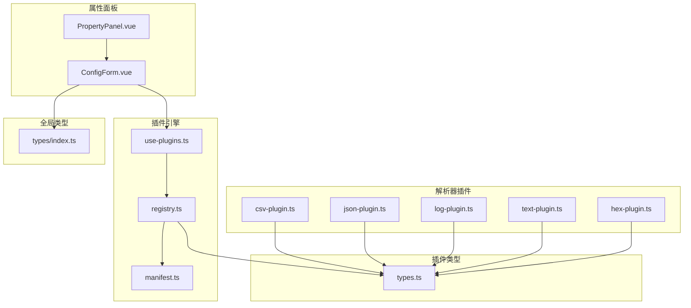
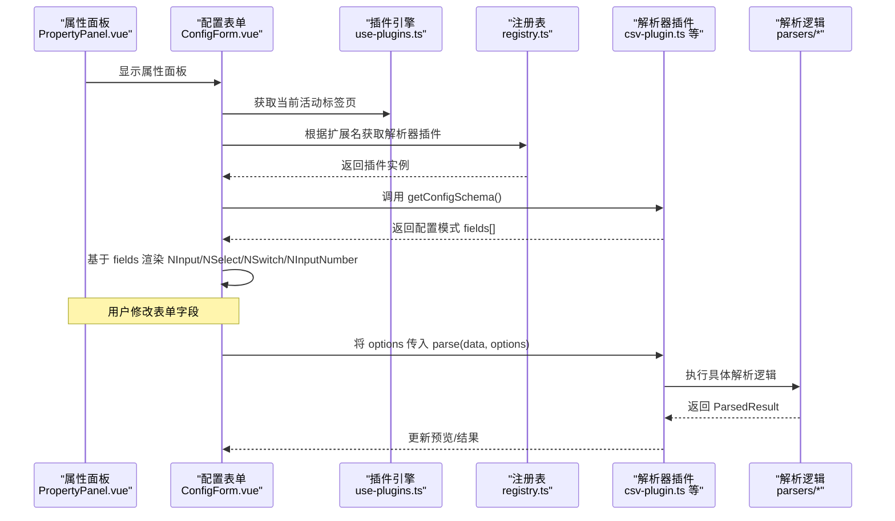
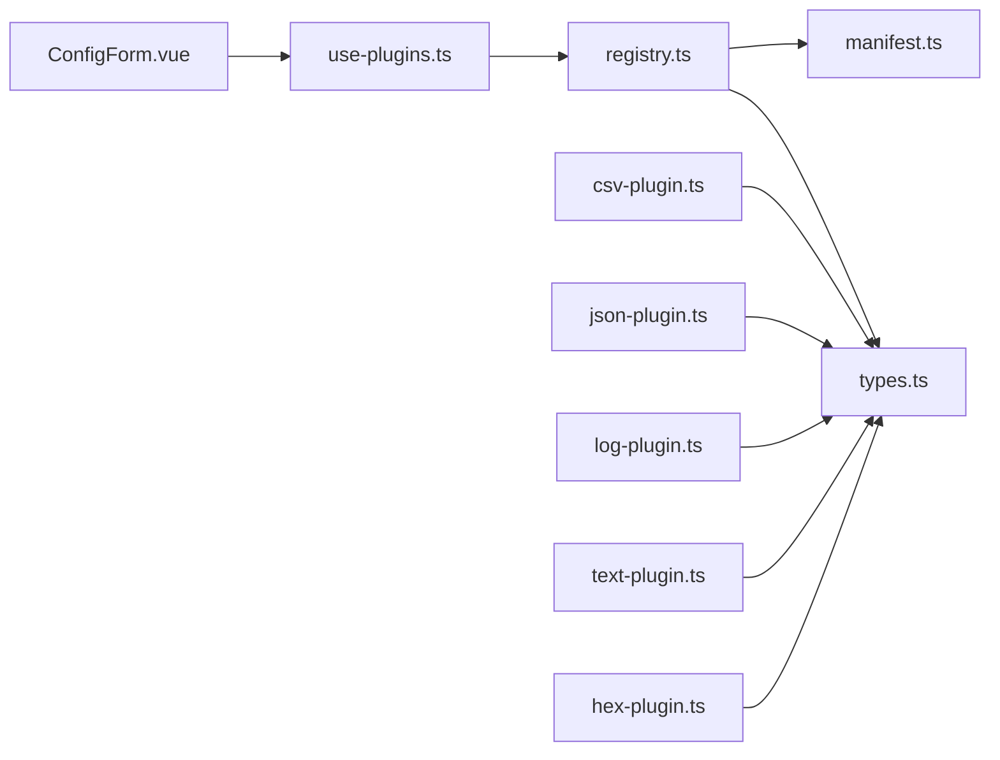

# 配置表单生成

<cite>
**本文引用的文件**   
- [ConfigForm.vue](file://src/components/property-panel/ConfigForm.vue)
- [PropertyPanel.vue](file://src/components/property-panel/PropertyPanel.vue)
- [use-plugins.ts](file://src/composables/use-plugins.ts)
- [registry.ts](file://src/plugins/registry.ts)
- [types.ts](file://src/plugins/types.ts)
- [csv-plugin.ts](file://src/plugins/parser/csv-plugin.ts)
- [json-plugin.ts](file://src/plugins/parser/json-plugin.ts)
- [log-plugin.ts](file://src/plugins/parser/log-plugin.ts)
- [text-plugin.ts](file://src/plugins/parser/text-plugin.ts)
- [hex-plugin.ts](file://src/plugins/parser/hex-plugin.ts)
- [manifest.ts](file://src/plugins/manifest.ts)
- [index.ts](file://src/types/index.ts)
</cite>

## 目录
1. [简介](#简介)
2. [项目结构](#项目结构)
3. [核心组件](#核心组件)
4. [架构总览](#架构总览)
5. [详细组件分析](#详细组件分析)
6. [依赖分析](#依赖分析)
7. [性能考虑](#性能考虑)
8. [故障排查指南](#故障排查指南)
9. [结论](#结论)
10. [附录](#附录)

## 简介
本指南面向插件开发者与前端工程师，系统化说明如何为解析器插件实现“用户可配置的参数界面”。内容涵盖：
- 表单字段定义、验证规则与默认值设置
- 动态表单生成器的使用方法（文本框、下拉菜单、开关、数字输入等）
- 表单数据的序列化与持久化存储机制
- 表单验证最佳实践（实时反馈与错误提示）
- 与解析器配置对象的双向绑定，确保修改即时生效

## 项目结构
本项目采用“按功能域组织”的结构。与配置表单相关的关键位置如下：
- 属性面板与动态表单：src/components/property-panel
- 插件类型与注册表：src/plugins/types.ts、src/plugins/registry.ts、src/plugins/manifest.ts
- 解析器插件示例：src/plugins/parser/*
- 组合式函数（暴露注册表能力）：src/composables/use-plugins.ts
- 全局类型定义：src/types/index.ts



图表来源
- [PropertyPanel.vue:1-17](file://src/components/property-panel/PropertyPanel.vue#L1-L17)
- [ConfigForm.vue:1-37](file://src/components/property-panel/ConfigForm.vue#L1-L37)
- [use-plugins.ts:1-17](file://src/composables/use-plugins.ts#L1-L17)
- [registry.ts:1-118](file://src/plugins/registry.ts#L1-L118)
- [manifest.ts:1-20](file://src/plugins/manifest.ts#L1-L20)
- [types.ts:1-37](file://src/plugins/types.ts#L1-L37)
- [csv-plugin.ts:1-28](file://src/plugins/parser/csv-plugin.ts#L1-L28)
- [json-plugin.ts:1-19](file://src/plugins/parser/json-plugin.ts#L1-L19)
- [log-plugin.ts:1-18](file://src/plugins/parser/log-plugin.ts#L1-L18)
- [text-plugin.ts:1-18](file://src/plugins/parser/text-plugin.ts#L1-L18)
- [hex-plugin.ts:1-53](file://src/plugins/parser/hex-plugin.ts#L1-L53)
- [index.ts:1-71](file://src/types/index.ts#L1-L71)

章节来源
- [PropertyPanel.vue:1-17](file://src/components/property-panel/PropertyPanel.vue#L1-L17)
- [ConfigForm.vue:1-37](file://src/components/property-panel/ConfigForm.vue#L1-L37)
- [use-plugins.ts:1-17](file://src/composables/use-plugins.ts#L1-L17)
- [registry.ts:1-118](file://src/plugins/registry.ts#L1-L118)
- [manifest.ts:1-20](file://src/plugins/manifest.ts#L1-L20)
- [types.ts:1-37](file://src/plugins/types.ts#L1-L37)
- [index.ts:1-71](file://src/types/index.ts#L1-L71)

## 核心组件
- 动态表单容器：根据当前活动标签页对应的解析器插件，读取其配置模式并渲染表单控件。
- 插件类型契约：通过统一的配置模式接口描述字段、类型、默认值与选项。
- 插件注册表：提供按扩展名获取解析器插件的能力，供表单容器查询配置模式。
- 解析器插件示例：CSV 插件展示了如何实现配置模式；其他插件可作为扩展参考。

章节来源
- [ConfigForm.vue:1-37](file://src/components/property-panel/ConfigForm.vue#L1-L37)
- [types.ts:1-37](file://src/plugins/types.ts#L1-L37)
- [registry.ts:1-118](file://src/plugins/registry.ts#L1-L118)
- [csv-plugin.ts:1-28](file://src/plugins/parser/csv-plugin.ts#L1-L28)

## 架构总览
下图展示从“用户打开文件”到“动态渲染配置表单”的端到端流程，以及后续“表单变更驱动解析”的数据流。



图表来源
- [PropertyPanel.vue:1-17](file://src/components/property-panel/PropertyPanel.vue#L1-L17)
- [ConfigForm.vue:1-37](file://src/components/property-panel/ConfigForm.vue#L1-L37)
- [use-plugins.ts:1-17](file://src/composables/use-plugins.ts#L1-L17)
- [registry.ts:1-118](file://src/plugins/registry.ts#L1-L118)
- [csv-plugin.ts:1-28](file://src/plugins/parser/csv-plugin.ts#L1-L28)

## 详细组件分析

### 动态表单生成器（ConfigForm.vue）
- 行为要点
  - 根据当前活动标签页的文件扩展名，通过注册表获取对应解析器插件。
  - 若插件实现了配置模式方法，则读取 fields 数组并动态渲染表单控件。
  - 支持的控件映射：input→文本框、select→下拉菜单、switch→开关、number→数字输入。
- 数据流向
  - 读取：activeTab → 扩展名 → registry.getParser(ext) → plugin.getConfigSchema() → fields[]
  - 渲染：遍历 fields，按 type 选择 Naive UI 控件，使用 default 作为初始值
- 可扩展点
  - 新增控件类型：在模板中增加条件分支，并在类型定义中扩展 type 枚举
  - 校验与提示：可在每个 NFormItem 上附加校验规则与错误信息
  - 双向绑定：将表单值与解析器 options 进行同步，以便解析时立即生效

章节来源
- [ConfigForm.vue:1-37](file://src/components/property-panel/ConfigForm.vue#L1-L37)

#### 类图（配置模式与插件契约）
```mermaid
classDiagram
class ConfigField {
+string key
+string label
+string type
+any default
+{label : string;value : any}[] options
}
class ConfigSchema {
+ConfigField[] fields
}
class IFileParserPlugin {
+string name
+string[] supportedExtensions
+canParse(file) bool
+parse(data, options) Promise~ParsedResult~
+getComponent() Component
+getConfigSchema() ConfigSchema
}
class CsvPlugin {
+name
+supportedExtensions
+canParse(file)
+parse(data, options)
+getComponent()
+getConfigSchema()
}
IFileParserPlugin <|.. CsvPlugin
ConfigSchema --> ConfigField : "包含"
```

图表来源
- [types.ts:1-37](file://src/plugins/types.ts#L1-L37)
- [csv-plugin.ts:1-28](file://src/plugins/parser/csv-plugin.ts#L1-L28)

### 插件类型与配置模式（types.ts）
- 关键类型
  - ConfigField：描述单个表单字段（键名、标签、类型、默认值、可选选项）
  - ConfigSchema：描述一组字段集合
  - IFileParserPlugin：解析器插件统一接口，其中 getConfigSchema 为可选方法
- 设计建议
  - 保持 type 枚举稳定，新增控件类型需同时更新表单渲染逻辑
  - default 应与 type 语义一致（如 switch 用布尔值，number 用数值）
  - options 用于 select 控件的选项列表

章节来源
- [types.ts:1-37](file://src/plugins/types.ts#L1-L37)

### 插件注册表与发现（registry.ts、use-plugins.ts、manifest.ts）
- 职责
  - 注册解析器与压缩器插件，维护扩展名到插件名的映射
  - 提供 getParser(ext)、detect(file) 等方法供上层查询
  - 提供 safeParse/safeDecompress 超时保护与异常兜底
- 使用方式
  - use-plugins 暴露 registry 及便捷方法
  - manifest 集中注册内置插件
- 注意事项
  - 被禁用的插件不会被 detect/getParser 返回
  - 超时保护避免阻塞主线程

章节来源
- [registry.ts:1-118](file://src/plugins/registry.ts#L1-L118)
- [use-plugins.ts:1-17](file://src/composables/use-plugins.ts#L1-L17)
- [manifest.ts:1-20](file://src/plugins/manifest.ts#L1-L20)

### 解析器插件示例（以 CSV 为例）
- 配置模式
  - 提供 fields 数组，包含分隔符（文本）、固定表头（开关）等
- 解析逻辑
  - parse(data, options) 接收 options.delimiter 等参数
  - 将 options 透传给底层解析器，实现“配置即参数”
- 扩展建议
  - 为更多插件实现 getConfigSchema，使它们具备可配置性
  - 对复杂参数（正则、阈值）可使用 number/input/select 组合表达

章节来源
- [csv-plugin.ts:1-28](file://src/plugins/parser/csv-plugin.ts#L1-L28)
- [json-plugin.ts:1-19](file://src/plugins/parser/json-plugin.ts#L1-L19)
- [log-plugin.ts:1-18](file://src/plugins/parser/log-plugin.ts#L1-L18)
- [text-plugin.ts:1-18](file://src/plugins/parser/text-plugin.ts#L1-L18)
- [hex-plugin.ts:1-53](file://src/plugins/parser/hex-plugin.ts#L1-L53)

### 表单验证与实时反馈（最佳实践）
- 建议策略
  - 必填校验：对关键字段（如分隔符）启用必填
  - 格式校验：对正则表达式、URL、邮箱等使用正则或专用校验器
  - 范围校验：对数值型字段限制最小/最大值
  - 联动校验：当某字段变化时，重新计算其他字段的合法性
- 交互体验
  - 实时反馈：在输入过程中即时显示错误提示
  - 防抖处理：对高频输入（如搜索/过滤）进行防抖，减少重渲染
  - 友好文案：错误消息应明确、可操作
- 实现位置建议
  - 在 ConfigForm 的每个 NFormItem 上附加 rules 与 message
  - 在表单提交/应用前进行一次整体校验

[本节为通用指导，不直接分析具体文件]

### 表单数据序列化与持久化
- 目标
  - 将用户修改的配置序列化为稳定的数据结构，并持久化到本地存储
- 建议方案
  - 序列化：将表单值转换为纯对象（仅保留必要字段），去除空值与默认值以减少体积
  - 存储：使用浏览器 localStorage/sessionStorage 或后端 API 保存
  - 加载：应用启动时优先加载已保存配置，覆盖默认值
  - 版本兼容：为配置模式添加 version 字段，迁移旧配置
- 安全注意
  - 对用户输入进行白名单校验，防止注入
  - 敏感配置加密存储或交由后端管理

[本节为通用指导，不直接分析具体文件]

### 与解析器配置对象的双向绑定
- 目标
  - 用户修改表单后，解析器能立即使用最新配置进行解析
- 推荐流程
  - 表单变更事件触发时，合并当前 options 与变更项
  - 将新 options 传递给解析器插件的 parse(data, options)
  - 若解析耗时较长，使用防抖或取消上次请求，避免竞态
- 容错与回退
  - 解析失败时回退到默认配置或十六进制视图
  - 记录错误日志，便于定位问题

章节来源
- [registry.ts:98-104](file://src/plugins/registry.ts#L98-L104)
- [csv-plugin.ts:11-15](file://src/plugins/parser/csv-plugin.ts#L11-L15)

## 依赖分析
- 耦合关系
  - ConfigForm 依赖 use-plugins 提供的 registry，进而依赖 registry 的 getParser
  - 各解析器插件实现 IFileParserPlugin 接口，可选择实现 getConfigSchema
  - manifest 集中注册所有内置插件，保证运行时可用
- 潜在风险
  - 若插件未实现 getConfigSchema，表单不会显示配置区域
  - 若 type 与 default 不一致，可能导致控件初始状态异常
  - 缺少校验会导致非法配置进入解析流程



图表来源
- [ConfigForm.vue:1-37](file://src/components/property-panel/ConfigForm.vue#L1-L37)
- [use-plugins.ts:1-17](file://src/composables/use-plugins.ts#L1-L17)
- [registry.ts:1-118](file://src/plugins/registry.ts#L1-L118)
- [manifest.ts:1-20](file://src/plugins/manifest.ts#L1-L20)
- [types.ts:1-37](file://src/plugins/types.ts#L1-L37)
- [csv-plugin.ts:1-28](file://src/plugins/parser/csv-plugin.ts#L1-L28)
- [json-plugin.ts:1-19](file://src/plugins/parser/json-plugin.ts#L1-L19)
- [log-plugin.ts:1-18](file://src/plugins/parser/log-plugin.ts#L1-L18)
- [text-plugin.ts:1-18](file://src/plugins/parser/text-plugin.ts#L1-L18)
- [hex-plugin.ts:1-53](file://src/plugins/parser/hex-plugin.ts#L1-L53)

章节来源
- [registry.ts:1-118](file://src/plugins/registry.ts#L1-L118)
- [manifest.ts:1-20](file://src/plugins/manifest.ts#L1-L20)
- [types.ts:1-37](file://src/plugins/types.ts#L1-L37)

## 性能考虑
- 表单渲染
  - 仅在 activeTab 变化时重建配置模式，避免频繁计算
  - 对大表单使用虚拟滚动或分页展示
- 解析性能
  - 使用注册表的 safeParse 超时保护，避免长时间阻塞
  - 对大型文件采用分块解析或增量渲染
- 存储读写
  - 批量写入而非逐条写入，减少 I/O 次数
  - 对配置变更进行去抖，降低频繁持久化开销

[本节为通用指导，不直接分析具体文件]

## 故障排查指南
- 常见问题
  - 配置表单未显示：检查插件是否实现 getConfigSchema，确认扩展名匹配
  - 控件初始值异常：核对 ConfigField.type 与 default 的类型一致性
  - 解析未生效：确认表单变更是否正确合并到 options 并传入 parse
  - 解析超时或失败：查看 safeParse 的超时与回退逻辑，检查输入合法性
- 定位步骤
  - 在表单变更处打印 options 快照，确认字段值正确
  - 在解析入口打印入参与返回值，对比预期
  - 检查注册表是否禁用了对应插件
- 恢复策略
  - 重置为默认配置
  - 切换至十六进制视图作为兜底

章节来源
- [registry.ts:98-116](file://src/plugins/registry.ts#L98-L116)
- [ConfigForm.vue:10-15](file://src/components/property-panel/ConfigForm.vue#L10-L15)

## 结论
通过统一的配置模式与动态表单生成器，解析器插件可以低成本地提供用户可配置界面。结合完善的校验、持久化与双向绑定机制，既能提升用户体验，又能保证解析逻辑的灵活性与稳定性。建议在新增插件时优先实现 getConfigSchema，并配套相应的校验与测试用例。

[本节为总结性内容，不直接分析具体文件]

## 附录

### 配置模式字段规范（建议）
- 字段命名
  - key 使用小写驼峰，语义清晰
- 类型与默认值
  - input：字符串，非空时提供占位符
  - select：options 至少两项，default 必须在选项中
  - switch：布尔值，default 明确表达默认行为
  - number：数值，必要时提供 min/max
- 校验规则
  - 必填、格式、范围、联动校验
- 国际化
  - label 与错误消息支持多语言

[本节为通用指导，不直接分析具体文件]