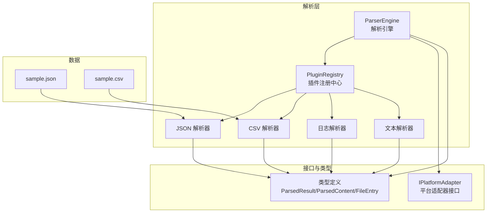
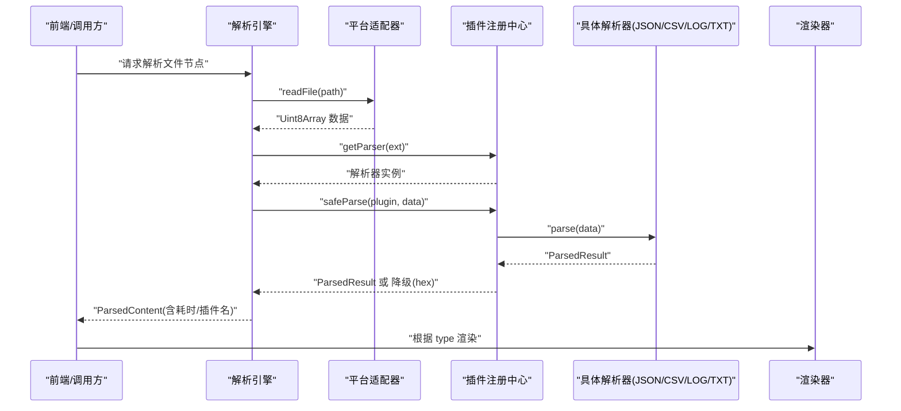
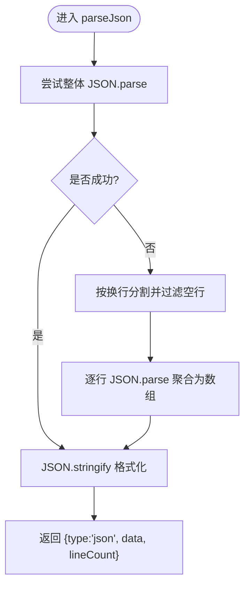
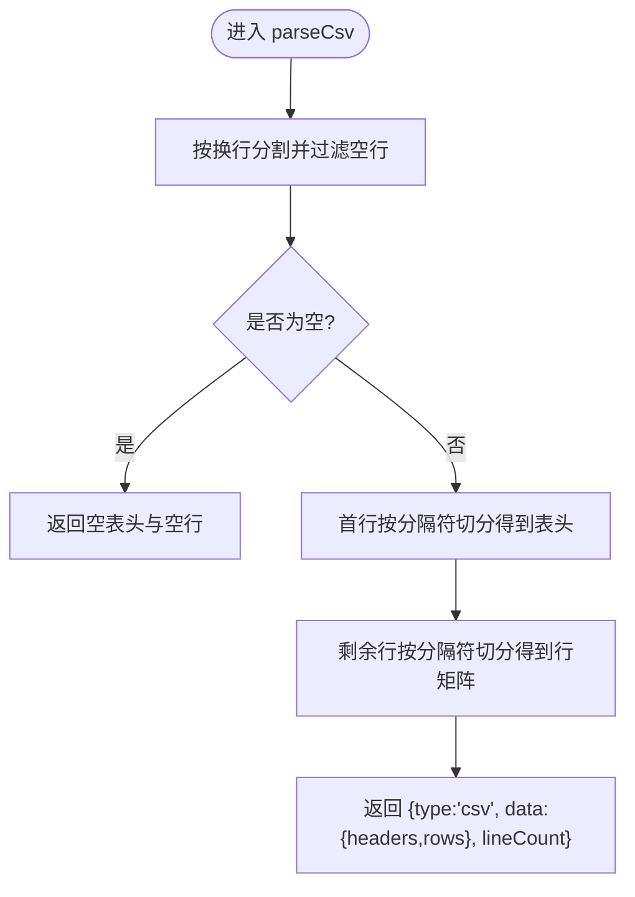
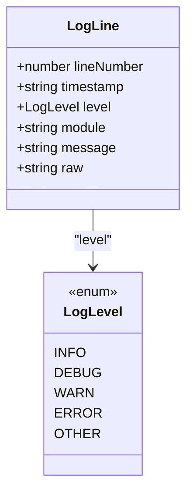
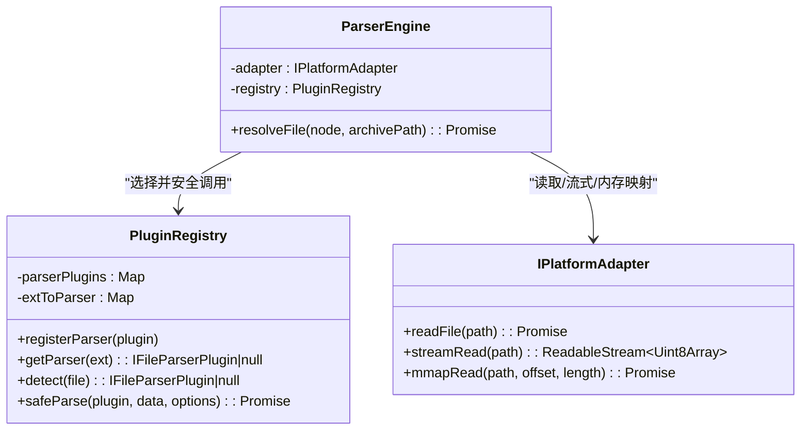
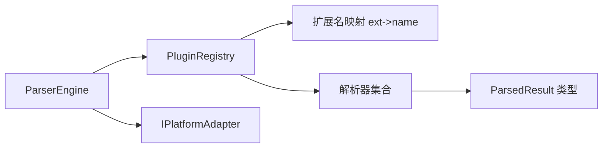

# 高级解析器开发

<cite>
**本文引用的文件**   
- [src/core/parser-engine.ts](file://src/core/parser-engine.ts)
- [src/plugins/registry.ts](file://src/plugins/registry.ts)
- [src/plugins/types.ts](file://src/plugins/types.ts)
- [src/adapters/types.ts](file://src/adapters/types.ts)
- [src/types/index.ts](file://src/types/index.ts)
- [src/plugins/parsers/json-parser.ts](file://src/plugins/parsers/json-parser.ts)
- [src/plugins/parsers/csv-parser.ts](file://src/plugins/parsers/csv-parser.ts)
- [src/plugins/parsers/log-parser.ts](file://src/plugins/parsers/log-parser.ts)
- [src/plugins/parsers/text-parser.ts](file://src/plugins/parsers/text-parser.ts)
- [data/sample.json](file://data/sample.json)
- [data/sample.csv](file://data/sample.csv)
</cite>

## 目录
1. [简介](#简介)
2. [项目结构](#项目结构)
3. [核心组件](#核心组件)
4. [架构总览](#架构总览)
5. [详细组件分析](#详细组件分析)
6. [依赖关系分析](#依赖关系分析)
7. [性能与内存优化](#性能与内存优化)
8. [错误恢复与降级显示](#错误恢复与降级显示)
9. [内容类型检测与编码处理](#内容类型检测与编码处理)
10. [大文件流式解析策略](#大文件流式解析策略)
11. [调试与监控](#调试与监控)
12. [常见问题与排障](#常见问题与排障)
13. [结论](#结论)

## 简介
本指南面向需要构建复杂格式解析器的工程师，围绕 JSON 结构化数据深度解析、CSV 行列转换、内容类型检测（含 MIME 识别、BOM 头处理、编码自动检测）、大文件流式解析与内存优化、错误恢复与降级显示、以及性能监控与调试技巧展开。文档以仓库现有解析器实现为基础，提炼可复用的模式与最佳实践，帮助读者快速搭建高可用、可扩展的解析系统。

## 项目结构
本项目采用“插件化 + 引擎调度”的架构：
- 解析引擎负责读取文件、选择插件、执行解析并返回统一结果。
- 插件注册中心维护扩展名到解析器的映射，并提供安全调用与超时保护。
- 具体解析器按格式拆分，如 JSON、CSV、日志、文本等。
- 平台适配器抽象底层 I/O，提供同步/异步、流式与内存映射能力。

图表来源
- [src/core/parser-engine.ts:1-35](file://src/core/parser-engine.ts#L1-L35)
- [src/plugins/registry.ts:1-118](file://src/plugins/registry.ts#L1-L118)
- [src/plugins/parsers/json-parser.ts:1-17](file://src/plugins/parsers/json-parser.ts#L1-L17)
- [src/plugins/parsers/csv-parser.ts:1-17](file://src/plugins/parsers/csv-parser.ts#L1-L17)
- [src/plugins/parsers/log-parser.ts:1-37](file://src/plugins/parsers/log-parser.ts#L1-L37)
- [src/plugins/parsers/text-parser.ts:1-8](file://src/plugins/parsers/text-parser.ts#L1-8)
- [src/adapters/types.ts:1-12](file://src/adapters/types.ts#L1-12)
- [src/types/index.ts:1-71](file://src/types/index.ts#L1-L71)
- [data/sample.json:1-29](file://data/sample.json#L1-L29)
- [data/sample.csv:1-12](file://data/sample.csv#L1-L12)

章节来源
- [src/core/parser-engine.ts:1-35](file://src/core/parser-engine.ts#L1-L35)
- [src/plugins/registry.ts:1-118](file://src/plugins/registry.ts#L1-L118)
- [src/adapters/types.ts:1-12](file://src/adapters/types.ts#L1-L12)
- [src/types/index.ts:1-71](file://src/types/index.ts#L1-L71)

## 核心组件
- 解析引擎 ParserEngine
  - 职责：读取文件、根据扩展名选择解析器、调用解析器、统计耗时、封装结果。
  - 关键点：使用性能计时、异常兜底返回空结果，避免上层崩溃。
- 插件注册中心 PluginRegistry
  - 职责：注册/发现解析器与压缩插件、按扩展名匹配、安全调用（超时与降级）。
  - 关键点：safeParse 在解析失败时回退为十六进制视图；withTimeout 防止长时间阻塞。
- 平台适配器 IPlatformAdapter
  - 职责：抽象文件读写、解压、内存映射、流式读取等能力，屏蔽平台差异。
- 类型体系
  - ParsedResult：解析结果统一模型（type/data/lineCount）。
  - ParsedContent：对外暴露的解析产物（包含 loadTimeMs、pluginName 等元信息）。
  - FileEntry/FileTreeNode：文件树与条目描述。

章节来源
- [src/core/parser-engine.ts:1-35](file://src/core/parser-engine.ts#L1-L35)
- [src/plugins/registry.ts:1-118](file://src/plugins/registry.ts#L1-L118)
- [src/adapters/types.ts:1-12](file://src/adapters/types.ts#L1-L12)
- [src/plugins/types.ts:1-37](file://src/plugins/types.ts#L1-L37)
- [src/types/index.ts:1-71](file://src/types/index.ts#L1-L71)

## 架构总览
下图展示从文件到可视化的端到端流程：引擎读取字节、注册中心选择解析器、解析器产出结构化数据、上层渲染器消费。

图表来源
- [src/core/parser-engine.ts:11-33](file://src/core/parser-engine.ts#L11-L33)
- [src/plugins/registry.ts:98-104](file://src/plugins/registry.ts#L98-L104)
- [src/plugins/parsers/json-parser.ts:3-16](file://src/plugins/parsers/json-parser.ts#L3-L16)
- [src/plugins/parsers/csv-parser.ts:8-16](file://src/plugins/parsers/csv-parser.ts#L8-L16)
- [src/plugins/parsers/log-parser.ts:11-36](file://src/plugins/parsers/log-parser.ts#L11-L36)
- [src/plugins/parsers/text-parser.ts:3-7](file://src/plugins/parsers/text-parser.ts#L3-L7)

## 详细组件分析

### JSON 结构化数据深度解析
- 目标：支持标准 JSON 与 JSON Lines（每行一个对象）两种输入，输出结构化对象与行数统计。
- 关键行为：
  - 优先尝试整体 JSON.parse；失败则按行分割后逐行解析，聚合为数组。
  - 格式化字符串用于估算行数，便于 UI 展示。
- 复杂度：
  - 时间 O(n)，n 为字符数；空间取决于 JSON 对象大小。
- 适用场景：配置、API 响应、日志转储等。

图表来源
- [src/plugins/parsers/json-parser.ts:3-16](file://src/plugins/parsers/json-parser.ts#L3-L16)

章节来源
- [src/plugins/parsers/json-parser.ts:1-17](file://src/plugins/parsers/json-parser.ts#L1-L17)
- [data/sample.json:1-29](file://data/sample.json#L1-L29)

### CSV 表格数据的行列转换
- 目标：将 CSV 文本转换为表头与行矩阵，供表格渲染。
- 关键行为：
  - 过滤空行，首行作为 headers，后续行按分隔符切分为 rows。
  - 默认逗号分隔，支持传入自定义分隔符。
- 复杂度：
  - 时间 O(n)，n 为字符数；空间与行列规模线性相关。
- 注意事项：
  - 当前实现未处理引号包裹字段与转义，适合简单 CSV；复杂场景需引入更健壮的解析库。

图表来源
- [src/plugins/parsers/csv-parser.ts:8-16](file://src/plugins/parsers/csv-parser.ts#L8-L16)

章节来源
- [src/plugins/parsers/csv-parser.ts:1-17](file://src/plugins/parsers/csv-parser.ts#L1-L17)
- [data/sample.csv:1-12](file://data/sample.csv#L1-L12)

### 日志解析器（结构化日志）
- 目标：将固定格式的日志行解析为结构化记录，便于筛选与高亮。
- 关键行为：
  - 使用正则提取时间戳、级别、模块、消息。
  - 未知格式的行保留原始内容，标记为 OTHER 级别。
- 复杂度：
  - 时间 O(n)，n 为行数；空间与行数线性相关。

图表来源
- [src/plugins/parsers/log-parser.ts:1-37](file://src/plugins/parsers/log-parser.ts#L1-L37)
- [src/plugins/parsers/types.ts:1-11](file://src/plugins/parsers/types.ts#L1-L11)

章节来源
- [src/plugins/parsers/log-parser.ts:1-37](file://src/plugins/parsers/log-parser.ts#L1-L37)
- [src/plugins/parsers/types.ts:1-11](file://src/plugins/parsers/types.ts#L1-L11)

### 文本解析器（通用后备）
- 目标：将任意字节序列解码为 UTF-8 文本，统计行数。
- 关键行为：
  - 使用 TextDecoder('utf-8') 解码。
  - 空文本返回 0 行，否则按换行计数。

章节来源
- [src/plugins/parsers/text-parser.ts:1-8](file://src/plugins/parsers/text-parser.ts#L1-8)

### 解析引擎与插件注册中心协作
- 解析引擎
  - 读取文件字节、计算扩展名、查找解析器、调用 safeParse、包装结果并统计耗时。
- 插件注册中心
  - 维护扩展名到插件名的映射；提供 detect/detectByFileName 等发现方法。
  - safeParse 对解析过程加超时保护，失败时降级为 hex 视图，确保用户体验不中断。

图表来源
- [src/core/parser-engine.ts:5-33](file://src/core/parser-engine.ts#L5-L33)
- [src/plugins/registry.ts:14-104](file://src/plugins/registry.ts#L14-L104)
- [src/adapters/types.ts:3-11](file://src/adapters/types.ts#L3-L11)

章节来源
- [src/core/parser-engine.ts:1-35](file://src/core/parser-engine.ts#L1-L35)
- [src/plugins/registry.ts:1-118](file://src/plugins/registry.ts#L1-L118)
- [src/adapters/types.ts:1-12](file://src/adapters/types.ts#L1-L12)

## 依赖关系分析
- 低耦合：解析器仅依赖统一类型 ParsedResult，通过注册中心解耦。
- 高内聚：每种格式解析逻辑集中在对应文件中，便于测试与维护。
- 外部依赖：平台适配器屏蔽底层差异，使解析器无需关心 I/O 细节。

图表来源
- [src/plugins/registry.ts:14-96](file://src/plugins/registry.ts#L14-L96)
- [src/core/parser-engine.ts:11-29](file://src/core/parser-engine.ts#L11-L29)
- [src/plugins/types.ts:32-36](file://src/plugins/types.ts#L32-L36)

章节来源
- [src/plugins/registry.ts:1-118](file://src/plugins/registry.ts#L1-L118)
- [src/core/parser-engine.ts:1-35](file://src/core/parser-engine.ts#L1-L35)
- [src/plugins/types.ts:1-37](file://src/plugins/types.ts#L1-L37)

## 性能与内存优化
- 解析耗时统计
  - 引擎在解析前后记录 performance.now()，并将 loadTimeMs 写入结果，便于前端展示与埋点。
- 超时保护
  - 注册中心对解析与解压操作设置超时，避免长任务阻塞主线程。
- 内存占用控制
  - 对于超大文件，建议结合平台适配器的 streamRead/mmapRead 进行分块或按需读取，减少一次性加载。
- 渲染侧分页/虚拟滚动
  - 针对 CSV/日志等大数据集，建议在渲染层做分页或虚拟列表，降低 DOM 压力。

章节来源
- [src/core/parser-engine.ts:12-28](file://src/core/parser-engine.ts#L12-L28)
- [src/plugins/registry.ts:6-12](file://src/plugins/registry.ts#L6-L12)
- [src/adapters/types.ts:9-11](file://src/adapters/types.ts#L9-L11)

## 错误恢复与降级显示
- 解析失败降级
  - 当解析器抛出异常或超时，注册中心会返回十六进制视图（type='hex'），保证用户仍可浏览二进制内容。
- 空输入处理
  - CSV 空输入返回空表头与空行；文本空输入返回 0 行；JSON 非法输入抛出明确错误信息。
- 健壮性建议
  - 在解析器内部增加 try/catch 与边界检查，避免单行错误导致整批解析失败。
  - 对 CSV 引入引号与转义处理，提升鲁棒性。

章节来源
- [src/plugins/registry.ts:98-104](file://src/plugins/registry.ts#L98-L104)
- [src/plugins/parsers/csv-parser.ts:9-15](file://src/plugins/parsers/csv-parser.ts#L9-L15)
- [src/plugins/parsers/text-parser.ts:3-7](file://src/plugins/parsers/text-parser.ts#L3-L7)
- [src/plugins/parsers/json-parser.ts:7-12](file://src/plugins/parsers/json-parser.ts#L7-L12)

## 内容类型检测与编码处理
- 基于扩展名的检测
  - 注册中心通过文件名后缀匹配解析器，是最快且最稳定的方式。
- 基于内容的检测（建议）
  - 可在读取前 N 字节进行 BOM 检测（如 UTF-8/UTF-16 LE/BE），并结合常见魔数（如 JSON 以 '{' 开头）辅助判断。
- 编码自动检测
  - 文本类解析器使用 TextDecoder('utf-8')；若检测到非 UTF-8 BOM，应切换相应解码器。
- MIME 类型识别
  - 可通过扩展名映射到 MIME，或在内容检测后推断 MIME，用于导出或预览提示。

章节来源
- [src/plugins/registry.ts:93-96](file://src/plugins/registry.ts#L93-L96)
- [src/plugins/parsers/text-parser.ts:3-5](file://src/plugins/parsers/text-parser.ts#L3-L5)

## 大文件流式解析策略
- 流式读取
  - 使用 IPlatformAdapter.streamRead 获取 ReadableStream，逐块解码与处理，避免一次性加载。
- 增量解析
  - 对 CSV/日志等行式数据，可按行缓冲，遇到换行再提交一行解析结果，降低峰值内存。
- 内存映射
  - 对随机访问需求（如搜索定位），可使用 mmapRead 按需读取片段，减少拷贝。
- 背压与节流
  - 在流式管道中加入背压控制，避免上游过快产生数据导致内存暴涨。

章节来源
- [src/adapters/types.ts:9-11](file://src/adapters/types.ts#L9-L11)

## 调试与监控
- 解析耗时
  - 利用 loadTimeMs 指标观察不同格式、不同大小的文件解析表现，定位瓶颈。
- 插件开关
  - 通过 enable/disable 动态启用/禁用特定解析器，便于隔离问题。
- 日志与断点
  - 在 safeParse 与具体解析器入口添加日志，记录输入大小、耗时、异常堆栈。
- 可视化回归
  - 对 CSV/JSON 的样例数据进行快照对比，确保重构不破坏兼容性。

章节来源
- [src/core/parser-engine.ts:23-29](file://src/core/parser-engine.ts#L23-L29)
- [src/plugins/registry.ts:65-75](file://src/plugins/registry.ts#L65-L75)

## 常见问题与排障
- JSON 解析失败
  - 现象：抛出无效 JSON 错误。
  - 排查：确认是否为 JSON Lines 格式；检查是否存在尾随逗号或不合法字符。
- CSV 列错位
  - 现象：列数不一致或单元格含分隔符。
  - 排查：确认分隔符是否正确；若存在引号包裹字段，需升级解析逻辑。
- 大文件卡顿
  - 现象：界面冻结或内存飙升。
  - 排查：改用流式读取与分页渲染；避免在主线程进行重型计算。
- 编码乱码
  - 现象：中文显示为问号或乱码。
  - 排查：检测 BOM 并切换解码器；必要时引入编码自动检测库。

章节来源
- [src/plugins/parsers/json-parser.ts:7-12](file://src/plugins/parsers/json-parser.ts#L7-L12)
- [src/plugins/parsers/csv-parser.ts:8-16](file://src/plugins/parsers/csv-parser.ts#L8-L16)
- [src/plugins/parsers/text-parser.ts:3-5](file://src/plugins/parsers/text-parser.ts#L3-L5)

## 结论
通过“引擎 + 注册中心 + 多解析器 + 平台适配器”的分层设计，本项目实现了可扩展、可观测、可降级的解析体系。在此基础上，结合流式读取、内存映射与渲染层分页，可有效支撑大文件场景。建议在生产中完善内容类型检测与编码自动识别，增强 CSV 解析的健壮性，并通过埋点与监控持续优化性能与稳定性。