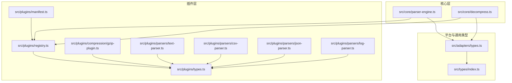
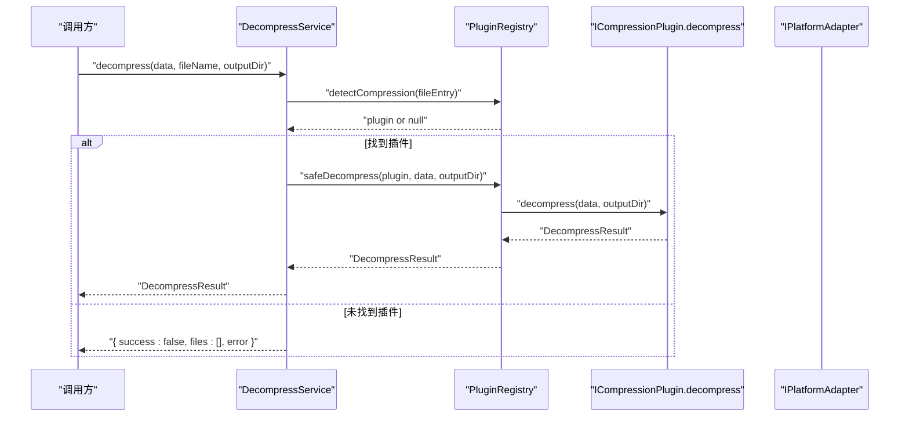
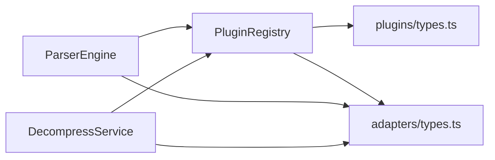

# 插件接口规范

<cite>
**本文引用的文件**
- [src/plugins/types.ts](file://src/plugins/types.ts)
- [src/plugins/parsers/types.ts](file://src/plugins/parsers/types.ts)
- [src/plugins/registry.ts](file://src/plugins/registry.ts)
- [src/core/parser-engine.ts](file://src/core/parser-engine.ts)
- [src/core/decompress.ts](file://src/core/decompress.ts)
- [src/adapters/types.ts](file://src/adapters/types.ts)
- [src/types/index.ts](file://src/types/index.ts)
- [src/plugins/compression/gzip-plugin.ts](file://src/plugins/compression/gzip-plugin.ts)
- [src/plugins/parsers/text-parser.ts](file://src/plugins/parsers/text-parser.ts)
- [src/plugins/parsers/csv-parser.ts](file://src/plugins/parsers/csv-parser.ts)
- [src/plugins/parsers/json-parser.ts](file://src/plugins/parsers/json-parser.ts)
- [src/plugins/parsers/log-parser.ts](file://src/plugins/parsers/log-parser.ts)
- [src/plugins/manifest.ts](file://src/plugins/manifest.ts)
</cite>

## 目录
1. [简介](#简介)
2. [项目结构](#项目结构)
3. [核心组件](#核心组件)
4. [架构总览](#架构总览)
5. [详细组件分析](#详细组件分析)
6. [依赖关系分析](#依赖关系分析)
7. [性能与错误处理](#性能与错误处理)
8. [类型定义与最佳实践](#类型定义与最佳实践)
9. [版本兼容与迁移指南](#版本兼容与迁移指南)
10. [常见问题排查](#常见问题排查)
11. [结论](#结论)

## 简介
本文件为 Hello-Tauri 的插件接口规范参考文档，聚焦于以下目标：
- 完整定义 IFileParserPlugin 与 ICompressionPlugin 接口的属性与方法、参数类型、返回值格式与错误处理约定。
- 深入解释 ParsedResult 数据结构、ConfigSchema 配置模式以及各文件类型的处理方式。
- 提供完整的 TypeScript 类型说明，包括泛型使用、可选属性与类型推断的最佳实践。
- 给出接口版本兼容性策略、向后兼容保证与迁移指南。
- 提供实现示例路径与常见陷阱避免方法。

## 项目结构
与插件接口相关的核心代码分布在如下位置：
- 插件类型与注册中心：src/plugins/types.ts、src/plugins/registry.ts
- 解析器与压缩器实现：src/plugins/parsers/*、src/plugins/compression/*
- 引擎与服务编排：src/core/parser-engine.ts、src/core/decompress.ts
- 平台适配与通用类型：src/adapters/types.ts、src/types/index.ts
- 内置插件清单：src/plugins/manifest.ts



图表来源
- [src/plugins/types.ts:1-37](file://src/plugins/types.ts#L1-L37)
- [src/plugins/registry.ts:1-39](file://src/plugins/registry.ts#L1-L39)
- [src/core/parser-engine.ts:1-34](file://src/core/parser-engine.ts#L1-L34)
- [src/core/decompress.ts:1-26](file://src/core/decompress.ts#L1-L26)
- [src/adapters/types.ts:1-12](file://src/adapters/types.ts#L1-L12)
- [src/types/index.ts:1-71](file://src/types/index.ts#L1-L71)
- [src/plugins/manifest.ts:1-20](file://src/plugins/manifest.ts#L1-L20)
- [src/plugins/compression/gzip-plugin.ts:1-43](file://src/plugins/compression/gzip-plugin.ts#L1-L43)
- [src/plugins/parsers/text-parser.ts:1-7](file://src/plugins/parsers/text-parser.ts#L1-L7)
- [src/plugins/parsers/csv-parser.ts:1-17](file://src/plugins/parsers/csv-parser.ts#L1-L17)
- [src/plugins/parsers/json-parser.ts:1-17](file://src/plugins/parsers/json-parser.ts#L1-L17)
- [src/plugins/parsers/log-parser.ts:1-37](file://src/plugins/parsers/log-parser.ts#L1-L37)

章节来源
- [src/plugins/types.ts:1-37](file://src/plugins/types.ts#L1-L37)
- [src/plugins/registry.ts:1-39](file://src/plugins/registry.ts#L1-L39)
- [src/core/parser-engine.ts:1-34](file://src/core/parser-engine.ts#L1-L34)
- [src/core/decompress.ts:1-26](file://src/core/decompress.ts#L1-L26)
- [src/adapters/types.ts:1-12](file://src/adapters/types.ts#L1-L12)
- [src/types/index.ts:1-71](file://src/types/index.ts#L1-L71)
- [src/plugins/manifest.ts:1-20](file://src/plugins/manifest.ts#L1-L20)

## 核心组件
本节概述插件体系的核心角色与职责：
- IFileParserPlugin：文件解析插件接口，负责将二进制数据解析为结构化结果并返回渲染组件与可选的配置模式。
- ICompressionPlugin：压缩/解压插件接口，负责识别并解压归档或压缩文件，返回统一的结果对象。
- PluginRegistry：插件注册与发现中心，提供按扩展名查找、安全执行（超时与异常兜底）等能力。
- ParserEngine / DecompressService：上层服务，协调适配器读取、插件选择与安全调用。

章节来源
- [src/plugins/types.ts:16-30](file://src/plugins/types.ts#L16-L30)
- [src/plugins/registry.ts:14-39](file://src/plugins/registry.ts#L14-L39)
- [src/core/parser-engine.ts:5-34](file://src/core/parser-engine.ts#L5-L34)
- [src/core/decompress.ts:5-26](file://src/core/decompress.ts#L5-L26)

## 架构总览
下图展示了从“打开文件”到“渲染结果”的关键流程，以及压缩文件的解压流程。

```mermaid
sequenceDiagram
participant UI as "调用方"
participant PE as "ParserEngine"
participant REG as "PluginRegistry"
participant PAR as "IFileParserPlugin.parse"
participant AD as "IPlatformAdapter"
UI->>PE : "resolveFile(node, archivePath)"
PE->>AD : "readFile(path)"
AD-->>PE : "Uint8Array"
PE->>REG : "getParser(ext)"
REG-->>PE : "plugin or null"
alt 找到插件
PE->>REG : "safeParse(plugin, data)"
REG->>PAR : "parse(data, options?)"
PAR-->>REG : "ParsedResult"
REG-->>PE : "ParsedResult"
PE-->>UI : "ParsedContent"
else 未找到插件
PE-->>UI : "null"
end
```

图表来源
- [src/core/parser-engine.ts:11-33](file://src/core/parser-engine.ts#L11-L33)
- [src/plugins/registry.ts:35-39](file://src/plugins/registry.ts#L35-L39)
- [src/adapters/types.ts:4-8](file://src/adapters/types.ts#L4-L8)



图表来源
- [src/core/decompress.ts:11-25](file://src/core/decompress.ts#L11-L25)
- [src/plugins/registry.ts:14-39](file://src/plugins/registry.ts#L14-L39)
- [src/adapters/types.ts:8](file://src/adapters/types.ts#L8)

## 详细组件分析

### IFileParserPlugin 接口
- 名称与用途
  - 用于声明一个文件解析插件，支持按扩展名匹配、解析二进制数据、返回渲染组件与可选配置模式。
- 关键属性与方法
  - name: string — 插件唯一标识
  - supportedExtensions: string[] — 支持的扩展名列表（如 .txt、.csv、.json、.log、.hex）
  - canParse(file: FileEntry): boolean — 根据文件名判断是否可解析
  - parse(data: Uint8Array, options?: Record<string, any>): Promise<ParsedResult> — 解析入口
  - getComponent(): Component — 返回 Vue 渲染组件
  - getConfigSchema?(): ConfigSchema — 可选，返回配置表单模式
- 参数与返回值约定
  - data 为原始字节数组；options 由上层传入，供插件按需消费（例如 CSV 分隔符）。
  - 返回 ParsedResult，包含 type、data、lineCount 等字段。
- 错误处理约定
  - 插件内部应尽量避免抛出未捕获异常；若发生错误，建议通过 safeParse 的兜底机制回退为 hex 视图。
- 典型实现参考
  - 文本解析：[text-parser.ts:1-7](file://src/plugins/parsers/text-parser.ts#L1-L7)
  - CSV 解析：[csv-parser.ts:1-17](file://src/plugins/parsers/csv-parser.ts#L1-L17)
  - JSON 解析：[json-parser.ts:1-17](file://src/plugins/parsers/json-parser.ts#L1-L17)
  - 日志解析：[log-parser.ts:1-37](file://src/plugins/parsers/log-parser.ts#L1-L37)

章节来源
- [src/plugins/types.ts:23-30](file://src/plugins/types.ts#L23-L30)
- [src/plugins/parsers/text-parser.ts:1-7](file://src/plugins/parsers/text-parser.ts#L1-L7)
- [src/plugins/parsers/csv-parser.ts:1-17](file://src/plugins/parsers/csv-parser.ts#L1-L17)
- [src/plugins/parsers/json-parser.ts:1-17](file://src/plugins/parsers/json-parser.ts#L1-L17)
- [src/plugins/parsers/log-parser.ts:1-37](file://src/plugins/parsers/log-parser.ts#L1-L37)

### ICompressionPlugin 接口
- 名称与用途
  - 用于声明压缩/解压插件，支持按扩展名匹配与解压操作。
- 关键属性与方法
  - name: string — 插件唯一标识
  - supportedExtensions: string[] — 支持的扩展名列表（如 .zip、.gz、.gzip、.tgz）
  - canHandle(file: FileEntry): boolean — 根据文件名判断是否可处理
  - decompress(data: Uint8Array, outputDir: string): Promise<DecompressResult> — 解压入口
- 参数与返回值约定
  - data 为原始字节数组；outputDir 为目标输出目录。
  - 返回 DecompressResult，包含 success、files、error 等字段。
- 错误处理约定
  - 插件内部应返回成功/失败状态；失败时需提供 error 信息。
- 典型实现参考
  - Gzip 插件：[gzip-plugin.ts:1-43](file://src/plugins/compression/gzip-plugin.ts#L1-L43)

章节来源
- [src/plugins/types.ts:16-21](file://src/plugins/types.ts#L16-L21)
- [src/plugins/compression/gzip-plugin.ts:1-43](file://src/plugins/compression/gzip-plugin.ts#L1-L43)

### ParsedResult 数据结构
- 字段说明
  - type: 'text' | 'csv' | 'json' | 'hex' | 'log' — 解析结果类型
  - data: any — 具体数据内容，随 type 不同而结构不同
  - lineCount?: number — 行数统计（可选）
- 类型约束与扩展
  - 新增 'log' 类型后，上层渲染需能处理该类型分支。
- 相关类型
  - 日志行类型 LogLine 与级别 LogLevel 定义在 parsers/types.ts。

章节来源
- [src/plugins/types.ts:32-36](file://src/plugins/types.ts#L32-L36)
- [src/plugins/parsers/types.ts:1-11](file://src/plugins/parsers/types.ts#L1-L11)

### ConfigSchema 配置模式
- 字段说明
  - fields: ConfigField[] — 配置项列表
  - ConfigField.key: string — 配置键
  - ConfigField.label: string — 显示标签
  - ConfigField.type: 'input' | 'select' | 'switch' | 'number' — 控件类型
  - ConfigField.default: any — 默认值
  - ConfigField.options?: { label: string; value: any }[] — 选项（适用于 select）
- 用途
  - 为解析插件提供动态配置表单，驱动解析行为（如 CSV 分隔符）。

章节来源
- [src/plugins/types.ts:4-14](file://src/plugins/types.ts#L4-L14)

### 文件类型处理方式
- text
  - 以 UTF-8 解码为字符串，统计行数，返回 type='text'。
  - 参考：[text-parser.ts:1-7](file://src/plugins/parsers/text-parser.ts#L1-L7)
- csv
  - 按换行分割，首行为表头，后续为行数据；支持自定义分隔符。
  - 参考：[csv-parser.ts:1-17](file://src/plugins/parsers/csv-parser.ts#L1-L17)
- json
  - 优先整体 JSON 解析，失败则尝试每行独立 JSON；格式化后统计行数。
  - 参考：[json-parser.ts:1-17](file://src/plugins/parsers/json-parser.ts#L1-L17)
- log
  - 基于正则提取时间戳、级别、模块与消息；不匹配的行标记为 OTHER。
  - 参考：[log-parser.ts:1-37](file://src/plugins/parsers/log-parser.ts#L1-L37)
- hex
  - 当解析失败时，由安全包装返回 hex 视图，data 为原始字节数组。
  - 参考：[registry.ts:1-39](file://src/plugins/registry.ts#L1-L39)

章节来源
- [src/plugins/parsers/text-parser.ts:1-7](file://src/plugins/parsers/text-parser.ts#L1-L7)
- [src/plugins/parsers/csv-parser.ts:1-17](file://src/plugins/parsers/csv-parser.ts#L1-L17)
- [src/plugins/parsers/json-parser.ts:1-17](file://src/plugins/parsers/json-parser.ts#L1-L17)
- [src/plugins/parsers/log-parser.ts:1-37](file://src/plugins/parsers/log-parser.ts#L1-L37)
- [src/plugins/registry.ts:1-39](file://src/plugins/registry.ts#L1-L39)

### 类图：插件接口与核心类型
```mermaid
classDiagram
class IFileParserPlugin {
+string name
+string[] supportedExtensions
+canParse(file : FileEntry) bool
+parse(data : Uint8Array, options? : Record~string, any~) Promise~ParsedResult~
+getComponent() Component
+getConfigSchema() ConfigSchema
}
class ICompressionPlugin {
+string name
+string[] supportedExtensions
+canHandle(file : FileEntry) bool
+decompress(data : Uint8Array, outputDir : string) Promise~DecompressResult~
}
class ParsedResult {
+type : "text"|"csv"|"json"|"hex"|"log"
+data : any
+lineCount? : number
}
class ConfigSchema {
+fields : ConfigField[]
}
class ConfigField {
+key : string
+label : string
+type : "input"|"select"|"switch"|"number"
+default : any
+options? : {label : string;value : any}[]
}
class FileEntry {
+name : string
+path : string
+size : number
+isDirectory : boolean
+lastModified? : number
}
class DecompressResult {
+success : boolean
+files : FileEntry[]
+error? : string
}
IFileParserPlugin --> ParsedResult : "返回"
ICompressionPlugin --> DecompressResult : "返回"
IFileParserPlugin --> FileEntry : "输入"
ICompressionPlugin --> FileEntry : "输入"
ConfigSchema --> ConfigField : "包含"
```

图表来源
- [src/plugins/types.ts:4-36](file://src/plugins/types.ts#L4-L36)
- [src/types/index.ts:1-13](file://src/types/index.ts#L1-L13)

## 依赖关系分析
- 插件注册与发现
  - PluginRegistry 维护 parser 与 compression 两类插件映射，并提供 detect/get 方法与 safe* 安全执行封装。
- 上层服务编排
  - ParserEngine 负责读取文件、选择插件、调用 safeParse 并组装 ParsedContent。
  - DecompressService 负责选择压缩插件、调用 safeDecompress 并返回 DecompressResult。
- 平台适配
  - IPlatformAdapter 抽象了跨平台能力（读文件、解压等），Web 与 Tauri 分别实现。



图表来源
- [src/core/parser-engine.ts:1-34](file://src/core/parser-engine.ts#L1-L34)
- [src/core/decompress.ts:1-26](file://src/core/decompress.ts#L1-L26)
- [src/plugins/registry.ts:1-39](file://src/plugins/registry.ts#L1-L39)
- [src/adapters/types.ts:1-12](file://src/adapters/types.ts#L1-L12)

章节来源
- [src/plugins/registry.ts:14-39](file://src/plugins/registry.ts#L14-L39)
- [src/core/parser-engine.ts:5-34](file://src/core/parser-engine.ts#L5-L34)
- [src/core/decompress.ts:5-26](file://src/core/decompress.ts#L5-L26)
- [src/adapters/types.ts:1-12](file://src/adapters/types.ts#L1-L12)

## 性能与错误处理
- 超时保护
  - 解析与解压均通过 withTimeout 进行超时控制，防止阻塞主线程。
- 异常兜底
  - 解析失败时，safeParse 返回 hex 视图，确保用户仍可查看原始数据。
  - 解压失败时，safeDecompress 返回失败结果并携带错误信息。
- 资源与内存
  - 大文件建议使用流式读取（streamRead）与内存映射（mmapRead）以减少峰值内存占用。
- 建议
  - 插件内避免同步阻塞逻辑；对大文件采用分块处理。
  - 合理设置超时阈值，结合业务场景调整。

章节来源
- [src/plugins/registry.ts:6-12](file://src/plugins/registry.ts#L6-L12)
- [src/plugins/registry.ts:210-234](file://src/plugins/registry.ts#L210-L234)

## 类型定义与最佳实践
- 泛型使用
  - 当前接口未显式使用泛型，但可在未来扩展时使用泛型约束 data 的具体结构，提升类型安全。
- 可选属性处理
  - ParsedResult.lineCount 为可选，建议在统计成本较高时按需计算。
  - ConfigField.options 为可选，仅在 type='select' 时有效。
- 类型推断
  - 使用字面量联合类型（如 type: 'text'|'csv'|...）配合 discriminated union，可获得更好的分支推断。
- 命名与一致性
  - 插件 name 应保持全局唯一；supportedExtensions 建议小写且带点号前缀。
- 常见陷阱
  - 未在 canParse/canHandle 中严格匹配扩展名导致误判。
  - 解析函数抛出未捕获异常，导致上层无法回退。
  - 忽略空文件或非法编码导致的崩溃。

章节来源
- [src/plugins/types.ts:32-36](file://src/plugins/types.ts#L32-L36)
- [src/plugins/types.ts:4-14](file://src/plugins/types.ts#L4-L14)
- [src/plugins/parsers/log-parser.ts:1-37](file://src/plugins/parsers/log-parser.ts#L1-L37)

## 版本兼容与迁移指南
- 向后兼容策略
  - 新增可选属性（如 lineCount、getConfigSchema）不影响现有实现。
  - 扩展 ParsedResult.type 联合类型（增加 'log'）不会破坏已有赋值，但需要上层渲染覆盖新分支。
- 迁移步骤
  - 更新渲染层以支持新的 type 分支。
  - 为现有插件补充 getConfigSchema 以启用配置面板（可选）。
  - 校验所有插件的 supportedExtensions 与 canParse/canHandle 的一致性。
- 废弃与替换
  - 若未来移除某 type 或字段，应在 registry 层提供降级策略（如回退至 hex）。

章节来源
- [src/plugins/types.ts:32-36](file://src/plugins/types.ts#L32-L36)
- [src/plugins/registry.ts:1-39](file://src/plugins/registry.ts#L1-L39)

## 常见问题排查
- 问题：解析结果为 null
  - 可能原因：未找到匹配的解析插件或插件被禁用。
  - 排查：检查 registry.getParser(ext) 返回值与 disabled 集合。
- 问题：解析耗时过长
  - 可能原因：插件未使用超时保护或存在阻塞逻辑。
  - 排查：确认 safeParse 已启用超时，优化插件实现。
- 问题：解压失败
  - 可能原因：无对应压缩插件或平台不支持。
  - 排查：检查 detectCompression 与 safeDecompress 的错误信息。
- 问题：日志解析不准确
  - 可能原因：日志格式不符合预期正则。
  - 排查：调整正则或归入 OTHER 分支。

章节来源
- [src/core/parser-engine.ts:11-33](file://src/core/parser-engine.ts#L11-L33)
- [src/core/decompress.ts:11-25](file://src/core/decompress.ts#L11-L25)
- [src/plugins/parsers/log-parser.ts:1-37](file://src/plugins/parsers/log-parser.ts#L1-L37)

## 结论
本文档系统化梳理了 Hello-Tauri 的插件接口规范，明确了 IFileParserPlugin 与 ICompressionPlugin 的职责边界、类型契约与错误处理约定，并结合实际实现给出了类型与架构层面的最佳实践。遵循本规范可实现高内聚、低耦合的插件生态，便于扩展与维护。