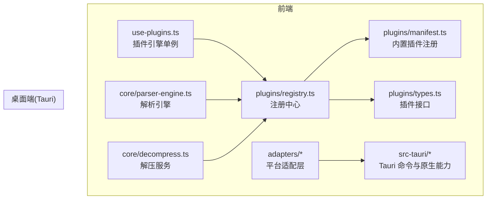
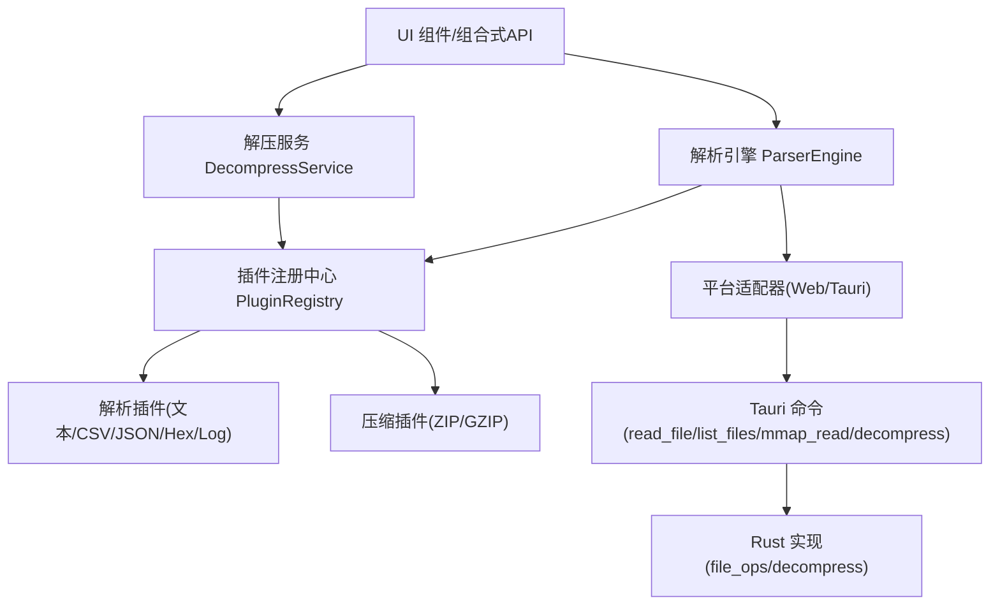
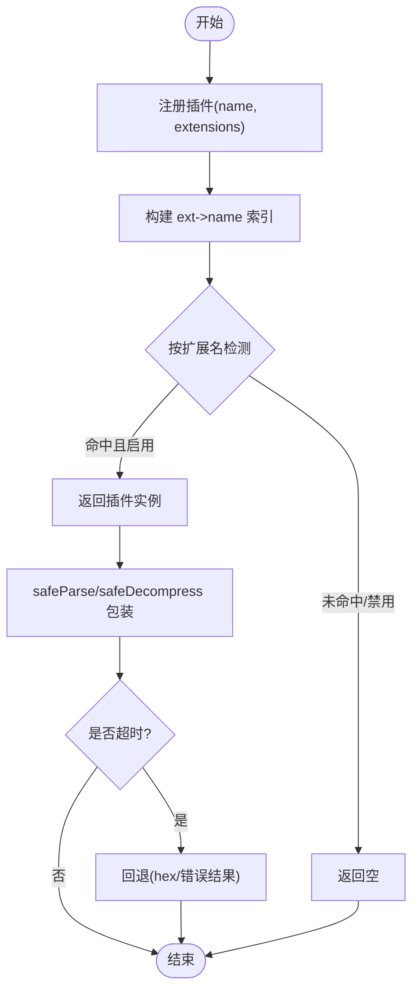
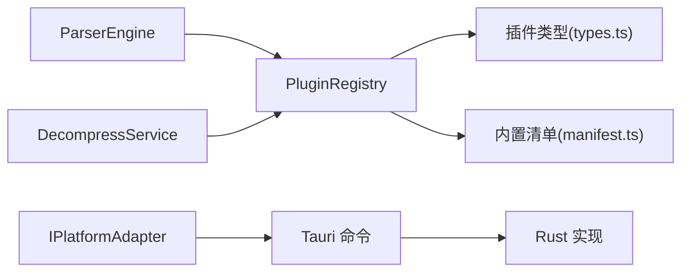

# 插件架构设计

<cite>
**本文引用的文件**   
- [README.md](file://README.md)
- [src/plugins/registry.ts](file://src/plugins/registry.ts)
- [src/plugins/types.ts](file://src/plugins/types.ts)
- [src/plugins/manifest.ts](file://src/plugins/manifest.ts)
- [src/composables/use-plugins.ts](file://src/composables/use-plugins.ts)
- [src/core/parser-engine.ts](file://src/core/parser-engine.ts)
- [src/core/decompress.ts](file://src/core/decompress.ts)
- [src/composables/use-decompress.ts](file://src/composables/use-decompress.ts)
- [src/adapters/types.ts](file://src/adapters/types.ts)
- [src/adapters/tauri-adapter.ts](file://src/adapters/tauri-adapter.ts)
- [src/adapters/web-adapter.ts](file://src/adapters/web-adapter.ts)
- [src-tauri/src/lib.rs](file://src-tauri/src/lib.rs)
- [src-tauri/src/commands.rs](file://src-tauri/src/commands.rs)
- [src-tauri/src/decompress.rs](file://src-tauri/src/decompress.rs)
- [src-tauri/src/file_ops.rs](file://src-tauri/src/file_ops.rs)
- [src/types/index.ts](file://src/types/index.ts)
- [src/plugins/parser/text-plugin.ts](file://src/plugins/parser/text-plugin.ts)
- [src/plugins/compression/zip-plugin.ts](file://src/plugins/compression/zip-plugin.ts)
</cite>

## 目录
1. [引言](#引言)
2. [项目结构](#项目结构)
3. [核心组件](#核心组件)
4. [架构总览](#架构总览)
5. [详细组件分析](#详细组件分析)
6. [依赖关系分析](#依赖关系分析)
7. [性能与内存管理](#性能与内存管理)
8. [故障排查指南](#故障排查指南)
9. [结论](#结论)
10. [附录](#附录)

## 引言
本技术文档围绕 Hello-Tauri 的插件架构进行系统化阐述，重点覆盖以下方面：
- 插件注册中心的工作原理、插件发现机制与版本兼容性策略
- 插件生命周期管理与安全沙箱执行环境的设计
- 插件与核心系统的解耦设计（接口抽象、事件通信、错误隔离）
- 插件加载、初始化、执行与卸载的完整流程（架构图与数据流图）
- 插件性能监控、内存管理与资源清理的最佳实践

该项目采用“微内核 + 插件”的架构模式，前端基于 Vue 3 + TypeScript，桌面端通过 Tauri 2（Rust）提供系统能力。内置解析器与压缩插件可按需扩展，并通过平台适配器在 Web 与桌面两端保持一致行为。

## 项目结构
从插件视角看，关键目录与职责如下：
- src/plugins：插件类型定义、注册中心、内置插件清单与具体插件实现
- src/core：解析引擎与解压编排服务，作为插件消费方
- src/adapters：平台适配层，屏蔽 Web/Tauri 差异
- src-tauri：Tauri 后端命令与原生解压、mmap 读取等能力
- src/composables：组合式 API，暴露 usePluginEngine 等高层入口

图表来源
- [src/composables/use-plugins.ts:1-17](file://src/composables/use-plugins.ts#L1-L17)
- [src/plugins/registry.ts:1-118](file://src/plugins/registry.ts#L1-L118)
- [src/plugins/manifest.ts:1-20](file://src/plugins/manifest.ts#L1-L20)
- [src/plugins/types.ts:1-37](file://src/plugins/types.ts#L1-L37)
- [src/core/parser-engine.ts:1-35](file://src/core/parser-engine.ts#L1-L35)
- [src/core/decompress.ts:1-27](file://src/core/decompress.ts#L1-L27)
- [src/adapters/tauri-adapter.ts:1-62](file://src/adapters/tauri-adapter.ts#L1-L62)
- [src-tauri/src/lib.rs:1-19](file://src-tauri/src/lib.rs#L1-L19)

章节来源
- [README.md:71-127](file://README.md#L71-L127)

## 核心组件
- 插件接口与类型
  - 解析插件 IFileParserPlugin：声明名称、支持扩展名、匹配规则、解析方法、渲染组件与可选配置 Schema
  - 压缩插件 ICompressionPlugin：声明名称、支持扩展名、匹配规则、解压方法与结果模型
  - 统一结果模型：ParsedResult、DecompressResult、FileEntry 等
- 插件注册中心 PluginRegistry
  - 维护解析器与压缩器的映射表，按扩展名快速定位
  - 提供启用/禁用、检测、安全调用封装（超时保护、异常兜底）
- 插件清单 manifest
  - 集中注册内置插件，便于扩展点统一管理
- 插件引擎 usePluginEngine
  - 对外暴露 registry 实例及常用操作（detect/get/enable/disable）
- 解析引擎 ParserEngine
  - 结合平台适配器读取文件字节，按扩展名选择插件并安全解析，附带性能指标
- 解压服务 DecompressService
  - 根据文件名检测压缩插件，委托注册中心安全解压
- 平台适配器
  - WebAdapter：基于 fetch/memcache/stream 的纯前端实现
  - TauriAdapter：通过 IPC 调用 Rust 命令，复用原生解压与 mmap 能力

章节来源
- [src/plugins/types.ts:1-37](file://src/plugins/types.ts#L1-L37)
- [src/plugins/registry.ts:1-118](file://src/plugins/registry.ts#L1-L118)
- [src/plugins/manifest.ts:1-20](file://src/plugins/manifest.ts#L1-L20)
- [src/composables/use-plugins.ts:1-17](file://src/composables/use-plugins.ts#L1-L17)
- [src/core/parser-engine.ts:1-35](file://src/core/parser-engine.ts#L1-L35)
- [src/core/decompress.ts:1-27](file://src/core/decompress.ts#L1-L27)
- [src/adapters/types.ts:1-12](file://src/adapters/types.ts#L1-L12)
- [src/adapters/web-adapter.ts:1-73](file://src/adapters/web-adapter.ts#L1-L73)
- [src/adapters/tauri-adapter.ts:1-62](file://src/adapters/tauri-adapter.ts#L1-L62)

## 架构总览
整体采用“前端微内核 + 插件 + 平台适配 + 后端命令”的分层架构。插件通过统一接口接入，注册中心负责发现与调度；解析与解压由核心服务编排；平台差异由适配器桥接至 Tauri 命令，最终由 Rust 侧完成高性能 IO 与解压。

图表来源
- [src/core/parser-engine.ts:1-35](file://src/core/parser-engine.ts#L1-L35)
- [src/core/decompress.ts:1-27](file://src/core/decompress.ts#L1-L27)
- [src/plugins/registry.ts:1-118](file://src/plugins/registry.ts#L1-L118)
- [src/adapters/tauri-adapter.ts:1-62](file://src/adapters/tauri-adapter.ts#L1-L62)
- [src-tauri/src/commands.rs:1-53](file://src-tauri/src/commands.rs#L1-L53)
- [src-tauri/src/file_ops.rs:1-88](file://src-tauri/src/file_ops.rs#L1-L88)
- [src-tauri/src/decompress.rs:1-83](file://src-tauri/src/decompress.rs#L1-L83)

## 详细组件分析

### 插件注册中心与发现机制
- 注册与索引
  - 解析器与压缩器分别维护 name->plugin 与 ext->name 的双向索引，支持按扩展名快速查找
  - 支持运行时启用/禁用，检测时自动跳过已禁用项
- 插件发现
  - detect/detectCompression 遍历扩展名映射，优先返回首个匹配的可用插件
  - detectByFileName 从文件名提取扩展名后走 getParser
- 安全执行
  - safeParse/safeDecompress 包裹超时保护与异常捕获，失败时回退为 hex 或错误结果
- 版本兼容性与依赖解析
  - 当前未引入显式版本字段与依赖声明，建议未来在插件元信息中增加 version 与 dependencies，并在注册阶段校验最小版本与依赖可用性

图表来源
- [src/plugins/registry.ts:1-118](file://src/plugins/registry.ts#L1-L118)

章节来源
- [src/plugins/registry.ts:1-118](file://src/plugins/registry.ts#L1-L118)

### 插件生命周期管理
- 加载与初始化
  - 应用启动时通过 usePluginEngine 创建全局 registry，并调用 registerBuiltinPlugins 注册内置插件
- 运行期使用
  - 解析：ParserEngine 读取文件字节 -> 按扩展名获取插件 -> safeParse -> 返回带性能指标的 ParsedContent
  - 解压：DecompressService/useDecompress 检测压缩插件 -> safeDecompress -> 构建文件树并更新状态
- 卸载与禁用
  - 通过 disable 将插件加入黑名单，后续 detect 不再返回；如需彻底释放资源，可在插件内部实现 dispose 钩子（当前未定义）

```mermaid
sequenceDiagram
participant App as "应用"
participant Engine as "usePluginEngine"
participant Registry as "PluginRegistry"
participant Manifest as "registerBuiltinPlugins"
participant Parser as "ParserEngine"
participant Adapter as "IPlatformAdapter"
participant Tauri as "Tauri 命令"
App->>Engine : 初始化
Engine->>Registry : new()
Engine->>Manifest : registerBuiltinPlugins(registry)
Manifest-->>Registry : 注册内置插件
App->>Parser : resolveFile(node, archivePath)
Parser->>Adapter : readFile(path)
Adapter-->>Parser : Uint8Array
Parser->>Registry : getParser(ext)
Registry-->>Parser : plugin
Parser->>Registry : safeParse(plugin, data)
Registry-->>Parser : ParsedResult
Parser-->>App : ParsedContent{loadTimeMs, pluginName}
```

图表来源
- [src/composables/use-plugins.ts:1-17](file://src/composables/use-plugins.ts#L1-L17)
- [src/plugins/manifest.ts:1-20](file://src/plugins/manifest.ts#L1-L20)
- [src/core/parser-engine.ts:1-35](file://src/core/parser-engine.ts#L1-L35)
- [src/adapters/tauri-adapter.ts:1-62](file://src/adapters/tauri-adapter.ts#L1-L62)
- [src-tauri/src/commands.rs:1-53](file://src-tauri/src/commands.rs#L1-L53)

章节来源
- [src/composables/use-plugins.ts:1-17](file://src/composables/use-plugins.ts#L1-L17)
- [src/plugins/manifest.ts:1-20](file://src/plugins/manifest.ts#L1-L20)
- [src/core/parser-engine.ts:1-35](file://src/core/parser-engine.ts#L1-L35)

### 安全沙箱执行环境与错误隔离
- 超时保护
  - withTimeout 对插件 parse/decompress 设置固定超时阈值，避免阻塞主线程
- 异常兜底
  - safeParse 捕获异常后返回 hex 类型结果，确保 UI 仍可展示原始二进制
  - safeDecompress 捕获异常后返回 success=false 的错误结果，上层可据此提示用户
- 路径与权限控制
  - Tauri read_file 命令拒绝包含 ".." 的路径，防止路径穿越
  - mmap_read 检查偏移与长度不越界，避免非法访问
- 平台隔离
  - Web 模式下 writeFile/listFiles/decompress 默认不可用，抛出明确错误，避免误用

章节来源
- [src/plugins/registry.ts:1-118](file://src/plugins/registry.ts#L1-L118)
- [src-tauri/src/commands.rs:1-53](file://src-tauri/src/commands.rs#L1-L53)
- [src-tauri/src/file_ops.rs:1-88](file://src-tauri/src/file_ops.rs#L1-L88)
- [src/adapters/web-adapter.ts:1-73](file://src/adapters/web-adapter.ts#L1-L73)

### 插件与核心系统的解耦设计
- 接口抽象
  - IFileParserPlugin/ICompressionPlugin 定义稳定契约，核心仅依赖接口而非具体实现
- 事件通信
  - 当前以同步/异步返回值为主，未引入事件总线；可在未来通过事件通道实现插件间解耦通知
- 错误隔离
  - 注册中心的 safe* 方法将插件异常限制在调用边界内，不影响核心稳定性
- 平台无关性
  - 通过 IPlatformAdapter 抽象，插件无需感知底层差异；Tauri 与 Web 各自实现

章节来源
- [src/plugins/types.ts:1-37](file://src/plugins/types.ts#L1-L37)
- [src/adapters/types.ts:1-12](file://src/adapters/types.ts#L1-L12)
- [src/adapters/tauri-adapter.ts:1-62](file://src/adapters/tauri-adapter.ts#L1-L62)
- [src/adapters/web-adapter.ts:1-73](file://src/adapters/web-adapter.ts#L1-L73)

### 典型插件示例
- 文本解析插件 text-plugin
  - 声明支持的扩展名集合，canParse 基于后缀匹配，parse 委托给通用解析器，getComponent 返回渲染组件
- ZIP 压缩插件 zip-plugin
  - 在 Tauri 平台下通过适配器调用后端 decompress；Web 平台下尝试使用 fflate 解压并写入内存存储

章节来源
- [src/plugins/parser/text-plugin.ts:1-18](file://src/plugins/parser/text-plugin.ts#L1-L18)
- [src/plugins/compression/zip-plugin.ts:1-40](file://src/plugins/compression/zip-plugin.ts#L1-L40)

## 依赖关系分析
- 模块耦合
  - 注册中心被解析引擎与解压服务共同依赖，属于高内聚低耦合的核心枢纽
  - 平台适配器独立于插件体系，仅被核心服务与部分插件间接使用
- 外部依赖
  - Tauri 命令与 Rust 库提供文件系统、mmap、解压等能力
  - Web 模式依赖浏览器 API 与可选第三方库（如 fflate）

图表来源
- [src/plugins/registry.ts:1-118](file://src/plugins/registry.ts#L1-L118)
- [src/plugins/types.ts:1-37](file://src/plugins/types.ts#L1-L37)
- [src/plugins/manifest.ts:1-20](file://src/plugins/manifest.ts#L1-L20)
- [src/core/parser-engine.ts:1-35](file://src/core/parser-engine.ts#L1-L35)
- [src/core/decompress.ts:1-27](file://src/core/decompress.ts#L1-L27)
- [src/adapters/tauri-adapter.ts:1-62](file://src/adapters/tauri-adapter.ts#L1-L62)
- [src-tauri/src/commands.rs:1-53](file://src-tauri/src/commands.rs#L1-L53)

章节来源
- [src-tauri/src/lib.rs:1-19](file://src-tauri/src/lib.rs#L1-L19)
- [src-tauri/src/commands.rs:1-53](file://src-tauri/src/commands.rs#L1-L53)
- [src-tauri/src/decompress.rs:1-83](file://src-tauri/src/decompress.rs#L1-L83)
- [src-tauri/src/file_ops.rs:1-88](file://src-tauri/src/file_ops.rs#L1-L88)

## 性能与内存管理
- 性能监控
  - ParserEngine 记录 loadTimeMs，便于统计各插件解析耗时与热点识别
- 大文件友好
  - 使用 mmap 零拷贝读取指定范围，减少内存峰值与拷贝开销
  - Web 模式支持 Range 请求与 ReadableStream 分块处理，降低首屏压力
- 并发与队列
  - 解压任务通过 TaskScheduler 控制并发度，避免同时大量解压导致卡顿
- 内存与资源清理
  - 建议在插件接口中增加 dispose/cleanup 钩子，用于释放临时文件、关闭句柄、清空缓存
  - 对于 Web 模式下的内存存储，应提供过期策略与容量上限，避免长期驻留占用内存

章节来源
- [src/core/parser-engine.ts:1-35](file://src/core/parser-engine.ts#L1-L35)
- [src-tauri/src/file_ops.rs:1-88](file://src-tauri/src/file_ops.rs#L1-L88)
- [src/adapters/web-adapter.ts:1-73](file://src/adapters/web-adapter.ts#L1-L73)
- [src/composables/use-decompress.ts:1-74](file://src/composables/use-decompress.ts#L1-L74)

## 故障排查指南
- 插件超时
  - 现象：解析/解压长时间无响应
  - 排查：确认插件耗时是否超过阈值；必要时优化算法或改用后端解压
- 插件禁用
  - 现象：特定扩展名无法解析
  - 排查：检查是否被 disable；通过 enable 恢复
- 路径穿越防护
  - 现象：read_file 报错权限不足
  - 排查：确认路径不包含 ".."；遵循白名单策略
- 越界读取
  - 现象：mmap_read 报输入无效
  - 排查：校验 offset/length 不超过文件大小
- Web 模式不支持
  - 现象：writeFile/listFiles/decompress 抛错
  - 排查：切换至 Tauri 模式或使用 Web 兼容方案（如 fflate）

章节来源
- [src/plugins/registry.ts:1-118](file://src/plugins/registry.ts#L1-L118)
- [src-tauri/src/commands.rs:1-53](file://src-tauri/src/commands.rs#L1-L53)
- [src-tauri/src/file_ops.rs:1-88](file://src-tauri/src/file_ops.rs#L1-L88)
- [src/adapters/web-adapter.ts:1-73](file://src/adapters/web-adapter.ts#L1-L73)

## 结论
Hello-Tauri 的插件架构以清晰的接口抽象与注册中心为核心，实现了插件与主系统的松耦合。通过超时保护与异常兜底，提升了鲁棒性；借助平台适配器与 Tauri 命令，兼顾了跨端一致性与高性能。建议在后续迭代中完善插件版本与依赖管理、增加资源清理钩子与更丰富的监控指标，以支撑更大规模的生态扩展。

## 附录
- 数据类型参考
  - FileEntry、DecompressResult、ParsedContent、ArchiveItem、TabItem 等定义位于 types/index.ts
- 内置插件清单
  - 文本/CSV/JSON/日志/十六进制解析器与 ZIP/GZIP 压缩器均在 manifest 中集中注册

章节来源
- [src/types/index.ts:1-71](file://src/types/index.ts#L1-L71)
- [src/plugins/manifest.ts:1-20](file://src/plugins/manifest.ts#L1-L20)