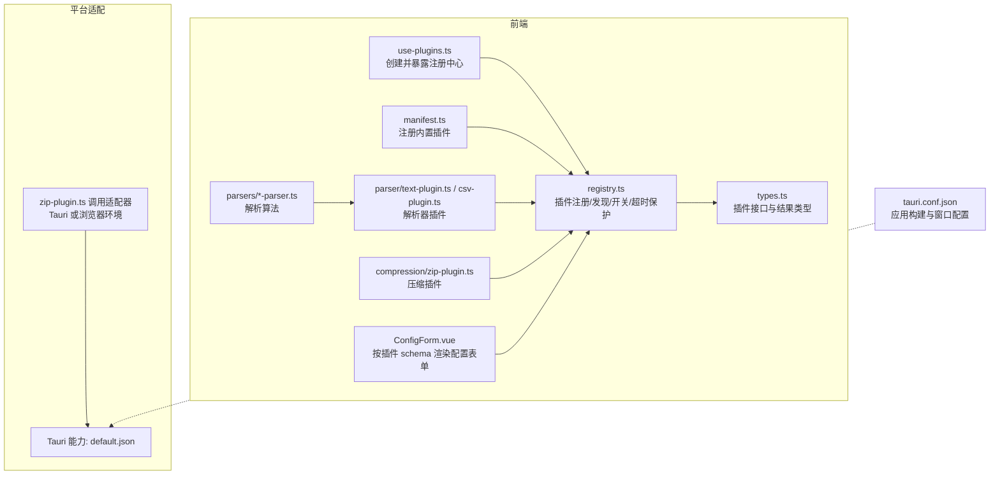
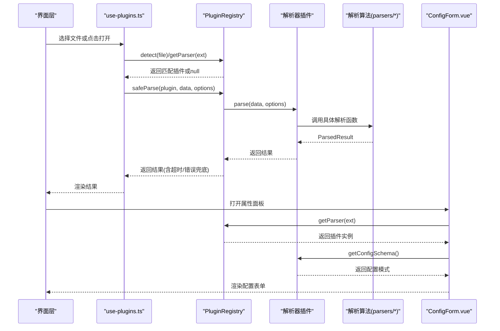
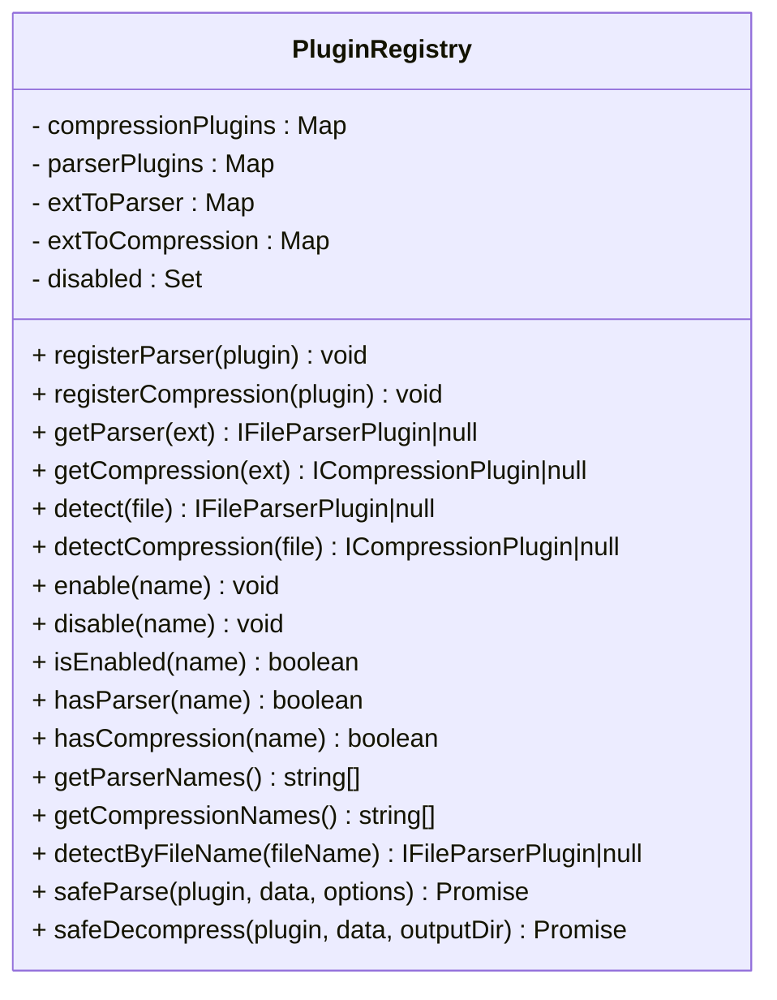
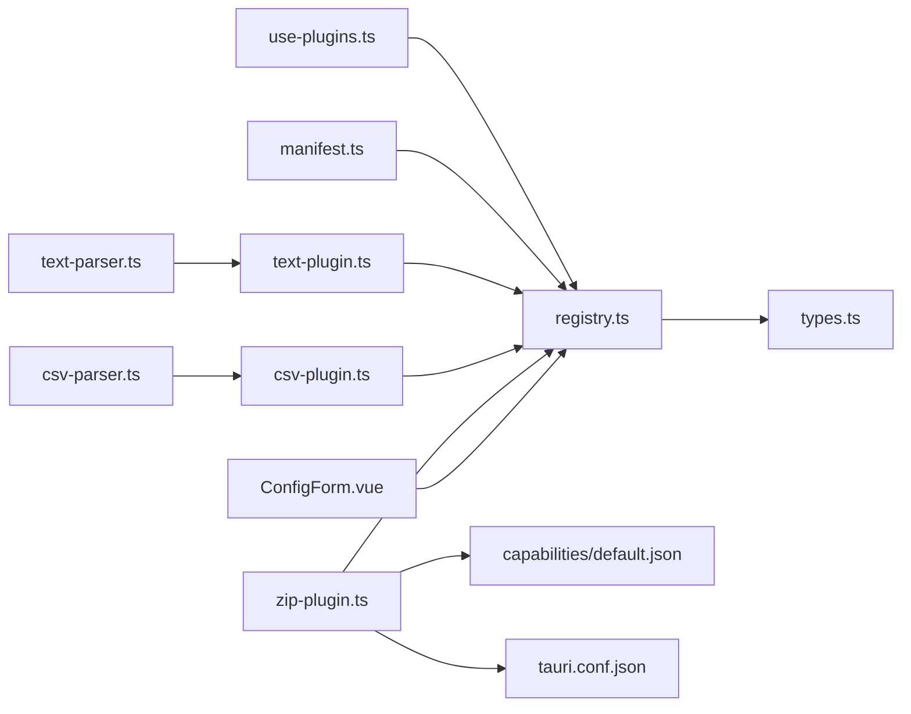

# 插件管理

<cite>
**本文引用的文件**   
- [src/plugins/registry.ts](file://src/plugins/registry.ts)
- [src/plugins/manifest.ts](file://src/plugins/manifest.ts)
- [src/plugins/types.ts](file://src/plugins/types.ts)
- [src/composables/use-plugins.ts](file://src/composables/use-plugins.ts)
- [src/plugins/parser/text-plugin.ts](file://src/plugins/parser/text-plugin.ts)
- [src/plugins/parser/csv-plugin.ts](file://src/plugins/parser/csv-plugin.ts)
- [src/plugins/compression/zip-plugin.ts](file://src/plugins/compression/zip-plugin.ts)
- [src/plugins/parsers/text-parser.ts](file://src/plugins/parsers/text-parser.ts)
- [src/plugins/parsers/csv-parser.ts](file://src/plugins/parsers/csv-parser.ts)
- [src/types/index.ts](file://src/types/index.ts)
- [src/components/property-panel/ConfigForm.vue](file://src/components/property-panel/ConfigForm.vue)
- [src-tauri/capabilities/default.json](file://src-tauri/capabilities/default.json)
- [src-tauri/tauri.conf.json](file://src-tauri/tauri.conf.json)
</cite>

## 目录
1. [简介](#简介)
2. [项目结构](#项目结构)
3. [核心组件](#核心组件)
4. [架构总览](#架构总览)
5. [详细组件分析](#详细组件分析)
6. [依赖分析](#依赖分析)
7. [性能考虑](#性能考虑)
8. [故障排查指南](#故障排查指南)
9. [结论](#结论)
10. [附录](#附录)

## 简介
本指南面向 Hello-Tauri 的插件管理系统，聚焦于“插件注册中心”的实现原理与使用方式。内容涵盖：
- 插件发现机制、动态加载策略与热重载支持现状
- 插件清单（manifest）与元数据定义、配置模式（schema）与依赖声明语法
- 插件安装、更新、卸载流程建议与实现路径
- 权限控制、安全验证与资源限制机制
- 冲突检测、版本兼容性检查与回滚策略
- 插件监控面板与性能指标分析方法
- 备份、迁移与批量管理的实用工具建议

说明：当前仓库实现了基于内存的插件注册中心与内置插件注册；尚未提供持久化清单、远程仓库、在线安装与热重载等能力。本文在“现状”基础上给出可落地的扩展方案与最佳实践。

## 项目结构
与插件系统相关的核心位置如下：
- 注册中心与类型定义：src/plugins/registry.ts、src/plugins/types.ts
- 内置插件清单：src/plugins/manifest.ts
- 组合式入口：src/composables/use-plugins.ts
- 具体插件示例：src/plugins/parser/*.ts、src/plugins/compression/*.ts
- 解析器实现：src/plugins/parsers/*.ts
- 类型与数据结构：src/types/index.ts
- 配置表单渲染：src/components/property-panel/ConfigForm.vue
- Tauri 能力与打包配置：src-tauri/capabilities/default.json、src-tauri/tauri.conf.json

图表来源
- [src/composables/use-plugins.ts:1-17](file://src/composables/use-plugins.ts#L1-L17)
- [src/plugins/registry.ts:1-118](file://src/plugins/registry.ts#L1-L118)
- [src/plugins/types.ts:1-37](file://src/plugins/types.ts#L1-L37)
- [src/plugins/manifest.ts:1-20](file://src/plugins/manifest.ts#L1-L20)
- [src/plugins/parser/text-plugin.ts:1-18](file://src/plugins/parser/text-plugin.ts#L1-L18)
- [src/plugins/parser/csv-plugin.ts:1-28](file://src/plugins/parser/csv-plugin.ts#L1-L28)
- [src/plugins/compression/zip-plugin.ts:1-40](file://src/plugins/compression/zip-plugin.ts#L1-L40)
- [src/plugins/parsers/text-parser.ts:1-8](file://src/plugins/parsers/text-parser.ts#L1-L8)
- [src/plugins/parsers/csv-parser.ts:1-17](file://src/plugins/parsers/csv-parser.ts#L1-L17)
- [src/components/property-panel/ConfigForm.vue:1-36](file://src/components/property-panel/ConfigForm.vue#L1-L36)
- [src-tauri/capabilities/default.json:1-9](file://src-tauri/capabilities/default.json#L1-L9)
- [src-tauri/tauri.conf.json:1-31](file://src-tauri/tauri.conf.json#L1-L31)

章节来源
- [src/composables/use-plugins.ts:1-17](file://src/composables/use-plugins.ts#L1-L17)
- [src/plugins/registry.ts:1-118](file://src/plugins/registry.ts#L1-L118)
- [src/plugins/types.ts:1-37](file://src/plugins/types.ts#L1-L37)
- [src/plugins/manifest.ts:1-20](file://src/plugins/manifest.ts#L1-L20)
- [src/plugins/parser/text-plugin.ts:1-18](file://src/plugins/parser/text-plugin.ts#L1-L18)
- [src/plugins/parser/csv-plugin.ts:1-28](file://src/plugins/parser/csv-plugin.ts#L1-L28)
- [src/plugins/compression/zip-plugin.ts:1-40](file://src/plugins/compression/zip-plugin.ts#L1-L40)
- [src/plugins/parsers/text-parser.ts:1-8](file://src/plugins/parsers/text-parser.ts#L1-L8)
- [src/plugins/parsers/csv-parser.ts:1-17](file://src/plugins/parsers/csv-parser.ts#L1-L17)
- [src/components/property-panel/ConfigForm.vue:1-36](file://src/components/property-panel/ConfigForm.vue#L1-L36)
- [src-tauri/capabilities/default.json:1-9](file://src-tauri/capabilities/default.json#L1-L9)
- [src-tauri/tauri.conf.json:1-31](file://src-tauri/tauri.conf.json#L1-L31)

## 核心组件
- 插件注册中心（PluginRegistry）
  - 维护解析器与压缩器两类插件集合，以及扩展名到插件名的映射表
  - 提供按扩展名获取、按文件名检测、启用/禁用、存在性查询等方法
  - 提供 safeParse/safeDecompress 包装，统一超时与异常处理
- 内置插件清单（registerBuiltinPlugins）
  - 集中注册内置的文本、CSV、JSON、日志、十六进制解析器与 zip/gzip 压缩器
- 插件接口与类型（types.ts）
  - 定义解析器与压缩器插件的最小契约，包括名称、支持的扩展名、能力判断、解析/解压方法与可选的配置模式
- 组合式入口（use-plugins）
  - 创建单例注册中心并注册内置插件，对外暴露 registry 与常用方法

章节来源
- [src/plugins/registry.ts:14-118](file://src/plugins/registry.ts#L14-L118)
- [src/plugins/manifest.ts:10-19](file://src/plugins/manifest.ts#L10-L19)
- [src/plugins/types.ts:16-37](file://src/plugins/types.ts#L16-L37)
- [src/composables/use-plugins.ts:4-16](file://src/composables/use-plugins.ts#L4-L16)

## 架构总览
下图展示了从“文件选择”到“插件解析/解压”的端到端流程，以及配置表单如何根据插件提供的 schema 动态渲染。

图表来源
- [src/composables/use-plugins.ts:7-16](file://src/composables/use-plugins.ts#L7-L16)
- [src/plugins/registry.ts:35-104](file://src/plugins/registry.ts#L35-L104)
- [src/plugins/parser/text-plugin.ts:5-17](file://src/plugins/parser/text-plugin.ts#L5-L17)
- [src/plugins/parser/csv-plugin.ts:5-27](file://src/plugins/parser/csv-plugin.ts#L5-L27)
- [src/plugins/parsers/text-parser.ts:3-7](file://src/plugins/parsers/text-parser.ts#L3-L7)
- [src/plugins/parsers/csv-parser.ts:8-16](file://src/plugins/parsers/csv-parser.ts#L8-L16)
- [src/components/property-panel/ConfigForm.vue:10-35](file://src/components/property-panel/ConfigForm.vue#L10-L35)

## 详细组件分析

### 插件注册中心（PluginRegistry）
职责与行为
- 注册与发现
  - registerParser/registerCompression：将插件加入内部 Map，并建立扩展名到插件名的索引
  - getParser/getCompression/detect/detectCompression：通过扩展名或文件名快速定位可用插件
- 生命周期与状态
  - enable/disable/isEnabled：运行时启用/禁用插件
  - hasParser/hasCompression：查询是否存在某插件
- 安全与健壮性
  - withTimeout：为插件执行设置超时保护
  - safeParse/safeDecompress：捕获异常并返回降级结果（如 hex 视图或失败信息）

复杂度与性能
- 注册阶段 O(n) 建立索引
- 查找阶段 O(1) 哈希查找
- 检测阶段 O(m) 遍历扩展名映射（m 为已注册扩展数）
- 超时保护避免长耗时阻塞主线程

图表来源
- [src/plugins/registry.ts:14-118](file://src/plugins/registry.ts#L14-L118)

章节来源
- [src/plugins/registry.ts:1-118](file://src/plugins/registry.ts#L1-118)

### 内置插件清单（registerBuiltinPlugins）
- 作用：集中注册内置解析器与压缩器，确保应用启动即可用
- 扩展点：新增内置插件时在此处追加注册调用

章节来源
- [src/plugins/manifest.ts:10-19](file://src/plugins/manifest.ts#L10-L19)

### 插件接口与类型（types.ts）
- IFileParserPlugin：解析器插件契约
  - name、supportedExtensions、canParse、parse、getComponent、getConfigSchema（可选）
- ICompressionPlugin：压缩器插件契约
  - name、supportedExtensions、canHandle、decompress
- ParsedResult：解析结果通用结构
- ConfigField/ConfigSchema：用于动态生成配置表单

章节来源
- [src/plugins/types.ts:4-37](file://src/plugins/types.ts#L4-L37)

### 解析器插件示例
- text-plugin
  - 支持常见文本扩展名，返回文本内容与行数统计
  - 提供 TextRenderer 组件进行展示
- csv-plugin
  - 支持 CSV/TSV，支持分隔符等选项
  - 提供 getConfigSchema 以驱动配置表单

章节来源
- [src/plugins/parser/text-plugin.ts:5-17](file://src/plugins/parser/text-plugin.ts#L5-L17)
- [src/plugins/parser/csv-plugin.ts:5-27](file://src/plugins/parser/csv-plugin.ts#L5-L27)
- [src/plugins/parsers/text-parser.ts:3-7](file://src/plugins/parsers/text-parser.ts#L3-L7)
- [src/plugins/parsers/csv-parser.ts:8-16](file://src/plugins/parsers/csv-parser.ts#L8-L16)

### 压缩器插件示例（zip-plugin）
- 平台适配
  - Tauri 环境：通过适配器调用原生解压能力
  - 浏览器环境：使用 fflate 解压并将文件写入内存存储
- 错误处理：返回失败结构与错误消息

章节来源
- [src/plugins/compression/zip-plugin.ts:10-38](file://src/plugins/compression/zip-plugin.ts#L10-L38)

### 配置表单渲染（ConfigForm.vue）
- 根据当前标签页文件的扩展名，查找对应解析器插件
- 若插件提供 getConfigSchema，则动态渲染输入/选择/开关/数字等控件

章节来源
- [src/components/property-panel/ConfigForm.vue:10-35](file://src/components/property-panel/ConfigForm.vue#L10-L35)

## 依赖分析
- use-plugins 作为唯一入口，持有全局 PluginRegistry 实例并注册内置插件
- registry 依赖 types 中定义的接口与结果类型
- 各插件实现依赖 parsers 中的解析算法与 views 中的渲染组件
- zip-plugin 在 Tauri 环境下通过适配器访问底层能力，受 capabilities 与 tauri.conf.json 约束

图表来源
- [src/composables/use-plugins.ts:1-17](file://src/composables/use-plugins.ts#L1-L17)
- [src/plugins/manifest.ts:10-19](file://src/plugins/manifest.ts#L10-L19)
- [src/plugins/registry.ts:14-118](file://src/plugins/registry.ts#L14-L118)
- [src/plugins/types.ts:16-37](file://src/plugins/types.ts#L16-L37)
- [src/plugins/parser/text-plugin.ts:5-17](file://src/plugins/parser/text-plugin.ts#L5-L17)
- [src/plugins/parser/csv-plugin.ts:5-27](file://src/plugins/parser/csv-plugin.ts#L5-L27)
- [src/plugins/compression/zip-plugin.ts:10-38](file://src/plugins/compression/zip-plugin.ts#L10-L38)
- [src/plugins/parsers/text-parser.ts:3-7](file://src/plugins/parsers/text-parser.ts#L3-L7)
- [src/plugins/parsers/csv-parser.ts:8-16](file://src/plugins/parsers/csv-parser.ts#L8-L16)
- [src/components/property-panel/ConfigForm.vue:10-35](file://src/components/property-panel/ConfigForm.vue#L10-L35)
- [src-tauri/capabilities/default.json:1-9](file://src-tauri/capabilities/default.json#L1-L9)
- [src-tauri/tauri.conf.json:1-31](file://src-tauri/tauri.conf.json#L1-L31)

章节来源
- [src/composables/use-plugins.ts:1-17](file://src/composables/use-plugins.ts#L1-L17)
- [src/plugins/manifest.ts:10-19](file://src/plugins/manifest.ts#L10-L19)
- [src/plugins/registry.ts:14-118](file://src/plugins/registry.ts#L14-L118)
- [src/plugins/types.ts:16-37](file://src/plugins/types.ts#L16-L37)
- [src/plugins/parser/text-plugin.ts:5-17](file://src/plugins/parser/text-plugin.ts#L5-L17)
- [src/plugins/parser/csv-plugin.ts:5-27](file://src/plugins/parser/csv-plugin.ts#L5-L27)
- [src/plugins/compression/zip-plugin.ts:10-38](file://src/plugins/compression/zip-plugin.ts#L10-L38)
- [src/plugins/parsers/text-parser.ts:3-7](file://src/plugins/parsers/text-parser.ts#L3-L7)
- [src/plugins/parsers/csv-parser.ts:8-16](file://src/plugins/parsers/csv-parser.ts#L8-L16)
- [src/components/property-panel/ConfigForm.vue:10-35](file://src/components/property-panel/ConfigForm.vue#L10-L35)
- [src-tauri/capabilities/default.json:1-9](file://src-tauri/capabilities/default.json#L1-L9)
- [src-tauri/tauri.conf.json:1-31](file://src-tauri/tauri.conf.json#L1-L31)

## 性能考虑
- 超时保护：safeParse/safeDecompress 默认对插件执行设置超时，防止长时间阻塞
- 查找优化：通过扩展名到插件名的映射实现 O(1) 检索
- 降级策略：解析失败自动回退至十六进制视图，保障可用性
- 大文件处理：建议在插件实现中采用流式读取与分块处理，避免一次性加载全部数据
- 渲染优化：对大型文本/表格数据采用虚拟滚动与分页加载

[本节为通用指导，不直接分析具体文件]

## 故障排查指南
常见问题与定位要点
- 插件未生效
  - 确认是否被禁用：检查 registry.isEnabled(name)
  - 确认扩展名映射是否正确：检查 supportedExtensions 与 detect/detectByFileName 逻辑
- 解析失败或崩溃
  - 查看 safeParse 的降级结果是否为 hex 视图
  - 检查插件 parse 实现与 parsers 算法是否有异常抛出
- 解压失败
  - 检查 safeDecompress 返回的错误信息
  - 在 Tauri 环境下确认 capabilities 与适配器可用
- 配置表单不显示
  - 确认插件是否实现 getConfigSchema，且返回字段类型有效

章节来源
- [src/plugins/registry.ts:98-116](file://src/plugins/registry.ts#L98-L116)
- [src/plugins/compression/zip-plugin.ts:30-38](file://src/plugins/compression/zip-plugin.ts#L30-L38)
- [src/components/property-panel/ConfigForm.vue:10-35](file://src/components/property-panel/ConfigForm.vue#L10-L35)

## 结论
当前 Hello-Tauri 的插件系统以“内存注册中心 + 内置清单”为核心，提供了稳定的插件发现、运行期开关与超时保护能力。在此基础上，可通过引入持久化清单、远程仓库、沙箱隔离、权限模型与监控面板等机制，逐步演进为生产级插件生态。

[本节为总结性内容，不直接分析具体文件]

## 附录

### 插件清单文件格式与元数据定义（建议）
- 清单文件（plugin-manifest.json）
  - id: 插件唯一标识
  - name: 显示名称
  - version: 语义化版本号
  - description: 描述
  - author/license: 作者与许可证
  - platform: 目标平台（web/tauri/all）
  - dependencies: 依赖声明（见下节）
  - permissions: 所需权限列表
  - entry: 插件入口模块路径
  - configSchema: 配置模式（同 types.ConfigSchema）
- 元数据约定
  - 所有字段均为字符串或数组，禁止裸函数或二进制数据
  - 版本号遵循 semver，便于兼容性与回滚决策

[本节为概念性规范，不直接分析具体文件]

### 依赖声明语法（建议）
- 格式
  - 键为依赖 id，值为版本范围（如 ^1.2.0、>=1.0.0 <2.0.0）
- 语义
  - 仅声明运行时依赖（其他插件或共享库）
  - 不支持循环依赖，安装前需进行拓扑校验
- 示例（示意）
  - dependencies: { "shared-utils": "^1.0.0", "logger": ">=2.1.0 <3.0.0" }

[本节为概念性规范，不直接分析具体文件]

### 插件安装、更新、卸载流程（建议）
- 安装
  - 拉取清单与包体 -> 校验签名与完整性 -> 解析依赖与权限 -> 写入本地缓存 -> 注册到内存注册中心
- 更新
  - 比较版本 -> 下载新版本 -> 并行校验 -> 原子替换 -> 重启受影响功能或热重载
- 卸载
  - 停止插件 -> 清理资源与缓存 -> 从注册中心移除 -> 清理关联配置
- 回滚
  - 保留上一版本快照 -> 失败时自动回滚 -> 记录审计日志

[本节为概念性流程，不直接分析具体文件]

### 权限控制、安全验证与资源限制（建议）
- 权限模型
  - 基于能力的白名单（参考 Tauri capabilities），最小授权原则
- 安全验证
  - 清单签名校验、包体完整性校验、来源可信域校验
- 资源限制
  - CPU/内存上限、I/O 配额、网络访问限制、超时与重试策略

[本节为概念性设计，不直接分析具体文件]

### 冲突检测、版本兼容性与回滚策略（建议）
- 冲突检测
  - 扩展名冲突：同一扩展名多个解析器时，按优先级或用户选择决定
  - 依赖冲突：版本范围不可满足时提示用户
- 兼容性检查
  - API 版本矩阵、平台差异、运行时环境要求
- 回滚策略
  - 多版本并存、一键回滚、灰度发布与金丝雀测试

[本节为概念性设计，不直接分析具体文件]

### 插件监控面板与性能指标（建议）
- 指标
  - 加载耗时、解析耗时、内存占用、错误率、超时次数
- 面板
  - 插件列表、状态、最近错误、配置项、操作按钮（启停/更新/卸载）
- 采集
  - 在 safeParse/safeDecompress 埋点，上报至监控后端

[本节为概念性设计，不直接分析具体文件]

### 备份、迁移与批量管理（建议）
- 备份
  - 导出清单、配置与缓存目录为归档文件
- 迁移
  - 跨设备/跨版本迁移时，校验清单与依赖一致性
- 批量管理
  - 批量启用/禁用、批量更新、批量卸载

[本节为概念性设计，不直接分析具体文件]