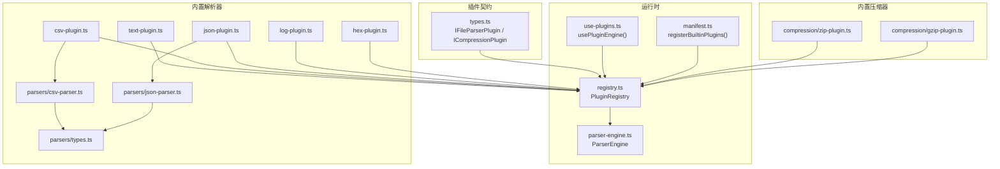
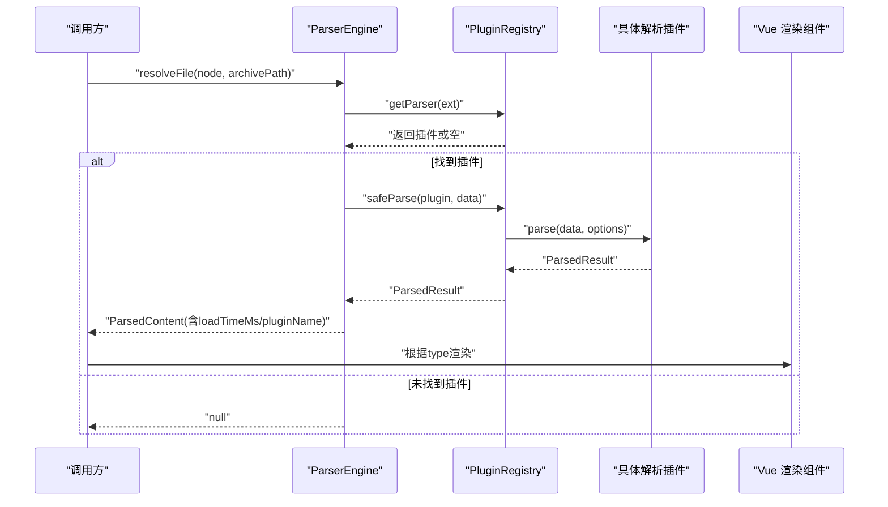
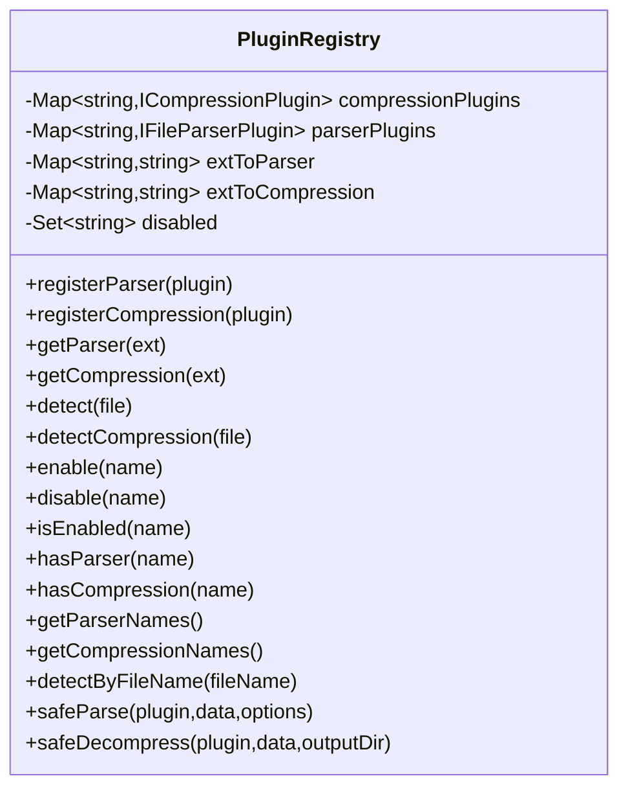
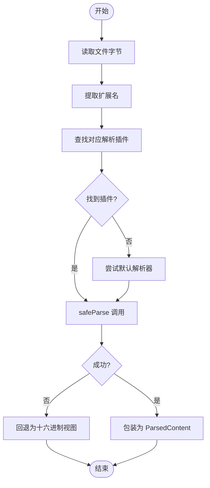
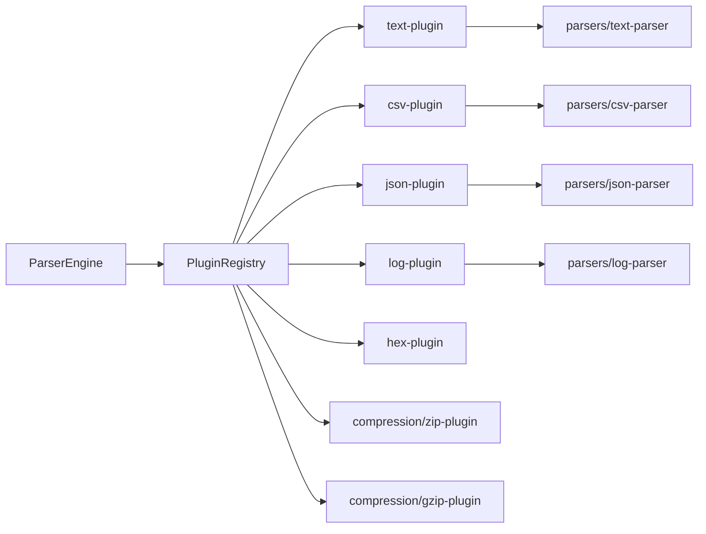

# 插件系统

<cite>
**本文引用的文件**   
- [src/plugins/types.ts](file://src/plugins/types.ts)
- [src/plugins/registry.ts](file://src/plugins/registry.ts)
- [src/core/parser-engine.ts](file://src/core/parser-engine.ts)
- [src/composables/use-plugins.ts](file://src/composables/use-plugins.ts)
- [src/plugins/manifest.ts](file://src/plugins/manifest.ts)
- [src/plugins/parsers/json-parser.ts](file://src/plugins/parsers/json-parser.ts)
- [src/plugins/parsers/csv-parser.ts](file://src/plugins/parsers/csv-parser.ts)
- [src/plugins/parsers/types.ts](file://src/plugins/parsers/types.ts)
- [src/plugins/parser/text-plugin.ts](file://src/plugins/parser/text-plugin.ts)
- [src/plugins/parser/csv-plugin.ts](file://src/plugins/parser/csv-plugin.ts)
- [src/plugins/parser/json-plugin.ts](file://src/plugins/parser/json-plugin.ts)
- [src/plugins/parser/log-plugin.ts](file://src/plugins/parser/log-plugin.ts)
- [src/plugins/parser/hex-plugin.ts](file://src/plugins/parser/hex-plugin.ts)
- [src/plugins/compression/zip-plugin.ts](file://src/plugins/compression/zip-plugin.ts)
- [src/plugins/compression/gzip-plugin.ts](file://src/plugins/compression/gzip-plugin.ts)
</cite>

## 目录
1. [简介](#简介)
2. [项目结构](#项目结构)
3. [核心组件](#核心组件)
4. [架构总览](#架构总览)
5. [详细组件分析](#详细组件分析)
6. [依赖关系分析](#依赖关系分析)
7. [性能考虑](#性能考虑)
8. [故障排查指南](#故障排查指南)
9. [结论](#结论)
10. [附录](#附录)

## 简介
本指南面向 Hello-Tauri 的插件系统，提供从设计理念到实现细节、从开发教程到发布分发的完整说明。重点覆盖：
- IFileParserPlugin 与 ICompressionPlugin 接口规范
- 插件注册机制、生命周期管理与安全沙箱执行环境
- 内置插件（JSON、CSV、ZIP、GZIP、文本、日志、十六进制）的实现剖析
- 插件配置与元数据、依赖声明与版本兼容性管理建议
- 调试技巧、性能优化与错误处理最佳实践
- 插件发布与分发流程

## 项目结构
Hello-Tauri 的插件系统位于前端 TypeScript 代码中，采用“类型定义 + 注册中心 + 引擎编排 + 内置插件”的分层组织方式：
- 类型与契约：src/plugins/types.ts
- 注册中心与安全执行：src/plugins/registry.ts
- 解析引擎：src/core/parser-engine.ts
- 组合式入口与内置插件注册：src/composables/use-plugins.ts、src/plugins/manifest.ts
- 内置解析器实现：src/plugins/parser/* 与 src/plugins/parsers/*
- 内置压缩处理器实现：src/plugins/compression/*

图表来源
- [src/plugins/types.ts:1-37](file://src/plugins/types.ts#L1-L37)
- [src/plugins/registry.ts:1-118](file://src/plugins/registry.ts#L1-L118)
- [src/core/parser-engine.ts:1-35](file://src/core/parser-engine.ts#L1-L35)
- [src/composables/use-plugins.ts:1-17](file://src/composables/use-plugins.ts#L1-L17)
- [src/plugins/manifest.ts:1-20](file://src/plugins/manifest.ts#L1-L20)
- [src/plugins/parser/text-plugin.ts:1-18](file://src/plugins/parser/text-plugin.ts#L1-L18)
- [src/plugins/parser/csv-plugin.ts:1-28](file://src/plugins/parser/csv-plugin.ts#L1-L28)
- [src/plugins/parser/json-plugin.ts:1-19](file://src/plugins/parser/json-plugin.ts#L1-L19)
- [src/plugins/parser/log-plugin.ts:1-18](file://src/plugins/parser/log-plugin.ts#L1-L18)
- [src/plugins/parser/hex-plugin.ts:1-53](file://src/plugins/parser/hex-plugin.ts#L1-L53)
- [src/plugins/parsers/csv-parser.ts:1-17](file://src/plugins/parsers/csv-parser.ts#L1-L17)
- [src/plugins/parsers/json-parser.ts:1-17](file://src/plugins/parsers/json-parser.ts#L1-L17)
- [src/plugins/parsers/types.ts:1-11](file://src/plugins/parsers/types.ts#L1-L11)
- [src/plugins/compression/zip-plugin.ts:1-40](file://src/plugins/compression/zip-plugin.ts#L1-L40)
- [src/plugins/compression/gzip-plugin.ts:1-44](file://src/plugins/compression/gzip-plugin.ts#L1-L44)

章节来源
- [src/plugins/types.ts:1-37](file://src/plugins/types.ts#L1-L37)
- [src/plugins/registry.ts:1-118](file://src/plugins/registry.ts#L1-L118)
- [src/core/parser-engine.ts:1-35](file://src/core/parser-engine.ts#L1-L35)
- [src/composables/use-plugins.ts:1-17](file://src/composables/use-plugins.ts#L1-L17)
- [src/plugins/manifest.ts:1-20](file://src/plugins/manifest.ts#L1-L20)

## 核心组件
本节聚焦插件系统的核心抽象与运行期职责。

- 接口契约
  - IFileParserPlugin：描述文件解析插件的能力边界，包括名称、支持扩展名、匹配规则、解析函数、渲染组件以及可选的配置模式。
  - ICompressionPlugin：描述压缩/解压插件的能力边界，包括名称、支持扩展名、匹配规则与解压函数。
  - ParsedResult：统一解析结果模型，包含类型、数据与行数等元信息。
  - ConfigSchema/ConfigField：用于描述插件可配置项的 UI 表单模式。

- 注册中心 PluginRegistry
  - 维护解析器与压缩器的双向映射（扩展名 -> 插件名），并提供检测、启用/禁用、安全调用封装等方法。
  - 提供 safeParse/safeDecompress 超时保护与异常兜底策略。

- 解析引擎 ParserEngine
  - 负责读取文件内容、选择合适插件并调用安全解析方法，最终返回带性能统计的统一解析结果。

- 组合式入口 usePluginEngine
  - 创建全局注册表实例并自动注册内置插件，暴露便捷 API 供上层使用。

章节来源
- [src/plugins/types.ts:1-37](file://src/plugins/types.ts#L1-L37)
- [src/plugins/registry.ts:1-118](file://src/plugins/registry.ts#L1-L118)
- [src/core/parser-engine.ts:1-35](file://src/core/parser-engine.ts#L1-L35)
- [src/composables/use-plugins.ts:1-17](file://src/composables/use-plugins.ts#L1-L17)

## 架构总览
下图展示了从文件到可视化的端到端流程，以及插件在其中的角色。

图表来源
- [src/core/parser-engine.ts:1-35](file://src/core/parser-engine.ts#L1-L35)
- [src/plugins/registry.ts:1-118](file://src/plugins/registry.ts#L1-L118)

## 详细组件分析

### 接口与类型设计
- IFileParserPlugin
  - name：插件唯一标识
  - supportedExtensions：支持的扩展名列表
  - canParse(file)：基于文件名判断是否可解析
  - parse(data, options?)：将二进制数据解析为结构化结果
  - getComponent()：返回 Vue 组件以渲染解析结果
  - getConfigSchema()?：可选，返回配置表单模式
- ICompressionPlugin
  - name：插件唯一标识
  - supportedExtensions：支持的扩展名列表
  - canHandle(file)：基于文件名判断是否可处理
  - decompress(data, outputDir)：异步解压，返回统一结果
- ParsedResult
  - type：'text'|'csv'|'json'|'hex'|'log'
  - data：解析后的数据
  - lineCount：可选的行数统计
- ConfigSchema/ConfigField
  - fields：字段数组，每个字段包含 key、label、type、default 及可选 options

章节来源
- [src/plugins/types.ts:1-37](file://src/plugins/types.ts#L1-L37)

### 注册中心与生命周期
- 注册阶段
  - registerParser/registerCompression：将插件加入内部 Map，并建立扩展名到插件名的索引
  - registerBuiltinPlugins：集中注册所有内置插件
- 发现阶段
  - detect/detectCompression：按文件名后缀快速定位插件
  - getParser/getCompression：按扩展名获取插件实例
- 运行阶段
  - safeParse/safeDecompress：对插件调用进行超时保护与异常捕获，失败时回退到十六进制视图或错误结果
- 启停控制
  - enable/disable/isEnabled：支持运行时动态启用/禁用插件

图表来源
- [src/plugins/registry.ts:1-118](file://src/plugins/registry.ts#L1-L118)

章节来源
- [src/plugins/registry.ts:1-118](file://src/plugins/registry.ts#L1-L118)
- [src/plugins/manifest.ts:1-20](file://src/plugins/manifest.ts#L1-L20)

### 解析引擎与平台适配
- ParserEngine.resolveFile
  - 通过适配器读取文件字节
  - 根据扩展名选择插件，若未命中则尝试默认解析器
  - 调用 registry.safeParse 并包装为统一的 ParsedContent
- 平台适配
  - 压缩插件在 Tauri 平台下通过适配器调用原生能力；在非 Tauri 环境下使用浏览器 API 或第三方库

图表来源
- [src/core/parser-engine.ts:1-35](file://src/core/parser-engine.ts#L1-L35)
- [src/plugins/registry.ts:1-118](file://src/plugins/registry.ts#L1-L118)

章节来源
- [src/core/parser-engine.ts:1-35](file://src/core/parser-engine.ts#L1-L35)

### 内置解析器详解

#### JSON 解析器
- 插件外壳：json-plugin.ts
  - 支持 .json/.jsonl
  - 解码 UTF-8 文本后交由 parsers/json-parser.ts 处理
  - 返回 JsonRenderer 组件
- 核心逻辑：parsers/json-parser.ts
  - 优先整体 JSON.parse；失败时尝试逐行 JSONL 解析
  - 返回统一 ParsedResult，包含格式化后的行数统计

章节来源
- [src/plugins/parser/json-plugin.ts:1-19](file://src/plugins/parser/json-plugin.ts#L1-L19)
- [src/plugins/parsers/json-parser.ts:1-17](file://src/plugins/parsers/json-parser.ts#L1-L17)

#### CSV 解析器
- 插件外壳：csv-plugin.ts
  - 支持 .csv/.tsv
  - 支持通过 options.delimiter 指定分隔符
  - 返回 CsvRenderer 组件
  - 提供 getConfigSchema 以生成配置表单（分隔符、固定表头）
- 核心逻辑：parsers/csv-parser.ts
  - 按换行分割，首行为表头，后续为数据行
  - 返回 headers/rows 结构与行数统计

章节来源
- [src/plugins/parser/csv-plugin.ts:1-28](file://src/plugins/parser/csv-plugin.ts#L1-L28)
- [src/plugins/parsers/csv-parser.ts:1-17](file://src/plugins/parsers/csv-parser.ts#L1-L17)

#### 文本解析器
- 插件外壳：text-plugin.ts
  - 支持常见文本扩展名（txt/md/cfg/ini/env/yaml/yml/toml）
  - 委托 parsers/text-parser.ts 进行解析
  - 返回 TextRenderer 组件

章节来源
- [src/plugins/parser/text-plugin.ts:1-18](file://src/plugins/parser/text-plugin.ts#L1-L18)

#### 日志解析器
- 插件外壳：log-plugin.ts
  - 支持 .log
  - 委托 parsers/log-parser.ts 进行解析
  - 返回 LogRenderer 组件
- 日志行类型：parsers/types.ts
  - 定义了 LogLevel 与 LogLine 结构，便于结构化展示与过滤

章节来源
- [src/plugins/parser/log-plugin.ts:1-18](file://src/plugins/parser/log-plugin.ts#L1-L18)
- [src/plugins/parsers/types.ts:1-11](file://src/plugins/parsers/types.ts#L1-L11)

#### 十六进制解析器（兜底）
- 插件外壳：hex-plugin.ts
  - 无特定扩展名，canParse 恒真，作为兜底解析器
  - 将原始字节流转换为十六进制视图
  - 返回内联定义的 HexRenderer 组件

章节来源
- [src/plugins/parser/hex-plugin.ts:1-53](file://src/plugins/parser/hex-plugin.ts#L1-L53)

### 内置压缩处理器详解

#### ZIP 处理器
- zip-plugin.ts
  - 支持 .zip
  - Tauri 平台：通过适配器调用原生解压
  - 非 Tauri 平台：使用 fflate 的 unzipSync 解压，写入内存存储并构建文件清单
  - 异常时返回失败结果与错误消息

章节来源
- [src/plugins/compression/zip-plugin.ts:1-40](file://src/plugins/compression/zip-plugin.ts#L1-L40)

#### GZIP 处理器
- gzip-plugin.ts
  - 支持 .gz/.gzip/.tgz
  - Tauri 平台：通过适配器调用原生解压
  - 非 Tauri 平台：优先使用浏览器 DecompressionStream('gzip')；不可用时返回不支持提示
  - 返回统一解压结果

章节来源
- [src/plugins/compression/gzip-plugin.ts:1-44](file://src/plugins/compression/gzip-plugin.ts#L1-L44)

### 插件开发教程

#### 从零开始：简单文本解析器
- 目标：新增一个自定义文本格式解析器
- 步骤
  1) 定义解析逻辑：在 parsers 目录下新建解析函数，返回 ParsedResult
  2) 编写插件外壳：在 parser 目录下创建 xxx-plugin.ts，实现 IFileParserPlugin
     - 设置 name、supportedExtensions、canParse、parse、getComponent
     - 可选：实现 getConfigSchema 以提供配置表单
  3) 注册插件：在 manifest.ts 中引入并调用 registerParser
  4) 验证：通过 usePluginEngine().detect 或 resolveFile 触发解析

章节来源
- [src/plugins/types.ts:1-37](file://src/plugins/types.ts#L1-L37)
- [src/plugins/manifest.ts:1-20](file://src/plugins/manifest.ts#L1-L20)
- [src/composables/use-plugins.ts:1-17](file://src/composables/use-plugins.ts#L1-L17)

#### 进阶：复杂压缩处理器
- 目标：新增一种压缩格式的解压支持
- 步骤
  1) 在 compression 目录下新建 xxx-plugin.ts，实现 ICompressionPlugin
     - 设置 name、supportedExtensions、canHandle、decompress
  2) 平台适配
     - Tauri：通过适配器调用原生解压
     - Web：使用浏览器 API 或第三方库，注意内存与流式处理
  3) 注册插件：在 manifest.ts 中调用 registerCompression
  4) 验证：通过压缩相关流程触发解压，检查返回的文件清单与错误信息

章节来源
- [src/plugins/types.ts:1-37](file://src/plugins/types.ts#L1-L37)
- [src/plugins/compression/zip-plugin.ts:1-40](file://src/plugins/compression/zip-plugin.ts#L1-L40)
- [src/plugins/compression/gzip-plugin.ts:1-44](file://src/plugins/compression/gzip-plugin.ts#L1-L44)
- [src/plugins/manifest.ts:1-20](file://src/plugins/manifest.ts#L1-L20)

### 插件配置与元数据
- 配置模式
  - 通过 getConfigSchema 返回 ConfigSchema，由 UI 自动生成表单控件
  - 字段类型支持 input/select/switch/number，并可附带选项
- 元数据
  - name 作为插件唯一标识，用于注册、检测与启停控制
  - supportedExtensions 决定文件匹配范围
- 依赖声明与版本兼容
  - 当前仓库未显式声明插件间依赖与版本约束
  - 建议在插件外壳中记录必要的外部依赖（如 fflate、DecompressionStream）并在文档中说明最低环境要求
  - 可在未来扩展 manifest 或外部配置文件以声明依赖与版本范围

章节来源
- [src/plugins/types.ts:1-37](file://src/plugins/types.ts#L1-L37)
- [src/plugins/parser/csv-plugin.ts:1-28](file://src/plugins/parser/csv-plugin.ts#L1-L28)

### 安全沙箱与执行环境
- 超时保护
  - withTimeout 为插件调用提供超时限制，避免阻塞主线程
- 异常兜底
  - safeParse 失败时回退为十六进制视图，保障用户可见性
  - safeDecompress 失败时返回结构化错误信息
- 平台隔离
  - 压缩插件在 Tauri 平台走适配器路径，Web 平台走浏览器 API/第三方库，降低跨平台风险

章节来源
- [src/plugins/registry.ts:1-118](file://src/plugins/registry.ts#L1-L118)
- [src/plugins/compression/zip-plugin.ts:1-40](file://src/plugins/compression/zip-plugin.ts#L1-L40)
- [src/plugins/compression/gzip-plugin.ts:1-44](file://src/plugins/compression/gzip-plugin.ts#L1-L44)

## 依赖关系分析
- 耦合与内聚
  - 插件外壳与解析逻辑分离（parser/* 与 parsers/*），提升内聚性与可测试性
  - 注册中心集中管理插件发现与调度，降低调用方复杂度
- 直接依赖
  - ParserEngine 依赖 PluginRegistry
  - 各插件外壳依赖对应解析器与渲染组件
  - 压缩插件依赖平台适配器或浏览器 API/第三方库
- 潜在循环依赖
  - 当前未发现循环导入；插件外壳仅单向依赖解析器与组件

图表来源
- [src/core/parser-engine.ts:1-35](file://src/core/parser-engine.ts#L1-L35)
- [src/plugins/registry.ts:1-118](file://src/plugins/registry.ts#L1-L118)
- [src/plugins/parser/text-plugin.ts:1-18](file://src/plugins/parser/text-plugin.ts#L1-L18)
- [src/plugins/parser/csv-plugin.ts:1-28](file://src/plugins/parser/csv-plugin.ts#L1-L28)
- [src/plugins/parser/json-plugin.ts:1-19](file://src/plugins/parser/json-plugin.ts#L1-L19)
- [src/plugins/parser/log-plugin.ts:1-18](file://src/plugins/parser/log-plugin.ts#L1-L18)
- [src/plugins/parser/hex-plugin.ts:1-53](file://src/plugins/parser/hex-plugin.ts#L1-L53)
- [src/plugins/parsers/csv-parser.ts:1-17](file://src/plugins/parsers/csv-parser.ts#L1-L17)
- [src/plugins/parsers/json-parser.ts:1-17](file://src/plugins/parsers/json-parser.ts#L1-L17)
- [src/plugins/compression/zip-plugin.ts:1-40](file://src/plugins/compression/zip-plugin.ts#L1-L40)
- [src/plugins/compression/gzip-plugin.ts:1-44](file://src/plugins/compression/gzip-plugin.ts#L1-L44)

章节来源
- [src/core/parser-engine.ts:1-35](file://src/core/parser-engine.ts#L1-L35)
- [src/plugins/registry.ts:1-118](file://src/plugins/registry.ts#L1-L118)

## 性能考虑
- 超时与降级
  - 合理设置超时阈值，避免长时间阻塞；失败时回退至十六进制视图保证可用性
- 大文件处理
  - 解析器尽量流式或分块处理，减少一次性内存占用
  - 压缩解压在大文件场景下优先考虑流式 API 或原生能力
- 渲染优化
  - 大型数据集渲染应分页/虚拟滚动，避免一次性渲染过多节点
- 缓存与复用
  - 对重复解析结果进行缓存，结合 loadTimeMs 监控性能变化

[本节为通用指导，不直接分析具体文件]

## 故障排查指南
- 插件未生效
  - 确认已调用 registerParser/registerCompression 完成注册
  - 检查 supportedExtensions 是否与文件名后缀一致
- 解析失败
  - 查看 safeParse 的异常捕获与十六进制回退逻辑
  - 检查解析器输入编码（UTF-8）与分隔符配置
- 解压失败
  - 检查平台分支：Tauri 需确保适配器可用；Web 需确认浏览器 API 或第三方库可用
  - 关注返回的错误消息与 success 标志位
- 性能问题
  - 通过 loadTimeMs 定位慢点；必要时增加超时或改用更高效算法

章节来源
- [src/plugins/registry.ts:1-118](file://src/plugins/registry.ts#L1-L118)
- [src/core/parser-engine.ts:1-35](file://src/core/parser-engine.ts#L1-L35)
- [src/plugins/compression/zip-plugin.ts:1-40](file://src/plugins/compression/zip-plugin.ts#L1-L40)
- [src/plugins/compression/gzip-plugin.ts:1-44](file://src/plugins/compression/gzip-plugin.ts#L1-L44)

## 结论
Hello-Tauri 的插件系统以清晰的接口契约、集中的注册中心与安全的执行环境为核心，提供了可扩展的解析与压缩能力。通过内置插件的实践，开发者可以快速上手并构建高质量的自定义插件。建议在生产环境中完善依赖与版本管理、增强日志与监控，并结合平台特性进一步优化性能与稳定性。

[本节为总结性内容，不直接分析具体文件]

## 附录

### 插件发布与分发流程（建议）
- 准备插件包
  - 明确插件名称、版本、支持的扩展名与依赖
  - 编写 README 说明配置项与使用方法
- 集成到应用
  - 将插件外壳与解析逻辑纳入源码或通过模块加载机制动态引入
  - 在 manifest 中注册插件
- 测试与验收
  - 覆盖正常与异常用例，验证超时与降级行为
  - 在不同平台（Tauri/Web）下验证功能一致性
- 发布与更新
  - 记录变更日志与兼容性矩阵
  - 提供升级指引与回滚方案

[本节为概念性流程，不直接分析具体文件]