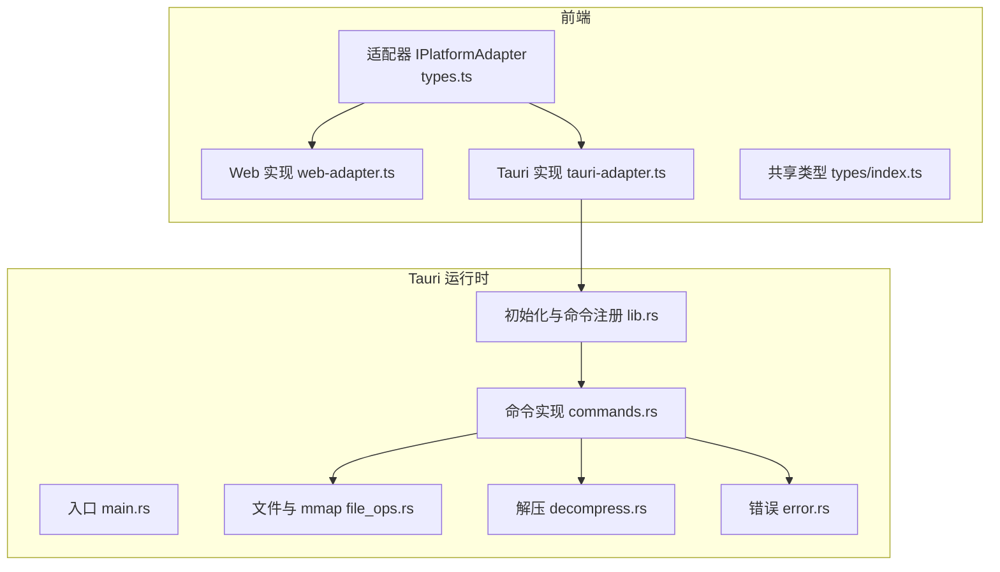
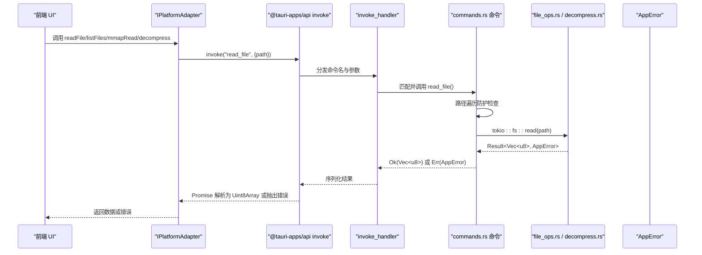
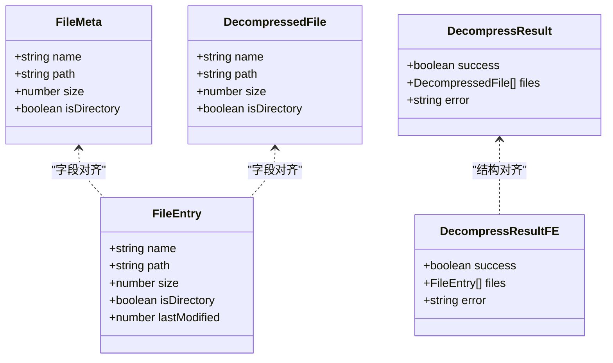
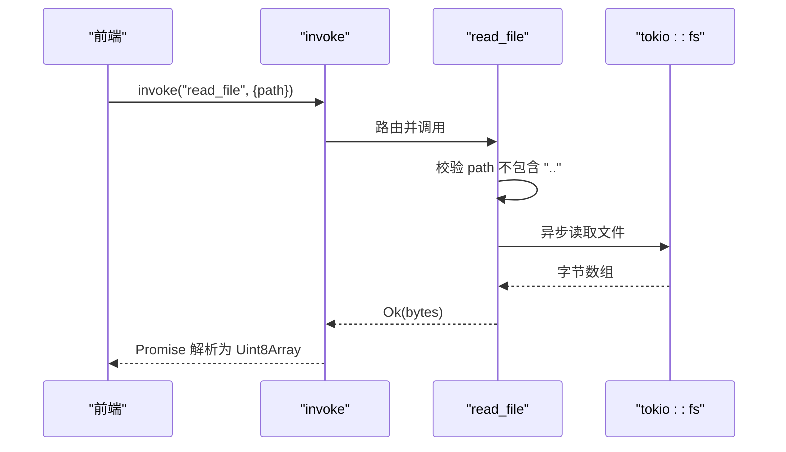
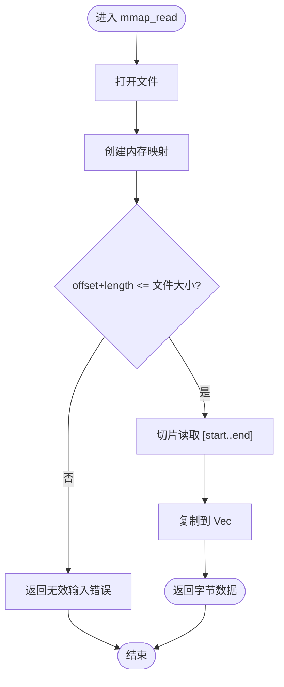
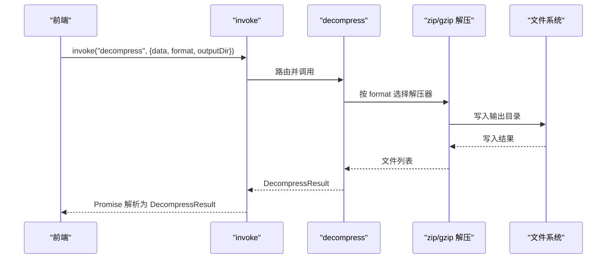
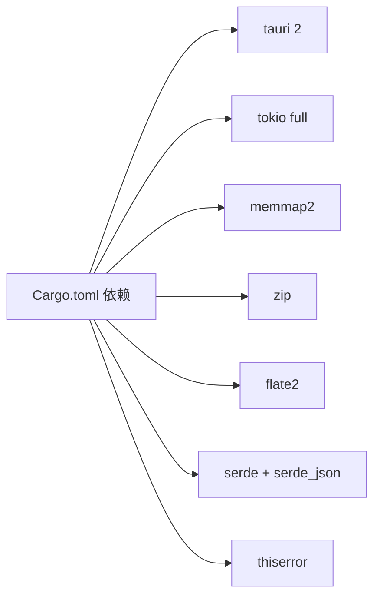

# IPC 协议设计

<cite>
**本文引用的文件**   
- [README.md](file://README.md)
- [Cargo.toml](file://src-tauri/Cargo.toml)
- [tauri.conf.json](file://src-tauri/tauri.conf.json)
- [lib.rs](file://src-tauri/src/lib.rs)
- [main.rs](file://src-tauri/src/main.rs)
- [commands.rs](file://src-tauri/src/commands.rs)
- [error.rs](file://src-tauri/src/error.rs)
- [file_ops.rs](file://src-tauri/src/file_ops.rs)
- [decompress.rs](file://src-tauri/src/decompress.rs)
- [types.ts](file://src/adapters/types.ts)
- [web-adapter.ts](file://src/adapters/web-adapter.ts)
- [index.ts](file://src/types/index.ts)
</cite>

## 目录
1. [简介](#简介)
2. [项目结构](#项目结构)
3. [核心组件](#核心组件)
4. [架构总览](#架构总览)
5. [详细组件分析](#详细组件分析)
6. [依赖分析](#依赖分析)
7. [性能考虑](#性能考虑)
8. [故障排查指南](#故障排查指南)
9. [结论](#结论)
10. [附录](#附录)

## 简介
本文件面向 Hello-Tauri 项目的 Tauri 2.0 进程间通信（IPC）协议设计与实现，聚焦以下方面：
- 命令注册机制与调用流程
- 消息序列化格式与类型安全保证
- 异步调用模式与错误处理
- Rust 后端 #[tauri::command] 宏的使用规范
- TypeScript 前端命令调用接口与类型推断
- 典型协议示例：文件操作、内存映射读取、解压
- 协议版本管理、向后兼容性与性能优化策略

## 项目结构
本项目采用前后端分离的桌面应用架构：
- 前端：Vue 3 + TypeScript + Vite，通过 @tauri-apps/api 调用 Rust 命令
- 后端：Tauri 2 + Rust，使用 tokio 异步运行时与 memmap2 零拷贝读取
- 平台适配层：IPlatformAdapter 抽象统一 Web 与 Tauri 两种运行环境

图表来源
- [lib.rs:6-18](file://src-tauri/src/lib.rs#L6-L18)
- [main.rs:1-4](file://src-tauri/src/main.rs#L1-L4)
- [commands.rs:5-52](file://src-tauri/src/commands.rs#L5-L52)
- [file_ops.rs:6-53](file://src-tauri/src/file_ops.rs#L6-L53)
- [decompress.rs:6-82](file://src-tauri/src/decompress.rs#L6-L82)
- [error.rs:1-19](file://src-tauri/src/error.rs#L1-L19)
- [types.ts:3-11](file://src/adapters/types.ts#L3-L11)
- [web-adapter.ts:5-70](file://src/adapters/web-adapter.ts#L5-L70)
- [index.ts:1-13](file://src/types/index.ts#L1-L13)

章节来源
- [README.md:1-140](file://README.md#L1-L140)
- [tauri.conf.json:1-31](file://src-tauri/tauri.conf.json#L1-L31)

## 核心组件
- 命令注册中心：在 Tauri Builder 中集中注册所有 IPC 命令，提供统一的 invoke_handler
- 命令实现层：每个 #[tauri::command] 暴露一个函数，定义参数、返回值与错误类型
- 错误模型：AppError 枚举统一错误表达并序列化为字符串
- 数据模型：FileMeta、DecompressResult 等结构体通过 serde 进行 JSON 序列化
- 前端适配器：IPlatformAdapter 抽象跨平台能力，Web 与 Tauri 分别实现

章节来源
- [lib.rs:6-18](file://src-tauri/src/lib.rs#L6-L18)
- [commands.rs:5-52](file://src-tauri/src/commands.rs#L5-L52)
- [error.rs:1-19](file://src-tauri/src/error.rs#L1-L19)
- [file_ops.rs:26-33](file://src-tauri/src/file_ops.rs#L26-L33)
- [decompress.rs:6-21](file://src-tauri/src/decompress.rs#L6-L21)
- [types.ts:3-11](file://src/adapters/types.ts#L3-L11)

## 架构总览
下图展示从前端到后端的完整调用链路，包括命令路由、参数校验、业务逻辑与返回结果。

图表来源
- [lib.rs:6-18](file://src-tauri/src/lib.rs#L6-L18)
- [commands.rs:5-14](file://src-tauri/src/commands.rs#L5-L14)
- [file_ops.rs:6-18](file://src-tauri/src/file_ops.rs#L6-L18)
- [error.rs:1-19](file://src-tauri/src/error.rs#L1-L19)
- [types.ts:3-11](file://src/adapters/types.ts#L3-L11)

## 详细组件分析

### 命令注册与路由
- 在 lib.rs 中使用 tauri::Builder 与 generate_handler! 集中注册命令
- 命令名与函数一一对应，Tauri 内部根据命令名进行路由
- 支持同步与异步命令；异步命令基于 tokio 运行时执行

章节来源
- [lib.rs:6-18](file://src-tauri/src/lib.rs#L6-L18)

### 命令实现与类型安全
- 使用 #[tauri::command] 标注函数，自动完成参数反序列化与返回值序列化
- 参数类型由 Rust 侧严格定义，结合 serde 确保前后端数据结构一致
- 返回类型为 Result<T, AppError>，错误统一通过 AppError 表达并序列化为字符串

章节来源
- [commands.rs:5-52](file://src-tauri/src/commands.rs#L5-L52)
- [error.rs:1-19](file://src-tauri/src/error.rs#L1-L19)

### 参数验证与安全
- 路径穿越防护：对 path 包含 ".." 的请求直接拒绝
- 范围越界保护：mmap_read 校验 offset+length 不超过文件大小
- 输入合法性校验失败时返回明确的 AppError 类型

章节来源
- [commands.rs:5-14](file://src-tauri/src/commands.rs#L5-L14)
- [file_ops.rs:6-18](file://src-tauri/src/file_ops.rs#L6-L18)

### 错误处理与序列化
- AppError 实现 Serialize，将错误转换为字符串以便前端统一捕获
- 各命令将底层错误包装为 AppError，保持错误边界清晰

章节来源
- [error.rs:1-19](file://src-tauri/src/error.rs#L1-L19)
- [commands.rs:5-52](file://src-tauri/src/commands.rs#L5-L52)

### 数据模型与序列化约定
- FileMeta 与 DecompressResult 使用 serde 的 rename_all = "camelCase" 输出字段名
- 前端类型 index.ts 中的 FileEntry 与 DecompressResult 与之对应，形成契约

图表来源
- [file_ops.rs:26-33](file://src-tauri/src/file_ops.rs#L26-L33)
- [decompress.rs:6-21](file://src-tauri/src/decompress.rs#L6-L21)
- [index.ts:1-13](file://src/types/index.ts#L1-L13)

### 异步调用模式
- 命令可声明为 async，内部使用 tokio::fs 进行非阻塞 IO
- 前端通过 @tauri-apps/api 的 invoke 获得 Promise，便于与 async/await 集成

章节来源
- [commands.rs:5-19](file://src-tauri/src/commands.rs#L5-L19)
- [Cargo.toml:8-11](file://src-tauri/Cargo.toml#L8-L11)

### 前端适配器与类型推断
- IPlatformAdapter 定义统一接口，Web 与 Tauri 分别实现
- WebAdapter 使用 fetch + Range 头实现 mmapRead 语义；TauriAdapter 通过 invoke 调用后端命令
- 前端类型 index.ts 提供 FileEntry、DecompressResult 等类型，配合 TypeScript 编译器进行静态检查

章节来源
- [types.ts:3-11](file://src/adapters/types.ts#L3-L11)
- [web-adapter.ts:31-40](file://src/adapters/web-adapter.ts#L31-L40)
- [index.ts:1-13](file://src/types/index.ts#L1-L13)

### 典型协议示例

#### 文件读取协议（read_file）
- 请求：命令名 read_file，参数 path: string
- 响应：Ok(Vec<u8>) 或 Err(AppError)
- 安全：禁止路径穿越
- 前端：Promise 封装，成功返回 Uint8Array，失败抛出错误

图表来源
- [commands.rs:5-14](file://src-tauri/src/commands.rs#L5-L14)

章节来源
- [commands.rs:5-14](file://src-tauri/src/commands.rs#L5-L14)

#### 内存映射读取协议（mmap_read）
- 请求：命令名 mmap_read，参数 path: string, offset: u64, length: u64
- 响应：Ok(Vec<u8>) 或 Err(AppError)
- 安全：校验读取范围不越界
- 前端：Promise 封装，返回指定范围的字节片段

图表来源
- [file_ops.rs:6-18](file://src-tauri/src/file_ops.rs#L6-L18)

章节来源
- [file_ops.rs:6-18](file://src-tauri/src/file_ops.rs#L6-L18)

#### 解压协议（decompress）
- 请求：命令名 decompress，参数 data: Vec<u8>, format: string, output_dir: string
- 响应：DecompressResult{success, files, error}
- 支持格式：zip、gzip；不支持格式返回 success=false 与错误信息
- 前端：Promise 封装，解析为 DecompressResult

图表来源
- [commands.rs:37-52](file://src-tauri/src/commands.rs#L37-L52)
- [decompress.rs:23-82](file://src-tauri/src/decompress.rs#L23-L82)

章节来源
- [commands.rs:37-52](file://src-tauri/src/commands.rs#L37-L52)
- [decompress.rs:23-82](file://src-tauri/src/decompress.rs#L23-L82)

## 依赖分析
- Tauri 2 运行时与构建工具链
- tokio 全功能特性用于异步 IO
- memmap2 用于零拷贝内存映射读取
- zip、flate2 用于压缩/解压
- serde、serde_json 用于结构化数据序列化
- thiserror 用于错误类型推导与格式化

图表来源
- [Cargo.toml:6-16](file://src-tauri/Cargo.toml#L6-L16)

章节来源
- [Cargo.toml:6-16](file://src-tauri/Cargo.toml#L6-L16)

## 性能考虑
- 零拷贝读取：mmap_read 使用 memmap2 避免内核态与用户态之间的额外拷贝
- 异步 IO：命令使用 tokio::fs 提升并发吞吐
- 流式读取：WebAdapter.streamRead 使用 ReadableStream 分块传输，降低峰值内存占用
- 缓存策略：WebAdapter 与 memoryStore 结合，减少重复网络请求
- 批量与分页：大文件场景建议前端按需分段读取（offset/length），避免一次性加载

[本节为通用指导，无需具体文件引用]

## 故障排查指南
- 常见错误类型
  - IO 错误：文件不存在、权限不足、路径穿越被拒
  - 解压错误：压缩包损坏、格式不支持、写入失败
  - 范围错误：mmap 读取范围超出文件大小
- 定位方法
  - 查看 AppError 的字符串化输出，快速定位错误原因
  - 确认命令名与参数是否与前端一致
  - 检查 tauri.conf.json 的前端资源路径与开发服务器地址
- 调试建议
  - 在命令入口处打印关键参数与中间状态
  - 使用单元测试覆盖 mmap_read 与 list_files 的边界条件

章节来源
- [error.rs:1-19](file://src-tauri/src/error.rs#L1-L19)
- [commands.rs:5-52](file://src-tauri/src/commands.rs#L5-L52)
- [tauri.conf.json:1-31](file://src-tauri/tauri.conf.json#L1-L31)

## 结论
Hello-Tauri 的 IPC 协议以 Tauri 2 的命令系统为核心，通过 #[tauri::command] 宏实现强类型、可序列化的前后端交互。结合 tokio 异步运行时与 memmap2 零拷贝技术，在保证类型安全的同时兼顾性能。前端通过 IPlatformAdapter 抽象统一调用方式，既可在 Web 环境回退到 fetch/ReadableStream，也可在桌面环境走原生命令通道。整体设计具备良好的扩展性与可维护性。

[本节为总结，无需具体文件引用]

## 附录

### 协议清单与签名
- read_file(path: string) -> Result<Vec<u8>, AppError>
- write_file(path: string, data: Vec<u8>) -> Result<(), AppError>
- get_temp_dir() -> Result<String, AppError>
- mmap_read(path: string, offset: u64, length: u64) -> Result<Vec<u8>, AppError>
- list_files(dir: string) -> Result<Vec<FileMeta>, AppError>
- decompress(data: Vec<u8>, format: string, output_dir: string) -> Result<DecompressResult, AppError>

章节来源
- [commands.rs:5-52](file://src-tauri/src/commands.rs#L5-L52)

### 类型契约对照
- Rust FileMeta ↔ 前端 FileEntry（字段名 camelCase 对齐）
- Rust DecompressResult ↔ 前端 DecompressResult（success/files/error 对齐）

章节来源
- [file_ops.rs:26-33](file://src-tauri/src/file_ops.rs#L26-L33)
- [decompress.rs:6-21](file://src-tauri/src/decompress.rs#L6-L21)
- [index.ts:1-13](file://src/types/index.ts#L1-L13)

### 配置与环境
- tauri.conf.json 指定前端构建产物目录与开发服务器地址
- Cargo.toml 声明运行时与构建期依赖

章节来源
- [tauri.conf.json:1-31](file://src-tauri/tauri.conf.json#L1-L31)
- [Cargo.toml:1-19](file://src-tauri/Cargo.toml#L1-L19)