# 前后端通信机制

<cite>
**本文引用的文件**   
- [lib.rs](file://src-tauri/src/lib.rs)
- [commands.rs](file://src-tauri/src/commands.rs)
- [error.rs](file://src-tauri/src/error.rs)
- [file_ops.rs](file://src-tauri/src/file_ops.rs)
- [decompress.rs](file://src-tauri/src/decompress.rs)
- [tauri.conf.json](file://src-tauri/tauri.conf.json)
- [Cargo.toml](file://src-tauri/Cargo.toml)
- [types.ts](file://src/adapters/types.ts)
- [tauri-adapter.ts](file://src/adapters/tauri-adapter.ts)
- [web-adapter.ts](file://src/adapters/web-adapter.ts)
- [index.ts](file://src/types/index.ts)
- [memory-store.ts](file://src/core/memory-store.ts)
- [zip-plugin.ts](file://src/plugins/compression/zip-plugin.ts)
- [registry.ts](file://src/plugins/registry.ts)
- [use-decompress.ts](file://src/composables/use-decompress.ts)
</cite>

## 目录
1. [简介](#简介)
2. [项目结构](#项目结构)
3. [核心组件](#核心组件)
4. [架构总览](#架构总览)
5. [详细组件分析](#详细组件分析)
6. [依赖关系分析](#依赖关系分析)
7. [性能考虑](#性能考虑)
8. [故障排查指南](#故障排查指南)
9. [结论](#结论)
10. [附录](#附录)

## 简介
本文件系统性阐述 Hello-Tauri 项目在 Tauri 2.0 下的前后端通信机制，重点覆盖：
- IPC 原理与命令注册、消息传递、错误处理与类型安全
- Rust 后端命令定义与 TypeScript 前端调用方式（含异步模式与错误策略）
- 适配器模式在跨平台兼容性中的应用（Web 适配器 vs Tauri 适配器）
- 典型功能通信流程：文件操作、内存映射读取、解压
- 性能优化建议：批量操作、连接池管理、错误重试等最佳实践

## 项目结构
本项目采用“前端 Vue + TypeScript”与“Rust 后端（Tauri 2.0）”双端分离的架构。前端通过统一的平台适配器接口访问底层能力；在桌面环境由 Tauri 适配器桥接至 Rust 命令，在 Web 环境则由 Web 适配器提供浏览器能力或内存缓存。

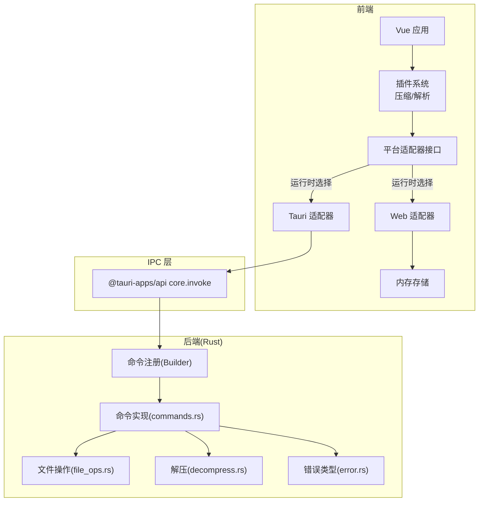

图表来源
- [lib.rs:6-18](file://src-tauri/src/lib.rs#L6-L18)
- [commands.rs:5-52](file://src-tauri/src/commands.rs#L5-L52)
- [file_ops.rs:6-53](file://src-tauri/src/file_ops.rs#L6-L53)
- [decompress.rs:23-82](file://src-tauri/src/decompress.rs#L23-L82)
- [tauri-adapter.ts:14-59](file://src/adapters/tauri-adapter.ts#L14-L59)
- [web-adapter.ts:5-70](file://src/adapters/web-adapter.ts#L5-L70)
- [memory-store.ts:1-26](file://src/core/memory-store.ts#L1-L26)

章节来源
- [lib.rs:6-18](file://src-tauri/src/lib.rs#L6-L18)
- [tauri.conf.json:1-31](file://src-tauri/tauri.conf.json#L1-L31)

## 核心组件
- 平台适配器接口：统一抽象文件读写、列表、临时目录、解压、内存映射读取、流式读取等能力。
- Tauri 适配器：基于 @tauri-apps/api 的 invoke 调用 Rust 命令，完成二进制数据序列化/反序列化。
- Web 适配器：在浏览器环境下使用 fetch、Range 请求、ReadableStream 和内存缓存模拟部分能力。
- Rust 命令层：通过 tauri::command 宏暴露函数，封装 IO、mmap、解压等逻辑，并返回统一错误类型。
- 插件系统：根据扩展名选择压缩/解析插件，并在 Tauri 模式下委托给后端执行。

章节来源
- [types.ts:3-11](file://src/adapters/types.ts#L3-L11)
- [tauri-adapter.ts:14-59](file://src/adapters/tauri-adapter.ts#L14-L59)
- [web-adapter.ts:5-70](file://src/adapters/web-adapter.ts#L5-L70)
- [commands.rs:5-52](file://src-tauri/src/commands.rs#L5-L52)
- [registry.ts:106-116](file://src/plugins/registry.ts#L106-L116)
- [zip-plugin.ts:10-38](file://src/plugins/compression/zip-plugin.ts#L10-L38)

## 架构总览
下图展示从前端到后端的完整调用链路，包括命令注册、invoke 调用、错误序列化与结果返回。

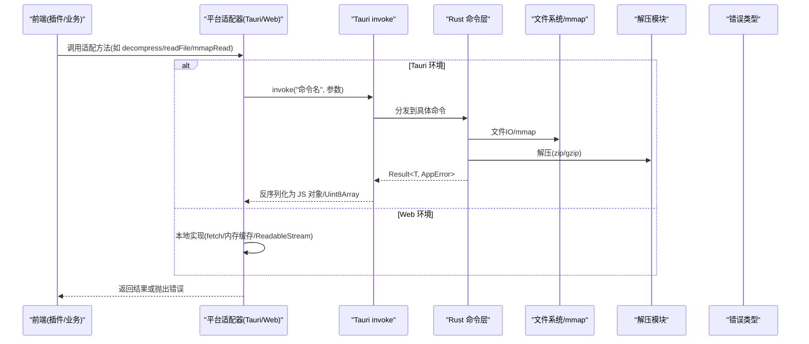

图表来源
- [tauri-adapter.ts:14-59](file://src/adapters/tauri-adapter.ts#L14-L59)
- [lib.rs:6-18](file://src-tauri/src/lib.rs#L6-L18)
- [commands.rs:5-52](file://src-tauri/src/commands.rs#L5-L52)
- [file_ops.rs:6-53](file://src-tauri/src/file_ops.rs#L6-L53)
- [decompress.rs:23-82](file://src-tauri/src/decompress.rs#L23-L82)
- [error.rs:3-18](file://src-tauri/src/error.rs#L3-L18)

## 详细组件分析

### 1) 命令注册与 IPC 调用
- 后端通过 Builder 集中注册命令，将前端字符串命令名映射到具体函数。
- 前端 Tauri 适配器在首次使用时动态导入 @tauri-apps/api/core 获取 invoke，避免非 Tauri 环境加载失败。
- 所有命令均返回 Result<T, AppError>，AppError 实现了 Serialize，确保跨语言错误信息可序列化传输。

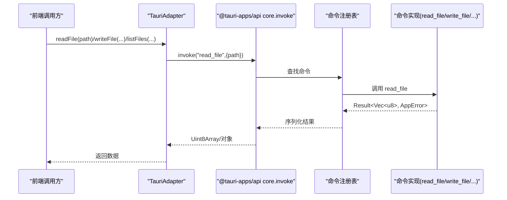

图表来源
- [lib.rs:6-18](file://src-tauri/src/lib.rs#L6-L18)
- [tauri-adapter.ts:4-12](file://src/adapters/tauri-adapter.ts#L4-L12)
- [tauri-adapter.ts:14-45](file://src/adapters/tauri-adapter.ts#L14-L45)
- [commands.rs:5-35](file://src-tauri/src/commands.rs#L5-L35)
- [error.rs:14-18](file://src-tauri/src/error.rs#L14-L18)

章节来源
- [lib.rs:6-18](file://src-tauri/src/lib.rs#L6-L18)
- [tauri-adapter.ts:4-12](file://src/adapters/tauri-adapter.ts#L4-L12)
- [tauri-adapter.ts:14-45](file://src/adapters/tauri-adapter.ts#L14-L45)
- [commands.rs:5-35](file://src-tauri/src/commands.rs#L5-L35)
- [error.rs:3-18](file://src-tauri/src/error.rs#L3-L18)

### 2) 类型安全与数据结构
- 前端类型定义集中在 types/index.ts，包含文件条目、解压结果、解析内容、搜索匹配等。
- Rust 侧通过 serde 的 rename_all 将字段转换为 camelCase，与前端命名保持一致。
- 适配器接口 IPlatformAdapter 约束了前后端一致的能力边界，便于替换实现。

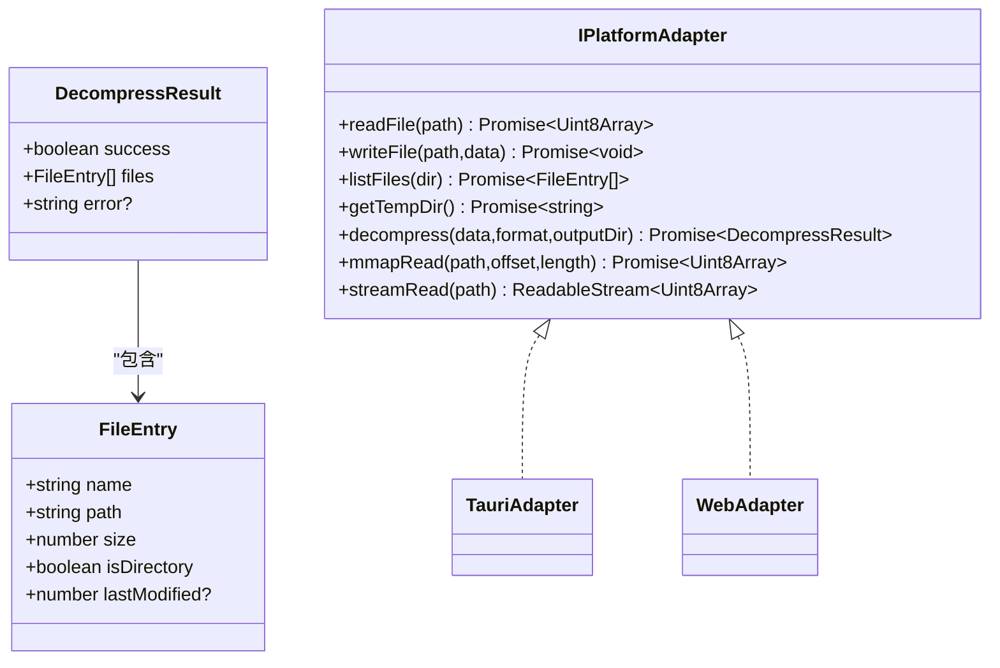

图表来源
- [index.ts:1-13](file://src/types/index.ts#L1-L13)
- [types.ts:3-11](file://src/adapters/types.ts#L3-L11)
- [tauri-adapter.ts:14-59](file://src/adapters/tauri-adapter.ts#L14-L59)
- [web-adapter.ts:5-70](file://src/adapters/web-adapter.ts#L5-L70)
- [file_ops.rs:26-33](file://src-tauri/src/file_ops.rs#L26-L33)
- [decompress.rs:15-21](file://src-tauri/src/decompress.rs#L15-L21)

章节来源
- [index.ts:1-13](file://src/types/index.ts#L1-L13)
- [types.ts:3-11](file://src/adapters/types.ts#L3-L11)
- [file_ops.rs:26-33](file://src-tauri/src/file_ops.rs#L26-L33)
- [decompress.rs:15-21](file://src-tauri/src/decompress.rs#L15-L21)

### 3) 错误处理与传播
- Rust 侧使用 thiserror 定义 AppError，涵盖 IO、解压、未找到等场景，并通过 Serialize 将错误转为字符串进行跨进程传输。
- 命令层对路径遍历等风险输入进行校验，返回明确的权限拒绝错误。
- 前端在 Tauri 模式下直接接收 Promise 异常；在 Web 模式下按各自实现抛错。

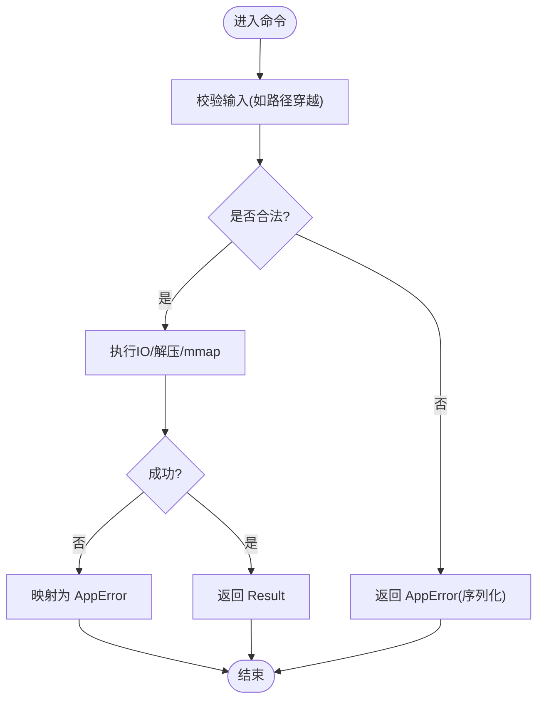

图表来源
- [commands.rs:5-14](file://src-tauri/src/commands.rs#L5-L14)
- [error.rs:3-18](file://src-tauri/src/error.rs#L3-L18)

章节来源
- [commands.rs:5-14](file://src-tauri/src/commands.rs#L5-L14)
- [error.rs:3-18](file://src-tauri/src/error.rs#L3-L18)

### 4) 适配器模式与跨平台差异
- Tauri 适配器：通过 invoke 调用 Rust 命令，支持全量读取、写入、列表、临时目录、解压、mmap 读取；流式读取当前以全量读取后包装为 ReadableStream。
- Web 适配器：利用 fetch 与 Range 头实现 mmap 语义；流式读取使用 Response.body.getReader()；不支持写文件、列出目录、解压（无 WASM）。
- 插件在 Tauri 模式下自动走后端解压，在 Web 模式下尝试使用 fflate 在内存中解压并写入内存存储。

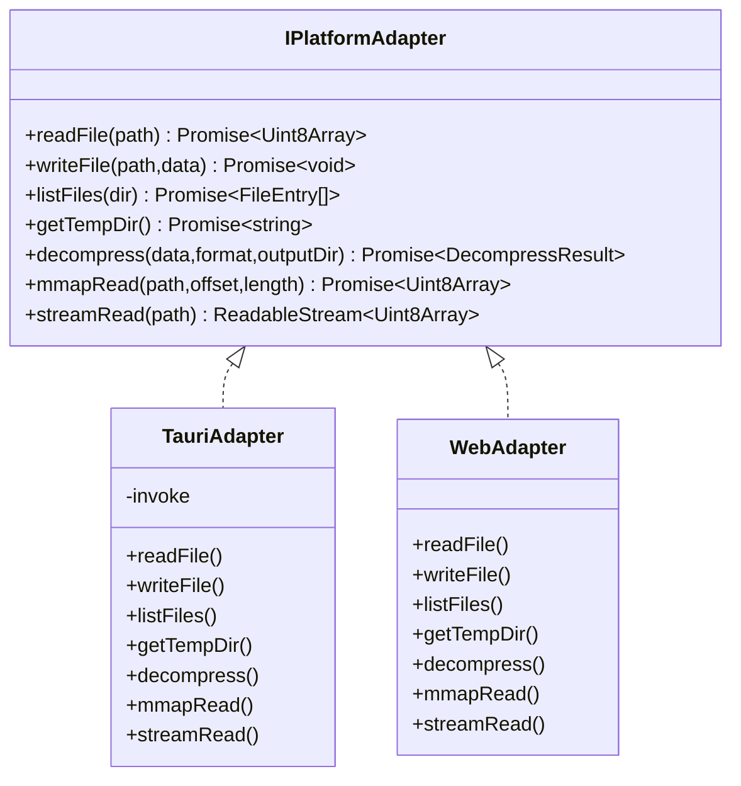

图表来源
- [types.ts:3-11](file://src/adapters/types.ts#L3-L11)
- [tauri-adapter.ts:14-59](file://src/adapters/tauri-adapter.ts#L14-L59)
- [web-adapter.ts:5-70](file://src/adapters/web-adapter.ts#L5-L70)
- [zip-plugin.ts:10-38](file://src/plugins/compression/zip-plugin.ts#L10-L38)

章节来源
- [types.ts:3-11](file://src/adapters/types.ts#L3-L11)
- [tauri-adapter.ts:14-59](file://src/adapters/tauri-adapter.ts#L14-L59)
- [web-adapter.ts:5-70](file://src/adapters/web-adapter.ts#L5-L70)
- [zip-plugin.ts:10-38](file://src/plugins/compression/zip-plugin.ts#L10-L38)

### 5) 核心功能通信流程示例

#### 5.1 文件读取与写入
- 前端调用 TauriAdapter.readFile/writeFile，内部通过 invoke 调用 read_file/write_file。
- 后端使用 tokio 异步 IO 执行读写，错误映射为 AppError。

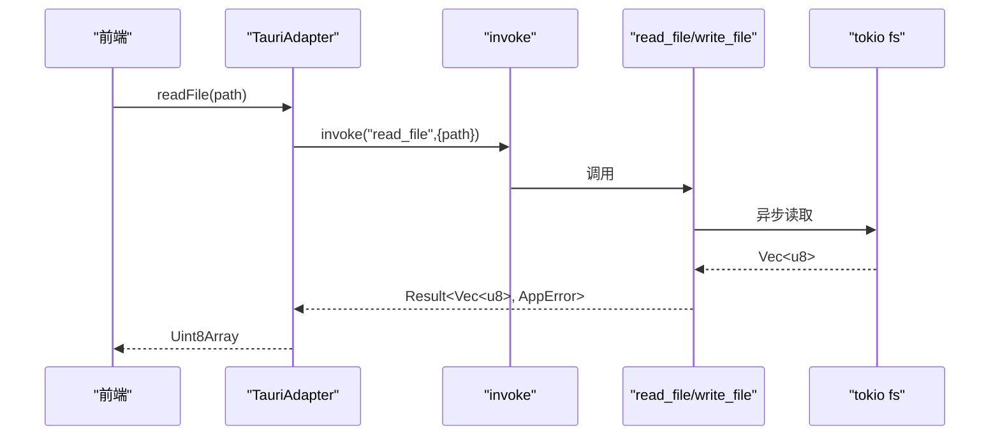

图表来源
- [tauri-adapter.ts:15-24](file://src/adapters/tauri-adapter.ts#L15-L24)
- [commands.rs:5-19](file://src-tauri/src/commands.rs#L5-L19)

章节来源
- [tauri-adapter.ts:15-24](file://src/adapters/tauri-adapter.ts#L15-L24)
- [commands.rs:5-19](file://src-tauri/src/commands.rs#L5-L19)

#### 5.2 内存映射读取(mmap)
- 前端调用 TauriAdapter.mmapRead，后端 file_ops::mmap_read 使用 memmap2 映射文件并按偏移长度切片返回。
- 越界时返回 InvalidInput 错误。

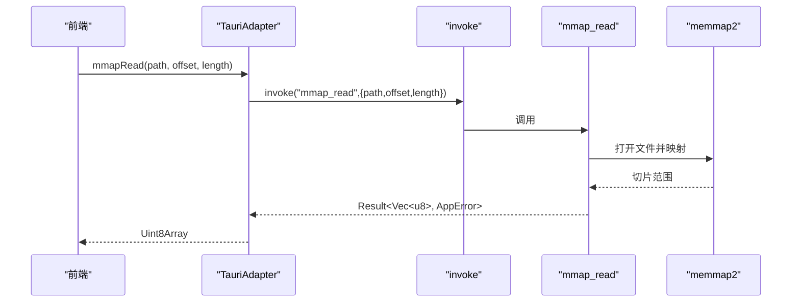

图表来源
- [tauri-adapter.ts:41-45](file://src/adapters/tauri-adapter.ts#L41-L45)
- [commands.rs:27-30](file://src-tauri/src/commands.rs#L27-L30)
- [file_ops.rs:6-18](file://src-tauri/src/file_ops.rs#L6-L18)

章节来源
- [tauri-adapter.ts:41-45](file://src/adapters/tauri-adapter.ts#L41-L45)
- [commands.rs:27-30](file://src-tauri/src/commands.rs#L27-L30)
- [file_ops.rs:6-18](file://src-tauri/src/file_ops.rs#L6-L18)

#### 5.3 解压功能(ZIP/GZIP)
- 前端 zipPlugin 在 Tauri 模式下调用 adapter.decompress('zip'|'gzip', outputDir)。
- 后端 commands::decompress 根据格式路由到 zip 或 gzip 解压，返回统一 DecompressResult。

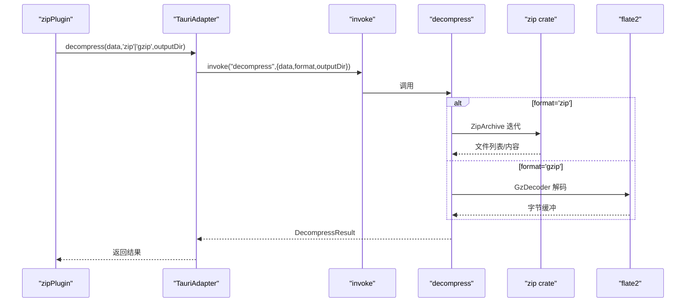

图表来源
- [zip-plugin.ts:10-38](file://src/plugins/compression/zip-plugin.ts#L10-L38)
- [tauri-adapter.ts:36-39](file://src/adapters/tauri-adapter.ts#L36-L39)
- [commands.rs:37-52](file://src-tauri/src/commands.rs#L37-L52)
- [decompress.rs:23-82](file://src-tauri/src/decompress.rs#L23-L82)

章节来源
- [zip-plugin.ts:10-38](file://src/plugins/compression/zip-plugin.ts#L10-L38)
- [tauri-adapter.ts:36-39](file://src/adapters/tauri-adapter.ts#L36-L39)
- [commands.rs:37-52](file://src-tauri/src/commands.rs#L37-L52)
- [decompress.rs:23-82](file://src-tauri/src/decompress.rs#L23-L82)

#### 5.4 流式读取(streamRead)
- Tauri 适配器：当前实现为一次性读取后包装为 ReadableStream，后续可通过事件或专用插件实现分块。
- Web 适配器：直接使用 Response.body.getReader() 实现真正的流式传输。

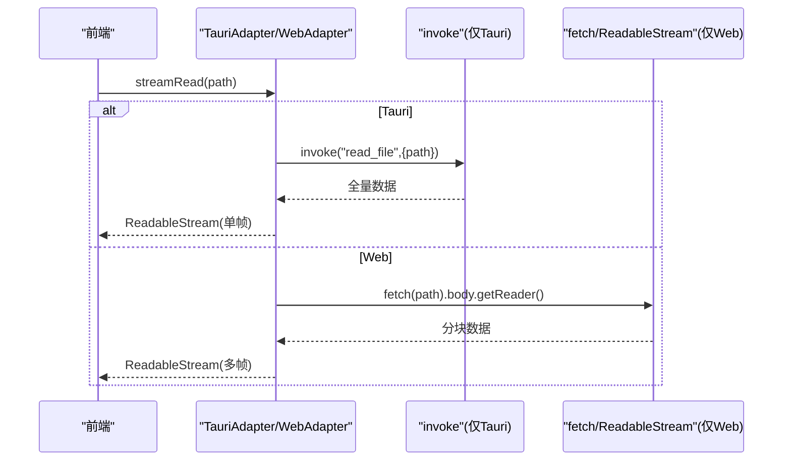

图表来源
- [tauri-adapter.ts:47-58](file://src/adapters/tauri-adapter.ts#L47-L58)
- [web-adapter.ts:42-69](file://src/adapters/web-adapter.ts#L42-L69)

章节来源
- [tauri-adapter.ts:47-58](file://src/adapters/tauri-adapter.ts#L47-L58)
- [web-adapter.ts:42-69](file://src/adapters/web-adapter.ts#L42-L69)

## 依赖关系分析
- 后端依赖：tauri、tokio、memmap2、zip、flate2、rayon、serde、thiserror 等。
- 前端依赖：@tauri-apps/api（仅在 Tauri 环境动态导入）、fflate（Web 解压可选）。
- 构建配置：tauri.conf.json 指定前端产物目录与开发服务器地址。

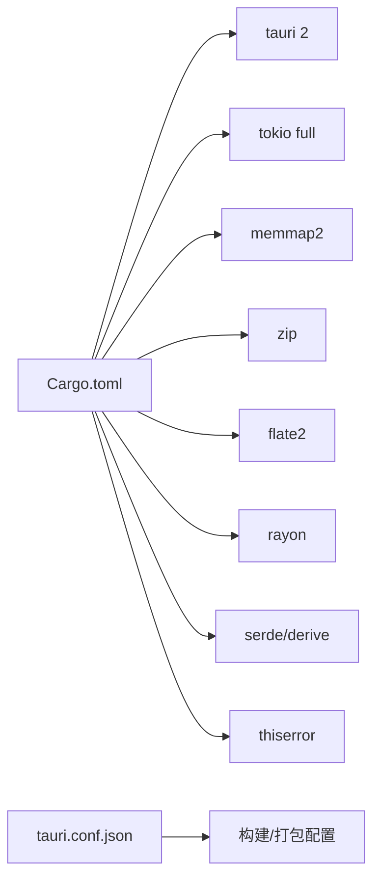

图表来源
- [Cargo.toml:1-19](file://src-tauri/Cargo.toml#L1-L19)
- [tauri.conf.json:1-31](file://src-tauri/tauri.conf.json#L1-L31)

章节来源
- [Cargo.toml:1-19](file://src-tauri/Cargo.toml#L1-L19)
- [tauri.conf.json:1-31](file://src-tauri/tauri.conf.json#L1-L31)

## 性能考虑
- 批量操作
  - 合并多次小文件写入：在前端聚合后再调用一次 write_file，减少 IPC 往返。
  - 批量列出目录：尽量单次 list_files 拉取树形结构，前端再按需展开。
- 连接与资源管理
  - 复用 invoke 实例：Tauri 适配器已延迟加载 invoke，避免重复 import 开销。
  - 大文件优先 mmap 或流式读取：避免一次性加载到内存导致峰值占用过高。
- 错误重试与超时
  - 对网络相关操作（Web 模式）增加指数退避重试；对长耗时任务设置超时保护（参考插件系统的 withTimeout）。
- 并发与调度
  - 使用任务调度器限制并发（参考 use-decompress 中的 TaskScheduler），避免阻塞主线程。
- 缓存
  - 在 Web 模式下结合内存存储减少重复 fetch；在 Tauri 模式下可对热点文件做轻量级缓存。

[本节为通用指导，不直接分析具体文件]

## 故障排查指南
- 常见错误类型
  - IO 错误：权限不足、路径不存在、范围越界等。
  - 解压错误：格式不支持、压缩包损坏。
  - 未找到：资源缺失。
- 定位步骤
  - 检查命令是否正确注册且名称一致。
  - 确认前端传入参数类型与大小（尤其是二进制数组）。
  - 查看 AppError 的序列化字符串，快速定位根因。
- 调试建议
  - 在 Tauri 模式下启用日志输出（后端日志）。
  - 在 Web 模式下捕获 fetch 状态码与响应体。
  - 对大文件先测试 mmap 范围是否越界。

章节来源
- [error.rs:3-18](file://src-tauri/src/error.rs#L3-L18)
- [commands.rs:5-14](file://src-tauri/src/commands.rs#L5-L14)
- [file_ops.rs:11-17](file://src-tauri/src/file_ops.rs#L11-L17)
- [decompress.rs:23-82](file://src-tauri/src/decompress.rs#L23-L82)

## 结论
Hello-Tauri 通过“统一适配器 + Tauri 命令层”的清晰分层，实现了前后端一致的 API 体验与强类型契约。Rust 侧的错误模型与序列化保证了跨进程调用的健壮性；前端适配器在 Tauri 与 Web 两种环境提供了等价能力面。结合任务调度、超时保护与缓存策略，可在保证稳定性的同时获得良好的性能表现。

[本节为总结性内容，不直接分析具体文件]

## 附录
- 关键入口与配置
  - 后端入口与命令注册：[lib.rs:6-18](file://src-tauri/src/lib.rs#L6-L18)
  - 命令实现集合：[commands.rs:5-52](file://src-tauri/src/commands.rs#L5-L52)
  - 构建与运行配置：[tauri.conf.json:1-31](file://src-tauri/tauri.conf.json#L1-L31)
- 前端调用要点
  - Tauri 适配器：[tauri-adapter.ts:14-59](file://src/adapters/tauri-adapter.ts#L14-L59)
  - Web 适配器：[web-adapter.ts:5-70](file://src/adapters/web-adapter.ts#L5-L70)
  - 插件集成点（压缩）：[zip-plugin.ts:10-38](file://src/plugins/compression/zip-plugin.ts#L10-L38)
  - 任务调度与超时：[use-decompress.ts:1-74](file://src/composables/use-decompress.ts#L1-L74), [registry.ts:6-12](file://src/plugins/registry.ts#L6-L12)