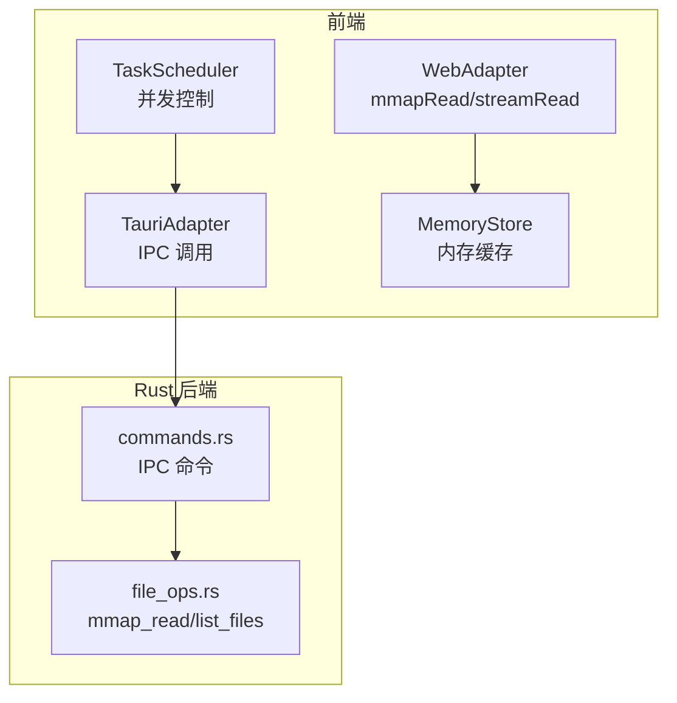
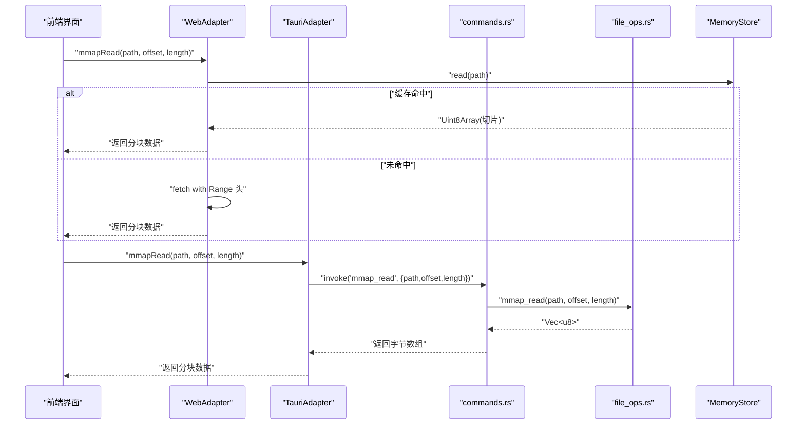
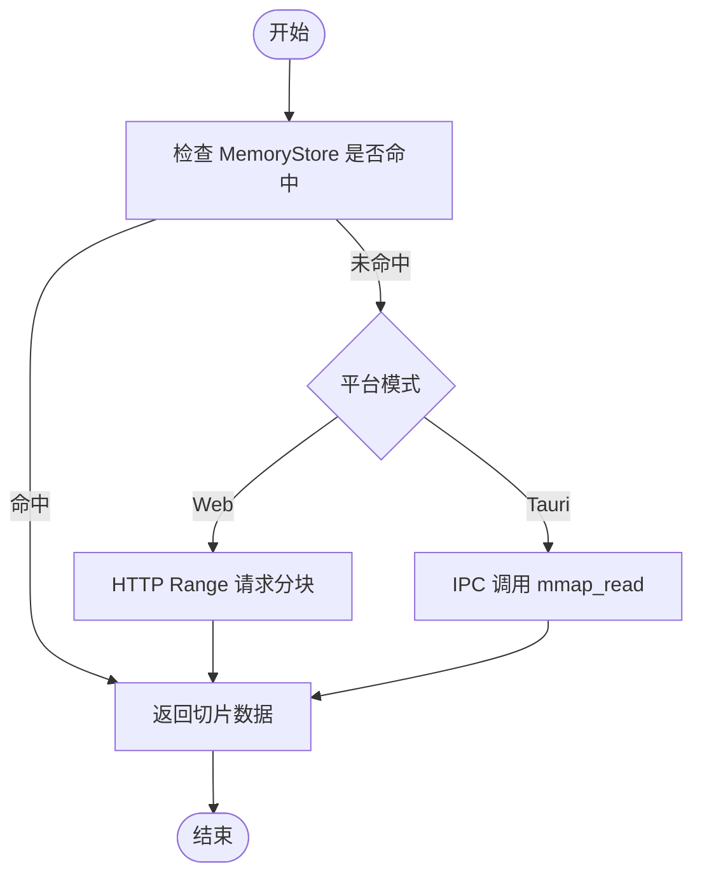
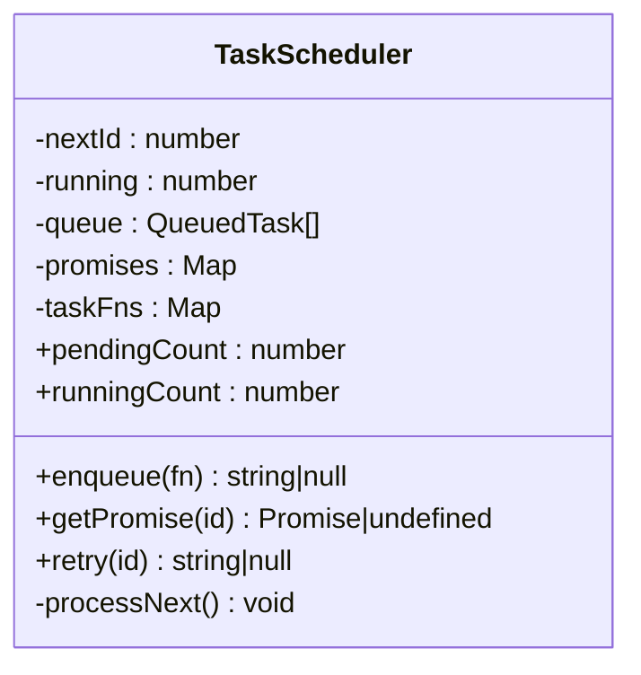
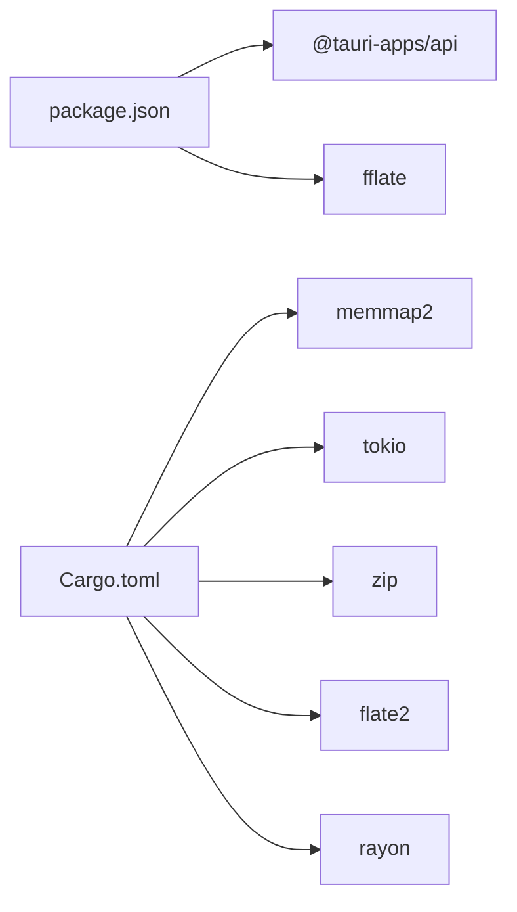

# 性能优化策略

<cite>
**本文引用的文件**   
- [README.md](file://README.md)
- [Cargo.toml](file://src-tauri/Cargo.toml)
- [package.json](file://package.json)
- [commands.rs](file://src-tauri/src/commands.rs)
- [file_ops.rs](file://src-tauri/src/file_ops.rs)
- [tauri-adapter.ts](file://src/adapters/tauri-adapter.ts)
- [web-adapter.ts](file://src/adapters/web-adapter.ts)
- [memory-store.ts](file://src/core/memory-store.ts)
- [task-scheduler.ts](file://src/core/task-scheduler.ts)
</cite>

## 目录
1. [简介](#简介)
2. [项目结构](#项目结构)
3. [核心组件](#核心组件)
4. [架构总览](#架构总览)
5. [详细组件分析](#详细组件分析)
6. [依赖关系分析](#依赖关系分析)
7. [性能考量](#性能考量)
8. [故障排查指南](#故障排查指南)
9. [结论](#结论)
10. [附录](#附录)

## 简介
本文件面向 Hello-Tauri 项目的性能优化，聚焦以下目标：
- 大文件处理优化：内存映射读取、流式处理与分块传输机制
- 批量操作优化：命令合并、连接池管理与并发控制策略
- 前端缓存机制：虚拟滚动、懒加载与增量更新技术
- 内存使用监控与优化：垃圾回收调优与内存泄漏检测
- 性能基准测试方法、监控指标收集与瓶颈分析工具使用指南

本项目在 README 中已明确“大文件友好”特性（mmap 零拷贝读取、虚拟滚动、分页加载）以及“多任务并发”能力（TaskScheduler 控制解压并发数，支持队列和重试），这些为后续优化提供了坚实基础。

章节来源
- [README.md:44-50](file://README.md#L44-L50)

## 项目结构
从性能视角看，关键路径包括：
- 前端适配器层：WebAdapter/TauriAdapter 提供统一 I/O 接口（读、写、列表、解压、mmapRead、streamRead）
- Rust 后端命令：commands.rs 暴露 IPC 命令；file_ops.rs 实现 mmap 零拷贝读取与目录遍历
- 前端内存缓存：MemoryStore 用于热点数据缓存
- 并发调度：TaskScheduler 控制任务并发与队列容量

图表来源
- [web-adapter.ts:31-70](file://src/adapters/web-adapter.ts#L31-L70)
- [tauri-adapter.ts:41-58](file://src/adapters/tauri-adapter.ts#L41-L58)
- [memory-store.ts:1-26](file://src/core/memory-store.ts#L1-L26)
- [commands.rs:27-35](file://src-tauri/src/commands.rs#L27-L35)
- [file_ops.rs:6-18](file://src-tauri/src/file_ops.rs#L6-L18)

章节来源
- [README.md:71-127](file://README.md#L71-L127)

## 核心组件
- WebAdapter
  - mmapRead：优先命中 MemoryStore，否则通过 HTTP Range 请求分块读取
  - streamRead：优先返回缓存的 ReadableStream，否则基于 fetch body 的 reader 构建流
- TauriAdapter
  - mmapRead：通过 IPC 调用 Rust 的 mmap_read
  - streamRead：当前为全量读取后包装为 ReadableStream（注释标注后续可通过事件或插件实现分块）
- MemoryStore
  - 简单 Map 缓存，提供读写、清空与大小统计
- TaskScheduler
  - 固定最大并发与队列上限，支持重试与 pending/running 计数
- Rust commands.rs / file_ops.rs
  - mmap_read：memmap2 零拷贝读取指定字节范围
  - list_files：递归遍历目录并返回元信息

章节来源
- [web-adapter.ts:31-70](file://src/adapters/web-adapter.ts#L31-L70)
- [tauri-adapter.ts:41-58](file://src/adapters/tauri-adapter.ts#L41-L58)
- [memory-store.ts:1-26](file://src/core/memory-store.ts#L1-L26)
- [task-scheduler.ts:11-78](file://src/core/task-scheduler.ts#L11-L78)
- [commands.rs:27-35](file://src-tauri/src/commands.rs#L27-L35)
- [file_ops.rs:6-18](file://src-tauri/src/file_ops.rs#L6-L18)

## 架构总览
下图展示一次“大文件分块读取 + 解析渲染”的典型流程，涵盖前端适配器、Rust 后端与内存缓存的协作。

图表来源
- [web-adapter.ts:31-40](file://src/adapters/web-adapter.ts#L31-L40)
- [tauri-adapter.ts:41-45](file://src/adapters/tauri-adapter.ts#L41-L45)
- [commands.rs:27-30](file://src-tauri/src/commands.rs#L27-L30)
- [file_ops.rs:6-18](file://src-tauri/src/file_ops.rs#L6-L18)
- [memory-store.ts:8-10](file://src/core/memory-store.ts#L8-L10)

## 详细组件分析

### 大文件处理优化：内存映射、流式与分块
- 内存映射读取（桌面端）
  - Rust 侧使用 memmap2 进行零拷贝映射，按偏移与长度安全切片，避免整文件载入
  - 前端通过 TauriAdapter 调用 mmap_read，获得分块 Uint8Array
- 分块读取（Web 端）
  - WebAdapter.mmapRead 使用 HTTP Range 头按需拉取字节范围，结合 MemoryStore 减少重复网络开销
- 流式处理
  - WebAdapter.streamRead 基于 fetch body.getReader() 构建 ReadableStream，边下边处理
  - TauriAdapter.streamRead 当前为全量读取后包装为流，后续可升级为事件驱动的分块传输

图表来源
- [web-adapter.ts:31-40](file://src/adapters/web-adapter.ts#L31-L40)
- [tauri-adapter.ts:41-45](file://src/adapters/tauri-adapter.ts#L41-L45)
- [file_ops.rs:6-18](file://src-tauri/src/file_ops.rs#L6-L18)
- [memory-store.ts:8-10](file://src/core/memory-store.ts#L8-L10)

章节来源
- [web-adapter.ts:31-70](file://src/adapters/web-adapter.ts#L31-L70)
- [tauri-adapter.ts:41-58](file://src/adapters/tauri-adapter.ts#L41-L58)
- [file_ops.rs:6-18](file://src-tauri/src/file_ops.rs#L6-L18)

### 批量操作优化：命令合并、连接池与并发控制
- 命令合并
  - 将多个小范围 mmapRead 合并为更大范围的单次读取，再在前端切片，降低 IPC/网络往返次数
  - 对 list_files 等只读操作可进行批量化聚合
- 连接池管理
  - Web 端复用同一 URL 的连接，利用浏览器连接复用与缓存
  - Tauri 端 IPC 无显式连接概念，但可通过批处理减少 invoke 调用次数
- 并发控制策略
  - 使用 TaskScheduler 限制同时运行的 I/O 任务数量，避免峰值拥塞
  - 设置合理的 maxQueueSize，防止队列无限增长导致内存压力

图表来源
- [task-scheduler.ts:11-78](file://src/core/task-scheduler.ts#L11-L78)

章节来源
- [task-scheduler.ts:11-78](file://src/core/task-scheduler.ts#L11-L78)

### 前端缓存机制：虚拟滚动、懒加载与增量更新
- 虚拟滚动
  - 仅渲染可视区域行/节点，大幅降低 DOM 节点数量与重排成本
- 懒加载
  - 按需加载文件内容或缩略图，首屏更快、交互更流畅
- 增量更新
  - 对大对象采用局部 diff 更新，避免整树重建
- 与现有缓存协同
  - MemoryStore 作为热点数据的 L1 缓存，配合 Range 请求与流式处理，进一步降低重复 IO

[本节为通用设计说明，不直接分析具体文件]

### 内存使用监控与优化建议
- 垃圾回收调优
  - 合理释放不再使用的 Uint8Array 引用，避免长时间驻留
  - 对大对象及时置空并触发 GC（浏览器环境由引擎自动管理）
- 内存泄漏检测
  - 使用浏览器开发者工具的 Memory 面板录制快照，对比差异定位持续增长的对象
  - 关注闭包持有引用、全局 Map 未清理等常见泄漏点
- 监控指标
  - 记录 MemoryStore.size、TaskScheduler.pendingCount/runningCount 等指标，辅助评估负载与瓶颈

章节来源
- [memory-store.ts:20-22](file://src/core/memory-store.ts#L20-L22)
- [task-scheduler.ts:51-57](file://src/core/task-scheduler.ts#L51-L57)

### 性能基准测试方法与监控指标收集
- 基准测试方法
  - 针对 mmapRead/mmap_read 的延迟与吞吐建立基准用例，覆盖不同文件大小与分块尺寸
  - 对比 WebAdapter 与 TauriAdapter 在不同场景下的表现
- 监控指标收集
  - 采集 IPC 调用耗时、Range 请求耗时、流式读取速率、队列积压与运行中任务数
- 瓶颈分析工具
  - 浏览器 Performance 面板、Network 面板、Memory 面板
  - Rust 侧可使用 tokio-console 或简单的日志埋点（如耗时、错误率）

[本节为通用方法论说明，不直接分析具体文件]

## 依赖关系分析
- Rust 依赖
  - memmap2：内存映射读取
  - tokio：异步运行时
  - zip/flate2：压缩/解压
  - rayon：并行计算（可用于后续批处理加速）
- 前端依赖
  - @tauri-apps/api：IPC 客户端
  - fflate：Web 端解压回退（无需 WASM）

图表来源
- [package.json:20-29](file://package.json#L20-L29)
- [Cargo.toml:6-16](file://src-tauri/Cargo.toml#L6-L16)

章节来源
- [package.json:20-29](file://package.json#L20-L29)
- [Cargo.toml:6-16](file://src-tauri/Cargo.toml#L6-L16)

## 性能考量
- 大文件 I/O
  - 优先使用 mmap 或 Range 分块，避免整文件载入
  - 流式处理适合超长日志或二进制文件的逐段解析
- 并发与队列
  - 合理设置 TaskScheduler 的并发度与队列上限，平衡吞吐与内存占用
- 缓存命中率
  - 提高 MemoryStore 命中率可减少重复 IO，注意淘汰策略与容量上限
- 前端渲染
  - 虚拟滚动与懒加载显著降低首屏与滚动时的卡顿
- 网络与 IPC
  - 合并小请求、复用连接、减少跨进程通信次数

[本节为通用指导，不直接分析具体文件]

## 故障排查指南
- 常见问题
  - 越界读取：确保 offset+length 不超过文件大小（Rust 侧已有校验）
  - 流式中断：捕获 ReadableStream 的错误分支并优雅降级
  - 队列溢出：当 pendingCount 接近 maxQueueSize 时，应提示用户或拒绝新任务
- 诊断步骤
  - 查看 MemoryStore.size 与 runningCount/pendingCount 变化趋势
  - 在 Web 端 Network 面板观察 Range 请求是否正确
  - 在 Tauri 端确认 IPC 命令是否成功返回

章节来源
- [file_ops.rs:11-17](file://src-tauri/src/file_ops.rs#L11-L17)
- [web-adapter.ts:52-69](file://src/adapters/web-adapter.ts#L52-L69)
- [task-scheduler.ts:51-57](file://src/core/task-scheduler.ts#L51-L57)

## 结论
通过 mmap 零拷贝、Range 分块与流式处理，结合 MemoryStore 缓存与 TaskScheduler 并发控制，Hello-Tauri 在大文件与高并发场景下具备良好基础。后续可在 Tauri 端引入真正的分块流式传输、完善缓存淘汰策略、扩展批处理与连接复用，并建立完善的基准测试与监控体系，持续优化端到端性能。

[本节为总结性内容，不直接分析具体文件]

## 附录
- 快速开始与脚本参考
  - 开发/构建/测试脚本见 package.json
  - Rust 依赖与特性配置见 Cargo.toml

章节来源
- [package.json:9-18](file://package.json#L9-L18)
- [Cargo.toml:1-19](file://src-tauri/Cargo.toml#L1-L19)