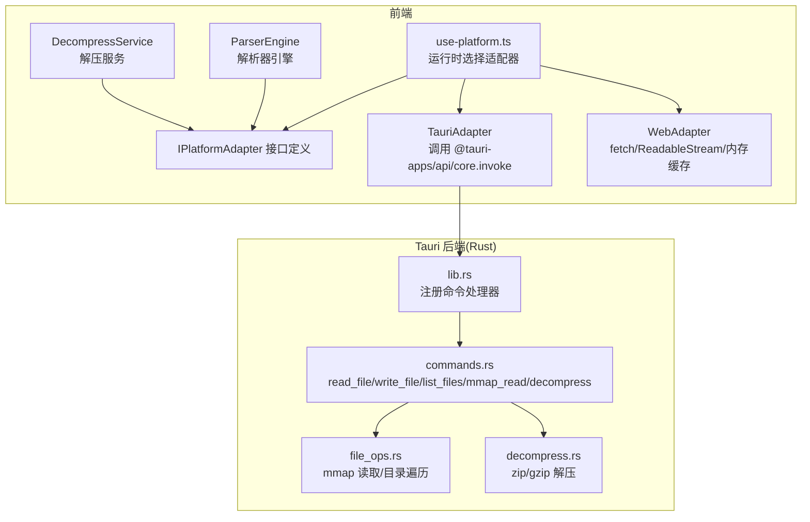
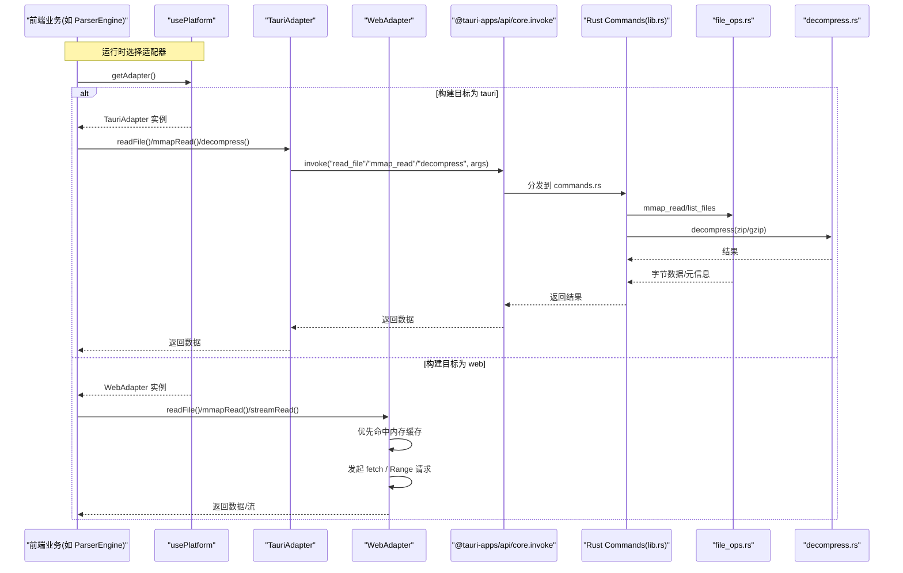
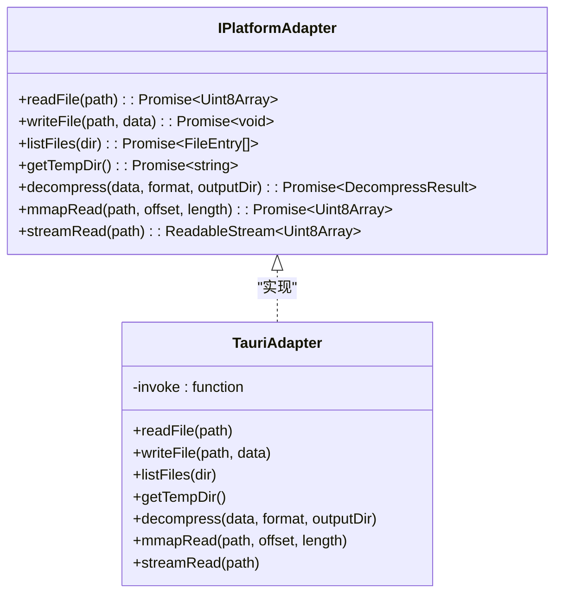
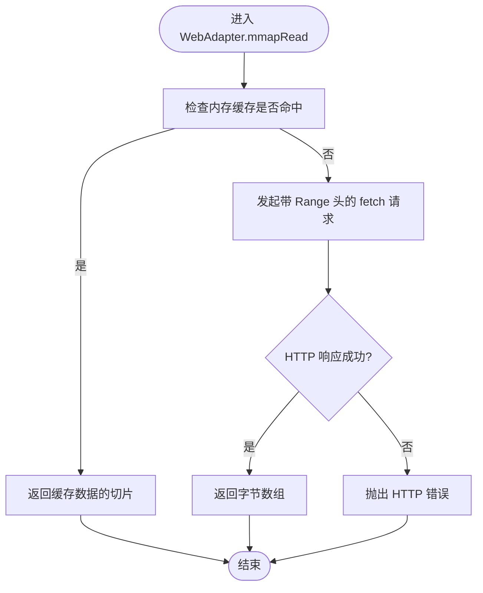
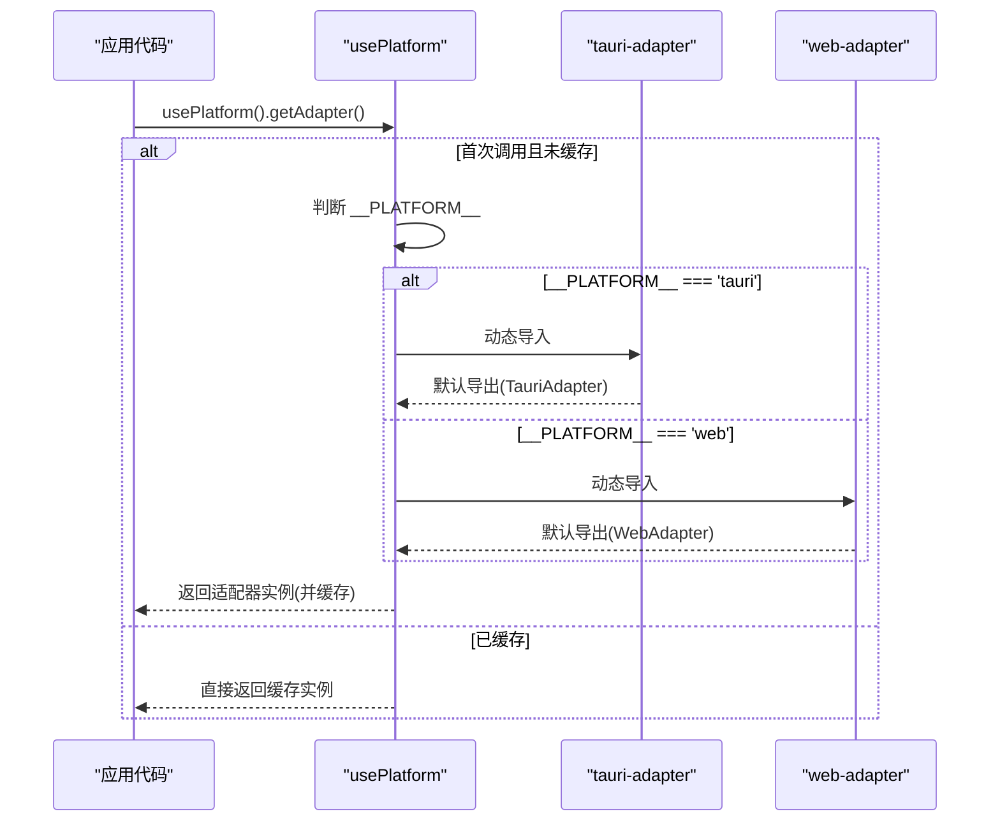
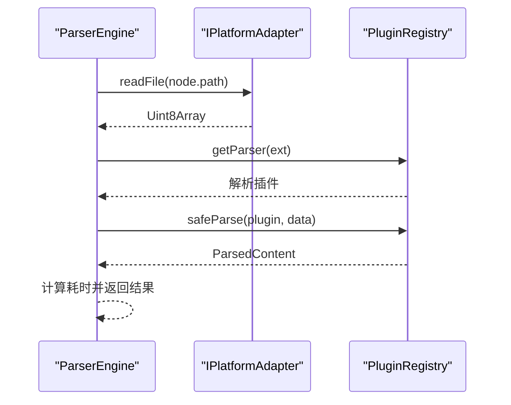
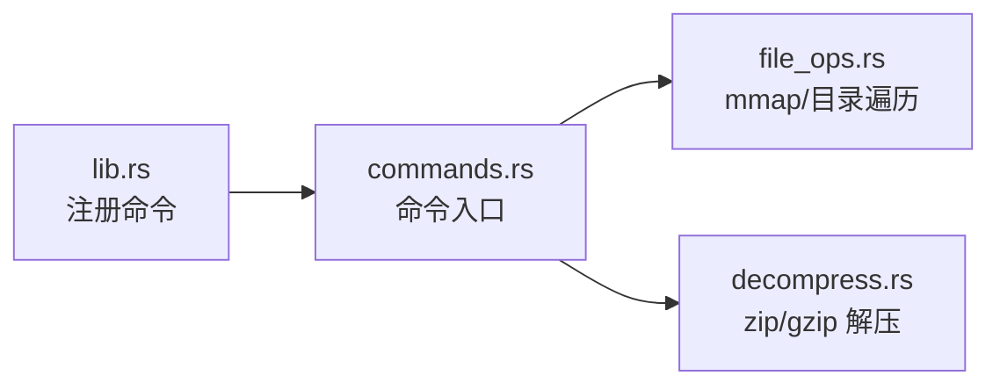
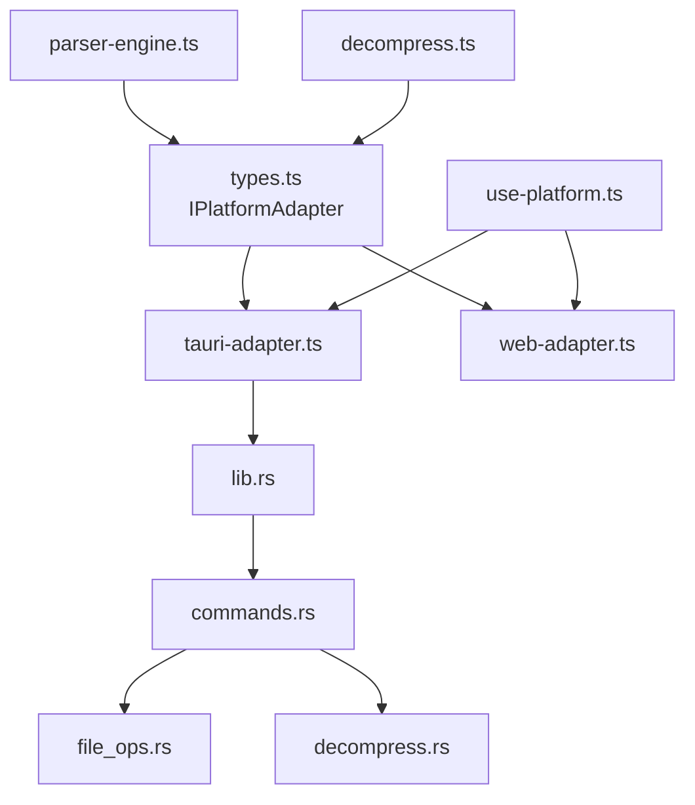

# 适配器模式实现

<cite>
**本文引用的文件**
- [src/adapters/types.ts](file://src/adapters/types.ts)
- [src/adapters/tauri-adapter.ts](file://src/adapters/tauri-adapter.ts)
- [src/adapters/web-adapter.ts](file://src/adapters/web-adapter.ts)
- [src/composables/use-platform.ts](file://src/composables/use-platform.ts)
- [src/core/parser-engine.ts](file://src/core/parser-engine.ts)
- [src/core/decompress.ts](file://src/core/decompress.ts)
- [src-tauri/src/lib.rs](file://src-tauri/src/lib.rs)
- [src-tauri/src/commands.rs](file://src-tauri/src/commands.rs)
- [src-tauri/src/file_ops.rs](file://src-tauri/src/file_ops.rs)
- [src-tauri/src/decompress.rs](file://src-tauri/src/decompress.rs)
</cite>

## 目录
1. [简介](#简介)
2. [项目结构](#项目结构)
3. [核心组件](#核心组件)
4. [架构总览](#架构总览)
5. [详细组件分析](#详细组件分析)
6. [依赖关系分析](#依赖关系分析)
7. [性能考量](#性能考量)
8. [故障排查指南](#故障排查指南)
9. [结论](#结论)
10. [附录：扩展新平台适配器的步骤](#附录扩展新平台适配器的步骤)

## 简介
本文件围绕 Hello-Tauri 项目的“跨平台兼容性抽象层”展开，系统性阐述适配器模式的实现与使用。重点包括：
- 统一接口定义与运行时适配机制
- Tauri 适配器对原生系统能力（文件系统、内存映射、解压）的访问路径
- Web 适配器的降级策略与浏览器环境限制
- 适配器选择逻辑、错误处理与性能差异对比
- 为新平台添加适配器的扩展指南

## 项目结构
本项目采用“前端 TypeScript + Tauri 后端 Rust”的双端架构。跨平台能力通过统一的 IPlatformAdapter 接口暴露给上层业务；具体平台由 usePlatform 在运行时动态加载对应适配器实现。

图表来源
- [src/composables/use-platform.ts:1-25](file://src/composables/use-platform.ts#L1-L25)
- [src/adapters/types.ts:1-12](file://src/adapters/types.ts#L1-L12)
- [src/adapters/tauri-adapter.ts:1-62](file://src/adapters/tauri-adapter.ts#L1-L62)
- [src/adapters/web-adapter.ts:1-73](file://src/adapters/web-adapter.ts#L1-L73)
- [src/core/parser-engine.ts:1-35](file://src/core/parser-engine.ts#L1-L35)
- [src/core/decompress.ts:1-27](file://src/core/decompress.ts#L1-L27)
- [src-tauri/src/lib.rs:1-19](file://src-tauri/src/lib.rs#L1-L19)
- [src-tauri/src/commands.rs:1-53](file://src-tauri/src/commands.rs#L1-L53)
- [src-tauri/src/file_ops.rs:1-88](file://src-tauri/src/file_ops.rs#L1-L88)
- [src-tauri/src/decompress.rs:1-83](file://src-tauri/src/decompress.rs#L1-L83)

章节来源
- [src/composables/use-platform.ts:1-25](file://src/composables/use-platform.ts#L1-L25)
- [src/adapters/types.ts:1-12](file://src/adapters/types.ts#L1-L12)
- [src/adapters/tauri-adapter.ts:1-62](file://src/adapters/tauri-adapter.ts#L1-L62)
- [src/adapters/web-adapter.ts:1-73](file://src/adapters/web-adapter.ts#L1-L73)
- [src/core/parser-engine.ts:1-35](file://src/core/parser-engine.ts#L1-L35)
- [src/core/decompress.ts:1-27](file://src/core/decompress.ts#L1-L27)
- [src-tauri/src/lib.rs:1-19](file://src-tauri/src/lib.rs#L1-L19)
- [src-tauri/src/commands.rs:1-53](file://src-tauri/src/commands.rs#L1-L53)
- [src-tauri/src/file_ops.rs:1-88](file://src-tauri/src/file_ops.rs#L1-L88)
- [src-tauri/src/decompress.rs:1-83](file://src-tauri/src/decompress.rs#L1-L83)

## 核心组件
- 统一接口 IPlatformAdapter：定义跨平台一致的文件读写、目录枚举、临时目录获取、解压、内存映射读取与流式读取等能力。
- TauriAdapter：基于 Tauri IPC 调用后端命令，提供高性能的原生能力（含 mmap 读取）。
- WebAdapter：面向浏览器环境的降级实现，利用 fetch、Range 请求与 ReadableStream，部分能力不可用或受限。
- 运行时适配器选择 usePlatform：根据 __PLATFORM__ 常量在运行时懒加载并缓存对应适配器实例。
- 上层业务 ParserEngine 与 DecompressService：仅依赖 IPlatformAdapter，不感知底层平台差异。

章节来源
- [src/adapters/types.ts:1-12](file://src/adapters/types.ts#L1-L12)
- [src/adapters/tauri-adapter.ts:1-62](file://src/adapters/tauri-adapter.ts#L1-L62)
- [src/adapters/web-adapter.ts:1-73](file://src/adapters/web-adapter.ts#L1-L73)
- [src/composables/use-platform.ts:1-25](file://src/composables/use-platform.ts#L1-L25)
- [src/core/parser-engine.ts:1-35](file://src/core/parser-engine.ts#L1-L35)
- [src/core/decompress.ts:1-27](file://src/core/decompress.ts#L1-L27)

## 架构总览
下图展示了从前端到后端的完整调用链路，以及 Web 环境下的降级路径。

图表来源
- [src/composables/use-platform.ts:1-25](file://src/composables/use-platform.ts#L1-L25)
- [src/adapters/tauri-adapter.ts:1-62](file://src/adapters/tauri-adapter.ts#L1-L62)
- [src/adapters/web-adapter.ts:1-73](file://src/adapters/web-adapter.ts#L1-L73)
- [src-tauri/src/lib.rs:1-19](file://src-tauri/src/lib.rs#L1-L19)
- [src-tauri/src/commands.rs:1-53](file://src-tauri/src/commands.rs#L1-L53)
- [src-tauri/src/file_ops.rs:1-88](file://src-tauri/src/file_ops.rs#L1-L88)
- [src-tauri/src/decompress.rs:1-83](file://src-tauri/src/decompress.rs#L1-L83)

## 详细组件分析

### 统一接口 IPlatformAdapter
- 职责：定义跨平台一致的 API 契约，屏蔽平台差异。
- 关键方法：
  - 文件 IO：readFile、writeFile、listFiles、getTempDir
  - 高级能力：mmapRead（按偏移和长度读取）、streamRead（流式读取）
  - 压缩解压：decompress（格式驱动，交由后端或插件处理）
- 设计要点：
  - 所有方法均返回 Promise，便于异步与错误传播。
  - 二进制数据以 Uint8Array 表示，避免编码歧义。
  - 流式读取返回标准 ReadableStream，利于大文件处理。

章节来源
- [src/adapters/types.ts:1-12](file://src/adapters/types.ts#L1-L12)

### Tauri 适配器
- 职责：将前端调用桥接到 Tauri 后端命令，充分利用操作系统能力。
- 关键点：
  - 惰性加载 @tauri-apps/api/core.invoke，避免非 Tauri 环境引入失败。
  - 将后端返回的 number[] 转换为 Uint8Array，保证类型一致性。
  - streamRead 当前实现为全量读取后包装为 ReadableStream，注释指出后续可通过事件或专用插件实现分块传输。
- 安全与健壮性：
  - 路径穿越防护在后端 read_file 中实现，前端无需重复校验。
  - 错误通过 Promise 拒绝向上抛出，供上层捕获。

图表来源
- [src/adapters/types.ts:1-12](file://src/adapters/types.ts#L1-L12)
- [src/adapters/tauri-adapter.ts:1-62](file://src/adapters/tauri-adapter.ts#L1-L62)

章节来源
- [src/adapters/tauri-adapter.ts:1-62](file://src/adapters/tauri-adapter.ts#L1-L62)

### Web 适配器（降级策略）
- 职责：在浏览器环境中尽可能模拟 IPlatformAdapter 的能力。
- 降级策略：
  - readFile：优先命中内存缓存，否则通过 fetch 下载并转为 Uint8Array。
  - writeFile/listFiles/decompress：直接抛出错误，表明 Web 模式不支持这些能力。
  - getTempDir：返回占位路径，避免上层逻辑崩溃。
  - mmapRead：优先命中内存缓存；未命中时尝试 HTTP Range 请求进行范围读取。
  - streamRead：优先从内存缓存构造流；否则使用 fetch body 的 ReadableStream 逐块推送。
- 浏览器限制说明：
  - 无本地文件系统访问，无法写入或列举真实目录。
  - 解压需要 WASM 或后端支持，当前 Web 模式直接报错。

图表来源
- [src/adapters/web-adapter.ts:1-73](file://src/adapters/web-adapter.ts#L1-L73)

章节来源
- [src/adapters/web-adapter.ts:1-73](file://src/adapters/web-adapter.ts#L1-L73)

### 运行时适配器选择逻辑
- 选择依据：编译期注入的 __PLATFORM__ 常量。
- 懒加载与缓存：首次调用 getAdapter 时按需 import 对应模块，并将结果缓存，避免重复加载。
- 对外暴露：isTauri/isWeb 布尔标记，便于 UI 或业务分支判断。

图表来源
- [src/composables/use-platform.ts:1-25](file://src/composables/use-platform.ts#L1-L25)

章节来源
- [src/composables/use-platform.ts:1-25](file://src/composables/use-platform.ts#L1-L25)

### 上层业务如何消费适配器
- ParserEngine：通过 adapter.readFile 读取文件内容，再交给插件解析。
- DecompressService：通过 registry 检测压缩格式并委托后端或插件执行解压。

图表来源
- [src/core/parser-engine.ts:1-35](file://src/core/parser-engine.ts#L1-L35)

章节来源
- [src/core/parser-engine.ts:1-35](file://src/core/parser-engine.ts#L1-L35)
- [src/core/decompress.ts:1-27](file://src/core/decompress.ts#L1-L27)

### Tauri 后端能力与命令映射
- lib.rs：集中注册命令处理器，将前端 invoke 路由到具体函数。
- commands.rs：
  - read_file：包含路径穿越安全检查，使用 tokio::fs 异步读取。
  - write_file：异步写入。
  - list_files：递归枚举目录，返回 FileMeta 列表。
  - mmap_read：委托 file_ops 实现内存映射读取。
  - decompress：根据格式分发至 zip/gzip 解压逻辑。
- file_ops.rs：
  - mmap_read：使用 memmap2 进行高效范围读取，并进行越界保护。
  - list_files：walk_dir 递归收集文件元信息。
- decompress.rs：
  - 支持 zip 与 gzip 解压，输出文件列表与大小等信息。

图表来源
- [src-tauri/src/lib.rs:1-19](file://src-tauri/src/lib.rs#L1-L19)
- [src-tauri/src/commands.rs:1-53](file://src-tauri/src/commands.rs#L1-L53)
- [src-tauri/src/file_ops.rs:1-88](file://src-tauri/src/file_ops.rs#L1-L88)
- [src-tauri/src/decompress.rs:1-83](file://src-tauri/src/decompress.rs#L1-L83)

章节来源
- [src-tauri/src/lib.rs:1-19](file://src-tauri/src/lib.rs#L1-L19)
- [src-tauri/src/commands.rs:1-53](file://src-tauri/src/commands.rs#L1-L53)
- [src-tauri/src/file_ops.rs:1-88](file://src-tauri/src/file_ops.rs#L1-L88)
- [src-tauri/src/decompress.rs:1-83](file://src-tauri/src/decompress.rs#L1-L83)

## 依赖关系分析
- 耦合与内聚：
  - 上层业务仅依赖 IPlatformAdapter 接口，解耦良好。
  - TauriAdapter 与 WebAdapter 各自独立实现，互不依赖。
- 外部依赖：
  - TauriAdapter 依赖 @tauri-apps/api/core.invoke。
  - WebAdapter 依赖浏览器 fetch 与 ReadableStream。
  - 后端依赖 tokio、memmap2、zip、flate2 等库。
- 潜在循环依赖：
  - 当前未见循环引用；usePlatform 仅在运行时动态导入适配器，避免静态循环。

图表来源
- [src/adapters/types.ts:1-12](file://src/adapters/types.ts#L1-L12)
- [src/adapters/tauri-adapter.ts:1-62](file://src/adapters/tauri-adapter.ts#L1-L62)
- [src/adapters/web-adapter.ts:1-73](file://src/adapters/web-adapter.ts#L1-L73)
- [src/composables/use-platform.ts:1-25](file://src/composables/use-platform.ts#L1-L25)
- [src/core/parser-engine.ts:1-35](file://src/core/parser-engine.ts#L1-L35)
- [src/core/decompress.ts:1-27](file://src/core/decompress.ts#L1-L27)
- [src-tauri/src/lib.rs:1-19](file://src-tauri/src/lib.rs#L1-L19)
- [src-tauri/src/commands.rs:1-53](file://src-tauri/src/commands.rs#L1-L53)
- [src-tauri/src/file_ops.rs:1-88](file://src-tauri/src/file_ops.rs#L1-L88)
- [src-tauri/src/decompress.rs:1-83](file://src-tauri/src/decompress.rs#L1-L83)

## 性能考量
- Tauri 模式
  - mmapRead：通过内存映射实现零拷贝范围读取，适合大文件的随机访问，显著降低 I/O 开销。
  - 流式读取：当前实现为全量读取后包装为 ReadableStream，存在一次性内存占用峰值；建议后续通过事件或专用插件实现真正的分块传输。
  - 解压：后端使用多线程异步 I/O，zip/gzip 解压效率较高。
- Web 模式
  - readFile：若启用内存缓存可避免重复网络请求；否则每次读取都会触发一次完整下载。
  - mmapRead：依赖 HTTP Range 请求，受服务端支持程度影响；未命中缓存时会发起范围请求，减少带宽但仍有往返延迟。
  - streamRead：可利用浏览器原生流式传输，适合大文件渐进式处理。
- 总体建议
  - 对大文件优先使用 streamRead 或 mmapRead（Tauri）。
  - 合理设置内存缓存策略，避免 OOM。
  - 在 Web 模式下尽量复用已下载的数据，减少重复请求。

[本节为通用性能讨论，不直接分析具体文件]

## 故障排查指南
- 常见错误与定位
  - 路径穿越被拒：Tauri 后端 read_file 会拒绝包含 ".." 的路径，需检查传入路径合法性。
  - 越界读取：mmapRead 当读取范围超出文件大小会返回错误，需校验 offset 与 length。
  - Web 模式不支持写/列举/解压：WebAdapter 对这些方法直接抛错，应在使用前做能力探测或条件分支。
  - HTTP 错误：Web 模式下 fetch 失败会抛出状态码相关错误，需结合 response.status 与 statusText 提示用户。
- 调试建议
  - 在 Tauri 模式下，确认命令已在 lib.rs 正确注册。
  - 在 Web 模式下，打开浏览器开发者工具查看 Network 面板，确认 Range 头是否正确发送。
  - 使用 isTauri/isWeb 标记进行功能开关，避免在不支持的平台上调用受限方法。

章节来源
- [src-tauri/src/commands.rs:1-53](file://src-tauri/src/commands.rs#L1-L53)
- [src-tauri/src/file_ops.rs:1-88](file://src-tauri/src/file_ops.rs#L1-L88)
- [src/adapters/web-adapter.ts:1-73](file://src/adapters/web-adapter.ts#L1-L73)

## 结论
通过 IPlatformAdapter 的统一抽象与 usePlatform 的运行时选择，Hello-Tauri 实现了良好的跨平台兼容性与可扩展性。Tauri 适配器充分利用原生能力，Web 适配器在浏览器限制下提供了合理的降级方案。上层业务无需关心平台细节，即可获得一致的文件与解压体验。未来可在流式传输、缓存策略与错误提示方面进一步优化。

[本节为总结性内容，不直接分析具体文件]

## 附录：扩展新平台适配器的步骤
- 新增适配器实现
  - 在 src/adapters 目录下创建新适配器文件（例如 platformX-adapter.ts），实现 IPlatformAdapter 的所有方法。
  - 对于不可用的能力，明确抛出错误或返回空实现，并在文档中说明限制。
- 更新运行时选择逻辑
  - 在 use-platform.ts 中添加对新平台的识别条件（例如新的 __PLATFORM__ 值），并动态导入新适配器。
- 集成测试
  - 编写单元测试覆盖关键路径（读/写/流式/解压/范围读取）。
  - 针对 Web 模式验证 Range 请求与流式读取行为。
- 文档与迁移
  - 更新 README 或内部文档，说明新平台的能力矩阵与已知限制。
  - 为上层业务提供能力探测示例（如 try/catch 或 isSupported 标志）。

[本节为概念性指导，不直接分析具体文件]