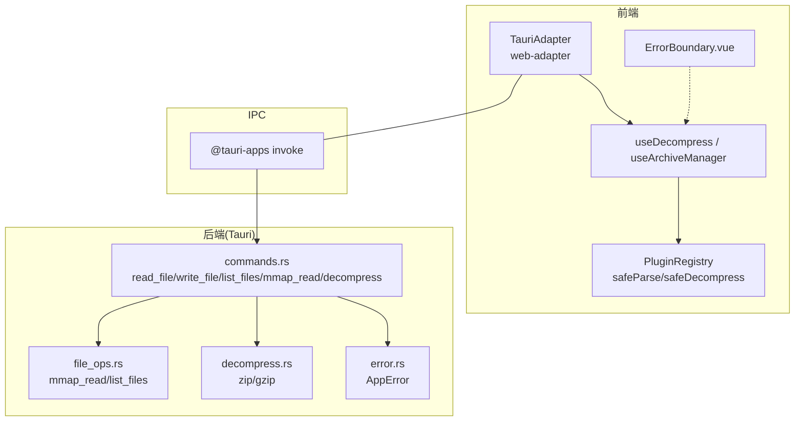
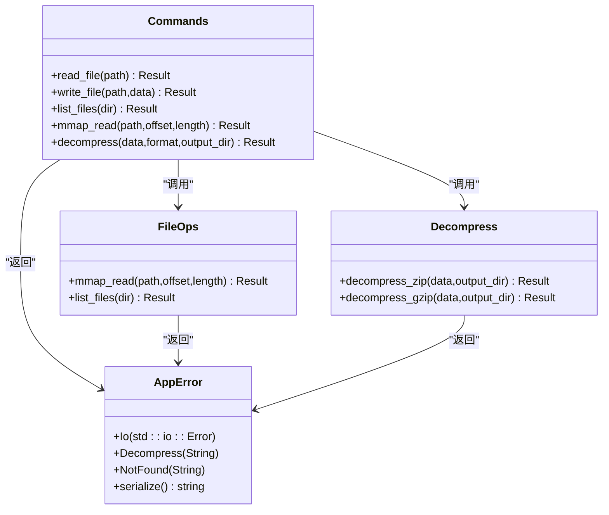
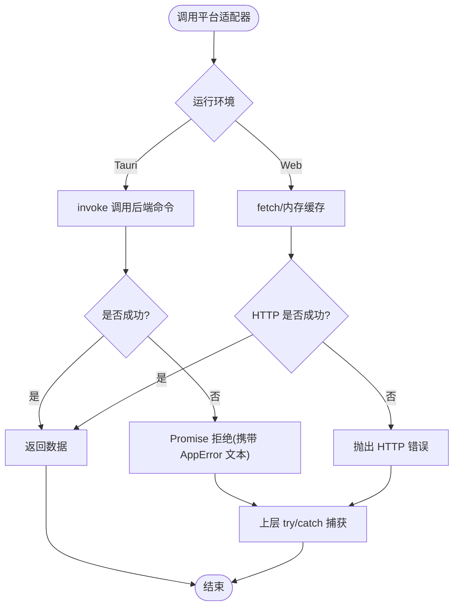
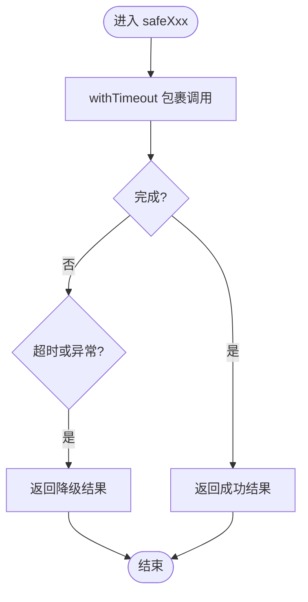
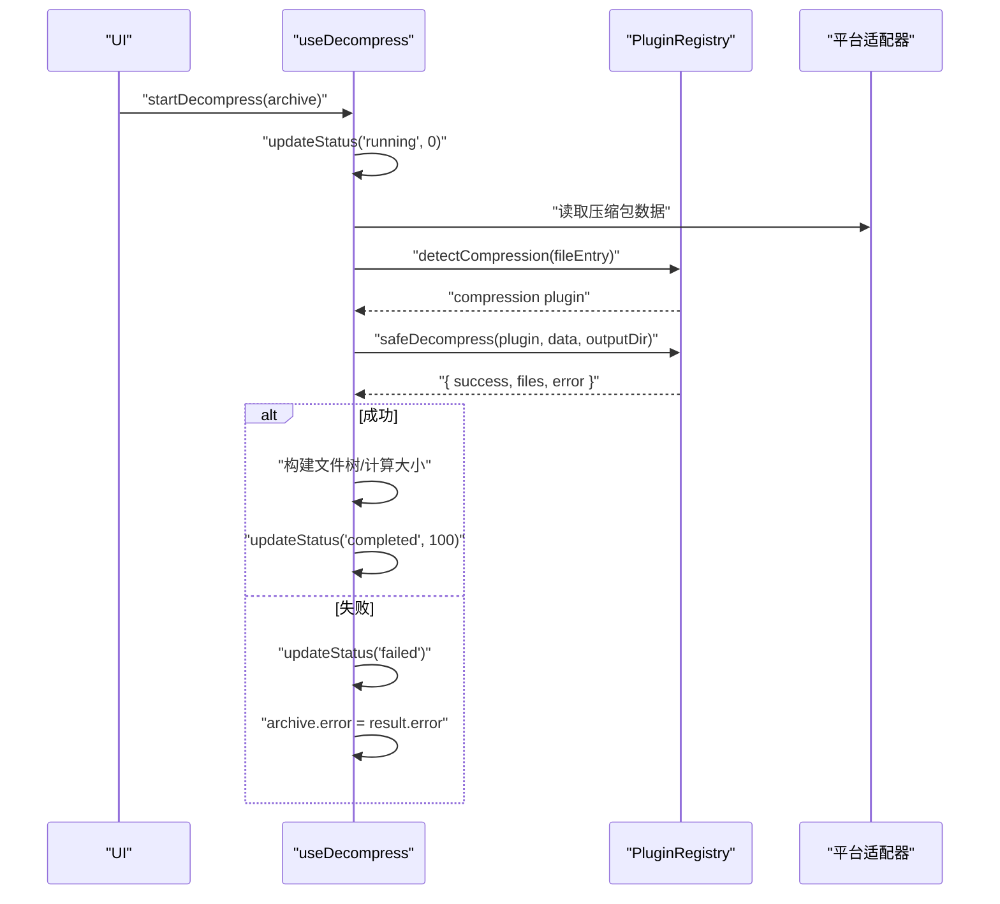
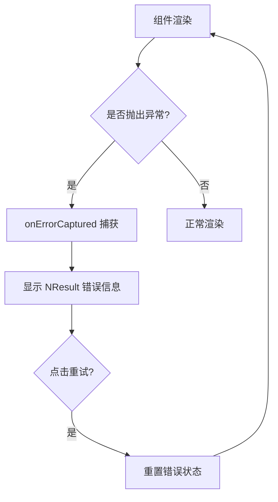
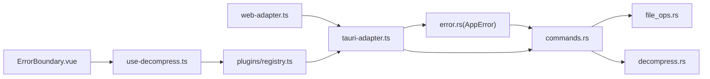

# 错误处理策略

<cite>
**本文引用的文件**
- [src-tauri/src/error.rs](file://src-tauri/src/error.rs)
- [src-tauri/src/commands.rs](file://src-tauri/src/commands.rs)
- [src-tauri/src/file_ops.rs](file://src-tauri/src/file_ops.rs)
- [src-tauri/src/decompress.rs](file://src-tauri/src/decompress.rs)
- [src/adapters/tauri-adapter.ts](file://src/adapters/tauri-adapter.ts)
- [src/adapters/web-adapter.ts](file://src/adapters/web-adapter.ts)
- [src/components/shared/ErrorBoundary.vue](file://src/components/shared/ErrorBoundary.vue)
- [src/plugins/registry.ts](file://src/plugins/registry.ts)
- [src/composables/use-decompress.ts](file://src/composables/use-decompress.ts)
- [docs/superpowers/specs/2026-06-26-system-architecture-design.md](file://docs/superpowers/specs/2026-06-26-system-architecture-design.md)
</cite>

## 目录
1. [简介](#简介)
2. [项目结构](#项目结构)
3. [核心组件](#核心组件)
4. [架构总览](#架构总览)
5. [详细组件分析](#详细组件分析)
6. [依赖关系分析](#依赖关系分析)
7. [性能考量](#性能考量)
8. [故障排查指南](#故障排查指南)
9. [结论](#结论)
10. [附录](#附录)

## 简介
本文件面向 Hello-Tauri 项目的统一错误处理策略，覆盖前后端一致的错误类型、传播路径与用户提示。重点包括：
- Rust 后端 AppError 枚举设计（IO、解压、未找到等）及跨进程序列化
- Tauri 命令层的权限校验与路径遍历防护
- TypeScript 前端的平台适配器错误捕获与转换
- 插件注册表的安全解析与超时保护
- 前端渲染级错误边界兜底
- 错误日志记录、调试信息与用户反馈的最佳实践
- 重试机制、超时处理与资源清理策略建议

## 项目结构
错误处理贯穿以下层次：
- 后端（Rust/Tauri）：错误定义、命令层校验、文件系统与解压模块
- 平台适配层（TypeScript）：TauriAdapter/WebAdapter 将底层异常转换为统一 Promise 失败
- 业务编排层（Composables/Plugins）：任务调度、安全调用、状态更新
- UI 层（Vue 组件）：错误边界兜底展示



图示来源
- [src/adapters/tauri-adapter.ts:14-45](file://src/adapters/tauri-adapter.ts#L14-L45)
- [src/adapters/web-adapter.ts:5-40](file://src/adapters/web-adapter.ts#L5-L40)
- [src/composables/use-decompress.ts:14-56](file://src/composables/use-decompress.ts#L14-L56)
- [src/plugins/registry.ts:98-116](file://src/plugins/registry.ts#L98-L116)
- [src-tauri/src/commands.rs:5-52](file://src-tauri/src/commands.rs#L5-L52)
- [src-tauri/src/file_ops.rs:6-18](file://src-tauri/src/file_ops.rs#L6-L18)
- [src-tauri/src/decompress.rs:23-62](file://src-tauri/src/decompress.rs#L23-L62)
- [src-tauri/src/error.rs:3-12](file://src-tauri/src/error.rs#L3-L12)
- [src/components/shared/ErrorBoundary.vue:7-14](file://src/components/shared/ErrorBoundary.vue#L7-L14)

章节来源
- [docs/superpowers/specs/2026-06-26-system-architecture-design.md:808-849](file://docs/superpowers/specs/2026-06-26-system-architecture-design.md#L808-L849)

## 核心组件
- Rust 错误模型：统一的 AppError 枚举，支持 thiserror 格式化与 serde 序列化，便于 IPC 传输到前端
- Tauri 命令层：对输入进行安全检查（如路径遍历），并将底层 IO 错误映射为 AppError
- 平台适配器：封装 @tauri-apps invoke 调用，将后端错误以 Promise 拒绝形式返回；Web 模式抛出明确错误
- 插件注册表：提供 safeParse/safeDecompress 包装，内置超时与异常回退
- 解压缩编排：使用任务调度器并发执行，维护状态并记录错误信息
- 错误边界：在 Vue 组件树中捕获渲染期异常，降级显示并提供重试入口

章节来源
- [src-tauri/src/error.rs:3-18](file://src-tauri/src/error.rs#L3-L18)
- [src-tauri/src/commands.rs:5-52](file://src-tauri/src/commands.rs#L5-L52)
- [src/adapters/tauri-adapter.ts:14-45](file://src/adapters/tauri-adapter.ts#L14-L45)
- [src/adapters/web-adapter.ts:5-40](file://src/adapters/web-adapter.ts#L5-L40)
- [src/plugins/registry.ts:98-116](file://src/plugins/registry.ts#L98-L116)
- [src/composables/use-decompress.ts:14-56](file://src/composables/use-decompress.ts#L14-L56)
- [src/components/shared/ErrorBoundary.vue:7-14](file://src/components/shared/ErrorBoundary.vue#L7-L14)

## 架构总览
下图展示了从前端调用到后端命令、再到错误返回与 UI 展示的完整链路。

```mermaid
sequenceDiagram
participant UI as "UI(组件/Composable)"
participant Adapter as "TauriAdapter"
participant IPC as "@tauri-apps.invoke"
participant Cmd as "commands.rs"
mod FS as "file_ops.rs"
mod Dec as "decompress.rs"
Err as "error.rs(AppError)"
UI->>Adapter : "read_file(path)/decompress(...)"
Adapter->>IPC : "invoke('read_file'|'decompress', args)"
IPC->>Cmd : "路由到命令函数"
Cmd->>FS : "mmap_read/list_files"
Cmd->>Dec : "decompress_zip/gzip"
FS-->>Cmd : "Result<Vec<u8>|Vec<FileMeta>"
Dec-->>Cmd : "Result<Vec<DecompressedFile>"
Cmd-->>IPC : "Result<T, AppError>"
IPC-->>Adapter : "Promise 成功或拒绝"
Adapter-->>UI : "返回数据或抛出错误"
UI->>Err : "记录/上报错误(可选)"
UI->>UI : "ErrorBoundary 兜底(渲染异常)"
```

图示来源
- [src/adapters/tauri-adapter.ts:14-45](file://src/adapters/tauri-adapter.ts#L14-L45)
- [src-tauri/src/commands.rs:5-52](file://src-tauri/src/commands.rs#L5-L52)
- [src-tauri/src/file_ops.rs:6-18](file://src-tauri/src/file_ops.rs#L6-L18)
- [src-tauri/src/decompress.rs:23-62](file://src-tauri/src/decompress.rs#L23-L62)
- [src-tauri/src/error.rs:3-18](file://src-tauri/src/error.rs#L3-L18)
- [src/components/shared/ErrorBoundary.vue:7-14](file://src/components/shared/ErrorBoundary.vue#L7-L14)

## 详细组件分析

### Rust 后端：AppError 与命令层错误
- AppError 枚举
  - 包含 IO 错误、解压错误、未找到等场景
  - 实现 Serialize，使错误可序列化为字符串，便于跨进程传递
- 命令层 read_file
  - 路径遍历防护：检测 ".." 片段，直接返回权限拒绝类错误
  - 其他 IO 错误通过 map_err 转为 AppError::Io
- mmap_read 与 list_files
  - 越界读取时返回 InvalidInput 的 IO 错误
  - 递归遍历目录，IO 错误向上冒泡
- decompress
  - zip/gzip 解压失败均转为 AppError::Decompress
  - 不支持格式时返回结构化结果（success=false, error=描述）



图示来源
- [src-tauri/src/error.rs:3-18](file://src-tauri/src/error.rs#L3-L18)
- [src-tauri/src/commands.rs:5-52](file://src-tauri/src/commands.rs#L5-L52)
- [src-tauri/src/file_ops.rs:6-18](file://src-tauri/src/file_ops.rs#L6-L18)
- [src-tauri/src/decompress.rs:23-62](file://src-tauri/src/decompress.rs#L23-L62)

章节来源
- [src-tauri/src/error.rs:3-18](file://src-tauri/src/error.rs#L3-L18)
- [src-tauri/src/commands.rs:5-52](file://src-tauri/src/commands.rs#L5-L52)
- [src-tauri/src/file_ops.rs:6-18](file://src-tauri/src/file_ops.rs#L6-L18)
- [src-tauri/src/decompress.rs:23-62](file://src-tauri/src/decompress.rs#L23-L62)

### TypeScript 前端：平台适配器与错误转换
- TauriAdapter
  - 通过 @tauri-apps invoke 调用后端命令
  - 当命令返回错误时，Promise 拒绝，上层 try/catch 可捕获
- WebAdapter
  - 网络请求失败时抛出带 HTTP 状态的错误
  - 不支持的功能直接抛出明确错误消息
  - streamRead 内部错误通过 controller.error 传播



图示来源
- [src/adapters/tauri-adapter.ts:14-45](file://src/adapters/tauri-adapter.ts#L14-L45)
- [src/adapters/web-adapter.ts:5-40](file://src/adapters/web-adapter.ts#L5-L40)

章节来源
- [src/adapters/tauri-adapter.ts:14-45](file://src/adapters/tauri-adapter.ts#L14-L45)
- [src/adapters/web-adapter.ts:5-40](file://src/adapters/web-adapter.ts#L5-L40)

### 插件注册表：安全解析与超时保护
- withTimeout：基于 Promise.race 的通用超时包装
- safeParse：解析失败时回退为十六进制视图
- safeDecompress：解压失败返回结构化失败结果（success=false, error=描述）



图示来源
- [src/plugins/registry.ts:6-12](file://src/plugins/registry.ts#L6-L12)
- [src/plugins/registry.ts:98-116](file://src/plugins/registry.ts#L98-L116)

章节来源
- [src/plugins/registry.ts:6-12](file://src/plugins/registry.ts#L6-L12)
- [src/plugins/registry.ts:98-116](file://src/plugins/registry.ts#L98-L116)

### 解压缩编排：状态管理与错误记录
- 使用 TaskScheduler 控制并发
- 按阶段更新进度与状态
- 捕获异常并写入 archive.error，供 UI 展示



图示来源
- [src/composables/use-decompress.ts:14-56](file://src/composables/use-decompress.ts#L14-L56)
- [src/plugins/registry.ts:106-116](file://src/plugins/registry.ts#L106-L116)

章节来源
- [src/composables/use-decompress.ts:14-56](file://src/composables/use-decompress.ts#L14-L56)

### 前端渲染级错误边界
- 使用 onErrorCaptured 捕获子树异常
- 阻止错误冒泡，避免应用崩溃
- 提供“重试”按钮重置状态



图示来源
- [src/components/shared/ErrorBoundary.vue:7-14](file://src/components/shared/ErrorBoundary.vue#L7-L14)

章节来源
- [src/components/shared/ErrorBoundary.vue:7-14](file://src/components/shared/ErrorBoundary.vue#L7-L14)

## 依赖关系分析
- 耦合与内聚
  - commands.rs 集中对外暴露能力，内部委托 file_ops.rs 与 decompress.rs，职责清晰
  - AppError 作为唯一错误出口，降低上层分支判断复杂度
- 外部依赖
  - Tauri IPC 桥接前端与后端
  - 第三方库（zip、flate2、memmap2）在解压与内存映射中可能产生 IO/格式错误
- 潜在循环依赖
  - 当前未见循环引用；错误类型集中在 error.rs，被多模块复用



图示来源
- [src-tauri/src/error.rs:3-18](file://src-tauri/src/error.rs#L3-L18)
- [src-tauri/src/commands.rs:5-52](file://src-tauri/src/commands.rs#L5-L52)
- [src-tauri/src/file_ops.rs:6-18](file://src-tauri/src/file_ops.rs#L6-L18)
- [src-tauri/src/decompress.rs:23-62](file://src-tauri/src/decompress.rs#L23-L62)
- [src/adapters/tauri-adapter.ts:14-45](file://src/adapters/tauri-adapter.ts#L14-L45)
- [src/adapters/web-adapter.ts:5-40](file://src/adapters/web-adapter.ts#L5-L40)
- [src/plugins/registry.ts:98-116](file://src/plugins/registry.ts#L98-L116)
- [src/composables/use-decompress.ts:14-56](file://src/composables/use-decompress.ts#L14-L56)
- [src/components/shared/ErrorBoundary.vue:7-14](file://src/components/shared/ErrorBoundary.vue#L7-L14)

章节来源
- [src-tauri/src/error.rs:3-18](file://src-tauri/src/error.rs#L3-L18)
- [src-tauri/src/commands.rs:5-52](file://src-tauri/src/commands.rs#L5-L52)
- [src-tauri/src/file_ops.rs:6-18](file://src-tauri/src/file_ops.rs#L6-L18)
- [src-tauri/src/decompress.rs:23-62](file://src-tauri/src/decompress.rs#L23-L62)
- [src/adapters/tauri-adapter.ts:14-45](file://src/adapters/tauri-adapter.ts#L14-L45)
- [src/adapters/web-adapter.ts:5-40](file://src/adapters/web-adapter.ts#L5-L40)
- [src/plugins/registry.ts:98-116](file://src/plugins/registry.ts#L98-L116)
- [src/composables/use-decompress.ts:14-56](file://src/composables/use-decompress.ts#L14-L56)
- [src/components/shared/ErrorBoundary.vue:7-14](file://src/components/shared/ErrorBoundary.vue#L7-L14)

## 性能考量
- 大文件读取
  - 后端 mmap_read 适合随机小范围读取；全量读取应结合流式或分块策略
  - WebAdapter.streamRead 已支持 ReadableStream，但 TauriAdapter 当前为全量读取后包装，后续可引入事件或专用插件实现真正流式
- 解压性能
  - 使用 TaskScheduler 限制并发，避免阻塞主线程
  - 插件层 withTimeout 防止长时间挂起
- 内存占用
  - 解压产物尽量落盘而非常驻内存
  - 临时目录由 get_temp_dir 提供，注意清理策略

[本节为通用指导，不直接分析具体文件]

## 故障排查指南
- 常见错误分类与定位
  - 权限/路径问题：检查 read_file 的路径校验与系统权限
  - 解压失败：查看 DecompressResult.error 字段
  - 网络错误：WebAdapter 抛出的 HTTP 状态信息
  - 插件超时：withTimeout 触发导致降级或失败
- 建议的日志与调试
  - 在 Composable 层记录关键步骤与耗时
  - 将 AppError 文本与上下文（path、format、output_dir）一并记录
  - 对 UI 层错误边界捕获的错误进行上报
- 重试与恢复
  - 网络请求可指数退避重试
  - 解压失败可按格式或内容尝试不同插件
  - 任务队列满时延迟重试或提示用户
- 资源清理
  - 解压完成后按需删除临时目录
  - 流式读取确保 reader 关闭与控制器正确结束

章节来源
- [src-tauri/src/commands.rs:5-52](file://src-tauri/src/commands.rs#L5-L52)
- [src-tauri/src/decompress.rs:23-62](file://src-tauri/src/decompress.rs#L23-L62)
- [src/adapters/web-adapter.ts:5-40](file://src/adapters/web-adapter.ts#L5-L40)
- [src/plugins/registry.ts:6-12](file://src/plugins/registry.ts#L6-L12)
- [src/composables/use-decompress.ts:14-56](file://src/composables/use-decompress.ts#L14-L56)
- [src/components/shared/ErrorBoundary.vue:7-14](file://src/components/shared/ErrorBoundary.vue#L7-L14)

## 结论
本项目在后端采用统一的 AppError 枚举与命令层校验，在前端通过平台适配器与插件注册表形成“安全调用+超时保护+降级回退”的闭环。配合任务调度与错误边界，既保证了健壮性，也提供了友好的用户反馈。建议在后续迭代中完善流式读取、统一错误上报与更细粒度的重试策略。

[本节为总结性内容，不直接分析具体文件]

## 附录
- 错误类型速查
  - 后端：IO 错误、解压错误、未找到、路径遍历拒绝
  - 前端：网络错误、解析错误、业务错误（无插件/队列满）、渲染异常
- 最佳实践清单
  - 始终在边界处捕获并记录错误
  - 对用户可见的错误信息进行本地化与友好提示
  - 对可恢复错误实施可控重试
  - 对不可恢复错误提供明确的下一步操作（重试/切换查看器/清空缓存）

[本节为补充说明，不直接分析具体文件]