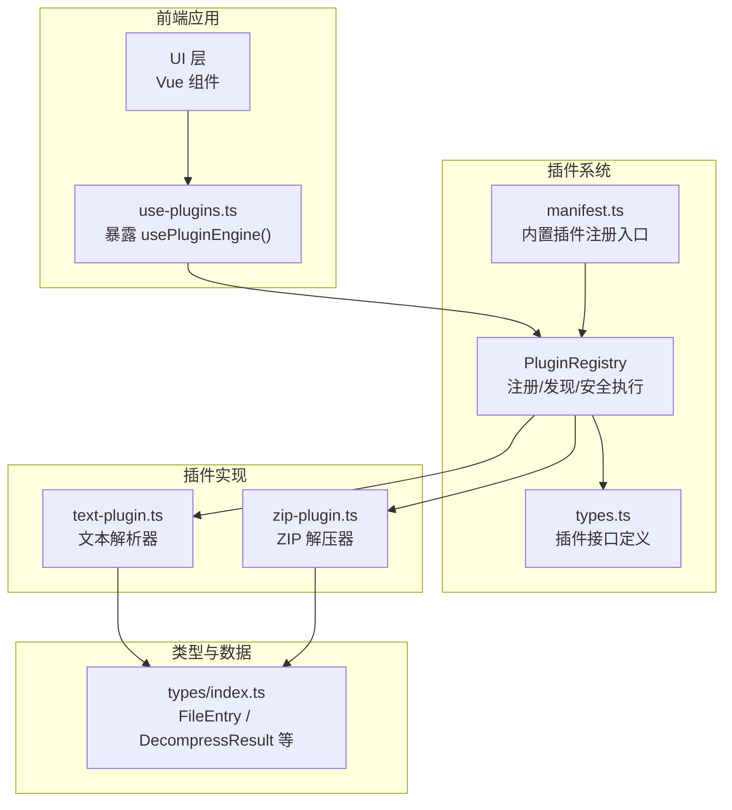
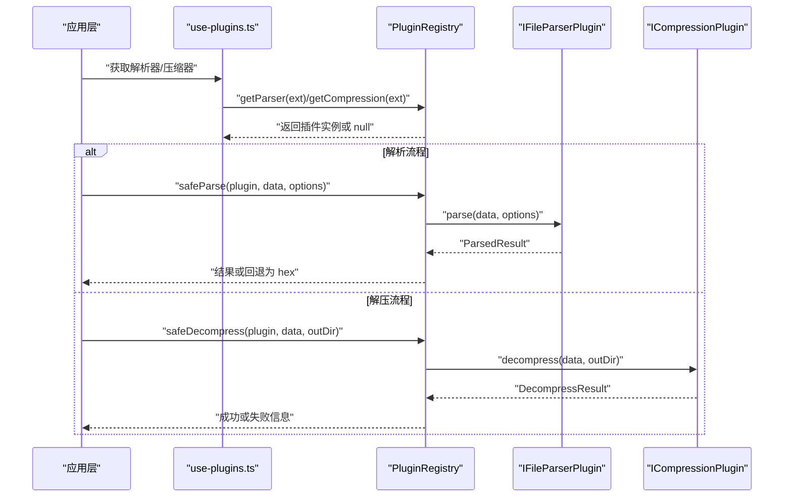
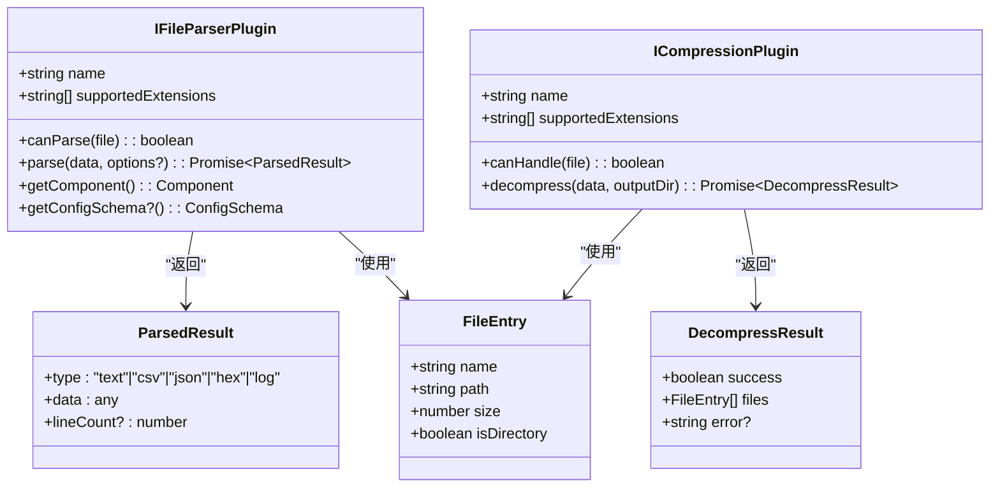
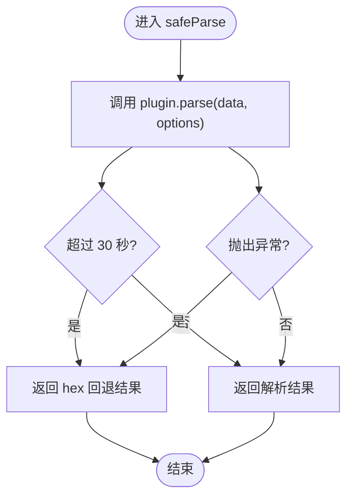
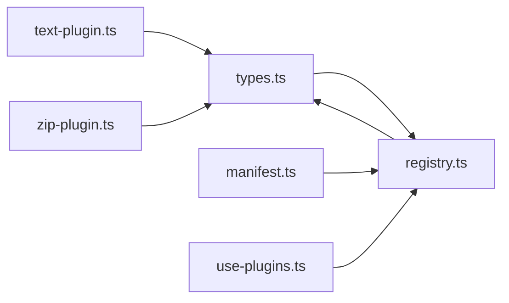

# 插件化架构设计

<cite>
**本文引用的文件列表**
- [README.md](file://README.md)
- [src/plugins/types.ts](file://src/plugins/types.ts)
- [src/plugins/registry.ts](file://src/plugins/registry.ts)
- [src/plugins/manifest.ts](file://src/plugins/manifest.ts)
- [src/composables/use-plugins.ts](file://src/composables/use-plugins.ts)
- [src/plugins/parser/text-plugin.ts](file://src/plugins/parser/text-plugin.ts)
- [src/plugins/compression/zip-plugin.ts](file://src/plugins/compression/zip-plugin.ts)
- [src/types/index.ts](file://src/types/index.ts)
- [src/__tests__/plugins/registry.test.ts](file://src/__tests__/plugins/registry.test.ts)
- [docs/superpowers/specs/2026-06-26-system-architecture-design.md](file://docs/superpowers/specs/2026-06-26-system-architecture-design.md)
</cite>

## 目录
1. [引言](#引言)
2. [项目结构](#项目结构)
3. [核心组件](#核心组件)
4. [架构总览](#架构总览)
5. [详细组件分析](#详细组件分析)
6. [依赖关系分析](#依赖关系分析)
7. [性能与可靠性](#性能与可靠性)
8. [安全沙箱机制](#安全沙箱机制)
9. [插件开发指南](#插件开发指南)
10. [测试策略与调试技巧](#测试策略与调试技巧)
11. [结论](#结论)

## 引言
本文件面向 Hello-Tauri 项目的插件化架构，系统性阐述插件发现、注册中心、生命周期管理、依赖注入、接口规范（IFileParserPlugin 与 ICompressionPlugin）、清单（Manifest）与元数据约定、安全沙箱、以及测试与调试实践。目标是帮助开发者快速理解并高质量地扩展解析器与压缩处理器等能力。

## 项目结构
Hello-Tauri 采用“微内核 + 插件”的架构：核心引擎负责调度、隔离与回退；插件通过统一接口接入，按扩展名自动发现与匹配；内置插件由清单集中注册。

图示来源
- [src/composables/use-plugins.ts:1-17](file://src/composables/use-plugins.ts#L1-L17)
- [src/plugins/registry.ts:1-118](file://src/plugins/registry.ts#L1-L118)
- [src/plugins/manifest.ts:1-20](file://src/plugins/manifest.ts#L1-L20)
- [src/plugins/types.ts:1-37](file://src/plugins/types.ts#L1-L37)
- [src/plugins/parser/text-plugin.ts:1-18](file://src/plugins/parser/text-plugin.ts#L1-L18)
- [src/plugins/compression/zip-plugin.ts:1-40](file://src/plugins/compression/zip-plugin.ts#L1-L40)
- [src/types/index.ts:1-71](file://src/types/index.ts#L1-L71)

章节来源
- [README.md:71-127](file://README.md#L71-L127)

## 核心组件
- 插件接口定义：IFileParserPlugin 与 ICompressionPlugin，明确插件能力边界与输入输出契约。
- 注册中心：PluginRegistry 提供注册、扩展名映射、检测、启用/禁用、安全执行（超时与异常隔离）。
- 清单：registerBuiltinPlugins 集中注册内置插件，保证启动即用的同时便于扩展。
- 组合式入口：use-plugins.ts 暴露 usePluginEngine，供业务层以单例方式访问注册中心。

章节来源
- [src/plugins/types.ts:16-30](file://src/plugins/types.ts#L16-L30)
- [src/plugins/registry.ts:14-118](file://src/plugins/registry.ts#L14-L118)
- [src/plugins/manifest.ts:10-19](file://src/plugins/manifest.ts#L10-L19)
- [src/composables/use-plugins.ts:1-17](file://src/composables/use-plugins.ts#L1-L17)

## 架构总览
从调用方到插件执行的端到端流程如下：

图示来源
- [src/composables/use-plugins.ts:7-16](file://src/composables/use-plugins.ts#L7-L16)
- [src/plugins/registry.ts:98-116](file://src/plugins/registry.ts#L98-L116)
- [src/plugins/types.ts:23-30](file://src/plugins/types.ts#L23-L30)
- [src/plugins/types.ts:16-21](file://src/plugins/types.ts#L16-L21)

## 详细组件分析

### 插件接口规范
- IFileParserPlugin
  - name：插件唯一标识
  - supportedExtensions：支持的扩展名集合
  - canParse(file)：基于文件名判断是否可解析
  - parse(data, options?)：将二进制数据解析为结构化结果
  - getComponent()：返回渲染该结果的 Vue 组件
  - getConfigSchema()?：可选，声明配置项模式，用于动态生成配置表单
- ICompressionPlugin
  - name：插件唯一标识
  - supportedExtensions：支持的压缩格式扩展名
  - canHandle(file)：基于文件名判断是否可处理
  - decompress(data, outputDir)：解包数据并写入目标目录，返回结果对象

图示来源
- [src/plugins/types.ts:16-36](file://src/plugins/types.ts#L16-L36)
- [src/types/index.ts:1-13](file://src/types/index.ts#L1-L13)

章节来源
- [src/plugins/types.ts:16-36](file://src/plugins/types.ts#L16-L36)
- [src/types/index.ts:1-13](file://src/types/index.ts#L1-L13)

### 注册中心（PluginRegistry）
职责
- 维护解析器与压缩器的注册表，建立扩展名到插件名的映射
- 提供 detect/detectByFileName 等发现方法
- 支持运行时 enable/disable 控制插件可用性
- 提供 safeParse/safeDecompress 安全执行包装（超时保护、异常捕获与回退）

关键行为
- 注册时同步构建 ext→name 索引，提升查找效率
- 检测时忽略已禁用的插件
- 安全执行使用 Promise.race 进行超时控制，并在异常时返回降级结果

图示来源
- [src/plugins/registry.ts:98-104](file://src/plugins/registry.ts#L98-L104)
- [src/plugins/registry.ts:4-12](file://src/plugins/registry.ts#L4-L12)

章节来源
- [src/plugins/registry.ts:14-118](file://src/plugins/registry.ts#L14-L118)

### 清单（Manifest）与内置插件注册
- registerBuiltinPlugins 集中注册所有内置解析器与压缩器，确保应用启动即可用
- 注册顺序影响检测优先级（例如 log 优先于 hex 兜底）

章节来源
- [src/plugins/manifest.ts:10-19](file://src/plugins/manifest.ts#L10-L19)

### 组合式入口（use-plugins.ts）
- 创建全局 PluginRegistry 实例并注册内置插件
- 暴露 usePluginEngine 函数，封装常用操作（detect/getParser/getCompression/enable/disable）

章节来源
- [src/composables/use-plugins.ts:1-17](file://src/composables/use-plugins.ts#L1-L17)

### 示例插件：文本解析器（text-plugin）
- 声明支持的扩展名
- canParse 基于扩展名判定
- parse 委托给具体解析逻辑
- getComponent 返回对应渲染组件

章节来源
- [src/plugins/parser/text-plugin.ts:1-18](file://src/plugins/parser/text-plugin.ts#L1-L18)

### 示例插件：ZIP 压缩处理器（zip-plugin）
- 在 Tauri 平台通过适配器调用原生解压
- 在 Web 平台使用 fflate 进行内存解压，并将文件写入内存存储
- 返回统一的 DecompressResult

章节来源
- [src/plugins/compression/zip-plugin.ts:1-40](file://src/plugins/compression/zip-plugin.ts#L1-L40)

## 依赖关系分析
- 插件接口与核心类型解耦：插件仅依赖 types.ts 中的接口与基础数据结构
- 注册中心对插件无侵入：通过 Map 与 Set 管理状态，避免循环依赖
- 清单作为装配点：不引入业务逻辑，只负责注册
- 组合式入口作为对外门面：屏蔽内部实现细节

图示来源
- [src/plugins/types.ts:1-37](file://src/plugins/types.ts#L1-37)
- [src/plugins/registry.ts:1-118](file://src/plugins/registry.ts#L1-L118)
- [src/plugins/manifest.ts:1-20](file://src/plugins/manifest.ts#L1-L20)
- [src/composables/use-plugins.ts:1-17](file://src/composables/use-plugins.ts#L1-L17)
- [src/plugins/parser/text-plugin.ts:1-18](file://src/plugins/parser/text-plugin.ts#L1-L18)
- [src/plugins/compression/zip-plugin.ts:1-40](file://src/plugins/compression/zip-plugin.ts#L1-L40)

章节来源
- [src/plugins/types.ts:1-37](file://src/plugins/types.ts#L1-37)
- [src/plugins/registry.ts:1-118](file://src/plugins/registry.ts#L1-L118)
- [src/plugins/manifest.ts:1-20](file://src/plugins/manifest.ts#L1-L20)
- [src/composables/use-plugins.ts:1-17](file://src/composables/use-plugins.ts#L1-L17)

## 性能与可靠性
- 超时保护：safeParse/safeDecompress 使用 30 秒超时，防止插件阻塞主线程
- 异常隔离：插件错误不会传播至核心引擎，统一回退为十六进制查看或失败结果
- 查找优化：扩展名到插件名的映射为 O(1)，检测过程高效
- 资源限制：Web 端解压走内存存储，建议结合任务调度器限制并发与内存占用

章节来源
- [src/plugins/registry.ts:4-12](file://src/plugins/registry.ts#L4-L12)
- [src/plugins/registry.ts:98-116](file://src/plugins/registry.ts#L98-L116)

## 安全沙箱机制
当前实现的安全边界包括：
- 执行隔离：通过 safeParse/safeDecompress 包裹插件调用，异常被捕获，不影响核心
- 超时保护：Promise.race 限制最长运行时间
- 回退策略：解析失败回退为 hex 查看；解压失败返回失败结果
- 运行时开关：enable/disable 控制插件可用性，禁用后自动回退

未来可扩展方向（概念性建议）：
- 权限白名单：限制插件可调用的 API 范围
- 资源配额：CPU/内存/IO 限额
- 独立作用域：通过 Worker 或沙箱环境进一步隔离

章节来源
- [src/plugins/registry.ts:98-116](file://src/plugins/registry.ts#L98-L116)
- [docs/superpowers/specs/2026-06-26-system-architecture-design.md:681-749](file://docs/superpowers/specs/2026-06-26-system-architecture-design.md#L681-L749)
- [docs/superpowers/specs/2026-06-26-system-architecture-design.md:808-849](file://docs/superpowers/specs/2026-06-26-system-architecture-design.md#L808-L849)

## 插件开发指南

### 通用步骤
1. 新建插件文件，实现 IFileParserPlugin 或 ICompressionPlugin 接口
2. 声明 name 与 supportedExtensions，确保能正确匹配目标文件
3. 实现 canParse/canHandle 与核心处理方法（parse/decompress）
4. 若为解析器，实现 getComponent 返回渲染组件；可选实现 getConfigSchema 提供配置表单
5. 在 manifest.ts 中注册插件（或使用外部注册机制）
6. 编写单元测试覆盖正常路径、边界条件与异常场景

### 解析器插件（IFileParserPlugin）示例要点
- 扩展名匹配：参考 text-plugin 的实现思路
- 解析逻辑：返回 ParsedResult，包含 type、data 与可选 lineCount
- 渲染组件：返回对应的 Vue 组件，用于预览展示
- 配置模式：如需用户自定义参数，实现 getConfigSchema 返回字段定义

章节来源
- [src/plugins/parser/text-plugin.ts:1-18](file://src/plugins/parser/text-plugin.ts#L1-L18)
- [src/plugins/types.ts:23-30](file://src/plugins/types.ts#L23-L30)

### 压缩处理器插件（ICompressionPlugin）示例要点
- 平台适配：Tauri 平台通过适配器调用原生解压；Web 平台使用 fflate 内存解压
- 结果结构：返回 DecompressResult，success 为 true/false，files 为 FileEntry 列表，error 携带错误信息
- 错误处理：捕获异常并返回失败结果，避免崩溃

章节来源
- [src/plugins/compression/zip-plugin.ts:1-40](file://src/plugins/compression/zip-plugin.ts#L1-L40)
- [src/types/index.ts:9-13](file://src/types/index.ts#L9-L13)

### 清单与元数据约定
- 清单位置：manifest.ts 集中注册内置插件
- 元数据约定：插件通过 name 与 supportedExtensions 表达身份与能力
- 版本兼容性：当前未显式定义版本字段；可在后续扩展中增加 version 与 minCoreVersion 等字段，配合注册中心做兼容校验

章节来源
- [src/plugins/manifest.ts:10-19](file://src/plugins/manifest.ts#L10-L19)
- [src/plugins/types.ts:16-30](file://src/plugins/types.ts#L16-L30)

## 测试策略与调试技巧

### 测试策略
- 注册中心测试：验证注册、检索、检测、启用/禁用、安全执行与回退
- 插件单元测：针对 canParse/canHandle、parse/decompress 的正常与异常路径
- 集成测试：模拟完整流程（上传 → 解压 → 树构建 → 渲染）

章节来源
- [src/__tests__/plugins/registry.test.ts:1-97](file://src/__tests__/plugins/registry.test.ts#L1-L97)

### 调试技巧
- 日志埋点：在 safeParse/safeDecompress 前后记录耗时与错误
- 回退观察：确认异常是否稳定回退为 hex 或失败结果
- 禁用开关：通过 disable(name) 临时关闭可疑插件，定位问题
- 平台差异：区分 Tauri 与 Web 分支，分别验证

章节来源
- [src/plugins/registry.ts:98-116](file://src/plugins/registry.ts#L98-L116)
- [src/composables/use-plugins.ts:7-16](file://src/composables/use-plugins.ts#L7-L16)

## 结论
Hello-Tauri 的插件化架构以清晰的接口契约、健壮的注册中心与安全执行保障为核心，实现了高内聚、低耦合的可扩展体系。通过清单集中装配、组合式入口简化使用、完善的超时与异常隔离，开发者可以专注于插件能力的实现，而无需关心底层调度与稳定性。建议在后续迭代中补充更细粒度的权限与资源限制，并完善清单的版本兼容性策略，进一步提升生态健壮性与可维护性。