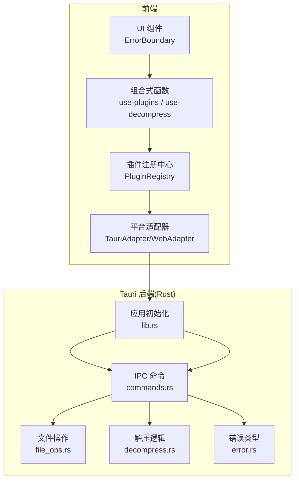
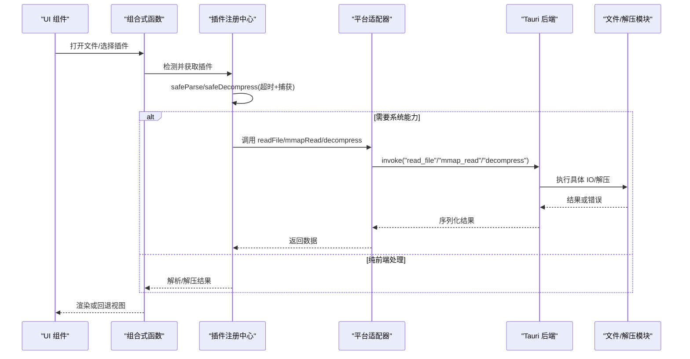
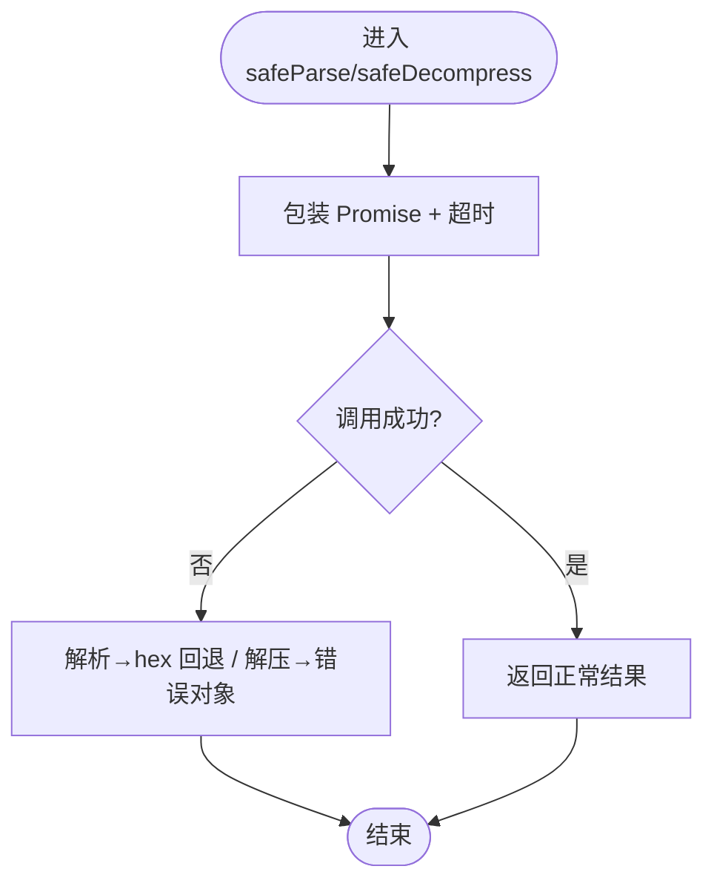
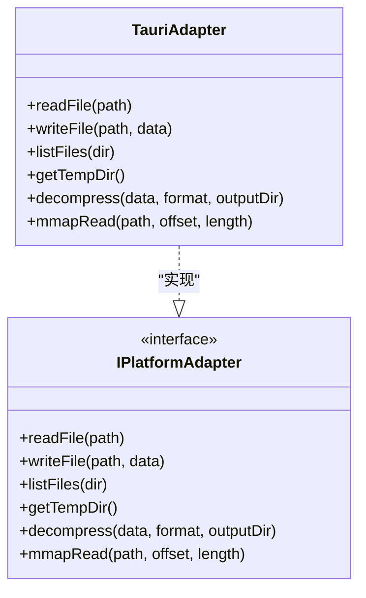
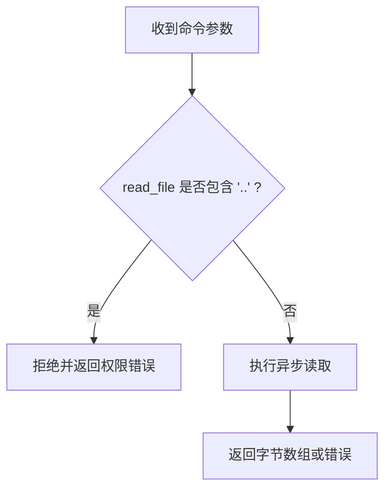
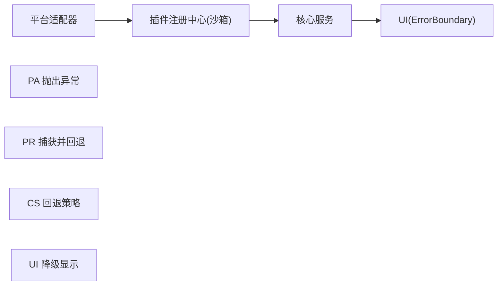
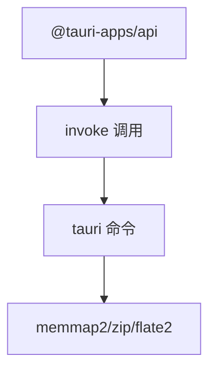

# 插件安全沙箱

<cite>
**本文引用的文件**   
- [README.md](file://README.md)
- [tauri.conf.json](file://src-tauri/tauri.conf.json)
- [default.json](file://src-tauri/capabilities/default.json)
- [Cargo.toml](file://src-tauri/Cargo.toml)
- [lib.rs](file://src-tauri/src/lib.rs)
- [main.rs](file://src-tauri/src/main.rs)
- [commands.rs](file://src-tauri/src/commands.rs)
- [file_ops.rs](file://src-tauri/src/file_ops.rs)
- [decompress.rs](file://src-tauri/src/decompress.rs)
- [error.rs](file://src-tauri/src/error.rs)
- [registry.ts](file://src/plugins/registry.ts)
- [types.ts](file://src/plugins/types.ts)
- [manifest.ts](file://src/plugins/manifest.ts)
- [use-platform.ts](file://src/composables/use-platform.ts)
- [tauri-adapter.ts](file://src/adapters/tauri-adapter.ts)
- [2026-06-26-system-architecture-design.md](file://docs/superpowers/specs/2026-06-26-system-architecture-design.md)
</cite>

## 目录
1. [引言](#引言)
2. [项目结构](#项目结构)
3. [核心组件](#核心组件)
4. [架构总览](#架构总览)
5. [详细组件分析](#详细组件分析)
6. [依赖分析](#依赖分析)
7. [性能考虑](#性能考虑)
8. [故障排查指南](#故障排查指南)
9. [结论](#结论)
10. [附录](#附录)

## 引言
本文件面向 Hello-Tauri 项目的“插件安全沙箱”主题，系统性阐述插件执行环境的安全隔离机制、权限模型、异常隔离与降级策略，以及资源使用监控与安全配置建议。文档基于仓库现有实现进行解读，并在不改变既有行为的前提下给出可落地的增强方案（如网络请求过滤、CPU/内存/I/O 限制、审计日志等），帮助读者理解当前能力边界与后续演进方向。

## 项目结构
本项目采用前后端分离的 Tauri 架构：前端通过适配器调用 Rust 后端命令，Rust 侧提供文件系统访问、解压等能力；插件系统运行在前端，由注册中心统一调度并施加超时保护与错误回退。

图表来源
- [lib.rs:6-18](file://src-tauri/src/lib.rs#L6-L18)
- [commands.rs:5-53](file://src-tauri/src/commands.rs#L5-L53)
- [file_ops.rs:6-53](file://src-tauri/src/file_ops.rs#L6-L53)
- [decompress.rs:23-82](file://src-tauri/src/decompress.rs#L23-L82)
- [error.rs:3-12](file://src-tauri/src/error.rs#L3-L12)
- [registry.ts:14-118](file://src/plugins/registry.ts#L14-L118)
- [tauri-adapter.ts:14-45](file://src/adapters/tauri-adapter.ts#L14-L45)

章节来源
- [README.md:71-127](file://README.md#L71-L127)

## 核心组件
- 插件注册中心（PluginRegistry）
  - 负责解析器与压缩插件的注册、发现、启用/禁用、白名单控制。
  - 提供 safeParse 与 safeDecompress 两个“沙箱化”入口，内置超时保护与异常捕获，失败时回退到十六进制查看或错误结果。
- 平台适配器（TauriAdapter/WebAdapter）
  - 将前端对文件读写、mmap 读取、解压等操作抽象为跨平台接口，在 Tauri 模式下通过 IPC invoke 调用 Rust 命令。
- Tauri 后端命令（commands.rs）
  - 暴露 read_file、write_file、list_files、mmap_read、decompress 等命令，作为前端与系统资源的受控桥接点。
- 文件与解压模块（file_ops.rs、decompress.rs）
  - 提供 mmap 零拷贝读取、递归目录遍历、zip/gzip 解压等能力。
- 错误模型（error.rs）
  - 统一的 AppError 枚举，序列化后返回前端。

章节来源
- [registry.ts:14-118](file://src/plugins/registry.ts#L14-L118)
- [tauri-adapter.ts:14-45](file://src/adapters/tauri-adapter.ts#L14-L45)
- [commands.rs:5-53](file://src-tauri/src/commands.rs#L5-L53)
- [file_ops.rs:6-53](file://src-tauri/src/file_ops.rs#L6-L53)
- [decompress.rs:23-82](file://src-tauri/src/decompress.rs#L23-L82)
- [error.rs:3-12](file://src-tauri/src/error.rs#L3-L12)

## 架构总览
下图展示从 UI 到插件再到后端命令的完整调用链，以及错误传播路径。

图表来源
- [registry.ts:98-116](file://src/plugins/registry.ts#L98-L116)
- [tauri-adapter.ts:14-45](file://src/adapters/tauri-adapter.ts#L14-L45)
- [commands.rs:5-53](file://src-tauri/src/commands.rs#L5-L53)
- [file_ops.rs:6-53](file://src-tauri/src/file_ops.rs#L6-L53)
- [decompress.rs:23-82](file://src-tauri/src/decompress.rs#L23-L82)

## 详细组件分析

### 插件注册中心（沙箱层）
- 作用域与最小权限
  - 插件仅能通过注册中心提供的 safeParse/safeDecompress 访问系统能力，避免直接持有底层 API。
- 超时保护
  - 所有插件调用均被 withTimeout 包裹，防止无限阻塞。
- 异常隔离与回退
  - 解析失败回退至十六进制查看；解压失败返回结构化错误对象，不影响主流程。
- 启用/禁用与白名单
  - 支持运行时 enable/disable，结合扩展名映射实现细粒度开关。

图表来源
- [registry.ts:6-12](file://src/plugins/registry.ts#L6-L12)
- [registry.ts:98-116](file://src/plugins/registry.ts#L98-L116)

章节来源
- [registry.ts:14-118](file://src/plugins/registry.ts#L14-L118)
- [types.ts:16-36](file://src/plugins/types.ts#L16-L36)

### 平台适配器（IPC 桥接）
- 职责
  - 封装 @tauri-apps/api/core.invoke，按需懒加载，屏蔽平台差异。
- 安全边界
  - 仅暴露必要方法（读/写/列表/mmap/解压），禁止插件直接访问全局网络或进程能力。
- 错误传播
  - 将 Rust 侧 AppError 序列化为字符串，交由上层统一处理。

图表来源
- [tauri-adapter.ts:14-45](file://src/adapters/tauri-adapter.ts#L14-L45)

章节来源
- [tauri-adapter.ts:1-45](file://src/adapters/tauri-adapter.ts#L1-45)
- [use-platform.ts:1-24](file://src/composables/use-platform.ts#L1-L24)

### Tauri 后端命令（受控资源访问）
- 命令清单
  - read_file、write_file、get_temp_dir、mmap_read、list_files、decompress。
- 输入校验与越界保护
  - read_file 拒绝包含 ".." 的路径，防止目录穿越。
  - mmap_read 校验偏移与长度不超过文件大小。
- 解压安全
  - 按格式分发到 zip/gzip 解压实现，输出目录由调用方指定。

图表来源
- [commands.rs:5-14](file://src-tauri/src/commands.rs#L5-L14)
- [file_ops.rs:6-18](file://src-tauri/src/file_ops.rs#L6-L18)

章节来源
- [commands.rs:5-53](file://src-tauri/src/commands.rs#L5-L53)
- [file_ops.rs:6-53](file://src-tauri/src/file_ops.rs#L6-L53)
- [decompress.rs:23-82](file://src-tauri/src/decompress.rs#L23-L82)
- [error.rs:3-12](file://src-tauri/src/error.rs#L3-L12)

### 错误处理与异常隔离
- 分层错误处理
  - 平台层：文件读写失败、IPC 断连 → 适配器抛出 → 组合式函数捕获 → 状态标记 error。
  - 插件层：解压失败、解析异常、超时 → 注册中心捕获 → 事件上报 → UI 提示。
  - 业务层：文件不存在、格式不支持 → 回退到十六进制查看器或空状态。
  - UI 层：组件渲染异常 → ErrorBoundary 捕获并降级显示。

图表来源
- [2026-06-26-system-architecture-design.md:808-849](file://docs/superpowers/specs/2026-06-26-system-architecture-design.md#L808-L849)

章节来源
- [2026-06-26-system-architecture-design.md:808-849](file://docs/superpowers/specs/2026-06-26-system-architecture-design.md#L808-L849)

## 依赖分析
- 前端依赖
  - Vue 3、Naive UI、Pinia、@vueuse/core、@tauri-apps/api、fflate、splitpanes、vue-draggable-plus。
- 后端依赖
  - tauri 2、tokio、memmap2、zip、flate2、rayon、serde、thiserror。

图表来源
- [Cargo.toml:6-16](file://src-tauri/Cargo.toml#L6-L16)
- [README.md:15-42](file://README.md#L15-L42)

章节来源
- [README.md:15-42](file://README.md#L15-L42)
- [Cargo.toml:1-19](file://src-tauri/Cargo.toml#L1-L19)

## 性能考虑
- 大文件友好
  - 使用 mmap 零拷贝读取，减少内存拷贝开销。
- 并发控制
  - 任务调度器控制解压并发数，支持队列与重试（参考 README 特性说明）。
- 超时保护
  - 插件调用默认 30 秒超时，避免长时间阻塞。

章节来源
- [README.md:44-50](file://README.md#L44-L50)
- [registry.ts:4](file://src/plugins/registry.ts#L4-L4)
- [file_ops.rs:6-18](file://src-tauri/src/file_ops.rs#L6-L18)

## 故障排查指南
- 常见错误定位
  - 文件路径穿越：检查 read_file 是否拒绝包含 ".." 的路径。
  - 越界读取：检查 mmap_read 的 offset/length 是否超出文件大小。
  - 解压失败：确认格式是否为 zip/gzip，输出目录是否存在且可写。
- 错误传播链路
  - Rust 侧 AppError 序列化后返回前端，上层统一捕获并回退。

章节来源
- [commands.rs:5-14](file://src-tauri/src/commands.rs#L5-L14)
- [file_ops.rs:6-18](file://src-tauri/src/file_ops.rs#L6-L18)
- [decompress.rs:23-82](file://src-tauri/src/decompress.rs#L23-L82)
- [error.rs:3-12](file://src-tauri/src/error.rs#L3-L12)

## 结论
当前 Hello-Tauri 的插件安全沙箱以前端注册中心为核心，结合 Tauri 后端命令形成“最小权限、超时保护、异常隔离、回退兜底”的执行环境。为进一步强化安全性，可在以下方面持续完善：网络请求过滤、更严格的文件系统白名单、资源用量监控与节流、审计日志与恶意插件检测等。

## 附录

### 权限模型与能力声明
- 能力定义
  - 默认窗口能力 default.json 中声明 core:default 权限，用于主窗口的基础能力。
- 最小权限原则
  - 插件仅通过注册中心的受限 API 访问系统资源，避免直接持有底层能力。
- 访问控制
  - 支持运行时启用/禁用插件，结合扩展名映射实现细粒度控制。

章节来源
- [default.json:1-9](file://src-tauri/capabilities/default.json#L1-L9)
- [registry.ts:65-91](file://src/plugins/registry.ts#L65-L91)

### 安全配置指南
- 沙箱参数调优
  - 调整插件超时阈值（当前 30 秒），根据实际场景优化。
- 安全策略定制
  - 在 read_file 中引入白名单目录校验；在 decompress 中限制输出目录范围与最大解压大小。
- 审计日志配置
  - 建议在 commands 层记录关键操作（路径、大小、耗时、结果码），便于追踪与取证。

章节来源
- [registry.ts:4](file://src/plugins/registry.ts#L4-L4)
- [commands.rs:5-53](file://src-tauri/src/commands.rs#L5-L53)

### 漏洞防护与恶意插件检测（建议方案）
- 输入校验与路径规范
  - 拒绝包含 ".." 的路径；限制输出目录为临时目录或用户授权目录。
- 资源限制
  - 增加 CPU 时间片限制、内存上限、磁盘 I/O 限速（可通过外部进程或系统级 cgroup 实现）。
- 网络访问控制
  - 默认禁止插件发起网络请求；如需启用，需显式授权并限制目标域名与协议。
- 行为监测
  - 统计插件调用频率、异常率、资源占用，触发告警或自动禁用可疑插件。

[本节为概念性建议，不直接分析具体源码文件]