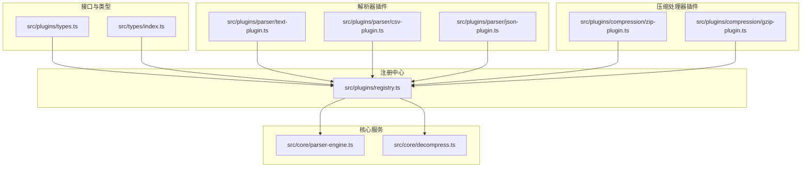
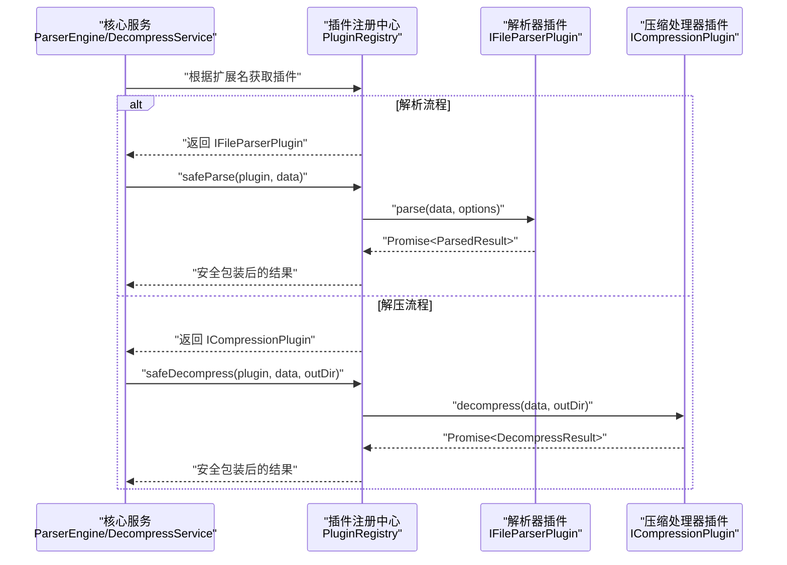
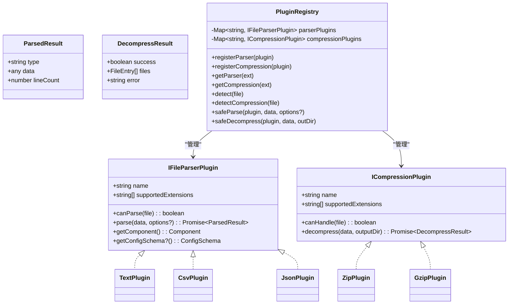
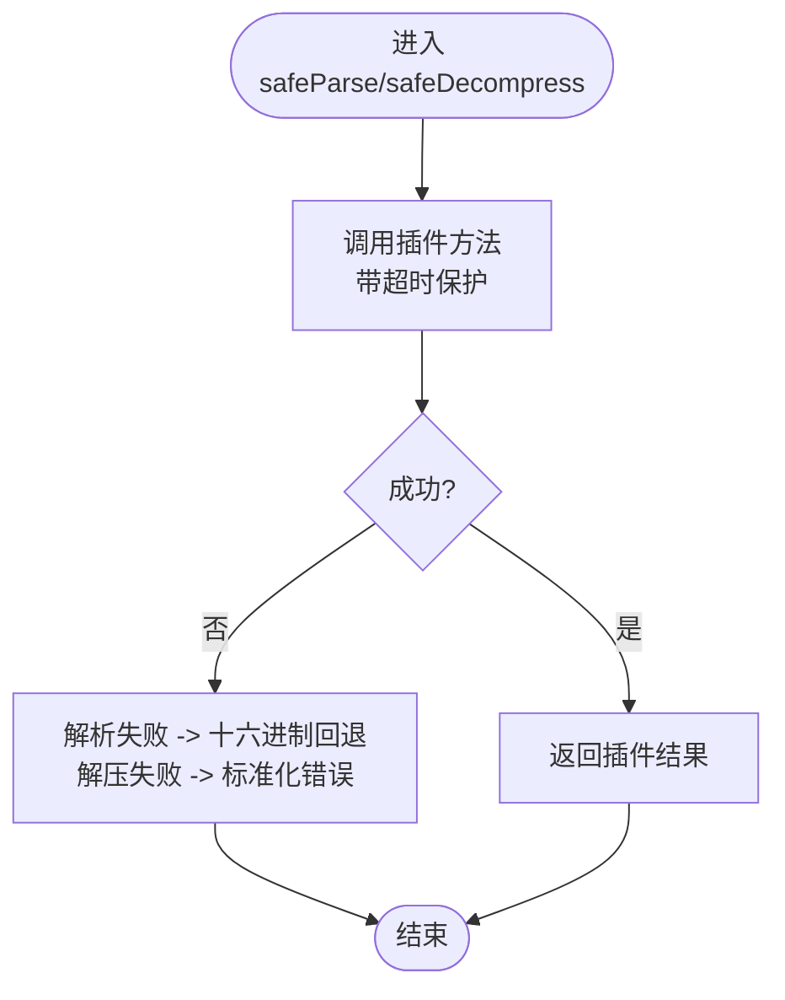
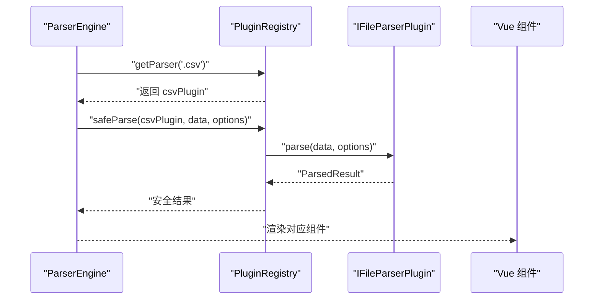
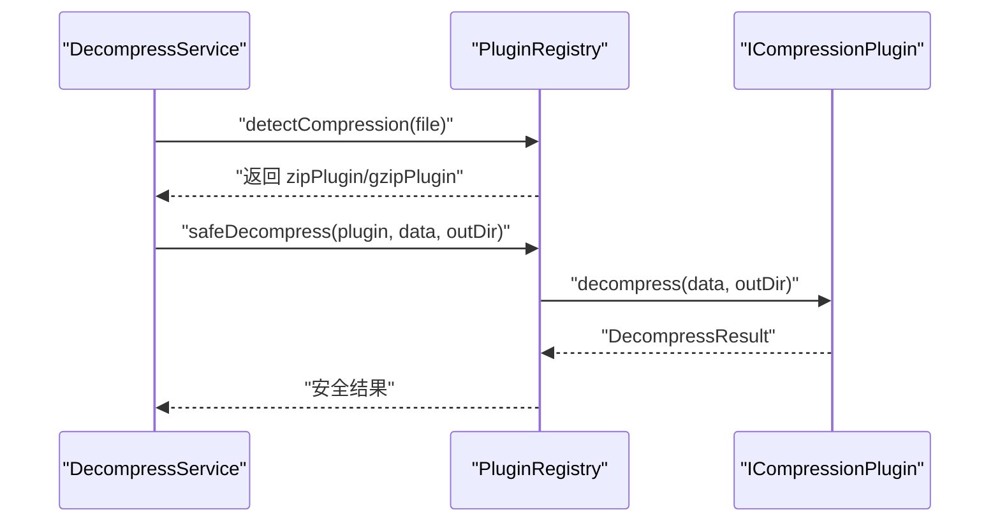
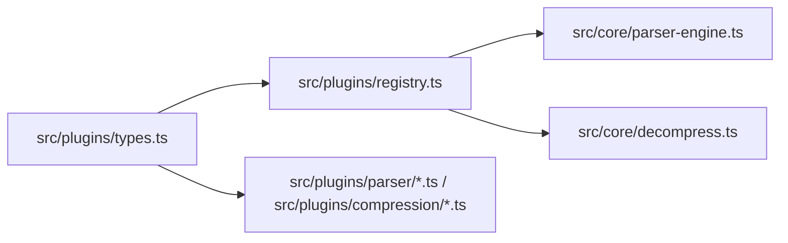

# 插件接口设计

<cite>
**本文引用的文件**
- [src/plugins/types.ts](file://src/plugins/types.ts)
- [src/plugins/registry.ts](file://src/plugins/registry.ts)
- [src/core/parser-engine.ts](file://src/core/parser-engine.ts)
- [src/core/decompress.ts](file://src/core/decompress.ts)
- [src/plugins/compression/zip-plugin.ts](file://src/plugins/compression/zip-plugin.ts)
- [src/plugins/compression/gzip-plugin.ts](file://src/plugins/compression/gzip-plugin.ts)
- [src/plugins/parser/text-plugin.ts](file://src/plugins/parser/text-plugin.ts)
- [src/plugins/parser/csv-plugin.ts](file://src/plugins/parser/csv-plugin.ts)
- [src/plugins/parser/json-plugin.ts](file://src/plugins/parser/json-plugin.ts)
- [src/plugins/parsers/types.ts](file://src/plugins/parsers/types.ts)
- [src/types/index.ts](file://src/types/index.ts)
- [src/__tests__/plugins/registry.test.ts](file://src/__tests__/plugins/registry.test.ts)
</cite>

## 目录
1. [简介](#简介)
2. [项目结构](#项目结构)
3. [核心组件](#核心组件)
4. [架构总览](#架构总览)
5. [详细组件分析](#详细组件分析)
6. [依赖分析](#依赖分析)
7. [性能考虑](#性能考虑)
8. [故障排查指南](#故障排查指南)
9. [结论](#结论)
10. [附录](#附录)

## 简介
本文件聚焦于 Hello-Tauri 项目的插件接口设计，围绕 IFileParserPlugin 与 ICompressionPlugin 两大核心接口展开，系统阐述：
- 接口方法签名、参数类型与返回值规范
- 插件元数据属性（name、supportedExtensions 等）的作用与约束
- 插件生命周期钩子函数（初始化、解析、解压等）的实现要求
- 完整的使用示例路径，展示如何正确实现文件解析器与压缩处理器
- 错误处理机制与异常安全考虑，确保插件健壮性与稳定性
- 接口版本兼容策略与向后兼容保证

## 项目结构
与插件接口相关的代码主要分布在以下位置：
- 接口定义与公共类型：src/plugins/types.ts、src/types/index.ts
- 插件注册中心与安全执行：src/plugins/registry.ts
- 解析引擎与解压服务：src/core/parser-engine.ts、src/core/decompress.ts
- 内置解析器插件：src/plugins/parser/*.ts
- 内置压缩处理器插件：src/plugins/compression/*.ts
- 测试用例：src/__tests__/plugins/registry.test.ts

图表来源
- [src/plugins/types.ts:16-30](file://src/plugins/types.ts#L16-L30)
- [src/plugins/registry.ts:14-33](file://src/plugins/registry.ts#L14-L33)
- [src/core/parser-engine.ts:5-34](file://src/core/parser-engine.ts#L5-L34)
- [src/core/decompress.ts:5-26](file://src/core/decompress.ts#L5-L26)
- [src/plugins/parser/text-plugin.ts:5-17](file://src/plugins/parser/text-plugin.ts#L5-L17)
- [src/plugins/parser/csv-plugin.ts:5-27](file://src/plugins/parser/csv-plugin.ts#L5-L27)
- [src/plugins/parser/json-plugin.ts:5-18](file://src/plugins/parser/json-plugin.ts#L5-L18)
- [src/plugins/compression/zip-plugin.ts:4-39](file://src/plugins/compression/zip-plugin.ts#L4-L39)
- [src/plugins/compression/gzip-plugin.ts:4-43](file://src/plugins/compression/gzip-plugin.ts#L4-L43)

章节来源
- [src/plugins/types.ts:16-30](file://src/plugins/types.ts#L16-L30)
- [src/plugins/registry.ts:14-33](file://src/plugins/registry.ts#L14-L33)
- [src/core/parser-engine.ts:5-34](file://src/core/parser-engine.ts#L5-L34)
- [src/core/decompress.ts:5-26](file://src/core/decompress.ts#L5-L26)

## 核心组件
本节深入解释两大插件接口的核心定义与使用要点。

- IFileParserPlugin（文件解析器插件）
  - name: string
    - 作用：插件唯一标识，用于注册表索引与启用/禁用控制
    - 约束：全局唯一；建议采用小写英文字母与数字组合
  - supportedExtensions: string[]
    - 作用：声明该解析器支持的文件扩展名集合（如 .txt, .csv, .json）
    - 约束：以点号开头的小写扩展名；避免重复或冲突
  - canParse(file: FileEntry): boolean
    - 作用：基于文件名进行快速匹配判定，决定是否由该插件处理
    - 输入：FileEntry（包含 name/path/size/isDirectory）
    - 输出：布尔值
  - parse(data: Uint8Array, options?: Record<string, any>): Promise<ParsedResult>
    - 作用：将二进制数据解析为结构化内容
    - 输入：Uint8Array 原始字节；可选配置对象
    - 输出：ParsedResult（type/data/lineCount）
  - getComponent(): Component
    - 作用：返回用于渲染解析结果的 Vue 组件
  - getConfigSchema?(): ConfigSchema
    - 作用：可选，提供 UI 配置表单的字段描述，驱动动态配置界面

- ICompressionPlugin（压缩处理器插件）
  - name: string
    - 作用：插件唯一标识
  - supportedExtensions: string[]
    - 作用：声明支持的压缩格式扩展名（如 .zip, .gz, .gzip, .tgz）
  - canHandle(file: FileEntry): boolean
    - 作用：基于文件名判断是否由该压缩插件处理
  - decompress(data: Uint8Array, outputDir: string): Promise<DecompressResult>
    - 作用：将压缩数据解压到指定目录并返回结果
    - 输入：Uint8Array 压缩数据；目标目录字符串
    - 输出：DecompressResult（success/files/error）

- ParsedResult 与 DecompressResult
  - ParsedResult
    - type: 'text' | 'csv' | 'json' | 'hex' | 'log'
    - data: any（具体数据结构由解析器决定）
    - lineCount?: number（可选行数统计）
  - DecompressResult
    - success: boolean
    - files: FileEntry[]（解压后的文件清单）
    - error?: string（失败原因）

章节来源
- [src/plugins/types.ts:16-36](file://src/plugins/types.ts#L16-L36)
- [src/types/index.ts:1-13](file://src/types/index.ts#L1-L13)

## 架构总览
下图展示了从“文件读取”到“插件解析/解压”的关键调用链，以及注册中心的安全沙箱能力。

图表来源
- [src/core/parser-engine.ts:11-33](file://src/core/parser-engine.ts#L11-L33)
- [src/core/decompress.ts:11-25](file://src/core/decompress.ts#L11-L25)
- [src/plugins/registry.ts:98-116](file://src/plugins/registry.ts#L98-L116)

## 详细组件分析

### 接口定义与类型契约
- IFileParserPlugin 与 ICompressionPlugin 在 src/plugins/types.ts 中统一定义，作为所有插件必须遵循的契约。
- 公共类型 FileEntry、DecompressResult、ParsedContent 等在 src/types/index.ts 中集中管理，确保跨模块一致性。

图表来源
- [src/plugins/types.ts:16-36](file://src/plugins/types.ts#L16-L36)
- [src/plugins/registry.ts:14-33](file://src/plugins/registry.ts#L14-L33)
- [src/plugins/parser/text-plugin.ts:5-17](file://src/plugins/parser/text-plugin.ts#L5-L17)
- [src/plugins/parser/csv-plugin.ts:5-27](file://src/plugins/parser/csv-plugin.ts#L5-L27)
- [src/plugins/parser/json-plugin.ts:5-18](file://src/plugins/parser/json-plugin.ts#L5-L18)
- [src/plugins/compression/zip-plugin.ts:4-39](file://src/plugins/compression/zip-plugin.ts#L4-L39)
- [src/plugins/compression/gzip-plugin.ts:4-43](file://src/plugins/compression/gzip-plugin.ts#L4-L43)

章节来源
- [src/plugins/types.ts:16-36](file://src/plugins/types.ts#L16-L36)
- [src/plugins/registry.ts:14-33](file://src/plugins/registry.ts#L14-L33)

### 插件注册中心与安全执行
- 注册与发现
  - registerParser/registerCompression：按 name 与 supportedExtensions 建立映射
  - getParser/getCompression/detect/detectCompression：通过扩展名或文件名快速定位插件
- 安全沙箱
  - safeParse：对 parse 调用增加超时保护与异常捕获，失败时回退为十六进制查看器
  - safeDecompress：对 decompress 调用增加超时保护与异常捕获，失败时返回标准错误结构

图表来源
- [src/plugins/registry.ts:98-116](file://src/plugins/registry.ts#L98-L116)

章节来源
- [src/plugins/registry.ts:98-116](file://src/plugins/registry.ts#L98-L116)

### 解析器插件实现示例
- text-plugin
  - 支持常见文本扩展名
  - canParse 基于扩展名匹配
  - parse 调用底层解析器并返回 ParsedResult
  - getComponent 返回文本渲染组件
- csv-plugin
  - 支持 .csv/.tsv
  - parse 支持 options.delimiter 自定义分隔符
  - getConfigSchema 提供 UI 配置项（分隔符、固定表头等）
- json-plugin
  - 支持 .json/.jsonl
  - parse 将二进制解码为文本后交由 JSON 解析器处理

图表来源
- [src/core/parser-engine.ts:11-33](file://src/core/parser-engine.ts#L11-L33)
- [src/plugins/parser/csv-plugin.ts:5-27](file://src/plugins/parser/csv-plugin.ts#L5-L27)
- [src/plugins/parser/text-plugin.ts:5-17](file://src/plugins/parser/text-plugin.ts#L5-L17)
- [src/plugins/parser/json-plugin.ts:5-18](file://src/plugins/parser/json-plugin.ts#L5-L18)

章节来源
- [src/plugins/parser/text-plugin.ts:5-17](file://src/plugins/parser/text-plugin.ts#L5-L17)
- [src/plugins/parser/csv-plugin.ts:5-27](file://src/plugins/parser/csv-plugin.ts#L5-L27)
- [src/plugins/parser/json-plugin.ts:5-18](file://src/plugins/parser/json-plugin.ts#L5-L18)

### 压缩处理器插件实现示例
- zip-plugin
  - 支持 .zip
  - 在 Tauri 平台通过适配器调用原生解压；Web 环境尝试 fflate 解压
  - 返回 DecompressResult，包含文件清单与错误信息
- gzip-plugin
  - 支持 .gz/.gzip/.tgz
  - 在 Tauri 平台通过适配器解压；Web 环境尝试 DecompressionStream
  - 返回 DecompressResult

图表来源
- [src/core/decompress.ts:11-25](file://src/core/decompress.ts#L11-L25)
- [src/plugins/compression/zip-plugin.ts:4-39](file://src/plugins/compression/zip-plugin.ts#L4-L39)
- [src/plugins/compression/gzip-plugin.ts:4-43](file://src/plugins/compression/gzip-plugin.ts#L4-L43)

章节来源
- [src/plugins/compression/zip-plugin.ts:4-39](file://src/plugins/compression/zip-plugin.ts#L4-L39)
- [src/plugins/compression/gzip-plugin.ts:4-43](file://src/plugins/compression/gzip-plugin.ts#L4-L43)

### 日志解析专用类型
- LogLine 与 LogLevel 用于结构化日志行解析与渲染，便于统一处理不同来源的日志数据。

章节来源
- [src/plugins/parsers/types.ts:1-11](file://src/plugins/parsers/types.ts#L1-L11)

## 依赖分析
- 接口层（types.ts）被注册中心与所有插件实现引用，形成稳定的契约边界
- 注册中心（registry.ts）聚合解析器与压缩处理器，并提供安全执行封装
- 核心服务（parser-engine.ts、decompress.ts）通过注册中心选择并调用插件
- 具体插件（parser/*、compression/*）仅依赖接口与公共类型，保持低耦合

图表来源
- [src/plugins/types.ts:16-36](file://src/plugins/types.ts#L16-L36)
- [src/plugins/registry.ts:14-33](file://src/plugins/registry.ts#L14-L33)
- [src/core/parser-engine.ts:5-34](file://src/core/parser-engine.ts#L5-L34)
- [src/core/decompress.ts:5-26](file://src/core/decompress.ts#L5-L26)

章节来源
- [src/plugins/types.ts:16-36](file://src/plugins/types.ts#L16-L36)
- [src/plugins/registry.ts:14-33](file://src/plugins/registry.ts#L14-L33)
- [src/core/parser-engine.ts:5-34](file://src/core/parser-engine.ts#L5-L34)
- [src/core/decompress.ts:5-26](file://src/core/decompress.ts#L5-L26)

## 性能考虑
- 超时保护：safeParse/safeDecompress 使用 Promise.race 限制插件执行时间，防止长时间阻塞
- 快速匹配：canParse/canHandle 基于扩展名快速筛选，减少不必要的解析/解压开销
- 回退策略：解析失败自动回退至十六进制查看器，保障用户体验
- 平台适配：压缩插件在 Tauri 与 Web 环境下分别走最优路径（原生适配器或浏览器 API），提升效率

[本节为通用指导，不直接分析具体文件]

## 故障排查指南
- 常见问题
  - 插件未生效：检查 supportedExtensions 是否正确、插件是否已注册、是否被禁用
  - 解析失败：确认 parse 返回的 ParsedResult.type 是否为受支持类型；检查 options 传递是否正确
  - 解压失败：查看 DecompressResult.error 字段；确认输出目录权限与平台适配逻辑
- 调试建议
  - 使用 registry.safeParse/safeDecompress 的测试结果验证异常回退行为
  - 在 canParse/canHandle 中加入日志，确认匹配逻辑是否符合预期
  - 针对大文件场景，关注超时阈值与内存占用

章节来源
- [src/__tests__/plugins/registry.test.ts:71-97](file://src/__tests__/plugins/registry.test.ts#L71-L97)
- [src/plugins/registry.ts:98-116](file://src/plugins/registry.ts#L98-L116)

## 结论
IFileParserPlugin 与 ICompressionPlugin 构成了 Hello-Tauri 可扩展的核心。通过统一的接口契约、注册中心的沙箱化执行与完善的错误回退策略，系统在保持灵活性的同时确保了健壮性与稳定性。建议在新增插件时严格遵循接口约定，完善 canParse/canHandle 的快速匹配逻辑，并在必要时提供 getConfigSchema 以提升可配置性。

[本节为总结性内容，不直接分析具体文件]

## 附录
- 接口版本兼容策略与向后兼容保证
  - 新增可选方法（如 getConfigSchema）不影响已有插件运行
  - 扩展 ParsedResult/DecompressResult 字段时保持旧字段稳定，避免破坏现有渲染与业务逻辑
  - 变更 supportedExtensions 时注意命名一致性与去重，避免冲突
  - 若需引入 breaking change，应通过版本号与迁移文档引导升级，并提供兼容层过渡

[本节为通用指导，不直接分析具体文件]