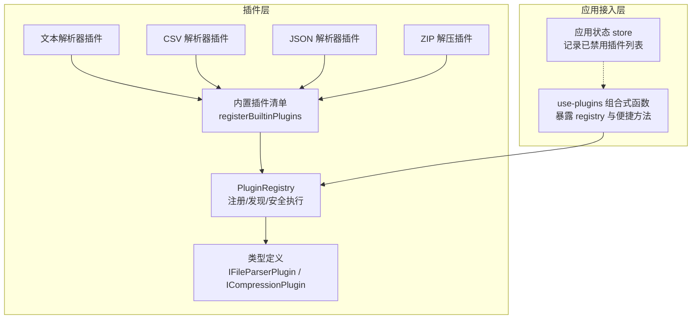
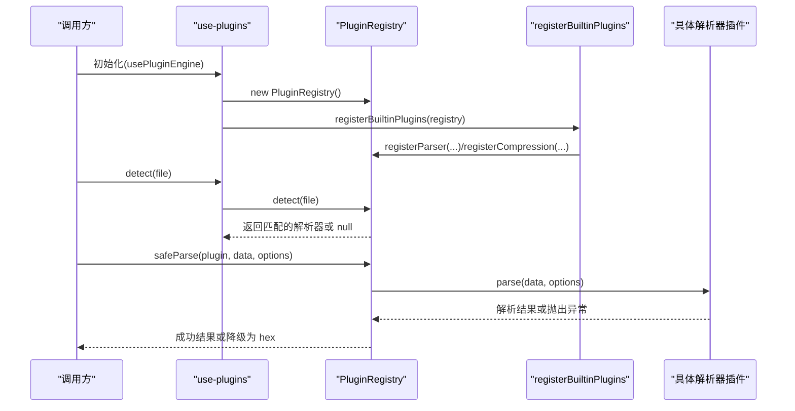
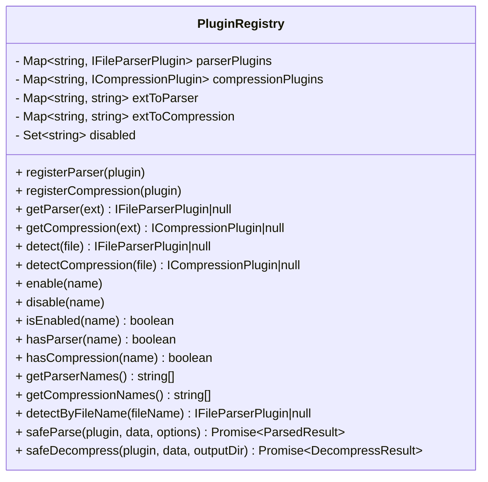
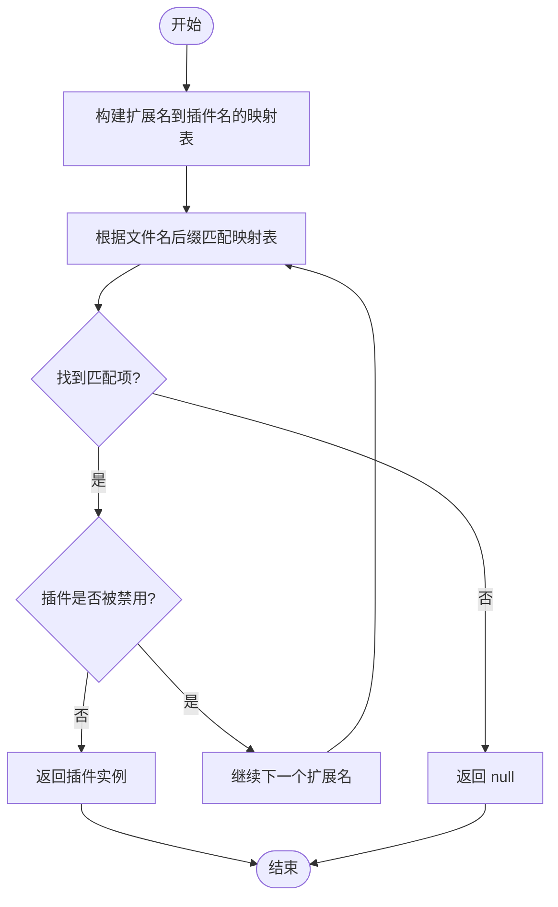
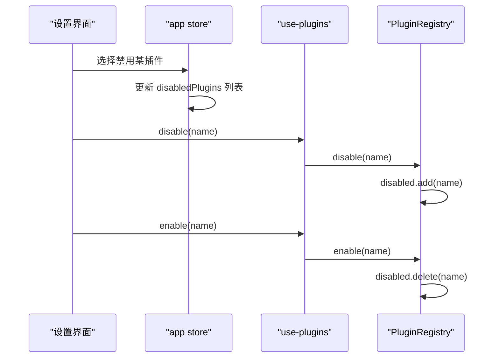
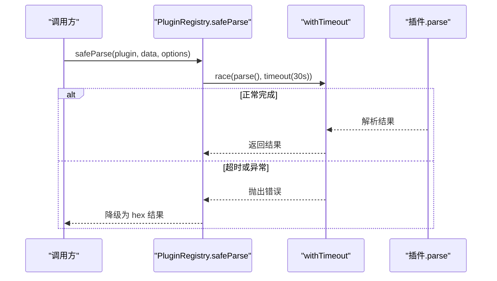
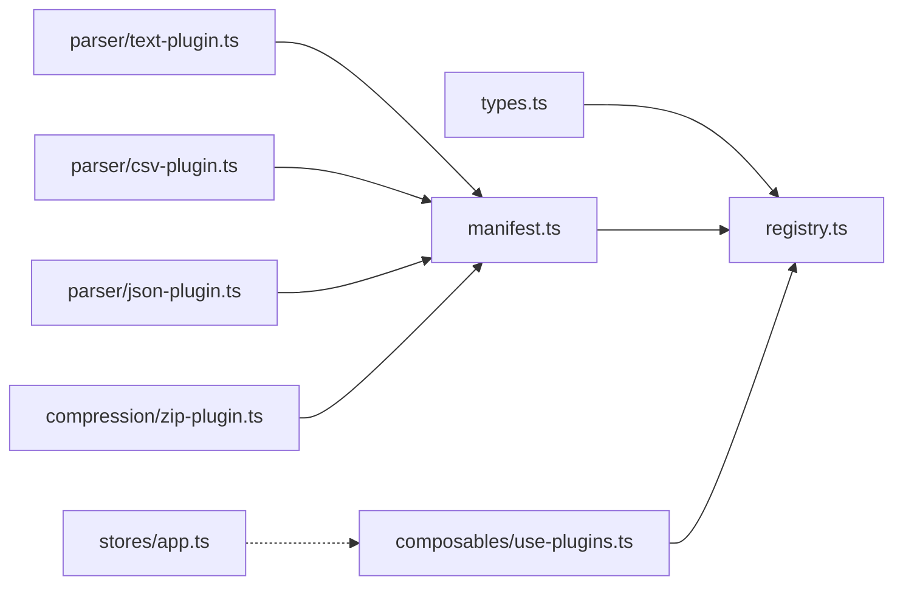

# 插件注册中心

<cite>
**本文引用的文件**
- [src/plugins/registry.ts](file://src/plugins/registry.ts)
- [src/plugins/types.ts](file://src/plugins/types.ts)
- [src/composables/use-plugins.ts](file://src/composables/use-plugins.ts)
- [src/plugins/manifest.ts](file://src/plugins/manifest.ts)
- [src/plugins/parser/text-plugin.ts](file://src/plugins/parser/text-plugin.ts)
- [src/plugins/parser/csv-plugin.ts](file://src/plugins/parser/csv-plugin.ts)
- [src/plugins/parser/json-plugin.ts](file://src/plugins/parser/json-plugin.ts)
- [src/plugins/compression/zip-plugin.ts](file://src/plugins/compression/zip-plugin.ts)
- [src/stores/app.ts](file://src/stores/app.ts)
</cite>

## 目录
1. [简介](#简介)
2. [项目结构](#项目结构)
3. [核心组件](#核心组件)
4. [架构总览](#架构总览)
5. [详细组件分析](#详细组件分析)
6. [依赖关系分析](#依赖关系分析)
7. [性能与资源限制](#性能与资源限制)
8. [故障排查指南](#故障排查指南)
9. [结论](#结论)
10. [附录：最佳实践](#附录最佳实践)

## 简介
本文件聚焦于 Hello-Tauri 项目的“插件注册中心”，围绕 PluginRegistry 类展开，系统阐述其插件发现机制、动态注册与自动检测算法；解析扩展名到插件名称的映射表设计与维护策略；说明插件启用/禁用机制及运行时状态管理；深入解释超时保护 withTimeout 的实现原理与错误降级策略；并提供插件注册的最佳实践（命名约定、依赖管理与冲突解决）以及性能监控与资源限制的落地建议。

## 项目结构
与插件注册中心直接相关的代码主要位于 src/plugins 与 src/composables 下，配合 manifest 集中注册内置插件，use-plugins 提供全局单例访问入口。

图表来源
- [src/plugins/registry.ts:14-118](file://src/plugins/registry.ts#L14-L118)
- [src/plugins/types.ts:16-36](file://src/plugins/types.ts#L16-L36)
- [src/plugins/manifest.ts:10-19](file://src/plugins/manifest.ts#L10-L19)
- [src/composables/use-plugins.ts:1-16](file://src/composables/use-plugins.ts#L1-L16)
- [src/plugins/parser/text-plugin.ts:5-17](file://src/plugins/parser/text-plugin.ts#L5-L17)
- [src/plugins/parser/csv-plugin.ts:5-27](file://src/plugins/parser/csv-plugin.ts#L5-L27)
- [src/plugins/parser/json-plugin.ts:5-18](file://src/plugins/parser/json-plugin.ts#L5-L18)
- [src/plugins/compression/zip-plugin.ts:4-39](file://src/plugins/compression/zip-plugin.ts#L4-L39)

章节来源
- [src/plugins/registry.ts:14-118](file://src/plugins/registry.ts#L14-L118)
- [src/plugins/types.ts:16-36](file://src/plugins/types.ts#L16-L36)
- [src/plugins/manifest.ts:10-19](file://src/plugins/manifest.ts#L10-L19)
- [src/composables/use-plugins.ts:1-16](file://src/composables/use-plugins.ts#L1-L16)

## 核心组件
- PluginRegistry：负责插件的动态注册、按扩展名的快速查找、文件名自动检测、启用/禁用控制、以及带超时的安全执行包装。
- 类型体系：统一了解析器与压缩器的能力契约，包括 name、supportedExtensions、canParse/canHandle、parse/decompress、渲染组件获取等。
- use-plugins：在模块初始化时创建唯一实例并注册所有内置插件，对外暴露 registry 与常用操作。
- manifest：集中导入并注册内置插件，避免分散注册导致遗漏或重复。

章节来源
- [src/plugins/registry.ts:14-118](file://src/plugins/registry.ts#L14-L118)
- [src/plugins/types.ts:16-36](file://src/plugins/types.ts#L16-L36)
- [src/composables/use-plugins.ts:1-16](file://src/composables/use-plugins.ts#L1-L16)
- [src/plugins/manifest.ts:10-19](file://src/plugins/manifest.ts#L10-L19)

## 架构总览
从调用方视角，use-plugins 提供统一的入口；内部通过 manifest 完成内置插件的一次性注册；业务侧通过 registry 进行插件发现与安全执行。

图表来源
- [src/composables/use-plugins.ts:4-15](file://src/composables/use-plugins.ts#L4-L15)
- [src/plugins/manifest.ts:10-19](file://src/plugins/manifest.ts#L10-L19)
- [src/plugins/registry.ts:47-104](file://src/plugins/registry.ts#L47-L104)

## 详细组件分析

### PluginRegistry 类
- 数据结构
  - parserPlugins：以插件名为键的解析器集合。
  - compressionPlugins：以插件名为键的压缩器集合。
  - extToParser：扩展名到解析器插件名的映射表。
  - extToCompression：扩展名到压缩器插件名的映射表。
  - disabled：当前被禁用的插件名集合。
- 关键能力
  - 动态注册：registerParser/registerCompression 将插件及其支持的扩展名写入映射表。
  - 快速查找：getParser/getCompression 基于扩展名 O(1) 定位插件，同时检查是否被禁用。
  - 自动检测：detect/detectCompression 遍历映射表，按文件名后缀匹配首个可用插件。
  - 启用/禁用：enable/disable/isEnabled 维护运行期开关。
  - 安全执行：safeParse/safeDecompress 使用 withTimeout 包裹异步任务，失败时执行降级策略。

图表来源
- [src/plugins/registry.ts:14-118](file://src/plugins/registry.ts#L14-L118)

章节来源
- [src/plugins/registry.ts:14-118](file://src/plugins/registry.ts#L14-L118)

### 插件发现与自动检测算法
- 扩展名到插件名的映射表维护
  - 注册时，将每个 supportedExtensions 中的扩展名指向对应插件名，形成 O(1) 查询索引。
  - 若同一扩展名被多次注册，后注册的会覆盖先前的映射，体现“最后注册优先”的冲突解决策略。
- 自动检测流程
  - detect/detectCompression 遍历映射表，对每个扩展名判断文件名是否以该扩展名结尾，且插件未被禁用，命中即返回对应插件。
  - 未命中则返回空，表示无可用解析器/压缩器。

图表来源
- [src/plugins/registry.ts:21-33](file://src/plugins/registry.ts#L21-L33)
- [src/plugins/registry.ts:47-63](file://src/plugins/registry.ts#L47-L63)

章节来源
- [src/plugins/registry.ts:21-33](file://src/plugins/registry.ts#L21-L33)
- [src/plugins/registry.ts:47-63](file://src/plugins/registry.ts#L47-L63)

### 插件映射表设计
- 设计要点
  - 两张独立映射表分别服务于解析器与压缩器，避免跨域污染。
  - 键为扩展名（含点号前缀），值为插件名，便于后续按名称检索完整插件对象。
- 维护策略
  - 注册阶段批量写入，保证一致性。
  - 冲突处理：同扩展名多次注册时，后者覆盖前者，实现“显式覆盖”的优先级语义。
  - 禁用隔离：即使映射存在，若插件处于禁用状态，查询接口也会返回空，确保运行时开关生效。

章节来源
- [src/plugins/registry.ts:14-45](file://src/plugins/registry.ts#L14-L45)

### 插件启用/禁用机制与运行时状态
- 运行时开关
  - disabled 集合保存被禁用的插件名，所有查询与检测路径均会检查该集合。
  - enable/disable 用于切换状态，isEnabled 提供只读查询。
- 与界面状态的协同
  - 应用层 store 可持久化用户选择的禁用列表，并在初始化时同步至 registry，保证重启后行为一致。

图表来源
- [src/plugins/registry.ts:65-75](file://src/plugins/registry.ts#L65-L75)
- [src/stores/app.ts:30-42](file://src/stores/app.ts#L30-L42)
- [src/composables/use-plugins.ts:12-15](file://src/composables/use-plugins.ts#L12-L15)

章节来源
- [src/plugins/registry.ts:65-75](file://src/plugins/registry.ts#L65-L75)
- [src/stores/app.ts:30-42](file://src/stores/app.ts#L30-L42)
- [src/composables/use-plugins.ts:12-15](file://src/composables/use-plugins.ts#L12-L15)

### 超时保护 withTimeout 与错误降级
- 实现原理
  - withTimeout 使用 Promise.race 竞争原始 promise 与一个定时器 reject，达到超时即中断的效果。
  - 原始 promise 完成后通过 finally 清理定时器，避免泄漏。
- 安全执行
  - safeParse：捕获异常或超时，降级为 hex 类型结果，保证 UI 仍可展示二进制内容。
  - safeDecompress：捕获异常或超时，返回结构化错误信息，包含 success=false 与 error 描述。
- 超时阈值
  - 默认 30 秒，可通过常量调整。

图表来源
- [src/plugins/registry.ts:6-12](file://src/plugins/registry.ts#L6-L12)
- [src/plugins/registry.ts:98-116](file://src/plugins/registry.ts#L98-L116)

章节来源
- [src/plugins/registry.ts:6-12](file://src/plugins/registry.ts#L6-L12)
- [src/plugins/registry.ts:98-116](file://src/plugins/registry.ts#L98-L116)

### 内置插件示例与扩展方式
- 文本解析器：声明支持多种文本扩展名，提供渲染组件与解析逻辑。
- CSV 解析器：支持分隔符配置，提供配置 Schema 以便 UI 生成表单。
- JSON 解析器：支持标准 JSON 与 JSONL。
- ZIP 解压器：在 Tauri 平台走原生适配器，浏览器环境回退到内存存储。

章节来源
- [src/plugins/parser/text-plugin.ts:5-17](file://src/plugins/parser/text-plugin.ts#L5-L17)
- [src/plugins/parser/csv-plugin.ts:5-27](file://src/plugins/parser/csv-plugin.ts#L5-L27)
- [src/plugins/parser/json-plugin.ts:5-18](file://src/plugins/parser/json-plugin.ts#L5-L18)
- [src/plugins/compression/zip-plugin.ts:4-39](file://src/plugins/compression/zip-plugin.ts#L4-L39)
- [src/plugins/manifest.ts:10-19](file://src/plugins/manifest.ts#L10-L19)

## 依赖关系分析
- 低耦合高内聚
  - 插件仅依赖类型契约，不感知注册中心细节。
  - 注册中心仅依赖类型与基础数据结构，保持职责单一。
- 外部集成点
  - 平台适配：压缩器在 Tauri 环境下通过适配器调用底层能力。
  - 渲染组件：解析器返回 Vue 组件引用，供视图层渲染。

图表来源
- [src/plugins/types.ts:16-36](file://src/plugins/types.ts#L16-L36)
- [src/plugins/registry.ts:14-118](file://src/plugins/registry.ts#L14-L118)
- [src/plugins/manifest.ts:10-19](file://src/plugins/manifest.ts#L10-L19)
- [src/composables/use-plugins.ts:1-16](file://src/composables/use-plugins.ts#L1-L16)
- [src/stores/app.ts:30-42](file://src/stores/app.ts#L30-L42)

章节来源
- [src/plugins/types.ts:16-36](file://src/plugins/types.ts#L16-L36)
- [src/plugins/registry.ts:14-118](file://src/plugins/registry.ts#L14-L118)
- [src/plugins/manifest.ts:10-19](file://src/plugins/manifest.ts#L10-L19)
- [src/composables/use-plugins.ts:1-16](file://src/composables/use-plugins.ts#L1-L16)
- [src/stores/app.ts:30-42](file://src/stores/app.ts#L30-L42)

## 性能与资源限制
- 时间复杂度
  - 注册：O(E)，E 为插件支持的扩展名总数。
  - 查找：O(1) 基于扩展名映射；检测：O(M)，M 为映射表条目数。
- 空间复杂度
  - 线性于插件数量与扩展名总数。
- 超时与降级
  - 30 秒超时防止阻塞主线程；解析失败回退为 hex，保障可用性。
- 资源限制建议
  - 在插件层增加输入大小校验与内存上限检查。
  - 对大文件采用流式解析或分块处理，避免一次性加载。
  - 为不同插件设置差异化超时与并发上限，避免热点插件拖垮整体。
- 监控指标建议
  - 记录每次解析/解压的成功率、耗时分布、超时次数。
  - 统计各插件的调用频次与错误码，辅助容量规划与问题定位。

[本节为通用性能指导，不直接分析具体文件]

## 故障排查指南
- 插件无法被发现
  - 检查扩展名是否正确注册，是否存在同名覆盖。
  - 确认插件未被禁用（disabled 集合）。
- 解析/解压卡死
  - 观察是否触发 30 秒超时；必要时提升超时阈值或优化插件实现。
- 解析失败回退为 hex
  - 查看插件抛出的错误信息；确认输入数据格式是否符合预期。
- 平台差异导致的解压失败
  - 在浏览器环境确认依赖库可用；在 Tauri 环境确认适配器正确注入。

章节来源
- [src/plugins/registry.ts:47-63](file://src/plugins/registry.ts#L47-L63)
- [src/plugins/registry.ts:98-116](file://src/plugins/registry.ts#L98-L116)
- [src/plugins/compression/zip-plugin.ts:10-39](file://src/plugins/compression/zip-plugin.ts#L10-L39)

## 结论
PluginRegistry 以简洁的数据结构与清晰的 API 实现了插件的动态注册、快速发现与受控执行。通过扩展名映射表与禁用集合的配合，系统在灵活性与可控性之间取得平衡；withTimeout 与降级策略提升了鲁棒性。结合 store 的状态管理能力，可实现用户可见的插件启停体验。建议在插件实现中遵循命名与依赖规范，完善错误上报与性能监控，持续优化用户体验与系统稳定性。

[本节为总结性内容，不直接分析具体文件]

## 附录：最佳实践
- 命名约定
  - 插件名应简短、唯一、语义清晰，避免与内置插件冲突。
  - 扩展名需标准化，避免歧义（如 .log 与 .txt 的区分）。
- 依赖管理
  - 尽量按需引入重型依赖，减少首屏体积。
  - 在 Tauri 与浏览器环境分别给出兼容实现。
- 冲突解决
  - 明确“最后注册优先”的覆盖规则，并在文档中告知使用者。
  - 对于多扩展名重叠场景，可在插件层面提供更细粒度的 canParse/canHandle 判定。
- 权限控制
  - 在应用层维护禁用列表，并在启动时同步至 registry。
  - 对敏感插件可增加白名单机制，限制动态加载范围。
- 性能与资源
  - 为不同插件设定合理的超时与并发上限。
  - 对大文件采用分块/流式处理，避免内存峰值过高。
  - 埋点采集关键指标，建立告警与回溯链路。

[本节为通用指导，不直接分析具体文件]