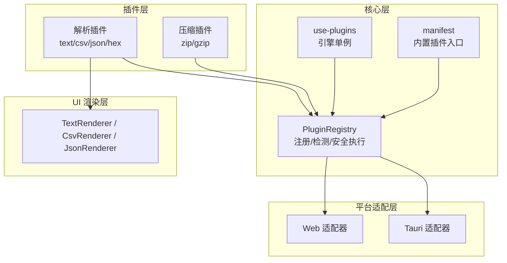
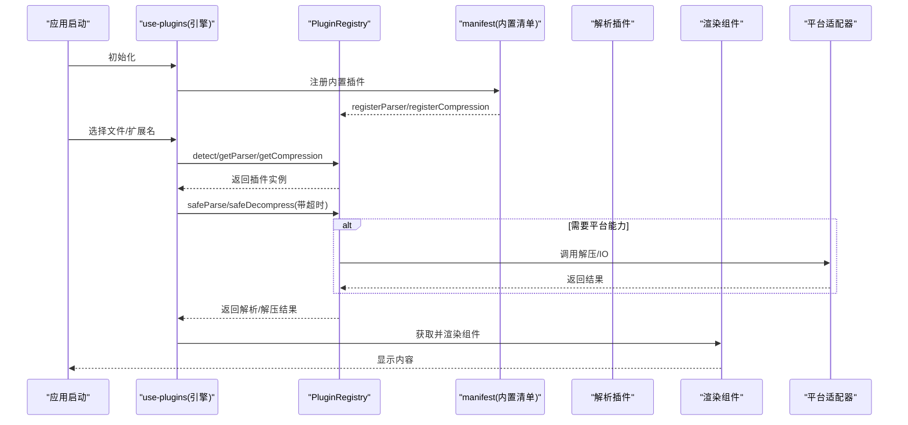
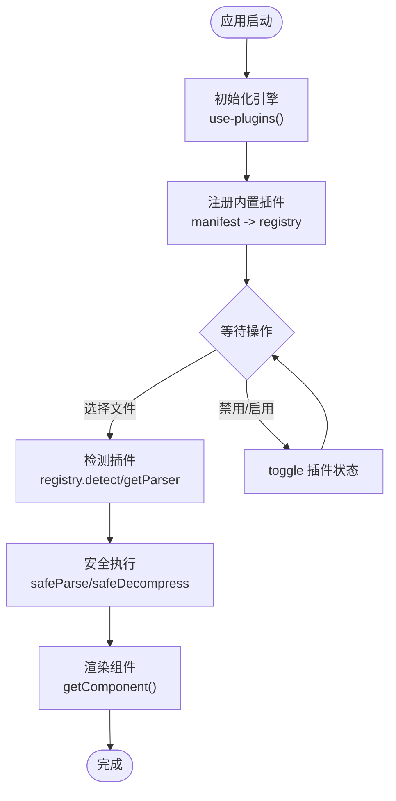
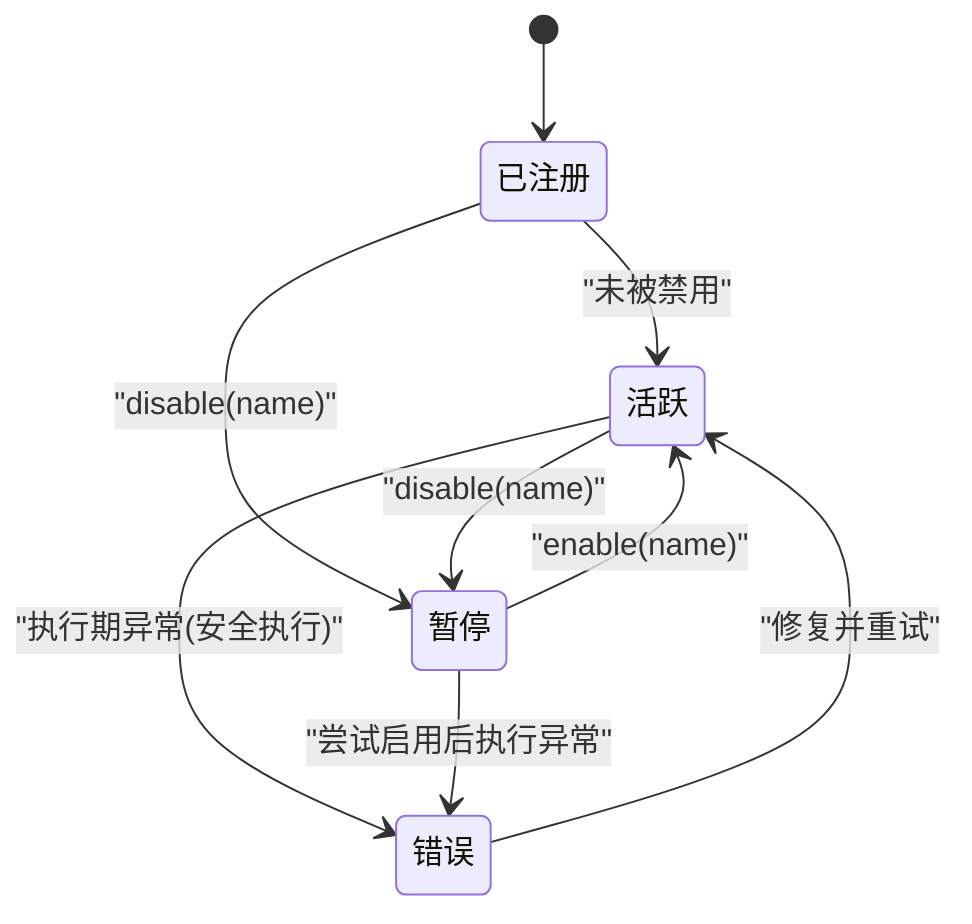
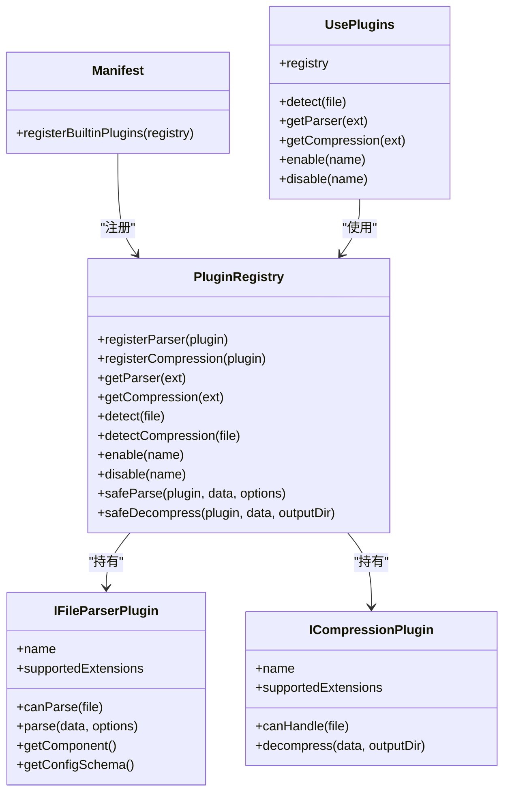
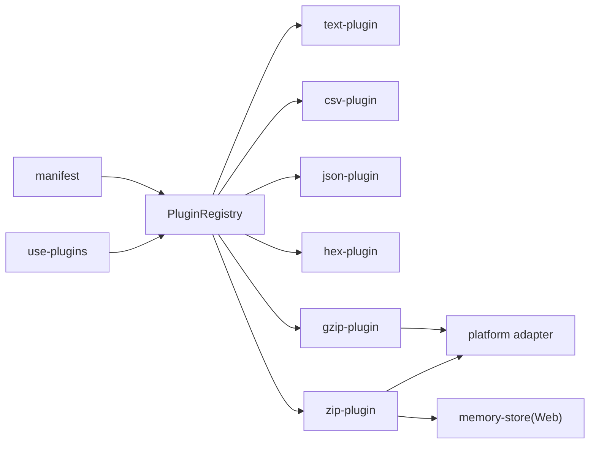

# 插件生命周期管理

<cite>
**本文引用的文件**
- [src/plugins/registry.ts](file://src/plugins/registry.ts)
- [src/plugins/types.ts](file://src/plugins/types.ts)
- [src/composables/use-plugins.ts](file://src/composables/use-plugins.ts)
- [src/plugins/manifest.ts](file://src/plugins/manifest.ts)
- [src/plugins/parser/text-plugin.ts](file://src/plugins/parser/text-plugin.ts)
- [src/plugins/parser/csv-plugin.ts](file://src/plugins/parser/csv-plugin.ts)
- [src/plugins/parser/json-plugin.ts](file://src/plugins/parser/json-plugin.ts)
- [src/plugins/parser/hex-plugin.ts](file://src/plugins/parser/hex-plugin.ts)
- [src/plugins/compression/zip-plugin.ts](file://src/plugins/compression/zip-plugin.ts)
- [src/plugins/compression/gzip-plugin.ts](file://src/plugins/compression/gzip-plugin.ts)
- [src/stores/app.ts](file://src/stores/app.ts)
- [src/adapters/tauri-adapter.ts](file://src/adapters/tauri-adapter.ts)
- [src/adapters/web-adapter.ts](file://src/adapters/web-adapter.ts)
- [src/adapters/types.ts](file://src/adapters/types.ts)
- [src/core/memory-store.ts](file://src/core/memory-store.ts)
- [src/views/renderers/TextRenderer.vue](file://src/views/renderers/TextRenderer.vue)
- [src/views/renderers/CsvRenderer.vue](file://src/views/renderers/CsvRenderer.vue)
- [src/views/renderers/JsonRenderer.vue](file://src/views/renderers/JsonRenderer.vue)
</cite>

## 目录
1. [简介](#简介)
2. [项目结构](#项目结构)
3. [核心组件](#核心组件)
4. [架构总览](#架构总览)
5. [详细组件分析](#详细组件分析)
6. [依赖分析](#依赖分析)
7. [性能考虑](#性能考虑)
8. [故障排查指南](#故障排查指南)
9. [结论](#结论)
10. [附录](#附录)

## 简介
本文件围绕 Hello-Tauri 的插件系统，系统化阐述插件从加载到卸载的完整生命周期、状态管理机制、依赖注入与解析、插件间通信机制、调试与日志最佳实践，以及热重载与动态更新的技术实现路径。文档以代码级事实为依据，结合可视化图示帮助读者快速理解并落地扩展。

## 项目结构
本项目采用“微内核 + 插件”的前端架构：
- 插件接口定义位于 types.ts，统一约束解析器与压缩器插件的能力边界。
- 注册中心 PluginRegistry 负责插件发现、匹配、启用/禁用、安全执行（超时与错误回退）。
- Composable use-plugins 暴露单例引擎，供业务层调用。
- manifest 集中注册内置插件，便于按需扩展。
- 具体插件按 parser 与 compression 分类组织，渲染组件通过 getComponent 返回。
- 平台适配层 adapters 提供 Tauri 与 Web 双端能力差异的统一抽象。

图表来源
- [src/plugins/registry.ts:14-118](file://src/plugins/registry.ts#L14-L118)
- [src/composables/use-plugins.ts:1-17](file://src/composables/use-plugins.ts#L1-L17)
- [src/plugins/manifest.ts:1-20](file://src/plugins/manifest.ts#L1-L20)
- [src/adapters/tauri-adapter.ts](file://src/adapters/tauri-adapter.ts)
- [src/adapters/web-adapter.ts](file://src/adapters/web-adapter.ts)
- [src/plugins/parser/text-plugin.ts:1-18](file://src/plugins/parser/text-plugin.ts#L1-L18)
- [src/plugins/parser/csv-plugin.ts:1-28](file://src/plugins/parser/csv-plugin.ts#L1-L28)
- [src/plugins/parser/json-plugin.ts:1-19](file://src/plugins/parser/json-plugin.ts#L1-L19)
- [src/plugins/parser/hex-plugin.ts:1-53](file://src/plugins/parser/hex-plugin.ts#L1-L53)
- [src/plugins/compression/zip-plugin.ts:1-40](file://src/plugins/compression/zip-plugin.ts#L1-L40)
- [src/plugins/compression/gzip-plugin.ts:1-44](file://src/plugins/compression/gzip-plugin.ts#L1-L44)

章节来源
- [src/plugins/types.ts:1-37](file://src/plugins/types.ts#L1-L37)
- [src/plugins/registry.ts:1-118](file://src/plugins/registry.ts#L1-L118)
- [src/composables/use-plugins.ts:1-17](file://src/composables/use-plugins.ts#L1-L17)
- [src/plugins/manifest.ts:1-20](file://src/plugins/manifest.ts#L1-L20)

## 核心组件
- 插件接口与类型
  - IFileParserPlugin：声明名称、支持扩展名、匹配规则、解析方法、渲染组件与可选配置模式。
  - ICompressionPlugin：声明名称、支持扩展名、匹配规则、解压方法与结果模型。
  - ParsedResult：统一解析结果形态，包含类型、数据与行数等元信息。
- 注册中心 PluginRegistry
  - 维护解析器与压缩器映射表、扩展名到插件名的索引、禁用集合。
  - 提供注册、查询、检测、启用/禁用、安全执行（含超时保护）等方法。
- 引擎封装 use-plugins
  - 创建全局唯一 registry 实例，并在模块初始化时注册内置插件。
  - 对外暴露 detect/getParser/getCompression/enable/disable 等便捷 API。
- 内置插件清单 manifest
  - 集中注册 zip/gzip 压缩插件与 text/csv/json/log/hex 解析插件。
- 平台适配层
  - Tauri 适配器通过 IPC 调用 Rust 后端命令；Web 适配器使用浏览器原生或 fflate 等库。
- 内存存储 memory-store
  - 在 Web 端作为临时 VFS 承载解压产物，配合压缩插件写入。

章节来源
- [src/plugins/types.ts:1-37](file://src/plugins/types.ts#L1-L37)
- [src/plugins/registry.ts:14-118](file://src/plugins/registry.ts#L14-L118)
- [src/composables/use-plugins.ts:1-17](file://src/composables/use-plugins.ts#L1-L17)
- [src/plugins/manifest.ts:1-20](file://src/plugins/manifest.ts#L1-L20)
- [src/adapters/tauri-adapter.ts](file://src/adapters/tauri-adapter.ts)
- [src/adapters/web-adapter.ts](file://src/adapters/web-adapter.ts)
- [src/core/memory-store.ts](file://src/core/memory-store.ts)

## 架构总览
下图展示插件从加载到运行的关键流程，包括注册、检测、解析/解压与安全执行、渲染组件挂载。

图表来源
- [src/composables/use-plugins.ts:1-17](file://src/composables/use-plugins.ts#L1-L17)
- [src/plugins/manifest.ts:1-20](file://src/plugins/manifest.ts#L1-L20)
- [src/plugins/registry.ts:98-116](file://src/plugins/registry.ts#L98-L116)
- [src/plugins/compression/zip-plugin.ts:10-39](file://src/plugins/compression/zip-plugin.ts#L10-L39)
- [src/plugins/compression/gzip-plugin.ts:10-43](file://src/plugins/compression/gzip-plugin.ts#L10-L43)
- [src/adapters/tauri-adapter.ts](file://src/adapters/tauri-adapter.ts)
- [src/adapters/web-adapter.ts](file://src/adapters/web-adapter.ts)

## 详细组件分析

### 插件生命周期管理
- 加载阶段
  - 模块加载：use-plugins 在模块初始化时创建 registry 并调用 registerBuiltinPlugins。
  - 注册阶段：manifest 将内置解析与压缩插件逐一注册至 registry，建立扩展名到插件名的索引。
- 准备阶段
  - 检测阶段：根据文件名或扩展名，registry 通过 extToParser/extToCompression 快速定位候选插件。
  - 启用/禁用：disabled 集合控制插件是否参与检测与调用；store 可持久化用户偏好。
- 运行阶段
  - 解析/解压：registry.safeParse/safeDecompress 包裹插件调用，提供超时保护与异常回退。
  - 渲染：解析插件返回渲染组件，由上层 UI 挂载展示。
- 清理阶段
  - 当前未实现显式销毁钩子；如需资源释放，可在插件内部维护引用并在外部主动清理。
  - 建议未来为 IFileParserPlugin/ICompressionPlugin 增加可选的 destroy/onDispose 钩子。

图表来源
- [src/composables/use-plugins.ts:1-17](file://src/composables/use-plugins.ts#L1-L17)
- [src/plugins/manifest.ts:1-20](file://src/plugins/manifest.ts#L1-L20)
- [src/plugins/registry.ts:47-75](file://src/plugins/registry.ts#L47-L75)
- [src/plugins/registry.ts:98-116](file://src/plugins/registry.ts#L98-L116)

章节来源
- [src/composables/use-plugins.ts:1-17](file://src/composables/use-plugins.ts#L1-L17)
- [src/plugins/manifest.ts:1-20](file://src/plugins/manifest.ts#L1-L20)
- [src/plugins/registry.ts:14-118](file://src/plugins/registry.ts#L14-L118)

### 插件状态管理机制
- 活跃状态
  - 插件被注册且未被禁用，detect/get* 可正常返回。
- 暂停状态
  - 通过 registry.disable(name) 加入禁用集合，后续检测与调用均跳过该插件。
- 错误状态
  - 运行时异常由 safeParse/safeDecompress 捕获，返回降级结果（如 hex 视图或失败对象），不中断主流程。
- 状态转换逻辑
  - 活跃 → 暂停：disable(name)
  - 暂停 → 活跃：enable(name)
  - 活跃/暂停 → 错误：执行期异常被捕获并回退，不影响其他插件。

图表来源
- [src/plugins/registry.ts:65-75](file://src/plugins/registry.ts#L65-L75)
- [src/plugins/registry.ts:98-116](file://src/plugins/registry.ts#L98-L116)

章节来源
- [src/plugins/registry.ts:65-75](file://src/plugins/registry.ts#L65-L75)
- [src/plugins/registry.ts:98-116](file://src/plugins/registry.ts#L98-L116)
- [src/stores/app.ts:30-42](file://src/stores/app.ts#L30-L42)

### 依赖注入系统与依赖解析算法
- 服务提供者模式
  - 每个插件即一个“服务提供者”，通过 name 标识，向 registry 提供能力（解析/解压）与渲染组件。
- 依赖解析算法
  - 扩展名优先：extToParser/extToCompression 将扩展名映射到插件名，O(1) 查找。
  - 文件后缀匹配：detect/detectCompression 遍历索引，按文件名后缀匹配首个可用插件。
  - 禁用过滤：所有查询先检查 disabled 集合，确保被禁用的插件不可用。
- 运行时依赖
  - 压缩插件在 Tauri 平台通过 usePlatform 懒加载适配器，再调用 adapter.decompress；在 Web 平台回退到 fflate 或 DecompressionStream。
  - 解析插件依赖各自 parsers 与渲染组件，遵循接口约定。

图表来源
- [src/plugins/registry.ts:14-118](file://src/plugins/registry.ts#L14-L118)
- [src/plugins/types.ts:16-30](file://src/plugins/types.ts#L16-L30)
- [src/plugins/manifest.ts:10-19](file://src/plugins/manifest.ts#L10-L19)
- [src/composables/use-plugins.ts:7-16](file://src/composables/use-plugins.ts#L7-L16)

章节来源
- [src/plugins/registry.ts:14-118](file://src/plugins/registry.ts#L14-L118)
- [src/plugins/types.ts:16-30](file://src/plugins/types.ts#L16-L30)
- [src/plugins/manifest.ts:10-19](file://src/plugins/manifest.ts#L10-L19)
- [src/composables/use-plugins.ts:7-16](file://src/composables/use-plugins.ts#L7-L16)

### 插件间通信机制
- 事件总线
  - 当前仓库未实现全局事件总线；建议在 registry 中引入轻量事件发射器，用于 plugin-error、plugin-enabled/disabled 等事件广播。
- 消息传递
  - 可通过 registry 暴露 publish/subscribe 接口，插件订阅特定主题进行解耦通信。
- 共享状态管理
  - 使用 Pinia store 管理跨插件共享状态（如禁用列表、主题、面板宽度等），已在 app store 中体现。
  - 对于运行时数据共享，可引入内存存储（memory-store）或基于 URL/hash 的状态同步。

章节来源
- [src/stores/app.ts:12-56](file://src/stores/app.ts#L12-L56)
- [src/core/memory-store.ts](file://src/core/memory-store.ts)

### 调试与日志记录最佳实践
- 错误追踪
  - 利用 safeParse/safeDecompress 的异常捕获，统一上报错误上下文（插件名、输入大小、耗时、堆栈摘要）。
  - 在 UI 层使用 ErrorBoundary 包裹渲染组件，避免崩溃扩散。
- 性能分析
  - 对 parse/decompress 调用计时，统计平均耗时与 P95/P99，识别慢插件。
  - 大文件场景下，优先使用流式处理与分页渲染，减少内存峰值。
- 日志策略
  - 分级日志（debug/info/warn/error），生产环境仅保留 warn/error。
  - 结构化日志（包含插件名、操作、耗时、错误码），便于检索与告警。

[本节为通用指导，不直接分析具体文件]

### 热重载与动态更新
- 开发期热重载
  - 前端基于 Vite + Vue 插件，组件与 composable 变更可即时生效。
  - 插件模块可按需 import，结合 Vite HMR 实现热更新。
- 运行期动态更新
  - 建议实现插件版本管理与增量更新：
    - 注册前校验签名与兼容性。
    - 提供 enable/disable/reload API，支持热切换。
    - 对长任务设置超时与重试，避免阻塞主线程。
- 平台差异
  - Tauri 端可通过 IPC 拉取远端插件包并缓存；Web 端通过 CDN 分发静态资源。

[本节为概念性说明，不直接分析具体文件]

## 依赖分析
- 组件耦合与内聚
  - registry 与插件接口高内聚，低耦合；通过接口约束降低替换成本。
  - manifest 集中注册，便于扩展与维护。
- 直接/间接依赖
  - use-plugins 依赖 registry 与 manifest。
  - 压缩插件依赖 platform adapter（Tauri/Web）与内存存储（Web）。
- 潜在循环依赖
  - 当前未见循环导入；若新增插件反向依赖 registry，需注意避免环。
- 外部依赖与集成点
  - Tauri IPC 命令、fflate、浏览器原生 API（DecompressionStream）。

图表来源
- [src/composables/use-plugins.ts:1-17](file://src/composables/use-plugins.ts#L1-L17)
- [src/plugins/manifest.ts:1-20](file://src/plugins/manifest.ts#L1-L20)
- [src/plugins/registry.ts:14-118](file://src/plugins/registry.ts#L14-L118)
- [src/plugins/parser/text-plugin.ts:1-18](file://src/plugins/parser/text-plugin.ts#L1-L18)
- [src/plugins/parser/csv-plugin.ts:1-28](file://src/plugins/parser/csv-plugin.ts#L1-L28)
- [src/plugins/parser/json-plugin.ts:1-19](file://src/plugins/parser/json-plugin.ts#L1-L19)
- [src/plugins/parser/hex-plugin.ts:1-53](file://src/plugins/parser/hex-plugin.ts#L1-L53)
- [src/plugins/compression/zip-plugin.ts:1-40](file://src/plugins/compression/zip-plugin.ts#L1-L40)
- [src/plugins/compression/gzip-plugin.ts:1-44](file://src/plugins/compression/gzip-plugin.ts#L1-L44)
- [src/adapters/tauri-adapter.ts](file://src/adapters/tauri-adapter.ts)
- [src/adapters/web-adapter.ts](file://src/adapters/web-adapter.ts)
- [src/core/memory-store.ts](file://src/core/memory-store.ts)

章节来源
- [src/composables/use-plugins.ts:1-17](file://src/composables/use-plugins.ts#L1-L17)
- [src/plugins/manifest.ts:1-20](file://src/plugins/manifest.ts#L1-L20)
- [src/plugins/registry.ts:14-118](file://src/plugins/registry.ts#L14-L118)

## 性能考虑
- 超时保护
  - 解析/解压默认超时时间限制，防止长时间阻塞主线程。
- 回退策略
  - 解析失败回退十六进制视图，保证可用性。
- 并发与队列
  - 大文件解压建议使用 TaskScheduler 控制并发，避免 OOM。
- 渲染优化
  - 虚拟滚动、分页加载、惰性渲染，降低首屏压力。
- 平台优化
  - Tauri 端优先走原生解压；Web 端优先使用浏览器原生 API，必要时回退 fflate。

[本节为通用指导，不直接分析具体文件]

## 故障排查指南
- 常见问题
  - 插件无响应：检查超时配置与插件耗时，确认未触发超时回退。
  - 格式不支持：确认扩展名映射与 canParse/canHandle 逻辑是否正确。
  - 平台差异：Tauri 与 Web 端解压路径不同，注意适配器实现。
- 定位步骤
  - 查看 safeParse/safeDecompress 的错误返回值与错误消息。
  - 核对 disabled 集合是否误禁用目标插件。
  - 在适配器层打印 IPC 调用参数与返回，验证后端命令。
- 恢复措施
  - 启用被禁用的插件，或更换兼容的解析器。
  - 对超大文件分块处理，降低内存占用。

章节来源
- [src/plugins/registry.ts:98-116](file://src/plugins/registry.ts#L98-L116)
- [src/plugins/registry.ts:65-75](file://src/plugins/registry.ts#L65-L75)
- [src/plugins/compression/zip-plugin.ts:10-39](file://src/plugins/compression/zip-plugin.ts#L10-L39)
- [src/plugins/compression/gzip-plugin.ts:10-43](file://src/plugins/compression/gzip-plugin.ts#L10-L43)

## 结论
Hello-Tauri 的插件体系以清晰的接口与注册中心为核心，实现了可扩展的解析与压缩能力。通过超时保护与回退策略，系统在健壮性与可用性之间取得平衡。建议后续补充事件总线、插件销毁钩子与动态更新机制，进一步提升可观测性与可维护性。

[本节为总结性内容，不直接分析具体文件]

## 附录
- 内置解析插件示例
  - text-plugin：文本类文件解析与渲染。
  - csv-plugin：CSV/TSV 解析，支持分隔符与固定表头配置。
  - json-plugin：JSON/JSONL 解析与树形渲染。
  - hex-plugin：二进制兜底渲染，适用于未知格式。
- 内置压缩插件示例
  - zip-plugin：Tauri 端走 IPC，Web 端使用 fflate 并写入内存存储。
  - gzip-plugin：Tauri 端走 IPC，Web 端优先使用 DecompressionStream。

章节来源
- [src/plugins/parser/text-plugin.ts:1-18](file://src/plugins/parser/text-plugin.ts#L1-L18)
- [src/plugins/parser/csv-plugin.ts:1-28](file://src/plugins/parser/csv-plugin.ts#L1-L28)
- [src/plugins/parser/json-plugin.ts:1-19](file://src/plugins/parser/json-plugin.ts#L1-L19)
- [src/plugins/parser/hex-plugin.ts:1-53](file://src/plugins/parser/hex-plugin.ts#L1-L53)
- [src/plugins/compression/zip-plugin.ts:1-40](file://src/plugins/compression/zip-plugin.ts#L1-L40)
- [src/plugins/compression/gzip-plugin.ts:1-44](file://src/plugins/compression/gzip-plugin.ts#L1-L44)