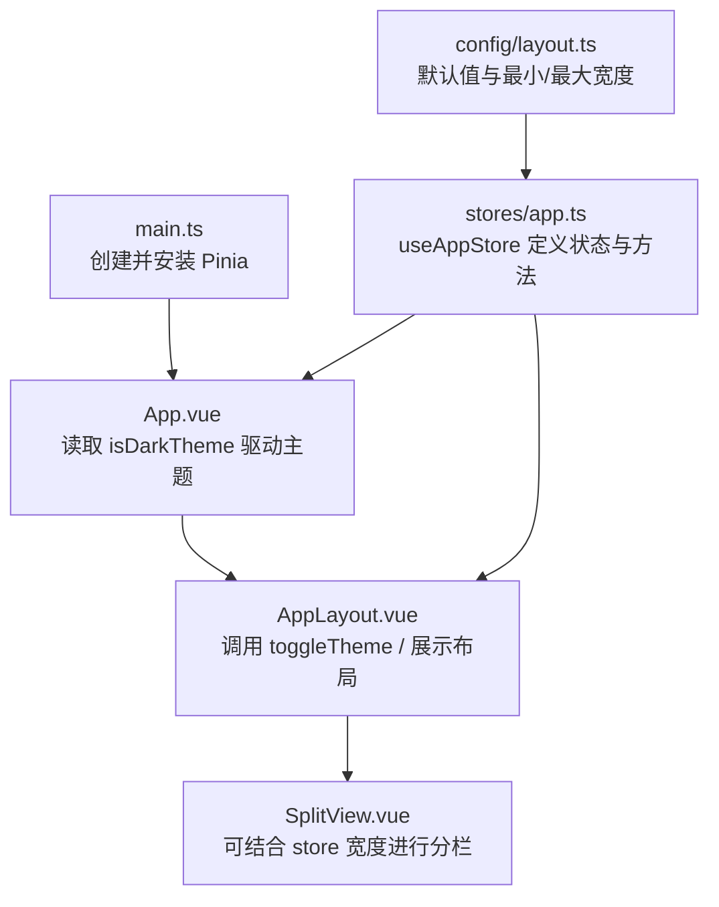
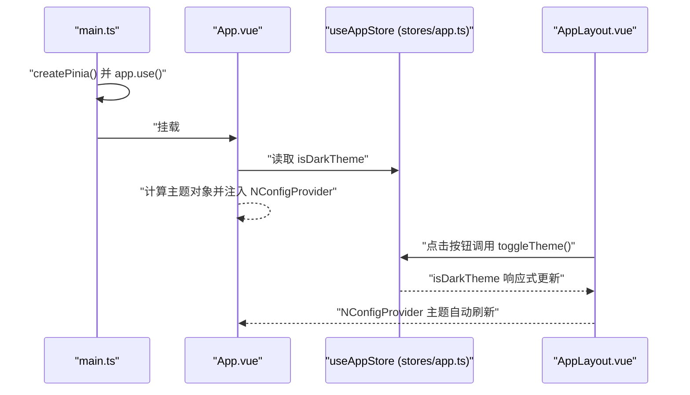
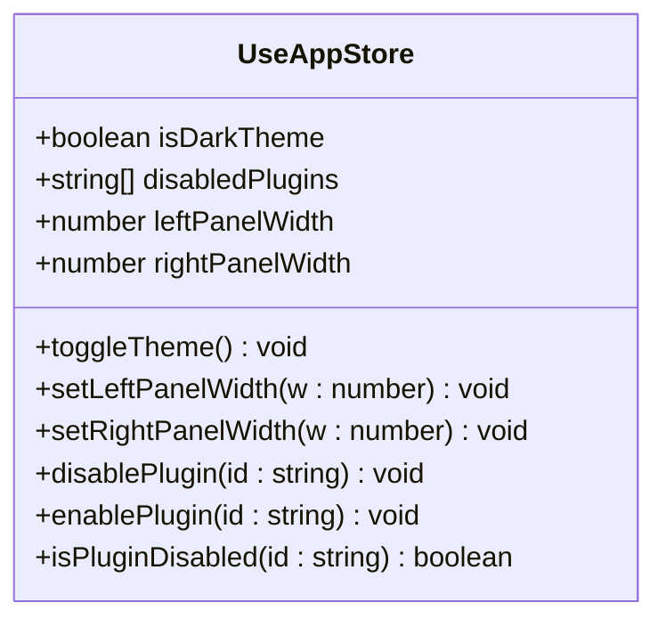
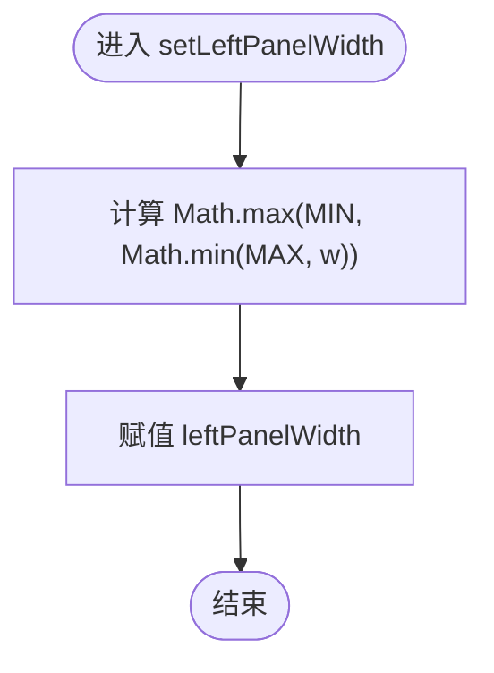
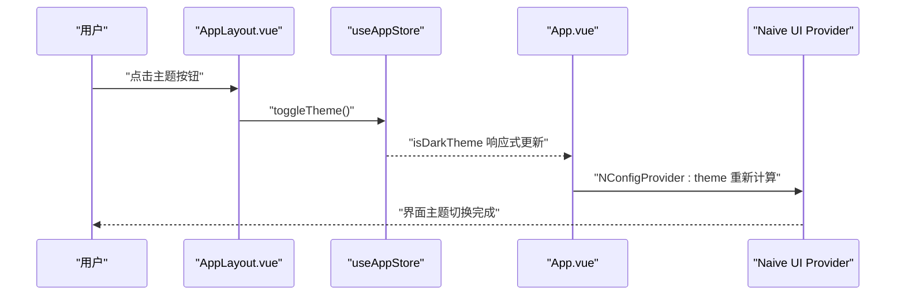
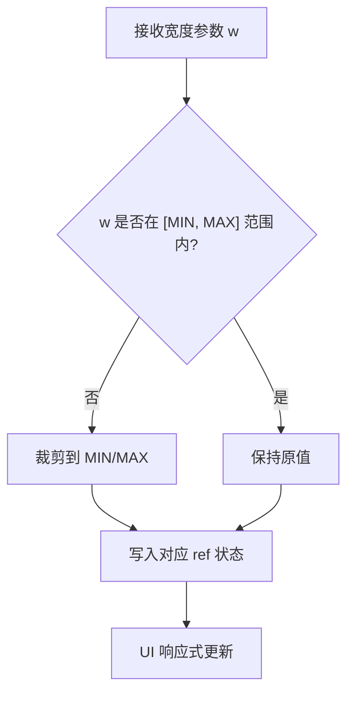
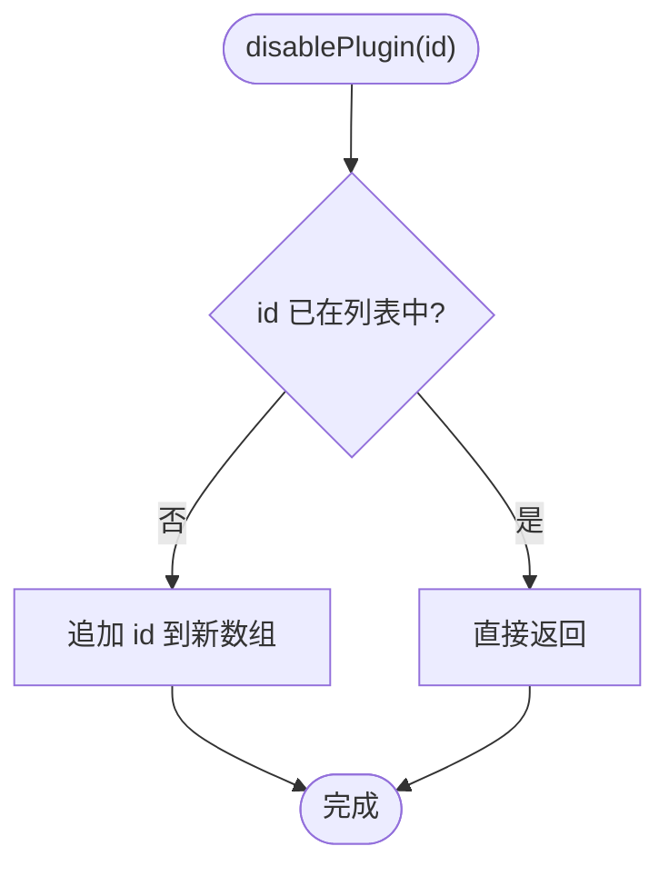
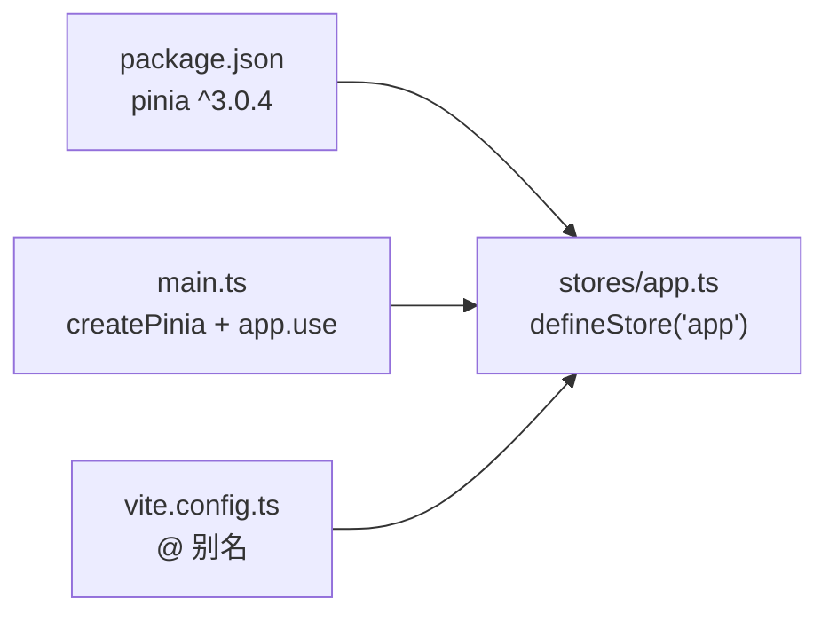

# Pinia 状态管理

<cite>
**本文引用的文件**
- [src/stores/app.ts](file://src/stores/app.ts)
- [src/main.ts](file://src/main.ts)
- [src/config/layout.ts](file://src/config/layout.ts)
- [src/config/index.ts](file://src/config/index.ts)
- [src/App.vue](file://src/App.vue)
- [src/layout/AppLayout.vue](file://src/layout/AppLayout.vue)
- [src/components/workspace/SplitView.vue](file://src/components/workspace/SplitView.vue)
- [package.json](file://package.json)
- [vite.config.ts](file://vite.config.ts)
- [src/__tests__/stores/app.test.ts](file://src/__tests__/stores/app.test.ts)
</cite>

## 目录
1. [简介](#简介)
2. [项目结构](#项目结构)
3. [核心组件](#核心组件)
4. [架构总览](#架构总览)
5. [详细组件分析](#详细组件分析)
6. [依赖关系分析](#依赖关系分析)
7. [性能与响应式优化](#性能与响应式优化)
8. [故障排查指南](#故障排查指南)
9. [结论](#结论)
10. [附录：使用示例与最佳实践](#附录使用示例与最佳实践)

## 简介
本文件面向 Hello-Tauri 项目的 Pinia 状态管理，聚焦于基于 Pinia 3.0 的 setup store 模式。文档将深入解析 useAppStore 的设计与实现、全局状态的组织方式（主题切换、面板宽度控制、插件禁用管理等）、状态变更方法的设计原则与边界处理、以及当前持久化策略的现状与扩展建议。同时提供在组件中正确使用 store 状态与方法的最佳实践和性能优化技巧。

## 项目结构
本项目采用 Vue 3 + Vite + Tauri 的前端工程结构，Pinia 作为全局状态管理库集成在应用入口。关键路径如下：
- 应用入口初始化 Pinia 实例并挂载到 Vue 应用
- 应用根组件根据 store 中的主题状态驱动 UI 主题
- 布局组件通过 store 暴露的方法更新面板宽度等全局配置
- 配置常量集中定义默认值与约束范围

图示来源
- [src/main.ts:1-8](file://src/main.ts#L1-L8)
- [src/App.vue:1-23](file://src/App.vue#L1-L23)
- [src/layout/AppLayout.vue:1-120](file://src/layout/AppLayout.vue#L1-L120)
- [src/components/workspace/SplitView.vue:1-15](file://src/components/workspace/SplitView.vue#L1-L15)
- [src/stores/app.ts:1-57](file://src/stores/app.ts#L1-L57)
- [src/config/layout.ts:1-9](file://src/config/layout.ts#L1-L9)

章节来源
- [src/main.ts:1-8](file://src/main.ts#L1-L8)
- [src/App.vue:1-23](file://src/App.vue#L1-L23)
- [src/layout/AppLayout.vue:1-120](file://src/layout/AppLayout.vue#L1-L120)
- [src/components/workspace/SplitView.vue:1-15](file://src/components/workspace/SplitView.vue#L1-L15)
- [src/stores/app.ts:1-57](file://src/stores/app.ts#L1-L57)
- [src/config/layout.ts:1-9](file://src/config/layout.ts#L1-L9)

## 核心组件
- useAppStore：基于 Pinia 3.0 setup store 的全局应用状态与行为集合，包含主题、面板宽度、插件禁用列表及其操作方法。
- 配置常量：集中定义左右面板宽度的默认值与最小/最大值，供 store 初始化与校验使用。
- 应用入口：在 main.ts 中创建并安装 Pinia 实例，使整个应用可使用 store。
- 主题驱动：App.vue 根据 isDarkTheme 计算主题对象并注入到 UI 框架提供者。
- 布局交互：AppLayout.vue 通过 store 的方法触发主题切换，并可结合 store 的面板宽度属性驱动布局。

章节来源
- [src/stores/app.ts:1-57](file://src/stores/app.ts#L1-L57)
- [src/config/layout.ts:1-9](file://src/config/layout.ts#L1-L9)
- [src/main.ts:1-8](file://src/main.ts#L1-L8)
- [src/App.vue:1-23](file://src/App.vue#L1-L23)
- [src/layout/AppLayout.vue:1-120](file://src/layout/AppLayout.vue#L1-L120)

## 架构总览
下图展示了从应用启动到主题切换与面板宽度更新的端到端流程，体现 Pinia 在 Vue 应用中的集成与数据流。

图示来源
- [src/main.ts:1-8](file://src/main.ts#L1-L8)
- [src/App.vue:1-23](file://src/App.vue#L1-L23)
- [src/stores/app.ts:12-20](file://src/stores/app.ts#L12-L20)
- [src/layout/AppLayout.vue:55-70](file://src/layout/AppLayout.vue#L55-L70)

## 详细组件分析

### useAppStore 设计与实现
useAppStore 采用 Pinia 3.0 的 setup store 风格，以函数形式声明响应式状态与动作，并通过 return 暴露给外部使用。其职责包括：
- 主题开关：isDarkTheme 布尔状态，toggleTheme 用于翻转。
- 面板宽度：leftPanelWidth、rightPanelWidth，分别由 setLeftPanelWidth、setRightPanelWidth 设置，并在内部进行最小/最大值钳制。
- 插件禁用管理：disabledPlugins 字符串数组，提供 disablePlugin、enablePlugin、isPluginDisabled 等方法进行增删查。

图示来源
- [src/stores/app.ts:12-56](file://src/stores/app.ts#L12-L56)

章节来源
- [src/stores/app.ts:1-57](file://src/stores/app.ts#L1-L57)

#### 状态字段与默认值
- isDarkTheme：初始为深色主题。
- disabledPlugins：初始为空数组。
- leftPanelWidth：初始值为配置的默认左面板宽度。
- rightPanelWidth：初始值为配置的默认右面板宽度。

章节来源
- [src/stores/app.ts:12-16](file://src/stores/app.ts#L12-L16)
- [src/config/layout.ts:1-9](file://src/config/layout.ts#L1-L9)

#### 状态变更方法与边界处理
- toggleTheme：直接翻转布尔值，无副作用。
- setLeftPanelWidth / setRightPanelWidth：对传入宽度进行最小/最大值钳制，确保始终处于合法区间。
- disablePlugin：若 ID 不存在则追加；避免重复添加。
- enablePlugin：移除指定 ID。
- isPluginDisabled：查询是否已禁用。

图示来源
- [src/stores/app.ts:22-24](file://src/stores/app.ts#L22-L24)
- [src/config/layout.ts:4-5](file://src/config/layout.ts#L4-L5)

章节来源
- [src/stores/app.ts:18-42](file://src/stores/app.ts#L18-L42)
- [src/config/layout.ts:1-9](file://src/config/layout.ts#L1-L9)

### 主题切换链路
主题切换由 AppLayout.vue 中的按钮触发，调用 store.toggleTheme，App.vue 通过 computed 计算主题对象并注入到 Naive UI 的 NConfigProvider，从而驱动全局主题变化。

图示来源
- [src/layout/AppLayout.vue:55-70](file://src/layout/AppLayout.vue#L55-L70)
- [src/stores/app.ts:18-20](file://src/stores/app.ts#L18-L20)
- [src/App.vue:9-11](file://src/App.vue#L9-L11)

章节来源
- [src/layout/AppLayout.vue:55-70](file://src/layout/AppLayout.vue#L55-L70)
- [src/App.vue:1-23](file://src/App.vue#L1-L23)
- [src/stores/app.ts:12-20](file://src/stores/app.ts#L12-L20)

### 面板宽度控制与布局联动
store 提供 setLeftPanelWidth 与 setRightPanelWidth 方法，内部对输入进行最小/最大值约束。布局层可通过这些方法更新 store 中的 width 属性，配合 CSS 或第三方分栏组件（如 Splitpanes）实现动态布局。

图示来源
- [src/stores/app.ts:22-28](file://src/stores/app.ts#L22-L28)
- [src/config/layout.ts:1-9](file://src/config/layout.ts#L1-L9)

章节来源
- [src/stores/app.ts:22-28](file://src/stores/app.ts#L22-L28)
- [src/config/layout.ts:1-9](file://src/config/layout.ts#L1-L9)

### 插件禁用管理
disabledPlugins 维护一个字符串数组，提供禁用、启用与查询能力。设计要点：
- 去重：禁用时先判断是否存在，避免重复。
- 幂等：多次禁用同一 ID 不会改变结果。
- 查询：isPluginDisabled 提供 O(n) 查询，适合小规模列表。

图示来源
- [src/stores/app.ts:30-34](file://src/stores/app.ts#L30-L34)

章节来源
- [src/stores/app.ts:30-42](file://src/stores/app.ts#L30-L42)

### 测试覆盖与行为验证
单元测试覆盖了主题切换、面板宽度钳制与插件禁用管理的核心行为，确保状态变更方法的正确性与边界条件满足。

章节来源
- [src/__tests__/stores/app.test.ts:1-55](file://src/__tests__/stores/app.test.ts#L1-L55)

## 依赖关系分析
- 运行时依赖：pinia 版本为 3.x，与 Vue 3 生态兼容良好。
- 构建配置：Vite 配置了别名 @ 指向 src，便于模块导入。
- 入口集成：main.ts 中 createPinia 并 app.use，确保全局可用。

图示来源
- [package.json:20-29](file://package.json#L20-L29)
- [src/main.ts:1-8](file://src/main.ts#L1-L8)
- [src/stores/app.ts:1-11](file://src/stores/app.ts#L1-L11)
- [vite.config.ts:12-18](file://vite.config.ts#L12-L18)

章节来源
- [package.json:20-29](file://package.json#L20-L29)
- [src/main.ts:1-8](file://src/main.ts#L1-L8)
- [src/stores/app.ts:1-11](file://src/stores/app.ts#L1-L11)
- [vite.config.ts:12-18](file://vite.config.ts#L12-L18)

## 性能与响应式优化
- 细粒度响应式：仅修改需要变更的 ref，避免整树重建。
- 方法内联与纯逻辑：toggleTheme、isPluginDisabled 等无副作用，易于缓存与测试。
- 数值钳制：在 setter 中进行边界检查，减少无效渲染。
- 组合式拆分：当状态增长时，可按功能域拆分为多个 store，降低耦合度。
- 按需订阅：在组件中使用 toRefs 或直接访问 store 属性，避免不必要的计算开销。

[本节为通用指导，不直接分析具体文件]

## 故障排查指南
- 主题未生效：确认 App.vue 是否正确计算 theme 并注入 NConfigProvider；检查 AppLayout.vue 是否调用了 toggleTheme。
- 面板宽度异常：检查 setLeftPanelWidth/setRightPanelWidth 的入参是否超出预期范围；确认 config 中的最小/最大值是否符合需求。
- 插件禁用重复：确认 disablePlugin 的去重逻辑是否生效；必要时考虑使用 Set 提升查询性能。
- 测试失败：确保在测试前 setActivePinia(createPinia())，保证每个用例使用独立 Pinia 实例。

章节来源
- [src/App.vue:9-11](file://src/App.vue#L9-L11)
- [src/layout/AppLayout.vue:55-70](file://src/layout/AppLayout.vue#L55-L70)
- [src/stores/app.ts:22-42](file://src/stores/app.ts#L22-L42)
- [src/__tests__/stores/app.test.ts:1-8](file://src/__tests__/stores/app.test.ts#L1-L8)

## 结论
useAppStore 以简洁清晰的 setup store 模式组织全局状态与行为，涵盖主题、面板宽度与插件禁用等核心场景。通过配置常量集中管理默认值与约束，setter 方法内置边界校验，保证了状态的健壮性。当前仓库未实现状态持久化，后续可在 store 初始化阶段加载本地存储，并在状态变更后同步保存，以实现跨会话的状态一致性。

[本节为总结性内容，不直接分析具体文件]

## 附录：使用示例与最佳实践

### 在组件中读取与更新状态
- 读取主题状态并驱动 UI：在 App.vue 中通过 computed 计算主题对象并注入到 NConfigProvider。
- 触发主题切换：在 AppLayout.vue 中绑定按钮点击事件，调用 store.toggleTheme。
- 更新面板宽度：在布局或拖拽逻辑中调用 setLeftPanelWidth/setRightPanelWidth，并确保传入值符合约束。

章节来源
- [src/App.vue:9-11](file://src/App.vue#L9-L11)
- [src/layout/AppLayout.vue:55-70](file://src/layout/AppLayout.vue#L55-L70)
- [src/stores/app.ts:22-28](file://src/stores/app.ts#L22-L28)

### 状态持久化策略与配置管理（现状与建议）
- 现状：当前仓库未实现持久化逻辑，所有状态均为内存态。
- 建议方案：
  - 初始化阶段：从 localStorage/sessionStorage 或后端配置加载默认值，合并到 store 初始状态。
  - 变更阶段：在 setter 中执行持久化写入，或使用 Pinia 插件统一拦截状态变更。
  - 配置管理：将默认值与约束集中在 config 模块，便于统一维护与测试。
  - 类型安全：为持久化的键名与数据结构定义类型，避免序列化错误。

章节来源
- [src/config/layout.ts:1-9](file://src/config/layout.ts#L1-L9)
- [src/stores/app.ts:12-16](file://src/stores/app.ts#L12-L16)

### 响应式更新机制与性能优化技巧
- 使用 ref 与 computed 的组合，确保仅在依赖变化时触发更新。
- 在 setter 中做边界校验，避免无效渲染。
- 对于频繁操作的数据结构（如插件禁用列表），可评估使用 Set 以提升查询与去重性能。
- 合理拆分 store，按功能域组织状态，降低耦合度与更新范围。

[本节为通用指导，不直接分析具体文件]