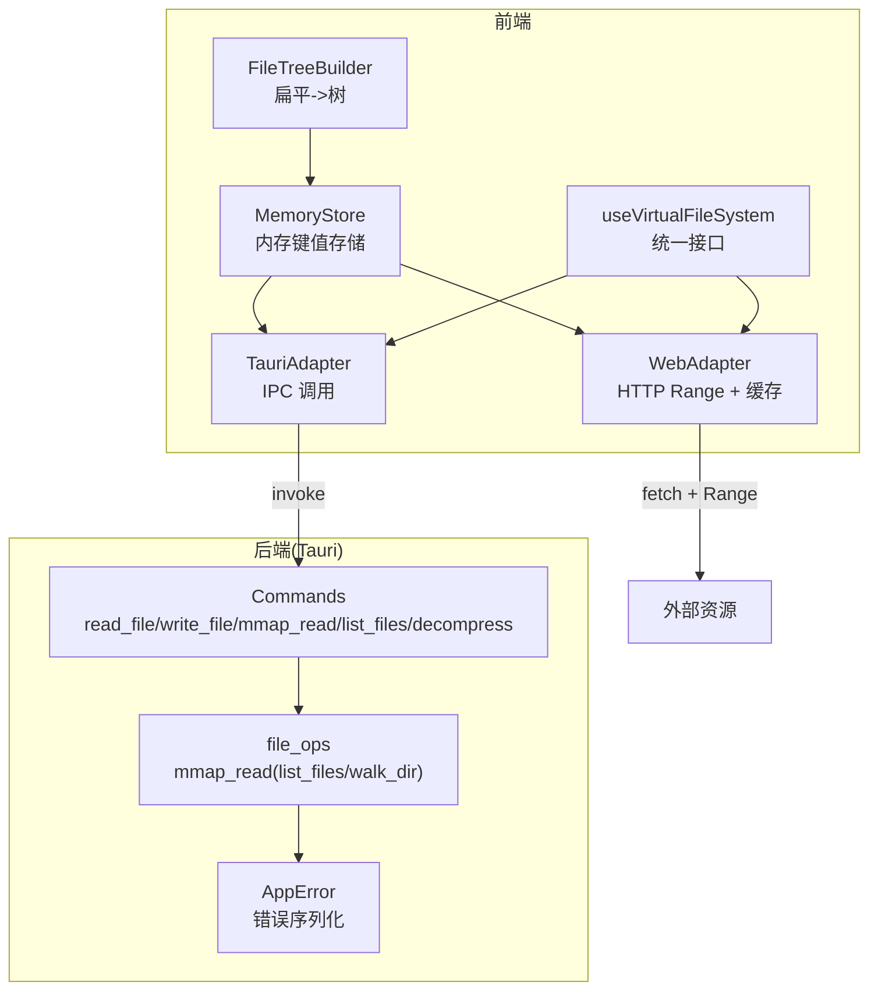
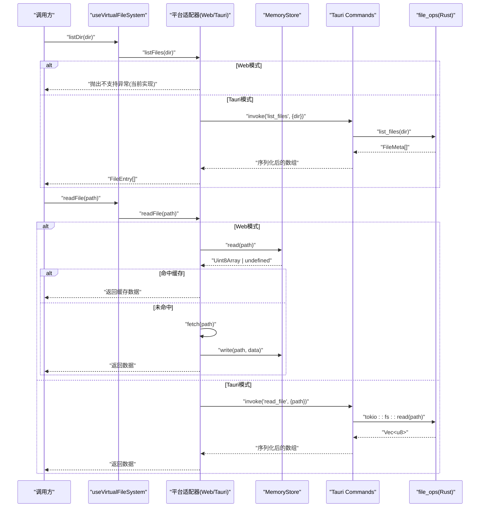
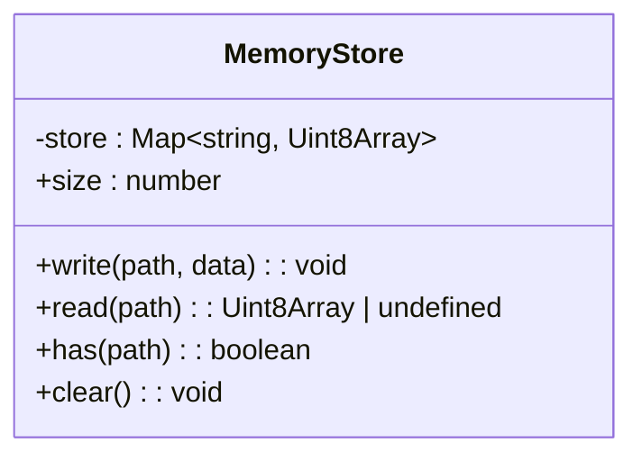
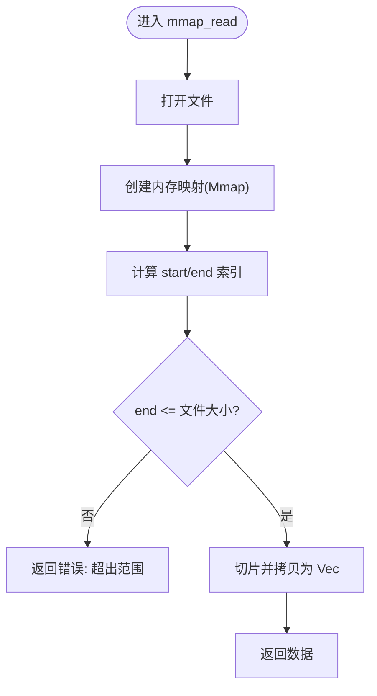
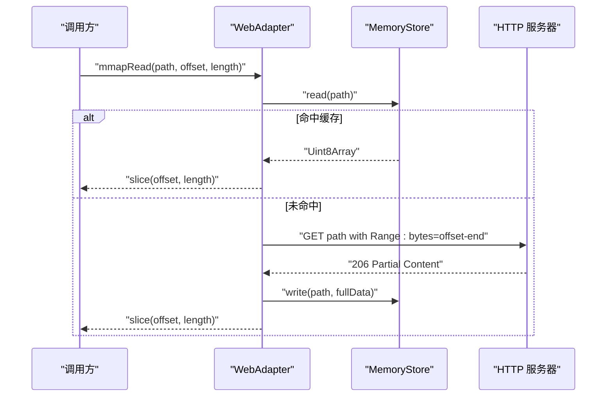
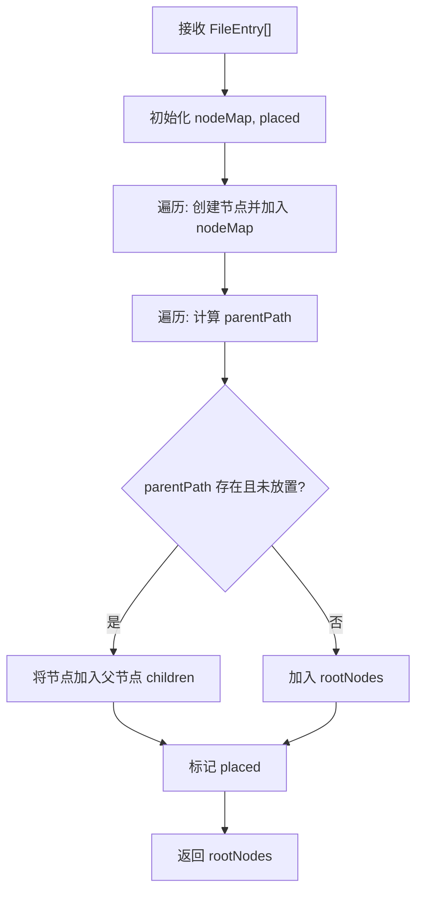
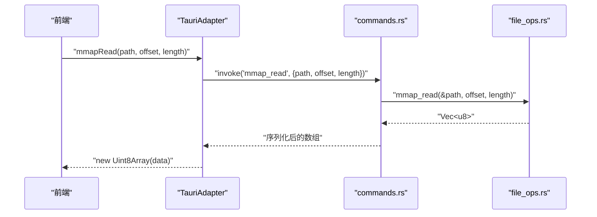
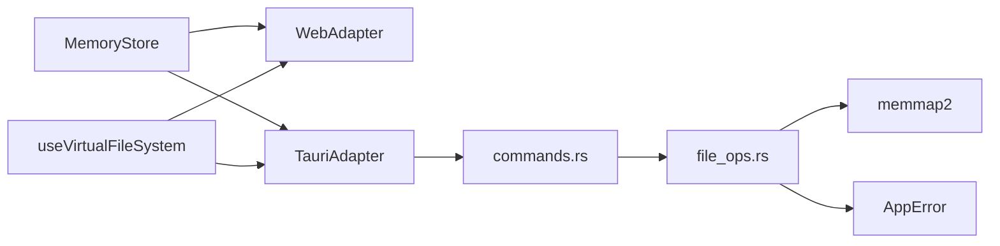

# 内存存储机制

<cite>
**本文引用的文件**   
- [memory-store.ts](file://src/core/memory-store.ts)
- [web-adapter.ts](file://src/adapters/web-adapter.ts)
- [tauri-adapter.ts](file://src/adapters/tauri-adapter.ts)
- [use-vfs.ts](file://src/composables/use-vfs.ts)
- [file-tree.ts](file://src/core/file-tree.ts)
- [index.ts](file://src/types/index.ts)
- [commands.rs](file://src-tauri/src/commands.rs)
- [lib.rs](file://src-tauri/src/lib.rs)
- [file_ops.rs](file://src-tauri/src/file_ops.rs)
- [error.rs](file://src-tauri/src/error.rs)
- [Cargo.toml](file://src-tauri/Cargo.toml)
</cite>

## 目录
1. [简介](#简介)
2. [项目结构](#项目结构)
3. [核心组件](#核心组件)
4. [架构总览](#架构总览)
5. [详细组件分析](#详细组件分析)
6. [依赖关系分析](#依赖关系分析)
7. [性能考量](#性能考量)
8. [故障排查指南](#故障排查指南)
9. [结论](#结论)
10. [附录](#附录)

## 简介
本文件面向 Hello-Tauri 项目的“内存存储机制”，围绕以下目标展开：
- 解释前端 MemoryStore 的设计与实现，包括数据结构选择与内存管理策略。
- 阐述大文件的内存映射读取技术：Rust 侧使用 memmap2 进行零拷贝分段读取；Web 侧通过 HTTP Range 头实现按需分块读取，并结合前端缓存减少重复 IO。
- 说明文件树的内存构建过程：扁平列表到树结构的转换、节点缓存与路径索引优化。
- 描述前后端数据同步机制：Tauri IPC 通信、数据序列化与增量更新思路。
- 提供内存性能优化最佳实践与监控调试方法。

注意：当前仓库未实现 LRU 缓存算法与显式内存使用监控模块，本节将基于现有实现给出扩展建议与落地方案。

## 项目结构
与内存存储相关的关键位置如下：
- 前端内存存储：src/core/memory-store.ts
- 平台适配器（Web/Tauri）：src/adapters/web-adapter.ts、src/adapters/tauri-adapter.ts
- 虚拟文件系统抽象：src/composables/use-vfs.ts
- 文件树构建：src/core/file-tree.ts
- 类型定义：src/types/index.ts
- Tauri 命令与后端实现：src-tauri/src/commands.rs、src-tauri/src/lib.rs、src-tauri/src/file_ops.rs、src-tauri/src/error.rs
- Rust 依赖声明：src-tauri/Cargo.toml

图表来源
- [memory-store.ts:1-26](file://src/core/memory-store.ts#L1-L26)
- [web-adapter.ts:1-73](file://src/adapters/web-adapter.ts#L1-L73)
- [tauri-adapter.ts:1-62](file://src/adapters/tauri-adapter.ts#L1-L62)
- [use-vfs.ts:1-18](file://src/composables/use-vfs.ts#L1-L18)
- [file-tree.ts:1-69](file://src/core/file-tree.ts#L1-L69)
- [commands.rs:1-53](file://src-tauri/src/commands.rs#L1-L53)
- [file_ops.rs:1-88](file://src-tauri/src/file_ops.rs#L1-L88)
- [error.rs:1-19](file://src-tauri/src/error.rs#L1-L19)

章节来源
- [memory-store.ts:1-26](file://src/core/memory-store.ts#L1-L26)
- [web-adapter.ts:1-73](file://src/adapters/web-adapter.ts#L1-L73)
- [tauri-adapter.ts:1-62](file://src/adapters/tauri-adapter.ts#L1-L62)
- [use-vfs.ts:1-18](file://src/composables/use-vfs.ts#L1-L18)
- [file-tree.ts:1-69](file://src/core/file-tree.ts#L1-L69)
- [commands.rs:1-53](file://src-tauri/src/commands.rs#L1-L53)
- [file_ops.rs:1-88](file://src-tauri/src/file_ops.rs#L1-L88)
- [error.rs:1-19](file://src-tauri/src/error.rs#L1-L19)

## 核心组件
- MemoryStore：以 Map<string, Uint8Array> 为底层容器，提供写、读、存在性判断、清空与大小统计能力。适合小对象或短生命周期数据的快速存取。
- WebAdapter：在浏览器环境下，优先命中 MemoryStore 缓存；未命中时通过 fetch 的 Range 头进行字节范围请求，支持流式读取（ReadableStream）。
- TauriAdapter：通过 @tauri-apps/api/core.invoke 调用后端命令，封装二进制数据为 Uint8Array，并提供 mmapRead 与 streamRead 等能力。
- useVirtualFileSystem：对上层屏蔽平台差异，统一暴露 readFile 与 listDir 两个接口。
- FileTreeBuilder：将后端返回的扁平文件列表转换为树形结构，内部维护 nodeMap 与 placed 集合以提升构建效率。

章节来源
- [memory-store.ts:1-26](file://src/core/memory-store.ts#L1-L26)
- [web-adapter.ts:1-73](file://src/adapters/web-adapter.ts#L1-L73)
- [tauri-adapter.ts:1-62](file://src/adapters/tauri-adapter.ts#L1-L62)
- [use-vfs.ts:1-18](file://src/composables/use-vfs.ts#L1-L18)
- [file-tree.ts:1-69](file://src/core/file-tree.ts#L1-L69)

## 架构总览
整体采用“前端适配器 + 后端命令”的分层设计：
- 前端通过 useVirtualFileSystem 获取平台适配器的统一接口。
- Web 模式下直接走浏览器网络栈，结合 MemoryStore 做本地缓存。
- Tauri 模式下通过 invoke 调用 Rust 命令，由 file_ops 完成磁盘 IO 与内存映射读取。

图表来源
- [use-vfs.ts:1-18](file://src/composables/use-vfs.ts#L1-L18)
- [web-adapter.ts:1-73](file://src/adapters/web-adapter.ts#L1-L73)
- [tauri-adapter.ts:1-62](file://src/adapters/tauri-adapter.ts#L1-L62)
- [commands.rs:1-53](file://src-tauri/src/commands.rs#L1-L53)
- [file_ops.rs:1-88](file://src-tauri/src/file_ops.rs#L1-L88)

## 详细组件分析

### MemoryStore 设计与内存管理
- 数据结构：Map<string, Uint8Array>，键为路径，值为二进制内容。
- 操作复杂度：写入 O(1)，读取 O(1)，has O(1)，clear O(n)。
- 内存管理策略：
  - 当前无淘汰策略，需调用方主动 clear 或替换引用以释放内存。
  - 建议在大数据集场景引入容量上限与淘汰策略（如 LRU），并在每次写入后累计内存占用，达到阈值触发清理。
- 适用场景：小文件缓存、频繁访问的元数据或已解析结果。

图表来源
- [memory-store.ts:1-26](file://src/core/memory-store.ts#L1-L26)

章节来源
- [memory-store.ts:1-26](file://src/core/memory-store.ts#L1-L26)

### 大文件内存映射读取（Rust 侧）
- 技术选型：memmap2 库进行内存映射，避免整文件加载到堆内存。
- 读取流程：打开文件 -> 创建 Mmap -> 校验偏移与长度 -> 切片拷贝为 Vec<u8> 返回。
- 边界检查：当 end > mmap.len() 时返回错误，防止越界。
- 线程模型：命令函数为异步（Tokio），但 mmap_read 本身为同步实现，适合短任务。

图表来源
- [file_ops.rs:1-88](file://src-tauri/src/file_ops.rs#L1-L88)

章节来源
- [file_ops.rs:1-88](file://src-tauri/src/file_ops.rs#L1-L88)
- [commands.rs:1-53](file://src-tauri/src/commands.rs#L1-L53)
- [Cargo.toml:1-19](file://src-tauri/Cargo.toml#L1-L19)

### 大文件内存映射读取（Web 侧）
- 技术选型：HTTP Range 头实现字节范围请求，配合 MemoryStore 缓存整文件或片段。
- 读取流程：先查缓存，命中则直接 slice；未命中则发起带 Range 的请求，成功后可回填缓存。
- 流式读取：streamRead 在未命中缓存时使用 ReadableStream 逐块推送，降低峰值内存占用。

图表来源
- [web-adapter.ts:1-73](file://src/adapters/web-adapter.ts#L1-L73)
- [memory-store.ts:1-26](file://src/core/memory-store.ts#L1-L26)

章节来源
- [web-adapter.ts:1-73](file://src/adapters/web-adapter.ts#L1-L73)
- [memory-store.ts:1-26](file://src/core/memory-store.ts#L1-L26)

### 文件树的内存构建
- 输入：后端 list_files 返回的扁平 FileMeta[]，经 TauriAdapter 转为前端 FileEntry[]。
- 构建策略：
  - 一次遍历建立 nodeMap<path -> Node>，O(n) 空间。
  - 二次遍历根据父路径归属 children，利用 placed 集合避免重复处理。
  - 根节点收集：若父路径不存在则为根。
- 辅助方法：findNode 递归查找；flattenTree 深度优先展平。

图表来源
- [file-tree.ts:1-69](file://src/core/file-tree.ts#L1-L69)
- [index.ts:1-71](file://src/types/index.ts#L1-L71)

章节来源
- [file-tree.ts:1-69](file://src/core/file-tree.ts#L1-L69)
- [index.ts:1-71](file://src/types/index.ts#L1-L71)

### 前后端内存数据同步机制
- 通信通道：@tauri-apps/api/core.invoke 调用 Rust 命令。
- 数据序列化：Rust 侧使用 serde 序列化为 JSON/数组，前端接收后包装为 Uint8Array。
- 增量更新建议：
  - 针对大文件：优先使用 mmapRead 按块读取，避免全量传输。
  - 针对文件树：仅增量下发变更项（新增/删除/修改），前端合并更新 nodeMap 与树结构。
  - 针对缓存：在写入新数据后失效旧缓存条目，保证一致性。

图表来源
- [tauri-adapter.ts:1-62](file://src/adapters/tauri-adapter.ts#L1-L62)
- [commands.rs:1-53](file://src-tauri/src/commands.rs#L1-L53)
- [file_ops.rs:1-88](file://src-tauri/src/file_ops.rs#L1-L88)

章节来源
- [tauri-adapter.ts:1-62](file://src/adapters/tauri-adapter.ts#L1-L62)
- [commands.rs:1-53](file://src-tauri/src/commands.rs#L1-L53)
- [file_ops.rs:1-88](file://src-tauri/src/file_ops.rs#L1-L88)

### 内存缓存机制现状与扩展建议
- 现状：
  - MemoryStore 提供基础读写与清空能力，无淘汰策略。
  - WebAdapter 在读取前会查询缓存，命中则直接返回，未命中则拉取并可回填缓存。
- 扩展建议（LRU 缓存）：
  - 增加容量上限与最近使用记录，淘汰最久未使用的条目。
  - 在 write 时更新访问顺序，read 时提升优先级。
  - 提供 getUsageBytes 与 onEvict 回调用于监控与告警。
- 缓存失效策略：
  - 基于路径的精确失效。
  - 基于目录前缀的批量失效（例如目录刷新）。
  - 基于时间 TTL 的自动过期。
- 内存使用监控：
  - 累计所有条目的 Uint8Array.byteLength，定期上报。
  - 在 Tauri 侧可通过系统 API 获取进程内存指标（可选）。

章节来源
- [memory-store.ts:1-26](file://src/core/memory-store.ts#L1-L26)
- [web-adapter.ts:1-73](file://src/adapters/web-adapter.ts#L1-L73)

## 依赖关系分析
- 前端依赖：
  - WebAdapter 依赖 MemoryStore 与浏览器网络 API。
  - TauriAdapter 依赖 @tauri-apps/api/core.invoke。
  - useVirtualFileSystem 聚合两类适配器，向上提供统一接口。
- 后端依赖：
  - commands.rs 注册 Tauri 命令，转发至 file_ops。
  - file_ops.rs 使用 memmap2 进行内存映射读取，使用 std::fs 进行目录遍历。
  - error.rs 定义 AppError 并实现 Serialize，便于跨语言传递。

图表来源
- [memory-store.ts:1-26](file://src/core/memory-store.ts#L1-L26)
- [web-adapter.ts:1-73](file://src/adapters/web-adapter.ts#L1-L73)
- [tauri-adapter.ts:1-62](file://src/adapters/tauri-adapter.ts#L1-L62)
- [use-vfs.ts:1-18](file://src/composables/use-vfs.ts#L1-L18)
- [commands.rs:1-53](file://src-tauri/src/commands.rs#L1-L53)
- [file_ops.rs:1-88](file://src-tauri/src/file_ops.rs#L1-L88)
- [error.rs:1-19](file://src-tauri/src/error.rs#L1-L19)
- [Cargo.toml:1-19](file://src-tauri/Cargo.toml#L1-L19)

章节来源
- [Cargo.toml:1-19](file://src-tauri/Cargo.toml#L1-L19)
- [commands.rs:1-53](file://src-tauri/src/commands.rs#L1-L53)
- [file_ops.rs:1-88](file://src-tauri/src/file_ops.rs#L1-L88)
- [error.rs:1-19](file://src-tauri/src/error.rs#L1-L19)

## 性能考量
- 大文件读取
  - Rust 侧使用 memmap2 零拷贝映射，避免整文件入堆，显著降低内存峰值。
  - Web 侧使用 Range 请求按需拉取，结合 MemoryStore 缓存热点数据。
- 文件树构建
  - 两次线性扫描 + Map 索引，时间复杂度 O(n)，空间复杂度 O(n)。
  - 使用 placed 集合避免重复挂载，减少无效操作。
- IPC 传输
  - 避免全量传输大文件，优先使用 mmapRead 分块读取。
  - 对于文件树，考虑增量更新以减少序列化与传输开销。
- 内存泄漏防护
  - 及时调用 memoryStore.clear 或在业务层替换引用，确保 GC 回收。
  - 在长生命周期对象中谨慎持有大对象引用，必要时使用弱引用或池化策略。
- 垃圾回收调优
  - 控制单次分配的大对象数量，避免触发频繁 GC。
  - 合理设置缓存上限，避免内存膨胀。
- 大数据集处理
  - 采用流式处理（ReadableStream）与分块渲染，降低首屏压力。
  - 分页/懒加载展示文件树，按需展开子节点。

[本节为通用指导，不直接分析具体文件]

## 故障排查指南
- 常见错误
  - 路径穿越保护：后端 read_file 拒绝包含 ".." 的路径，返回权限错误。
  - 越界读取：mmap_read 在 end > 文件大小时报错 InvalidInput。
  - Web 模式不支持：WebAdapter 的 writeFile、listFiles、decompress 在当前实现抛出异常。
- 定位步骤
  - 确认调用链路：前端适配器 -> Tauri 命令 -> file_ops。
  - 检查参数合法性：路径、偏移、长度是否有效。
  - 观察错误类型：AppError 已实现序列化，可在前端捕获并打印。
- 日志与断点
  - 在前端适配器关键分支添加日志，记录路径、偏移、长度与返回状态。
  - 在后端命令入口与 file_ops 关键分支添加日志，便于追踪问题。

章节来源
- [commands.rs:1-53](file://src-tauri/src/commands.rs#L1-L53)
- [file_ops.rs:1-88](file://src-tauri/src/file_ops.rs#L1-L88)
- [error.rs:1-19](file://src-tauri/src/error.rs#L1-L19)
- [web-adapter.ts:1-73](file://src/adapters/web-adapter.ts#L1-L73)

## 结论
本项目在前端实现了轻量级内存存储与平台适配层，在 Tauri 后端提供了高效的内存映射读取能力。通过分层设计与按需读取策略，能够在保证性能的同时降低内存峰值。后续可在 MemoryStore 中引入 LRU 淘汰与内存监控，进一步提升稳定性与可观测性。

[本节为总结，不直接分析具体文件]

## 附录
- 类型参考
  - FileEntry、FileTreeNode、DecompressResult 等类型定义位于 src/types/index.ts，供前后端共享语义。
- 测试参考
  - 文件树构建逻辑有对应单元测试，可用于验证构建与查找行为。

章节来源
- [index.ts:1-71](file://src/types/index.ts#L1-L71)
- [file-tree.ts:1-69](file://src/core/file-tree.ts#L1-L69)