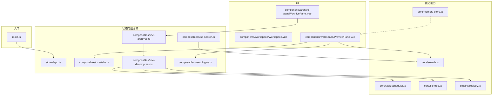
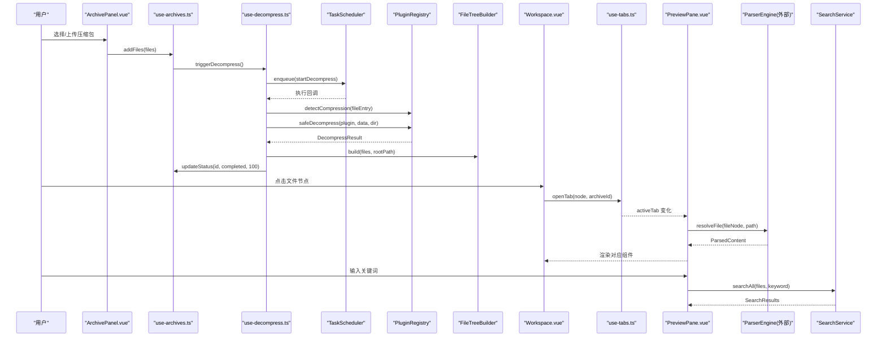
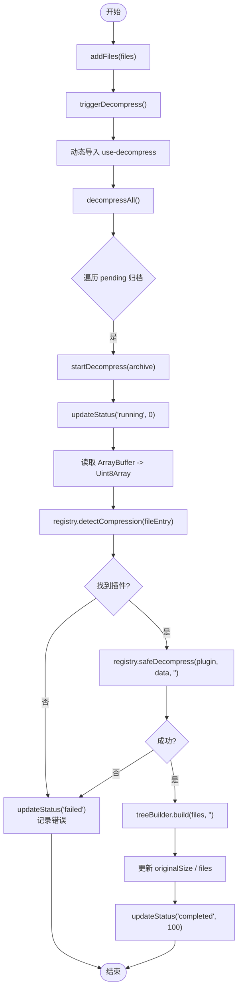
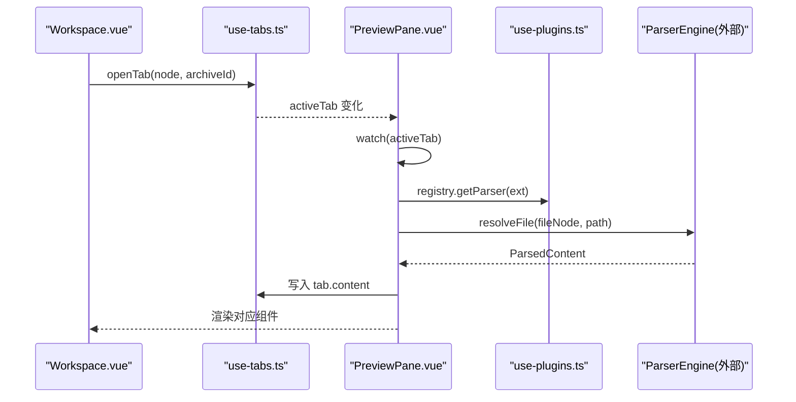
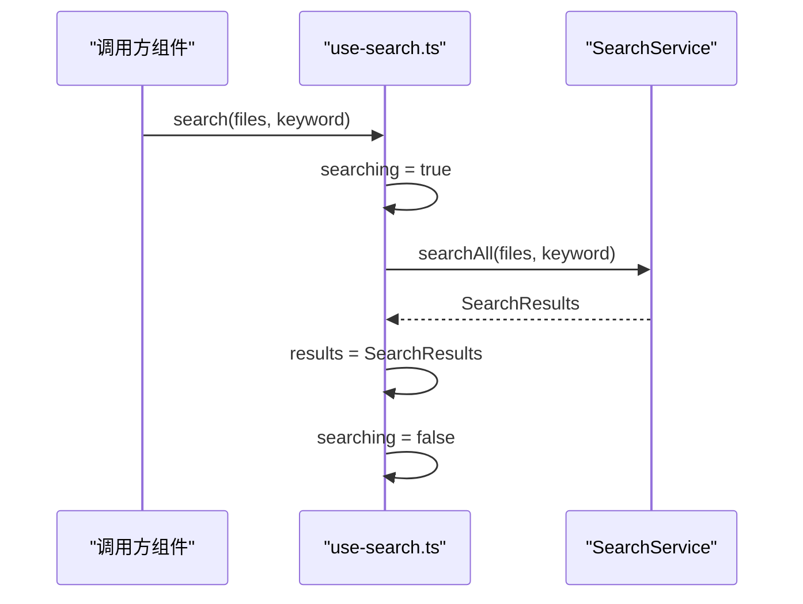
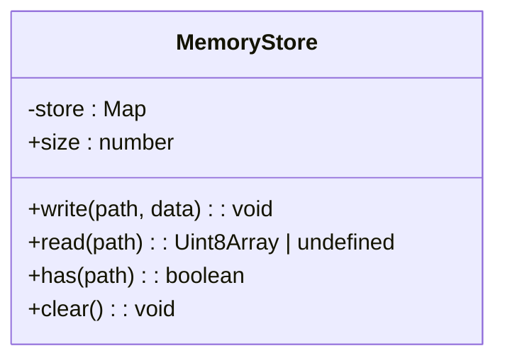
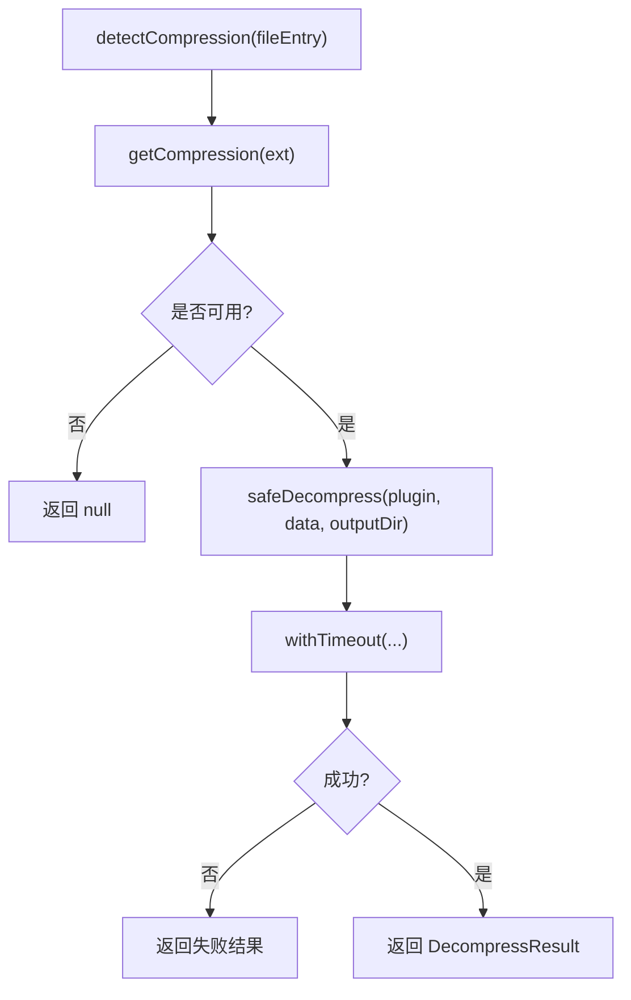
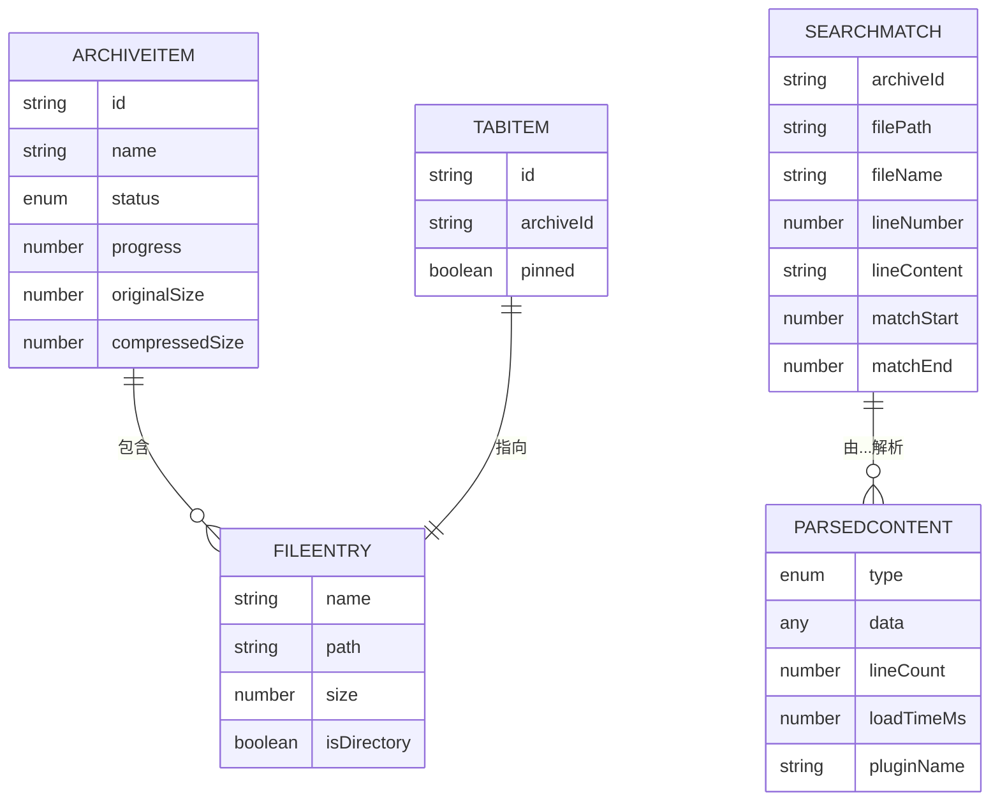
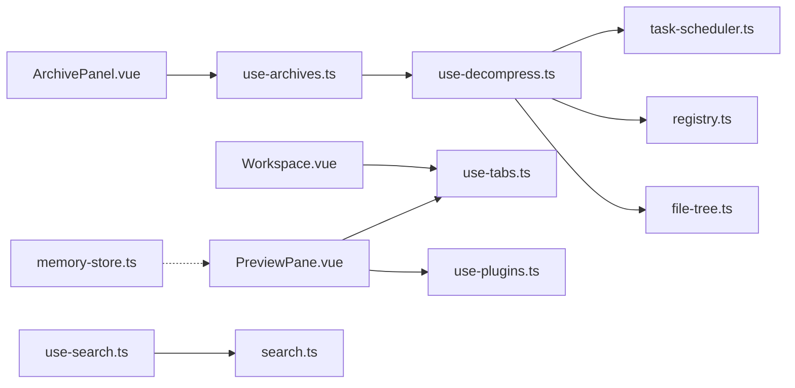

# 数据流模式

<cite>
**本文引用的文件**   
- [main.ts](file://src/main.ts)
- [app.ts](file://src/stores/app.ts)
- [use-archives.ts](file://src/composables/use-archives.ts)
- [use-decompress.ts](file://src/composables/use-decompress.ts)
- [use-tabs.ts](file://src/composables/use-tabs.ts)
- [use-search.ts](file://src/composables/use-search.ts)
- [use-plugins.ts](file://src/composables/use-plugins.ts)
- [memory-store.ts](file://src/core/memory-store.ts)
- [search.ts](file://src/core/search.ts)
- [task-scheduler.ts](file://src/core/task-scheduler.ts)
- [file-tree.ts](file://src/core/file-tree.ts)
- [registry.ts](file://src/plugins/registry.ts)
- [index.ts](file://src/types/index.ts)
- [ArchivePanel.vue](file://src/components/archive-panel/ArchivePanel.vue)
- [Workspace.vue](file://src/components/workspace/Workspace.vue)
- [PreviewPane.vue](file://src/components/workspace/PreviewPane.vue)
</cite>

## 目录
1. [简介](#简介)
2. [项目结构](#项目结构)
3. [核心组件](#核心组件)
4. [架构总览](#架构总览)
5. [详细组件分析](#详细组件分析)
6. [依赖分析](#依赖分析)
7. [性能考虑](#性能考虑)
8. [故障排查指南](#故障排查指南)
9. [结论](#结论)
10. [附录](#附录)

## 简介
本文件聚焦 Hello-Tauri 的数据流模式，围绕基于 Pinia 的状态管理、组合式函数（Composables）封装、文件处理链路、内存存储与缓存策略展开。文档通过多张图示展示从用户交互到文件解析再到 UI 更新的完整数据链路，并给出性能优化建议与常见问题排查方法。

## 项目结构
前端采用 Vue 3 + Pinia 的组合式架构：
- 状态层：Pinia store 用于应用级配置；组合式函数维护业务域状态（归档、标签页、搜索等）。
- 逻辑层：组合式函数封装业务逻辑，协调任务调度、插件注册表、文件树构建与搜索服务。
- 渲染层：组件通过响应式引用订阅状态变化，驱动视图更新。
- 内存层：内存存储提供路径到二进制数据的映射能力，便于后续扩展大文件按需读取与缓存。

图表来源
- [main.ts:1-8](file://src/main.ts#L1-L8)
- [app.ts:1-57](file://src/stores/app.ts#L1-L57)
- [use-archives.ts:1-60](file://src/composables/use-archives.ts#L1-L60)
- [use-decompress.ts:1-74](file://src/composables/use-decompress.ts#L1-L74)
- [use-tabs.ts:1-64](file://src/composables/use-tabs.ts#L1-L64)
- [use-search.ts:1-28](file://src/composables/use-search.ts#L1-L28)
- [use-plugins.ts:1-17](file://src/composables/use-plugins.ts#L1-L17)
- [task-scheduler.ts:1-79](file://src/core/task-scheduler.ts#L1-L79)
- [file-tree.ts:1-69](file://src/core/file-tree.ts#L1-L69)
- [search.ts:1-49](file://src/core/search.ts#L1-L49)
- [memory-store.ts:1-26](file://src/core/memory-store.ts#L1-L26)
- [registry.ts:1-118](file://src/plugins/registry.ts#L1-L118)
- [ArchivePanel.vue:1-24](file://src/components/archive-panel/ArchivePanel.vue#L1-L24)
- [Workspace.vue:1-36](file://src/components/workspace/Workspace.vue#L1-L36)
- [PreviewPane.vue:1-58](file://src/components/workspace/PreviewPane.vue#L1-L58)

章节来源
- [main.ts:1-8](file://src/main.ts#L1-L8)
- [app.ts:1-57](file://src/stores/app.ts#L1-L57)

## 核心组件
- 应用状态（Pinia Store）
  - 职责：主题开关、面板宽度、插件禁用列表等全局配置。
  - 特点：使用 ref 定义响应式字段，提供 setter 进行受控变更。
  - 适用场景：跨组件共享的轻量级应用级状态。
- 组合式函数（Composables）
  - useArchiveManager：维护归档队列、进度与统计，触发解压流程。
  - useDecompress：编排任务调度、插件检测与安全解压、文件树构建与状态回写。
  - useTabManager：标签页生命周期管理（打开、关闭、激活、固定），关联当前活动标签。
  - useSearch：封装搜索服务调用，暴露结果与加载态。
  - usePlugins：暴露插件注册表与便捷方法，统一插件发现与调用。
- 核心能力
  - TaskScheduler：并发控制的任务队列，支持重试与计数查询。
  - FileTreeBuilder：将扁平文件条目构造成树形结构，并提供查找与展平工具。
  - SearchService：文本匹配与批量搜索，返回命中详情与耗时。
  - MemoryStore：路径到 Uint8Array 的键值存储，为后续大文件缓存与按需读取提供基础。
  - PluginRegistry：压缩与解析插件的统一注册、检测、安全执行与超时保护。

章节来源
- [app.ts:1-57](file://src/stores/app.ts#L1-L57)
- [use-archives.ts:1-60](file://src/composables/use-archives.ts#L1-L60)
- [use-decompress.ts:1-74](file://src/composables/use-decompress.ts#L1-L74)
- [use-tabs.ts:1-64](file://src/composables/use-tabs.ts#L1-L64)
- [use-search.ts:1-28](file://src/composables/use-search.ts#L1-L28)
- [use-plugins.ts:1-17](file://src/composables/use-plugins.ts#L1-L17)
- [task-scheduler.ts:1-79](file://src/core/task-scheduler.ts#L1-L79)
- [file-tree.ts:1-69](file://src/core/file-tree.ts#L1-L69)
- [search.ts:1-49](file://src/core/search.ts#L1-L49)
- [memory-store.ts:1-26](file://src/core/memory-store.ts#L1-L26)
- [registry.ts:1-118](file://src/plugins/registry.ts#L1-L118)

## 架构总览
整体数据流遵循“事件驱动 + 响应式状态”的模式：
- 用户交互触发组合式函数中的动作。
- 组合式函数协调任务调度、插件系统与核心算法，产生中间结果。
- 结果写入响应式状态（ref/computed），驱动组件自动更新。
- 预览面板根据活动标签动态解析并渲染内容。

图表来源
- [ArchivePanel.vue:1-24](file://src/components/archive-panel/ArchivePanel.vue#L1-L24)
- [use-archives.ts:1-60](file://src/composables/use-archives.ts#L1-L60)
- [use-decompress.ts:1-74](file://src/composables/use-decompress.ts#L1-L74)
- [task-scheduler.ts:1-79](file://src/core/task-scheduler.ts#L1-L79)
- [registry.ts:1-118](file://src/plugins/registry.ts#L1-L118)
- [file-tree.ts:1-69](file://src/core/file-tree.ts#L1-L69)
- [Workspace.vue:1-36](file://src/components/workspace/Workspace.vue#L1-L36)
- [use-tabs.ts:1-64](file://src/composables/use-tabs.ts#L1-L64)
- [PreviewPane.vue:1-58](file://src/components/workspace/PreviewPane.vue#L1-L58)
- [search.ts:1-49](file://src/core/search.ts#L1-L49)

## 详细组件分析

### 归档与解压数据流（use-archives + use-decompress）
- 设计要点
  - 使用模块级 ref 维护 archives 列表，避免在组件间传递复杂状态。
  - 通过 computed 聚合统计信息，减少重复计算。
  - 使用动态导入懒加载 use-decompress，降低首屏开销。
  - 任务调度器限制并发，避免浏览器主线程阻塞。
  - 插件注册表负责压缩格式识别与安全解压，失败时回退错误状态。
  - 文件树构建将扁平条目组织为可交互的层级结构。
- 关键流程
  - 添加文件 -> 入队解压任务 -> 检测压缩类型 -> 安全解压 -> 构建文件树 -> 更新归档状态与统计。

图表来源
- [use-archives.ts:1-60](file://src/composables/use-archives.ts#L1-L60)
- [use-decompress.ts:1-74](file://src/composables/use-decompress.ts#L1-L74)
- [task-scheduler.ts:1-79](file://src/core/task-scheduler.ts#L1-L79)
- [registry.ts:1-118](file://src/plugins/registry.ts#L1-L118)
- [file-tree.ts:1-69](file://src/core/file-tree.ts#L1-L69)

章节来源
- [use-archives.ts:1-60](file://src/composables/use-archives.ts#L1-L60)
- [use-decompress.ts:1-74](file://src/composables/use-decompress.ts#L1-L74)
- [task-scheduler.ts:1-79](file://src/core/task-scheduler.ts#L1-L79)
- [registry.ts:1-118](file://src/plugins/registry.ts#L1-L118)
- [file-tree.ts:1-69](file://src/core/file-tree.ts#L1-L69)

### 标签页与预览数据流（use-tabs + PreviewPane）
- 设计要点
  - 标签页状态集中管理，activeTab 作为单一事实来源。
  - 首次访问标签时惰性解析内容，避免不必要的 I/O 与 CPU 消耗。
  - 根据文件扩展名动态选择渲染组件，实现解耦与可扩展性。
- 关键流程
  - 打开标签 -> 监听 activeTab 变化 -> 解析文件内容 -> 写入 tab.content -> 渲染对应组件。

图表来源
- [use-tabs.ts:1-64](file://src/composables/use-tabs.ts#L1-L64)
- [PreviewPane.vue:1-58](file://src/components/workspace/PreviewPane.vue#L1-L58)
- [use-plugins.ts:1-17](file://src/composables/use-plugins.ts#L1-L17)

章节来源
- [use-tabs.ts:1-64](file://src/composables/use-tabs.ts#L1-L64)
- [PreviewPane.vue:1-58](file://src/components/workspace/PreviewPane.vue#L1-L58)
- [use-plugins.ts:1-17](file://src/composables/use-plugins.ts#L1-L17)

### 搜索数据流（use-search + SearchService）
- 设计要点
  - 组合式函数仅暴露 results 与 searching 两个响应式变量，简化组件侧逻辑。
  - 搜索服务按行扫描并收集命中位置，返回结构化结果与耗时。
- 关键流程
  - 用户输入关键词 -> 调用 search(files, keyword) -> 搜索服务批量匹配 -> 更新 results 与 searching。

图表来源
- [use-search.ts:1-28](file://src/composables/use-search.ts#L1-L28)
- [search.ts:1-49](file://src/core/search.ts#L1-L49)

章节来源
- [use-search.ts:1-28](file://src/composables/use-search.ts#L1-L28)
- [search.ts:1-49](file://src/core/search.ts#L1-L49)

### 内存存储机制（MemoryStore）
- 设计要点
  - 以 Map 维护路径到 Uint8Array 的映射，提供读写、存在性与清空操作。
  - 当前未直接集成大文件内存映射或分块读取，但可作为后续缓存层的基础。
- 使用建议
  - 对热点小文件进行全量缓存；对大文件结合虚拟滚动与按需读取，避免一次性加载导致内存峰值过高。
  - 配合 LRU 策略或容量上限清理，防止长期运行后内存膨胀。

图表来源
- [memory-store.ts:1-26](file://src/core/memory-store.ts#L1-L26)

章节来源
- [memory-store.ts:1-26](file://src/core/memory-store.ts#L1-L26)

### 插件系统（PluginRegistry）
- 设计要点
  - 统一注册压缩与解析插件，支持启用/禁用与名称查询。
  - 提供安全包装方法，带超时保护与异常回退，确保稳定性。
- 关键流程
  - 检测压缩类型 -> 安全解压 -> 解析文件 -> 返回结构化结果。

图表来源
- [registry.ts:1-118](file://src/plugins/registry.ts#L1-L118)

章节来源
- [registry.ts:1-118](file://src/plugins/registry.ts#L1-L118)

### 类型模型（types）
- 关键实体
  - FileEntry：文件元信息（名称、路径、大小、是否目录）。
  - ArchiveItem：归档项（状态、进度、文件树、尺寸统计）。
  - TabItem：标签项（关联文件节点、归档 ID、可选解析内容）。
  - SearchMatch/SearchResults：搜索结果结构与汇总。
  - ParsedContent：解析后的内容载体（类型、数据、行数、耗时、插件名）。

图表来源
- [index.ts:1-71](file://src/types/index.ts#L1-L71)

章节来源
- [index.ts:1-71](file://src/types/index.ts#L1-L71)

## 依赖分析
- 组件到组合式函数的单向依赖
  - ArchivePanel.vue 依赖 use-archives.ts
  - Workspace.vue 依赖 use-tabs.ts
  - PreviewPane.vue 依赖 use-tabs.ts、use-plugins.ts 与 ParserEngine（外部）
- 组合式函数到核心能力的依赖
  - use-decompress.ts 依赖 task-scheduler.ts、registry.ts、file-tree.ts
  - use-search.ts 依赖 core/search.ts
- 核心能力之间的耦合
  - registry.ts 被 use-decompress.ts 与 PreviewPane.vue 共同使用
  - file-tree.ts 被 use-decompress.ts 使用
  - memory-store.ts 目前独立，预留为未来缓存层

图表来源
- [ArchivePanel.vue:1-24](file://src/components/archive-panel/ArchivePanel.vue#L1-L24)
- [use-archives.ts:1-60](file://src/composables/use-archives.ts#L1-L60)
- [use-decompress.ts:1-74](file://src/composables/use-decompress.ts#L1-L74)
- [task-scheduler.ts:1-79](file://src/core/task-scheduler.ts#L1-L79)
- [registry.ts:1-118](file://src/plugins/registry.ts#L1-L118)
- [file-tree.ts:1-69](file://src/core/file-tree.ts#L1-L69)
- [Workspace.vue:1-36](file://src/components/workspace/Workspace.vue#L1-L36)
- [use-tabs.ts:1-64](file://src/composables/use-tabs.ts#L1-L64)
- [PreviewPane.vue:1-58](file://src/components/workspace/PreviewPane.vue#L1-L58)
- [use-plugins.ts:1-17](file://src/composables/use-plugins.ts#L1-L17)
- [use-search.ts:1-28](file://src/composables/use-search.ts#L1-L28)
- [search.ts:1-49](file://src/core/search.ts#L1-L49)
- [memory-store.ts:1-26](file://src/core/memory-store.ts#L1-L26)

章节来源
- [use-archives.ts:1-60](file://src/composables/use-archives.ts#L1-L60)
- [use-decompress.ts:1-74](file://src/composables/use-decompress.ts#L1-L74)
- [use-tabs.ts:1-64](file://src/composables/use-tabs.ts#L1-L64)
- [use-search.ts:1-28](file://src/composables/use-search.ts#L1-L28)
- [use-plugins.ts:1-17](file://src/composables/use-plugins.ts#L1-L17)
- [task-scheduler.ts:1-79](file://src/core/task-scheduler.ts#L1-L79)
- [file-tree.ts:1-69](file://src/core/file-tree.ts#L1-L69)
- [search.ts:1-49](file://src/core/search.ts#L1-L49)
- [memory-store.ts:1-26](file://src/core/memory-store.ts#L1-L26)
- [registry.ts:1-118](file://src/plugins/registry.ts#L1-L118)
- [ArchivePanel.vue:1-24](file://src/components/archive-panel/ArchivePanel.vue#L1-L24)
- [Workspace.vue:1-36](file://src/components/workspace/Workspace.vue#L1-L36)
- [PreviewPane.vue:1-58](file://src/components/workspace/PreviewPane.vue#L1-L58)

## 性能考虑
- 并发与背压
  - 使用任务调度器限制最大并发数，避免同时解压过多文件导致卡顿。
  - 队列满时快速失败并提示，防止无限堆积。
- 惰性加载与按需解析
  - 仅在标签激活时解析文件内容，减少初始渲染成本。
  - 使用动态导入组合式函数，降低首屏体积。
- 增量更新与最小化重绘
  - 通过 ref/computed 精确追踪状态变化，避免整树重渲染。
  - 列表渲染使用稳定 key，提升 Diff 效率。
- 大文件与内存管理
  - 当前内存存储为简单 Map，建议引入容量上限与淘汰策略（如 LRU）。
  - 对超大文件采用分块读取与虚拟滚动，避免一次性加载。
- 搜索优化
  - 对长文本逐行扫描已具备线性复杂度，可在必要时引入索引或倒排结构以提升检索速度。
  - 合并多次搜索请求，去抖输入，减少重复计算。

[本节为通用性能指导，不直接分析具体文件]

## 故障排查指南
- 解压失败
  - 检查压缩类型是否被插件支持；查看插件是否被禁用。
  - 关注任务队列是否已满，必要时增加并发或清理队列。
  - 参考错误消息定位具体原因（无插件、超时、未知错误）。
- 预览无法加载
  - 确认活动标签是否存在且未被关闭。
  - 检查解析插件是否正确注册并可获取组件。
  - 观察 ParserEngine 调用是否抛出异常，保持 loading 状态以便重试。
- 搜索无结果或缓慢
  - 确认传入的文件集合是否为空或内容过大。
  - 检查关键词是否为空，避免无效扫描。
  - 对频繁搜索进行去抖与分页展示结果。

章节来源
- [use-decompress.ts:1-74](file://src/composables/use-decompress.ts#L1-L74)
- [registry.ts:1-118](file://src/plugins/registry.ts#L1-L118)
- [PreviewPane.vue:1-58](file://src/components/workspace/PreviewPane.vue#L1-L58)
- [use-search.ts:1-28](file://src/composables/use-search.ts#L1-L28)
- [search.ts:1-49](file://src/core/search.ts#L1-L49)

## 结论
本项目采用组合式函数与 Pinia 协同的数据流模式，将业务逻辑与视图渲染清晰分离。通过任务调度、插件注册表与文件树构建，实现了从用户交互到文件解析再到 UI 更新的完整链路。内存存储为后续大文件缓存与按需读取奠定基础。建议在现有基础上引入更完善的缓存策略与虚拟化技术，进一步提升大规模数据处理时的性能与体验。

[本节为总结性内容，不直接分析具体文件]

## 附录
- 术语
  - 组合式函数：封装可复用逻辑与状态的函数，通常返回响应式对象与方法。
  - 插件注册表：统一管理插件的发现、启用/禁用与安全调用。
  - 任务调度器：控制异步任务的并发与排队，提供重试与状态查询。
- 相关类型
  - 参见 types/index.ts 中定义的实体与枚举，贯穿整个数据流。

章节来源
- [index.ts:1-71](file://src/types/index.ts#L1-L71)