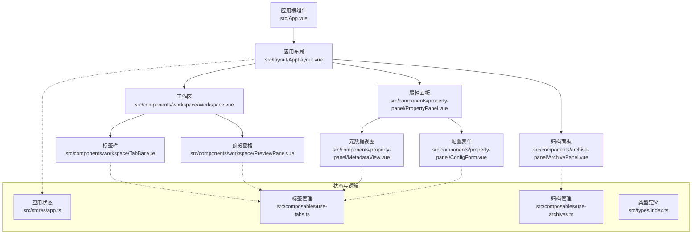
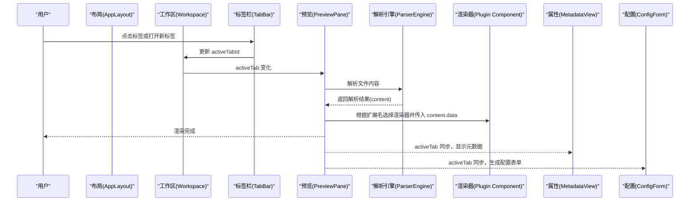
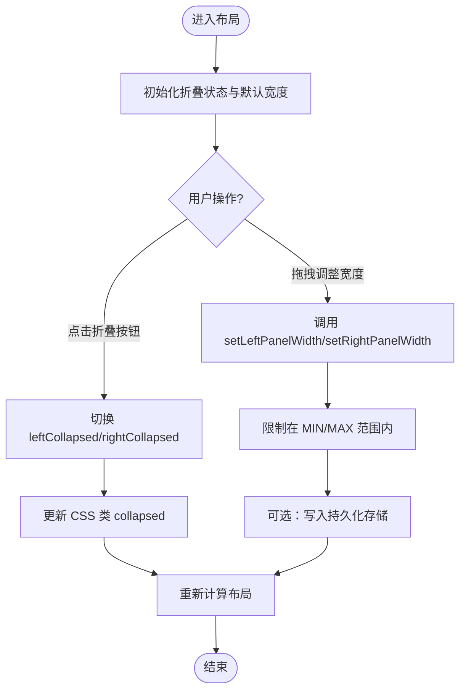
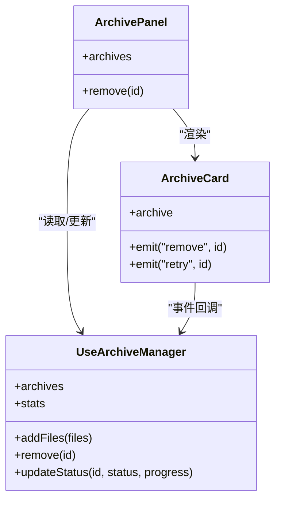
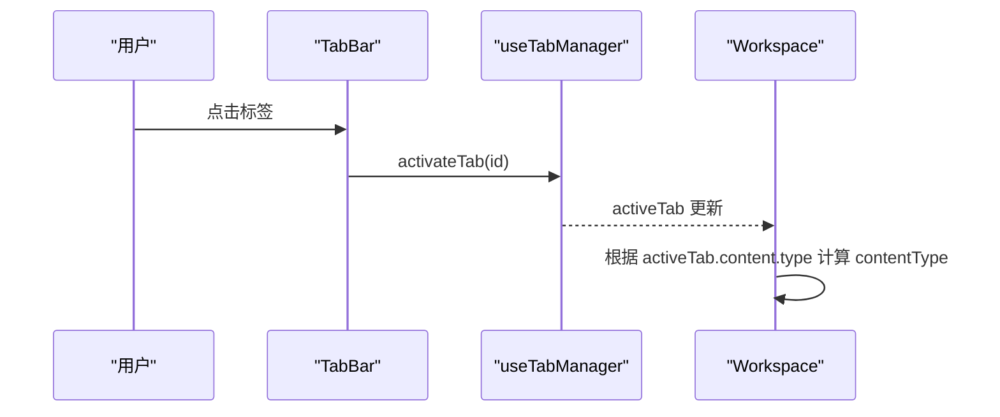
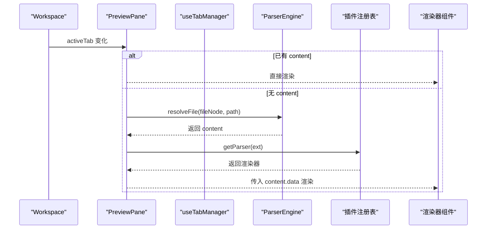
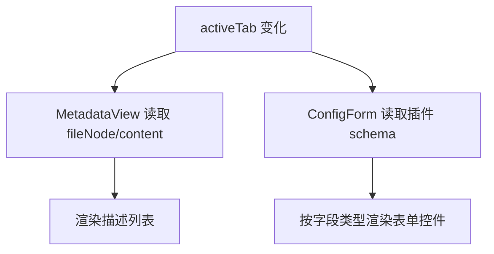
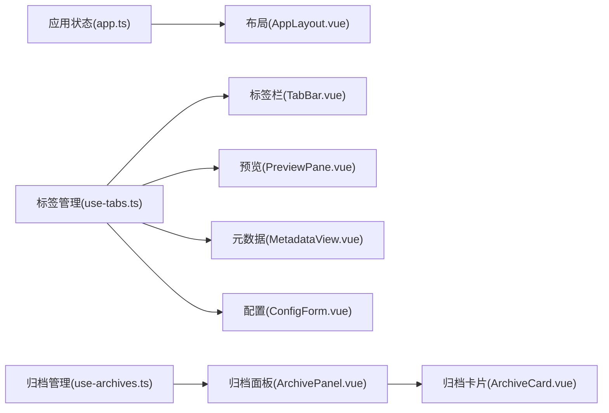

# 组件数据绑定

<cite>
**本文引用的文件**   
- [App.vue](file://src/App.vue)
- [AppLayout.vue](file://src/layout/AppLayout.vue)
- [Workspace.vue](file://src/components/workspace/Workspace.vue)
- [TabBar.vue](file://src/components/workspace/TabBar.vue)
- [PreviewPane.vue](file://src/components/workspace/PreviewPane.vue)
- [ArchivePanel.vue](file://src/components/archive-panel/ArchivePanel.vue)
- [ArchiveCard.vue](file://src/components/archive-panel/ArchiveCard.vue)
- [PropertyPanel.vue](file://src/components/property-panel/PropertyPanel.vue)
- [MetadataView.vue](file://src/components/property-panel/MetadataView.vue)
- [ConfigForm.vue](file://src/components/property-panel/ConfigForm.vue)
- [app.ts](file://src/stores/app.ts)
- [use-archives.ts](file://src/composables/use-archives.ts)
- [use-tabs.ts](file://src/composables/use-tabs.ts)
- [index.ts（类型）](file://src/types/index.ts)
</cite>

## 目录
1. [简介](#简介)
2. [项目结构](#项目结构)
3. [核心组件与数据流](#核心组件与数据流)
4. [架构总览](#架构总览)
5. [详细组件分析](#详细组件分析)
6. [依赖关系分析](#依赖关系分析)
7. [性能考虑](#性能考虑)
8. [故障排查指南](#故障排查指南)
9. [结论](#结论)
10. [附录：最佳实践与调试技巧](#附录最佳实践与调试技巧)

## 简介
本文件围绕 Hello-Tauri 项目的“三栏式布局”与“组件数据绑定”，系统阐述 Vue 3 响应式在复杂界面中的应用。重点覆盖以下方面：
- Workspace、ArchivePanel、PropertyPanel 等核心组件的数据流设计
- 三栏布局的折叠/展开与宽度控制机制
- 组件间通信模式（父子传递、兄弟事件、跨层级共享）
- 表单数据的动态绑定与处理策略
- 表格/列表的性能优化思路（虚拟滚动、分页加载、排序过滤）
- 响应式性能优化、内存管理与错误边界
- 代码级示例路径与调试技巧

## 项目结构
整体采用“顶部导航 + 三栏主体 + 底部状态”的布局，左侧为归档面板，中间为工作区（标签页 + 预览），右侧为属性面板。全局主题与应用状态由 Pinia 管理，各功能域通过组合式函数（composables）暴露响应式状态与方法。

图表来源
- [App.vue:1-24](file://src/App.vue#L1-L24)
- [AppLayout.vue:1-118](file://src/layout/AppLayout.vue#L1-L118)
- [Workspace.vue:1-36](file://src/components/workspace/Workspace.vue#L1-L36)
- [TabBar.vue:1-33](file://src/components/workspace/TabBar.vue#L1-L33)
- [PreviewPane.vue:1-58](file://src/components/workspace/PreviewPane.vue#L1-L58)
- [ArchivePanel.vue:1-24](file://src/components/archive-panel/ArchivePanel.vue#L1-L24)
- [PropertyPanel.vue:1-17](file://src/components/property-panel/PropertyPanel.vue#L1-L17)
- [MetadataView.vue:1-35](file://src/components/property-panel/MetadataView.vue#L1-L35)
- [ConfigForm.vue:1-37](file://src/components/property-panel/ConfigForm.vue#L1-L37)
- [app.ts:1-57](file://src/stores/app.ts#L1-L57)
- [use-tabs.ts:1-64](file://src/composables/use-tabs.ts#L1-L64)
- [use-archives.ts:1-60](file://src/composables/use-archives.ts#L1-L60)
- [index.ts（类型）:1-71](file://src/types/index.ts#L1-L71)

章节来源
- [App.vue:1-24](file://src/App.vue#L1-L24)
- [AppLayout.vue:1-118](file://src/layout/AppLayout.vue#L1-L118)

## 核心组件与数据流
- 应用状态（Pinia）
  - 主题切换、左右面板宽度、插件禁用列表等全局状态集中管理，供布局与组件读取与更新。
- 标签页状态（use-tabs）
  - 维护打开的标签集合、当前激活标签、以及标签对应的解析内容；提供打开/关闭/置顶等操作。
- 归档状态（use-archives）
  - 维护上传的归档任务、进度、文件树、统计信息；触发解压流程并更新状态。
- 预览渲染（PreviewPane）
  - 监听 activeTab 变化，按需解析文件内容，选择对应渲染器组件进行展示。
- 属性面板（MetadataView / ConfigForm）
  - 基于 activeTab 显示元数据与动态配置表单。

章节来源
- [app.ts:1-57](file://src/stores/app.ts#L1-L57)
- [use-tabs.ts:1-64](file://src/composables/use-tabs.ts#L1-L64)
- [use-archives.ts:1-60](file://src/composables/use-archives.ts#L1-L60)
- [PreviewPane.vue:1-58](file://src/components/workspace/PreviewPane.vue#L1-L58)
- [MetadataView.vue:1-35](file://src/components/property-panel/MetadataView.vue#L1-L35)
- [ConfigForm.vue:1-37](file://src/components/property-panel/ConfigForm.vue#L1-L37)

## 架构总览
下图展示了从用户交互到数据渲染的关键调用链，包括标签切换、内容解析与渲染、属性面板联动。

图表来源
- [TabBar.vue:1-33](file://src/components/workspace/TabBar.vue#L1-L33)
- [Workspace.vue:1-36](file://src/components/workspace/Workspace.vue#L1-L36)
- [PreviewPane.vue:1-58](file://src/components/workspace/PreviewPane.vue#L1-L58)
- [MetadataView.vue:1-35](file://src/components/property-panel/MetadataView.vue#L1-L35)
- [ConfigForm.vue:1-37](file://src/components/property-panel/ConfigForm.vue#L1-L37)

## 详细组件分析

### 三栏布局与面板宽度控制
- 布局结构
  - 顶部导航、主体三栏（左/中/右）、底部版权栏。
  - 左右面板支持折叠，中间区域自适应填充。
- 宽度与折叠
  - 布局内使用 ref 控制折叠状态；面板宽度可通过 store 方法设置并限制在最小/最大值之间。
  - 面板内部使用固定宽度的包裹层，避免折叠时内容挤压。
- 状态持久化
  - 当前实现未包含本地持久化逻辑；可在 setLeftPanelWidth/setRightPanelWidth 中接入 localStorage 或 Tauri 存储以保存布局偏好。

图表来源
- [AppLayout.vue:1-118](file://src/layout/AppLayout.vue#L1-L118)
- [app.ts:1-57](file://src/stores/app.ts#L1-L57)

章节来源
- [AppLayout.vue:1-118](file://src/layout/AppLayout.vue#L1-L118)
- [app.ts:1-57](file://src/stores/app.ts#L1-L57)

### 归档面板（ArchivePanel）与卡片（ArchiveCard）
- 数据源
  - 使用 useArchiveManager 提供的 archives 列表与 addFiles/remove/updateStatus/stats 等方法。
- 交互
  - 上传区域添加文件后触发解压流程；每个归档项以卡片形式展示状态、错误信息与文件树。
- 事件
  - 子组件通过 emit 向父组件抛出 remove/retry 事件，父组件调用 store 方法更新状态。

图表来源
- [ArchivePanel.vue:1-24](file://src/components/archive-panel/ArchivePanel.vue#L1-L24)
- [ArchiveCard.vue:1-41](file://src/components/archive-panel/ArchiveCard.vue#L1-L41)
- [use-archives.ts:1-60](file://src/composables/use-archives.ts#L1-L60)

章节来源
- [ArchivePanel.vue:1-24](file://src/components/archive-panel/ArchivePanel.vue#L1-L24)
- [ArchiveCard.vue:1-41](file://src/components/archive-panel/ArchiveCard.vue#L1-L41)
- [use-archives.ts:1-60](file://src/composables/use-archives.ts#L1-L60)

### 工作区（Workspace）与标签（TabBar）
- 标签管理
  - useTabManager 维护 tabs 与 activeTabId，并提供 open/close/activate/togglePin/closeAll/reset 等方法。
  - TabBar 将 activeTabId 与 Naive UI 的 NTabs value 双向绑定，并在关闭/切换时调用相应方法。
- 内容类型推导
  - Workspace 根据 activeTab.content.type 决定预览工具栏的类型与行为。

图表来源
- [TabBar.vue:1-33](file://src/components/workspace/TabBar.vue#L1-L33)
- [use-tabs.ts:1-64](file://src/composables/use-tabs.ts#L1-L64)
- [Workspace.vue:1-36](file://src/components/workspace/Workspace.vue#L1-L36)

章节来源
- [TabBar.vue:1-33](file://src/components/workspace/TabBar.vue#L1-L33)
- [use-tabs.ts:1-64](file://src/composables/use-tabs.ts#L1-L64)
- [Workspace.vue:1-36](file://src/components/workspace/Workspace.vue#L1-L36)

### 预览窗格（PreviewPane）与渲染器
- 懒加载解析引擎
  - 首次需要时创建 ParserEngine 实例，复用以避免重复开销。
- 内容解析与渲染
  - 监听 activeTab 变化，若尚未解析则调用 engine.resolveFile 获取 content，再根据扩展名选择渲染器组件并传入 content.data。
- 错误边界
  - 渲染器外层包裹 ErrorBoundary，防止单个渲染器崩溃影响整体。

图表来源
- [PreviewPane.vue:1-58](file://src/components/workspace/PreviewPane.vue#L1-L58)
- [use-tabs.ts:1-64](file://src/composables/use-tabs.ts#L1-L64)

章节来源
- [PreviewPane.vue:1-58](file://src/components/workspace/PreviewPane.vue#L1-L58)
- [use-tabs.ts:1-64](file://src/composables/use-tabs.ts#L1-L64)

### 属性面板（MetadataView / ConfigForm）
- 元数据视图
  - 基于 activeTab 显示文件名、路径、大小、类型、行数、解析插件等信息。
- 配置表单
  - 根据 activeTab 对应插件的配置 schema 动态生成表单字段（输入、选择、开关、数字）。
- 数据同步
  - 两者均通过 useTabManager 的 activeTab 保持与工作区一致。

图表来源
- [MetadataView.vue:1-35](file://src/components/property-panel/MetadataView.vue#L1-L35)
- [ConfigForm.vue:1-37](file://src/components/property-panel/ConfigForm.vue#L1-L37)
- [use-tabs.ts:1-64](file://src/composables/use-tabs.ts#L1-L64)

章节来源
- [MetadataView.vue:1-35](file://src/components/property-panel/MetadataView.vue#L1-L35)
- [ConfigForm.vue:1-37](file://src/components/property-panel/ConfigForm.vue#L1-L37)
- [use-tabs.ts:1-64](file://src/composables/use-tabs.ts#L1-L64)

### 类型与数据结构
- 关键类型
  - FileTreeNode、ParsedContent、ArchiveItem、TabItem、SearchMatch/SearchResults 等用于统一数据契约。
- 作用
  - 确保组件间传递的数据结构一致，便于 TypeScript 校验与 IDE 提示。

章节来源
- [index.ts（类型）:1-71](file://src/types/index.ts#L1-L71)

## 依赖关系分析
- 组件耦合
  - 布局对三个主面板弱耦合，仅负责结构与折叠控制。
  - 工作区与属性面板通过 useTabManager 共享 activeTab，形成松耦合的跨层级状态共享。
- 外部依赖
  - Naive UI 提供基础 UI 能力（Tabs、Descriptions、Form 等）。
  - 解析引擎与插件注册表在预览阶段按需加载与选择渲染器。

图表来源
- [app.ts:1-57](file://src/stores/app.ts#L1-L57)
- [AppLayout.vue:1-118](file://src/layout/AppLayout.vue#L1-L118)
- [use-tabs.ts:1-64](file://src/composables/use-tabs.ts#L1-L64)
- [TabBar.vue:1-33](file://src/components/workspace/TabBar.vue#L1-L33)
- [PreviewPane.vue:1-58](file://src/components/workspace/PreviewPane.vue#L1-L58)
- [MetadataView.vue:1-35](file://src/components/property-panel/MetadataView.vue#L1-L35)
- [ConfigForm.vue:1-37](file://src/components/property-panel/ConfigForm.vue#L1-L37)
- [use-archives.ts:1-60](file://src/composables/use-archives.ts#L1-L60)
- [ArchivePanel.vue:1-24](file://src/components/archive-panel/ArchivePanel.vue#L1-L24)
- [ArchiveCard.vue:1-41](file://src/components/archive-panel/ArchiveCard.vue#L1-L41)

章节来源
- [app.ts:1-57](file://src/stores/app.ts#L1-L57)
- [AppLayout.vue:1-118](file://src/layout/AppLayout.vue#L1-L118)
- [use-tabs.ts:1-64](file://src/composables/use-tabs.ts#L1-L64)
- [use-archives.ts:1-60](file://src/composables/use-archives.ts#L1-L60)

## 性能考虑
- 响应式粒度
  - 尽量使用 computed 派生值减少不必要的重渲染（如 contentType、activeTab）。
- 懒加载与缓存
  - 解析引擎实例延迟创建并复用，避免重复初始化成本。
- 渲染优化
  - 大列表场景建议引入虚拟滚动（例如 naivue 的 NDataTable 虚拟模式或第三方方案），仅渲染可视区域节点。
- 分页与增量加载
  - 大数据集采用分页或无限滚动，结合搜索与过滤在客户端或后端侧执行。
- 防抖与节流
  - 拖拽调整宽度、实时搜索等高频事件应使用防抖/节流降低计算压力。
- 内存管理
  - 关闭标签时清理已解析的大对象引用；归档完成后释放临时数据。

[本节为通用指导，不直接分析具体文件]

## 故障排查指南
- 预览空白或报错
  - 检查 activeTab 是否存在且 content 是否已解析；确认渲染器是否正确匹配扩展名。
- 标签无法关闭或切换异常
  - 核对 closeTab/activateTab 的实现与 NTabs 的 value 绑定一致性。
- 属性面板不同步
  - 确认 MetadataView/ConfigForm 是否依赖同一 activeTab 来源。
- 归档任务失败
  - 查看 ArchiveCard 的错误信息与重试入口；确认 updateStatus 的状态流转是否符合预期。

章节来源
- [PreviewPane.vue:1-58](file://src/components/workspace/PreviewPane.vue#L1-L58)
- [TabBar.vue:1-33](file://src/components/workspace/TabBar.vue#L1-L33)
- [MetadataView.vue:1-35](file://src/components/property-panel/MetadataView.vue#L1-L35)
- [ConfigForm.vue:1-37](file://src/components/property-panel/ConfigForm.vue#L1-L37)
- [ArchiveCard.vue:1-41](file://src/components/archive-panel/ArchiveCard.vue#L1-L41)
- [use-archives.ts:1-60](file://src/composables/use-archives.ts#L1-L60)

## 结论
本项目通过 Pinia 与组合式函数实现了清晰的数据流向与松耦合的组件协作。三栏布局具备可折叠与可扩展性，标签系统与预览渲染解耦良好，属性面板能随上下文动态呈现。后续可在面板宽度持久化、表单双向绑定与批量操作、表格虚拟化等方面进一步增强体验与性能。

[本节为总结，不直接分析具体文件]

## 附录：最佳实践与调试技巧
- 数据绑定最佳实践
  - 单一事实来源：将共享状态集中在 store/composable，组件只读或派发变更。
  - 明确 props/emits：父子组件通过 props 向下传值，通过 emits 向上通知。
  - 计算属性优先：用 computed 表达派生状态，减少模板中的复杂表达式。
- 表单数据绑定与验证
  - 使用框架表单库的 v-model 与规则校验；对异步提交进行防抖与乐观更新。
  - 实时预览：将表单值作为 computed 驱动预览组件，注意大对象深拷贝或结构化克隆的代价。
- 批量操作
  - 合并多次状态更新，使用事务式更新减少重渲染；必要时分片执行长任务。
- 表格与列表虚拟化
  - 启用虚拟滚动，配合分页与惰性加载；排序/过滤在数据层高效执行。
- 错误边界
  - 在渲染器外层包裹错误边界，捕获异常并降级展示友好提示。
- 调试技巧
  - 使用浏览器 DevTools 的 Vue 扩展观察响应式变量与组件树。
  - 在关键路径打印时间戳与耗时，定位性能瓶颈。
  - 针对拖拽/搜索等高频交互，记录事件频率与处理耗时。

[本节为通用指导，不直接分析具体文件]