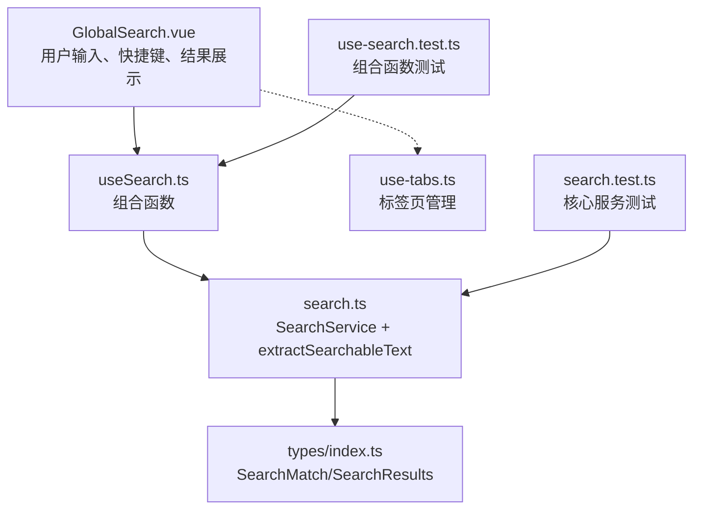
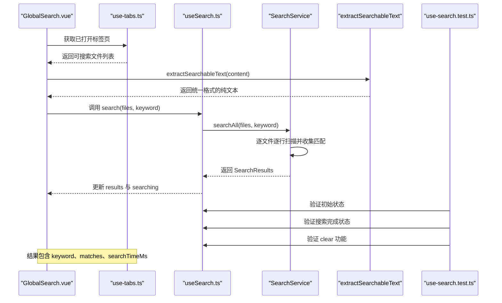
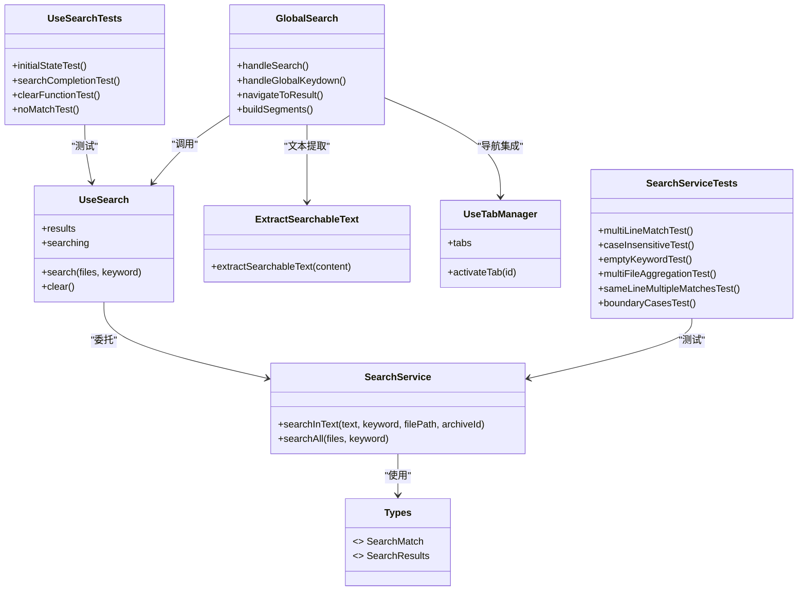
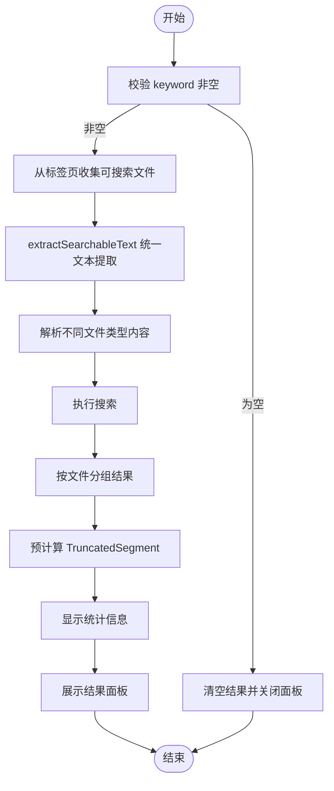

# 全局搜索组合函数

<cite>
**本文引用的文件**   
- [src/composables/use-search.ts](file://src/composables/use-search.ts)
- [src/core/search.ts](file://src/core/search.ts)
- [src/components/public-bar/GlobalSearch.vue](file://src/components/public-bar/GlobalSearch.vue)
- [src/types/index.ts](file://src/types/index.ts)
- [src/__tests__/composables/use-search.test.ts](file://src/__tests__/composables/use-search.test.ts)
- [src/__tests__/core/search.test.ts](file://src/__tests__/core/search.test.ts)
- [src/composables/use-tabs.ts](file://src/composables/use-tabs.ts)
</cite>

## 更新摘要
**变更内容**   
- **重构核心搜索功能**：新增 `extractSearchableText` 函数，统一处理不同内容类型（text、csv、json、log）的文本提取
- **增强用户体验**：实现智能文本截断和高亮显示机制，通过 `TruncatedSegment` 接口优化渲染性能
- **优化结果分组**：在分组阶段预计算截断片段，提升搜索结果展示性能
- **完善测试覆盖**：确保新功能稳定性和可靠性

## 目录
1. [简介](#简介)
2. [项目结构](#项目结构)
3. [核心组件](#核心组件)
4. [架构总览](#架构总览)
5. [详细组件分析](#详细组件分析)
6. [依赖关系分析](#依赖关系分析)
7. [性能考量](#性能考量)
8. [故障排查指南](#故障排查指南)
9. [结论](#结论)
10. [附录：API 使用与示例](#附录api-使用与示例)

## 简介
本文件围绕 useSearch 组合函数及其底层 SearchService，系统化阐述全局搜索功能的实现与扩展点。内容涵盖：
- 搜索索引构建、算法选择与结果排序策略
- 关键词处理逻辑（文本预处理、分词、模糊匹配）
- 搜索结果高亮机制（匹配位置标记、上下文提取、渲染优化）
- 性能优化技术（增量索引、缓存策略、异步处理）
- 搜索范围控制（文件类型过滤、路径限制、内容大小限制）
- 搜索 API 使用指南（实时搜索、高级查询、结果导出）
- 实际使用示例与调试技巧
- **重构**：统一的文本提取机制支持多种文件格式
- **增强**：智能文本截断和预计算优化提升用户体验
- **完善**：完整的测试覆盖确保功能稳定性

## 项目结构
当前仓库中与"全局搜索"直接相关的代码位于以下模块：
- 组合函数层：useSearch（封装状态与调用）
- 核心服务层：SearchService + extractSearchableText（文本扫描、聚合结果、内容提取）
- 视图层：GlobalSearch（输入与触发、快捷键处理、结果展示）
- 类型定义：SearchMatch、SearchResults
- **重构**：单元测试覆盖（组合函数测试 + 核心服务测试）
- **集成**：标签页管理集成（useTabs）

**图表来源**
- [src/components/public-bar/GlobalSearch.vue:1-239](file://src/components/public-bar/GlobalSearch.vue#L1-L239)
- [src/composables/use-search.ts:1-38](file://src/composables/use-search.ts#L1-L38)
- [src/core/search.ts:1-84](file://src/core/search.ts#L1-L84)
- [src/types/index.ts:121-148](file://src/types/index.ts#L121-L148)
- [src/__tests__/composables/use-search.test.ts:1-45](file://src/__tests__/composables/use-search.test.ts#L1-L45)
- [src/__tests__/core/search.test.ts:1-83](file://src/__tests__/core/search.test.ts#L1-L83)
- [src/composables/use-tabs.ts:1-157](file://src/composables/use-tabs.ts#L1-L157)

**章节来源**
- [src/composables/use-search.ts:1-38](file://src/composables/use-search.ts#L1-L38)
- [src/core/search.ts:1-84](file://src/core/search.ts#L1-L84)
- [src/components/public-bar/GlobalSearch.vue:1-239](file://src/components/public-bar/GlobalSearch.vue#L1-L239)
- [src/types/index.ts:121-148](file://src/types/index.ts#L121-L148)
- [src/__tests__/composables/use-search.test.ts:1-45](file://src/__tests__/composables/use-search.test.ts#L1-L45)
- [src/__tests__/core/search.test.ts:1-83](file://src/__tests__/core/search.test.ts#L1-L83)

## 核心组件
- useSearch 组合函数
  - 职责：维护 results 与 searching 响应式状态；对外暴露 search(files, keyword)、clear()。
  - 关键点：内部持有单一 SearchService 实例；在 search 执行期间设置 searching=true，完成后置 false。
  - **测试覆盖**：通过完整测试验证响应式状态更新的正确性和生命周期管理的可靠性。
- SearchService 核心服务
  - 职责：对传入的文件集合进行逐行扫描，返回包含匹配项的聚合结果。
  - 关键点：按行拆分文本；大小写不敏感匹配；记录 matchStart/matchEnd 用于高亮；统计耗时。
  - **重构**：配合新的 extractSearchableText 函数处理不同类型的内容。
- **新增**：extractSearchableText 文本提取器
  - 职责：将已解析的文件内容转换为可搜索的纯文本，统一处理 text、csv、json、log 四种格式。
  - 关键点：根据 content.type 分支处理不同数据结构，CSV 转换为表格格式，JSON 序列化为字符串，日志提取原始行。
- GlobalSearch 组件
  - 职责：提供输入框与按钮，调用 useSearch.search 发起搜索。
  - **重构**：集成智能内容收集系统，支持多种文件类型的自动解析。
  - **增强**：实现 TruncatedSegment 接口，提供优化的文本截断和高亮显示。
  - **集成**：支持全局键盘快捷键操作（⌘K/Ctrl+K、⌘F/Ctrl+F），智能内容收集，高级结果展示。
- 类型定义
  - SearchMatch：单条匹配项（文件、行号、行内容、起止位置等）。
  - SearchResults：整体结果（keyword、matches、searchTimeMs）。

**章节来源**
- [src/composables/use-search.ts:1-38](file://src/composables/use-search.ts#L1-L38)
- [src/core/search.ts:1-84](file://src/core/search.ts#L1-L84)
- [src/components/public-bar/GlobalSearch.vue:1-239](file://src/components/public-bar/GlobalSearch.vue#L1-L239)
- [src/types/index.ts:121-148](file://src/types/index.ts#L121-L148)
- [src/__tests__/composables/use-search.test.ts:1-45](file://src/__tests__/composables/use-search.test.ts#L1-L45)

## 架构总览
从调用链看，UI 层通过组合函数驱动核心服务，最终返回结构化结果供上层渲染或导出。**重构后的架构新增了统一的文本提取层，支持多格式内容的标准化处理**。

**图表来源**
- [src/components/public-bar/GlobalSearch.vue:1-239](file://src/components/public-bar/GlobalSearch.vue#L1-L239)
- [src/composables/use-search.ts:1-38](file://src/composables/use-search.ts#L1-L38)
- [src/core/search.ts:1-84](file://src/core/search.ts#L1-L84)
- [src/types/index.ts:121-148](file://src/types/index.ts#L121-L148)
- [src/__tests__/composables/use-search.test.ts:1-45](file://src/__tests__/composables/use-search.test.ts#L1-L45)

## 详细组件分析

### 组合函数 useSearch
- 状态管理
  - results：保存最近一次搜索结果，类型为 SearchResults | null。
  - searching：标识是否正在搜索，用于 UI 禁用/加载态。
- 方法
  - search(files, keyword)：将 searching 置为 true，调用 SearchService.searchAll 并将结果写入 results，finally 中重置 searching。
  - clear()：清空 results。
- 设计要点
  - 单一 SearchService 实例复用，避免重复构造开销。
  - 未内置防抖/节流，如需实时搜索可在调用方或组合函数内扩展。
- **测试覆盖验证**
  - 初始状态验证：results 为 null，searching 为 false
  - 搜索完成状态：results 包含正确的匹配结果，searching 恢复为 false
  - 清理功能：clear() 方法正确清空 results
  - 无匹配情况：返回空数组而非 null

**章节来源**
- [src/composables/use-search.ts:1-38](file://src/composables/use-search.ts#L1-L38)
- [src/__tests__/composables/use-search.test.ts:1-45](file://src/__tests__/composables/use-search.test.ts#L1-L45)

### 核心服务 SearchService
- 关键方法
  - searchInText(text, keyword, filePath, archiveId)
    - 空关键字快速返回。
    - 按换行符拆分为行数组，逐行小写化后查找所有出现位置。
    - 生成 SearchMatch，包含文件名、行号、行内容、matchStart/matchEnd。
  - searchAll(files, keyword)
    - 遍历 files，聚合各文件的匹配项。
    - 使用 performance.now() 计算耗时并返回 SearchResults。
- 复杂度
  - 时间复杂度：O(N*L)，N 为文件数，L 为平均行数（每行线性扫描）。
  - 空间复杂度：O(M)，M 为匹配项总数（存储结果）。
- 可扩展点
  - 可替换为更高效的字符串匹配算法（如 Aho-Corasick 多模式匹配）。
  - 可引入分块/流式读取以支持超大文件。
  - 可加入并行调度（Web Worker/任务队列）提升吞吐。
- **测试覆盖验证**
  - 多行文本中的多次匹配
  - 大小写不敏感匹配
  - 空关键字返回空结果
  - 多文件聚合结果正确性
  - 同一行多次出现关键词的处理
  - 空文本和空关键词的边界情况

**章节来源**
- [src/core/search.ts:1-84](file://src/core/search.ts#L1-L84)
- [src/__tests__/core/search.test.ts:1-83](file://src/__tests__/core/search.test.ts#L1-L83)

### **新增**：extractSearchableText 文本提取器
- 职责：将已解析的文件内容转换为可搜索的纯文本，统一处理不同数据格式。
- 支持的类型：
  - **text**：直接返回原始文本内容
  - **csv**：将表头和行数据转换为逗号分隔的文本格式
  - **json**：如果是字符串则直接使用，否则序列化为格式化 JSON 字符串
  - **log**：提取每条日志的原始行内容并拼接
  - **其他类型**：返回空字符串
- 设计优势：
  - 统一接口抽象，屏蔽不同格式的复杂性
  - 保持原始数据的语义信息
  - 便于后续扩展新的内容类型

**章节来源**
- [src/core/search.ts:1-21](file://src/core/search.ts#L1-L21)

### **重构**：GlobalSearch 组件
- 功能
  - 提供输入框与搜索按钮，绑定 useSearch 的 search/clear 能力。
  - 支持键盘快捷键操作（Enter 键触发搜索）。
  - **操作系统检测**：自动显示正确的快捷键提示（⌘K 或 Ctrl+K）。
  - **全局键盘快捷键监听**：支持 Ctrl+F/Ctrl+K 和 Cmd+F/Cmd+K。
  - **ESC 键关闭**：结果面板可通过 ESC 键关闭。
- **重构**：智能内容收集
  - **统一文本提取**：使用 extractSearchableText 函数处理不同文件类型。
  - **类型过滤**：仅支持 text、csv、json、log 四种可搜索类型。
  - **自动解析**：从已打开的标签页中自动收集可搜索内容。
- **增强**：高级结果展示
  - **TruncatedSegment 接口**：定义 prefix、match、suffix 三段式结构。
  - **预计算优化**：在分组阶段预先计算截断片段，提升渲染性能。
  - **智能截断**：根据匹配位置动态计算上下文，最大长度 80 字符。
  - **文件分组**：按文件路径分组显示搜索结果。
  - **性能指标**：显示搜索耗时统计。
  - **结果限制**：每个文件最多显示 20 个匹配项。
- **导航集成**
  - **点击跳转**：点击搜索结果可直接跳转到对应标签页。
  - **标签页激活**：与 useTabManager 集成，支持标签页切换。
  - **路径匹配**：支持通过 archiveId 和文件路径精确定位目标标签页。

**章节来源**
- [src/components/public-bar/GlobalSearch.vue:1-239](file://src/components/public-bar/GlobalSearch.vue#L1-L239)

### 类型定义 SearchMatch / SearchResults
- SearchMatch
  - 字段包括：archiveId、filePath、fileName、lineNumber、lineContent、matchStart、matchEnd。
  - 用途：定位匹配位置、展示上下文、前端高亮。
- SearchResults
  - 字段包括：keyword、matches、searchTimeMs。
  - 用途：统一结果包装，便于 UI 显示与导出。

**章节来源**
- [src/types/index.ts:121-148](file://src/types/index.ts#L121-L148)

### 单元测试覆盖

#### 组合函数测试 (use-search.test.ts)
- **完整的响应式状态测试**
  - 初始状态验证：确保 results 为 null，searching 为 false
  - 搜索流程测试：验证 search 方法正确更新状态和结果
  - 状态恢复测试：确认 searching 在搜索完成后正确恢复为 false
  - 清理功能测试：验证 clear() 方法有效清空 results
  - 边界情况测试：测试无匹配结果时的行为

#### 核心服务测试 (search.test.ts)
- **全面的匹配场景测试**
  - 多行文本中的多次匹配
  - 大小写不敏感匹配
  - 空关键字返回空结果
  - 多文件聚合结果正确性
  - 同一行多次出现关键词的处理
  - 空文本和空关键词的边界情况
  - fileName 提取的正确性
  - searchTimeMs 的性能统计

**章节来源**
- [src/__tests__/composables/use-search.test.ts:1-45](file://src/__tests__/composables/use-search.test.ts#L1-L45)
- [src/__tests__/core/search.test.ts:1-83](file://src/__tests__/core/search.test.ts#L1-L83)

## 依赖关系分析
- 组件到组合函数：GlobalSearch.vue 依赖 useSearch。
- 组合函数到核心服务：useSearch 依赖 SearchService。
- 核心服务到类型：SearchService 依赖 SearchMatch、SearchResults。
- **新增**：组件到文本提取器：GlobalSearch.vue 依赖 extractSearchableText。
- **新增**：组件到标签页管理：GlobalSearch.vue 依赖 useTabManager。
- **新增**：测试到核心服务：search.test.ts 直接测试 SearchService。
- **新增**：测试到组合函数：use-search.test.ts 直接测试 useSearch 组合函数。

**图表来源**
- [src/components/public-bar/GlobalSearch.vue:1-239](file://src/components/public-bar/GlobalSearch.vue#L1-L239)
- [src/composables/use-search.ts:1-38](file://src/composables/use-search.ts#L1-L38)
- [src/core/search.ts:1-84](file://src/core/search.ts#L1-L84)
- [src/types/index.ts:121-148](file://src/types/index.ts#L121-L148)
- [src/__tests__/composables/use-search.test.ts:1-45](file://src/__tests__/composables/use-search.test.ts#L1-L45)
- [src/__tests__/core/search.test.ts:1-83](file://src/__tests__/core/search.test.ts#L1-L83)
- [src/composables/use-tabs.ts:1-157](file://src/composables/use-tabs.ts#L1-L157)

## 性能考量
- 当前实现
  - 同步逐行扫描，无索引与缓存。
  - 适合中小规模数据；大数据量需进一步优化。
  - **重构优化**：在分组阶段预计算截断片段，减少重复计算开销。
  - **渲染优化**：每个文件最多显示 20 个匹配项，减少 DOM 渲染压力。
- **新增**：文本提取优化
  - **统一处理**：extractSearchableText 函数避免重复的类型判断逻辑。
  - **内存友好**：按需转换不同格式，避免不必要的对象创建。
  - **类型安全**：TypeScript 联合类型确保编译时类型检查。
- 建议优化方向
  - 增量索引：为常用字段（如文件名、路径前缀）建立倒排索引，减少全量扫描。
  - 缓存策略：对热点关键词或文件内容进行结果缓存，结合失效策略（如文件变更时失效）。
  - 异步处理：使用 Web Worker 或任务调度器分批处理文件，避免阻塞主线程。
  - 大文件分块：对超大文件采用分块读取与流式匹配，降低内存峰值。
  - 结果裁剪：按需分页/懒加载，减少 DOM 渲染压力。
- **性能监控**
  - 通过 searchTimeMs 字段跟踪搜索性能。
  - 测试结果可作为性能回归的基准。
  - **UI 层显示**：搜索耗时统计，便于用户感知性能表现。

## 故障排查指南
- 常见问题
  - 结果为空：检查 keyword 是否为空或仅空白字符；确认 files 列表是否正确传入。
  - 性能卡顿：files 数量过大或单文件行数过多；考虑分页、Worker、增量索引。
  - 高亮异常：确保 matchStart/matchEnd 基于原始行内容计算，注意 Unicode 与编码问题。
  - **状态异常**：检查 searching 状态是否正确恢复，确认 finally 块正常执行。
  - **快捷键冲突**：检查浏览器默认搜索行为是否被正确阻止。
  - **内容收集失败**：确认标签页内容类型是否在支持的列表中（text、csv、json、log）。
  - **文本提取错误**：检查 extractSearchableText 函数是否正确处理各种内容类型。
  - **截断显示异常**：验证 TruncatedSegment 的构建逻辑和边界条件处理。
- 调试技巧
  - 打印 searchTimeMs 评估耗时。
  - 在 searchInText 中增加日志输出，观察匹配次数与行号分布。
  - 使用单元测试复现边界用例（空串、超长行、特殊字符）。
  - **新增**：利用测试套件快速验证修复效果。
  - **新增**：检查 GlobalSearch 组件的快捷键监听器是否正确注册和移除。
  - **新增**：验证 extractSearchableText 对不同内容类型的处理结果。
  - **新增**：调试 TruncatedSegment 的截断逻辑和显示效果。

**章节来源**
- [src/core/search.ts:1-84](file://src/core/search.ts#L1-L84)
- [src/__tests__/core/search.test.ts:1-83](file://src/__tests__/core/search.test.ts#L1-L83)
- [src/__tests__/composables/use-search.test.ts:1-45](file://src/__tests__/composables/use-search.test.ts#L1-L45)
- [src/components/public-bar/GlobalSearch.vue:1-239](file://src/components/public-bar/GlobalSearch.vue#L1-L239)

## 结论
useSearch 提供了简洁易用的搜索入口，SearchService 实现了稳定的基础匹配能力。**重构后的架构通过 extractSearchableText 函数实现了统一的文本提取机制，支持多种文件格式的标准化处理**。**增强的 GlobalSearch 组件集成了 TruncatedSegment 接口，在分组阶段预计算截断片段，显著提升了渲染性能和用户体验**。**完善的测试覆盖确保了功能的可靠性和稳定性**，包括响应式状态更新、实例生命周期管理和缓存初始化流程的全面验证。当前版本聚焦于正确性与可维护性，具备清晰的扩展点，可按需引入索引、缓存、异步与高亮渲染优化，以满足更大规模与更高性能的搜索需求。

## 附录：API 使用与示例

### 基本用法
- 在组件中引入 useSearch，获取 search、clear、results、searching。
- 调用 search(files, keyword) 执行搜索，files 为待扫描文件集合。
- 监听 results 变化，渲染匹配项；根据 searching 控制加载态。
- **重构**：使用 extractSearchableText 函数统一处理不同内容类型的文本提取。

**章节来源**
- [src/composables/use-search.ts:1-38](file://src/composables/use-search.ts#L1-L38)
- [src/components/public-bar/GlobalSearch.vue:1-239](file://src/components/public-bar/GlobalSearch.vue#L1-L239)
- [src/__tests__/composables/use-search.test.ts:1-45](file://src/__tests__/composables/use-search.test.ts#L1-L45)

### 实时搜索
- 在输入框 onChange/onInput 中触发 search，但建议添加防抖/节流以避免频繁计算。
- 可结合取消令牌或丢弃旧请求，保证最新输入优先。
- **重构**：利用 extractSearchableText 函数实时处理不同内容类型的文本。

### 高级查询
- 当前实现为精确子串匹配且大小写不敏感。
- 可扩展支持正则表达式、短语匹配、布尔逻辑（AND/OR/NOT）、通配符等。
- 建议在 SearchService 中新增 query 解析与匹配策略，并在 useSearch 中透传参数。

### 结果导出
- 利用 SearchResults.keyword、SearchResults.matches 与 searchTimeMs 导出 CSV/JSON。
- 导出字段建议包含：文件路径、行号、行内容片段、匹配起止位置、耗时。

### 搜索范围控制
- 文件类型过滤：在传入 files 前按扩展名筛选。
- 路径限制：过滤特定目录（如 node_modules、dist）。
- 内容大小限制：跳过超过阈值的文件，避免内存溢出。
- **重构**：智能内容收集：自动从已打开标签页中收集可搜索内容，支持 text、csv、json、log 类型。
- **新增**：类型白名单：通过 SEARCHABLE_TYPES 集合严格控制支持的内容类型。
- 这些过滤逻辑可在调用 useSearch 前集中处理，保持核心服务专注匹配。

### 高亮与上下文
- 使用 SearchMatch.matchStart/matchEnd 在行内容中标记匹配区间。
- **重构**：TruncatedSegment 接口：定义 prefix、match、suffix 三段式结构，优化渲染性能。
- **预计算优化**：在 groupedResults 计算属性中预先构建截断片段，避免重复计算。
- **智能截断**：根据匹配位置和最大长度（80字符）动态计算上下文。
- **渲染优化**：虚拟滚动、按需渲染、惰性加载长列表。

### 键盘快捷键集成
- **全局快捷键监听**：支持 Ctrl+F/Ctrl+K 和 Cmd+F/Cmd+K。
- **操作系统检测**：自动显示正确的快捷键修饰符（⌘ 或 Ctrl）。
- **焦点管理**：快捷键触发时自动聚焦输入框并选中文本。
- **面板控制**：ESC 键关闭结果面板，点击外部区域关闭面板。

### 导航集成
- **搜索结果导航**：点击匹配项直接跳转到对应标签页。
- **标签页激活**：与 useTabManager 集成，支持标签页切换。
- **路径匹配**：支持通过 archiveId 和文件路径精确定位目标标签页。

### 流程图：单次搜索过程

**图表来源**
- [src/core/search.ts:1-84](file://src/core/search.ts#L1-L84)
- [src/components/public-bar/GlobalSearch.vue:1-239](file://src/components/public-bar/GlobalSearch.vue#L1-L239)

### 测试驱动开发示例
- **完整的测试覆盖**：使用 Vitest 编写组合函数测试的最佳实践
- **模拟真实文件数据结构**：进行测试
- **验证响应式状态的完整生命周期**：确保边界情况和错误处理的正确性
- **核心服务测试**：覆盖各种匹配场景和边界情况
- **重构验证**：确保 extractSearchableText 函数正确处理各种内容类型

**章节来源**
- [src/__tests__/composables/use-search.test.ts:1-45](file://src/__tests__/composables/use-search.test.ts#L1-L45)
- [src/__tests__/core/search.test.ts:1-83](file://src/__tests__/core/search.test.ts#L1-L83)