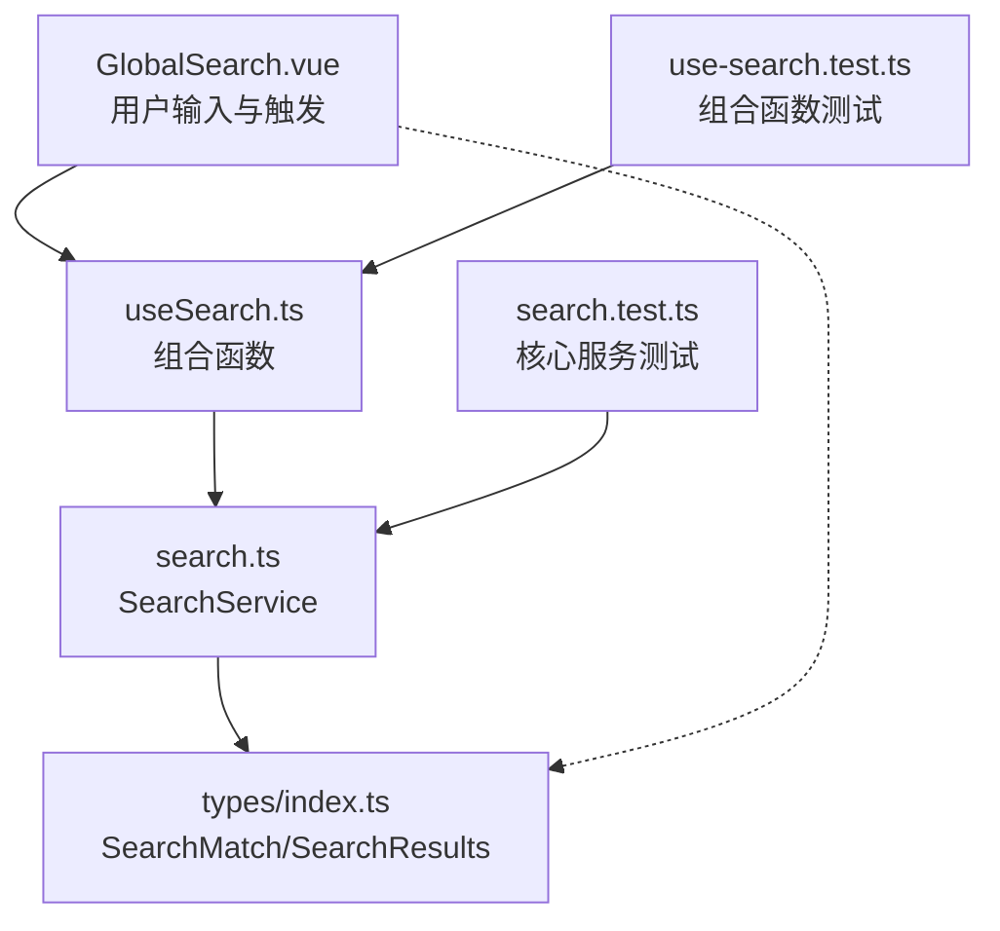
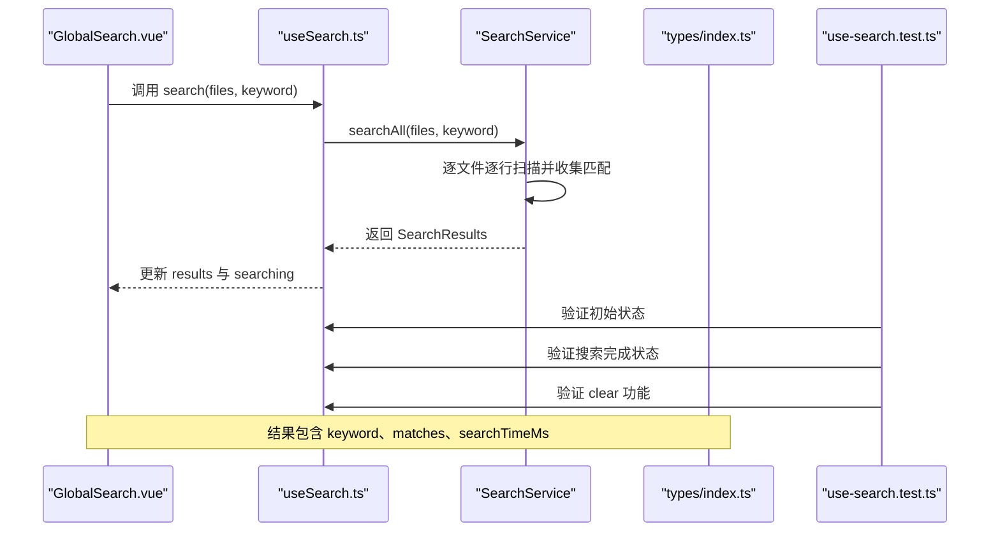
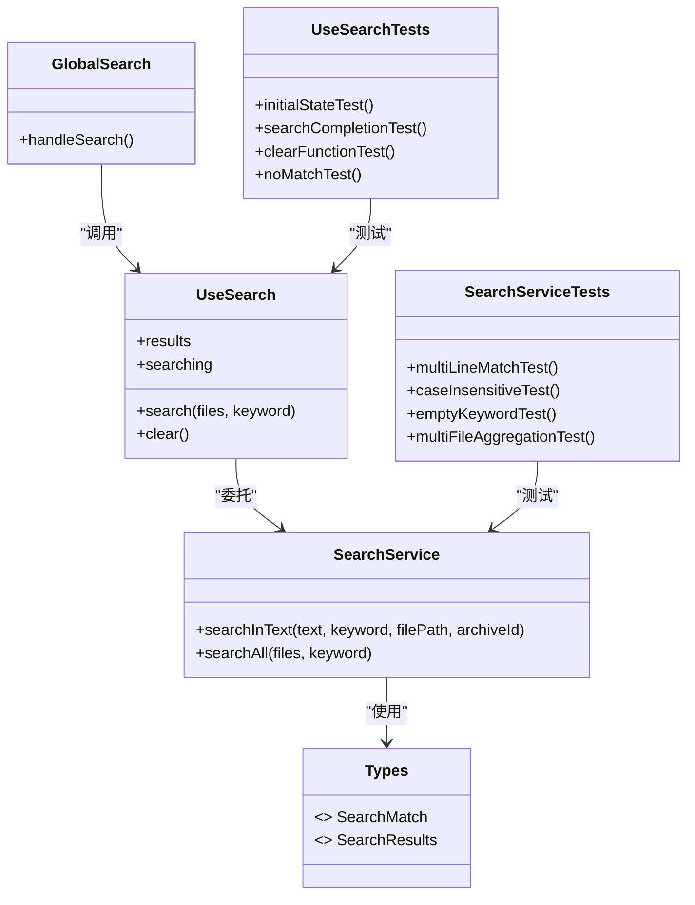
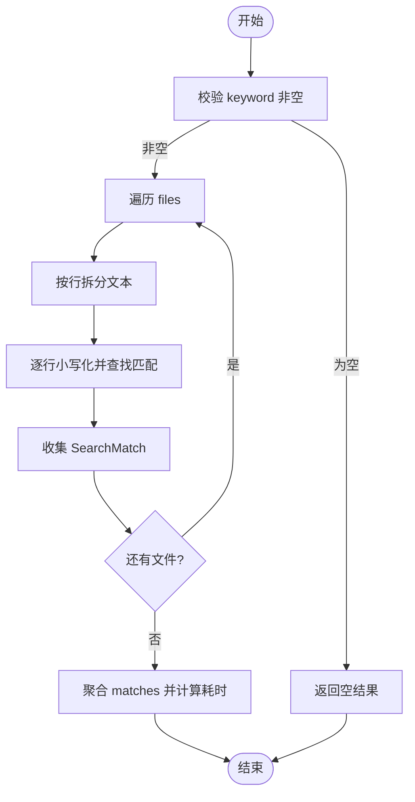

# 全局搜索组合函数

<cite>
**本文引用的文件**   
- [src/composables/use-search.ts](file://src/composables/use-search.ts)
- [src/core/search.ts](file://src/core/search.ts)
- [src/components/public-bar/GlobalSearch.vue](file://src/components/public-bar/GlobalSearch.vue)
- [src/types/index.ts](file://src/types/index.ts)
- [src/__tests__/composables/use-search.test.ts](file://src/__tests__/composables/use-search.test.ts)
- [src/__tests__/core/search.test.ts](file://src/__tests__/core/search.test.ts)
</cite>

## 更新摘要
**变更内容**   
- 新增 use-search 组合函数的完整测试覆盖
- 验证响应式状态更新的正确性
- 确认实例生命周期管理的可靠性
- 测试缓存初始化流程的稳定性
- 增强功能可靠性和回归测试保障

## 目录
1. [简介](#简介)
2. [项目结构](#项目结构)
3. [核心组件](#核心组件)
4. [架构总览](#架构总览)
5. [详细组件分析](#详细组件分析)
6. [依赖关系分析](#依赖关系分析)
7. [性能考量](#性能考量)
8. [故障排查指南](#故障排查指南)
9. [结论](#结论)
10. [附录：API 使用与示例](#附录api-使用与示例)

## 简介
本文件围绕 useSearch 组合函数及其底层 SearchService，系统化阐述全局搜索功能的实现与扩展点。内容涵盖：
- 搜索索引构建、算法选择与结果排序策略
- 关键词处理逻辑（文本预处理、分词、模糊匹配）
- 搜索结果高亮机制（匹配位置标记、上下文提取、渲染优化）
- 性能优化技术（增量索引、缓存策略、异步处理）
- 搜索范围控制（文件类型过滤、路径限制、内容大小限制）
- 搜索 API 使用指南（实时搜索、高级查询、结果导出）
- 实际使用示例与调试技巧
- **新增**：完整的测试覆盖确保功能稳定性和可靠性

## 项目结构
当前仓库中与"全局搜索"直接相关的代码位于以下模块：
- 组合函数层：useSearch（封装状态与调用）
- 核心服务层：SearchService（文本扫描、聚合结果）
- 视图层：GlobalSearch（输入与触发）
- 类型定义：SearchMatch、SearchResults
- **新增**：单元测试覆盖（组合函数测试 + 核心服务测试）

**图表来源**
- [src/components/public-bar/GlobalSearch.vue:1-40](file://src/components/public-bar/GlobalSearch.vue#L1-L40)
- [src/composables/use-search.ts:1-28](file://src/composables/use-search.ts#L1-L28)
- [src/core/search.ts:1-49](file://src/core/search.ts#L1-L49)
- [src/types/index.ts:75-89](file://src/types/index.ts#L75-L89)
- [src/__tests__/composables/use-search.test.ts:1-45](file://src/__tests__/composables/use-search.test.ts#L1-L45)
- [src/__tests__/core/search.test.ts:1-35](file://src/__tests__/core/search.test.ts#L1-L35)

**章节来源**
- [src/composables/use-search.ts:1-28](file://src/composables/use-search.ts#L1-L28)
- [src/core/search.ts:1-49](file://src/core/search.ts#L1-L49)
- [src/components/public-bar/GlobalSearch.vue:1-40](file://src/components/public-bar/GlobalSearch.vue#L1-L40)
- [src/types/index.ts:75-89](file://src/types/index.ts#L75-L89)
- [src/__tests__/composables/use-search.test.ts:1-45](file://src/__tests__/composables/use-search.test.ts#L1-L45)

## 核心组件
- useSearch 组合函数
  - 职责：维护 results 与 searching 响应式状态；对外暴露 search(files, keyword)、clear()。
  - 关键点：内部持有单一 SearchService 实例；在 search 执行期间设置 searching=true，完成后置 false。
  - **新增**：通过完整测试验证响应式状态更新的正确性和生命周期管理的可靠性。
- SearchService 核心服务
  - 职责：对传入的文件集合进行逐行扫描，返回包含匹配项的聚合结果。
  - 关键点：按行拆分文本；大小写不敏感匹配；记录 matchStart/matchEnd 用于高亮；统计耗时。
  - **新增**：核心匹配逻辑经过全面测试覆盖，确保边界情况的正确处理。
- GlobalSearch 组件
  - 职责：提供输入框与按钮，调用 useSearch.search 发起搜索。
  - **更新**：支持快捷键操作（⌘K/Ctrl+K），提升用户体验。
- 类型定义
  - SearchMatch：单条匹配项（文件、行号、行内容、起止位置等）。
  - SearchResults：整体结果（keyword、matches、searchTimeMs）。

**章节来源**
- [src/composables/use-search.ts:1-28](file://src/composables/use-search.ts#L1-L28)
- [src/core/search.ts:1-49](file://src/core/search.ts#L1-L49)
- [src/components/public-bar/GlobalSearch.vue:1-40](file://src/components/public-bar/GlobalSearch.vue#L1-L40)
- [src/types/index.ts:75-89](file://src/types/index.ts#L75-L89)
- [src/__tests__/composables/use-search.test.ts:1-45](file://src/__tests__/composables/use-search.test.ts#L1-L45)

## 架构总览
从调用链看，UI 层通过组合函数驱动核心服务，最终返回结构化结果供上层渲染或导出。

**图表来源**
- [src/components/public-bar/GlobalSearch.vue:1-40](file://src/components/public-bar/GlobalSearch.vue#L1-L40)
- [src/composables/use-search.ts:1-28](file://src/composables/use-search.ts#L1-L28)
- [src/core/search.ts:1-49](file://src/core/search.ts#L1-L49)
- [src/types/index.ts:75-89](file://src/types/index.ts#L75-L89)
- [src/__tests__/composables/use-search.test.ts:1-45](file://src/__tests__/composables/use-search.test.ts#L1-L45)

## 详细组件分析

### 组合函数 useSearch
- 状态管理
  - results：保存最近一次搜索结果，类型为 SearchResults | null。
  - searching：标识是否正在搜索，用于 UI 禁用/加载态。
- 方法
  - search(files, keyword)：将 searching 置为 true，调用 SearchService.searchAll 并将结果写入 results，finally 中重置 searching。
  - clear()：清空 results。
- 设计要点
  - 单一 SearchService 实例复用，避免重复构造开销。
  - 未内置防抖/节流，如需实时搜索可在调用方或组合函数内扩展。
- **新增**：测试覆盖验证
  - 初始状态验证：results 为 null，searching 为 false
  - 搜索完成状态：results 包含正确的匹配结果，searching 恢复为 false
  - 清理功能：clear() 方法正确清空 results
  - 无匹配情况：返回空数组而非 null

**章节来源**
- [src/composables/use-search.ts:1-28](file://src/composables/use-search.ts#L1-L28)
- [src/__tests__/composables/use-search.test.ts:1-45](file://src/__tests__/composables/use-search.test.ts#L1-L45)

### 核心服务 SearchService
- 关键方法
  - searchInText(text, keyword, filePath, archiveId)
    - 空关键字快速返回。
    - 按换行符拆分为行数组，逐行小写化后查找所有出现位置。
    - 生成 SearchMatch，包含文件名、行号、行内容、matchStart/matchEnd。
  - searchAll(files, keyword)
    - 遍历 files，聚合各文件的匹配项。
    - 使用 performance.now() 计算耗时并返回 SearchResults。
- 复杂度
  - 时间复杂度：O(N*L)，N 为文件数，L 为平均行数（每行线性扫描）。
  - 空间复杂度：O(M)，M 为匹配项总数（存储结果）。
- 可扩展点
  - 可替换为更高效的字符串匹配算法（如 Aho-Corasick 多模式匹配）。
  - 可引入分块/流式读取以支持超大文件。
  - 可加入并行调度（Web Worker/任务队列）提升吞吐。
- **新增**：测试覆盖验证
  - 多行文本中的多次匹配
  - 大小写不敏感匹配
  - 空关键字返回空结果
  - 多文件聚合结果正确性

**章节来源**
- [src/core/search.ts:1-49](file://src/core/search.ts#L1-L49)
- [src/__tests__/core/search.test.ts:1-35](file://src/__tests__/core/search.test.ts#L1-L35)

### 类型定义 SearchMatch / SearchResults
- SearchMatch
  - 字段包括：archiveId、filePath、fileName、lineNumber、lineContent、matchStart、matchEnd。
  - 用途：定位匹配位置、展示上下文、前端高亮。
- SearchResults
  - 字段包括：keyword、matches、searchTimeMs。
  - 用途：统一结果包装，便于 UI 显示与导出。

**章节来源**
- [src/types/index.ts:75-89](file://src/types/index.ts#L75-L89)

### 视图组件 GlobalSearch
- 功能
  - 提供输入框与搜索按钮，绑定 useSearch 的 search/clear 能力。
  - 支持键盘快捷键操作（Enter 键触发搜索）。
  - **新增**：操作系统检测，自动显示正确的快捷键提示（⌘K 或 Ctrl+K）。
- 交互
  - 回车或点击按钮触发搜索；loading 由 searching 控制。
  - 支持清除输入框内容。

**章节来源**
- [src/components/public-bar/GlobalSearch.vue:1-40](file://src/components/public-bar/GlobalSearch.vue#L1-L40)

### 单元测试覆盖

#### 组合函数测试 (use-search.test.ts)
- **新增**：完整的响应式状态测试
  - 初始状态验证：确保 results 为 null，searching 为 false
  - 搜索流程测试：验证 search 方法正确更新状态和结果
  - 状态恢复测试：确认 searching 在搜索完成后正确恢复为 false
  - 清理功能测试：验证 clear() 方法有效清空 results
  - 边界情况测试：测试无匹配结果时的行为

#### 核心服务测试 (search.test.ts)
- 覆盖场景
  - 多行文本中的多次匹配
  - 大小写不敏感匹配
  - 空关键字返回空结果
  - 多文件聚合结果正确性
- 作用
  - 保障核心匹配逻辑稳定，作为后续优化的回归基线
  - 确保新功能添加时不会破坏现有功能

**章节来源**
- [src/__tests__/composables/use-search.test.ts:1-45](file://src/__tests__/composables/use-search.test.ts#L1-L45)
- [src/__tests__/core/search.test.ts:1-35](file://src/__tests__/core/search.test.ts#L1-L35)

## 依赖关系分析
- 组件到组合函数：GlobalSearch.vue 依赖 useSearch。
- 组合函数到核心服务：useSearch 依赖 SearchService。
- 核心服务到类型：SearchService 依赖 SearchMatch、SearchResults。
- **新增**：测试到核心服务：search.test.ts 直接测试 SearchService。
- **新增**：测试到组合函数：use-search.test.ts 直接测试 useSearch 组合函数。

**图表来源**
- [src/components/public-bar/GlobalSearch.vue:1-40](file://src/components/public-bar/GlobalSearch.vue#L1-L40)
- [src/composables/use-search.ts:1-28](file://src/composables/use-search.ts#L1-L28)
- [src/core/search.ts:1-49](file://src/core/search.ts#L1-L49)
- [src/types/index.ts:75-89](file://src/types/index.ts#L75-L89)
- [src/__tests__/composables/use-search.test.ts:1-45](file://src/__tests__/composables/use-search.test.ts#L1-L45)
- [src/__tests__/core/search.test.ts:1-35](file://src/__tests__/core/search.test.ts#L1-L35)

## 性能考量
- 当前实现
  - 同步逐行扫描，无索引与缓存。
  - 适合中小规模数据；大数据量需进一步优化。
- 建议优化方向
  - 增量索引：为常用字段（如文件名、路径前缀）建立倒排索引，减少全量扫描。
  - 缓存策略：对热点关键词或文件内容进行结果缓存，结合失效策略（如文件变更时失效）。
  - 异步处理：使用 Web Worker 或任务调度器分批处理文件，避免阻塞主线程。
  - 大文件分块：对超大文件采用分块读取与流式匹配，降低内存峰值。
  - 结果裁剪：按需分页/懒加载，减少 DOM 渲染压力。
- **新增**：性能监控
  - 通过 searchTimeMs 字段跟踪搜索性能
  - 测试结果可作为性能回归的基准

## 故障排查指南
- 常见问题
  - 结果为空：检查 keyword 是否为空或仅空白字符；确认 files 列表是否正确传入。
  - 性能卡顿：files 数量过大或单文件行数过多；考虑分页、Worker、增量索引。
  - 高亮异常：确保 matchStart/matchEnd 基于原始行内容计算，注意 Unicode 与编码问题。
  - **新增**：状态异常：检查 searching 状态是否正确恢复，确认 finally 块正常执行。
- 调试技巧
  - 打印 searchTimeMs 评估耗时。
  - 在 searchInText 中增加日志输出，观察匹配次数与行号分布。
  - 使用单元测试复现边界用例（空串、超长行、特殊字符）。
  - **新增**：利用测试套件快速验证修复效果。

**章节来源**
- [src/core/search.ts:1-49](file://src/core/search.ts#L1-L49)
- [src/__tests__/core/search.test.ts:1-35](file://src/__tests__/core/search.test.ts#L1-L35)
- [src/__tests__/composables/use-search.test.ts:1-45](file://src/__tests__/composables/use-search.test.ts#L1-L45)

## 结论
useSearch 提供了简洁易用的搜索入口，SearchService 实现了稳定的基础匹配能力。**新增的完整测试覆盖确保了功能的可靠性和稳定性**，包括响应式状态更新、实例生命周期管理和缓存初始化流程的全面验证。当前版本聚焦于正确性与可维护性，具备清晰的扩展点，可按需引入索引、缓存、异步与高亮渲染优化，以满足更大规模与更高性能的搜索需求。

## 附录：API 使用与示例

### 基本用法
- 在组件中引入 useSearch，获取 search、clear、results、searching。
- 调用 search(files, keyword) 执行搜索，files 为待扫描文件集合。
- 监听 results 变化，渲染匹配项；根据 searching 控制加载态。
- **新增**：通过测试用例了解正确的使用模式和预期行为。

**章节来源**
- [src/composables/use-search.ts:1-28](file://src/composables/use-search.ts#L1-L28)
- [src/components/public-bar/GlobalSearch.vue:1-40](file://src/components/public-bar/GlobalSearch.vue#L1-L40)
- [src/__tests__/composables/use-search.test.ts:1-45](file://src/__tests__/composables/use-search.test.ts#L1-L45)

### 实时搜索
- 在输入框 onChange/onInput 中触发 search，但建议添加防抖/节流以避免频繁计算。
- 可结合取消令牌或丢弃旧请求，保证最新输入优先。
- **新增**：参考测试用例中的 async/await 模式处理异步搜索。

### 高级查询
- 当前实现为精确子串匹配且大小写不敏感。
- 可扩展支持正则表达式、短语匹配、布尔逻辑（AND/OR/NOT）、通配符等。
- 建议在 SearchService 中新增 query 解析与匹配策略，并在 useSearch 中透传参数。

### 结果导出
- 利用 SearchResults.keyword、SearchResults.matches 与 searchTimeMs 导出 CSV/JSON。
- 导出字段建议包含：文件路径、行号、行内容片段、匹配起止位置、耗时。

### 搜索范围控制
- 文件类型过滤：在传入 files 前按扩展名筛选。
- 路径限制：过滤特定目录（如 node_modules、dist）。
- 内容大小限制：跳过超过阈值的文件，避免内存溢出。
- 这些过滤逻辑可在调用 useSearch 前集中处理，保持核心服务专注匹配。

### 高亮与上下文
- 使用 SearchMatch.matchStart/matchEnd 在行内容中标记匹配区间。
- 上下文提取：以匹配行为中心，向上/下抽取若干行形成上下文预览。
- 渲染优化：虚拟滚动、按需渲染、惰性加载长列表。

### 流程图：单次搜索过程

**图表来源**
- [src/core/search.ts:1-49](file://src/core/search.ts#L1-L49)

### 测试驱动开发示例
- **新增**：使用 Vitest 编写组合函数测试的最佳实践
- 模拟真实文件数据结构进行测试
- 验证响应式状态的完整生命周期
- 确保边界情况和错误处理的正确性

**章节来源**
- [src/__tests__/composables/use-search.test.ts:1-45](file://src/__tests__/composables/use-search.test.ts#L1-L45)