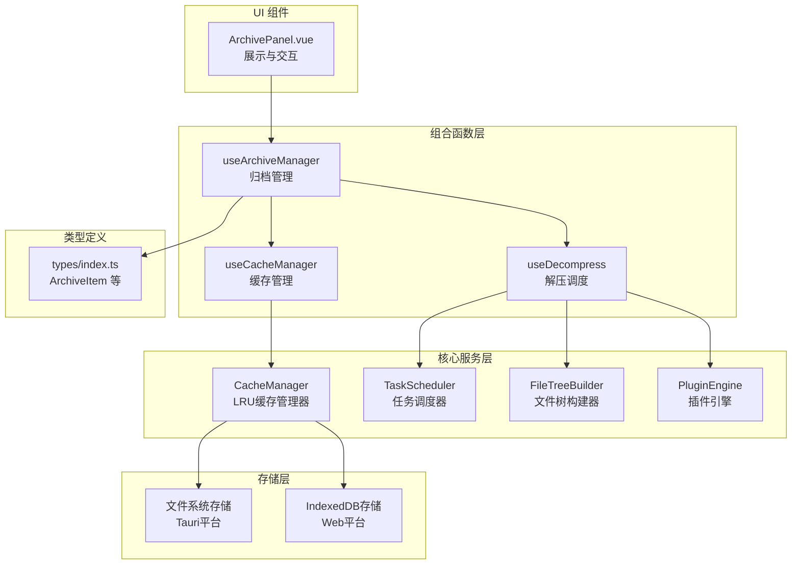
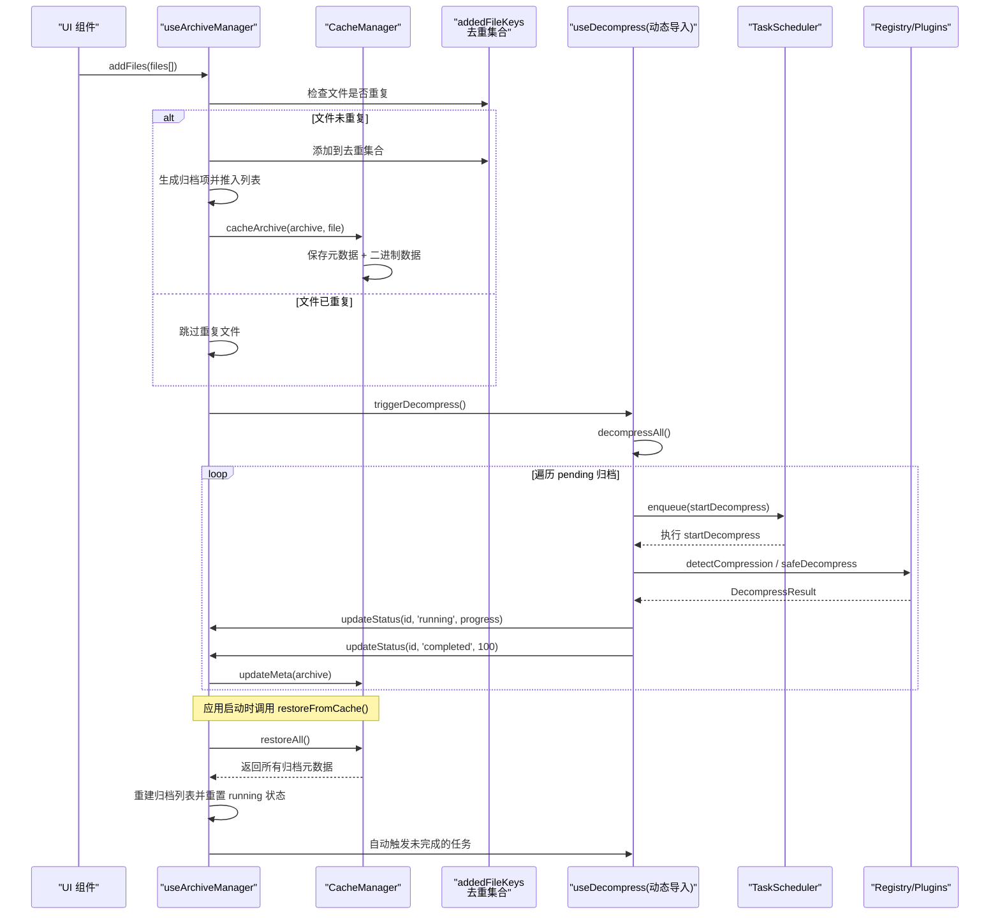
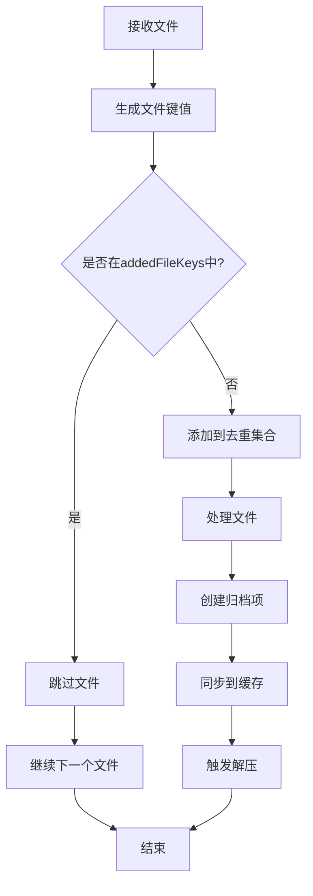
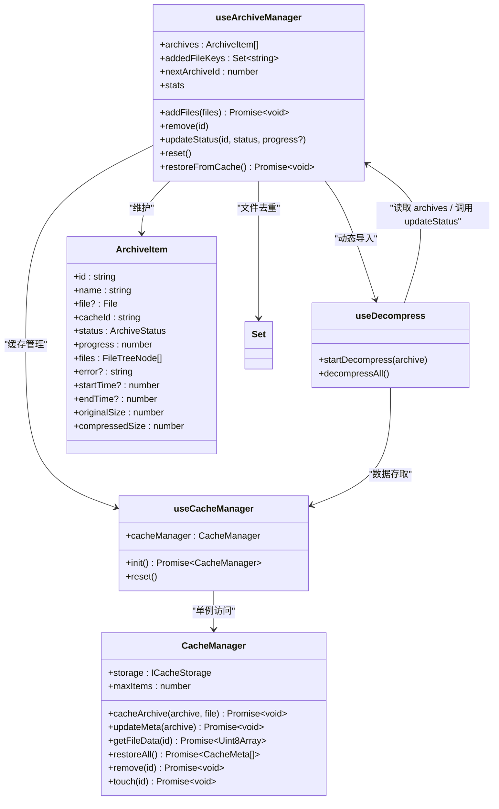

# 归档管理组合函数

<cite>
**本文引用的文件**   
- [src/composables/use-archives.ts](file://src/composables/use-archives.ts)
- [src/types/index.ts](file://src/types/index.ts)
- [src/composables/use-decompress.ts](file://src/composables/use-decompress.ts)
- [src/composables/use-cache.ts](file://src/composables/use-cache.ts)
- [src/core/cache-manager.ts](file://src/core/cache-manager.ts)
- [src/components/archive-panel/ArchivePanel.vue](file://src/components/archive-panel/ArchivePanel.vue)
- [src/__tests__/composables/use-archives.test.ts](file://src/__tests__/composables/use-archives.test.ts)
</cite>

## 更新摘要
**变更内容**   
- 新增完整的缓存系统集成，支持归档数据的持久化存储和恢复
- 实现异步文件处理流程，确保缓存写入完成后才触发解压
- 添加失败解压任务的自动重试机制，支持应用重启后继续未完成的任务
- 优化统计计算逻辑，提升性能并支持更精确的数据统计
- 增强文件去重机制，支持缓存恢复文件和会话内文件的智能去重
- 扩展 ArchiveItem 数据结构，新增 cacheId 字段和可选的 file 引用

## 目录
1. [简介](#简介)
2. [项目结构](#项目结构)
3. [核心组件](#核心组件)
4. [架构总览](#架构总览)
5. [详细组件分析](#详细组件分析)
6. [依赖关系分析](#依赖关系分析)
7. [性能考量](#性能考量)
8. [故障排查指南](#故障排查指南)
9. [结论](#结论)
10. [附录：API 使用示例与集成模式](#附录api-使用示例与集成模式)

## 简介
本文件为 useArchives（实际导出名为 useArchiveManager）组合函数的技术文档，聚焦于"文件归档管理"的核心逻辑。内容涵盖数据结构设计、文件添加流程、状态管理机制、异步解压触发机制、进度与时间戳记录、统计计算属性等，并提供 API 使用示例与集成建议，帮助读者快速理解并正确集成该模块。

**重大更新** 新增了完整的缓存系统集成，实现了归档数据的持久化存储和应用重启后的自动恢复功能，同时增强了文件去重机制和异步处理能力。

## 项目结构
useArchiveManager 位于 composables 层，负责维护归档列表、提供增删改查与统计能力；通过动态导入懒加载 useDecompress 以触发解压任务；与 useCacheManager 深度集成实现数据持久化；类型定义集中于 types 模块；UI 侧通过 ArchivePanel 消费 archives 数据。



**图表来源**
- [src/composables/use-archives.ts:1-168](file://src/composables/use-archives.ts#L1-L168)
- [src/composables/use-cache.ts:1-51](file://src/composables/use-cache.ts#L1-L51)
- [src/core/cache-manager.ts:1-144](file://src/core/cache-manager.ts#L1-L144)
- [src/composables/use-decompress.ts:1-89](file://src/composables/use-decompress.ts#L1-L89)
- [src/types/index.ts:1-90](file://src/types/index.ts#L1-L90)
- [src/components/archive-panel/ArchivePanel.vue:1-23](file://src/components/archive-panel/ArchivePanel.vue#L1-L23)

章节来源
- [src/composables/use-archives.ts:1-168](file://src/composables/use-archives.ts#L1-L168)
- [src/composables/use-cache.ts:1-51](file://src/composables/use-cache.ts#L1-L51)
- [src/core/cache-manager.ts:1-144](file://src/core/cache-manager.ts#L1-L144)
- [src/types/index.ts:1-90](file://src/types/index.ts#L1-L90)
- [src/components/archive-panel/ArchivePanel.vue:1-23](file://src/components/archive-panel/ArchivePanel.vue#L1-L23)

## 核心组件
- **useArchiveManager**：维护全局归档列表、提供 addFiles/remove/updateStatus/stats/reset/restoreFromCache 等方法，包含智能文件去重和缓存集成功能。
- **ArchiveItem**：归档项的数据模型，包含标识、名称、可选的原始 File 引用、缓存ID、状态、进度、文件树、错误信息、起止时间与大小统计等字段。
- **useCacheManager**：缓存管理器适配器，根据运行平台选择对应的存储后端（文件系统或 IndexedDB），提供单例访问接口。
- **CacheManager**：LRU 缓存管理器，负责归档数据的持久化存储、按需读取、元数据管理和 LRU 淘汰策略。
- **useDecompress**：由 useArchiveManager 动态导入，负责将 pending 状态的归档项加入任务队列执行解压，并通过 updateStatus 更新状态与进度。

**重大更新** 新增了完整的缓存生态系统，实现了归档数据的持久化存储和应用生命周期管理。

章节来源
- [src/composables/use-archives.ts:1-168](file://src/composables/use-archives.ts#L1-L168)
- [src/composables/use-cache.ts:1-51](file://src/composables/use-cache.ts#L1-L51)
- [src/core/cache-manager.ts:1-144](file://src/core/cache-manager.ts#L1-L144)
- [src/types/index.ts:50-65](file://src/types/index.ts#L50-L65)
- [src/composables/use-decompress.ts:1-89](file://src/composables/use-decompress.ts#L1-L89)

## 架构总览
useArchiveManager 作为"状态与编排中心"，在接收到新文件后创建归档项并触发解压；useCacheManager 提供跨平台的缓存服务；useDecompress 则基于插件引擎与任务调度器完成实际的解压工作，并在过程中回调 updateStatus 更新 UI 可见的状态与进度。整个系统支持应用重启后的状态恢复和失败任务的自动重试。



**图表来源**
- [src/composables/use-archives.ts:18-51](file://src/composables/use-archives.ts#L18-L51)
- [src/composables/use-archives.ts:107-150](file://src/composables/use-archives.ts#L107-L150)
- [src/composables/use-decompress.ts:16-85](file://src/composables/use-decompress.ts#L16-L85)
- [src/core/cache-manager.ts:36-83](file://src/core/cache-manager.ts#L36-L83)

## 详细组件分析

### 数据结构：ArchiveItem
- **标识与元信息**：id、name、file（可选的 File 引用）、cacheId（缓存键）
- **状态与进度**：status、progress
- **结果与错误**：files（文件树）、error
- **时间维度**：startTime、endTime
- **容量维度**：originalSize、compressedSize

**重要变更**：file 字段变为可选，仅在当次会话上传时有值；新增 cacheId 字段用于缓存数据访问。

复杂度与影响
- 空间复杂度：每个归档项 O(1)，文件树按实际节点数线性增长。
- 访问与更新：基于 id 的查找为 O(n)，n 为归档数量；通常 n 较小，开销可接受。
- 内存优化：缓存恢复的归档不持有 File 引用，减少内存占用。

章节来源
- [src/types/index.ts:50-65](file://src/types/index.ts#L50-L65)

### 文件去重机制：addedFileKeys 与 fileKey
**增强功能** 实现了智能文件去重逻辑，支持会话内文件去重和缓存恢复文件的去重。

- **addedFileKeys**：Set<string> 类型的集合，存储已上传文件的唯一标识符
- **fileKey 函数**：生成文件唯一标识符，基于文件名、大小和最后修改时间戳的组合
- **去重策略**：
  - 会话内：使用 `name:size:lastModified` 格式
  - 缓存恢复：使用 `restored:cacheId` 格式防止重复
  - 混合去重：同时使用简单键 `name:size:lastModified` 防止同名同大小文件



**图表来源**
- [src/composables/use-archives.ts:11-26](file://src/composables/use-archives.ts#L11-L26)
- [src/composables/use-archives.ts:110-117](file://src/composables/use-archives.ts#L110-L117)

章节来源
- [src/composables/use-archives.ts:11-26](file://src/composables/use-archives.ts#L11-L26)
- [src/composables/use-archives.ts:110-117](file://src/composables/use-archives.ts#L110-L117)

### 异步文件添加流程：addFiles
- **输入**：File[]
- **处理**：
  - **去重过滤**：遍历文件数组，使用 fileKey 生成唯一标识，通过 addedFileKeys 检查重复性
  - 为每个唯一 File 生成唯一 id（前缀 + 自增计数器），设置初始 status 为 pending，progress 为 0，files 为空数组，originalSize 为 0，compressedSize 取 file.size
  - **异步缓存持久化**：调用 cacheManager.cacheArchive 等待元数据和二进制数据保存完成
  - 将所有归档项推入内部列表
  - 调用 triggerDecompress 启动后续解压流程
- **输出**：Promise<void>，表示异步操作完成

**重大更新**：方法变为异步，确保缓存写入完成后才触发解压，避免状态覆盖问题。

要点
- ID 生成策略：字符串拼接 + 单调递增整数，保证同进程内唯一性
- 初始状态：pending，便于后续被 decompressAll 发现并处理
- 压缩大小：初始即设置为浏览器 File.size，代表压缩包体积
- **去重优化**：避免重复处理相同文件，减少不必要的资源消耗
- **缓存集成**：确保归档数据持久化，支持应用重启恢复

章节来源
- [src/composables/use-archives.ts:18-51](file://src/composables/use-archives.ts#L18-L51)

### 异步解压触发：triggerDecompress
- 采用动态 import 懒加载 use-decompress，避免主包体积膨胀与不必要的初始化
- 获取 useDecompress 实例后调用 decompressAll，扫描所有 pending 归档并逐个入队

**优化点**
- 懒加载：仅在需要时加载解压模块，减少首屏成本
- 批处理：decompressAll 会一次性扫描并批量入队 pending 项，配合任务调度器控制并发

章节来源
- [src/composables/use-archives.ts:53-57](file://src/composables/use-archives.ts#L53-L57)
- [src/composables/use-decompress.ts:79-85](file://src/composables/use-decompress.ts#L79-L85)

### 删除与去重同步：remove
- **参数**：id
- **行为**：
  - 根据 id 定位归档项
  - **智能去重清理**：
    - 如果 archive.file 存在，使用 fileKey 清理会话内去重标识
    - 否则使用 `restored:${cacheId}` 清理缓存恢复的去重标识
  - **异步缓存清理**：调用 cacheManager.remove 异步删除缓存数据
  - 从 archives 列表中移除对应归档项

**重大更新**：新增智能去重清理和异步缓存清理逻辑，确保删除操作的完整性和一致性。

章节来源
- [src/composables/use-archives.ts:59-73](file://src/composables/use-archives.ts#L59-L73)

### 状态更新：updateStatus
- **参数**：id、status、可选 progress
- **行为**：
  - 根据 id 定位归档项并更新 status 与 progress
  - 当 status 变为 running 且 startTime 未设置时，记录开始时间
  - 当 status 变为 completed 时，记录结束时间
  - **缓存元数据同步**：当状态变为 completed 或 failed 时，调用 cacheManager.updateMeta 更新持久化元数据

**重大更新**：新增缓存元数据同步机制，确保状态变更持久化。

状态转换规则（结合 useDecompress 的行为）
- pending → running：开始处理
- running → completed：成功完成
- running → failed：发生错误
- pending → failed：任务队列满或前置校验失败

章节来源
- [src/composables/use-archives.ts:75-88](file://src/composables/use-archives.ts#L75-L88)
- [src/composables/use-decompress.ts:16-77](file://src/composables/use-decompress.ts#L16-L77)

### 统计计算：stats
- **计算属性**：响应式追踪 archives 变化
- **指标**：
  - totalCount：归档总数
  - totalCompressedSize：压缩包总大小（字节）
  - totalOriginalSize：解压后文件总大小（字节）
  - totalFiles：所有归档的文件树节点总数
  - decompressedCount：已完成（completed）的归档数量

**优化更新**：使用 for 循环替代 reduce/filter 操作，提升计算性能。

复杂度
- 每次计算对 archives 进行单次遍历，时间复杂度 O(n)。由于 n 通常较小，性能可接受。

章节来源
- [src/composables/use-archives.ts:90-104](file://src/composables/use-archives.ts#L90-L104)

### 缓存恢复功能：restoreFromCache
**全新功能**：从缓存恢复归档列表，支持应用重启后的状态恢复。

- **行为**：
  - 调用 cacheManager.restoreAll 获取所有归档元数据
  - 为每个恢复的归档项添加双重去重标识：
    - `restored:${meta.id}`：防止恢复后重复上传
    - `${meta.name}:${meta.size}:${meta.lastModified}`：防止用户上传同名同大小文件
  - 重置正在运行的归档状态（running → pending），等待重新解压
  - 重建归档列表，保持原有的元数据信息
  - 调整 nextArchiveId 确保不与恢复的 id 冲突
  - **自动重试**：检测是否有 pending 状态的归档，自动触发解压

**重大更新**：实现了完整的应用生命周期管理和失败任务恢复机制。

章节来源
- [src/composables/use-archives.ts:107-150](file://src/composables/use-archives.ts#L107-L150)

### 重置功能：reset
- **行为**：
  - 清空 archives 列表
  - 重置自增计数器 nextArchiveId
  - **清空去重集合**：清除 addedFileKeys 中的所有记录

**更新**：新增去重集合清理逻辑，确保重置后系统状态完全恢复初始状态。

章节来源
- [src/composables/use-archives.ts:152-156](file://src/composables/use-archives.ts#L152-L156)

## 依赖关系分析
- **useArchiveManager 依赖**：
  - Vue ref/computed 提供响应式数据与派生值
  - types 中的 ArchiveItem 类型约束
  - 动态导入 use-decompress 以解耦解压实现
  - useCacheManager 提供缓存管理服务
  - Set 数据结构用于高效文件去重
- **useCacheManager 依赖**：
  - CacheManager 核心缓存管理器
  - 平台特定的存储后端（FsCacheStorage 或 IdbCacheStorage）
- **useDecompress 反向依赖**：
  - 通过 useArchiveManager 提供的 archives 与 updateStatus 更新状态
  - 依赖 TaskScheduler 控制并发
  - 依赖 FileTreeBuilder 构建文件树
  - 依赖插件注册表检测与执行解压
  - 依赖 useCacheManager 进行数据存取



**图表来源**
- [src/composables/use-archives.ts:1-168](file://src/composables/use-archives.ts#L1-L168)
- [src/composables/use-cache.ts:1-51](file://src/composables/use-cache.ts#L1-L51)
- [src/core/cache-manager.ts:1-144](file://src/core/cache-manager.ts#L1-L144)
- [src/composables/use-decompress.ts:1-89](file://src/composables/use-decompress.ts#L1-L89)
- [src/types/index.ts:50-65](file://src/types/index.ts#L50-L65)

章节来源
- [src/composables/use-archives.ts:1-168](file://src/composables/use-archives.ts#L1-L168)
- [src/composables/use-cache.ts:1-51](file://src/composables/use-cache.ts#L1-L51)
- [src/core/cache-manager.ts:1-144](file://src/core/cache-manager.ts#L1-L144)
- [src/composables/use-decompress.ts:1-89](file://src/composables/use-decompress.ts#L1-L89)
- [src/types/index.ts:1-90](file://src/types/index.ts#L1-L90)

## 性能考量
- **懒加载**：triggerDecompress 使用动态 import，避免非必要的模块加载
- **任务并发**：useDecompress 内部使用 TaskScheduler 限制并发度，防止大文件解压阻塞主线程
- **统计计算优化**：stats 使用 computed 缓存，仅使用单次遍历计算，提升性能
- **内存优化**：
  - ArchiveItem.file 为可选字段，缓存恢复的归档不持有 File 引用
  - LRU 缓存管理器自动淘汰最久未访问的归档，控制内存占用
- **异步处理**：缓存写入和清理操作均为异步，不阻塞主流程
- **去重性能**：Set 数据结构提供 O(1) 时间复杂度的查找和插入操作，即使处理大量文件也能保持良好性能
- **缓存策略**：默认最大缓存 20 个归档，超出后自动 LRU 淘汰

**重大更新**：新增缓存系统的性能优化，包括 LRU 淘汰策略和异步处理机制。

## 故障排查指南
常见问题与定位思路
- **无法触发解压**：确认 addFiles 是否调用了 triggerDecompress；检查 use-decompress 是否成功动态导入
- **状态停留在 pending**：查看 decompressAll 是否遍历到该归档；确认其 status 是否为 pending
- **状态变为 failed**：检查 error 字段；常见原因包括无匹配插件、解压失败、任务队列已满、缓存数据丢失
- **进度不更新**：确认解压流程中是否多次调用 updateStatus 并传入 progress
- **统计异常**：确保 originalSize 与 compressedSize 在解压完成后已正确赋值
- **文件重复问题**：检查 addedFileKeys 是否正确维护，确认 fileKey 生成的标识符是否符合预期
- **缓存恢复失败**：检查 initCache 是否正确调用；确认存储后端是否正常初始化
- **应用重启后状态丢失**：确认 restoreFromCache 是否在应用启动时调用；检查缓存数据是否完整
- **内存泄漏**：长时间保留的 File 引用可能导致内存压力，建议使用 reset 或 remove 清理

**重大更新**：新增缓存系统相关的故障排查指导。

章节来源
- [src/composables/use-decompress.ts:16-77](file://src/composables/use-decompress.ts#L16-L77)
- [src/composables/use-archives.ts:75-88](file://src/composables/use-archives.ts#L75-L88)
- [src/core/cache-manager.ts:36-83](file://src/core/cache-manager.ts#L36-L83)

## 结论
useArchiveManager 提供了简洁而强大的归档管理能力：通过集中化的状态管理与统计，结合懒加载、任务调度和缓存持久化，实现了可扩展、低耦合的归档与解压流程。配合 ArchiveItem 的清晰数据模型，既能满足当前需求，也为未来扩展（如多格式支持、断点续传、增量统计）预留了良好空间。

**重大更新**：新增的缓存系统和异步处理机制显著提升了用户体验，实现了应用重启后的状态恢复和失败任务的自动重试，避免了数据丢失和重复操作。

## 附录：API 使用示例与集成模式

### 基本用法
- **引入组合函数并获取方法**：
  - 从 useArchiveManager 获取 archives、addFiles、remove、updateStatus、stats、reset、restoreFromCache
- **添加文件**：
  - 调用 addFiles([File, ...])，内部会自动创建归档项并触发解压
  - **去重保护**：重复上传相同文件将被自动忽略，不会创建新的归档项
  - **异步处理**：方法返回 Promise，可等待缓存写入完成
- **监听状态与进度**：
  - 通过 archives.value 观察每个归档项的 status、progress、error、startTime、endTime
- **清理与重置**：
  - 使用 remove(id) 删除单个归档；使用 reset() 清空全部并重置 ID 计数器
  - **去重清理**：删除归档后会释放对应的去重标识，允许重新上传相同文件

章节来源
- [src/composables/use-archives.ts:15-167](file://src/composables/use-archives.ts#L15-L167)
- [src/__tests__/composables/use-archives.test.ts:21-124](file://src/__tests__/composables/use-archives.test.ts#L21-L124)

### 缓存系统集成
- **应用启动时初始化**：
  ```javascript
  // main.ts 或应用入口
  import { initCache } from '@/composables/use-cache'
  import { useArchiveManager } from '@/composables/use-archives'
  
  async function initApp() {
    await initCache()
    const { restoreFromCache } = useArchiveManager()
    await restoreFromCache()
  }
  ```
- **缓存恢复功能**：
  - restoreFromCache 自动恢复上次的归档列表
  - 正在运行的任务会被重置为 pending 状态
  - 自动触发未完成任务的重新解压

章节来源
- [src/composables/use-cache.ts:32-42](file://src/composables/use-cache.ts#L32-L42)
- [src/composables/use-archives.ts:107-150](file://src/composables/use-archives.ts#L107-L150)

### 与 UI 集成
- **在组件中使用**：
  - 通过 useArchiveManager 暴露的 archives 渲染列表，绑定点击事件调用 remove
- **上传区域**：
  - 在 UploadZone 中收集用户选择的 File 列表，调用 addFiles 触发归档与解压
  - **用户体验**：重复文件会被静默忽略，无需向用户显示错误提示
- **状态显示**：
  - 根据 status 字段显示不同的状态指示器
  - 使用 progress 字段显示解压进度条

章节来源
- [src/components/archive-panel/ArchivePanel.vue:1-23](file://src/components/archive-panel/ArchivePanel.vue#L1-L23)

### 错误处理建议
- **在模板层显示 error 字段提示用户**
- **对于 failed 状态，提供重试入口**（例如再次调用 addFiles 或封装的重试方法）
- **监控 stats.decompressedCount 与 totalCount 的差异**，辅助判断整体成功率
- **去重反馈**：虽然重复文件会被静默忽略，但可以在 UI 层面提供友好的提示信息
- **缓存错误处理**：捕获缓存读写异常，确保不影响主流程

章节来源
- [src/composables/use-decompress.ts:52-77](file://src/composables/use-decompress.ts#L52-L77)
- [src/composables/use-archives.ts:90-104](file://src/composables/use-archives.ts#L90-L104)

### 性能优化建议
- **大批量文件**：分批 addFiles 或节流触发，避免一次性创建过多归档项导致 UI 卡顿
- **大文件解压**：合理配置 TaskScheduler 并发度，避免 I/O 竞争
- **统计优化**：如需频繁查询复杂统计，可在 useArchiveManager 内部维护增量计数器，降低 computed 的计算成本
- **去重优化**：Set 数据结构的使用确保了高效的重复检测，即使处理大量文件也能保持良好的响应性能
- **缓存优化**：合理配置 maxItems 参数，平衡内存使用和缓存命中率
- **异步处理**：利用异步特性，避免阻塞主线程

**重大更新**：新增缓存系统的性能优化建议和最佳实践。