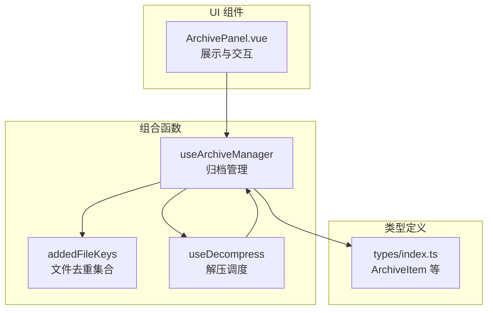
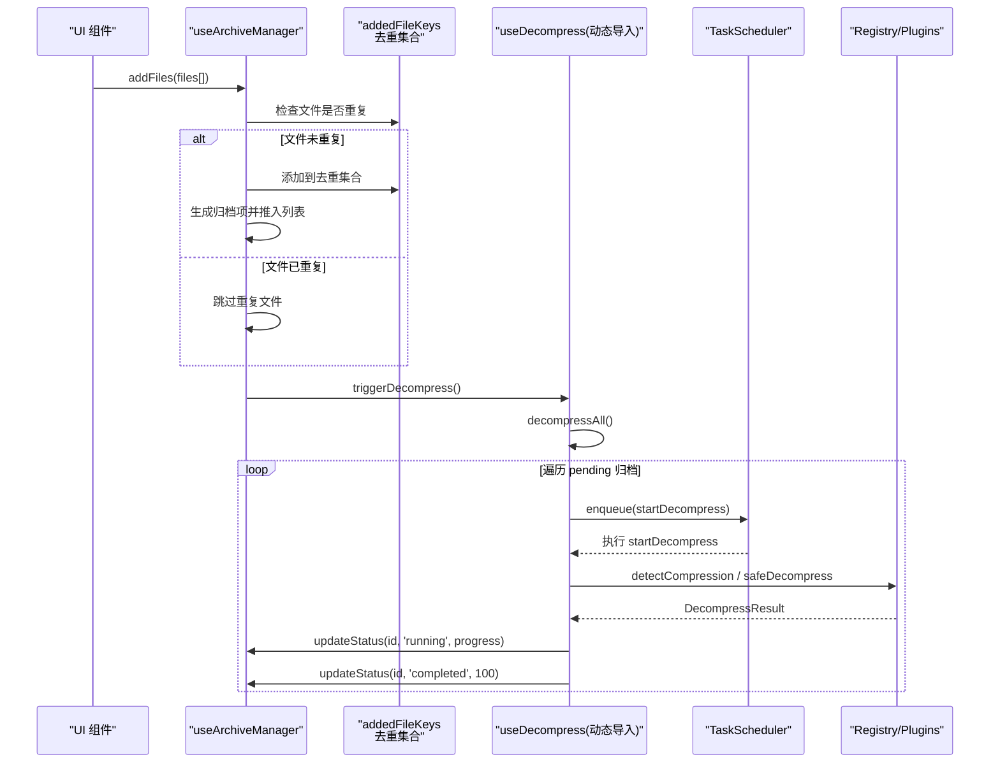
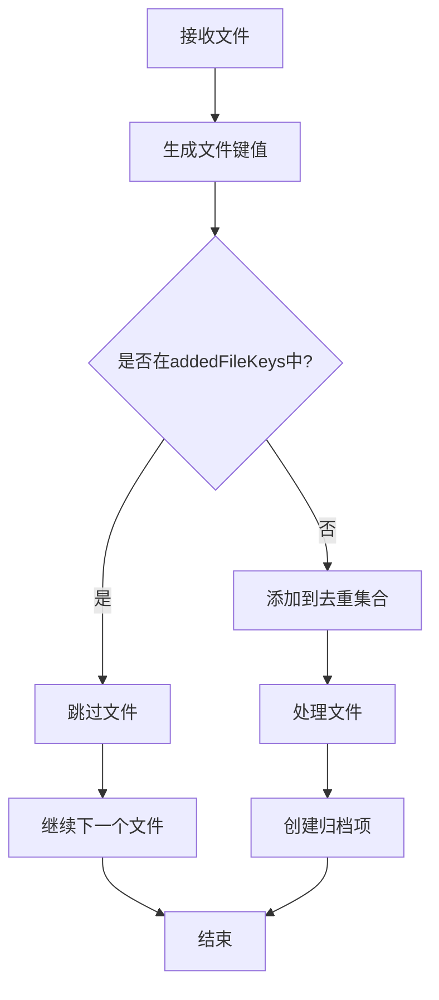
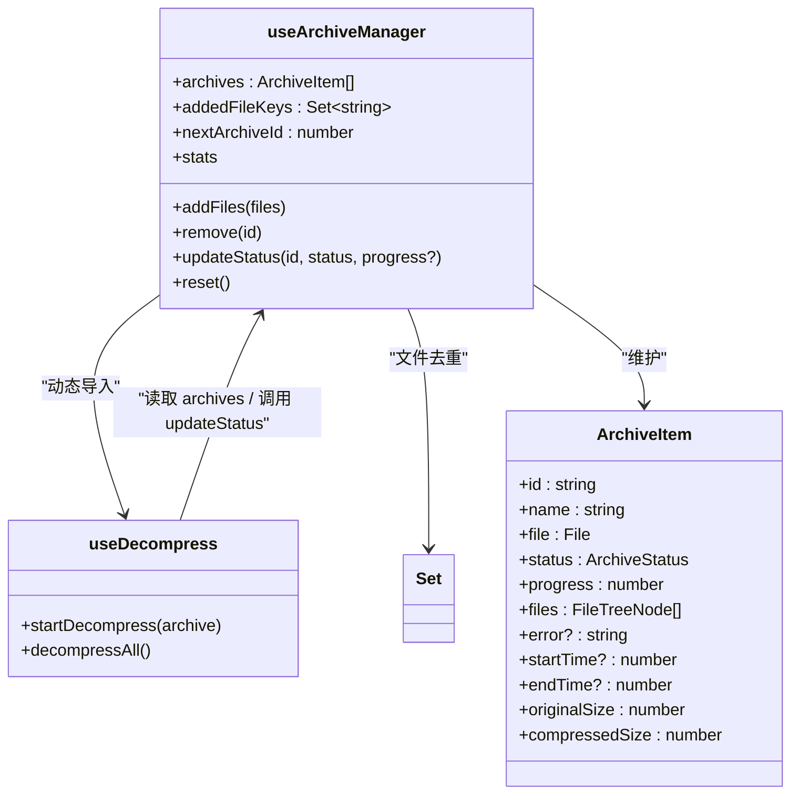

# 归档管理组合函数

<cite>
**本文引用的文件**   
- [src/composables/use-archives.ts](file://src/composables/use-archives.ts)
- [src/types/index.ts](file://src/types/index.ts)
- [src/composables/use-decompress.ts](file://src/composables/use-decompress.ts)
- [src/components/archive-panel/ArchivePanel.vue](file://src/components/archive-panel/ArchivePanel.vue)
- [src/__tests__/composables/use-archives.test.ts](file://src/__tests__/composables/use-archives.test.ts)
</cite>

## 更新摘要
**变更内容**   
- 新增文件去重机制，通过addedFileKeys Set跟踪已上传文件的唯一标识
- 实现fileKey函数生成文件名、大小和最后修改时间戳的组合键
- 在addFiles方法中集成去重逻辑，防止重复上传相同文件
- 在remove方法中同步清理去重集合中的文件记录
- 在reset方法中清空去重集合以确保状态一致性

## 目录
1. [简介](#简介)
2. [项目结构](#项目结构)
3. [核心组件](#核心组件)
4. [架构总览](#架构总览)
5. [详细组件分析](#详细组件分析)
6. [依赖关系分析](#依赖关系分析)
7. [性能考量](#性能考量)
8. [故障排查指南](#故障排查指南)
9. [结论](#结论)
10. [附录：API 使用示例与集成模式](#附录api-使用示例与集成模式)

## 简介
本文件为 useArchives（实际导出名为 useArchiveManager）组合函数的技术文档，聚焦于"文件归档管理"的核心逻辑。内容涵盖数据结构设计、文件添加流程、状态管理机制、异步解压触发机制、进度与时间戳记录、统计计算属性等，并提供 API 使用示例与集成建议，帮助读者快速理解并正确集成该模块。

**更新** 新增了智能文件去重机制，有效防止重复上传相同文件，提升用户体验和资源利用率。

## 项目结构
useArchiveManager 位于 composables 层，负责维护归档列表、提供增删改查与统计能力；通过动态导入懒加载 useDecompress 以触发解压任务；类型定义集中于 types 模块；UI 侧通过 ArchivePanel 消费 archives 数据。

**图表来源**
- [src/composables/use-archives.ts:1-81](file://src/composables/use-archives.ts#L1-L81)
- [src/composables/use-decompress.ts:1-74](file://src/composables/use-decompress.ts#L1-L74)
- [src/types/index.ts:1-71](file://src/types/index.ts#L1-L71)
- [src/components/archive-panel/ArchivePanel.vue:1-23](file://src/components/archive-panel/ArchivePanel.vue#L1-L23)

章节来源
- [src/composables/use-archives.ts:1-81](file://src/composables/use-archives.ts#L1-L81)
- [src/types/index.ts:1-71](file://src/types/index.ts#L1-L71)
- [src/components/archive-panel/ArchivePanel.vue:1-23](file://src/components/archive-panel/ArchivePanel.vue#L1-L23)

## 核心组件
- useArchiveManager：维护全局归档列表、提供 addFiles/remove/updateStatus/stats/reset 等方法，包含文件去重功能。
- ArchiveItem：归档项的数据模型，包含标识、名称、原始 File 引用、状态、进度、文件树、错误信息、起止时间与大小统计等字段。
- useDecompress：由 useArchiveManager 动态导入，负责将 pending 状态的归档项加入任务队列执行解压，并通过 updateStatus 更新状态与进度。

**更新** 新增文件去重机制，通过 addedFileKeys Set 和 fileKey 函数实现智能重复检测。

章节来源
- [src/composables/use-archives.ts:1-81](file://src/composables/use-archives.ts#L1-L81)
- [src/types/index.ts:34-46](file://src/types/index.ts#L34-L46)
- [src/composables/use-decompress.ts:1-74](file://src/composables/use-decompress.ts#L1-L74)

## 架构总览
useArchiveManager 作为"状态与编排中心"，在接收到新文件后创建归档项并触发解压；useDecompress 则基于插件引擎与任务调度器完成实际的解压工作，并在过程中回调 updateStatus 更新 UI 可见的状态与进度。

**图表来源**
- [src/composables/use-archives.ts:15-39](file://src/composables/use-archives.ts#L15-L39)
- [src/composables/use-decompress.ts:14-70](file://src/composables/use-decompress.ts#L14-L70)

## 详细组件分析

### 数据结构：ArchiveItem
- 标识与元信息：id、name、file（File 引用）、status、progress
- 结果与错误：files（文件树）、error
- 时间维度：startTime、endTime
- 容量维度：originalSize、compressedSize

复杂度与影响
- 空间复杂度：每个归档项 O(1)，文件树按实际节点数线性增长。
- 访问与更新：基于 id 的查找为 O(n)，n 为归档数量；通常 n 较小，开销可接受。

章节来源
- [src/types/index.ts:34-46](file://src/types/index.ts#L34-L46)

### 文件去重机制：addedFileKeys 与 fileKey
**新增功能** 实现了智能文件去重逻辑，防止用户重复上传相同的文件。

- **addedFileKeys**：Set<string> 类型的集合，存储已上传文件的唯一标识符
- **fileKey 函数**：生成文件唯一标识符，基于文件名、大小和最后修改时间戳的组合
- **去重策略**：只有当文件名、文件大小和最后修改时间戳完全相同时才视为重复文件

**图表来源**
- [src/composables/use-archives.ts:7-23](file://src/composables/use-archives.ts#L7-L23)

章节来源
- [src/composables/use-archives.ts:7-23](file://src/composables/use-archives.ts#L7-L23)

### 文件添加流程：addFiles
- 输入：File[]
- 处理：
  - **去重过滤**：遍历文件数组，使用 fileKey 生成唯一标识，通过 addedFileKeys 检查重复性
  - 为每个唯一 File 生成唯一 id（前缀 + 自增计数器），设置初始 status 为 pending，progress 为 0，files 为空数组，originalSize 为 0，compressedSize 取 file.size。
  - 将所有归档项推入内部列表。
  - 调用 triggerDecompress 启动后续解压流程。
- 输出：无直接返回值，副作用是更新 archives 列表并触发解压。

要点
- ID 生成策略：字符串拼接 + 单调递增整数，保证同进程内唯一性。
- 初始状态：pending，便于后续被 decompressAll 发现并处理。
- 压缩大小：初始即设置为浏览器 File.size，代表压缩包体积。
- **去重优化**：避免重复处理相同文件，减少不必要的资源消耗。

章节来源
- [src/composables/use-archives.ts:15-39](file://src/composables/use-archives.ts#L15-L39)

### 异步解压触发：triggerDecompress
- 采用动态 import 懒加载 use-decompress，避免主包体积膨胀与不必要的初始化。
- 获取 useDecompress 实例后调用 decompressAll，扫描所有 pending 归档并逐个入队。

优化点
- 懒加载：仅在需要时加载解压模块，减少首屏成本。
- 批处理：decompressAll 会一次性扫描并批量入队 pending 项，配合任务调度器控制并发。

章节来源
- [src/composables/use-archives.ts:41-45](file://src/composables/use-archives.ts#L41-L45)
- [src/composables/use-decompress.ts:64-70](file://src/composables/use-decompress.ts#L64-L70)

### 删除与去重同步：remove
- 参数：id
- 行为：
  - 根据 id 定位归档项
  - **同步清理**：从 addedFileKeys 中删除对应文件的去重标识
  - 从 archives 列表中移除对应归档项

**更新** 新增去重集合同步清理逻辑，确保删除操作后文件可以重新上传。

章节来源
- [src/composables/use-archives.ts:47-53](file://src/composables/use-archives.ts#L47-L53)

### 状态更新：updateStatus
- 参数：id、status、可选 progress
- 行为：
  - 根据 id 定位归档项并更新 status 与 progress。
  - 当 status 变为 running 且 startTime 未设置时，记录开始时间。
  - 当 status 变为 completed 时，记录结束时间。
- 注意：该方法不改变 files/originalSize/compressedSize，这些由解压流程写入。

状态转换规则（结合 useDecompress 的行为）
- pending → running：开始处理
- running → completed：成功完成
- running → failed：发生错误
- pending → failed：任务队列满或前置校验失败

章节来源
- [src/composables/use-archives.ts:55-63](file://src/composables/use-archives.ts#L55-L63)
- [src/composables/use-decompress.ts:14-62](file://src/composables/use-decompress.ts#L14-L62)

### 统计计算：stats
- 计算属性，响应式追踪 archives 变化。
- 指标：
  - totalCount：归档总数
  - totalCompressedSize：压缩包总大小（字节）
  - totalOriginalSize：解压后文件总大小（字节）
  - totalFiles：所有归档的文件树节点总数
  - decompressedCount：已完成（completed）的归档数量

复杂度
- 每次计算对 archives 进行多次 reduce/filter，时间复杂度 O(n)。由于 n 通常较小，性能可接受。

章节来源
- [src/composables/use-archives.ts:65-71](file://src/composables/use-archives.ts#L65-L71)

### 重置功能：reset
- 行为：
  - 清空 archives 列表
  - 重置自增计数器 nextArchiveId
  - **清空去重集合**：清除 addedFileKeys 中的所有记录

**更新** 新增去重集合清理逻辑，确保重置后系统状态完全恢复初始状态。

章节来源
- [src/composables/use-archives.ts:73-77](file://src/composables/use-archives.ts#L73-L77)

## 依赖关系分析
- useArchiveManager 依赖：
  - Vue ref/computed 提供响应式数据与派生值
  - types 中的 ArchiveItem 类型约束
  - 动态导入 use-decompress 以解耦解压实现
  - **新增**：Set 数据结构用于高效文件去重
- useDecompress 反向依赖：
  - 通过 useArchiveManager 提供的 archives 与 updateStatus 更新状态
  - 依赖 TaskScheduler 控制并发
  - 依赖 FileTreeBuilder 构建文件树
  - 依赖插件注册表检测与执行解压

**图表来源**
- [src/composables/use-archives.ts:1-81](file://src/composables/use-archives.ts#L1-L81)
- [src/composables/use-decompress.ts:1-74](file://src/composables/use-decompress.ts#L1-L74)
- [src/types/index.ts:34-46](file://src/types/index.ts#L34-L46)

章节来源
- [src/composables/use-archives.ts:1-81](file://src/composables/use-archives.ts#L1-L81)
- [src/composables/use-decompress.ts:1-74](file://src/composables/use-decompress.ts#L1-L74)
- [src/types/index.ts:1-71](file://src/types/index.ts#L1-L71)

## 性能考量
- 懒加载：triggerDecompress 使用动态 import，避免非必要的模块加载。
- 任务并发：useDecompress 内部使用 TaskScheduler 限制并发度，防止大文件解压阻塞主线程。
- 统计计算：stats 使用 computed 缓存，仅在 archives 变化时重新计算；若归档数量较大，可考虑增量统计或分片聚合。
- 内存占用：ArchiveItem.file 持有 File 引用，长时间保留可能增加内存压力；建议在不再需要时调用 remove 或 reset。
- **去重性能**：Set 数据结构提供 O(1) 时间复杂度的查找和插入操作，即使处理大量文件也能保持良好性能。

**更新** 新增文件去重机制的性能优势，Set 数据结构确保高效的重复检测。

## 故障排查指南
常见问题与定位思路
- 无法触发解压：确认 addFiles 是否调用了 triggerDecompress；检查 use-decompress 是否成功动态导入。
- 状态停留在 pending：查看 decompressAll 是否遍历到该归档；确认其 status 是否为 pending。
- 状态变为 failed：检查 error 字段；常见原因包括无匹配插件、解压失败、任务队列已满。
- 进度不更新：确认解压流程中是否多次调用 updateStatus 并传入 progress。
- 统计异常：确保 originalSize 与 compressedSize 在解压完成后已正确赋值。
- **文件重复问题**：检查 addedFileKeys 是否正确维护，确认 fileKey 生成的标识符是否符合预期。

**更新** 新增文件去重相关的故障排查指导。

章节来源
- [src/composables/use-decompress.ts:28-62](file://src/composables/use-decompress.ts#L28-L62)
- [src/composables/use-archives.ts:55-63](file://src/composables/use-archives.ts#L55-L63)

## 结论
useArchiveManager 提供了简洁而强大的归档管理能力：通过集中化的状态管理与统计，结合懒加载与任务调度，实现了可扩展、低耦合的归档与解压流程。配合 ArchiveItem 的清晰数据模型，既能满足当前需求，也为未来扩展（如多格式支持、断点续传、增量统计）预留了良好空间。

**更新** 新增的智能文件去重机制进一步提升了用户体验，避免了重复上传带来的资源浪费和界面混乱。

## 附录：API 使用示例与集成模式

### 基本用法
- 引入组合函数并获取方法：
  - 从 useArchiveManager 获取 archives、addFiles、remove、updateStatus、stats、reset。
- 添加文件：
  - 调用 addFiles([File, ...])，内部会自动创建归档项并触发解压。
  - **去重保护**：重复上传相同文件将被自动忽略，不会创建新的归档项。
- 监听状态与进度：
  - 通过 archives.value 观察每个归档项的 status、progress、error、startTime、endTime。
- 清理与重置：
  - 使用 remove(id) 删除单个归档；使用 reset() 清空全部并重置 ID 计数器。
  - **去重清理**：删除归档后会释放对应的去重标识，允许重新上传相同文件。

章节来源
- [src/composables/use-archives.ts:14-79](file://src/composables/use-archives.ts#L14-L79)
- [src/__tests__/composables/use-archives.test.ts:10-64](file://src/__tests__/composables/use-archives.test.ts#L10-L64)

### 与 UI 集成
- 在组件中使用：
  - 通过 useArchiveManager 暴露的 archives 渲染列表，绑定点击事件调用 remove。
- 上传区域：
  - 在 UploadZone 中收集用户选择的 File 列表，调用 addFiles 触发归档与解压。
  - **用户体验**：重复文件会被静默忽略，无需向用户显示错误提示。

章节来源
- [src/components/archive-panel/ArchivePanel.vue:1-23](file://src/components/archive-panel/ArchivePanel.vue#L1-L23)

### 错误处理建议
- 在模板层显示 error 字段提示用户。
- 对于 failed 状态，提供重试入口（例如再次调用 addFiles 或封装的重试方法）。
- 监控 stats.decompressedCount 与 totalCount 的差异，辅助判断整体成功率。
- **去重反馈**：虽然重复文件会被静默忽略，但可以在 UI 层面提供友好的提示信息。

章节来源
- [src/composables/use-decompress.ts:52-61](file://src/composables/use-decompress.ts#L52-L61)
- [src/composables/use-archives.ts:65-71](file://src/composables/use-archives.ts#L65-L71)

### 性能优化建议
- 大批量文件：分批 addFiles 或节流触发，避免一次性创建过多归档项导致 UI 卡顿。
- 大文件解压：合理配置 TaskScheduler 并发度，避免 I/O 竞争。
- 统计优化：如需频繁查询复杂统计，可在 useArchiveManager 内部维护增量计数器，降低 computed 的计算成本。
- **去重优化**：Set 数据结构的使用确保了高效的重复检测，即使处理大量文件也能保持良好的响应性能。

**更新** 新增去重机制的性能优化说明。